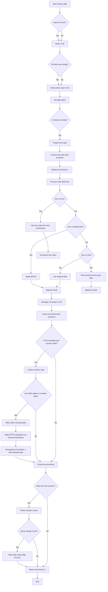

# `format_data.py`

## `hypertools.tools.format_data.format_data` · *function*

## Summary:
Formats mixed-type data (text, numerical, dataframe, geometric) into a standardized matrix representation suitable for downstream analysis.

## Description:
Processes input data that may contain various data types (strings, lists of strings, numerical arrays, pandas DataFrames, DataGeometry objects) and converts them into a uniform matrix format. The function handles text data through vectorization and semantic modeling, numerical data through standard conversion, and geometric data through recursive processing. It also applies dimensionality reduction for missing data and aligns different data types when appropriate.

This function is extracted to centralize data formatting logic and ensure consistent preprocessing across different parts of the hypertools library. It encapsulates the complexity of handling multiple data types and their transformations into a unified interface.

## Args:
    x: Input data that can be a single item or list of items. Items can be strings, lists of strings, numerical arrays, pandas DataFrames, or DataGeometry objects.
    vectorizer (str, optional): Text vectorizer to use for string data. Defaults to 'CountVectorizer'.
    semantic (str, optional): Semantic model for text processing. Defaults to 'LatentDirichletAllocation'.
    corpus (str, optional): Corpus to use for semantic modeling. Defaults to 'wiki'.
    ppca (bool, optional): Whether to apply PPCA for missing data imputation. Defaults to True.
    text_align (str, optional): Alignment method for text data. Defaults to 'hyper'.

## Returns:
    list[np.ndarray]: List of formatted numpy arrays, each representing a processed data item in a standardized matrix format. Each array has shape (n_samples, n_features) where n_samples is the number of data points and n_features is the number of features.

## Raises:
    TypeError: When unsupported data types are provided to the function.

## Constraints:
    Preconditions:
    - Input data must be one of supported types: strings, lists of strings, numerical arrays, pandas DataFrames, or DataGeometry objects
    - All data items must be compatible in terms of sample count when alignment is applied
    
    Postconditions:
    - All returned arrays have at least 2 dimensions (shape[0] > 0, shape[1] > 0)
    - Returned arrays are properly formatted for downstream analysis tools
    - All arrays have consistent number of samples when alignment is performed

## Side Effects:
    - Issues warnings when missing data is detected and imputed using PPCA
    - Issues warnings when numerical and text data are aligned to a common space
    - May modify global warning state through the warnings module

## Control Flow:


## Examples:
```python
# Format a single string
result = format_data("Hello world")

# Format mixed data types
text_data = ["This is a sentence", "Another sentence"]
numeric_data = [[1, 2, 3], [4, 5, 6]]
result = format_data([text_data, numeric_data])

# Format with custom parameters
result = format_data(["text1", "text2"], 
                     vectorizer='TfidfVectorizer', 
                     semantic='LatentDirichletAllocation')

# Format geometric data
from datageometry import DataGeometry
geo_data = DataGeometry([[1, 2], [3, 4]])
result = format_data(geo_data)
```

## `hypertools.tools.format_data.fill_missing` · *function*

*No documentation generated.*

