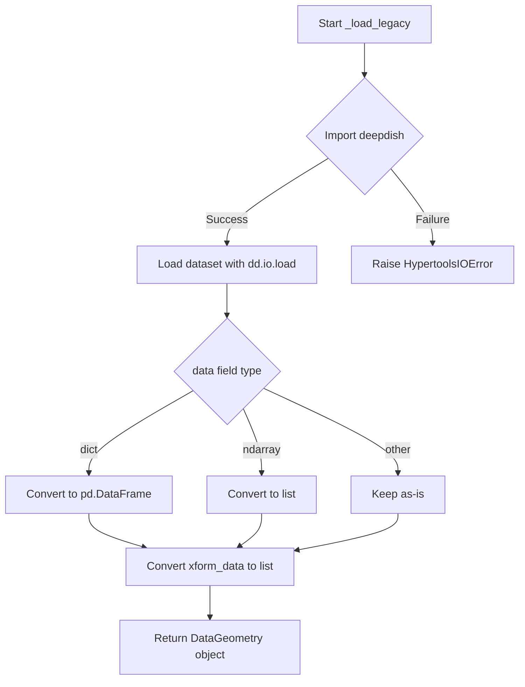

# `load.py`

## `hypertools.tools.load.load` · *function*

*No documentation generated.*

## `hypertools.tools.load._load_legacy` · *function*

## Summary:
Loads legacy-format dataset files into a DataGeometry object for processing.

## Description:
This function specifically handles loading datasets saved in the legacy deepdish format (prior to hypertools version 0.8.0). It reads the serialized data using deepdish, performs necessary type conversions on the data fields, and constructs a DataGeometry object for further analysis and visualization.

The function is called by the main `load` function when the `legacy=True` parameter is specified, allowing users to load older dataset files that were saved using the previous serialization format.

## Args:
    dataset_path (str): Path to the legacy-format dataset file (.h5 extension typically) that needs to be loaded.

## Returns:
    DataGeometry: A DataGeometry object containing the loaded data and transformation information from the legacy dataset.

## Raises:
    HypertoolsIOError: Raised when the deepdish module is not installed or when there are issues loading the dataset file.

## Constraints:
    Preconditions:
    - The dataset_path must point to a valid file that exists on disk
    - The deepdish module must be installed in the environment
    - The file at dataset_path must be in the legacy deepdish format
    
    Postconditions:
    - The returned DataGeometry object will have properly formatted data fields
    - The data field will be converted to either a pandas DataFrame (if originally a dict) or a list (if originally a numpy array)
    - The xform_data field will be converted to a list

## Side Effects:
    - Reads from the filesystem at the specified dataset_path
    - May raise ImportError if deepdish is not installed (though this is handled internally)

## Control Flow:


## Examples:
```python
# Load a legacy dataset file
from hypertools.tools.load import _load_legacy
geo_obj = _load_legacy('/path/to/legacy_dataset.h5')

# This would typically be called internally by:
# load('/path/to/legacy_dataset.h5', legacy=True)
```

## `hypertools.tools.load._load_example_data` · *function*

*No documentation generated.*

## `hypertools.tools.load._download_example_data` · *function*

*No documentation generated.*

