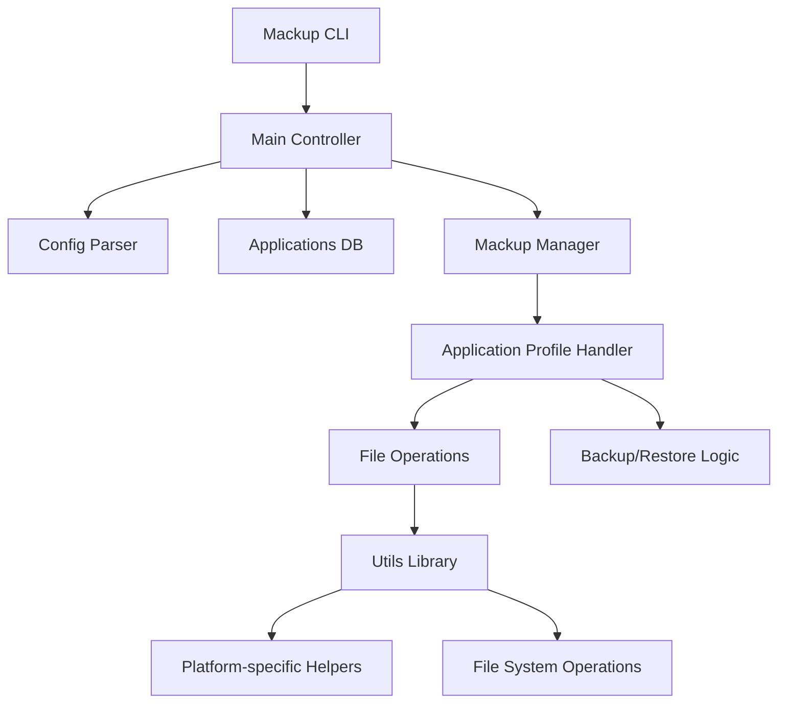

# `mackup`

## Repository-Level Documentation

### Tree:
```
mackup/
└── mackup/
    ├── __init__.py
    ├── application.py
    ├── appsdb.py
    ├── config.py
    ├── constants.py
    ├── main.py
    ├── mackup.py
    ├── utils.py
    └── apps/
        ├── __init__.py
        └── *.cfg files
```

### Purpose:
Mackup is a tool for backing up application configurations and dotfiles across different machines. It helps users maintain consistent settings and preferences regardless of which computer they're using. The tool creates symbolic links between configuration files in the user's home directory and a centralized backup location, supporting multiple cloud storage providers.

Target users include developers, power users, and anyone who wants to maintain consistent application settings across multiple machines. It's particularly useful for people who frequently switch between computers or want to preserve their development environment setup.

In the broader ecosystem, Mackup serves as a configuration management utility that integrates with cloud storage services like Dropbox, Google Drive, and others to provide seamless synchronization of user preferences and application settings.

### Architecture:


Key abstractions include:
- **Application Profile**: Manages backup/restore operations for individual applications
- **Applications Database**: Maintains list of supported applications and their configuration files
- **Configuration Manager**: Parses and validates user configuration
- **Mackup Manager**: Coordinates backup/restore/uninstall operations
- **Utility Functions**: Platform-specific helpers and file operations

### Entry Points:
1. **CLI Command**: `mackup` with subcommands:
   - `backup`: Backs up configuration files to storage
   - `restore`: Restores configuration files from storage  
   - `uninstall`: Removes Mackup and restores original files
   - `list`: Lists supported applications
   - `show <application>`: Shows details for a specific application

2. **Importable API**: The main `Mackup` class can be imported and used programmatically

### Core Features:
1. **Cross-platform Configuration Backup** - Supports Linux, macOS, and Windows
2. **Multiple Storage Providers** - Dropbox, Google Drive, Copy, iCloud, and filesystem storage
3. **Application-Specific Management** - Handles individual applications with their unique configuration files
4. **Dry Run Mode** - Test operations without making changes
5. **Selective Application Sync** - Configure which applications to backup/restore
6. **Custom Application Definitions** - Users can define their own application configurations

### Dependencies:
- Python 3.x
- Standard library modules: `os`, `sys`, `shutil`, `tempfile`, `configparser`, `subprocess`, `platform`, `stat`, `base64`, `sqlite3`
- Third-party libraries: `docopt` (for CLI argument parsing)

### Configuration:
Configuration is handled through a configuration mechanism that reads user settings from a configuration file in the user's home directory. The configuration supports:
- Storage engine selection (dropbox, google_drive, copy, icloud, fs)
- Storage path specification for filesystem engine
- Directory name for backup storage
- Applications to ignore or sync specifically

### Extension Points:
1. **Custom Applications**: Users can add `.cfg` files to extend the list of supported applications
2. **Storage Engines**: New storage providers can be added by implementing appropriate helper functions
3. **Application Profiles**: Custom application handling can be implemented by extending ApplicationProfile class

---

## Modules

- [`mackup`](mackup.md)

