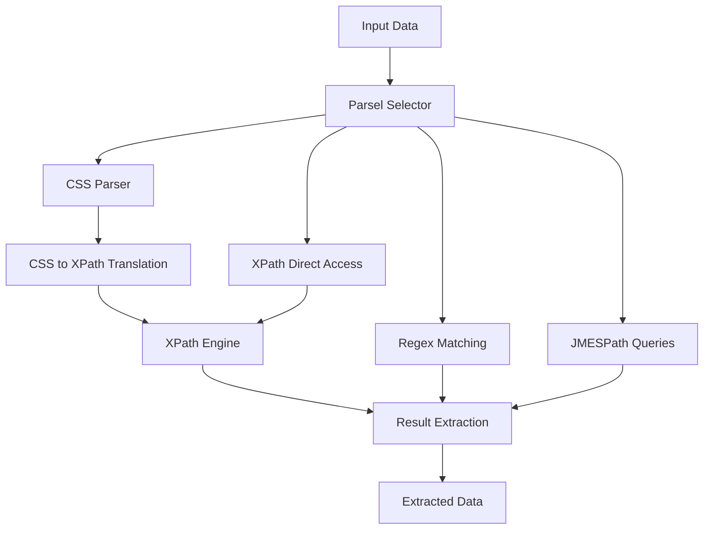

# `parsel`

## Tree:
    - parsel/
      - docs/
      - parsel/
        - __init__.py
        - csstranslator.py
        - selector.py
        - utils.py
        - xpathfuncs.py

## Purpose:
Parsel is a Python library designed for extracting data from HTML and XML documents using CSS selectors, XPath expressions, regular expressions, and JMESPath queries. It provides a convenient interface for parsing and extracting information from web pages and structured documents, making it particularly useful for web scraping and data extraction tasks.

The library serves as a wrapper around lxml's powerful parsing and querying capabilities, offering a simpler and more intuitive API while maintaining performance and flexibility. It handles various document types including HTML, XML, JSON, and plain text, with built-in support for namespace management, encoding handling, and safe parsing practices.

## Architecture:

Key abstractions and architectural patterns:
- **Selector Pattern**: The core `Selector` class encapsulates document parsing and querying capabilities
- **SelectorList Pattern**: Collections of selectors that support batch operations
- **Translation Layer**: CSS to XPath conversion using specialized translators
- **Pipeline Architecture**: Data flows through multiple processing stages (parsing → transformation → querying → extraction)
- **Plugin System**: XPath functions can be extended via `xpathfuncs` module

## Entry Points:
1. **Importable API**: 
   - `from parsel import Selector, SelectorList`
   - Main classes for document parsing and querying
   - Target audience: Web scrapers, data analysts, automation engineers

2. **CLI Commands**:
   - Not explicitly mentioned in the codebase, but could be implemented for command-line usage
   - Target audience: Command-line users, automation scripts

3. **Service Endpoints**:
   - Not part of the core library, but could be exposed in web applications
   - Target audience: Web application developers building scraping services

## Core Features:
1. **CSS Selectors**: Extract elements using CSS selector syntax
   - Implemented in `selector.Selector.css()` method
   - Uses `csstranslator` module for conversion to XPath

2. **XPath Expressions**: Direct XPath querying capability
   - Implemented in `selector.Selector.xpath()` method

3. **Regular Expression Matching**: Extract text using regex patterns
   - Implemented in `selector.Selector.re()` and `selector.Selector.re_first()` methods

4. **JMESPath Queries**: Query JSON data structures
   - Implemented in `selector.Selector.jmespath()` method

5. **Namespace Management**: Handle XML namespaces properly
   - Implemented in `selector.Selector.register_namespace()` and `selector.Selector.remove_namespaces()` methods

6. **Element Manipulation**: Remove/drop elements from parsed documents
   - Implemented in `selector.Selector.drop()` method

7. **Data Extraction**: Get text content from selected elements
   - Implemented in `selector.Selector.get()` and `selector.Selector.getall()` methods

## Dependencies:
- **lxml**: Core dependency for XML/HTML parsing and XPath execution
- **jmespath**: For JMESPath query support
- **w3lib**: For HTML entity replacement in regex matching
- **typing_extensions**: For type hinting support

Version constraints:
- Requires lxml version supporting huge_tree functionality for large documents
- Compatible with Python 3.7+

## Extension Points:
1. **XPath Functions**: Extend XPath capabilities via `xpathfuncs.set_xpathfunc()`
2. **Custom Translators**: Implement custom CSS to XPath translation logic
3. **New Document Types**: Add support for additional input formats through the selector initialization system
4. **Custom Selectors**: Inherit from `Selector` class to add domain-specific functionality

---

## Modules

- [`docs`](docs.md)
- [`parsel`](parsel.md)

