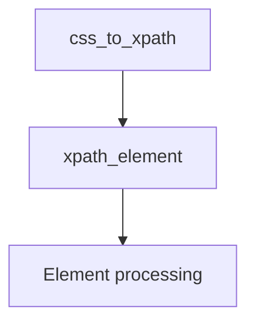

# `csstranslator.py`

## `parsel.csstranslator.XPathExpr` · *class*

*No documentation generated.*

### `parsel.csstranslator.XPathExpr.from_xpath` · *method*

*No documentation generated.*

### `parsel.csstranslator.XPathExpr.__str__` · *method*

*No documentation generated.*

### `parsel.csstranslator.XPathExpr.join` · *method*

## Summary:
Joins this XPath expression with another XPath expression using a combiner string, preserving textnode and attribute metadata.

## Description:
This method combines the current XPath expression with another XPath expression of the same type using the specified combiner operator. It ensures type compatibility between expressions and propagates special metadata (textnode flag and attribute name) from the joined expression to the current one. This method is typically called during CSS selector compilation when combining multiple CSS selectors into a single XPath expression.

## Args:
    combiner (str): The XPath combiner operator (e.g., '/', '//', etc.) to use for joining expressions
    other (OriginalXPathExpr): Another XPath expression to join with this one
    *args (Any): Additional positional arguments passed to the parent join method
    **kwargs (Any): Additional keyword arguments passed to the parent join method

## Returns:
    Self: Returns self to enable method chaining, allowing for fluent interface patterns

## Raises:
    ValueError: When the other expression is not an instance of XPathExpr (or its descendant type)

## State Changes:
    Attributes READ: None
    Attributes WRITTEN: 
        - self.textnode: Set to the value from the other expression
        - self.attribute: Set to the value from the other expression

## Constraints:
    Preconditions:
        - The other expression must be an instance of XPathExpr (or its descendant)
        - The combiner string must be valid for XPath expression joining
    Postconditions:
        - The current expression is modified to represent the joined result
        - The textnode and attribute properties are updated from the other expression
        - The returned object is the same instance (self)

## Side Effects:
    None

## `parsel.csstranslator.TranslatorProtocol` · *class*

## Summary:
Defines a structural protocol for CSS selector to XPath expression translation.

## Description:
The TranslatorProtocol specifies the interface that classes must implement to convert CSS selectors into XPath expressions. As a Protocol (structural type), it defines the contract that implementing classes must satisfy without requiring inheritance. This interface supports web scraping and DOM querying operations where CSS selectors need to be translated to XPath for efficient processing. Classes implementing this protocol include GenericTranslator and HTMLTranslator.

## State:
- No instance attributes as this is a Protocol/interface definition
- Method signatures are defined but specific return types are not specified in the protocol
- The protocol establishes the behavioral contract for CSS to XPath conversion

## Lifecycle:
- Creation: Implemented classes are instantiated directly (GenericTranslator, HTMLTranslator)
- Usage: Typically called through css_to_xpath() method with CSS selector strings
- Destruction: Managed automatically by Python's garbage collection

## Method Map:


## Raises:
- No explicit exceptions defined in the protocol itself
- Implementing classes may raise ExpressionError from cssselect.xpath when invalid CSS is provided
- Specific exception types depend on the implementing class

## Example:
```python
# Using a translator implementation
translator = GenericTranslator()
xpath_expr = translator.css_to_xpath("div.container p")
# Returns XPath expression string like "//div[@class='container']//p"
```

### `parsel.csstranslator.TranslatorProtocol.xpath_element` · *method*

## Summary:
Translates a CSS Element selector into an XPath expression for XPath query construction.

## Description:
Converts a single CSS selector element (such as a tag name, class, or ID) into its equivalent XPath representation. This method serves as a fundamental building block in the CSS-to-XPath translation pipeline, handling the conversion of individual CSS selector components into XPath expressions that can be combined to form complete XPath queries.

As part of a protocol-based architecture, this method defines the interface for CSS selector translation. Concrete implementations (such as GenericTranslator and HTMLTranslator) provide the actual translation logic, while this protocol ensures consistent behavior across different translator variants.

## Args:
    selector (Element): A cssselect.parser.Element object representing a single CSS selector component such as a tag name, class selector, ID selector, or attribute selector.

## Returns:
    OriginalXPathExpr: An XPath expression type that represents the translated CSS selector component. This expression is compatible with XPath query execution systems and can be combined with other XPath expressions to form complete XPath queries.

## Raises:
    ExpressionError: When the selector cannot be translated to XPath due to unsupported syntax, invalid structure, or unsupported CSS selector features.

## State Changes:
    Attributes READ: None
    Attributes WRITTEN: None

## Constraints:
    Preconditions: 
    - The selector parameter must be a valid cssselect.parser.Element instance
    - The method should only be called within the context of a CSS-to-XPath translation process
    
    Postconditions:
    - The returned expression is compatible with XPath query execution systems
    - The expression accurately represents the semantic meaning of the input CSS selector component

## Side Effects:
    None

### `parsel.csstranslator.TranslatorProtocol.css_to_xpath` · *method*

*No documentation generated.*

## `parsel.csstranslator.TranslatorMixin` · *class*

*No documentation generated.*

### `parsel.csstranslator.TranslatorMixin.xpath_element` · *method*

*No documentation generated.*

### `parsel.csstranslator.TranslatorMixin.xpath_pseudo_element` · *method*

*No documentation generated.*

### `parsel.csstranslator.TranslatorMixin.xpath_attr_functional_pseudo_element` · *method*

*No documentation generated.*

### `parsel.csstranslator.TranslatorMixin.xpath_text_simple_pseudo_element` · *method*

*No documentation generated.*

## `parsel.csstranslator.GenericTranslator` · *class*

*No documentation generated.*

### `parsel.csstranslator.GenericTranslator.css_to_xpath` · *method*

*No documentation generated.*

## `parsel.csstranslator.HTMLTranslator` · *class*

*No documentation generated.*

### `parsel.csstranslator.HTMLTranslator.css_to_xpath` · *method*

*No documentation generated.*

## `parsel.csstranslator.css2xpath` · *function*

*No documentation generated.*

