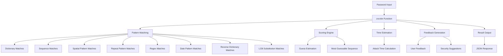

# `zxcvbn-python`

## Tree:
```
zxcvbn-python/
└── zxcvbn/
    ├── __init__.py
    ├── __main__.py
    ├── feedback.py
    ├── matching.py
    ├── scoring.py
    └── time_estimates.py
```

### Responsibilities:
- **zxcvbn/__init__.py**: Main entry point providing the `zxcvbn()` function that evaluates password strength
- **zxcvbn/__main__.py**: Command-line interface for interactive password strength checking
- **zxcvbn/feedback.py**: Provides user-friendly feedback and suggestions based on password analysis
- **zxcvbn/matching.py**: Implements various pattern matching algorithms to identify common password patterns
- **zxcvbn/scoring.py**: Calculates the number of guesses required to crack passwords based on identified patterns
- **zxcvbn/time_estimates.py**: Estimates how long it would take to crack passwords under different attack scenarios

## Purpose:
The zxcvbn-python library is a password strength estimation tool that goes beyond simple character counting to provide meaningful security assessments. It analyzes passwords for common patterns, dictionary words, sequences, and other predictable elements to estimate how long it would take to crack them using various attack methods.

### Target Users:
- Security engineers building authentication systems
- Application developers integrating password strength validation
- System administrators enforcing password policies
- Developers creating password quality tools

### Usage Scenarios:
- Real-time password validation in web applications
- Batch processing of password databases for security auditing
- Educational tools to teach password security concepts
- Password policy enforcement systems

## Architecture:


### Key Abstractions:
- **Pattern Matching Pipeline**: Sequential application of multiple matching algorithms to identify password weaknesses
- **Scoring Algorithm**: Uses dynamic programming to find the most likely way to guess the password
- **Attack Time Estimator**: Computes cracking times for various attack scenarios (online/offline, with/without throttling)
- **Feedback Generator**: Translates technical results into human-readable security advice

## Entry Points:
### Importable API:
- **`zxcvbn(password, user_inputs=None)`**: Main function that returns comprehensive password strength analysis
  - **Args**:
    - `password` (str): Password to analyze
    - `user_inputs` (list[str], optional): User-specific information to check against
  - **Returns**: Dictionary containing strength metrics, attack times, and feedback

### Command-Line Interface:
- **`python -m zxcvbn`**: Interactive command-line tool for password analysis
  - **Usage**: Run without arguments to enter password interactively, or pipe password via stdin
  - **Args**: `--user-input` flag to provide user-specific information for analysis

## Core Features:
- **Pattern Recognition**: Identifies dictionary words, sequences, spatial patterns, repeated characters, and more
- **Advanced Scoring**: Uses sophisticated algorithms to calculate minimum guesses needed to crack passwords
- **Multi-Scenario Timing**: Estimates cracking times for online attacks (with throttling), offline attacks (fast/slow hashing)
- **Human-Friendly Feedback**: Provides actionable security suggestions based on password weaknesses
- **Customizable Inputs**: Allows inclusion of user-specific information in password analysis
- **Comprehensive Reporting**: Returns detailed metrics including guess counts, attack times, and security score

## Dependencies:
- **Python Standard Library**: Uses `datetime`, `json`, `re`, `select`, `getpass`, `math`, `decimal`, `collections`, `itertools`
- **External Libraries**: None - pure Python implementation

## Configuration:
None - the library uses hardcoded dictionaries and constants for its analysis. All configuration happens through function parameters.

## Extension Points:
- **Pattern Matching**: New pattern matchers can be added to the `omnimatch` function
- **Dictionary Lists**: Additional frequency lists can be added via `add_frequency_lists` function
- **Scoring Algorithms**: Custom guess estimation functions can be implemented
- **Feedback Logic**: New feedback rules can be added to the feedback module

---

## Modules

- [`zxcvbn`](zxcvbn.md)

