# `zxcvbn`

## Tree:
zxcvbn/
├── __init__.py
├── __main__.py
├── feedback.py
├── matching.py
├── scoring.py
└── time_estimates.py

## Role:
Evaluates password strength by analyzing patterns and estimating guessability

## Description:
The zxcvbn module provides a comprehensive password strength estimation system that analyzes various patterns in passwords to compute how long it would take to crack them. It's designed to replace simple password complexity requirements with intelligent analysis of actual password characteristics.

This module is primarily used by the main zxcvbn function to assess password security and provide detailed feedback to users about their password choices. It's consumed by both the command-line interface and any application requiring robust password strength checking.

The components are grouped together because they form a cohesive system for password strength analysis, with matching identifying patterns, scoring calculating guess probabilities, and feedback providing user guidance.

## Components:
*   `zxcvbn.__init__.zxcvbn` - Main function that orchestrates password strength analysis
*   `zxcvbn.__main__.JSONEncoder` - Custom JSON encoder for serializing results
*   `zxcvbn.__main__.cli` - Command-line interface function
*   `zxcvbn.feedback.get_dictionary_match_feedback` - Provides feedback for dictionary-based matches
*   `zxcvbn.feedback.get_feedback` - Generates overall feedback based on password analysis
*   `zxcvbn.feedback.get_match_feedback` - Provides feedback for specific match patterns
*   `zxcvbn.matching.add_frequency_lists` - Adds custom frequency lists to the matching engine
*   `zxcvbn.matching.build_ranked_dict` - Creates ranked dictionaries from ordered lists
*   `zxcvbn.matching.date_match` - Identifies date patterns in passwords
*   `zxcvbn.matching.dictionary_match` - Finds dictionary words in passwords
*   `zxcvbn.matching.enumerate_l33t_subs` - Enumerates possible l33t substitutions
*   `zxcvbn.matching.l33t_match` - Detects l33t-speak patterns in passwords
*   `zxcvbn.matching.map_ints_to_dm` - Maps integers to day/month format
*   `zxcvbn.matching.map_ints_to_dmy` - Maps integers to day/month/year format
*   `zxcvbn.matching.omnimatch` - Runs all matching functions on a password
*   `zxcvbn.matching.regex_match` - Identifies regex pattern matches
*   `zxcvbn.matching.relevant_l33t_subtable` - Determines relevant l33t substitutions for a password
*   `zxcvbn.matching.repeat_match` - Finds repeated character/sequence patterns
*   `zxcvbn.matching.reverse_dictionary_match` - Detects reversed dictionary words
*   `zxcvbn.matching.sequence_match` - Identifies sequential character patterns
*   `zxcvbn.matching.spatial_match` - Finds spatial patterns on keyboards
*   `zxcvbn.matching.spatial_match_helper` - Helper function for spatial pattern matching
*   `zxcvbn.matching.translate` - Translates characters using substitution maps
*   `zxcvbn.matching.two_to_four_digit_year` - Converts 2-digit years to 4-digit format
*   `zxcvbn.scoring.bruteforce_guesses` - Estimates guesses for brute force attacks
*   `zxcvbn.scoring.calc_average_degree` - Calculates average degree of a graph
*   `zxcvbn.scoring.date_guesses` - Estimates guesses for date patterns
*   `zxcvbn.scoring.dictionary_guesses` - Calculates guesses for dictionary matches
*   `zxcvbn.scoring.estimate_guesses` - Estimates total guesses for a match
*   `zxcvbn.scoring.l33t_variations` - Calculates variations for l33t substitutions
*   `zxcvbn.scoring.most_guessable_match_sequence` - Finds the most likely match sequence
*   `zxcvbn.scoring.nCk` - Computes combinations (n choose k)
*   `zxcvbn.scoring.regex_guesses` - Estimates guesses for regex patterns
*   `zxcvbn.scoring.repeat_guesses` - Calculates guesses for repeated patterns
*   `zxcvbn.scoring.sequence_guesses` - Estimates guesses for sequential patterns
*   `zxcvbn.scoring.spatial_guesses` - Calculates guesses for spatial keyboard patterns
*   `zxcvbn.scoring.uppercase_variations` - Computes variations for uppercase letters
*   `zxcvbn.time_estimates.display_time` - Formats time estimates for display
*   `zxcvbn.time_estimates.estimate_attack_times` - Calculates attack time estimates
*   `zxcvbn.time_estimates.float_to_decimal` - Converts floats to decimals for precision
*   `zxcvbn.time_estimates.guesses_to_score` - Converts guess count to security score

```mermaid
graph TD
    A[zxcvbn.__init__.zxcvbn] --> B[zxcvbn.matching.omnimatch]
    A --> C[zxcvbn.scoring.most_guessable_match_sequence]
    A --> D[zxcvbn.time_estimates.estimate_attack_times]
    A --> E[zxcvbn.feedback.get_feedback]
    B --> F[zxcvbn.matching.dictionary_match]
    B --> G[zxcvbn.matching.reverse_dictionary_match]
    B --> H[zxcvbn.matching.l33t_match]
    B --> I[zxcvbn.matching.spatial_match]
    B --> J[zxcvbn.matching.repeat_match]
    B --> K[zxcvbn.matching.sequence_match]
    B --> L[zxcvbn.matching.regex_match]
    B --> M[zxcvbn.matching.date_match]
    C --> N[zxcvbn.scoring.estimate_guesses]
    C --> O[zxcvbn.scoring.bruteforce_guesses]
    C --> P[zxcvbn.scoring.dictionary_guesses]
    C --> Q[zxcvbn.scoring.spatial_guesses]
    C --> R[zxcvbn.scoring.repeat_guesses]
    C --> S[zxcvbn.scoring.sequence_guesses]
    C --> T[zxcvbn.scoring.regex_guesses]
    C --> U[zxcvbn.scoring.date_guesses]
    D --> V[zxcvbn.time_estimates.guesses_to_score]
    D --> W[zxcvbn.time_estimates.display_time]
    E --> X[zxcvbn.feedback.get_match_feedback]
    X --> Y[zxcvbn.feedback.get_dictionary_match_feedback]
```

## Public API:
*   `zxcvbn(password, user_inputs=None)` - Main function to analyze password strength
    *   Analyzes password for various patterns and estimates guessability
    *   Returns comprehensive analysis including score, time estimates, and feedback
*   `zxcvbn.__main__.cli()` - Command-line interface for password analysis
    *   Reads password from stdin or prompts user
    *   Outputs JSON-formatted analysis results using JSONEncoder
*   `zxcvbn.matching.add_frequency_lists(frequency_lists_)` - Adds custom frequency lists
    *   Allows extending the dictionary matching with custom word lists

## Dependencies:
*   Internal imports:
    *   `zxcvbn.matching` - Pattern matching functionality
    *   `zxcvbn.scoring` - Guess estimation calculations
    *   `zxcvbn.time_estimates` - Attack time calculations
    *   `zxcvbn.feedback` - User feedback generation
*   External imports:
    *   `datetime` - Time measurement for performance tracking
    *   `json` - JSON serialization for CLI output only
    *   `getpass` - Secure password input from terminal
    *   `select` - Input handling for CLI
    *   `re` - Regular expression matching for pattern detection
    *   `math` - Mathematical operations for calculations
    *   `decimal` - High-precision decimal arithmetic for guess calculations

## Constraints:
*   Password analysis is computationally intensive for very long passwords
*   All functions expect properly formatted inputs (strings, lists, etc.)
*   The module assumes standard ASCII character sets for pattern matching
*   Thread-safe: No shared mutable state between function calls
*   Initialization: No special setup required, all functions are self-contained

---

## Files

- [`__init__.py`](zxcvbn/__init__.md)
- [`__main__.py`](zxcvbn/__main__.md)
- [`feedback.py`](zxcvbn/feedback.md)
- [`matching.py`](zxcvbn/matching.md)
- [`scoring.py`](zxcvbn/scoring.md)
- [`time_estimates.py`](zxcvbn/time_estimates.md)

