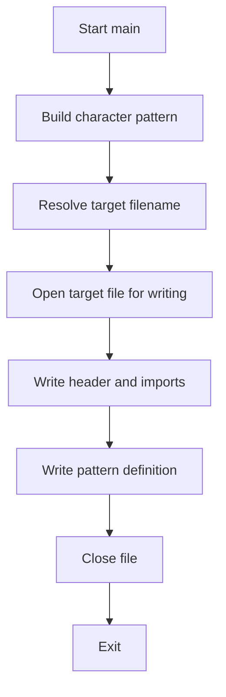

# `generate_identifier_pattern.py`

## `scripts.generate_identifier_pattern.get_characters` · *function*

## Summary:
Generates Unicode characters that are valid Python identifier characters but not considered word characters by regular expressions.

## Description:
This function systematically examines all Unicode code points to find characters that satisfy two conditions: (1) when prefixed with 'a', the result forms a valid Python identifier, and (2) the character itself does not match the \w regular expression pattern. This is useful for identifying special Unicode characters that can be used in identifiers but are treated differently by regex engines.

## Args:
    None

## Returns:
    Generator[str]: A generator yielding Unicode characters that are valid Python identifiers when prefixed with 'a' but are not word characters according to regex.

## Raises:
    None explicitly raised

## Constraints:
    Preconditions:
        - System must support full Unicode range via sys.maxunicode
        - Python's identifier rules must be standard
    
    Postconditions:
        - Each yielded character c satisfies: ("a" + c).isidentifier() == True AND re.match(r"\w", c) == None

## Side Effects:
    None

## Control Flow:
```mermaid
flowchart TD
    A[Initialize code point iterator] --> B[Get character from code point]
    B --> C{("a" + s).isidentifier()?}
    C -->|No| D[Next code point]
    C -->|Yes| E{not re.match(r"\w", s)?}
    E -->|No| D
    E -->|Yes| F[Yield character]
    F --> G[Next code point]
    D --> H{End of Unicode range?}
    H -->|No| B
    H -->|Yes| I[Stop iteration]
```

## Examples:
    >>> gen = get_characters()
    >>> first_char = next(gen)
    >>> first_char
    '€'  # Example output (actual may vary by system)
    >>> ("a" + first_char).isidentifier()
    True
    >>> re.match(r"\w", first_char)
    None
```

## `scripts.generate_identifier_pattern.collapse_ranges` · *function*

## Summary:
Groups consecutive characters in a string into ranges by analyzing ASCII value differences.

## Description:
This function processes a string to identify contiguous character sequences based on ASCII values. It uses itertools.groupby to group characters that form consecutive sequences, then yields the start and end characters of each such sequence. This extraction allows for clean separation of the range-finding logic from higher-level processing.

## Args:
    data (str): A string containing characters to be grouped into ranges.

## Returns:
    Generator[Tuple[str, str]]: A generator yielding tuples of (start_char, end_char) representing ranges of consecutive characters in the input string.

## Raises:
    None explicitly raised.

## Constraints:
    Preconditions:
        - Input data should be a string.
    Postconditions:
        - Each yielded tuple represents a contiguous range of characters from the input.
        - The function correctly handles non-consecutive characters by treating them as separate ranges.

## Side Effects:
    None.

## Control Flow:
```mermaid
flowchart TD
    A[Input data string] --> B[Enumerate characters with indices]
    B --> C[Group by (ord(char) - index)]
    C --> D{For each group}
    D --> E[Convert group to list]
    E --> F{Get first and last elements}
    F --> G[Yield (first_char, last_char)]
    G --> H[Continue to next group]
```

## Examples:
    Example 1: collapse_ranges("abc") yields ("a", "c") - consecutive characters
    Example 2: collapse_ranges("ace") yields ("a", "a"), ("c", "c"), ("e", "e") - non-consecutive characters
    Example 3: collapse_ranges("xyz") yields ("x", "z") - another consecutive sequence
    Example 4: collapse_ranges("abdf") yields ("a", "b"), ("d", "d"), ("f", "f") - mixed consecutive/non-consecutive
```

## `scripts.generate_identifier_pattern.build_pattern` · *function*

## Summary:
Constructs a string pattern representing character ranges in a compact form.

## Description:
Transforms a sequence of character pairs into a string representation where consecutive characters are expressed as ranges (e.g., 'a-z') or individual characters. This function is used to efficiently represent identifier patterns for validation or matching purposes.

## Args:
    ranges (list[tuple[str, str]]): A list of tuples where each tuple contains two characters defining a range. The first character is the start of the range, and the second is the end.

## Returns:
    str: A string representing the compacted character ranges. Single characters are represented as-is, two-character ranges are represented as separate characters, and multi-character ranges are represented in the format 'start-end'.

## Raises:
    None explicitly raised.

## Constraints:
    Preconditions:
        - Each tuple in ranges must contain exactly two characters.
        - Characters in each tuple must be valid ASCII characters.
    Postconditions:
        - The returned string will be a concatenation of the processed ranges.
        - The order of ranges in the input list is preserved in the output string.

## Side Effects:
    None.

## Control Flow:
```mermaid
flowchart TD
    A[Start build_pattern] --> B[Initialize empty output list]
    B --> C{For each range (a,b) in ranges}
    C --> D{a == b?}
    D -->|Yes| E[Append a to output]
    D -->|No| F{ord(b) - ord(a) == 1?}
    F -->|Yes| G[Append a to output]
    F -->|No| H[Append "{a}-{b}" to output]
    G --> I[Append b to output]
    I --> J[Next range]
    E --> J
    H --> J
    J --> K{More ranges?}
    K -->|Yes| C
    K -->|No| L[Join output list into string]
    L --> M[Return result]
```

## Examples:
    >>> build_pattern([('a', 'c'), ('e', 'e'), ('g', 'h')])
    'abcegh'
    >>> build_pattern([('a', 'z')])
    'a-z'
    >>> build_pattern([('x', 'y'), ('a', 'b')])
    'xyab'
```

## `scripts.generate_identifier_pattern.main` · *function*

## Summary:
Generates a regular expression pattern for validating Python identifier characters by combining standard word characters with special Unicode characters.

## Description:
Writes a Python file containing a compiled regular expression pattern that matches valid Python identifiers. The pattern includes standard word characters (\w) plus additional Unicode characters identified as valid identifier starters but not matched by \w. This function serves as a build script to automatically generate identifier validation patterns for Jinja2's internal use.

## Args:
    None

## Returns:
    None

## Raises:
    None explicitly raised

## Constraints:
    Preconditions:
        - The script must be run from the scripts/ directory
        - The target file path must be writable
        - Python's identifier rules must be standard
    Postconditions:
        - The target file is overwritten with a new pattern definition
        - The generated pattern correctly identifies valid Python identifiers

## Side Effects:
    - Writes to a file at src/jinja2/_identifier.py
    - Modifies the contents of the target file

## Control Flow:


## Examples:
    >>> # Run from scripts/ directory
    >>> main()
    # Creates src/jinja2/_identifier.py with:
    # import re
    # 
    # # generated by scripts/generate_identifier_pattern.py
    # pattern = re.compile(
    #     r"[\w€-™]+"  # noqa: B950
    # )
```

