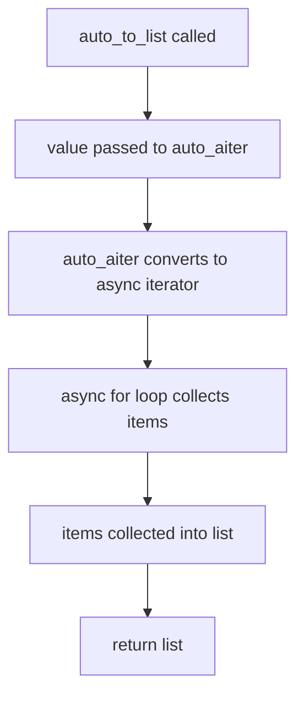

# `async_utils.py`

## `src.jinja2.async_utils.async_variant` · *function*

## Summary:
Creates an asynchronous variant decorator that enables a synchronous function to be called asynchronously or synchronously based on the environment's async mode.

## Description:
This function serves as a decorator factory that generates a decorator capable of wrapping both synchronous and asynchronous versions of a function. It determines whether to execute the synchronous or asynchronous version based on the Jinja2 environment's async mode. The decorator handles argument passing and ensures proper function metadata preservation. The function is designed to work with Jinja2's template rendering system where functions may be called in either synchronous or asynchronous contexts.

## Args:
    normal_func (callable): The synchronous version of the function to be wrapped.

## Returns:
    callable: A decorator function that accepts an asynchronous function and returns a wrapper that can dispatch to either the sync or async version.

## Raises:
    None explicitly raised.

## Constraints:
    - Preconditions: The `normal_func` must be a callable that can be inspected for the `jinja_pass_arg` attribute.
    - Postconditions: The returned wrapper function will have the `jinja_async_variant` attribute set to `True`.

## Side Effects:
    - None directly observable.
    - May modify the `jinja_pass_arg` attribute of the wrapped function if `need_eval_context` is true.

## Control Flow:
```mermaid
flowchart TD
    A[async_variant called with normal_func] --> B[decorator function created]
    B --> C[pass_arg determined from normal_func]
    C --> D{pass_arg is environment?}
    D -->|Yes| E[is_async checks args[0].is_async]
    D -->|No| F[is_async checks args[0].environment.is_async]
    E --> G[wrapper function created]
    F --> G
    G --> H[wrapper called with args/kwargs]
    H --> I{need_eval_context?}
    I -->|Yes| J[args[1:] used]
    I -->|No| J[args unchanged]
    J --> K{is_async result?}
    K -->|True| L[async_func called]
    K -->|False| M[normal_func called]
    L --> N[return async result]
    M --> N
    N --> O[wrapper.jinja_async_variant = True]
```

## Examples:
```python
# Define synchronous function
@async_variant(sync_func)
async def async_func():
    pass

# Usage would depend on the Jinja2 environment's async mode
# If environment.is_async is True, async_func is called
# Otherwise, sync_func is called
```

## `src.jinja2.async_utils.auto_await` · *function*

## Summary:
Asynchronously awaits a value that may be either a regular value or an awaitable object, returning the resolved value.

## Description:
This function serves as a utility for handling values that could be either synchronous values or asynchronous awaitable objects. It automatically detects and awaits the appropriate value type, making it easier to work with mixed synchronous and asynchronous code paths. The function is particularly useful in template rendering contexts where values might come from either synchronous or asynchronous sources.

## Args:
    value (Union[Awaitable[V], V]): A value that is either an awaitable object (like a coroutine) or a regular value of type V. The type V is a generic type variable representing the expected return type.

## Returns:
    V: The resolved value, either directly returned if it's not awaitable, or awaited and returned if it is an awaitable.

## Raises:
    None explicitly raised by this function.

## Constraints:
    - Preconditions: The input value must be of type Union[Awaitable[V], V] where V is a valid type.
    - Postconditions: The returned value is always of type V, regardless of whether the input was awaitable or not.

## Side Effects:
    - May perform asynchronous operations if the input value is awaitable.
    - No I/O operations or external state mutations occur.

## Control Flow:
```mermaid
flowchart TD
    A[Start auto_await] --> B{type(value) in _common_primitives?}
    B -- Yes --> C[Return cast(value, V)]
    B -- No --> D{inspect.isawaitable(value)?}
    D -- Yes --> E[Await and return cast(value, Awaitable[V])]
    D -- No --> F[Return cast(value, V)]
```

## Examples:
```python
# Example 1: Synchronous value
result = await auto_await(42)  # Returns 42

# Example 2: Asynchronous value
async def get_value():
    return "hello"
result = await auto_await(get_value())  # Returns "hello"
```

## `src.jinja2.async_utils.auto_aiter` · *function*

## Summary:
Converts either an async or sync iterable into an async iterator, enabling uniform asynchronous consumption of data sources.

## Description:
This utility function provides a bridge between synchronous and asynchronous iteration protocols by detecting whether the input supports async iteration and yielding items accordingly. It is commonly used in template rendering contexts where data might come from either synchronous or asynchronous sources.

## Args:
    iterable (Union[AsyncIterable[V], Iterable[V]]): An input that can be either a synchronous iterable or an asynchronous iterable. The type parameter V represents the type of items yielded by the iterable.

## Returns:
    AsyncIterator[V]: An async iterator that yields items from the input iterable, regardless of whether it's synchronous or asynchronous.

## Raises:
    None explicitly raised by this function.

## Constraints:
    Preconditions:
        - The input must be an object that implements either the synchronous iterable protocol (__iter__) or the asynchronous iterable protocol (__aiter__)
        - The input must be compatible with the type parameter V
    
    Postconditions:
        - The returned value is always an async iterator
        - All items from the input iterable are yielded exactly once

## Side Effects:
    None.

## Control Flow:
```mermaid
flowchart TD
    A[auto_aiter called] --> B{hasattr(iterable, "__aiter__")}
    B -- True --> C[async for item in iterable]
    B -- False --> D[for item in iterable]
    C --> E[yield item]
    D --> E
    E --> F[return async iterator]
```

## Examples:
```python
# Usage with async iterable
async def async_data():
    for i in range(3):
        yield i

async def example1():
    async for item in auto_aiter(async_data()):
        print(item)  # Prints 0, 1, 2

# Usage with sync iterable
async def example2():
    async for item in auto_aiter([1, 2, 3]):
        print(item)  # Prints 1, 2, 3
```

## `src.jinja2.async_utils.auto_to_list` · *function*

## Summary:
Converts either an async or sync iterable into a list, enabling uniform handling of mixed data sources in asynchronous contexts.

## Description:
This utility function provides a bridge between synchronous and asynchronous iteration protocols by converting any iterable (whether sync or async) into a concrete list. It leverages the `auto_aiter` helper to normalize the input into an async iterator before collecting all items into a list. This function is particularly useful in template rendering where data sources might be either synchronous or asynchronous, ensuring consistent processing regardless of the underlying data source type.

## Args:
    value (Union[AsyncIterable[V], Iterable[V]]): An input that can be either a synchronous iterable or an asynchronous iterable. The type parameter V represents the type of items yielded by the iterable.

## Returns:
    List[V]: A list containing all items from the input iterable, regardless of whether it's synchronous or asynchronous.

## Raises:
    None explicitly raised by this function.

## Constraints:
    Preconditions:
        - The input must be an object that implements either the synchronous iterable protocol (__iter__) or the asynchronous iterable protocol (__aiter__)
        - The input must be compatible with the type parameter V
    
    Postconditions:
        - The returned value is always a list
        - All items from the input iterable are included in the result exactly once

## Side Effects:
    None.

## Control Flow:


## Examples:
```python
# Usage with async iterable
async def async_data():
    for i in range(3):
        yield i

async def example1():
    result = await auto_to_list(async_data())
    print(result)  # Prints [0, 1, 2]

# Usage with sync iterable
async def example2():
    result = await auto_to_list([1, 2, 3])
    print(result)  # Prints [1, 2, 3]
```

