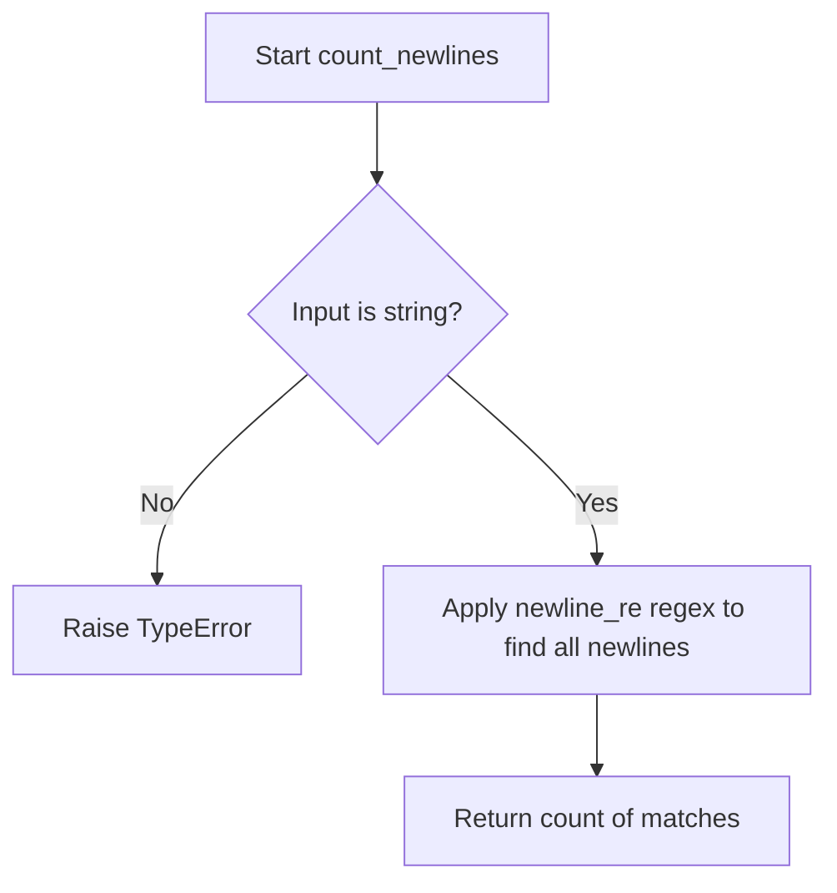
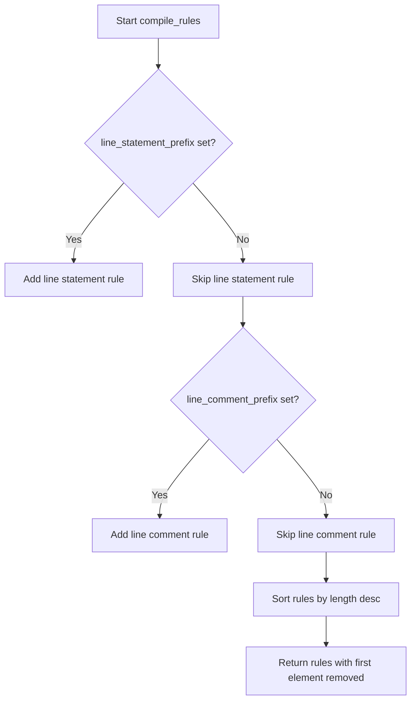
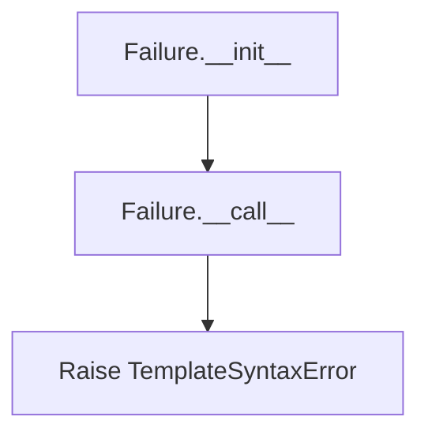
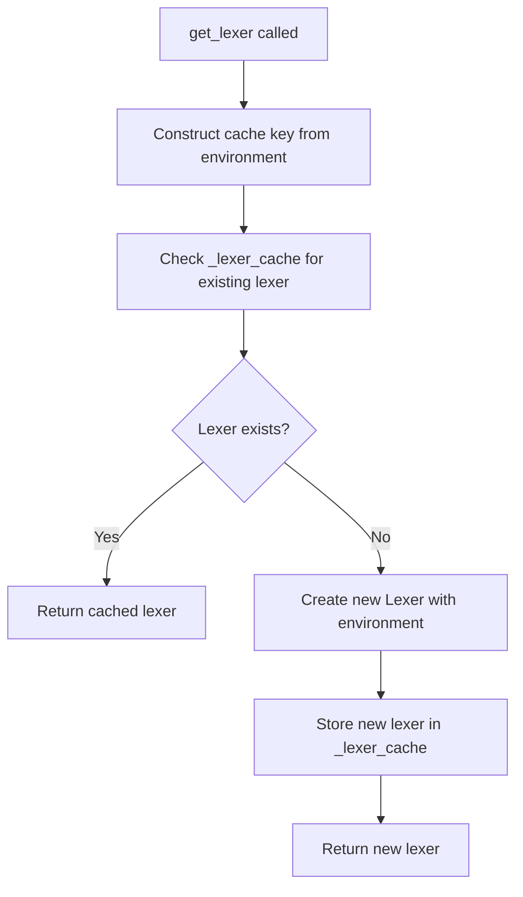
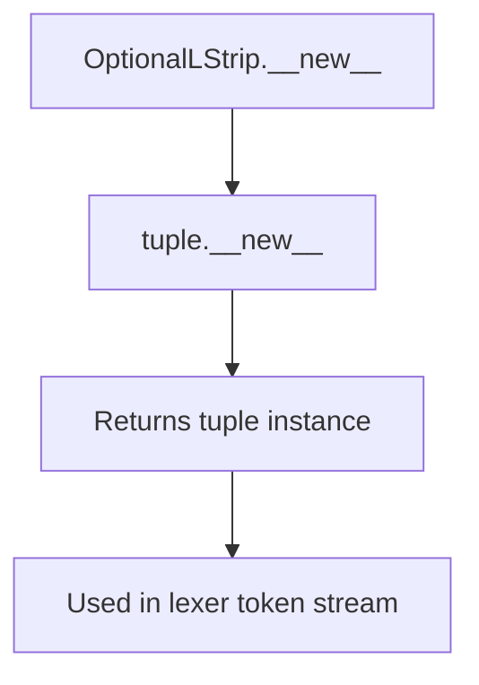
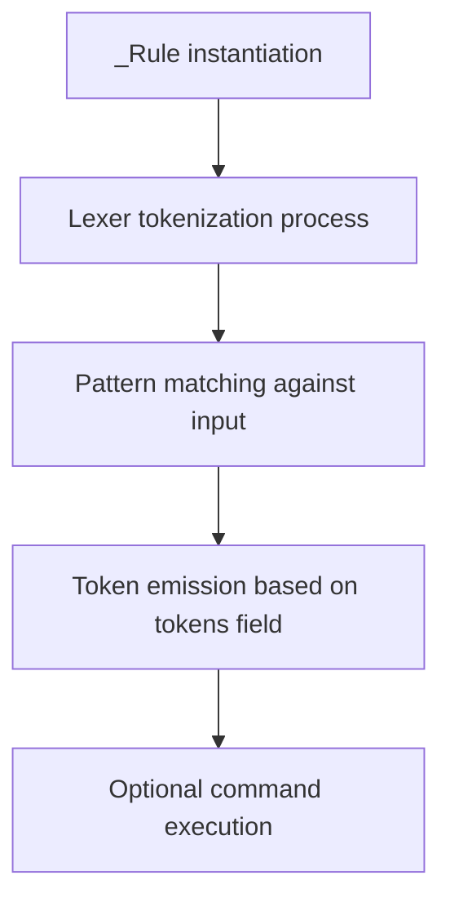
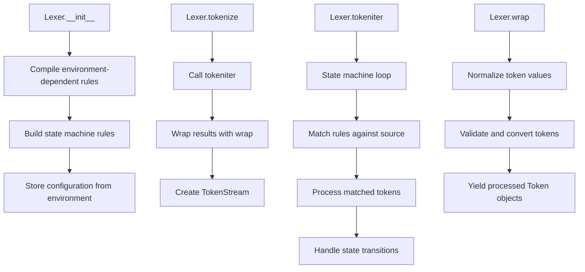

# `lexer.py`

## `src.jinja2.lexer._describe_token_type` · *function*

## Summary:
Maps internal token type identifiers to human-readable descriptive strings for debugging and error reporting.

## Description:
This utility function translates internal token type identifiers into meaningful descriptions that help developers understand the nature of tokens during template parsing and debugging. It serves as a bridge between low-level token representations and high-level semantic meanings.

The function handles two categories of token types:
1. Operator tokens that are stored in a reverse_operators mapping
2. Standard token types defined by constants like TOKEN_COMMENT_BEGIN, TOKEN_BLOCK_BEGIN, etc.

This extraction into a separate function improves code organization by centralizing token description logic and making debugging messages more readable.

## Args:
    token_type (str): The internal identifier for a token type, such as "TOKEN_COMMENT_BEGIN" or "OPERATOR_ADD".

## Returns:
    str: A human-readable description of the token type. For standard tokens, returns predefined descriptions. For operator tokens, returns their mapped descriptions. For unknown tokens, returns the original token_type string unchanged.

## Raises:
    None explicitly raised.

## Constraints:
    Preconditions:
    - The input token_type must be a string representing a valid token identifier
    - The token_type should either be present in reverse_operators dictionary or be one of the predefined token constants defined in the lexer module
    
    Postconditions:
    - Always returns a string value
    - For known token types, returns a descriptive string
    - For unknown token types, returns the original token_type unchanged

## Side Effects:
    None.

## Control Flow:
```mermaid
flowchart TD
    A[Input token_type] --> B{token_type in reverse_operators?}
    B -- Yes --> C[Return reverse_operators[token_type]]
    B -- No --> D[Lookup in token mapping dict]
    D --> E{token_type found?}
    E -- Yes --> F[Return description]
    E -- No --> G[Return token_type]
```

## Examples:
    >>> _describe_token_type("TOKEN_COMMENT_BEGIN")
    "begin of comment"
    
    >>> _describe_token_type("OPERATOR_ADD")
    "addition operator"
    
    >>> _describe_token_type("UNKNOWN_TOKEN")
    "UNKNOWN_TOKEN"

## `src.jinja2.lexer.describe_token` · *function*

## Summary:
Returns a human-readable description of a token, optimized for display in debugging contexts and error messages.

## Description:
This function provides a convenient way to obtain a descriptive string representation of a token for debugging and logging purposes. When the token is of type NAME, it directly returns the token's value, which is often the most useful representation for identifiers and literals. For all other token types, it delegates to `_describe_token_type` to provide standardized descriptions.

The function is designed to be called from the `Token.__str__` method, ensuring that tokens can be easily converted to their string representations for debugging and error reporting.

## Args:
    token (Token): A token object containing line number, type, and value information.

## Returns:
    str: For NAME tokens, returns the token's value directly. For all other tokens, returns a human-readable description of the token type obtained from `_describe_token_type`.

## Raises:
    None explicitly raised.

## Constraints:
    Preconditions:
    - The token argument must be a valid Token instance with properly initialized lineno, type, and value attributes.
    - The token.type attribute must be a string representing a valid token type identifier.
    
    Postconditions:
    - Always returns a string value
    - For NAME tokens, the returned value matches token.value exactly
    - For non-NAME tokens, the returned value is a descriptive string from _describe_token_type

## Side Effects:
    None.

## Control Flow:
```mermaid
flowchart TD
    A[Input token] --> B{token.type == TOKEN_NAME?}
    B -- Yes --> C[Return token.value]
    B -- No --> D[Return _describe_token_type(token.type)]
```

## Examples:
    >>> token = Token(1, "TOKEN_NAME", "variable_name")
    >>> describe_token(token)
    "variable_name"
    
    >>> token = Token(1, "TOKEN_COMMENT_BEGIN", "##")
    >>> describe_token(token)
    "begin of comment"

## `src.jinja2.lexer.describe_token_expr` · *function*

## Summary:
Transforms token expression strings into human-readable descriptions by parsing type-value pairs or delegating to standard token type description logic.

## Description:
This function processes token expressions that may be in the format "type:value" or simply "type". When the expression contains a colon separator, it splits the string and checks if the type portion matches a special constant TOKEN_NAME. If so, it returns the value portion directly. Otherwise, it delegates to the _describe_token_type function to handle the type portion.

The function serves as a utility for debugging and error reporting in Jinja2's template parsing system, providing meaningful descriptions of token types while maintaining backward compatibility with existing token representation formats.

## Args:
    expr (str): A token expression string that may be in the format "type:value" or simply "type".

## Returns:
    str: A human-readable description of the token. If the expression is in "type:value" format and the type equals TOKEN_NAME, returns the value portion. Otherwise, returns the result of _describe_token_type applied to the type portion.

## Raises:
    None explicitly raised.

## Constraints:
    Preconditions:
    - The input expr must be a string
    - If expr contains a colon, the part before the colon must be a valid token type identifier
    - If expr contains a colon and the type equals TOKEN_NAME, the part after the colon must be a valid value to return directly
    
    Postconditions:
    - Always returns a string value
    - If expr contains a colon and type equals TOKEN_NAME, returns the value portion directly
    - If expr contains a colon but type doesn't equal TOKEN_NAME, or expr doesn't contain a colon, returns result of _describe_token_type(type)

## Side Effects:
    None.

## Control Flow:
```mermaid
flowchart TD
    A[Input expr] --> B{":" in expr?}
    B -- Yes --> C[type, value = expr.split(":", 1)]
    C --> D{type == TOKEN_NAME?}
    D -- Yes --> E[Return value]
    D -- No --> F[Return _describe_token_type(type)]
    B -- No --> G[type = expr]
    G --> H[Return _describe_token_type(type)]
```

## Examples:
    >>> describe_token_expr("TOKEN_NAME:some_identifier")
    "some_identifier"
    
    >>> describe_token_expr("TOKEN_COMMENT_BEGIN")
    "begin of comment"
    
    >>> describe_token_expr("OPERATOR_ADD:plus")
    "plus"

## `src.jinja2.lexer.count_newlines` · *function*

## Summary:
Counts the number of newline characters in a string using a predefined regex pattern.

## Description:
This function counts newline characters in a string by applying a compiled regular expression pattern designed to match various newline formats. It is used internally by the Jinja2 template lexer to track line numbers and position information during template parsing. The function is typically called when processing template content to maintain accurate line counting for error reporting and debugging purposes.

## Args:
    value (str): The input string to count newlines in.

## Returns:
    int: The total number of newline characters found in the input string.

## Raises:
    None explicitly raised.

## Constraints:
    Preconditions:
        - The input value must be a string.
    Postconditions:
        - The return value is always a non-negative integer representing the count of newline characters.
        - The function does not modify the input string.

## Side Effects:
    None.

## Control Flow:


## Examples:
    >>> count_newlines("hello\\nworld")
    1
    >>> count_newlines("line1\\nline2\\nline3")
    2
    >>> count_newlines("no newlines here")
    0
```

## `src.jinja2.lexer.compile_rules` · *function*

## Summary:
Compiles a list of tokenization rules for Jinja2 template parsing based on environment configuration.

## Description:
This function generates a list of regular expression patterns and their associated token types that are used by the Jinja2 lexer to identify different elements in templates such as comments, blocks, variables, line statements, and line comments. It dynamically constructs these rules based on the configuration settings in the provided Environment object.

The function is extracted into its own component to separate the rule compilation logic from the actual lexing process, making the lexer more modular and easier to test. This allows the lexer to be configured with different template syntaxes while maintaining consistent rule processing.

## Args:
    environment (Environment): The Jinja2 environment configuration containing template syntax settings like comment_start_string, block_start_string, variable_start_string, line_statement_prefix, and line_comment_prefix.

## Returns:
    list[tuple[str, str]]: A list of tuples where each tuple contains a token type string and a compiled regular expression pattern string. The list is sorted by rule priority (longest match first). Each tuple represents a parsing rule with the format (token_type, regex_pattern).

## Raises:
    None explicitly raised by this function.

## Constraints:
    Preconditions:
    - The environment parameter must be a valid Environment instance
    - All string configuration fields in the environment should be properly initialized
    
    Postconditions:
    - The returned list is sorted in descending order of rule length (priority)
    - Each tuple in the result contains exactly two elements: token type and regex pattern

## Side Effects:
    None.

## Control Flow:


## Examples:
    # Basic usage with default environment
    env = Environment()
    rules = compile_rules(env)
    # Returns: [('TOKEN_COMMENT_BEGIN', r'\{#'), ('TOKEN_BLOCK_BEGIN', r'\{%), ('TOKEN_VARIABLE_BEGIN', r'\{\{')]
    
    # Usage with custom line prefixes
    env = Environment(line_statement_prefix='%%', line_comment_prefix='#')
    rules = compile_rules(env)
    # Returns: [('TOKEN_COMMENT_BEGIN', r'\{#'), ('TOKEN_BLOCK_BEGIN', r'\{%), ('TOKEN_VARIABLE_BEGIN', r'\{\{'), ('TOKEN_LINESTATEMENT_BEGIN', r'^[ \t\v]*%%'), ('TOKEN_LINECOMMENT_BEGIN', r'(?:^|(?<=\S))[^\S\r\n]*#')]

## `src.jinja2.lexer.Failure` · *class*

## Summary:
A callable error factory that creates and raises template syntax errors with specified messages and locations.

## Description:
The `Failure` class serves as a lazy error constructor that delays the creation of a `TemplateSyntaxError` until it is actually invoked. This pattern allows error messages to be constructed with contextual information like line numbers and filenames at the point of failure rather than at the point of definition. It is commonly used in lexing operations where syntax errors need to be reported with precise location information.

## State:
- `message` (str): The error message to be included in the raised exception. Must be a string describing the syntax error.
- `error_class` (Type[TemplateSyntaxError]): The exception class to raise. Defaults to `TemplateSyntaxError` but can be overridden for custom error types.

## Lifecycle:
- Creation: Instantiate with an error message and optional error class. The error is not raised during initialization.
- Usage: Call the instance with `lineno` and `filename` arguments to raise the configured exception.
- Destruction: No explicit cleanup required as it simply raises an exception.

## Method Map:


## Raises:
- `TemplateSyntaxError`: Raised when `__call__` is invoked with the configured message, line number, and filename.

## Example:
```python
# Create a failure handler
failure_handler = Failure("Unexpected token", TemplateSyntaxError)

# Later during lexing, raise the error with context
failure_handler(42, "template.html")
# This raises: TemplateSyntaxError("Unexpected token", 42, "template.html")
```

### `src.jinja2.lexer.Failure.__init__` · *method*

## Summary:
Initializes a Failure exception handler with a message and error class.

## Description:
The `__init__` method sets up a Failure instance by storing the error message and the exception class to be raised later. This method is part of the Failure class that acts as a factory for creating template syntax errors with specific messages and locations.

## Args:
    message (str): The error message to be included in the raised exception.
    cls (t.Type[TemplateSyntaxError], optional): The exception class to raise. Defaults to TemplateSyntaxError.

## Returns:
    None: This method does not return any value.

## Raises:
    No exceptions are raised by this method directly.

## State Changes:
    Attributes READ: None
    Attributes WRITTEN: 
        - self.message: Stores the error message
        - self.error_class: Stores the exception class to be raised

## Constraints:
    Preconditions:
        - The message argument must be a string
        - The cls argument must be a subclass of TemplateSyntaxError or TemplateSyntaxError itself
    Postconditions:
        - self.message is set to the provided message
        - self.error_class is set to the provided class or TemplateSyntaxError if not provided

## Side Effects:
    None: This method performs no I/O operations or external service calls.

### `src.jinja2.lexer.Failure.__call__` · *method*

## Summary:
Raises a template syntax error with the stored message at the specified line number and filename.

## Description:
This method serves as a callable interface for raising template syntax errors. It is designed to be invoked during Jinja2 template parsing when a lexical analysis failure occurs. The method uses the error class and message previously stored in the Failure instance to construct and raise an appropriate exception.

## Args:
    lineno (int): The line number in the template file where the error occurred.
    filename (str): The name of the template file where the error occurred.

## Returns:
    None: This method never returns as it raises an exception.

## Raises:
    TemplateSyntaxError: Raised with the stored message, line number, and filename.

## State Changes:
    Attributes READ: self.message, self.error_class
    Attributes WRITTEN: None

## Constraints:
    Preconditions: The Failure instance must have been properly initialized with a message and error_class.
    Postconditions: This method will always raise an exception and never return normally.

## Side Effects:
    I/O: None
    External service calls: None
    Mutations to objects outside self: None

## `src.jinja2.lexer.Token` · *class*

## Summary:
Represents a lexical token produced by the Jinja2 template lexer, encapsulating line number, token type, and token value for parsing and error handling.

## Description:
The Token class serves as an immutable data structure that represents a single lexical token in a Jinja2 template. It is used throughout the template parsing process to track the position, type, and content of each token encountered during lexing. Tokens are created by the lexer and consumed by the parser to construct the abstract syntax tree.

This class is designed as a NamedTuple for immutability and efficient memory usage, providing a clean interface for token inspection and matching operations. It integrates with the lexer's error reporting system through its string representation, which provides human-readable descriptions for debugging and error messages.

## State:
- lineno: int
  - Type: integer representing the line number in the source template where this token was found
  - Valid range: positive integers starting from 1
  - Invariant: Must be a positive integer indicating a valid line position in the source file
  
- type: str  
  - Type: string identifier representing the token's category (e.g., "TOKEN_NAME", "TOKEN_OPERATOR")
  - Valid values: String constants defined in the lexer module (e.g., "TOKEN_NAME", "TOKEN_COMMENT_BEGIN", "OPERATOR_ADD")
  - Invariant: Must be a valid token type identifier recognized by the lexer
  
- value: str
  - Type: string containing the actual text content of the token
  - Valid range: Any string representing the literal value found in the template
  - Invariant: Must represent the exact character sequence that was matched by the lexer

## Lifecycle:
- Creation: Tokens are instantiated by the lexer during the tokenization process, typically through factory methods or direct construction with line number, type, and value parameters
- Usage: Once created, tokens are typically passed to the parser and used for matching operations via the test() and test_any() methods
- Destruction: No explicit cleanup required; tokens are garbage collected when no longer referenced

## Method Map:
```mermaid
flowchart TD
    A[Token Constructor] --> B[Token Object]
    B --> C[test(expr)]
    B --> D[test_any(*iterable)]
    B --> E[__str__()]
    E --> F[describe_token()]
    F --> G[_describe_token_type()]
```

## Raises:
- No exceptions are raised during Token instantiation as it's a simple data structure
- The __str__ method relies on describe_token() which doesn't raise exceptions
- The test() and test_any() methods don't raise exceptions but may behave unexpectedly if passed malformed expressions

## Example:
```python
# Creating a token
token = Token(1, "TOKEN_NAME", "variable")

# Using token methods
print(str(token))  # Displays human-readable description
print(token.test("TOKEN_NAME"))  # Returns True
print(token.test_any("TOKEN_NAME", "TOKEN_OPERATOR"))  # Returns True
```

### `src.jinja2.lexer.Token.__str__` · *method*

## Summary:
Returns a human-readable string representation of a token for debugging and error reporting.

## Description:
This method provides a convenient way to obtain a descriptive string representation of a token. It delegates to the `describe_token` function to generate a formatted string that includes the token's type and value information. This method is primarily used for debugging, logging, and displaying token information in error messages.

The method is called during string conversion operations (like `str(token)`) and ensures that tokens can be easily visualized and understood in development contexts.

## Args:
    None explicitly taken, uses self

## Returns:
    str: A human-readable description of the token that includes its type and value information, suitable for debugging and error reporting.

## Raises:
    None explicitly raised

## State Changes:
    Attributes READ: 
    - self.type: Used to determine token type for description
    - self.value: Used to get token value for NAME tokens

## Constraints:
    Preconditions:
    - The Token instance must have valid lineno, type, and value attributes
    - The token.type must be a valid token type identifier
    
    Postconditions:
    - Always returns a string value
    - The returned string is appropriate for debugging and error reporting

## Side Effects:
    None

### `src.jinja2.lexer.Token.test` · *method*

## Summary:
Tests whether the token matches a given expression pattern, supporting both simple type matching and type-value pair matching.

## Description:
This method evaluates whether the current token matches a specified expression. It supports two modes: simple type matching where the token's type is compared directly to the expression, and type-value pair matching where the expression contains a colon separator to specify both type and value. This method is used during template parsing to validate token sequences against expected patterns.

The method is commonly used in lexer state machines and parser validation logic to check if a token conforms to expected formats during template compilation.

## Args:
    expr (str): The expression to test against the token. Can be either:
        - A simple type string (e.g., "name", "number") that matches self.type directly
        - A type:value pair separated by a colon (e.g., "name:foo", "number:42") that matches both self.type and self.value

## Returns:
    bool: True if the token matches the expression, False otherwise.

## Raises:
    None explicitly raised.

## State Changes:
    Attributes READ: self.type, self.value
    Attributes WRITTEN: None

## Constraints:
    Preconditions: The token object must have valid type and value attributes.
    Postconditions: The method returns a boolean indicating match status without modifying the token object.

## Side Effects:
    None.

### `src.jinja2.lexer.Token.test_any` · *method*

## Summary:
Tests whether the token matches any of the provided expression patterns.

## Description:
This method evaluates if the current token matches any of the given expression patterns by delegating to the individual `test` method for each expression. It provides a convenient way to check multiple possible matches in a single call, making it useful for lexer state transitions and parser validation logic where multiple token types or patterns might be acceptable.

## Args:
    *iterable (str): Variable length argument list of expression patterns to test against the token. Each expression can be either:
        - A simple type string (e.g., "name", "number") that matches self.type directly
        - A type:value pair separated by a colon (e.g., "name:foo", "number:42") that matches both self.type and self.value

## Returns:
    bool: True if the token matches any of the provided expression patterns, False otherwise.

## Raises:
    None explicitly raised.

## State Changes:
    Attributes READ: self.type, self.value (through delegation to test method)
    Attributes WRITTEN: None

## Constraints:
    Preconditions: The token object must have valid type and value attributes, and each expression in iterable must be a valid pattern for the test method.
    Postconditions: The result is a boolean indicating match success for any expression without modifying the token object.

## Side Effects:
    None

## `src.jinja2.lexer.TokenStreamIterator` · *class*

## Summary:
An iterator that provides sequential access to tokens from a Jinja2 template token stream, enabling consumption of parsed tokens in a loop-based manner.

## Description:
The TokenStreamIterator class implements the iterator protocol to enable sequential traversal of tokens within a Jinja2 template token stream. It serves as a bridge between the token stream and client code that needs to process tokens one at a time, such as during template parsing. This class is typically instantiated internally by the TokenStream class and should not be directly constructed by external code.

The iterator advances through tokens in the stream, automatically handling end-of-file conditions by closing the underlying stream and raising StopIteration when appropriate. This abstraction allows parsers to consume tokens in a clean, Pythonic way while maintaining proper resource management.

## State:
- stream: TokenStream
  - Type: TokenStream instance
  - Valid range: Must be a valid TokenStream object that has not been closed
  - Invariant: The stream must remain valid throughout the iterator's lifetime and must support the iterator protocol

## Lifecycle:
- Creation: Instantiated by TokenStream.__iter__() method, not intended for direct construction
- Usage: Used in for-loops or with next() function to iterate through tokens sequentially
- Destruction: Automatically cleaned up when StopIteration is raised or when the parent TokenStream is closed

## Method Map:
```mermaid
flowchart TD
    A[TokenStreamIterator.__iter__()] --> B[Returns self]
    B --> C[TokenStreamIterator.__next__()]
    C --> D{token.type is TOKEN_EOF?}
    D -- Yes --> E[stream.close()]
    D -- No --> F[next(stream)]
    F --> G[return token]
    E --> H[StopIteration]
```

## Raises:
- StopIteration: Raised when the iterator encounters an end-of-file token (TOKEN_EOF), signaling the completion of token iteration

## Example:
```python
# Typical usage within Jinja2 parsing context
token_stream = TokenStream(generator, name, filename)
for token in token_stream:
    # Process each token
    print(f"Token: {token}")

# Or manually using next()
iterator = iter(token_stream)
try:
    while True:
        token = next(iterator)
        # Process token
except StopIteration:
    # End of stream reached
    pass
```

### `src.jinja2.lexer.TokenStreamIterator.__init__` · *method*

## Summary:
Initializes a TokenStreamIterator with a token stream for iteration.

## Description:
This method sets up the iterator to traverse tokens from a provided token stream. It is called during the instantiation of a TokenStreamIterator object to establish the underlying data source for token iteration.

## Args:
    stream (TokenStream): The token stream to iterate over. This provides the sequence of tokens that will be consumed by the iterator.

## Returns:
    None: This method does not return a value.

## Raises:
    None: This method does not raise any exceptions.

## State Changes:
    Attributes READ: None
    Attributes WRITTEN: self.stream

## Constraints:
    Preconditions: The stream argument must be a valid TokenStream instance.
    Postconditions: The iterator's internal stream reference is set to the provided stream.

## Side Effects:
    None: This method performs no I/O operations or external service calls.

### `src.jinja2.lexer.TokenStreamIterator.__iter__` · *method*

## Summary:
Returns the iterator object itself, enabling iteration over tokens in a token stream.

## Description:
This method implements the iterator protocol by returning the iterator instance, allowing the TokenStreamIterator to be used in for-loops and other iteration contexts. It enables the consumption of tokens from the underlying token stream one at a time.

## Args:
    None

## Returns:
    TokenStreamIterator: The iterator instance itself, allowing for chaining and iteration.

## Raises:
    None

## State Changes:
    Attributes READ: self.stream
    Attributes WRITTEN: None

## Constraints:
    Preconditions: The TokenStreamIterator must be properly initialized with a valid TokenStream.
    Postconditions: The method always returns self, maintaining the iterator protocol contract.

## Side Effects:
    None

### `src.jinja2.lexer.TokenStreamIterator.__next__` · *method*

## Summary:
Returns the next token from the token stream iterator, advancing the stream position and handling end-of-file conditions.

## Description:
This method implements the iterator protocol for TokenStreamIterator, providing sequential access to tokens in a Jinja2 template lexer. It retrieves the current token, checks if it's an end-of-file marker, and advances the stream position accordingly. This method is part of the standard iterator protocol and enables iteration over tokens in a template.

## Args:
    None

## Returns:
    Token: The current token from the stream, which contains line number, token type, and token value information.

## Raises:
    StopIteration: When the current token is of type TOKEN_EOF, indicating end of input stream.

## State Changes:
    Attributes READ: self.stream.current
    Attributes WRITTEN: self.stream (via next() call which advances the stream position)

## Constraints:
    Preconditions: The TokenStreamIterator must be properly initialized with a valid token stream.
    Postconditions: After calling __next__, the stream position is advanced to the next token.

## Side Effects:
    I/O: Calls self.stream.close() when encountering EOF.
    Mutations: Modifies the internal state of self.stream by advancing its position.

## `src.jinja2.lexer.TokenStream` · *class*

## Summary:
A stream-based iterator for consuming lexical tokens from a Jinja2 template lexer, providing lookahead, push-back, and parsing utilities.

## Description:
The TokenStream class serves as the primary interface for consuming tokens during Jinja2 template parsing. It wraps an iterable of tokens and provides methods for sequential consumption, peeking ahead, pushing tokens back onto the stream, and asserting expected token sequences. The class maintains internal state to support these operations while managing the underlying token generator and tracking stream closure.

This abstraction enables parsers to consume tokens in a controlled manner, supporting features like look-ahead parsing, token buffering, and robust error handling with detailed context information. The stream handles EOF transitions gracefully and provides meaningful error messages when token expectations are not met.

## State:
- _iter: Iterator[Token]
  - Type: Iterator over Token objects produced by the lexer
  - Valid range: An iterator that produces Token objects, typically from a lexer generator
  - Invariant: Must be a valid iterator that can produce tokens or raise StopIteration when exhausted
  
- _pushed: Deque[Token]
  - Type: Double-ended queue of Token objects for temporary storage
  - Valid range: Queue that can hold zero or more Token objects
  - Invariant: Tokens pushed back onto the stream are consumed before new tokens from the generator
  
- name: Optional[str]
  - Type: String identifier for the template
  - Valid range: String or None
  - Invariant: Should be set once during initialization and remain unchanged during the stream's lifetime
  
- filename: Optional[str]
  - Type: String path to the template file
  - Valid range: String or None
  - Invariant: Should be set once during initialization and remain unchanged during the stream's lifetime
  
- closed: bool
  - Type: Boolean flag indicating stream state
  - Valid range: True or False
  - Invariant: Once set to True, remains True; controls whether the stream accepts further operations
  
- current: Token
  - Type: Current token being processed
  - Valid range: A valid Token object, typically from the generator or EOF sentinel
  - Invariant: Must be a valid Token object that represents the current position in the stream

## Lifecycle:
- Creation: Instantiate with a token generator, optional name, and optional filename
- Usage: Call methods like next(), look(), push(), skip(), expect() to consume tokens in parsing context
- Destruction: Automatically closed when exhausted or explicitly closed via close() method

## Method Map:
```mermaid
flowchart TD
    A[TokenStream.__init__] --> B[Initialize internal state]
    B --> C[Set initial current token to TOKEN_INITIAL]
    C --> D[Call next()]
    
    E[TokenStream.__next__] --> F{Has pushed tokens?}
    F -- Yes --> G[Pop from _pushed]
    F -- No --> H{Current is TOKEN_EOF?}
    H -- No --> I[Get next from _iter]
    I --> J[Update current]
    H -- Yes --> K[Return current]
    
    L[TokenStream.look] --> M[Call next()]
    M --> N[Save current]
    N --> O[Push result back]
    O --> P[Restore old current]
    P --> Q[Return result]
    
    R[TokenStream.expect] --> S{Current matches expr?}
    S -- No --> T[Throw TemplateSyntaxError]
    S -- Yes --> U[Call next()]
    
    V[TokenStream.skip_if] --> W[Call next_if]
    W --> X[Return bool result]
    
    Y[TokenStream.skip] --> Z[Call next() n times]
```

## Raises:
- TemplateSyntaxError: Raised by expect() method when the current token doesn't match the expected expression, with detailed context including line number, template name, and filename

## Example:
```python
# Create a token stream from a lexer generator
tokens = lexer.tokenize(template_source)
stream = TokenStream(tokens, "my_template", "/path/to/template.html")

# Consume tokens sequentially
for token in stream:
    print(f"Token: {token}")

# Or manually consume with error handling
try:
    while not stream.eos:
        token = stream.expect("TOKEN_NAME")
        print(f"Found variable: {token.value}")
except TemplateSyntaxError as e:
    print(f"Parsing error: {e}")
```

### `src.jinja2.lexer.TokenStream.__init__` · *method*

## Summary:
Initializes a TokenStream with a token generator and optional metadata, preparing it for token iteration by establishing initial state and advancing to the first token.

## Description:
The TokenStream constructor initializes a new token stream from an iterable of tokens, setting up internal state management for token consumption. It creates an iterator from the provided generator, initializes an empty push-back buffer, stores template metadata (name and filename), and establishes the initial token state. The method immediately advances the stream to its first token by calling next(), which sets up the current token tracking properly.

This logic is implemented as a separate method to ensure proper initialization sequence and encapsulate the setup of the stream's internal state, including the initial token assignment and the first advancement to establish the stream's starting position. This approach separates concerns between initialization and token consumption.

## Args:
- generator: Iterable[Token] - An iterable producing Token objects to be consumed by this stream
- name: Optional[str] - Human-readable name for the template being processed, used in error reporting
- filename: Optional[str] - File path of the template being processed, used in error reporting

## Returns:
    None - This method initializes the instance and returns nothing

## Raises:
    None - This method does not explicitly raise exceptions during initialization

## State Changes:
    Attributes READ: None
    Attributes WRITTEN: 
    - self._iter: Set to iter(generator) to create an iterator from the input generator
    - self._pushed: Initialized as an empty deque for token push-back functionality
    - self.name: Set to the provided name parameter
    - self.filename: Set to the provided filename parameter
    - self.closed: Set to False to indicate the stream is initially open
    - self.current: Set to a new Token with line number 1, type TOKEN_INITIAL, and empty value to establish initial state

## Constraints:
    Preconditions:
    - The generator parameter must be iterable and produce Token objects
    - The name and filename parameters must be strings or None
    - The TOKEN_INITIAL constant must be defined in the module scope (typically represents the initial state before any tokens are consumed)
    
    Postconditions:
    - self._iter is initialized as an iterator from the generator
    - self._pushed is initialized as an empty deque
    - self.name and self.filename are set to the provided values
    - self.closed is set to False
    - self.current is initialized to a Token representing the initial state
    - The stream's current position is advanced to the first token via next(self)

## Side Effects:
    None - This method performs no I/O operations or external service calls. It only initializes internal state and advances the iterator once.

### `src.jinja2.lexer.TokenStream.__iter__` · *method*

## Summary:
Returns an iterator that enables sequential traversal of tokens in the token stream, allowing clients to consume tokens one at a time in a loop-based manner.

## Description:
This method implements the Python iterator protocol by returning a TokenStreamIterator instance that wraps this token stream. The returned iterator enables clients to traverse tokens using for-loops or the next() function. This design separates the iteration logic from the token stream's core functionality, providing a clean interface for token consumption while maintaining proper resource management.

The method is typically called internally by Python's iteration machinery when a TokenStream is used in a for-loop or when iter() is explicitly called on a TokenStream instance.

## Args:
    None

## Returns:
    TokenStreamIterator: An iterator object that provides sequential access to tokens in this stream

## Raises:
    None

## State Changes:
    Attributes READ: None
    Attributes WRITTEN: None

## Constraints:
    Preconditions: The TokenStream object must be in a valid state and not closed
    Postconditions: The returned TokenStreamIterator is properly initialized with this stream reference

## Side Effects:
    None

### `src.jinja2.lexer.TokenStream.__bool__` · *method*

## Summary:
Returns whether the token stream has more tokens available for consumption.

## Description:
This method determines if the token stream is still active and contains tokens that can be consumed. It serves as the truthiness check for the TokenStream object, enabling its use in boolean contexts such as `if stream:` conditions. The method evaluates to True when either there are pushed tokens waiting to be consumed or when the current token is not the end-of-file marker.

This logic is encapsulated in its own method rather than being inlined because it provides a clean interface for checking stream state, supports the Python protocol for truthiness testing, and enables the `eos` property to be implemented consistently as `not self`.

## Args:
    None

## Returns:
    bool: True if the stream has more tokens available (either pushed tokens exist or current token is not EOF), False otherwise.

## Raises:
    None

## State Changes:
    Attributes READ: 
    - self._pushed: deque of pushed tokens
    - self.current: current token in the stream
    - self.current.type: type of the current token

## Constraints:
    Preconditions:
    - The TokenStream object must be properly initialized
    - self.current must be a valid Token instance
    - self._pushed must be a deque or similar sequence-like object
    
    Postconditions:
    - Returns a boolean value indicating stream activity status
    - Does not modify the stream's internal state

## Side Effects:
    None

### `src.jinja2.lexer.TokenStream.eos` · *method*

## Summary:
Returns whether the token stream has reached the end of the stream.

## Description:
This method provides a convenient way to check if the token stream has exhausted all available tokens. It leverages the boolean conversion of the TokenStream object to determine if there are more tokens to process.

## Args:
    None

## Returns:
    bool: True if the stream is at the end (no more tokens available), False otherwise.

## Raises:
    None

## State Changes:
    Attributes READ: self._pushed, self.current
    Attributes WRITTEN: None

## Constraints:
    Preconditions: The TokenStream object must be properly initialized.
    Postconditions: The method does not modify the state of the TokenStream object.

## Side Effects:
    None

### `src.jinja2.lexer.TokenStream.push` · *method*

## Summary:
Pushes a token onto the front of the token stream's internal buffer, making it available for immediate consumption by the next iteration.

## Description:
The push method adds a token to the beginning of the internal deque buffer (`_pushed`) of the TokenStream. This allows tokens to be temporarily "pushed back" into the stream so they can be re-read by subsequent calls to `__next__`. This mechanism is essential for implementing lookahead and backtracking in the parsing process.

The method is primarily used internally by the `look()` method, which needs to peek at the current token, consume it, and then restore it to the stream for later processing. It can also be used by parser components that need to "unread" a token that was consumed but should be reconsidered.

## Args:
    token (Token): A token object representing a lexical token from the Jinja2 template lexer, containing line number, token type, and token value information.

## Returns:
    None: This method does not return any value.

## Raises:
    None: This method does not explicitly raise any exceptions.

## State Changes:
    Attributes READ: 
        - self._pushed (deque): The internal buffer storing tokens that have been pushed back
    
    Attributes WRITTEN:
        - self._pushed (deque): Appends the token to the end of the deque

## Constraints:
    Preconditions:
        - The token argument must be a valid Token instance
        - The TokenStream must not be closed (though this is not explicitly checked)
    
    Postconditions:
        - The token is appended to the end of self._pushed deque
        - The token becomes available for consumption on the next call to __next__

## Side Effects:
    None: This method performs only local operations on the internal deque structure.

### `src.jinja2.lexer.TokenStream.look` · *method*

## Summary:
Peeks at the next token in the stream without consuming it, returning the current token and restoring the stream state.

## Description:
The `look` method provides a peek operation on the token stream, allowing lookahead without advancing the stream position. It temporarily advances the stream to get the next token, saves the current token, pushes the next token back onto the stream, restores the original current token, and returns the saved token. This enables parsing logic to examine upcoming tokens without consuming them, which is essential for implementing predictive parsing algorithms.

This method is implemented as a separate function because it encapsulates a specific pattern of stream manipulation that needs to be reusable across different parsing contexts. It's particularly useful in grammar parsers where lookahead is required to make parsing decisions.

## Args:
    None

## Returns:
    Token: The current token in the stream, which is a named tuple containing line number, token type, and token value information.

## Raises:
    TemplateSyntaxError: When encountering an unexpected end of template during token iteration.

## State Changes:
    Attributes READ: self.current, self._pushed, self._iter
    Attributes WRITTEN: self.current (restored to original value), self._pushed (modified via push operation)

## Constraints:
    Preconditions: The TokenStream must be properly initialized and not closed.
    Postconditions: The stream position remains unchanged after calling look(), and the returned token is the same as the current token before the call.

## Side Effects:
    May invoke self.close() when reaching end of iteration, causing cleanup of resources.

### `src.jinja2.lexer.TokenStream.skip` · *method*

## Summary:
Advances the token stream by skipping a specified number of tokens, consuming them from the stream.

## Description:
The `skip` method advances the token stream by moving the internal pointer forward by `n` positions, effectively consuming those tokens from the stream. This method is typically used during template parsing to move past uninteresting or already processed tokens.

This logic is encapsulated in its own method to provide a clean abstraction for advancing through tokens without exposing the underlying iteration mechanism. It allows callers to skip multiple tokens in a single operation rather than repeatedly calling `next()`.

## Args:
    n (int): Number of tokens to skip. Defaults to 1. Must be a non-negative integer.

## Returns:
    None: This method does not return any value.

## Raises:
    StopIteration: When attempting to skip beyond the available tokens in the stream. This occurs when `next(self)` raises StopIteration.

## State Changes:
    Attributes READ: None
    Attributes WRITTEN: None

## Constraints:
    Preconditions: The token stream must be initialized and contain at least `n` remaining tokens.
    Postconditions: After execution, the internal position of the token stream will have advanced by `n` tokens.

## Side Effects:
    I/O: May involve reading from the underlying input source if tokens are being lazily loaded.
    External service calls: None
    Mutations to objects outside self: None

### `src.jinja2.lexer.TokenStream.next_if` · *method*

## Summary:
Advances the token stream and returns the next token if the current token matches a specified expression pattern.

## Description:
The `next_if` method provides a conditional token advancement mechanism that checks if the current token matches a given expression before consuming and returning the next token in the stream. This utility method is used in parser implementations to safely advance through tokens while validating their expected types or values.

When the current token matches the specified expression pattern, the method advances the token stream by calling `next(self)` and returns the newly fetched token. If the current token does not match the pattern, it returns None without advancing the stream.

## Args:
    expr (str): The expression pattern to test against the current token. Can be either:
        - A simple type string (e.g., "name", "number") that matches `self.current.type` directly
        - A type:value pair separated by a colon (e.g., "name:foo", "number:42") that matches both `self.current.type` and `self.current.value`

## Returns:
    Token or None: Returns the next token in the stream if the current token matches the expression pattern, otherwise returns None.

## Raises:
    None explicitly raised.

## State Changes:
    Attributes READ: self.current
    Attributes WRITTEN: self.current (modified by the underlying `next()` call)

## Constraints:
    Preconditions: 
    - The token stream must not be closed (`self.closed` must be False)
    - The current token must be valid (not None)
    - The expression parameter must be a valid string pattern for token testing
    
    Postconditions:
    - If a match occurs, `self.current` is advanced to the next token in the stream
    - If no match occurs, `self.current` remains unchanged
    - The method does not modify any other state beyond advancing the token stream

## Side Effects:
    Mutates the token stream state by advancing the current token pointer when a match occurs.
    May cause I/O or iteration overhead when the underlying iterator needs to fetch new tokens from the generator.

### `src.jinja2.lexer.TokenStream.skip_if` · *method*

## Summary:
Skips the current token if it matches a specified expression pattern, advancing the token stream position.

## Description:
The `skip_if` method provides a conditional token advancement mechanism that checks if the current token matches a given expression pattern. When a match is found, it consumes the current token and advances the token stream to the next token. This method is commonly used in parsing logic to safely consume expected tokens while maintaining stream position tracking.

This method serves as a convenience wrapper around `next_if` that simplifies conditional token consumption by returning a boolean indicating whether a token was consumed.

## Args:
    expr (str): The expression pattern to test against the current token. Can be either:
        - A simple type string (e.g., "name", "number") that matches `self.current.type` directly
        - A type:value pair separated by a colon (e.g., "name:foo", "number:42") that matches both `self.current.type` and `self.current.value`

## Returns:
    bool: True if the current token matched the expression pattern and was consumed, False otherwise.

## Raises:
    None explicitly raised.

## State Changes:
    Attributes READ: self.current
    Attributes WRITTEN: self.current (modified by the underlying `next()` call when a match occurs)

## Constraints:
    Preconditions: 
    - The token stream must not be closed (`self.closed` must be False)
    - The current token must be valid (not None)
    - The expression parameter must be a valid string pattern for token testing
    
    Postconditions:
    - If a match occurs, `self.current` is advanced to the next token in the stream
    - If no match occurs, `self.current` remains unchanged
    - The method does not modify any other state beyond advancing the token stream

## Side Effects:
    Mutates the token stream state by advancing the current token pointer when a match occurs.
    May cause I/O or iteration overhead when the underlying iterator needs to fetch new tokens from the generator.

### `src.jinja2.lexer.TokenStream.__next__` · *method*

## Summary:
Returns the next token from the token stream, advancing the internal position pointer.

## Description:
This method implements the iterator protocol for the TokenStream class, providing sequential access to tokens in a template. It handles token buffering and iteration over the underlying token iterator while managing special pushed tokens that take precedence over normal iteration. The method is part of the standard iterator protocol and allows TokenStream instances to be used in for-loops and other iteration contexts.

## Args:
    None

## Returns:
    Token: The next available token in the stream, which contains line number, token type, and token value information. The token may come from either the pushed buffer or the main token iterator.

## Raises:
    None explicitly raised, though StopIteration may propagate from the underlying iterator.

## State Changes:
    Attributes READ: self.current, self._pushed, self._iter
    Attributes WRITTEN: self.current (when advancing to next token)

## Constraints:
    Preconditions: The TokenStream must be properly initialized with a token iterator and current token set.
    Postconditions: After calling __next__, the current token reference advances to the next token in sequence.

## Side Effects:
    May invoke self.close() when reaching end of iteration, causing cleanup of resources.

### `src.jinja2.lexer.TokenStream.close` · *method*

## Summary:
Closes the token stream by marking it as exhausted and setting the current token to an end-of-file marker.

## Description:
The close method terminates the token stream's iteration by setting the current token to an EOF (end-of-file) marker, clearing the underlying iterator, and marking the stream as closed. This method is typically called internally when the lexer encounters the end of input or when explicitly requested to terminate token processing.

This logic is encapsulated in its own method rather than being inlined because it represents a distinct state transition that needs to be performed consistently across different contexts (such as when a StopIteration exception occurs during iteration). Having it as a dedicated method also makes the intent clearer and allows for easier testing and reuse.

## Args:
    None

## Returns:
    None

## Raises:
    None

## State Changes:
    Attributes READ: self.current, self.current.lineno
    Attributes WRITTEN: self.current, self._iter, self.closed

## Constraints:
    Preconditions: The TokenStream instance must be in a valid state (i.e., not already closed)
    Postconditions: After calling close(), self.closed will be True, self.current will be a TOKEN_EOF token, and self._iter will be an empty iterator

## Side Effects:
    None

### `src.jinja2.lexer.TokenStream.expect` · *method*

## Summary:
Consumes and validates the next token in the stream against an expected expression, advancing the stream position or raising a syntax error.

## Description:
The `expect` method is used to consume the next token from the token stream while verifying it matches a specified expected expression. This method is fundamental to the Jinja2 template parser's error handling and token validation logic. It ensures that the parser encounters tokens in the correct order and format, raising descriptive syntax errors when mismatches occur.

This method is typically called during parsing phases where specific token sequences are expected, such as when parsing template constructs like variable expressions, control structures, or operators. It's designed to be a robust validation mechanism that provides clear error messages to help users debug template syntax issues.

## Args:
    expr (str): A token expression string that specifies the expected token type or pattern. This can be a simple token type name or a "type:value" format for more specific matching.

## Returns:
    Token: The consumed token that matched the expected expression, advancing the stream position by one token.

## Raises:
    TemplateSyntaxError: Raised when the current token does not match the expected expression. Two variants exist:
        1. When encountering EOF unexpectedly: "unexpected end of template, expected {expr!r}."
        2. When encountering an unexpected token: "expected token {expr!r}, got {describe_token(self.current)!r}"

## State Changes:
    Attributes READ: 
    - self.current: The current token being validated
    - self.current.type: Token type for EOF checking
    - self.name: Template name for error reporting
    - self.filename: Template filename for error reporting
    - self.current.lineno: Line number for error reporting
    
    Attributes WRITTEN:
    - self.current: Updated to the next token in the stream (via next(self))

## Constraints:
    Preconditions:
    - The TokenStream must not be closed
    - The current token must be valid (not None)
    - The expr parameter must be a valid string expression for token matching
    
    Postconditions:
    - If successful, the stream advances to the next token
    - If unsuccessful, a TemplateSyntaxError is raised with detailed context
    - The returned token matches the expected expression

## Side Effects:
    - Advances the token stream position by consuming one token
    - May raise TemplateSyntaxError for invalid token sequences
    - Calls external function describe_token_expr for error message formatting

## `src.jinja2.lexer.get_lexer` · *function*

## Summary
Returns a cached Jinja2 Lexer instance configured for the given environment, creating a new instance if none exists for the specific environment configuration.

## Description
This function implements a factory pattern for creating and caching Jinja2 Lexer instances. It ensures that identical environment configurations reuse the same lexer instance, improving performance by avoiding redundant lexer creation. The function takes an Environment object and generates a cache key from all relevant configuration parameters, checking if a lexer already exists for that configuration before creating a new one.

The function is designed to be called during template compilation phases where lexers are needed to process template source code. It provides a centralized mechanism for managing lexer lifecycle and sharing instances across the application. The caching strategy prevents unnecessary recreation of lexers with identical settings, which is particularly important for performance in applications processing many templates with similar configurations.

## Args
- environment: Environment
  - Type: Environment instance
  - Description: Configuration object containing all template parsing settings that affect lexer behavior

## Returns
- Lexer
  - Type: Lexer instance
  - Description: A lexer configured with the provided environment settings, either retrieved from cache or newly created

## Raises
- None explicitly raised by this function

## Constraints
- Preconditions: The environment parameter must be a valid Environment instance with all required configuration attributes properly initialized
- Postconditions: The returned lexer instance will be configured with the exact settings from the provided environment, and will maintain those settings throughout its lifetime

## Side Effects
- May modify the global `_lexer_cache` by inserting a new lexer instance if no matching entry exists
- No other external state changes occur

## Control Flow


## Examples
```python
from jinja2 import Environment, get_lexer

# Create environment with custom settings
env = Environment(
    block_start_string='',
    variable_start_string='{{',
    variable_end_string='}}'
)

# Get lexer for this environment (creates new instance)
lexer1 = get_lexer(env)

# Get lexer again (returns cached instance)
lexer2 = get_lexer(env)

# Both lexers are identical
assert lexer1 is lexer2

# The lexer maintains the environment configuration
assert lexer1.environment is env
```

## `src.jinja2.lexer.OptionalLStrip` · *class*

## Summary:
A tuple subclass used as a marker type for optional left-whitespace stripping in Jinja2 template parsing.

## Description:
The OptionalLStrip class serves as a specialized marker type in Jinja2's lexer to represent optional left-whitespace stripping behavior during template tokenization. It extends tuple to provide a lightweight, immutable data structure that can be used to signal when lstrip operations should be conditionally applied in template parsing.

This class is primarily used internally by the Jinja2 lexer to track and manage optional lstrip markers that appear in template syntax. These markers help control whitespace handling around template elements like variables, expressions, and control structures, ensuring proper formatting while maintaining clean template syntax.

The class is instantiated by the lexer during template parsing when encountering syntax elements that may require optional left-whitespace stripping behavior.

## State:
- Inherits all state from tuple parent class with no additional attributes
- Contains zero or more elements representing lstrip marker data
- Maintains tuple immutability and structural integrity
- No explicit initialization parameters beyond those accepted by tuple constructor

## Lifecycle:
- Creation: Instantiated via standard tuple construction syntax by the Jinja2 lexer during template parsing
- Usage: Used as a marker in token streams to indicate optional lstrip behavior; accessed through standard tuple interface
- Destruction: Managed automatically by Python's garbage collector; no explicit cleanup required

## Method Map:


## Raises:
- No exceptions raised by __new__ method directly
- Any exceptions would originate from underlying tuple construction or parent class behavior

## Example:
```python
# Creating an OptionalLStrip instance in lexer context
# This would typically happen internally during template parsing
lstrip_marker = OptionalLStrip('optional_lstrip', 'whitespace_control')

# The marker can be used in token streams
for item in lstrip_marker:
    print(item)  # Accesses tuple elements

# Used as a flag in lexer decision making
if lstrip_marker:
    # Apply optional lstrip behavior
    pass
```

### `src.jinja2.lexer.OptionalLStrip.__new__` · *method*

## Summary:
Creates a new OptionalLStrip instance from the provided members.

## Description:
This method serves as the constructor for the OptionalLStrip class, which inherits from tuple. It creates an immutable tuple instance containing the specified members. The method delegates to the parent tuple class's __new__ method to handle the actual tuple creation.

## Args:
    cls: The class being instantiated (OptionalLStrip)
    *members: Variable length argument list of elements to include in the tuple
    **kwargs: Additional keyword arguments (not used in this implementation)

## Returns:
    OptionalLStrip: A new instance of OptionalLStrip containing the provided members

## Raises:
    None explicitly raised

## State Changes:
    Attributes READ: None
    Attributes WRITTEN: None

## Constraints:
    Preconditions: cls must be OptionalLStrip or a subclass
    Postconditions: The returned object is an immutable tuple containing all provided members

## Side Effects:
    None

## `src.jinja2.lexer._Rule` · *class*

## Summary:
Represents a tokenization rule for the Jinja2 template lexer, defining how to match patterns and generate tokens.

## Description:
The `_Rule` class is a named tuple that encapsulates a single rule used by the Jinja2 template lexer to identify and tokenize elements in template source code. It defines a regular expression pattern to match against input text, the token(s) to emit when a match occurs, and an optional command to execute during tokenization.

This class serves as a fundamental building block for the lexer's tokenization process, enabling the parser to break down template text into meaningful components that can be processed further.

## State:
- `pattern`: A compiled regular expression pattern (`t.Pattern[str]`) used to match against template text
- `tokens`: Either a string token name, a tuple of token names, or a tuple containing a Failure object, representing the token(s) to emit when the pattern matches
- `command`: An optional string command (`t.Optional[str]`) that specifies additional processing to perform when this rule matches

## Lifecycle:
- Creation: Instantiated by providing a compiled regex pattern, token specification, and optional command
- Usage: Used by the lexer's tokenization process to scan through template text and identify matching patterns
- Destruction: No special cleanup required as it's an immutable named tuple

## Method Map:


## Raises:
- No exceptions are raised during initialization as it's a simple data container

## Example:
```python
# Creating a rule to match whitespace
rule = _Rule(
    pattern=re.compile(r'\s+'),
    tokens='WHITESPACE',
    command=None
)

# Creating a rule to match variable expressions
rule2 = _Rule(
    pattern=re.compile(r'\{\{(.+?)\}\}'),
    tokens=('NAME', 'LPAREN', 'RPAREN'),
    command='parse_variable'
)
```

## `src.jinja2.lexer.Lexer` · *class*

## Summary:
The Lexer class transforms Jinja2 template source code into structured token streams for parsing by applying regular expression patterns and state management rules.

## Description:
The Lexer class is responsible for performing lexical analysis on Jinja2 template source code, converting it into a sequence of tokens that can be parsed by the Jinja2 parser. It uses a sophisticated state-machine approach with configurable rules based on environment settings to handle various template constructs including variables, blocks, comments, and raw content sections. The lexer manages complex parsing scenarios such as nested constructs, balanced delimiters, and conditional whitespace stripping.

This class serves as the foundational component for Jinja2 template compilation, providing the bridge between raw template text and structured token representations that enable higher-level parsing operations. It handles all aspects of tokenization including pattern matching, value normalization, syntax validation, and error reporting with detailed contextual information.

## State:
- environment: Environment
  - Type: Environment instance
  - Valid range: A properly configured Jinja2 Environment object
  - Invariant: Must be set during initialization and remain unchanged during the lexer's lifetime
  
- lstrip_blocks: bool
  - Type: Boolean flag
  - Valid range: True or False
  - Invariant: Set from environment configuration during initialization, determines whitespace stripping behavior
  
- newline_sequence: str
  - Type: String representing newline character sequence
  - Valid range: Typically '\n', '\r\n', or '\r'
  - Invariant: Set from environment configuration during initialization, used for normalizing line endings
  
- keep_trailing_newline: bool
  - Type: Boolean flag
  - Valid range: True or False
  - Invariant: Set from environment configuration during initialization, controls trailing newline preservation
  
- rules: Dict[str, List[_Rule]]
  - Type: Dictionary mapping state names to lists of tokenization rules
  - Valid range: Keys are state identifiers, values are lists of _Rule objects
  - Invariant: Populated during initialization with complete rule sets for all supported parsing states

## Lifecycle:
- Creation: Instantiate with a Jinja2 Environment object to configure tokenization behavior
- Usage: Call tokenize() method with template source to generate TokenStream for parsing
- Destruction: Managed by Python garbage collection; no explicit cleanup required

## Method Map:


## Raises:
- TemplateSyntaxError: Raised during tokenization when encountering invalid syntax, unbalanced delimiters, or unexpected characters
- RuntimeError: Raised during tokenization when regex patterns yield empty strings or fail to resolve dynamic states

## Example:
```python
# Create a lexer with default environment
from jinja2 import Environment
env = Environment()
lexer = Lexer(env)

# Tokenize a simple template
source = "{{ name }} is {{ age }} years old"
token_stream = lexer.tokenize(source, "example_template")

# Process tokens
for token in token_stream:
    print(f"Line {token.lineno}: {token.type} = '{token.value}'")

# Output:
# Line 1: TOKEN_VARIABLE_BEGIN = '{{'
# Line 1: TOKEN_NAME = 'name'
# Line 1: TOKEN_VARIABLE_END = '}}'
# Line 1: TOKEN_DATA = ' is '
# Line 1: TOKEN_VARIABLE_BEGIN = '{{'
# Line 1: TOKEN_NAME = 'age'
# Line 1: TOKEN_VARIABLE_END = '}}'
# Line 1: TOKEN_DATA = ' years old'
```

### `src.jinja2.lexer.Lexer.__init__` · *method*

## Summary:
Initializes a Jinja2 lexer with tokenization rules based on environment configuration, setting up the state machine for template parsing.

## Description:
The `__init__` method configures a Jinja2 lexer instance by compiling regular expression patterns and token types into a rule-based state machine. It processes the environment's template syntax settings to create rules for recognizing various template elements including comments, blocks, variables, and raw sections. The method sets up the lexer's internal state including block stripping preferences and newline handling, then builds a comprehensive dictionary of rules indexed by parsing states.

This method serves as the primary initialization point for the lexer, preparing it to tokenize Jinja2 templates according to the specified environment configuration. The separation of rule compilation from the main lexing process enables flexible template syntax support and makes the lexer easily testable.

## Args:
    environment (Environment): The Jinja2 environment configuration object containing template syntax settings such as block_start_string, block_end_string, comment_end_string, variable_end_string, trim_blocks, lstrip_blocks, newline_sequence, and keep_trailing_newline.

## Returns:
    None: This method initializes the lexer instance and does not return a value.

## Raises:
    None explicitly raised by this method.

## State Changes:
    Attributes READ:
    - environment.block_start_string
    - environment.block_end_string
    - environment.comment_end_string
    - environment.variable_end_string
    - environment.trim_blocks
    - environment.lstrip_blocks
    - environment.newline_sequence
    - environment.keep_trailing_newline

    Attributes WRITTEN:
    - self.lstrip_blocks
    - self.newline_sequence
    - self.keep_trailing_newline
    - self.rules

## Constraints:
    Preconditions:
    - The environment parameter must be a valid Environment instance
    - All string configuration fields in the environment should be properly initialized
    - The environment must define valid template syntax strings for block_start_string, block_end_string, comment_end_string, and variable_end_string

    Postconditions:
    - The lexer instance is properly configured with tokenization rules
    - The self.rules attribute contains a complete dictionary of parsing rules for all supported states
    - All environment configuration settings are correctly copied to the lexer instance

## Side Effects:
    None: This method only initializes internal state and does not perform I/O operations or mutate external objects.

### `src.jinja2.lexer.Lexer._normalize_newlines` · *method*

## Summary:
Normalizes line endings in a string to match the environment's configured newline sequence.

## Description:
This method standardizes line endings in template source text to use the newline sequence specified by the Jinja2 environment configuration. It is primarily used during tokenization to ensure consistent handling of text content regardless of the original line ending style (Windows \r\n, Unix \n, or old Mac \r).

The method is called by the `wrap` method when processing `TOKEN_DATA` tokens and also when processing string literals during tokenization. This ensures that all text content processed by the Jinja2 engine uses a consistent newline representation.

This method leverages the global `newline_re` regex pattern (which matches various newline sequences) and replaces all occurrences with the environment-specific `newline_sequence` setting.

## Args:
    value (str): The input string containing potentially mixed line ending styles.

## Returns:
    str: A string with all line endings normalized to the environment's configured newline sequence.

## Raises:
    None explicitly raised by this method.

## State Changes:
    Attributes READ: self.newline_sequence
    Attributes WRITTEN: None

## Constraints:
    Preconditions: The input value must be a string.
    Postconditions: The returned string will have consistent line endings matching the environment's newline_sequence setting.

## Side Effects:
    None

### `src.jinja2.lexer.Lexer.tokenize` · *method*

## Summary:
Converts Jinja2 template source code into a token stream for parsing by processing the source through lexer rules and wrapping the resulting tokens.

## Description:
This method serves as the primary entry point for lexing Jinja2 template source code. It orchestrates the tokenization process by first generating raw tokens through the `tokeniter` method, then wrapping those tokens into a structured `TokenStream` for downstream parsing operations. The method handles template metadata (name, filename) and maintains proper state management during the lexing process.

The separation of concerns between `tokeniter` (raw token generation) and `wrap` (token conversion) allows for clean abstraction layers while ensuring proper token stream construction. This method is typically called during template compilation phases when converting source templates into parseable token sequences.

## Args:
    source (str): The Jinja2 template source code to tokenize
    name (Optional[str]): Name of the template for error reporting purposes
    filename (Optional[str]): Filename for error reporting purposes  
    state (Optional[str]): Initial parsing state ('root', 'variable', or 'block') to determine starting token rules

## Returns:
    TokenStream: A token stream containing all tokens from the source, wrapped with metadata and ready for parsing

## Raises:
    TemplateSyntaxError: When the source contains invalid syntax that causes failures in token iteration or wrapping
    RuntimeError: When internal lexer operations encounter unexpected conditions during token processing

## State Changes:
    Attributes READ: None (method is stateless with respect to instance attributes)
    Attributes WRITTEN: None (method is stateless with respect to instance attributes)

## Constraints:
    Preconditions: 
    - source must be a valid string
    - state, if provided, must be one of 'root', 'variable', or 'block'
    - self.rules must be properly initialized with token definitions
    Postconditions:
    - A valid TokenStream is returned with all tokens from the source
    - The token stream preserves source metadata (name, filename)

## Side Effects:
    None (pure function with no external I/O or mutations)

### `src.jinja2.lexer.Lexer.wrap` · *method*

## Summary:
Transforms raw lexical tokens into properly formatted Token objects with value normalization and syntax validation.

## Description:
Processes raw token streams from the lexer and converts them into standardized Token objects. Handles special token type conversions (like LINESTATEMENT to BLOCK tokens), value normalization (newlines, string escaping), and syntax validation (identifier checking). This method is part of the Jinja2 template compilation pipeline where raw lexical tokens are transformed into structured token representations for further processing.

## Args:
    stream (Iterable[Tuple[int, str, str]]): Iterable of tuples containing (line_number, token_type, value_string) representing raw lexical tokens.
    name (Optional[str]): Name of the template being processed, used for error reporting.
    filename (Optional[str]): Filename of the template being processed, used for error reporting.

## Returns:
    Iterator[Token]: Iterator of properly formatted Token objects with normalized values and transformed token types.

## Raises:
    TemplateSyntaxError: When encountering invalid identifiers or malformed string literals during token processing.

## State Changes:
    Attributes READ: 
    - self._normalize_newlines
    Attributes WRITTEN: None

## Constraints:
    Preconditions:
    - Input stream must contain valid tuples of (line_number, token_type, value_string)
    - Token types must be recognized by the lexer's token processing logic
    - The name and filename parameters are optional but should be provided for proper error reporting
    
    Postconditions:
    - All returned tokens are properly constructed with correct line numbers, token types, and normalized values
    - Invalid identifiers will cause TemplateSyntaxError to be raised
    - String literals are properly unescaped and normalized

## Side Effects:
    None

### `src.jinja2.lexer.Lexer.tokeniter` · *method*

## Summary:
Converts Jinja2 template source code into a sequence of tokens by applying regular expression patterns from the lexer's rule set.

## Description:
This method performs lexical analysis on Jinja2 template source code, breaking it down into meaningful tokens for subsequent parsing. It uses a state-machine approach with a stack to handle nested constructs like variables, blocks, and statements. The method processes the source through multiple token rules defined in `self.rules`, maintaining position tracking and line number counting throughout the process. It handles special cases like stripping whitespace, balanced delimiter checking, and dynamic state transitions based on matched patterns.

## Args:
    source (str): The Jinja2 template source code to tokenize
    name (Optional[str]): Name of the template for error reporting purposes
    filename (Optional[str]): Filename for error reporting purposes  
    state (Optional[str]): Initial parsing state ('root', 'variable', or 'block') to determine starting token rules

## Returns:
    Iterator[Tuple[int, str, str]]: An iterator yielding tuples of (line_number, token_type, token_value) where:
        - line_number: integer indicating the line where the token appears
        - token_type: string identifier for the token kind (e.g., 'name', 'operator', 'variable_begin')
        - token_value: the actual text content of the token

## Raises:
    TemplateSyntaxError: When encountering unexpected characters, unbalanced delimiters, or invalid state transitions
    RuntimeError: When regex patterns yield empty strings or fail to resolve dynamic states

## State Changes:
    Attributes READ: self.rules, self.keep_trailing_newline, self.lstrip_blocks
    Attributes WRITTEN: None (method is stateless with respect to instance attributes)

## Constraints:
    Preconditions: 
    - source must be a valid string
    - state, if provided, must be one of 'root', 'variable', or 'block'
    - self.rules must be properly initialized with token definitions
    Postconditions:
    - All tokens are yielded in proper order with correct line numbers
    - Balanced delimiters are properly validated
    - State transitions are handled correctly

## Side Effects:
    None (pure function with no external I/O or mutations)

