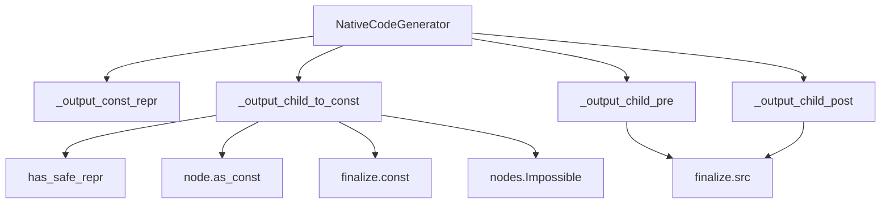
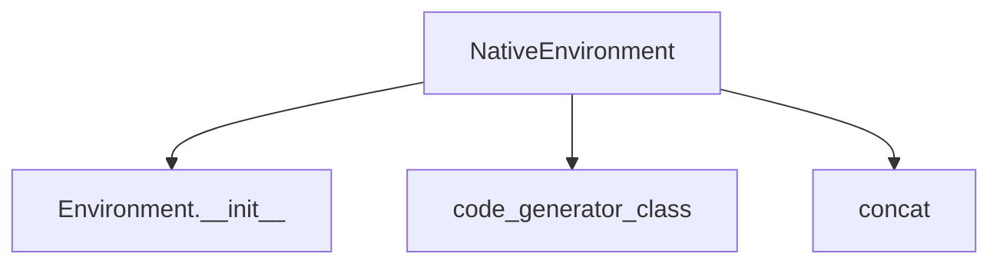
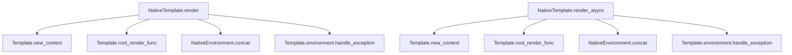

# `nativetypes.py`

## `src.jinja2.nativetypes.native_concat` · *function*

## Summary:
Concatenates iterable values into a single string, then attempts to evaluate it as a Python literal expression.

## Description:
This function takes an iterable of values, extracts the first two elements, and concatenates them into a string. If the result can be safely evaluated as a Python literal expression using `ast.literal_eval`, it returns the evaluated result; otherwise, it returns the concatenated string. This function is designed to handle both single values and iterables, with special handling for generators to preserve their lazy evaluation properties. It's primarily used in Jinja2 template processing to convert and evaluate template expressions.

## Args:
    values (Iterable[Any]): An iterable of values to concatenate and potentially evaluate.

## Returns:
    Optional[Any]: The evaluated result if the concatenated string represents a valid Python literal, otherwise the concatenated string itself. Returns None if the input iterable is empty.

## Raises:
    None explicitly raised, though underlying functions may raise exceptions during evaluation.

## Constraints:
    Preconditions: The input must be an iterable of values that can be converted to strings.
    Postconditions: If the concatenated string is a valid Python literal, it returns the evaluated value; otherwise, it returns the string representation.

## Side Effects:
    None directly observable, but may involve string conversion and potential evaluation of code-like strings.

## Control Flow:
```mermaid
flowchart TD
    A[Start native_concat] --> B{values empty?}
    B -- Yes --> C[Return None]
    B -- No --> D{len(head) == 1?}
    D -- Yes --> E{head[0] not str?}
    E -- Yes --> F[Return head[0]]
    E -- No --> G[Continue to join]
    D -- No --> H{values is GeneratorType?}
    H -- Yes --> I[chain(head, values)]
    H -- No --> J[Continue to join]
    J --> K[Join all values to string]
    K --> L[Try literal_eval(parse(raw))]
    L -- Success --> M[Return evaluated result]
    L -- Failure --> N[Return raw string]
```

## Examples:
    >>> native_concat(['1', '2', '3'])
    '123'
    >>> native_concat([1, 2, 3])
    '123'
    >>> native_concat(['[1, 2, 3]'])
    [1, 2, 3]
    >>> native_concat([])
    None
    >>> native_concat(['hello'])
    'hello'

## `src.jinja2.nativetypes.NativeCodeGenerator` · *class*

## Summary:
NativeCodeGenerator is a specialized Jinja2 code generator that extends the base CodeGenerator to provide optimized native Python code generation for templates, with enhanced handling of constant values and expression finalization.

## Description:
This class inherits from CodeGenerator and provides specialized implementations for compiling Jinja2 templates into Python bytecode. It overrides several key methods to handle constant value processing, expression finalization, and code generation patterns specific to Jinja2's native compilation approach. The class is used internally by Jinja2's template compilation system when generating optimized Python code for template execution.

The NativeCodeGenerator is responsible for:
- Converting expression nodes to constant values with safety validation
- Handling pre- and post-processing of finalized expressions
- Generating appropriate Python representations for constant values
- Managing expression finalization through custom finalize handlers

## State:
- _default_finalize: Static method that serves as the default finalizer, returning values unchanged
- Inherits all state from CodeGenerator base class including compilation context, output buffers, and frame management
- No additional instance attributes defined in this class

## Lifecycle:
- Creation: Automatically instantiated by Jinja2's template compilation system when using native code generation mode
- Usage: Methods are invoked internally during template compilation process by the Jinja2 engine
- Destruction: Managed by Python's garbage collection; no explicit cleanup required

## Method Map:


## Raises:
- nodes.Impossible: Raised by _output_child_to_const when a constant value cannot be safely represented as a string via has_safe_repr()

## Example:
```python
# This class is used internally by Jinja2 during template compilation
# Typical usage scenario:
# 1. Template compilation process creates an instance
# 2. During compilation, methods like _output_child_to_const are called
#    to process expression nodes and generate constant values
# 3. _output_child_pre and _output_child_post handle syntax formatting
# 4. Generated code is used for template execution

# Example of internal workflow:
# When processing a constant expression like {{ "hello" }}
# - _output_child_to_const extracts "hello" as constant
# - _output_const_repr formats it as repr("hello")
# - _output_child_pre/_post handle any finalization syntax
```

### `src.jinja2.nativetypes.NativeCodeGenerator._default_finalize` · *method*

## Summary:
Returns the input value unchanged, serving as the default finalization step in Jinja2 template compilation.

## Description:
This method acts as the default finalizer for template expressions in Jinja2's native code generation process. It is designed to be a no-op that simply returns the input value unchanged. The method is part of the NativeCodeGenerator class and is used internally during template compilation to handle expression finalization when no custom finalizer is specified.

## Args:
    value (Any): The value to be finalized (passed through unchanged)

## Returns:
    Any: The same value that was passed in

## Raises:
    None: This method does not raise any exceptions

## State Changes:
    Attributes READ: None
    Attributes WRITTEN: None

## Constraints:
    Preconditions: None
    Postconditions: The returned value is identical to the input value

## Side Effects:
    None: This method performs no I/O operations or external service calls

### `src.jinja2.nativetypes.NativeCodeGenerator._output_const_repr` · *method*

## Summary:
Generates a string representation of a concatenated sequence of values.

## Description:
This method takes an iterable of values, converts each to a string, joins them into a single string, and returns the repr() of that string. It's designed to create a safe string representation for constant values in Jinja2 templates, particularly for handling template compilation scenarios where constant values need to be represented as Python literals.

## Args:
    group (Iterable[Any]): An iterable containing values to be converted to strings and joined together.

## Returns:
    str: The repr() of the concatenated string formed from the input values.

## Raises:
    None explicitly raised.

## State Changes:
    Attributes READ: None
    Attributes WRITTEN: None

## Constraints:
    Preconditions: The input group must be iterable and contain values that can be converted to strings.
    Postconditions: The returned string is a valid Python repr() of the concatenated input values.

## Side Effects:
    None

### `src.jinja2.nativetypes.NativeCodeGenerator._output_child_to_const` · *method*

## Summary:
Converts a Jinja2 expression node to a constant value with safety validation and finalization processing.

## Description:
Processes a Jinja2 expression node to extract its constant value, validates that the value can be safely represented as a string, and applies finalization processing. This method is part of the native code generation pipeline for handling expression nodes that can be evaluated to compile-time constants.

The method performs three key operations: first extracting the constant value from the node using its as_const() method, second validating that the value can be safely represented via has_safe_repr(), and third either returning the raw constant (for TemplateData nodes) or applying finalization processing through finalize.const().

## Args:
    node (nodes.Expr): The Jinja2 expression node to convert to a constant value
    frame (Frame): Compilation frame providing evaluation context for the node
    finalize (CodeGenerator._FinalizeInfo): Finalization handler for processing constant values

## Returns:
    Any: The constant value, either as-is for TemplateData nodes or after finalization processing

## Raises:
    nodes.Impossible: When the constant value cannot be safely represented as a string

## State Changes:
    Attributes READ: None
    Attributes WRITTEN: None

## Constraints:
    Preconditions:
        - The node must support conversion to constant via its as_const() method
        - The resulting constant must pass the safe representation check via has_safe_repr()
    Postconditions:
        - Returns a constant value suitable for embedding in generated code
        - For TemplateData nodes, returns the raw constant value unchanged
        - For other nodes, returns the result of finalize.const() applied to the constant

## Side Effects:
    None

### `src.jinja2.nativetypes.NativeCodeGenerator._output_child_pre` · *method*

## Summary:
Writes pre-computed source code to the output buffer when available.

## Description:
This method is part of the NativeCodeGenerator class and handles the pre-processing step of outputting finalized source code. It checks if finalized source code is available in the finalize information and writes it to the output buffer. This method is typically called during template compilation when processing expression nodes that have already been pre-finalized.

## Args:
    node (nodes.Expr): The expression node being processed.
    frame (Frame): The current compilation frame containing context information.
    finalize (CodeGenerator._FinalizeInfo): Finalization information containing pre-computed source code.

## Returns:
    None: This method does not return any value.

## Raises:
    None: This method does not explicitly raise exceptions.

## State Changes:
    Attributes READ: self.write, finalize.src
    Attributes WRITTEN: None

## Constraints:
    Preconditions: The finalize parameter must be a CodeGenerator._FinalizeInfo instance with a valid src attribute.
    Postconditions: If finalize.src is not None, the source code will be written to the output buffer via self.write().

## Side Effects:
    I/O: Writes to the output buffer via self.write() method call.

### `src.jinja2.nativetypes.NativeCodeGenerator._output_child_post` · *method*

## Summary:
Writes a closing parenthesis to the generated code output when finalization is required.

## Description:
This method serves as a post-processing step in the Jinja2 template code generation pipeline. It writes a closing parenthesis character to the output stream when the finalize information indicates that a source reference exists. This typically occurs when expressions require finalization processing, such as when dealing with filters or other operations that need proper syntax closure.

The method is called as part of the code generation process for expression nodes, specifically after processing child nodes but before completing the expression generation. It ensures proper syntax formatting by adding closing parentheses where needed.

## Args:
    self: The NativeCodeGenerator instance.
    node (nodes.Expr): The expression node being processed.
    frame (Frame): The current compilation frame containing execution context.
    finalize (CodeGenerator._FinalizeInfo): Finalization information that determines whether a closing parenthesis should be written.

## Returns:
    None: This method does not return any value.

## Raises:
    None: This method does not explicitly raise any exceptions.

## State Changes:
    Attributes READ: 
        - finalize.src
    Attributes WRITTEN: 
        - self.write (method call, not attribute)

## Constraints:
    Preconditions:
        - The finalize parameter must be a valid CodeGenerator._FinalizeInfo instance.
        - The node parameter must be a valid nodes.Expr instance.
        - The frame parameter must be a valid Frame instance.
        - The method should only be called during code generation phase.
    Postconditions:
        - If finalize.src is not None, a closing parenthesis is written to the output.
        - If finalize.src is None, no action is taken.

## Side Effects:
    I/O: Writes a closing parenthesis character to the output stream via the self.write method.

## `src.jinja2.nativetypes.NativeEnvironment` · *class*

## Summary:
NativeEnvironment is a Jinja2 environment class that extends the base Environment to provide native Python code generation capabilities for templates.

## Description:
NativeEnvironment is a specialized Jinja2 environment class that customizes template compilation behavior by specifying NativeCodeGenerator as the code generator class and defining a native concatenation function. This environment is designed to optimize template compilation for performance by using native Python code generation rather than the default approach.

The class serves as a configuration point for Jinja2's template compilation system, enabling the use of specialized code generation and concatenation strategies that can improve template execution performance. It is typically used internally by Jinja2 when native compilation mode is enabled.

## State:
- code_generator_class: Set to NativeCodeGenerator, determining which code generator class to use during template compilation
- concat: Set to staticmethod(native_concat), defining the concatenation function used for processing template expressions
- Inherits all standard Environment attributes including template loaders, filters, tests, globals, and other configuration options from the base Environment class

## Lifecycle:
- Creation: Instantiated like any standard Environment class, typically through direct instantiation or factory methods
- Usage: Used internally by Jinja2's template compilation system when templates are rendered with native code generation enabled
- Destruction: Managed by Python's garbage collection; no explicit cleanup required

## Method Map:


## Raises:
- No explicit exceptions raised by __init__ as it inherits from Environment
- Exceptions may be raised during template compilation or rendering if underlying issues occur

## Example:
```python
# Create a NativeEnvironment instance
env = NativeEnvironment()

# This environment would be used internally by Jinja2 when:
# 1. Templates are compiled with native code generation enabled
# 2. Template expressions are processed using native_concat
# 3. Code generation uses NativeCodeGenerator for optimized compilation

# Typical usage pattern:
# env.from_string("Hello {{ name }}").render(name="World")
# The compilation process would utilize NativeCodeGenerator and native_concat
```

## `src.jinja2.nativetypes.NativeTemplate` · *class*

## Summary:
NativeTemplate is a Jinja2 template class that enables native Python code generation and optimized rendering for improved performance.

## Description:
NativeTemplate is a Jinja2 template subclass that extends the base Template class to provide native Python code generation capabilities. It is specifically designed to work with NativeEnvironment to deliver faster template compilation and execution by utilizing native Python code generation instead of interpreted code paths. This class provides both synchronous and asynchronous rendering methods for template execution.

The class serves as the execution layer for templates that are compiled with native code generation enabled. It leverages the NativeEnvironment's configuration (including NativeCodeGenerator and native_concat function) to execute templates efficiently. NativeTemplate acts as the bridge between the compiled template code and the environment's optimized execution infrastructure.

## State:
- environment_class: Class variable set to NativeEnvironment, specifying the environment type for compilation and rendering
- Inherits all standard Template attributes including template source, AST, compiled code, and context management from the base Template class

## Lifecycle:
- Creation: Instantiated through standard Template construction mechanisms, typically via Environment.from_string() or Environment.get_template()
- Usage: Called by the Jinja2 rendering system when templates are rendered with native compilation enabled
- Destruction: Managed by Python's garbage collection; no explicit cleanup required

## Method Map:


## Raises:
- RuntimeError: In render_async method when environment.is_async is False
- Exception: In both render and render_async methods when template execution fails (caught and handled by environment)

## Example:
```python
# Create a NativeEnvironment and template
from jinja2 import Environment
from jinja2.nativetypes import NativeEnvironment

env = NativeEnvironment()
template = env.from_string("Hello {{ name }}!")

# Synchronous rendering
result = template.render(name="World")
print(result)  # Output: "Hello World!"

# Asynchronous rendering (requires async environment)
async_result = await template.render_async(name="Async World")
print(async_result)  # Output: "Hello Async World!"
```

### `src.jinja2.nativetypes.NativeTemplate.render` · *method*

## Summary:
Renders a Jinja2 template by creating a context and executing the compiled template function, with exception handling for template errors.

## Description:
This method serves as the primary entry point for rendering Jinja2 templates in native mode. It creates a new template context from provided arguments, executes the compiled template function, and handles any exceptions that may occur during rendering by delegating to the environment's exception handler.

The method orchestrates the template rendering lifecycle by:
1. Creating a context with the provided arguments
2. Executing the compiled template function (root_render_func) 
3. Concatenating the result using the environment's native concatenation function
4. Falling back to exception handling if rendering fails

This logic is encapsulated in its own method to provide a clean interface for template execution while maintaining separation between context creation, execution, and error handling concerns.

## Args:
    *args (t.Any): Positional arguments to be passed to the template context
    **kwargs (t.Any): Keyword arguments to be passed to the template context

## Returns:
    t.Any: The rendered template content, either as concatenated output or exception handling result

## Raises:
    Exception: Any exception that occurs during template rendering or concatenation is caught and handled by the environment

## State Changes:
    Attributes READ: 
    - self.new_context
    - self.environment_class
    - self.root_render_func
    - self.environment.handle_exception
    
    Attributes WRITTEN: None

## Constraints:
    Preconditions:
    - self.new_context must be callable and accept dict(*args, **kwargs) as argument
    - self.root_render_func must be callable and accept a context as argument
    - self.environment_class.concat must be callable and accept iterable as argument
    - self.environment.handle_exception must be callable
    
    Postconditions:
    - Returns either rendered template content or handled exception result
    - No modification to the template object's state occurs

## Side Effects:
    I/O: May involve file system access during template loading if templates are loaded from files
    External service calls: May invoke external services if template loaders are configured to fetch templates from remote sources
    Mutations: None - this method does not mutate the template object itself

### `src.jinja2.nativetypes.NativeTemplate.render_async` · *method*

## Summary:
Asynchronously renders a Jinja2 template with the provided context, returning the concatenated result or handling exceptions.

## Description:
This method provides asynchronous rendering capability for Jinja2 templates, allowing template content to be generated in an async context. It validates that the environment is configured for async operation, creates a rendering context, and processes the template asynchronously using the root render function. The method handles exceptions by delegating to the environment's exception handler.

The method is specifically designed for use with NativeTemplate instances that operate in async environments, providing a clean interface for asynchronous template rendering while maintaining consistency with the synchronous render method.

## Args:
    *args (t.Any): Positional arguments to be merged into the template context dictionary
    **kwargs (t.Any): Keyword arguments to be merged into the template context dictionary

## Returns:
    t.Any: The concatenated rendered template content, or an exception result from the environment's handler

## Raises:
    RuntimeError: When the environment is not configured with async mode enabled (self.environment.is_async is False)

## State Changes:
    Attributes READ: 
        - self.environment.is_async
        - self.environment_class
        - self.root_render_func
        - self.new_context
        - self.environment.handle_exception
    Attributes WRITTEN: None

## Constraints:
    Preconditions:
        - The environment must be initialized with async mode enabled (self.environment.is_async must be True)
        - The template must have a valid root_render_func method
        - The template must have a valid new_context method
    Postconditions:
        - If successful, returns the rendered template content as a concatenated string or similar type
        - If an exception occurs, returns the result of environment.handle_exception()

## Side Effects:
    - I/O operations during template rendering via async iteration over root_render_func
    - Potential external service calls through the environment's exception handling mechanism
    - May modify internal state of the environment during exception handling

