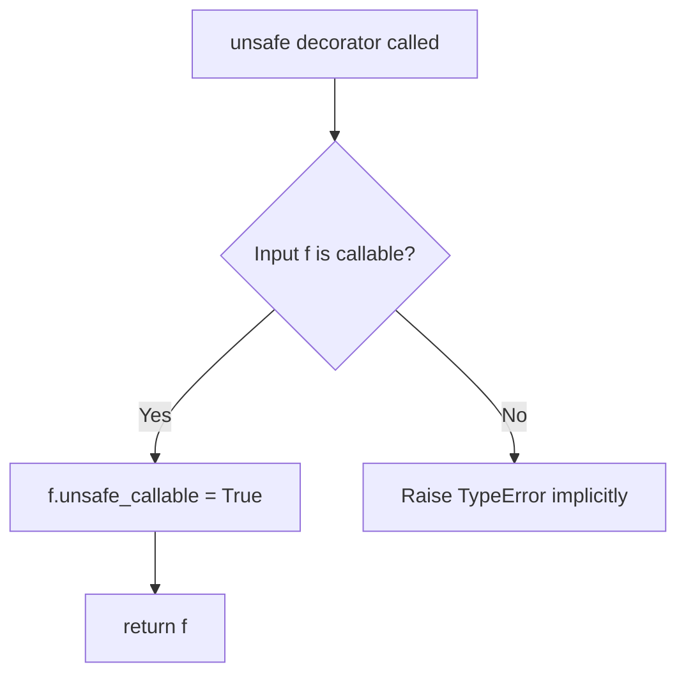
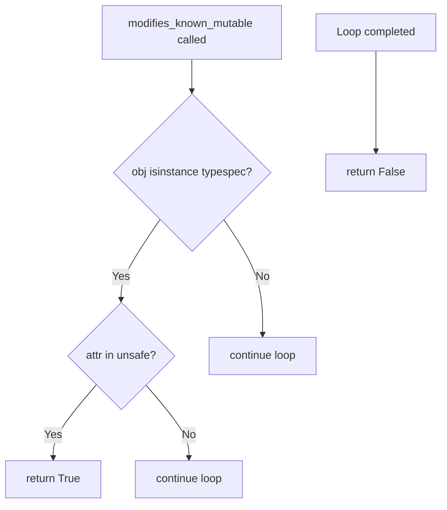
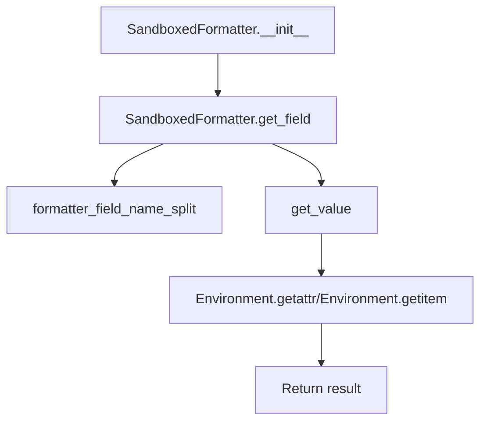
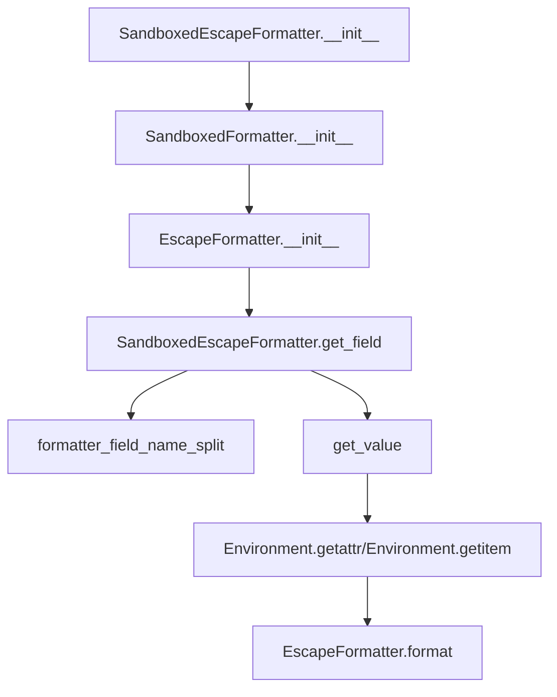

# `sandbox.py`

## `src.jinja2.sandbox.inspect_format_method` · *function*

## Summary:
Determines if a callable is a string format method and returns the string object it operates on.

## Description:
This function examines a callable to determine if it is a string format method (either 'format' or 'format_map') and extracts the string object it operates on. It serves as a security check mechanism in Jinja2's sandboxed environment to identify potentially dangerous string formatting operations.

The function is designed to be used in contexts where string formatting methods need to be inspected for security purposes, particularly in sandboxed environments where untrusted code execution needs to be restricted.

## Args:
    callable (typing.Callable): A callable object to inspect for being a string format method.

## Returns:
    typing.Optional[str]: The string object that the format method operates on if the callable is a string format method; otherwise None.

## Raises:
    None explicitly raised.

## Constraints:
    Preconditions:
        - The callable must be either a MethodType or BuiltinMethodType instance
        - The callable's __name__ attribute must be either "format" or "format_map"
        
    Postconditions:
        - If the callable is a string format method, the returned value is the string object it operates on
        - If the callable is not a string format method, None is returned

## Side Effects:
    None.

## Control Flow:
```mermaid
flowchart TD
    A[Start] --> B{Is callable MethodType<br/>or BuiltinMethodType?}
    B -- No --> C[Return None]
    B -- Yes --> D{callable.__name__ in ["format", "format_map"]?}
    D -- No --> C
    D -- Yes --> E{Is callable.__self__ a str?}
    E -- No --> C
    E -- Yes --> F[Return callable.__self__]
```

## Examples:
```python
# Example 1: Valid string format method
s = "Hello {name}"
method = s.format
result = inspect_format_method(method)
# result == "Hello {name}"

# Example 2: Invalid callable (not a format method)
result = inspect_format_method(len)
# result == None

# Example 3: Non-string format method (list append)
lst = [1, 2, 3]
method = lst.append
result = inspect_format_method(method)
# result == None

# Example 4: String format_map method
template = "{name} is {age} years old"
method = template.format_map
result = inspect_format_method(method)
# result == "{name} is {age} years old"
```

## `src.jinja2.sandbox.safe_range` · *function*

## Summary:
Creates a range object with size validation to prevent excessive memory allocation in sandboxed environments.

## Description:
This function provides a safe wrapper around Python's built-in range() constructor that validates the size of the resulting range before returning it. It prevents potential denial-of-service attacks or memory exhaustion by limiting the maximum allowable size of ranges created within the sandboxed environment.

The function is extracted into its own utility to enforce a security boundary around range creation, ensuring that all range objects created in the sandbox adhere to size constraints defined by MAX_RANGE.

## Args:
    *args (int): Variable length argument list passed to the built-in range() constructor. Supports 1-3 integer arguments:
        - range(stop): Creates range from 0 to stop (exclusive)
        - range(start, stop): Creates range from start to stop (exclusive)  
        - range(start, stop, step): Creates range from start to stop (exclusive) with given step

## Returns:
    range: A range object with the specified start, stop, and step values, provided its length does not exceed MAX_RANGE.

## Raises:
    OverflowError: When the length of the constructed range exceeds the MAX_RANGE limit defined in the sandbox module.

## Constraints:
    Preconditions:
        - All arguments must be integers compatible with the built-in range() constructor
        - The resulting range must not exceed MAX_RANGE in length
    
    Postconditions:
        - Returns a valid range object with length <= MAX_RANGE
        - Raises OverflowError if the range would exceed MAX_RANGE

## Side Effects:
    None

## Control Flow:
```mermaid
flowchart TD
    A[Call safe_range with args] --> B{len(range(*args)) > MAX_RANGE?}
    B -- Yes --> C[Raise OverflowError]
    B -- No --> D[Return range(*args)]
```

## Examples:
```python
# Valid usage - within limit
r1 = safe_range(10)        # Creates range(0, 10) with length 10
r2 = safe_range(5, 15)     # Creates range(5, 15) with length 10
r3 = safe_range(0, 20, 2)  # Creates range(0, 20, 2) with length 10

# Invalid usage - would exceed limit (assuming MAX_RANGE < 1000000)
try:
    r4 = safe_range(1000000)  # Raises OverflowError if MAX_RANGE < 1000000
except OverflowError as e:
    print(e)  # "Range too big. The sandbox blocks ranges larger than MAX_RANGE (some_value)."
```

## `src.jinja2.sandbox.unsafe` · *function*

## Summary:
Decorator that marks a function as unsafe, allowing it to bypass security restrictions in Jinja2 sandboxed environments.

## Description:
The `unsafe` decorator is used to indicate that a function should be treated as potentially dangerous and thus not subject to the normal security restrictions applied to functions in Jinja2's sandboxed template execution environment. This allows functions decorated with `@unsafe` to be called even when the template environment has security measures enabled that would normally prevent such calls.

This function was extracted as a dedicated decorator to provide a clear and explicit mechanism for marking functions that require elevated privileges or bypass security checks, rather than having these functions be implicitly trusted or having security checks applied inconsistently. It's particularly useful for exposing functions that perform operations like file I/O, system calls, or other potentially dangerous activities within template contexts.

## Args:
    f (F): The function to be marked as unsafe. This parameter accepts any callable object that will be decorated. The type `F` represents a generic function type.

## Returns:
    F: The same function object that was passed in, now with an `unsafe_callable` attribute set to `True`.

## Raises:
    None

## Constraints:
    Preconditions:
        - The input `f` must be a callable object (function, method, or other callable type).
        - The function being decorated should be intended for use in contexts where security restrictions may apply.
    
    Postconditions:
        - The returned function object will have an attribute `unsafe_callable` set to `True`.
        - The original function's behavior and signature remain unchanged.

## Side Effects:
    - Modifies the input function object by adding an attribute (`unsafe_callable`).
    - No external I/O operations or state mutations beyond modifying the function object itself.

## Control Flow:


## Examples:
```python
from jinja2.sandbox import unsafe

@unsafe
def dangerous_function():
    # This function can bypass sandbox security checks
    return "unsafe operation"

# Usage in template context where security matters
template = env.from_string("{{ dangerous_function() }}")
result = template.render()

# Another example with parameters
@unsafe
def read_file(filename):
    with open(filename, 'r') as f:
        return f.read()
```

## `src.jinja2.sandbox.is_internal_attribute` · *function*

## Summary:
Determines whether an attribute access on a given object should be restricted due to security concerns or internal implementation details in Jinja2's sandbox environment.

## Description:
This function implements security checks in Jinja2's sandbox environment to prevent access to potentially dangerous or internal attributes. It evaluates both the type of object being accessed and the attribute name to determine if the access should be blocked. The function is used to enforce security boundaries when rendering templates in sandboxed contexts, preventing unauthorized access to internal Python implementation details.

## Args:
    obj (Any): The object whose attribute is being accessed
    attr (str): The name of the attribute being accessed

## Returns:
    bool: True if the attribute access should be restricted (considered unsafe/internal), False otherwise

## Raises:
    None explicitly raised

## Constraints:
    Preconditions:
    - The `obj` parameter can be any Python object
    - The `attr` parameter must be a string representing an attribute name
    
    Postconditions:
    - Returns a boolean value indicating whether access should be restricted
    - The function handles various Python types including functions, methods, classes, and built-in types

## Side Effects:
    None

## Control Flow:
```mermaid
flowchart TD
    A[is_internal_attribute] --> B{obj is FunctionType?}
    B -- Yes --> C{attr in UNSAFE_FUNCTION_ATTRIBUTES?}
    C -- Yes --> D[Return True]
    C -- No --> E[Continue]
    B -- No --> F{obj is MethodType?}
    F -- Yes --> G{attr in UNSAFE_FUNCTION_ATTRIBUTES OR attr in UNSAFE_METHOD_ATTRIBUTES?}
    G -- Yes --> D
    G -- No --> E
    F -- No --> H{obj is type?}
    H -- Yes --> I{attr == "mro"?}
    I -- Yes --> D
    I -- No --> E
    H -- No --> J{obj is CodeType or TracebackType or FrameType?}
    J -- Yes --> D
    J -- No --> K{obj is GeneratorType?}
    K -- Yes --> L{attr in UNSAFE_GENERATOR_ATTRIBUTES?}
    L -- Yes --> D
    L -- No --> E
    K -- No --> M{hasattr(types, "CoroutineType") AND obj is CoroutineType?}
    M -- Yes --> N{attr in UNSAFE_COROUTINE_ATTRIBUTES?}
    N -- Yes --> D
    N -- No --> E
    M -- No --> O{hasattr(types, "AsyncGeneratorType") AND obj is AsyncGeneratorType?}
    O -- Yes --> P{attr in UNSAFE_ASYNC_GENERATOR_ATTRIBUTES?}
    P -- Yes --> D
    P -- No --> E
    O -- No --> Q{attr starts with "__"?}
    Q -- Yes --> D
    Q -- No --> R[Return False]
```

## Examples:
    # Checking a function's attribute that's considered unsafe
    >>> is_internal_attribute(some_function, '__code__')
    True
    
    # Checking a method's attribute that's considered unsafe  
    >>> is_internal_attribute(some_method, 'func_globals')
    True
    
    # Checking a class's attribute that's considered unsafe
    >>> is_internal_attribute(SomeClass, 'mro')
    True
    
    # Checking a regular attribute that's safe
    >>> is_internal_attribute(obj, 'public_attr')
    False
    
    # Checking a private attribute that's generally unsafe
    >>> is_internal_attribute(obj, '__private_attr')
    True

## `src.jinja2.sandbox.modifies_known_mutable` · *function*

## Summary:
Determines whether accessing a given attribute on a mutable object would modify that object's state.

## Description:
Checks if a specified attribute access on a mutable object would result in a modification to the object's internal state. This function is used in Jinja2's sandbox security model to identify potentially dangerous attribute accesses that could modify mutable objects.

The logic is extracted into its own function to provide a centralized and reusable mechanism for determining mutable object attribute safety. This approach ensures consistent security checking across different parts of the sandbox implementation while keeping the core security logic encapsulated and testable.

## Args:
    obj (Any): The object whose attribute access needs to be checked for mutability
    attr (str): The name of the attribute being accessed

## Returns:
    bool: True if accessing the specified attribute on the object would modify the object's state, False otherwise

## Raises:
    None

## Constraints:
    Preconditions:
        - The `obj` parameter can be any Python object
        - The `attr` parameter must be a string representing a valid attribute name
        
    Postconditions:
        - Returns a boolean value indicating whether the attribute access is considered unsafe
        - Does not modify the input object or attribute name

## Side Effects:
    - No I/O operations
    - No external state mutations
    - No external service calls

## Control Flow:


## Examples:
```python
# Check if accessing 'append' on a list would modify it
result = modifies_known_mutable([1, 2, 3], 'append')  # Returns True

# Check if accessing 'upper' on a string would modify it
result = modifies_known_mutable("hello", 'upper')  # Returns False

# Check if accessing 'update' on a dict would modify it
result = modifies_known_mutable({'a': 1}, 'update')  # Returns True
```

## `src.jinja2.sandbox.SandboxedEnvironment` · *class*

## Summary:
A secure Jinja2 environment that restricts access to potentially dangerous operations while allowing safe template rendering.

## Description:
SandboxedEnvironment is a subclass of Jinja2's Environment class designed to provide a secure template rendering context. It enforces safety restrictions on attribute access, callable operations, and string formatting to prevent malicious code execution in untrusted templates. The class overrides several key methods to implement security checks while maintaining compatibility with standard Jinja2 functionality.

This environment is specifically intended for use when rendering templates from untrusted sources, where arbitrary code execution must be prevented. It provides a controlled subset of Python's capabilities while blocking access to dangerous attributes and methods.

## State:
- `sandboxed` (bool): Class attribute set to True, indicating this is a sandboxed environment
- `default_binop_table` (Dict[str, Callable]): Dictionary mapping binary operators to their implementations (add, subtract, multiply, etc.)
- `default_unop_table` (Dict[str, Callable]): Dictionary mapping unary operators to their implementations (positive, negative)
- `intercepted_binops` (FrozenSet[str]): Set of binary operators that are intercepted for special handling (currently empty)
- `intercepted_unops` (FrozenSet[str]): Set of unary operators that are intercepted for special handling (currently empty)
- `binop_table` (Dict[str, Callable]): Copy of default_binop_table that can be customized
- `unop_table` (Dict[str, Callable]): Copy of default_unop_table that can be customized
- `globals` (dict): Global variables available in templates, including a safe version of range

## Lifecycle:
- Creation: Instantiated like any Jinja2 Environment, but automatically configures security settings by:
  1. Calling the parent Environment.__init__
  2. Replacing the global 'range' with safe_range
  3. Copying default operator tables to instance variables
- Usage: Templates are rendered using standard Jinja2 rendering methods with enhanced security
- Destruction: Inherits standard Environment cleanup behavior

## Method Map:
```mermaid
flowchart TD
    A[SandboxedEnvironment.__init__] --> B[super().__init__()]
    B --> C[self.globals["range"] = safe_range]
    C --> D[self.binop_table = self.default_binop_table.copy()]
    D --> E[self.unop_table = self.default_unop_table.copy()]
    
    A --> F[SandboxedEnvironment.call]
    F --> G{fmt is not None?}
    G -- Yes --> H[SandboxedEnvironment.format_string]
    G -- No --> I[SandboxedEnvironment.is_safe_callable]
    I --> J{is_safe_callable returns False?}
    J -- Yes --> K[SecurityError]
    J -- No --> L[Context.call]
    
    F --> M[SandboxedEnvironment.call_binop]
    M --> N[binop_table lookup]
    N --> O[operator call]
    
    F --> P[SandboxedEnvironment.call_unop]
    P --> Q[unop_table lookup]
    Q --> R[operator call]
    
    A --> S[SandboxedEnvironment.getitem]
    S --> T[Direct object access]
    T --> U{TypeError/LookupError?}
    U -- Yes --> V[String attribute access]
    V --> W[getattr]
    W --> X{is_safe_attribute?}
    X -- No --> Y[unsafe_undefined]
    X -- Yes --> Z[return value]
    
    A --> AA[SandboxedEnvironment.getattr]
    AA --> AB[getattr]
    AB --> AC{AttributeError?}
    AC -- Yes --> AD[Object item access]
    AD --> AE{TypeError/LookupError?}
    AE -- Yes --> AF[undefined]
    AE -- No --> AG[return value]
    AC -- No --> AH{is_safe_attribute?}
    AH -- No --> AI[unsafe_undefined]
    AH -- Yes --> AJ[return value]
```

## Raises:
- SecurityError: Raised when attempting to call unsafe callables or access unsafe attributes
- TypeError: Raised when format_map is called with incorrect number of arguments
- OverflowError: Raised by safe_range when creating ranges that exceed MAX_RANGE limit

## Example:
```python
from jinja2 import SandboxedEnvironment

# Create a sandboxed environment
env = SandboxedEnvironment()

# Render a template safely
template = env.from_string("Hello {{ name }}!")
result = template.render(name="World")
print(result)  # Output: "Hello World!"

# Attempting to access unsafe attributes raises SecurityError
template2 = env.from_string("{{ obj.__class__ }}")
try:
    result2 = template2.render(obj=object())
except SecurityError:
    print("Access denied due to security restrictions")

# Safe operations work normally
template3 = env.from_string("Numbers: {{ range(3) }}")
result3 = template3.render()
print(result3)  # Output: "Numbers: range(0, 3)"
```

### `src.jinja2.sandbox.SandboxedEnvironment.__init__` · *method*

## Summary:
Initializes a SandboxedEnvironment instance by setting up secure global variables and copying binary/unary operation tables from the parent Environment class.

## Description:
This method initializes a SandboxedEnvironment instance by calling the parent Environment.__init__ method and then configuring security-related attributes. It specifically sets up the globals dictionary to include a safe version of the range function and copies the default binary and unary operation tables to ensure proper sandboxed behavior.

The method is designed to be called during object construction and establishes the security boundaries that distinguish SandboxedEnvironment from regular Environment instances. It ensures that the sandboxed environment uses a restricted set of operations and safe implementations of potentially dangerous functions like range().

## Args:
    *args (Any): Variable length argument list passed to the parent Environment.__init__ method
    **kwargs (Any): Arbitrary keyword arguments passed to the parent Environment.__init__ method

## Returns:
    None: This method does not return any value

## Raises:
    None: This method does not explicitly raise exceptions

## State Changes:
    Attributes READ:
        - self.default_binop_table
        - self.default_unop_table
    
    Attributes WRITTEN:
        - self.globals["range"]
        - self.binop_table
        - self.unop_table

## Constraints:
    Preconditions:
        - The parent Environment class must be properly initialized
        - The default_binop_table and default_unop_table attributes must exist on the parent class
    
    Postconditions:
        - The globals dictionary will contain a safe_range function under the "range" key
        - The binop_table and unop_table attributes will be copies of their respective default tables
        - The SandboxedEnvironment will have restricted operation tables compared to a standard Environment

## Side Effects:
    None: This method does not perform I/O operations or mutate external state beyond modifying the instance's attributes

### `src.jinja2.sandbox.SandboxedEnvironment.is_safe_attribute` · *method*

## Summary:
Determines whether an attribute access on an object should be restricted in Jinja2's sandbox environment based on security and internal implementation concerns.

## Description:
This method implements security checks in Jinja2's sandbox environment to prevent access to potentially dangerous or internal attributes. It evaluates whether an attribute access should be blocked due to security concerns or internal implementation details. The method is used during template rendering to enforce security boundaries and prevent unauthorized access to Python's internal mechanisms.

## Args:
    obj (Any): The object whose attribute is being accessed
    attr (str): The name of the attribute being accessed
    value (Any): The value of the attribute being accessed (unused in current implementation)

## Returns:
    bool: True if the attribute access should be restricted (considered unsafe/internal), False otherwise

## Raises:
    None explicitly raised

## State Changes:
    Attributes READ: None
    Attributes WRITTEN: None

## Constraints:
    Preconditions:
    - The `obj` parameter can be any Python object
    - The `attr` parameter must be a string representing an attribute name
    - The `value` parameter can be any Python object
    
    Postconditions:
    - Returns a boolean value indicating whether access should be restricted
    - The method does not modify any object state

## Side Effects:
    None

### `src.jinja2.sandbox.SandboxedEnvironment.is_safe_callable` · *method*

## Summary:
Determines whether a callable object is safe to execute within a sandboxed environment by checking for unsafe attributes.

## Description:
This method evaluates if a given object should be considered safe for execution in a sandboxed Jinja2 environment. It checks two specific attributes on the object: `unsafe_callable` and `alters_data`. If either attribute exists and is truthy, the object is deemed unsafe. This method is part of the security mechanism that prevents potentially harmful operations from being executed within templates. It is called during the template execution phase when evaluating callable objects.

## Args:
    obj (Any): The object to check for safety. This is typically a callable function or method.

## Returns:
    bool: True if the object is safe to call, False if it has either the `unsafe_callable` or `alters_data` attribute set to a truthy value.

## Raises:
    None explicitly raised.

## State Changes:
    Attributes READ: 
    - `unsafe_callable` attribute of the object
    - `alters_data` attribute of the object

## Constraints:
    Preconditions:
    - The object must be inspectable via `getattr()` to check for the presence of the `unsafe_callable` and `alters_data` attributes.
    - The object should be a callable or at least have attributes that can be inspected.

    Postconditions:
    - The method returns a boolean value indicating the safety status of the object.
    - No modifications are made to the object or the environment.

## Side Effects:
    None. This method performs only attribute lookups and returns a boolean value.

### `src.jinja2.sandbox.SandboxedEnvironment.call_binop` · *method*

## Summary:
Executes a binary operation on two operands using a registered operator handler from the sandboxed environment's binary operator table.

## Description:
This method serves as a dispatcher for binary operations within the Jinja2 sandboxed environment. It retrieves the appropriate binary operator function from the `binop_table` dictionary using the provided operator string key and applies it to the left and right operands. This design allows for secure execution of binary operations while maintaining control over which operators are permitted.

The method is typically called during template rendering when Jinja2 encounters binary operators like `+`, `-`, `*`, etc. in expressions. It acts as a bridge between the template expression parsing and the actual execution of the binary operation, ensuring that only predefined safe operations can be performed.

This method is part of the SandboxedEnvironment class hierarchy, which inherits from the base Environment class and adds security restrictions to prevent dangerous operations.

## Args:
- context (Context): The template rendering context containing variables and state
- operator (str): The string identifier for the binary operator (e.g., "+", "-", "*", "/")
- left (Any): The left operand for the binary operation
- right (Any): The right operand for the binary operation

## Returns:
- Any: The result of applying the binary operator to the left and right operands

## Raises:
- KeyError: When the specified operator is not found in the `binop_table`
- TypeError: When the operator function cannot be called with the provided operands
- Exception: Any exception raised by the underlying operator function

## State Changes:
- Attributes READ: self.binop_table
- Attributes WRITTEN: None

## Constraints:
- Preconditions: The operator must exist as a key in self.binop_table; both operands must be compatible with the operator function
- Postconditions: The returned value is the result of executing the binary operation on the operands

## Side Effects:
- None directly observable from this method
- May indirectly cause exceptions if the operator function raises them

### `src.jinja2.sandbox.SandboxedEnvironment.call_unop` · *method*

## Summary:
Executes a unary operation on a given argument using a pre-defined operator table within a secure sandboxed environment.

## Description:
This method serves as a dispatcher for unary operations within the sandboxed Jinja2 environment. It retrieves the appropriate unary operator function from the environment's operator table and applies it to the provided argument. This design allows for secure execution of unary operations while maintaining control over which operators are available, preventing potentially dangerous operations from being executed.

The method is part of the SandboxedEnvironment class and is called during template rendering when unary operators (like negation, positive, bitwise NOT) are encountered in expressions.

## Args:
    context (Context): The Jinja2 rendering context, providing access to variables and environment settings. This parameter is currently unused in the implementation but maintained for interface consistency.
    operator (str): The name of the unary operator to execute (e.g., '-', '+', '~', 'not'). Must be a key in the unop_table dictionary.
    arg (Any): The argument to apply the unary operator to. The type depends on the specific operator being applied.

## Returns:
    Any: The result of applying the unary operator to the argument. The return type varies based on the operator and argument type.

## Raises:
    KeyError: When the specified operator is not found in the self.unop_table dictionary.
    TypeError: When the operator function cannot be applied to the provided argument (e.g., attempting to negate a string).

## State Changes:
    Attributes READ: self.unop_table
    Attributes WRITTEN: None

## Constraints:
    Preconditions: 
    - The operator must exist as a key in self.unop_table
    - The argument must be compatible with the operator function
    Postconditions: 
    - The returned value is the result of applying the operator to the argument
    - No modifications are made to the SandboxedEnvironment instance state

## Side Effects:
    None

### `src.jinja2.sandbox.SandboxedEnvironment.getitem` · *method*

## Summary:
Retrieves an item from an object using bracket notation or attribute access, with security checks to prevent unsafe attribute access in sandboxed environments.

## Description:
This method provides a secure way to access items from objects in a sandboxed Jinja2 environment. It first attempts to retrieve the item using standard bracket notation (`obj[argument]`). If that fails with a TypeError or LookupError, it falls back to attempting attribute access when the argument is a string. During attribute access, it performs security checks via `is_safe_attribute()` to ensure the attribute access is safe before returning the value. If all access attempts fail, it creates and returns an undefined object.

The method is designed to be used in template rendering contexts where security is paramount, preventing potentially dangerous attribute access patterns that could lead to code execution or data leakage. It's part of the SandboxedEnvironment class and is called during template variable resolution.

## Args:
    obj (Any): The object from which to retrieve the item
    argument (Union[str, Any]): The key or attribute name to access

## Returns:
    Union[Any, Undefined]: The retrieved item if successful, or an Undefined object if access fails

## Raises:
    None explicitly raised, though underlying operations may raise exceptions that are caught internally

## State Changes:
    Attributes READ: 
    - self.is_safe_attribute
    - self.unsafe_undefined  
    - self.undefined
    Attributes WRITTEN: 
    - No instance attributes are modified

## Constraints:
    Preconditions:
        - The `obj` parameter can be any Python object
        - The `argument` parameter can be any type, but attribute access is only attempted when it's a string
        - The SandboxedEnvironment instance must be properly initialized
        
    Postconditions:
        - Always returns either a valid item from the object or an Undefined instance
        - Does not modify the input object or arguments
        - Security checks are performed when attempting attribute access

## Side Effects:
    - May create and return Undefined instances
    - Calls methods from the same class (`is_safe_attribute`, `unsafe_undefined`, `undefined`) which may have side effects
    - No direct I/O or external service calls

### `src.jinja2.sandbox.SandboxedEnvironment.getattr` · *method*

## Summary:
Retrieves an attribute from an object while enforcing security restrictions in a sandboxed environment, returning either the attribute value or an undefined placeholder.

## Description:
This method provides a secure way to access object attributes within a sandboxed Jinja2 environment. It attempts to retrieve an attribute using Python's built-in `getattr` function, falling back to dictionary-style access if the attribute doesn't exist as a standard object attribute. The method enforces security by checking if the attribute access is safe before returning the value, and returns appropriate undefined placeholders when access is restricted or unavailable.

The method follows a specific security flow: first attempting standard attribute access, then dictionary access, then applying security checks, and finally creating an undefined placeholder if all else fails. This logic is encapsulated in its own method to centralize security enforcement and maintain clean separation between attribute access and security validation.

## Args:
    obj (Any): The object from which to retrieve the attribute
    attribute (str): The name of the attribute to retrieve

## Returns:
    Any or Undefined: The attribute value if accessible and safe, otherwise an Undefined instance representing the failed access

## Raises:
    None

## State Changes:
    Attributes READ: 
    - self.is_safe_attribute
    - self.unsafe_undefined  
    - self.undefined
    Attributes WRITTEN: 
    - No instance attributes are modified by this method

## Constraints:
    Preconditions:
        - The `obj` parameter can be any Python object
        - The `attribute` parameter must be a string representing a valid attribute name
        
    Postconditions:
        - Returns either the actual attribute value (if accessible and safe) or an Undefined instance
        - Does not modify the input object or attribute name

## Side Effects:
    - No I/O operations
    - No external state mutations
    - No external service calls

### `src.jinja2.sandbox.SandboxedEnvironment.unsafe_undefined` · *method*

## Summary:
Creates an Undefined instance that raises a SecurityError when attempting to access an unsafe attribute on an object.

## Description:
This method is part of the SandboxedEnvironment class and is called when template code attempts to access an attribute on an object that is deemed unsafe for security reasons. It creates an Undefined instance with a descriptive error message indicating the specific attribute access that triggered the security violation, configured to raise a SecurityError when the undefined value is accessed.

The method is invoked by the `getattr` and `getitem` methods of SandboxedEnvironment when they detect that an attribute access would violate the sandbox security model.

## Args:
    obj (Any): The object being accessed that has an unsafe attribute
    attribute (str): The name of the attribute being accessed that is considered unsafe

## Returns:
    Undefined: An Undefined instance configured to raise SecurityError when evaluated

## Raises:
    SecurityError: When the returned Undefined instance is accessed, due to the unsafe attribute access

## State Changes:
    Attributes READ: None
    Attributes WRITTEN: None

## Constraints:
    Preconditions: The method assumes that obj and attribute are valid parameters representing an unsafe attribute access
    Postconditions: Always returns an Undefined instance with SecurityError configured as the exception type

## Side Effects:
    None

### `src.jinja2.sandbox.SandboxedEnvironment.format_string` · *method*

## Summary:
Formats a string using a sandboxed formatter with secure attribute and item access controls, returning a string of the same type as the input.

## Description:
This method implements secure string formatting by selecting an appropriate sandboxed formatter based on the input string type. It handles both regular strings and Markup objects (for HTML escaping) while enforcing Jinja2's security model during field resolution. The method specifically manages the format_map protocol by validating argument counts and reorganizing arguments appropriately.

This method is typically invoked internally by Jinja2 during template rendering when string formatting operations are required. It bridges standard Python formatting with Jinja2's security-conscious environment, preventing unauthorized object access while maintaining full formatting functionality.

## Args:
    s (str): The format string to be processed, which may be a regular string or Markup object requiring HTML escaping
    args (tuple): Positional arguments to be passed to the formatter for field substitution
    kwargs (dict): Keyword arguments to be passed to the formatter for field substitution  
    format_func (callable, optional): The formatting function being used, typically 'format' or 'format_map'

## Returns:
    str: The formatted string with the same type as the input string 's', with all field placeholders replaced by their corresponding values

## Raises:
    TypeError: When format_map is called with incorrect number of arguments (must be exactly one positional argument)

## State Changes:
    Attributes READ: None
    Attributes WRITTEN: None

## Constraints:
    Preconditions:
    - The input string 's' must be a valid string type
    - The Environment instance referenced by 'self' must be properly initialized
    - If format_func is provided, it must be callable
    
    Postconditions:
    - The returned string will have the same type as the input string 's'
    - All field placeholders in the format string will be properly resolved through secure sandboxed access
    - Security restrictions enforced by the sandboxed formatter will be maintained

## Side Effects:
    None

### `src.jinja2.sandbox.SandboxedEnvironment.call` · *method*

## Summary:
Invokes a callable object within a sandboxed environment, ensuring security by validating the callable's safety or handling string formatting operations.

## Description:
This method serves as the core invocation mechanism for callable objects within the SandboxedEnvironment. It provides two distinct pathways for handling callable objects: string formatting operations and general callable invocations. When a callable is identified as a string format method via `inspect_format_method`, it uses the environment's `format_string` method to safely process the formatting. Otherwise, it validates the callable's safety using `is_safe_callable` before proceeding with execution through the context's call mechanism.

The method acts as a security gatekeeper in the sandboxed environment, preventing execution of unsafe callables while properly handling common string formatting patterns that could pose security risks. This approach allows for safe string formatting operations while maintaining strict security controls over arbitrary callable execution.

## Args:
    __self (SandboxedEnvironment): The SandboxedEnvironment instance that owns this method
    __context (Context): The execution context containing variable bindings and runtime state
    __obj (Any): The callable object to invoke
    *args (Any): Positional arguments to pass to the callable
    **kwargs (Any): Keyword arguments to pass to the callable

## Returns:
    Any: The result of invoking the callable object, which can be any type depending on the callable's implementation

## Raises:
    SecurityError: When __obj is not safely callable according to the environment's security policy

## State Changes:
    Attributes READ: None
    Attributes WRITTEN: None

## Constraints:
    Preconditions:
        - __self must be a valid SandboxedEnvironment instance
        - __context must be a valid Context instance
        - __obj must be a callable object
        
    Postconditions:
        - If __obj is a string format method, the result is processed through format_string and returned
        - If __obj is not a string format method, it must pass the is_safe_callable test before execution
        - The returned value maintains the type and semantics of the underlying callable's result

## Side Effects:
    None directly observable from this method, though the underlying call mechanisms may have side effects

## `src.jinja2.sandbox.ImmutableSandboxedEnvironment` · *class*

## Summary:
A Jinja2 environment that extends SandboxedEnvironment with additional security checks to prevent modifications to mutable objects during template rendering.

## Description:
ImmutableSandboxedEnvironment is a subclass of SandboxedEnvironment that enforces stricter security policies by preventing template code from accessing attributes that could modify the state of mutable objects. While SandboxedEnvironment already restricts access to private attributes and internal methods, this class adds an extra layer of protection by checking whether attribute access would modify mutable objects.

This environment is particularly useful when rendering templates that might come from untrusted sources and where the risk of accidental or intentional modification of mutable objects (like lists, dictionaries, or custom objects with mutating methods) must be eliminated. It maintains full compatibility with standard Jinja2 functionality while adding these additional security constraints.

## State:
- Inherits all state from SandboxedEnvironment including:
  - `sandboxed` (bool): Set to True, indicating this is a sandboxed environment
  - `default_binop_table` (Dict[str, Callable]): Default binary operators table
  - `default_unop_table` (Dict[str, Callable]): Default unary operators table
  - `intercepted_binops` (FrozenSet[str]): Binary operators that are intercepted
  - `intercepted_unops` (FrozenSet[str]): Unary operators that are intercepted
  - `binop_table` (Dict[str, Callable]): Instance copy of binary operators table
  - `unop_table` (Dict[str, Callable]): Instance copy of unary operators table
  - `globals` (dict): Global variables available in templates

## Lifecycle:
- Creation: Instantiated like any Jinja2 Environment, inheriting all initialization behavior from SandboxedEnvironment
- Usage: Templates are rendered using standard Jinja2 rendering methods with enhanced security
- Destruction: Inherits standard Environment cleanup behavior

## Method Map:
```mermaid
flowchart TD
    A[ImmutableSandboxedEnvironment.__init__] --> B[SandboxedEnvironment.__init__]
    B --> C[Inherit all security features]
    
    A --> D[ImmutableSandboxedEnvironment.is_safe_attribute]
    D --> E[super().is_safe_attribute(obj, attr, value)]
    E --> F{Returns False?}
    F -- Yes --> G[Return False]
    F -- No --> H[modifies_known_mutable(obj, attr)]
    H --> I{Returns True?}
    I -- Yes --> J[Return False]
    I -- No --> K[Return True]
```

## Raises:
- SecurityError: Raised by parent class methods when attempting to access unsafe attributes or call unsafe functions
- TypeError: Raised by parent class methods when format_map is called with incorrect number of arguments
- OverflowError: Raised by safe_range when creating ranges that exceed MAX_RANGE limit

## Example:
```python
from jinja2 import ImmutableSandboxedEnvironment

# Create an immutable sandboxed environment
env = ImmutableSandboxedEnvironment()

# This works - accessing safe attributes
template = env.from_string("List length: {{ my_list|length }}")
result = template.render(my_list=[1, 2, 3])
print(result)  # Output: "List length: 3"

# This raises SecurityError - trying to access mutating method
template2 = env.from_string("{{ my_list.append }}")
try:
    result2 = template2.render(my_list=[1, 2, 3])
except SecurityError:
    print("Access denied due to security restrictions")

# This also works - accessing non-mutating methods
template3 = env.from_string("{{ my_list.__class__ }}")
result3 = template3.render(my_list=[1, 2, 3])
print(result3)  # Output: "list"
```

### `src.jinja2.sandbox.ImmutableSandboxedEnvironment.is_safe_attribute` · *method*

## Summary:
Determines whether accessing a given attribute on an object is safe for use in a sandboxed environment, with additional protection against mutable object modifications.

## Description:
This method extends the security checking logic of the parent `SandboxedEnvironment.is_safe_attribute` method by adding an extra layer of protection specifically for mutable objects. It first checks if the attribute access is safe according to the parent class's rules (which exclude private attributes and internal attributes), then performs an additional check to ensure that accessing the attribute won't modify the state of known mutable objects.

The method is part of the `ImmutableSandboxedEnvironment` class, which enforces stricter security policies to prevent modifications to mutable objects during template rendering. This logic is separated into its own method to maintain clean inheritance and provide a clear extension point for security checks.

## Args:
    obj (Any): The object whose attribute access needs to be checked for safety
    attr (str): The name of the attribute being accessed
    value (Any): The value of the attribute being accessed

## Returns:
    bool: True if the attribute access is considered safe for use in a sandboxed environment, False otherwise

## Raises:
    None

## State Changes:
    Attributes READ: 
    - No instance attributes are read by this method
    Attributes WRITTEN: 
    - No instance attributes are modified by this method

## Constraints:
    Preconditions:
        - The `obj` parameter can be any Python object
        - The `attr` parameter must be a string representing a valid attribute name
        - The `value` parameter represents the value associated with the attribute
        
    Postconditions:
        - Returns a boolean value indicating whether the attribute access is considered safe
        - Does not modify the input object, attribute name, or value

## Side Effects:
    - No I/O operations
    - No external state mutations
    - No external service calls

## `src.jinja2.sandbox.SandboxedFormatter` · *class*

## Summary:
A Jinja2 sandboxed formatter that securely accesses object attributes and items through a controlled environment interface.

## Description:
The SandboxedFormatter extends Python's built-in Formatter class to provide secure field access during string formatting operations. Instead of using direct Python attribute/item access, it leverages Jinja2's Environment methods (getattr and getitem) to ensure that field access respects Jinja2's security model and template sandboxing policies.

This formatter is used internally by Jinja2 when processing template string formatting that requires safe attribute and item access patterns, particularly in sandboxed environments where direct object access might be restricted.

## State:
- `_env`: Environment instance used for secure attribute and item access. Type: Environment. Must not be None. This provides the security context for all field access operations.
- `__init__` parameters:
  - `env`: Required Environment instance providing secure access control mechanisms
  - `**kwargs`: Additional arguments passed to the parent Formatter constructor

## Lifecycle:
- Creation: Instantiate with a valid Environment object. The environment provides the security context for all field access operations.
- Usage: Called internally by Jinja2 during template rendering when string formatting is required. The get_field method is invoked during formatting operations to resolve field names.
- Destruction: No explicit cleanup required; relies on Python's garbage collection.

## Method Map:


## Raises:
- No explicit exceptions raised by __init__
- Exceptions may be raised by the underlying Environment methods during field access operations

## Example:
```python
from jinja2 import Environment
from jinja2.sandbox import SandboxedFormatter

# Create environment
env = Environment()

# Create formatter
formatter = SandboxedFormatter(env)

# Use formatter (typically done internally by Jinja2)
result = formatter.format("Hello {name}!", name="World")
```

### `src.jinja2.sandbox.SandboxedFormatter.__init__` · *method*

## Summary:
Initializes a SandboxedFormatter instance with an environment and optional keyword arguments.

## Description:
This method serves as the constructor for the SandboxedFormatter class, which is designed to provide secure template formatting capabilities. It stores the provided Jinja2 Environment instance and delegates initialization to its parent class. The SandboxedFormatter is typically used in sandboxed environments where template rendering needs to be restricted for security purposes.

## Args:
    env (Environment): The Jinja2 environment instance that provides configuration and context for template processing.
    **kwargs (Any): Additional keyword arguments passed to the parent class initializer.

## Returns:
    None: This method does not return any value.

## Raises:
    None: This method does not explicitly raise exceptions.

## State Changes:
    Attributes READ: None
    Attributes WRITTEN: 
        - self._env: Stores the provided Environment instance
        - All attributes managed by the parent class initialization

## Constraints:
    Preconditions:
        - The env parameter must be a valid Environment instance
        - The env parameter cannot be None
    Postconditions:
        - The instance will have self._env set to the provided Environment
        - The parent class will be properly initialized with kwargs

## Side Effects:
    None: This method does not perform any I/O operations or mutate external state.

### `src.jinja2.sandbox.SandboxedFormatter.get_field` · *method*

## Summary:
Retrieves a value from a formatted field name by parsing the field name and traversing nested attributes/items.

## Description:
This method parses a field name using `formatter_field_name_split` and retrieves the corresponding value from the provided arguments and keyword arguments. It handles nested attribute and item access by traversing the parsed field name components. This method is part of the SandboxedFormatter class and provides secure access to nested data structures while maintaining sandboxing security. It is called during Jinja2 template formatting operations when resolving field names.

The method is designed to work with Jinja2's sandboxed environment, ensuring that attribute and item access follows security restrictions defined by the environment's `getattr` and `getitem` methods.

## Args:
    field_name (str): The formatted field name to parse and retrieve value for, e.g., "name" or "person.name". Must be a valid field name that can be parsed by `formatter_field_name_split`.
    args (Sequence[Any]): Positional arguments passed to the formatter, typically containing template variables.
    kwargs (Mapping[str, Any]): Keyword arguments passed to the formatter, typically containing template variables.

## Returns:
    Tuple[Any, str]: A tuple containing the retrieved object and the first field name component. The first element is the resolved value, and the second is the initial field name component.

## Raises:
    None explicitly raised

## State Changes:
    Attributes READ: self._env, self.get_value
    Attributes WRITTEN: None

## Constraints:
    Preconditions: field_name must be a valid string that can be parsed by formatter_field_name_split, and args/kwargs must contain the referenced values
    Postconditions: Returns a tuple with the resolved object and the first field name component

## Side Effects:
    None

## `src.jinja2.sandbox.SandboxedEscapeFormatter` · *class*

## Summary:
A Jinja2 sandboxed formatter that combines secure field access with HTML escaping capabilities for safe string formatting in templating contexts.

## Description:
The SandboxedEscapeFormatter is a specialized formatter that inherits from both SandboxedFormatter and EscapeFormatter. It provides secure field access through Jinja2's sandboxed environment while also applying HTML escaping to prevent XSS vulnerabilities during string formatting operations. This class is designed for use in template rendering where both security (via sandboxed access) and output sanitization (via escaping) are required.

The formatter is primarily used internally by Jinja2 during template processing when formatted strings need to be safely rendered in HTML contexts. It leverages the security features of SandboxedFormatter to prevent unauthorized object access while ensuring output safety through EscapeFormatter's escaping mechanisms.

## State:
- `_env`: Environment instance used for secure attribute and item access. Type: Environment. Must not be None. This provides the security context for all field access operations.
- Inherits all attributes from both parent classes (SandboxedFormatter and EscapeFormatter)

## Lifecycle:
- Creation: Instantiate with a valid Environment object. The environment provides the security context for all field access operations.
- Usage: Called internally by Jinja2 during template rendering when string formatting is required with both security and escaping needs.
- Destruction: No explicit cleanup required; relies on Python's garbage collection.

## Method Map:


## Raises:
- No explicit exceptions raised by __init__
- Exceptions may be raised by the underlying Environment methods during field access operations
- Exceptions may be raised by the parent Formatter class during formatting operations

## Example:
```python
from jinja2 import Environment
from jinja2.sandbox import SandboxedEscapeFormatter

# Create environment
env = Environment()

# Create formatter
formatter = SandboxedEscapeFormatter(env)

# Use formatter (typically done internally by Jinja2)
result = formatter.format("Hello {name}!", name="World")
```

