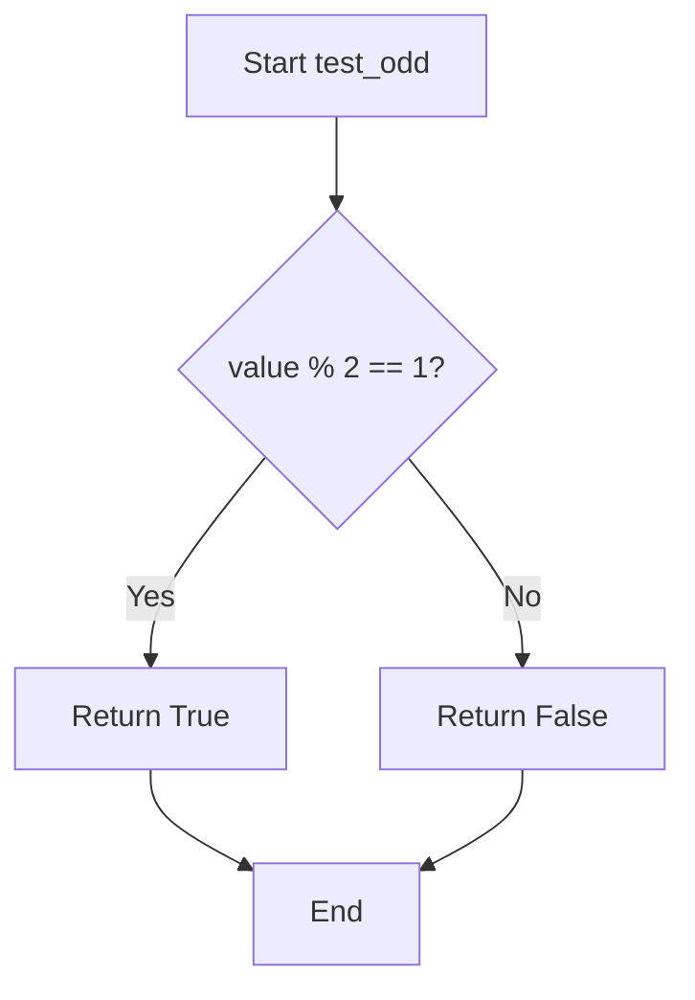
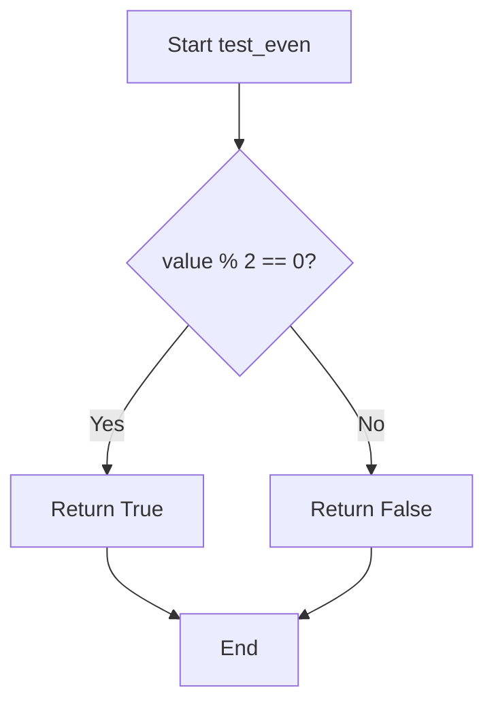
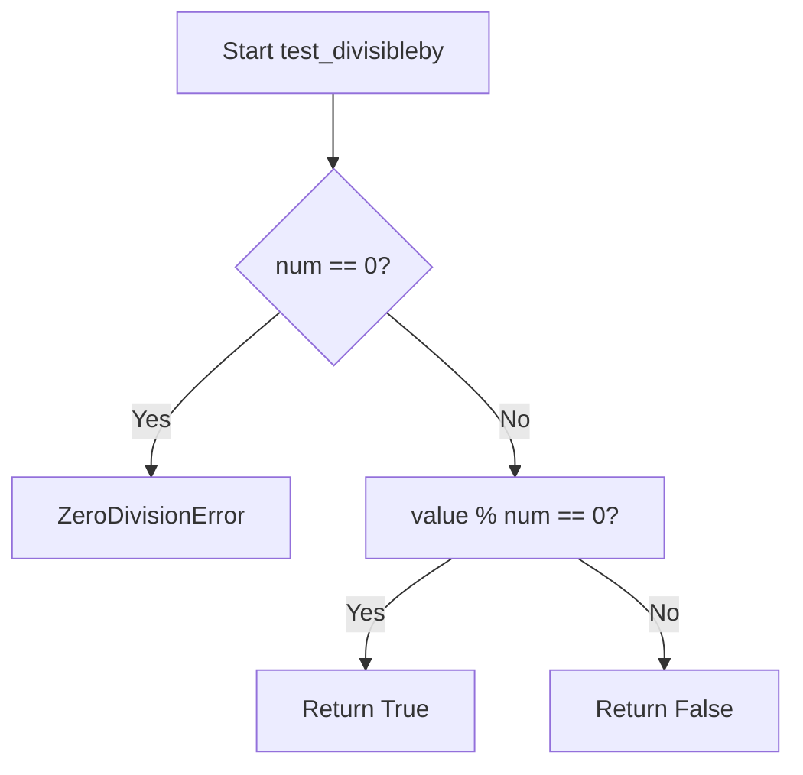
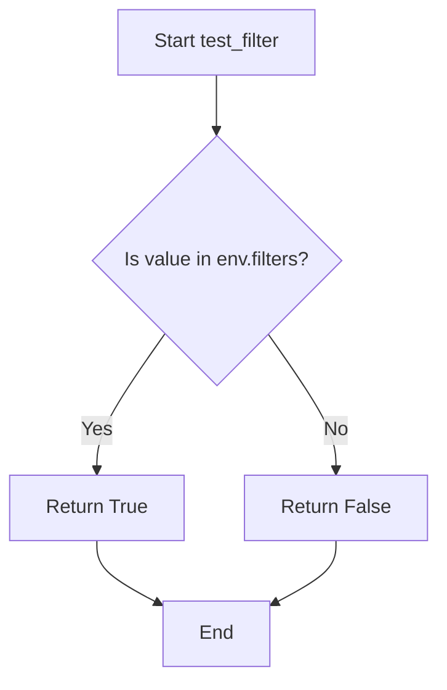
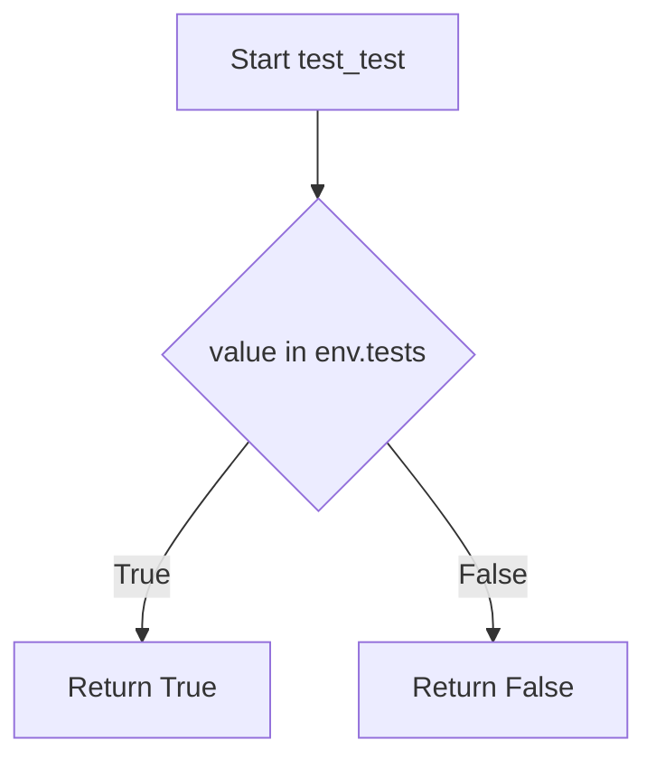
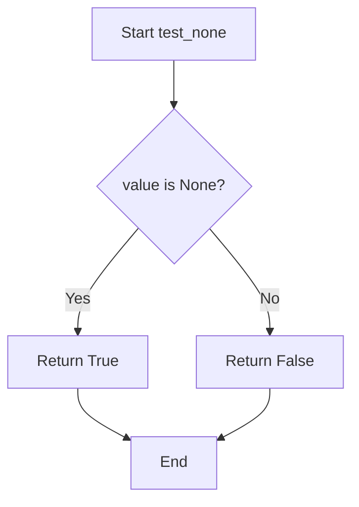
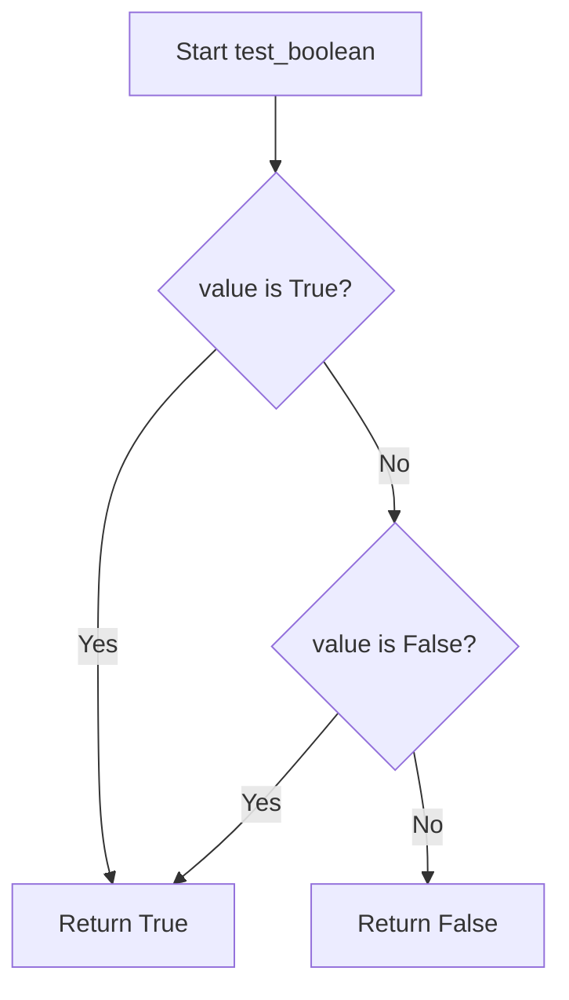
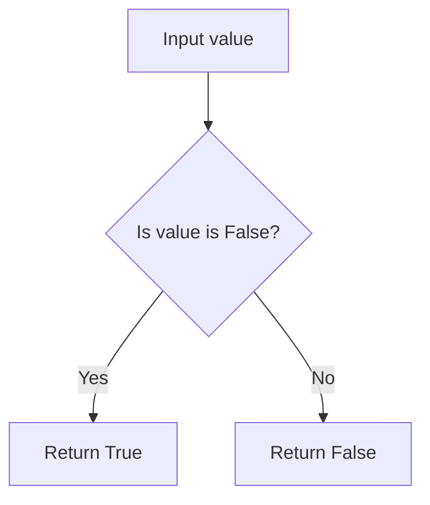
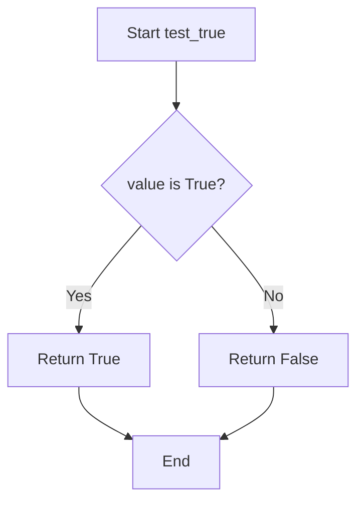
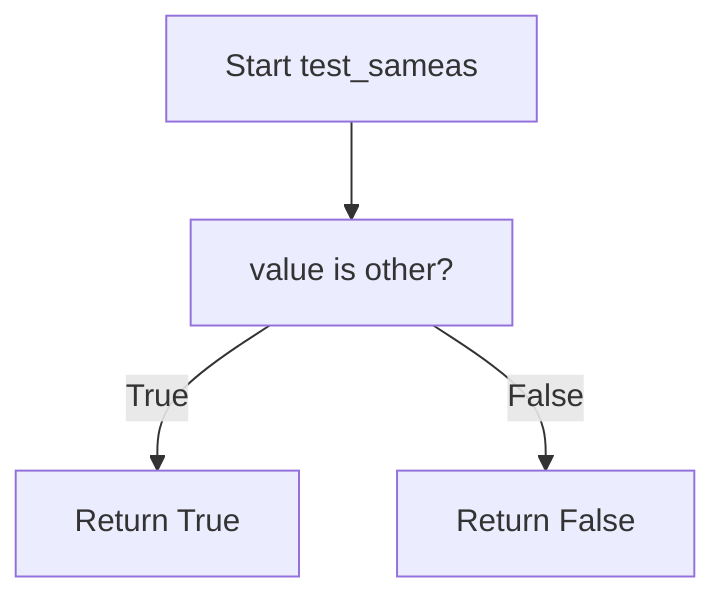

# `tests.py`

## `src.jinja2.tests.test_odd` · *function*

## Summary:
Determines whether an integer value is odd by checking if it has a remainder of 1 when divided by 2.

## Description:
This function evaluates whether a given integer is odd. It is commonly used in Jinja2 template tests to conditionally render content based on the parity of numeric values. The function is part of the testing utilities within the Jinja2 templating engine.

## Args:
    value (int): An integer value to test for oddness. Must be a whole number.

## Returns:
    bool: True if the value is odd (remainder 1 when divided by 2), False if even.

## Raises:
    No exceptions are raised by this function under normal operation.

## Constraints:
    Preconditions:
        - The input value must be an integer type.
    Postconditions:
        - The return value is always a boolean indicating odd/even status.

## Side Effects:
    None. This function has no side effects.

## Control Flow:


## Examples:
    # Test odd number
    result = test_odd(5)  # Returns True
    
    # Test even number
    result = test_odd(4)  # Returns False
```

## `src.jinja2.tests.test_even` · *function*

## Summary:
Determines whether an integer value is even by checking if it is divisible by 2 with no remainder.

## Description:
This function evaluates whether a given integer is evenly divisible by 2, returning True for even numbers and False for odd numbers. It serves as a basic mathematical predicate commonly used in templating logic to make conditional decisions based on numeric parity.

## Args:
    value (int): An integer to test for evenness. Must be a whole number.

## Returns:
    bool: True if the value is divisible by 2 with no remainder, False otherwise.

## Raises:
    None explicitly raised.

## Constraints:
    Preconditions:
        - The input value must be an integer type.
    Postconditions:
        - The return value is always a boolean (True or False).

## Side Effects:
    None.

## Control Flow:


## Examples:
    >>> test_even(4)
    True
    >>> test_even(7)
    False
    >>> test_even(0)
    True
    >>> test_even(-2)
    True
    >>> test_even(-3)
    False
```

## `src.jinja2.tests.test_divisibleby` · *function*

## Summary:
Determines whether one integer is evenly divisible by another integer.

## Description:
This function evaluates if the remainder of dividing `value` by `num` equals zero, indicating that `value` is divisible by `num`. It is commonly used in template logic to conditionally render content based on divisibility rules.

## Args:
    value (int): The dividend to be tested for divisibility.
    num (int): The divisor used to test divisibility. Must not be zero.

## Returns:
    bool: True if `value` is evenly divisible by `num`, False otherwise.

## Raises:
    ZeroDivisionError: When `num` is zero, as attempting to compute `value % 0` raises a ZeroDivisionError in Python.

## Constraints:
    Preconditions:
        - Both `value` and `num` must be integers.
        - `num` must not be zero.
    Postconditions:
        - The result is always a boolean value.
        - The operation performs integer modulo arithmetic.

## Side Effects:
    None.

## Control Flow:


## Examples:
    # Basic usage
    result = test_divisibleby(10, 2)  # Returns True
    result = test_divisibleby(10, 3)  # Returns False
    
    # Edge case with negative numbers
    result = test_divisibleby(-10, 2)  # Returns True
    result = test_divisibleby(10, -2)  # Returns True
    
    # Error case - this will raise ZeroDivisionError
    # test_divisibleby(10, 0)

## `src.jinja2.tests.test_defined` · *function*

## Summary:
Determines whether a Jinja2 template variable is defined (not undefined).

## Description:
Checks if a given value is an instance of the Undefined class from Jinja2's runtime. This test is commonly used in templates to verify that a variable has been assigned a value and is not the special Undefined sentinel value that represents an undefined variable in Jinja2 templates.

## Args:
    value (t.Any): The value to check for definition status. This can be any Python object, including Jinja2's Undefined class instances.

## Returns:
    bool: True if the value is not an instance of Undefined, False otherwise.

## Raises:
    None

## Constraints:
    Preconditions:
        - The input value can be any Python object
        - No specific type constraints beyond being a valid Python object
    
    Postconditions:
        - Always returns a boolean value
        - The returned value accurately reflects whether the input is an Undefined instance

## Side Effects:
    None

## Control Flow:
```mermaid
flowchart TD
    A[Start test_defined] --> B{isinstance(value, Undefined)?}
    B -- Yes --> C[Return False]
    B -- No --> D[Return True]
    C --> E[End]
    D --> E
```

## Examples:
    # Check if a variable is defined in a template context
    
        {{ variable }}
    
        Variable is not defined
    
    
    # Using in Python code
    from jinja2 import Undefined
    result = test_defined("hello")  # Returns True
    result = test_defined(Undefined())  # Returns False
```

## `src.jinja2.tests.test_undefined` · *function*

## Summary:
Tests whether a given value is an instance of the Undefined class in Jinja2 template rendering.

## Description:
This function serves as a utility to check if a value has not been defined within a Jinja2 template context. It is commonly used in template filters, tests, and conditional logic to handle undefined variables gracefully. The function provides a clean interface for distinguishing between defined values and undefined placeholders that are created when template variables are referenced but not assigned.

## Args:
    value (Any): The value to test for being undefined. Can be any Python object including None, primitive types, or custom objects.

## Returns:
    bool: True if the value is an instance of Undefined class, False otherwise.

## Raises:
    None: This function does not raise any exceptions under normal operation.

## Constraints:
    Preconditions:
        - The function accepts any Python object as input
        - No validation is performed on the input type
    
    Postconditions:
        - Always returns a boolean value (True or False)
        - The return value accurately reflects whether the input is an Undefined instance

## Side Effects:
    None: This function performs no I/O operations or external state mutations.

## Control Flow:
```mermaid
flowchart TD
    A[Input value] --> B{isinstance(value, Undefined)?}
    B -->|Yes| C[Return True]
    B -->|No| D[Return False]
```

## Examples:
    >>> from jinja2.runtime import Undefined
    >>> test_undefined(42)
    False
    >>> test_undefined(None)
    False
    >>> test_undefined(Undefined())
    True
    >>> test_undefined("hello")
    False
```

## `src.jinja2.tests.test_filter` · *function*

## Summary:
Checks whether a given filter name exists in the Jinja2 environment's filter registry.

## Description:
This function serves as a utility to validate if a specific filter name is registered within the Jinja2 environment's filters collection. It is commonly used during template compilation or rendering to ensure that referenced filters are available before attempting to apply them.

## Args:
    env (Environment): The Jinja2 environment instance containing registered filters.
    value (str): The name of the filter to check for existence in the environment's filters.

## Returns:
    bool: True if the filter name exists in the environment's filters, False otherwise.

## Raises:
    None explicitly raised.

## Constraints:
    Preconditions:
        - The `env` parameter must be a valid Environment instance.
        - The `value` parameter must be a string representing a filter name.
    Postconditions:
        - The function returns a boolean indicating membership status without modifying the environment.

## Side Effects:
    None.

## Control Flow:


## Examples:
    # Check if 'upper' filter exists
    result = test_filter(environment, 'upper')  # Returns True if 'upper' is registered
    
    # Check if custom filter exists
    result = test_filter(environment, 'custom_filter')  # Returns False if not registered

## `src.jinja2.tests.test_test` · *function*

## Summary:
Checks whether a given test name exists in the environment's test registry.

## Description:
This function serves as a lookup mechanism to determine if a specific test identifier is registered within the Jinja2 environment's test collection. It is used internally by the template engine to validate test names during parsing and compilation phases.

## Args:
    env (Environment): The Jinja2 environment instance containing registered tests.
    value (str): The name of the test to check for existence in the environment.

## Returns:
    bool: True if the test name exists in the environment's tests registry, False otherwise.

## Raises:
    None explicitly raised.

## Constraints:
    Preconditions:
        - The `env` parameter must be a valid Environment instance.
        - The `value` parameter must be a string representing a test name.
    Postconditions:
        - The function returns a boolean indicating membership status without modifying the environment.

## Side Effects:
    None.

## Control Flow:


## Examples:
    # Check if 'equalto' test exists
    result = test_test(environment, 'equalto')  # Returns True
    
    # Check if non-existent test exists
    result = test_test(environment, 'nonexistent')  # Returns False
```

## `src.jinja2.tests.test_none` · *function*

## Summary:
Tests whether a given value is explicitly None.

## Description:
This function performs an identity check to determine if the provided value is exactly None. It is commonly used in Jinja2 template expressions to evaluate conditional logic where the presence of a None value needs to be explicitly tested.

## Args:
    value (Any): The value to test for None equality. Can be any Python object or type.

## Returns:
    bool: True if the value is exactly None, False otherwise.

## Raises:
    None: This function does not raise any exceptions.

## Constraints:
    Preconditions: The function accepts any Python value as input.
    Postconditions: The return value is always a boolean indicating the identity relationship with None.

## Side Effects:
    None: This function has no side effects.

## Control Flow:


## Examples:
    # Basic usage in template context
    {{ value is none }}  # Returns True if value is None
    
    # In conditional logic
    
        Item is missing
    
        Item has value: {{ item }}
    

## `src.jinja2.tests.test_boolean` · *function*

## Summary:
Determines whether a given value is strictly a boolean type (True or False).

## Description:
This function performs a strict boolean type check by verifying if the input value is exactly the singleton boolean objects True or False. It is commonly used in Jinja2 template testing to validate boolean expressions.

## Args:
    value (Any): The value to test for boolean type. Can be any Python object.

## Returns:
    bool: True if the value is exactly True or False, False otherwise.

## Raises:
    None

## Constraints:
    Preconditions: The input value can be any Python object.
    Postconditions: The return value is always a boolean (True or False).

## Side Effects:
    None

## Control Flow:


## Examples:
    >>> test_boolean(True)
    True
    >>> test_boolean(False)
    True
    >>> test_boolean(1)
    False
    >>> test_boolean("True")
    False
```

## `src.jinja2.tests.test_false` · *function*

## Summary:
Determines whether a given value is strictly the boolean False constant.

## Description:
This function performs a strict identity check to determine if the provided value is exactly the Python boolean False object. It is commonly used in Jinja2 template testing contexts to evaluate conditional expressions.

## Args:
    value (Any): The value to test for being strictly False.

## Returns:
    bool: True if the value is exactly False (the singleton boolean object), False otherwise.

## Raises:
    None

## Constraints:
    Preconditions: The function accepts any type of input value.
    Postconditions: The return value is always a boolean indicating strict identity with False.

## Side Effects:
    None

## Control Flow:


## Examples:
    >>> test_false(False)
    True
    >>> test_false(0)
    False
    >>> test_false("")
    False
    >>> test_false(None)
    False
```

## `src.jinja2.tests.test_true` · *function*

## Summary:
Determines whether a given value is strictly the boolean True.

## Description:
This function performs a strict identity check to determine if the provided value is exactly the Python boolean True object. It is commonly used in Jinja2 template tests to evaluate conditional expressions.

## Args:
    value (Any): The value to be tested for strict equality with True.

## Returns:
    bool: True if the value is exactly the boolean True object; False otherwise.

## Raises:
    None

## Constraints:
    Preconditions:
        - The function accepts any type of input value.
    Postconditions:
        - The return value is always a boolean (True or False).
        - The comparison uses identity (`is`) rather than equality (`==`), so only the exact True object returns True.

## Side Effects:
    None

## Control Flow:


## Examples:
    >>> test_true(True)
    True
    >>> test_true(False)
    False
    >>> test_true(1)
    False
    >>> test_true("True")
    False
```

## `src.jinja2.tests.test_integer` · *function*

## Summary:
Tests whether a value is an integer type, excluding boolean values which are technically integers in Python.

## Description:
This function determines if a given value is specifically an integer type while excluding boolean values, since in Python booleans are a subclass of integers. It's commonly used in template rendering contexts where distinguishing between integers and booleans is important for proper type handling.

## Args:
    value (Any): The value to test for integer type compatibility

## Returns:
    bool: True if the value is an integer type and not a boolean; False otherwise

## Raises:
    None

## Constraints:
    Preconditions:
        - The input value can be of any type
    Postconditions:
        - Always returns a boolean value
        - The returned value accurately reflects whether the input is an integer (excluding booleans)

## Side Effects:
    None

## Control Flow:
```mermaid
flowchart TD
    A[Start test_integer] --> B{isinstance(value, int)?}
    B -- Yes --> C{value is True?}
    C -- Yes --> D[Return False]
    C -- No --> E{value is False?}
    E -- Yes --> F[Return False]
    E -- No --> G[Return True]
    B -- No --> H[Return False]
```

## Examples:
    >>> test_integer(42)
    True
    >>> test_integer(True)
    False
    >>> test_integer(False)
    False
    >>> test_integer(3.14)
    False
    >>> test_integer("123")
    False

## `src.jinja2.tests.test_float` · *function*

## Summary:
Determines whether a given value is of type float.

## Description:
This function performs a type check to verify if the provided value is specifically a float instance. It is commonly used in template rendering contexts where type validation is required.

## Args:
    value (Any): The value to be tested for float type compatibility.

## Returns:
    bool: True if the value is an instance of float, False otherwise.

## Raises:
    None

## Constraints:
    Preconditions: The input value can be of any type.
    Postconditions: The return value is always a boolean indicating type match.

## Side Effects:
    None

## Control Flow:
```mermaid
flowchart TD
    A[Start test_float] --> B{isinstance(value, float)?}
    B -- Yes --> C[Return True]
    B -- No --> D[Return False]
```

## Examples:
    >>> test_float(3.14)
    True
    >>> test_float(42)
    False
    >>> test_float("3.14")
    False
```

## `src.jinja2.tests.test_lower` · *function*

## Summary:
Tests whether a string value is entirely lowercase.

## Description:
This function evaluates if the provided value, when converted to a string, consists only of lowercase characters. It is commonly used in Jinja2 templates for conditional logic based on string case. The function handles any input type by converting it to a string before testing.

## Args:
    value (str): The input value to test. Can be any type that can be converted to a string.

## Returns:
    bool: True if the string representation of the value contains only lowercase letters, False otherwise.

## Raises:
    None

## Constraints:
    Preconditions:
        - The input value can be any type that supports string conversion.
    Postconditions:
        - The function always returns a boolean value.
        - The result is determined solely by the case of characters in the string representation.

## Side Effects:
    None

## Control Flow:
```mermaid
flowchart TD
    A[Input value] --> B{Convert to string using str()}
    B --> C{Check if all characters are lowercase using islower()}
    C --> D[Return boolean result]
```

## Examples:
    >>> test_lower("hello")
    True
    >>> test_lower("Hello")
    False
    >>> test_lower("HELLO")
    False
    >>> test_lower(123)
    False
    >>> test_lower("")
    False
```

## `src.jinja2.tests.test_upper` · *function*

## Summary:
Tests whether a string value is entirely uppercase.

## Description:
This function evaluates if the provided value, when converted to a string, consists only of uppercase characters. It is commonly used in Jinja2 templates for conditional logic based on string case.

## Args:
    value (str): The input value to test. Can be any type that can be converted to a string.

## Returns:
    bool: True if the string representation of the value contains only uppercase letters, False otherwise. Empty strings return False.

## Raises:
    None

## Constraints:
    Preconditions:
        - The input value can be of any type, as it will be converted to a string internally.
    Postconditions:
        - The function always returns a boolean value.
        - The conversion to string happens via Python's built-in str() function.

## Side Effects:
    None

## Control Flow:
```mermaid
flowchart TD
    A[Input value] --> B{Convert to string}
    B --> C{Check if isupper()}
    C --> D{Result is True?}
    D -->|Yes| E[Return True]
    D -->|No| F[Return False]
```

## Examples:
    >>> test_upper("HELLO")
    True
    >>> test_upper("Hello")
    False
    >>> test_upper("hello")
    False
    >>> test_upper("")
    False
    >>> test_upper(123)
    False
```

## `src.jinja2.tests.test_string` · *function*

## Summary:
Tests whether a given value is a string instance.

## Description:
This function performs a type check to determine if the provided value is an instance of Python's built-in `str` type. It is commonly used in Jinja2 template rendering to conditionally process string values.

## Args:
    value (Any): The value to test for string type. Can be any Python object.

## Returns:
    bool: True if the value is an instance of str, False otherwise.

## Raises:
    None: This function does not raise any exceptions.

## Constraints:
    Preconditions: The function accepts any Python object as input.
    Postconditions: The return value is always a boolean indicating the type relationship.

## Side Effects:
    None: This function has no side effects.

## Control Flow:
```mermaid
flowchart TD
    A[Start test_string] --> B{isinstance(value, str)?}
    B -->|Yes| C[Return True]
    B -->|No| D[Return False]
    C --> E[End]
    D --> E
```

## Examples:
    >>> test_string("hello")
    True
    >>> test_string(123)
    False
    >>> test_string(None)
    False

## `src.jinja2.tests.test_mapping` · *function*

## Summary:
Tests whether a value is a mapping type (dict-like object).

## Description:
Determines if the provided value implements the collections.abc.Mapping interface, which includes dictionary-like objects and other mapping types.

## Args:
    value (Any): The value to test for mapping type compatibility.

## Returns:
    bool: True if the value is an instance of collections.abc.Mapping, False otherwise.

## Raises:
    None

## Constraints:
    Preconditions: The value parameter can be any Python object.
    Postconditions: Returns a boolean indicating mapping type compatibility.

## Side Effects:
    None

## Control Flow:
```mermaid
flowchart TD
    A[Start test_mapping] --> B{isinstance(value, abc.Mapping)?}
    B -- Yes --> C[Return True]
    B -- No --> D[Return False]
```

## Examples:
    >>> test_mapping({'a': 1})
    True
    >>> test_mapping([1, 2, 3])
    False
    >>> test_mapping("hello")
    False
    >>> test_mapping({})
    True
```

## `src.jinja2.tests.test_number` · *function*

## Summary:
Determines whether a given value is an instance of Python's numeric type hierarchy.

## Description:
This function tests if the provided value belongs to Python's numeric type hierarchy, which includes integers, floating-point numbers, complex numbers, and other numeric types that inherit from the `numbers.Number` abstract base class. It serves as a utility for type checking in Jinja2 template processing and evaluation contexts.

## Args:
    value (Any): The value to test for numeric type compatibility.

## Returns:
    bool: True if the value is an instance of `numbers.Number`, False otherwise.

## Raises:
    None: This function does not raise any exceptions.

## Constraints:
    Preconditions: The function accepts any Python object as input.
    Postconditions: The return value is always a boolean indicating numeric type membership.

## Side Effects:
    None: This function has no side effects and is purely a predicate check.

## Control Flow:
```mermaid
flowchart TD
    A[Start test_number] --> B{isinstance(value, Number)?}
    B -- Yes --> C[Return True]
    B -- No --> D[Return False]
```

## Examples:
    >>> test_number(42)
    True
    >>> test_number(3.14)
    True
    >>> test_number("123")
    False
    >>> test_number(None)
    False
```

## `src.jinja2.tests.test_sequence` · *function*

## Summary:
Determines whether a value implements the sequence protocol by checking for `len()` and `__getitem__` methods.

## Description:
This function tests if a given value behaves like a sequence by attempting to call `len()` and access `__getitem__` methods on it. It's used internally by Jinja2's template engine to identify sequence-like objects for iteration and indexing operations.

## Args:
    value (typing.Any): The object to test for sequence protocol compliance

## Returns:
    bool: True if the value has both `len()` and `__getitem__` methods, False otherwise

## Raises:
    None: This function catches all exceptions and returns False if either check fails

## Constraints:
    Preconditions: The value can be any Python object
    Postconditions: Always returns a boolean value

## Side Effects:
    None: This function performs no I/O operations or external state mutations

## Control Flow:
```mermaid
flowchart TD
    A[Start test_sequence] --> B{Can call len(value)?}
    B -- Yes --> C{Can access __getitem__?}
    C -- Yes --> D[Return True]
    C -- No --> E[Return False]
    B -- No --> F[Return False]
```

## Examples:
    >>> test_sequence([1, 2, 3])
    True
    >>> test_sequence("hello")
    True
    >>> test_sequence(42)
    False
    >>> test_sequence({"a": 1})
    False
    >>> test_sequence(range(5))
    True
```

## `src.jinja2.tests.test_sameas` · *function*

## Summary:
Tests whether two values are the same object in memory (identity comparison).

## Description:
This function performs an identity check using the `is` operator to determine if two variables reference the exact same object in memory. It is commonly used in Jinja2 templates for strict equality comparisons where object identity matters rather than value equality. This function is part of Jinja2's test suite and is typically invoked through template syntax like `value is sameas(other)`.

## Args:
    value (Any): The first value to compare
    other (Any): The second value to compare

## Returns:
    bool: True if value and other are the same object in memory, False otherwise

## Raises:
    None

## Constraints:
    Preconditions: Both arguments can be any Python objects
    Postconditions: Always returns a boolean value

## Side Effects:
    None

## Control Flow:


## Examples:
    # Basic usage in Jinja2 template context
    # value is sameas(other) - checks if they are the same object
    
    # Identity comparison with lists (different objects)
    a = [1, 2, 3]
    b = [1, 2, 3]
    result = test_sameas(a, b)  # Returns False (different objects)
    
    # Identity comparison with same object
    a = [1, 2, 3]
    b = a
    result = test_sameas(a, b)  # Returns True (same object)
    
    # With None values
    result = test_sameas(None, None)  # Returns True
```

## `src.jinja2.tests.test_iterable` · *function*

## Summary:
Determines whether a value is iterable by attempting to create an iterator from it.

## Description:
This function tests if a given value can be iterated over by calling the built-in `iter()` function. It serves as a utility for checking iterable compatibility in Jinja2 template processing, particularly useful for conditional logic in templates where the presence of iteration capability needs to be verified.

## Args:
    value (t.Any): The value to test for iterability. Can be any Python object.

## Returns:
    bool: True if the value is iterable, False otherwise.

## Raises:
    None: This function does not raise any exceptions directly; it catches and handles TypeError internally.

## Constraints:
    Preconditions: The input value can be any Python object.
    Postconditions: The function always returns a boolean value indicating iterability.

## Side Effects:
    None: This function performs no I/O operations or external state mutations.

## Control Flow:
```mermaid
flowchart TD
    A[Start test_iterable] --> B{Can iter() be called?}
    B -- Yes --> C[Return True]
    B -- No --> D[Return False]
```

## Examples:
    >>> test_iterable([1, 2, 3])
    True
    >>> test_iterable("hello")
    True
    >>> test_iterable(42)
    False
    >>> test_iterable(None)
    False
```

## `src.jinja2.tests.test_escaped` · *function*

## Summary:
Determines whether a value has been marked as HTML-escaped by checking for the presence of an `__html__` method.

## Description:
This function tests if a given value implements the `__html__` protocol, which indicates that the value is already safe for HTML rendering and should not be escaped again. It's commonly used in templating systems to prevent double-escaping of trusted HTML content.

The function is typically called during template rendering when deciding whether to escape HTML special characters in a variable's output. This logic is extracted into its own function to provide a clean interface for testing HTML escaping status while keeping the core template rendering logic focused on execution flow.

## Args:
    value (Any): The object to test for HTML escaping status. Can be any Python object.

## Returns:
    bool: True if the value has an `__html__` method, False otherwise. This indicates whether the value is considered "escaped" or safe for direct HTML inclusion.

## Raises:
    None: This function does not raise any exceptions under normal operation.

## Constraints:
    Preconditions:
        - The function accepts any Python object as input
        - No specific type requirements for the input value
    
    Postconditions:
        - Always returns a boolean value (True or False)
        - The return value accurately reflects the presence of `__html__` attribute

## Side Effects:
    None: This function performs no I/O operations or external state mutations. It only performs attribute checking on the input object.

## Control Flow:
```mermaid
flowchart TD
    A[Start test_escaped] --> B{Has __html__ attribute?}
    B -- Yes --> C[Return True]
    B -- No --> D[Return False]
```

## Examples:
    # Testing with a regular string
    result = test_escaped("hello")  # Returns False
    
    # Testing with an object that implements __html__
    class SafeHtml:
        def __html__(self):
            return "<p>Safe HTML</p>"
    
    safe_obj = SafeHtml()
    result = test_escaped(safe_obj)  # Returns True
```

## `src.jinja2.tests.test_in` · *function*

## Summary:
Checks whether a value exists within a container sequence.

## Description:
This function determines if a given value is present in a container such as a list, tuple, string, or other sequence types. It serves as a core utility for evaluating membership conditions in Jinja2 template expressions.

## Args:
    value (Any): The item to search for within the sequence.
    seq (Container): The container (list, tuple, string, etc.) to search in.

## Returns:
    bool: True if the value is found in the sequence, False otherwise.

## Raises:
    None explicitly raised.

## Constraints:
    Preconditions:
        - The `seq` argument must support the `in` operator (i.e., implement `__contains__`).
        - The `value` argument should be compatible with the container's element type for meaningful comparison.
    Postconditions:
        - The function returns a boolean indicating membership status.
        - No modifications are made to either input arguments.

## Side Effects:
    None.

## Control Flow:
```mermaid
flowchart TD
    A[Start test_in] --> B{value in seq?}
    B -- Yes --> C[Return True]
    B -- No --> D[Return False]
```

## Examples:
    # Check if a number is in a list
    result = test_in(3, [1, 2, 3, 4])  # Returns True
    
    # Check if a character is in a string
    result = test_in('a', 'hello')  # Returns False
    
    # Check if a string is in a list of strings
    result = test_in('world', ['hello', 'world'])  # Returns True
```

