# `utils.py`

## `src.jinja2.utils.pass_context` · *function*

## Summary:
Decorator that marks a function to receive the Jinja2 context object as its first argument.

## Description:
The `pass_context` decorator is used to indicate that a function should be called with the Jinja2 context object as its first argument. This allows functions decorated with `pass_context` to access template variables, environment settings, and other context-related information during template rendering.

This logic is extracted into its own function rather than being inlined because it provides a clean, reusable mechanism for marking functions that require context access, separating the concern of context passing from the function's core logic. The decorator sets an attribute on the function that the Jinja2 engine uses to determine how to invoke the function.

## Args:
    f (F): The function to be decorated, where F is a generic type representing any callable.

## Returns:
    F: The same function f, but with an added attribute `jinja_pass_arg` set to `_PassArg.context`.

## Raises:
    None explicitly raised.

## Constraints:
    Preconditions:
        - The input function f must be callable.
        - The `_PassArg.context` enumeration member must be defined and accessible.
    
    Postconditions:
        - The returned function retains all original functionality of f.
        - The returned function has an additional attribute `jinja_pass_arg` set to `_PassArg.context`.

## Side Effects:
    None.

## Control Flow:
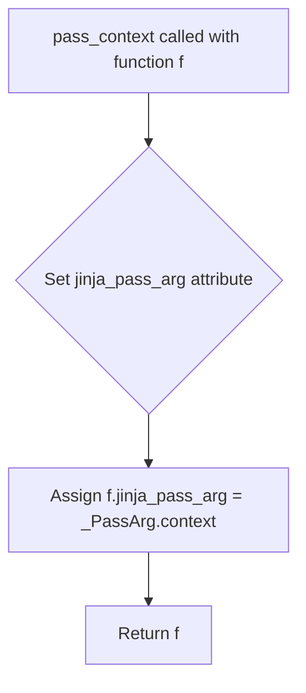

## Examples:
```python
from jinja2.utils import pass_context

@pass_context
def my_filter(context, value):
    # Access context information here
    return value.upper()

# This function will be called with the Jinja2 context as the first argument
```

## `src.jinja2.utils.pass_eval_context` · *function*

## Summary:
Decorator that marks a function to receive the evaluation context as its first argument.

## Description:
This decorator is used to indicate that a Jinja2 template function should receive the evaluation context as its first argument. It sets an attribute on the function to signal this requirement to the Jinja2 template engine. This allows template functions to access evaluation context information such as the current template scope, variables, and other runtime information without requiring explicit passing of these arguments.

## Args:
    f (F): The function to be decorated, where F is a callable type that will receive the evaluation context as its first argument.

## Returns:
    F: The same function with the jinja_pass_arg attribute set to _PassArg.eval_context.

## Raises:
    None explicitly raised.

## Constraints:
    Preconditions:
        - The function `f` must be a callable object.
        - The `_PassArg.eval_context` enumeration member must be defined and accessible.
    
    Postconditions:
        - The returned function will have a `jinja_pass_arg` attribute set to `_PassArg.eval_context`.
        - The original function `f` is returned unchanged except for the added attribute.

## Side Effects:
    None.

## Control Flow:
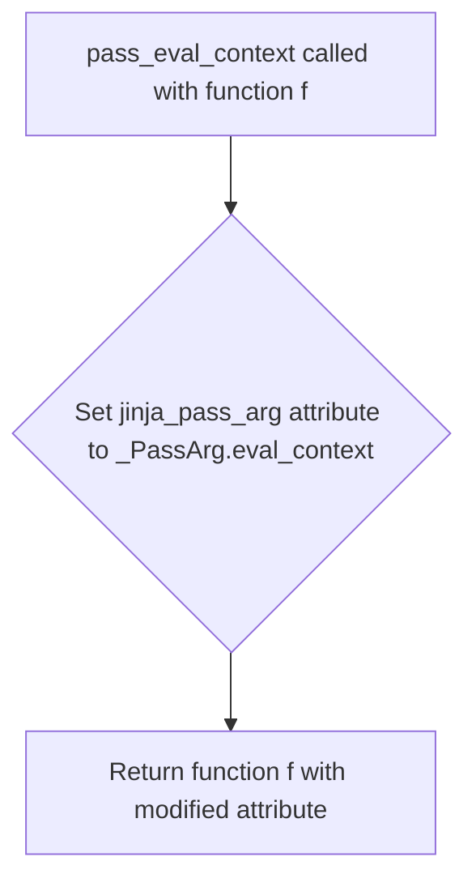

## Examples:
```python
@pass_eval_context
def my_template_function(eval_context, other_args):
    # Function receives evaluation context as first argument
    return eval_context.get('variable', 'default')

# The decorated function now has jinja_pass_arg = _PassArg.eval_context
# When used in a Jinja2 template, the evaluation context will be automatically provided
```

## `src.jinja2.utils.pass_environment` · *function*

## Summary:
Decorator that marks a function to receive the Jinja2 environment as its first argument.

## Description:
This decorator is used to indicate that a function should be passed the Jinja2 environment object as its first argument when called in a template context. It sets an attribute on the function to signal this requirement to the Jinja2 template engine. This allows template functions to access the Jinja2 environment without requiring explicit passing of the environment object by the template author.

## Args:
    f (F): The function to be decorated, where F is a generic type representing a callable.

## Returns:
    F: The same function with the jinja_pass_arg attribute set to _PassArg.environment.

## Raises:
    None explicitly raised.

## Constraints:
    Preconditions:
        - The function `f` must be a callable object.
        - The `_PassArg` enum must be defined and contain an `environment` member.
    
    Postconditions:
        - The returned function retains all original functionality.
        - The `jinja_pass_arg` attribute is added to the function object.
        - The attribute value is set to `_PassArg.environment`.

## Side Effects:
    None.

## Control Flow:
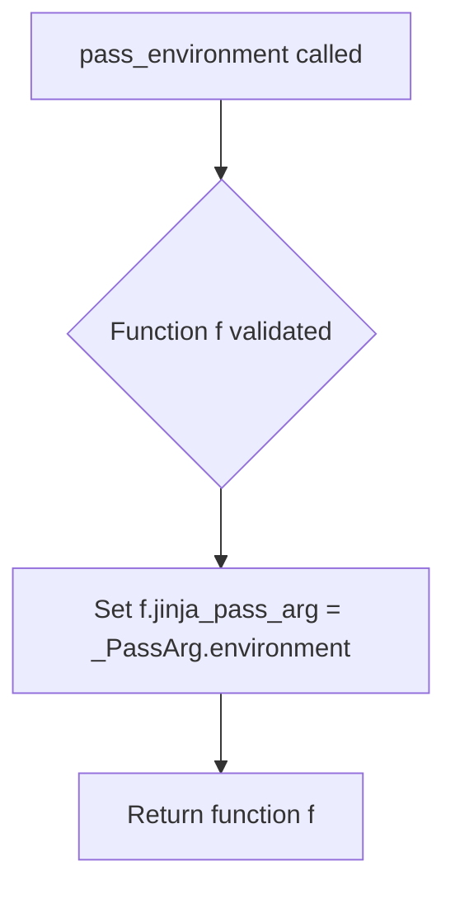

## Examples:
```python
@pass_environment
def my_function(environment, other_args):
    # This function will receive the Jinja2 environment as first argument
    return environment

# Usage in Jinja2 template context
# The environment will be automatically passed when the function is called
```

## `src.jinja2.utils._PassArg` · *class*

## Summary:
An enumeration representing arguments that can be passed to Jinja2 template functions, used to control function call behavior in template rendering.

## Description:
The `_PassArg` class defines an enumeration of argument types that can be passed to Jinja2 template functions. It serves as a marker for functions that need special handling during template execution, indicating which contextual arguments should be automatically provided to the function. This abstraction allows template functions to declare their dependency on specific context objects without requiring explicit passing of these arguments by the template author.

## State:
- `context`: An enumeration member representing the template context object
- `eval_context`: An enumeration member representing the evaluation context object  
- `environment`: An enumeration member representing the Jinja2 environment object

## Lifecycle:
- Creation: Instances are created automatically as part of the enum definition and cannot be instantiated manually
- Usage: The `from_obj` class method is used to extract the `_PassArg` value from objects that have a `jinja_pass_arg` attribute
- Destruction: No explicit cleanup required as this is an immutable enum

## Method Map:
```mermaid
graph TD
    A[_PassArg.from_obj] --> B[_PassArg]
    B --> C{hasattr(obj, "jinja_pass_arg")}
    C -->|True| D[obj.jinja_pass_arg]
    C -->|False| E[None]
```

## Raises:
- No exceptions are raised by the constructor or class methods

## Example:
```python
# Define a function that should receive the template context
def my_function(context):
    return context['variable']

# Mark the function with the appropriate pass argument
my_function.jinja_pass_arg = _PassArg.context

# Later, retrieve the pass argument
pass_arg = _PassArg.from_obj(my_function)  # Returns _PassArg.context
```

### `src.jinja2.utils._PassArg.from_obj` · *method*

## Summary:
Retrieves a Jinja2 pass argument enumeration from an object if it has the appropriate attribute.

## Description:
This method serves as a factory function to extract a `_PassArg` enumeration value from an object that contains a `jinja_pass_arg` attribute. It is used to determine which arguments should be passed to a Jinja2 template callable based on the object's metadata. This method is typically called during template compilation or execution to inspect callable objects for their required argument passing behavior.

## Args:
    cls: The `_PassArg` class itself (used for classmethod semantics).
    obj: An arbitrary object that may contain a `jinja_pass_arg` attribute.

## Returns:
    `_PassArg` or None: The `_PassArg` enumeration value if the object has a `jinja_pass_arg` attribute; otherwise, None.

## Raises:
    None explicitly raised.

## State Changes:
    Attributes READ: `obj.jinja_pass_arg`
    Attributes WRITTEN: None

## Constraints:
    Preconditions: The `obj` parameter must be a valid Python object that can be checked for attribute existence using `hasattr()`.
    Postconditions: If the object has a `jinja_pass_arg` attribute, it must be a valid `_PassArg` enumeration value.

## Side Effects:
    None.

## `src.jinja2.utils.internalcode` · *function*

## Summary:
Decorator that marks a function's code object as internal by adding it to the internal_code tracking set.

## Description:
This decorator identifies functions as internal implementation details within the Jinja2 templating system. When applied to a function, it stores the function's code object in a global set called `internal_code` for tracking purposes. This allows the system to distinguish between public API functions and internal helper functions, which may be useful for debugging, introspection, or optimization processes.

The decorator is typically used on utility functions, helper methods, or implementation details that are not part of the public API but are essential for the internal operation of Jinja2.

## Args:
    f (F): The function to be marked as internal. The type F is a generic type representing any callable object (function, method, etc.).

## Returns:
    F: The original function unchanged, enabling seamless decorator usage in function definitions.

## Raises:
    None explicitly raised by this function.

## Constraints:
    Preconditions:
    - The input parameter `f` must be a callable object with a `__code__` attribute
    - The function must be a valid Python callable (standard function, method, lambda, etc.)
    
    Postconditions:
    - The function's code object is added to the global `internal_code` set
    - The returned function is identical to the input function
    - No modifications are made to the function's behavior or interface

## Side Effects:
    - Mutates the global `internal_code` set by adding the function's code object
    - No other external state changes occur

## Control Flow:
```mermaid
flowchart TD
    A[Call internalcode(f)] --> B{f has __code__?}
    B -- Yes --> C[Add f.__code__ to internal_code]
    C --> D[Return f]
    B -- No --> E[Raises AttributeError]
```

## Examples:
```python
# Marking an internal helper function
@internalcode
def _render_template_string(template_str, context):
    # Implementation details here
    pass

# The decorated function behaves identically to the original
result = _render_template_string("Hello {{ name }}", {"name": "World"})
```

## `src.jinja2.utils.is_undefined` · *function*

## Summary:
Determines whether an object is an instance of the Undefined class used in Jinja2 template rendering.

## Description:
Checks if the provided object is an instance of the Undefined class, which represents undefined variables in Jinja2 templates. This utility function is used throughout the Jinja2 codebase to identify and handle undefined template variables gracefully. The function provides a clean abstraction for checking undefined status without directly importing or referencing the Undefined class elsewhere in the codebase.

## Args:
    obj (t.Any): The object to check for being undefined

## Returns:
    bool: True if the object is an instance of Undefined, False otherwise

## Raises:
    None

## Constraints:
    Preconditions: The obj parameter can be any Python object
    Postconditions: Always returns a boolean value indicating the undefined status

## Side Effects:
    None

## Control Flow:
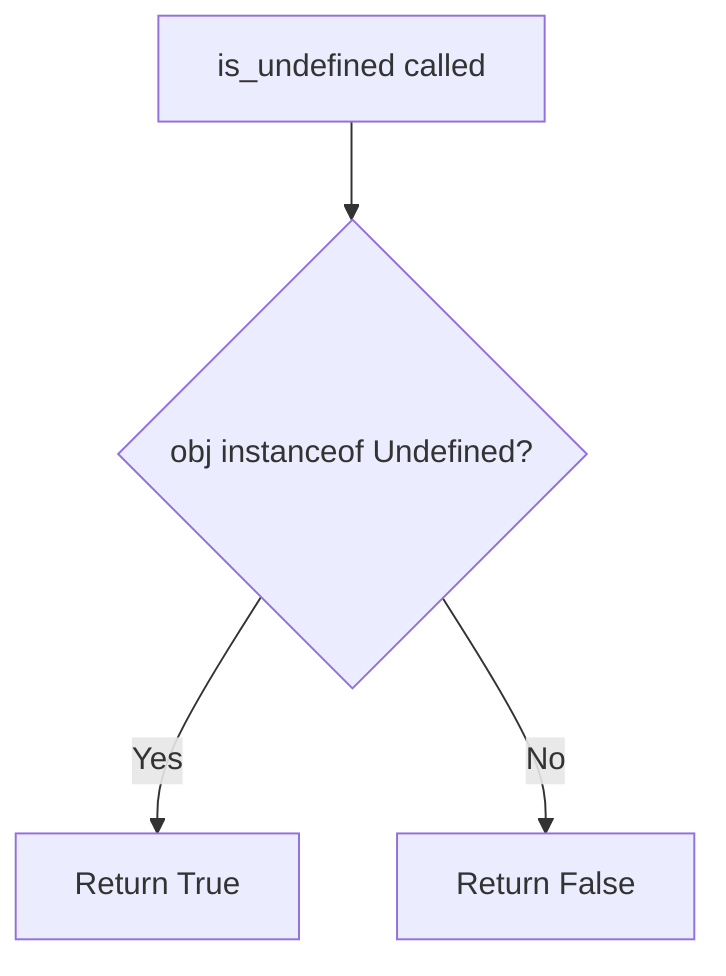

## Examples:
    >>> from jinja2.runtime import Undefined
    >>> is_undefined(Undefined())
    True
    >>> is_undefined("hello")
    False
    >>> is_undefined(None)
    False
    >>> is_undefined(42)
    False

## `src.jinja2.utils.consume` · *function*

## Summary:
Consumes an iterable by iterating through all elements and discarding them, effectively exhausting the iterator without storing values.

## Description:
This function is designed to fully consume an iterable by iterating over each element and discarding it. It serves as a utility for efficiently draining iterators or generators without retaining any of their values. The function is commonly used in scenarios where the side effects of iteration are desired, but the actual values are irrelevant.

## Args:
    iterable (typing.Iterable[typing.Any]): An iterable object containing elements to be consumed. This can be any object that implements the iterator protocol.

## Returns:
    None: This function does not return any value.

## Raises:
    No exceptions are explicitly raised by this function.

## Constraints:
    Preconditions:
        - The input must be an iterable object that implements the iterator protocol.
        - The iterable should not raise exceptions during iteration, as these will propagate up to the caller.

    Postconditions:
        - The iterable will be completely exhausted after calling this function.
        - No values from the iterable will be retained or returned.

## Side Effects:
    None: This function does not perform any I/O operations or mutate external state.

## Control Flow:
```mermaid
flowchart TD
    A[Start consume()] --> B[Iterate through iterable]
    B --> C[Discard each item]
    C --> D[End of iterable?]
    D -->|No| C
    D -->|Yes| E[Return None]
```

## Examples:
    >>> my_list = [1, 2, 3, 4, 5]
    >>> consume(my_list)
    >>> print(list(my_list))
    []
    
    >>> def generator():
    ...     for i in range(3):
    ...         yield i
    >>> gen = generator()
    >>> consume(gen)
    >>> print(list(gen))
    []

## `src.jinja2.utils.clear_caches` · *function*

## Summary:
Clears internal caching mechanisms used by Jinja2 to ensure fresh processing.

## Description:
This function clears two internal caches used by Jinja2: the spontaneous environment cache and the lexer cache. It is typically called when cache invalidation is required to ensure subsequent template processing operates with clean state rather than stale cached data. The function serves as a utility for resetting internal state during testing or when cache consistency is critical.

## Args:
    None

## Returns:
    None

## Raises:
    None

## Constraints:
    Preconditions:
    - The function assumes that `get_spontaneous_environment` and `_lexer_cache` are properly initialized and support the `cache_clear()` method.
    
    Postconditions:
    - Both caches are emptied, removing all previously stored entries.
    - Subsequent calls to functions that rely on these caches will regenerate their values.

## Side Effects:
    - Mutates internal global state by clearing two cache objects.
    - No external I/O operations occur.

## Control Flow:
```mermaid
flowchart TD
    A[clear_caches()] --> B[get_spontaneous_environment.cache_clear()]
    B --> C[_lexer_cache.clear()]
    C --> D[Return None]
```

## Examples:
```python
# Clear all caches to ensure fresh processing
clear_caches()

# Typically called during testing or when cache invalidation is required
# No return value to check
```

## `src.jinja2.utils.import_string` · *function*

## Summary:
Dynamically imports a Python object from a string specification, supporting module-only, dotted attribute, and colon-separated import formats.

## Description:
This function enables dynamic import of Python objects using string specifications. It handles three import formats: module-only names (e.g., "os"), dotted attribute access (e.g., "collections.defaultdict"), and colon-separated module-object pairs (e.g., "myapp.views:main"). The function is designed to be robust and safe, with optional silent failure mode.

## Args:
    import_name (str): String specifying the import target, which can be a module name, dotted attribute path, or colon-separated module-object pair.
    silent (bool): When True, suppresses ImportError and AttributeError exceptions. When False, these exceptions are re-raised. Defaults to False.

## Returns:
    Any: The imported Python object. May return a module, class, function, or any other object depending on the import specification. When silent=True and import fails, the function does not return (implicitly returns None).

## Raises:
    ImportError: Raised when the module cannot be imported, unless silent=True.
    AttributeError: Raised when the specified object does not exist within the imported module, unless silent=True.

## Constraints:
    Preconditions:
        - The import_name parameter must be a valid string.
        - If import_name contains a colon, it must be followed by a valid object name.
        - If import_name contains dots, they must represent a valid dotted attribute path.
    Postconditions:
        - If successful, returns the requested object or module.
        - If silent=True and import fails, the function does not return (raises exception instead).

## Side Effects:
    None: This function does not perform any I/O operations or mutate external state.

## Control Flow:
```mermaid
flowchart TD
    A[Start import_string] --> B{Contains colon?}
    B -- Yes --> C[Split on colon]
    B -- No --> D{Contains dot?}
    D -- Yes --> E[Split on last dot]
    D -- No --> F[Direct module import]
    C --> G[Import module]
    E --> G
    G --> H{Module imported successfully?}
    H -- Yes --> I[Get object from module]
    I --> J[Return object]
    H -- No --> K[Handle exception]
    K --> L{silent=False?}
    L -- Yes --> M[Raise exception]
    L -- No --> N[Function exits silently (returns None)]
    F --> O[Import module]
    O --> P[Return module]
```

## Examples:
    # Import a module
    math_module = import_string('math')
    
    # Import an object from a module
    defaultdict_class = import_string('collections.defaultdict')
    
    # Import an object using colon syntax
    view_function = import_string('myapp.views:main')
    
    # Silent import (exception suppressed)
    result = import_string('nonexistent.module', silent=True)
    # In this case, result will be None (function implicitly returns None)
```

## `src.jinja2.utils.open_if_exists` · *function*

## Summary:
Attempts to open a file only if it exists, returning a file handle or None.

## Description:
This function provides a safe way to open a file by first checking if it exists. It prevents errors that would occur when trying to open non-existent files. The function is commonly used in template rendering contexts where optional files might be referenced.

## Args:
    filename (str): Path to the file to be opened.
    mode (str): File opening mode. Defaults to "rb" (read binary).

## Returns:
    Optional[IO]: A file handle if the file exists, None otherwise.

## Raises:
    None explicitly raised.

## Constraints:
    Preconditions:
        - filename must be a valid string path.
    Postconditions:
        - If file exists, returns an open file handle with specified mode.
        - If file does not exist, returns None.

## Side Effects:
    - May perform file system I/O operations (checking file existence and opening file).
    - No external state mutations.

## Control Flow:
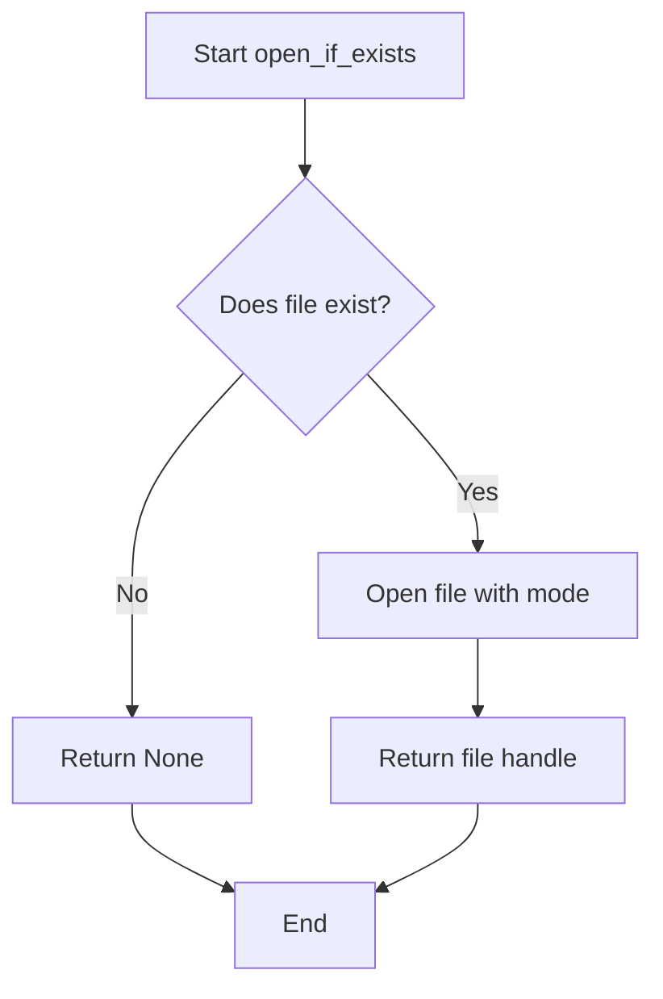

## Examples:
    # Opening an existing file
    file_handle = open_if_exists("config.json", "r")
    if file_handle:
        content = file_handle.read()
        file_handle.close()
    
    # Attempting to open a non-existing file
    file_handle = open_if_exists("nonexistent.txt")
    assert file_handle is None
```

## `src.jinja2.utils.object_type_repr` · *function*

## Summary:
Returns a string representation of an object's type, formatted to distinguish built-in types from custom types.

## Description:
This function provides a standardized way to represent object types as strings. It handles special cases like `None` and `Ellipsis` explicitly, and formats the type representation differently based on whether the type belongs to the built-in module or a custom module. This extraction allows consistent type representation across the Jinja2 template engine without duplicating the logic.

## Args:
    obj (Any): The object whose type representation is to be generated.

## Returns:
    str: A string describing the object's type. For built-in types, returns "{type_name} object". For custom types, returns "{module}.{type_name} object". Special cases return "None" or "Ellipsis".

## Raises:
    None: This function does not raise any exceptions.

## Constraints:
    Preconditions:
        - The function accepts any Python object as input.
    Postconditions:
        - The returned string is always a valid representation of the object's type.
        - The string format is consistent for all objects of the same type.

## Side Effects:
    None: This function has no side effects.

## Control Flow:
```mermaid
flowchart TD
    A[Start object_type_repr] --> B{obj is None?}
    B -- Yes --> C[Return "None"]
    B -- No --> D{obj is Ellipsis?}
    D -- Yes --> E[Return "Ellipsis"]
    D -- No --> F[Get type of obj]
    F --> G{type.__module__ == "builtins"?}
    G -- Yes --> H[Return "{type.__name__} object"]
    G -- No --> I[Return "{type.__module__}.{type.__name__} object"]
```

## Examples:
    >>> object_type_repr(None)
    'None'
    >>> object_type_repr(...)
    'Ellipsis'
    >>> object_type_repr(42)
    'int object'
    >>> object_type_repr([1, 2, 3])
    'list object'
    >>> object_type_repr({"key": "value"})
    'dict object'
    >>> object_type_repr(str)
    'builtins.str object'
```

## `src.jinja2.utils.pformat` · *function*

## Summary:
Formats an object into a pretty-printed string representation suitable for debugging and logging.

## Description:
This function provides a wrapper around Python's standard `pprint.pformat` function to produce human-readable string representations of objects. It is commonly used within Jinja2 templates and utilities for debugging template variables, rendering complex data structures, or displaying structured information in development environments.

The function extracts the formatting logic into its own utility to ensure consistent pretty-printing behavior across the Jinja2 codebase while maintaining a clean separation of concerns.

## Args:
    obj (Any): The Python object to be formatted. Can be any type supported by `pprint.pformat`.

## Returns:
    str: A string containing the pretty-printed representation of the input object.

## Raises:
    None: This function does not explicitly raise exceptions; however, it may propagate exceptions from `pprint.pformat` if the object contains unrepresentable types.

## Constraints:
    - Preconditions: The input object must be serializable by `pprint.pformat`.
    - Postconditions: The returned string is a valid, readable representation of the input object.

## Side Effects:
    - None: This function has no side effects beyond returning a formatted string.

## Control Flow:
```mermaid
flowchart TD
    A[Call pformat(obj)] --> B{Import pprint}
    B --> C[Call pprint.pformat(obj)]
    C --> D[Return formatted string]
```

## Examples:
```python
# Basic usage
data = {'name': 'Alice', 'age': 30, 'hobbies': ['reading', 'swimming']}
formatted = pformat(data)
print(formatted)
# Output:
# {'age': 30,
#  'hobbies': ['reading', 'swimming'],
#  'name': 'Alice'}

# With nested structures
nested_data = {'users': [{'id': 1, 'name': 'Bob'}, {'id': 2, 'name': 'Charlie'}]}
formatted = pformat(nested_data)
print(formatted)
# Output:
# {'users': [{'id': 1, 'name': 'Bob'},
#            {'id': 2, 'name': 'Charlie'}]}
```

## `src.jinja2.utils.urlize` · *function*

## Summary:
Converts URLs and email addresses in text into HTML anchor tags while preserving formatting and handling edge cases.

## Description:
Processes input text to automatically detect and convert URLs (HTTP/HTTPS/mailto) and email addresses into clickable HTML anchor tags. This function is designed to be used in template rendering to safely transform plain text containing web links or contact information into properly formatted HTML hyperlinks.

The function handles various edge cases including:
- Text with surrounding punctuation and HTML entities
- Parentheses and brackets balancing
- URL truncation based on a limit
- Custom HTML attributes for links (rel, target)
- Support for custom URL schemes beyond standard HTTP/HTTPS/mailto

This logic is extracted into its own function rather than being inlined because it encapsulates complex text processing and HTML generation logic that could be reused across different template contexts, ensuring consistent link formatting behavior throughout the application.

## Args:
    text (str): The input text to process for URL/email detection and conversion
    trim_url_limit (int, optional): Maximum length of URL to display before truncating with ellipsis. If None, no truncation occurs
    rel (str, optional): Value for the HTML rel attribute on generated links
    target (str, optional): Value for the HTML target attribute on generated links
    extra_schemes (Iterable[str], optional): Additional URL schemes to recognize beyond standard HTTP/HTTPS/mailto

## Returns:
    str: The processed text with URLs and email addresses converted to HTML anchor tags, while preserving all other text formatting

## Raises:
    None explicitly raised - though underlying regex operations may raise re.error if patterns are malformed

## Constraints:
    Preconditions:
    - Input text must be convertible to string
    - All attribute values (rel, target) must be safe for HTML attributes
    - The internal regex patterns (_http_re and _email_re) must be properly defined
    
    Postconditions:
    - Output text contains valid HTML anchor tags for detected URLs/emails
    - All other text remains unchanged
    - HTML entities in input are properly escaped

## Side Effects:
    None - This function is pure and has no observable side effects beyond returning transformed text

## Control Flow:
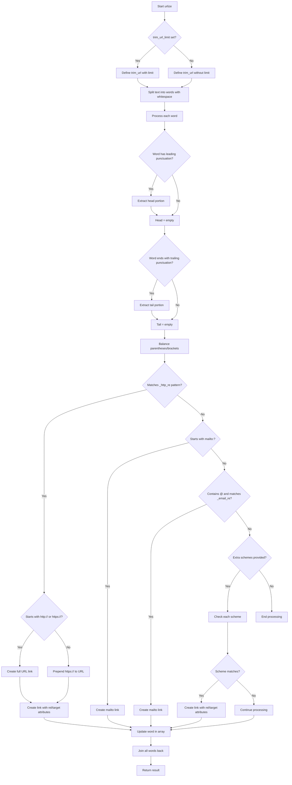

## Examples:
    Basic URL conversion:
    >>> urlize("Visit https://example.com for more info")
    'Visit <a href="https://example.com">https://example.com</a> for more info'
    
    Email address conversion:
    >>> urlize("Contact us at admin@example.com")
    'Contact us at <a href="mailto:admin@example.com">admin@example.com</a>'
    
    With URL truncation:
    >>> urlize("See https://very-long-url.example.com/path", trim_url_limit=10)
    'See <a href="https://very-long-url.example.com/path">https://very-l...</a>'
    
    With custom attributes:
    >>> urlize("Go to https://example.com", rel="nofollow", target="_blank")
    'Go to <a href="https://example.com" rel="nofollow" target="_blank">https://example.com</a>'

## `src.jinja2.utils.generate_lorem_ipsum` · *function*

## Summary:
Generates randomized placeholder text in lorem ipsum style with optional HTML formatting.

## Description:
Creates paragraph(s) of randomized text using a predefined set of lorem ipsum words. The function generates sentences with randomized word counts, punctuation, and capitalization patterns to simulate natural text generation. It can return plain text or HTML-formatted paragraphs with proper escaping for safe rendering.

## Args:
    n (int): Number of paragraphs to generate. Defaults to 5.
    html (bool): Whether to wrap output in HTML paragraph tags. Defaults to True.
    min (int): Minimum number of words per paragraph. Defaults to 20.
    max (int): Maximum number of words per paragraph. Defaults to 100.

## Returns:
    str: Generated placeholder text. When html=True, returns a markupsafe.Markup object containing HTML paragraphs with escaped content; when html=False, returns plain text with paragraphs separated by double newlines.

## Raises:
    None explicitly raised.

## Constraints:
    Preconditions:
        - n must be non-negative integer
        - min and max must be positive integers with min <= max
        - LOREM_IPSUM_WORDS constant must contain space-separated words
    Postconditions:
        - Output contains exactly n paragraphs
        - Each paragraph has between min and max words
        - Paragraphs end with either period or comma followed by period
        - HTML output is properly escaped to prevent XSS

## Side Effects:
    - Uses random number generation via randrange and choice functions
    - Accesses LOREM_IPSUM_WORDS constant from module scope
    - Calls markupsafe.escape() when generating HTML output to prevent XSS

## Control Flow:
```mermaid
flowchart TD
    A[Start generate_lorem_ipsum] --> B{n > 0?}
    B -- Yes --> C[Initialize result list]
    B -- No --> F[Return empty string]
    C --> D[For each paragraph (n iterations)]
    D --> E[Generate random word count (min to max)]
    E --> G[Initialize sentence components]
    G --> H[Generate words loop]
    H --> I[Choose random word from LOREM_IPSUM_WORDS]
    I --> J[Ensure word differs from previous]
    J --> K[Apply capitalization if needed]
    K --> L[Add punctuation if needed]
    L --> M[Append word to sentence]
    M --> N[Check if more words needed]
    N --> H
    H --> O[Join words into sentence]
    O --> P[Fix ending punctuation]
    P --> Q[Add sentence to result]
    Q --> R[Next paragraph?]
    R -- Yes --> D
    R -- No --> S[Join results]
    S --> T{HTML format?}
    T -- Yes --> U[Wrap in <p> tags with escaping]
    T -- No --> V[Join with double newlines]
    U --> W[Return Markup object]
    V --> W
```

## Examples:
    # Generate 3 paragraphs with default settings
    text = generate_lorem_ipsum(3)
    # Returns HTML formatted text with 3 paragraphs
    
    # Generate 2 plain text paragraphs
    text = generate_lorem_ipsum(2, html=False)
    # Returns plain text with double newlines between paragraphs
    
    # Generate paragraphs with custom word count range
    text = generate_lorem_ipsum(1, min=10, max=30)
    # Returns 1 paragraph with 10-30 words

## `src.jinja2.utils.url_quote` · *function*

## Summary:
Encodes an object into a URL-safe string representation, handling various input types and optional query string formatting.

## Description:
This function converts any input object into a URL-encoded string. It handles strings, bytes, and other objects by converting them to bytes using the specified character encoding, then applying URL encoding. When used for query strings, it replaces spaces with plus signs for compatibility. This extraction allows consistent URL encoding behavior across the Jinja2 template system.

## Args:
    obj (Any): The input object to encode. Can be a string, bytes, or any object that can be converted to a string.
    charset (str): The character encoding to use when converting non-byte, non-string objects to bytes. Defaults to "utf-8".
    for_qs (bool): If True, formats the result for use in URL query strings by replacing "%20" with "+". Defaults to False.

## Returns:
    str: A URL-safe encoded string representation of the input object.

## Raises:
    None explicitly raised by this function.

## Constraints:
    Preconditions:
        - The `charset` parameter must be a valid character encoding recognized by Python's `encode()` method.
        - The `obj` parameter can be of any type, but must be convertible to bytes or string.
    Postconditions:
        - The returned string is always URL-safe and suitable for inclusion in URLs.
        - When `for_qs=True`, spaces are represented as "+" characters instead of "%20".

## Side Effects:
    None.

## Control Flow:
```mermaid
flowchart TD
    A[Start url_quote] --> B{isinstance(obj, bytes)?}
    B -- Yes --> C[Set safe = b"" if for_qs else b"/"]
    B -- No --> D{isinstance(obj, str)?}
    D -- No --> E[obj = str(obj)]
    E --> F[obj = obj.encode(charset)]
    F --> C
    C --> G[quote_from_bytes(obj, safe)]
    G --> H{for_qs?}
    H -- Yes --> I[rv = rv.replace("%20", "+")]
    H -- No --> J[Return rv]
    I --> J
```

## Examples:
    >>> url_quote("hello world")
    'hello%20world'
    
    >>> url_quote("hello world", for_qs=True)
    'hello+world'
    
    >>> url_quote(123)
    '123'
    
    >>> url_quote(b"hello world")
    'hello%20world'
    
    >>> url_quote("café", charset="utf-8")
    'caf%C3%A9'
```

## `src.jinja2.utils.LRUCache` · *class*

## Summary:
LRUCache implements a thread-safe, fixed-capacity cache with Least Recently Used eviction policy.

## Description:
LRUCache provides a dictionary-like interface with automatic eviction of least recently used items when capacity is exceeded. It is designed for concurrent access and maintains item usage order through an internal queue. Common usage includes caching compiled templates, lexer states, or other expensive-to-compute objects that benefit from reuse.

## State:
- capacity: int, positive integer defining maximum number of items the cache can hold
- _mapping: dict[Any, Any], stores key-value pairs for fast lookup
- _queue: deque[Any], maintains insertion order and tracks usage for LRU eviction
- _popleft: method reference to deque.popleft for efficient removal of oldest items
- _pop: method reference to deque.pop for removing items from end
- _remove: method reference to deque.remove for removing specific items
- _wlock: threading.Lock instance for synchronizing concurrent operations
- _append: method reference to deque.append for adding items to end

## Lifecycle:
- Creation: Instantiate with positive integer capacity parameter
- Usage: Access via standard dictionary operations (__getitem__, __setitem__, etc.) or convenience methods (get, setdefault)
- Destruction: Automatic cleanup when object goes out of scope; implements pickle protocol for serialization

## Method Map:
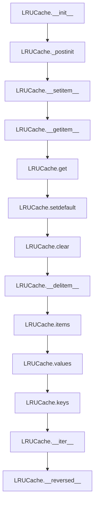

## Raises:
- None explicitly raised by __init__; capacity must be a positive integer (assumed validated externally)

## Example:
```python
# Create cache with capacity 3
cache = LRUCache(3)

# Add items
cache['a'] = 1
cache['b'] = 2
cache['c'] = 3

# Access items (updates usage order)
value = cache['a']

# Adding item beyond capacity evicts least recently used
cache['d'] = 4  # This removes 'b' (least recently used)

# Check contents
print(list(cache))  # ['c', 'a', 'd']
print(len(cache))   # 3
```

### `src.jinja2.utils.LRUCache.__init__` · *method*

## Summary:
Initializes an LRUCache instance with a specified capacity and sets up internal data structures for tracking cached items and their usage order.

## Description:
The `__init__` method configures the LRUCache object by storing the maximum capacity, initializing empty data structures for item storage and usage tracking, and performing additional setup through the `_postinit` method. This method establishes the foundation for the cache's operation, ensuring that all internal components are properly initialized before the cache can be used.

## Args:
    self: The LRUCache instance being initialized.
    capacity (int): The maximum number of items the cache can hold. Must be a positive integer.

## Returns:
    None: This method does not return any value.

## Raises:
    None: This method does not raise any exceptions directly; capacity validation is assumed to occur externally.

## State Changes:
    Attributes READ: 
    - None
    
    Attributes WRITTEN:
    - self.capacity: Stores the maximum capacity of the cache
    - self._mapping: Initializes an empty dictionary for fast key-value lookups
    - self._queue: Initializes an empty deque to track item usage order
    - self._postinit: Calls the post-initialization setup method

## Constraints:
    Preconditions:
    - The capacity argument must be a positive integer.
    - The LRUCache instance must be in a fresh state before this method is called.
    
    Postconditions:
    - The cache has a defined capacity limit.
    - Internal data structures (_mapping and _queue) are initialized.
    - Additional setup (method references, locks) is completed via _postinit.

## Side Effects:
    None: This method does not perform any I/O operations or mutate external state.

### `src.jinja2.utils.LRUCache._postinit` · *method*

## Summary:
Initializes internal method references and synchronization primitives for the LRU cache queue operations.

## Description:
This method is called during the initialization of an LRUCache instance to set up efficient references to deque methods and establish a write lock for thread safety. It is invoked from the `__init__` method and ensures that all queue manipulation operations have direct method references for optimal performance, while also setting up the necessary locking mechanism for concurrent access.

## Args:
    self: The LRUCache instance being initialized.

## Returns:
    None: This method does not return any value.

## Raises:
    None: This method does not raise any exceptions.

## State Changes:
    Attributes READ: 
    - self._queue
    
    Attributes WRITTEN:
    - self._popleft
    - self._pop
    - self._remove
    - self._wlock
    - self._append

## Constraints:
    Preconditions:
    - The LRUCache instance must have been initialized with a capacity and have an empty `_mapping` dictionary and `_queue` deque.
    - The `_queue` attribute must be a valid deque object.
    
    Postconditions:
    - All deque methods (`popleft`, `pop`, `remove`, `append`) are bound to the instance for direct access.
    - A `Lock` object is created and assigned to `self._wlock` for thread-safe operations.

## Side Effects:
    None: This method does not perform any I/O operations or mutate external state.

### `src.jinja2.utils.LRUCache.__getstate__` · *method*

## Summary:
Serializes the LRU cache state for pickling by returning its internal data structures.

## Description:
This method is part of Python's pickle protocol and is called when serializing an LRUCache instance. It provides a dictionary representation of the cache's essential state components, enabling the cache to be properly reconstructed during unpickling. The method is invoked automatically by Python's pickle module during serialization operations.

## Args:
    None

## Returns:
    Mapping[str, Any]: A dictionary containing the cache's capacity and internal data structures (_mapping and _queue) necessary for reconstruction.

## Raises:
    None

## State Changes:
    Attributes READ: capacity, _mapping, _queue
    Attributes WRITTEN: None

## Constraints:
    Preconditions: The LRUCache instance must be in a valid state with initialized attributes.
    Postconditions: The returned dictionary contains all necessary state information for proper cache reconstruction.

## Side Effects:
    None

### `src.jinja2.utils.LRUCache.__setstate__` · *method*

## Summary:
Restores the LRUCache object's state from a serialized dictionary and reinitializes internal cache attributes.

## Description:
This method is part of Python's pickle protocol and is called during unpickling to restore the object's state. It updates the instance's __dict__ with the provided dictionary and reinitializes internal cache attributes by calling _postinit(). This ensures that the LRU cache maintains proper internal state after deserialization.

Known callers:
- pickle.load() and pickle.loads() during object reconstruction
- Any pickle-related deserialization process

This method exists separately from inline logic to ensure proper initialization of internal cache attributes that depend on the restored queue state.

## Args:
    d (Mapping[str, Any]): A dictionary containing serialized state data to restore

## Returns:
    None: This method does not return a value

## Raises:
    None explicitly raised

## State Changes:
    Attributes READ: None
    Attributes WRITTEN: All attributes from the input dictionary are written to self.__dict__, followed by internal cache attributes initialized by _postinit() including _popleft, _pop, _remove, _wlock, and _append

## Constraints:
    Preconditions: The input dictionary must contain valid state data compatible with the LRUCache instance
    Postconditions: The LRUCache instance will have restored state and properly initialized internal attributes

## Side Effects:
    None

### `src.jinja2.utils.LRUCache.__getnewargs__` · *method*

## Summary:
Returns the arguments needed to reconstruct the LRU cache instance during pickling.

## Description:
This method is part of Python's pickle protocol and is called when serializing an LRUCache instance. It provides the minimal set of arguments required to recreate the cache with its original capacity. The method is invoked during the pickling process by Python's pickle module to determine what constructor arguments should be used.

## Args:
    None

## Returns:
    tuple: A single-element tuple containing the cache capacity (int), which is used to reconstruct the LRUCache instance during unpickling.

## Raises:
    None

## State Changes:
    Attributes READ: self.capacity
    Attributes WRITTEN: None

## Constraints:
    Preconditions: The LRUCache instance must be properly initialized with a valid capacity.
    Postconditions: The returned tuple contains exactly one element representing the cache capacity.

## Side Effects:
    None

### `src.jinja2.utils.LRUCache.copy` · *method*

## Summary:
Creates a shallow copy of the LRU cache with identical capacity, mapping, and queue contents.

## Description:
This method creates a new instance of the same LRUCache class with the same capacity, then copies over the internal mapping and queue contents from the original cache. It's designed to produce an independent copy that maintains the same LRU ordering and cached values.

## Args:
    None

## Returns:
    LRUCache: A new LRUCache instance with the same capacity, mapping, and queue contents as the original.

## Raises:
    None

## State Changes:
    Attributes READ: self.capacity, self._mapping, self._queue
    Attributes WRITTEN: rv._mapping, rv._queue (through update and extend operations)

## Constraints:
    Preconditions: The method assumes self is a valid LRUCache instance with proper initialization of capacity, _mapping, and _queue attributes.
    Postconditions: The returned cache has identical capacity, mapping, and queue contents to the original, but is a separate object instance.

## Side Effects:
    None

### `src.jinja2.utils.LRUCache.get` · *method*

## Summary:
Retrieves a value from the cache by key, returning a default value if the key is not present.

## Description:
This method provides a safe way to access cached values without raising a KeyError. It attempts to retrieve the value associated with the given key using the standard dictionary-style access (`self[key]`). If the key is not found, it returns the specified default value instead of raising an exception.

The method is part of the LRUCache class implementation and serves as a convenience wrapper around the standard dictionary access pattern, allowing callers to safely fetch cached items while providing fallback behavior. When a key is successfully found, the accessed item is moved to the most recently used position in the cache queue (via the underlying `__getitem__` method).

## Args:
    key (Any): The key to look up in the cache
    default (Any, optional): The value to return if the key is not found. Defaults to None

## Returns:
    Any: The cached value associated with the key, or the default value if the key is not present

## Raises:
    None: KeyError is caught internally and handled gracefully

## State Changes:
    Attributes READ: self._mapping, self._queue
    Attributes WRITTEN: None

## Constraints:
    Preconditions: The LRUCache instance must be properly initialized with a valid capacity
    Postconditions: The method does not modify the cache state (no insertion, deletion, or reordering occurs) except for updating the LRU order when the key exists

## Side Effects:
    None

### `src.jinja2.utils.LRUCache.setdefault` · *method*

## Summary:
Returns the value for a key if it exists in the cache, otherwise sets and returns a default value, updating the cache's LRU tracking.

## Description:
This method implements a standard "get if exists, otherwise set and return" pattern for the LRU Cache. It attempts to retrieve a value for the given key, and if the key is not found (KeyError is raised), it sets the key to the provided default value and returns that default. This method is particularly useful for lazy initialization of cached values that may not yet exist.

The method leverages the existing `__getitem__` and `__setitem__` implementations to maintain consistency with the LRU cache's access tracking and size management policies. When a key is found, it's moved to the most recently used position in the cache's internal queue. When a key is set, the `__setitem__` method handles proper LRU eviction and positioning.

## Args:
    key (Any): The key to look up in the cache.
    default (Any, optional): The default value to set if the key is not found. Defaults to None.

## Returns:
    Any: The existing value if the key exists, otherwise the default value that was set.

## Raises:
    KeyError: If the key does not exist in the cache's internal mapping (this is caught internally and handled by setting the default).

## State Changes:
    Attributes READ: self._mapping, self._queue, self._wlock (through __getitem__)
    Attributes WRITTEN: self._mapping, self._queue (through __setitem__)

## Constraints:
    Preconditions: The cache instance must be properly initialized with a valid capacity.
    Postconditions: If the key doesn't exist, it will be added to the cache with the provided default value, and the key will be moved to the most recently used position in the queue.

## Side Effects:
    Thread-safety: This method acquires and releases the write lock (`self._wlock`) during execution to ensure concurrent access safety.
    Cache modifications: The method modifies the internal `_mapping` and `_queue` attributes to maintain cache consistency and LRU ordering.

### `src.jinja2.utils.LRUCache.clear` · *method*

## Summary:
Clears all entries from the LRU cache, resetting its internal mapping and queue.

## Description:
This method removes all key-value pairs from the LRU cache and clears the underlying data structures. It is designed to provide a clean slate for the cache instance while maintaining thread safety through the write lock.

## Args:
    None

## Returns:
    None

## Raises:
    None

## State Changes:
    Attributes READ: self._wlock, self._mapping, self._queue
    Attributes WRITTEN: self._mapping, self._queue

## Constraints:
    Preconditions: The LRUCache instance must be properly initialized with a valid capacity and internal state.
    Postconditions: After execution, both self._mapping and self._queue will be empty, and the cache will be effectively cleared.

## Side Effects:
    None

### `src.jinja2.utils.LRUCache.__contains__` · *method*

## Summary:
Checks if a key exists in the LRU cache mapping.

## Description:
This method implements the `in` operator for the LRUCache class, allowing developers to test membership of a key in the cache. It provides a clean interface for checking whether a specific key is currently stored in the cache without triggering any side effects like updating the LRU queue.

## Args:
    key (Any): The key to check for existence in the cache.

## Returns:
    bool: True if the key exists in the cache, False otherwise.

## Raises:
    None

## State Changes:
    Attributes READ: self._mapping
    Attributes WRITTEN: None

## Constraints:
    Preconditions: The method assumes self._mapping is a valid dictionary-like object.
    Postconditions: The method does not modify the cache state or update any LRU tracking.

## Side Effects:
    None

### `src.jinja2.utils.LRUCache.__len__` · *method*

## Summary:
Returns the number of key-value pairs currently stored in the LRU cache.

## Description:
This method provides the current size of the LRU cache by returning the length of the internal mapping dictionary. It is called during the normal operation of the cache to determine how many items are currently being tracked.

## Args:
    None

## Returns:
    int: The number of key-value pairs currently stored in the cache.

## Raises:
    None

## State Changes:
    Attributes READ: self._mapping
    Attributes WRITTEN: None

## Constraints:
    Preconditions: The object must be properly initialized with a valid _mapping attribute.
    Postconditions: The method returns an integer representing the current cache size without modifying the cache contents.

## Side Effects:
    None

### `src.jinja2.utils.LRUCache.__repr__` · *method*

## Summary:
Returns a string representation of the LRU cache showing its type and internal mapping.

## Description:
This method provides a human-readable string representation of the LRUCache instance, primarily for debugging and logging purposes. It is automatically called when the built-in `repr()` function is applied to an LRUCache object. The representation includes the class name and the internal `_mapping` dictionary, which contains the cached key-value pairs.

## Args:
    None

## Returns:
    str: A formatted string representation in the form "<ClassName {mapping!r}>" where mapping is the internal dictionary of cached items.

## Raises:
    None

## State Changes:
    Attributes READ: self._mapping
    Attributes WRITTEN: None

## Constraints:
    Preconditions: The LRUCache instance must be properly initialized with a `_mapping` attribute.
    Postconditions: The returned string accurately represents the current state of the internal mapping.

## Side Effects:
    None

### `src.jinja2.utils.LRUCache.__getitem__` · *method*

## Summary:
Retrieves a value from the LRU cache by key and updates its position in the access queue to mark it as most recently used.

## Description:
This method implements the dictionary-style retrieval of values from an LRU (Least Recently Used) cache. When a key is accessed, the method updates the internal access queue to reflect that this key was recently used, ensuring proper LRU eviction behavior. The method is thread-safe and uses a write lock to protect concurrent access.

The method is called during dictionary-style access patterns (e.g., `cache[key]`) and serves as the core mechanism for maintaining cache hit statistics and implementing the LRU eviction policy. It's designed to be efficient by avoiding unnecessary queue operations when the accessed item is already at the most recently used position.

This method is part of the standard dictionary protocol and is invoked whenever an item is accessed via bracket notation. It ensures that frequently accessed items remain near the end of the queue (most recently used position), while infrequently accessed items move toward the beginning (least recently used position).

## Args:
    key (Any): The key to retrieve from the cache. Must exist in the cache, otherwise a KeyError will be raised.

## Returns:
    Any: The value associated with the provided key in the cache.

## Raises:
    KeyError: If the key does not exist in the cache's internal mapping.

## State Changes:
    Attributes READ: self._wlock, self._mapping, self._queue, self._remove, self._append
    Attributes WRITTEN: self._queue (via _append and _remove operations)

## Constraints:
    Preconditions: The key must exist in self._mapping before calling this method.
    Postconditions: After execution, the key will be moved to the end of self._queue (most recently used position) if it wasn't already there.

## Side Effects:
    None: This method does not perform any I/O operations or mutate external objects.

### `src.jinja2.utils.LRUCache.__setitem__` · *method*

## Summary:
Updates or inserts a key-value pair in the LRU cache, maintaining cache size limits and updating access order.

## Description:
This method implements the core logic for setting values in the LRU (Least Recently Used) cache. It ensures thread safety through a write lock, manages cache size by removing the least recently used item when necessary, and updates the access order of items. When a key already exists, it's moved to the most recently used position. When the cache is full, the least recently used item is evicted before adding the new item.

This method is part of the standard dictionary protocol and is invoked during dictionary-style assignment operations (e.g., `cache[key] = value`). It serves as the primary mechanism for maintaining cache consistency and implementing the LRU eviction policy.

## Args:
    key (Any): The key to set or update in the cache
    value (Any): The value to associate with the key

## Returns:
    None: This method does not return a value

## Raises:
    None explicitly raised: This method does not raise exceptions directly, though underlying operations may raise exceptions

## State Changes:
    Attributes READ: self._mapping, self._queue, self._wlock, self.capacity
    Attributes WRITTEN: self._mapping, self._queue

## Constraints:
    Preconditions: 
    - The cache instance must be properly initialized with a positive capacity
    - The key and value arguments must be valid for the underlying dictionary operations
    Postconditions:
    - The key-value pair is stored in self._mapping
    - The key is tracked in self._queue for LRU tracking
    - If the cache was at capacity, the least recently used item is removed
    - The operation maintains thread safety via self._wlock

## Side Effects:
    None: This method does not perform I/O or mutate external state beyond the cache itself

### `src.jinja2.utils.LRUCache.__delitem__` · *method*

## Summary:
Removes a key-value pair from the LRU cache and updates the access queue.

## Description:
This method implements the deletion of a key from the LRU (Least Recently Used) cache. It removes the key from the internal mapping and ensures the key is also removed from the access tracking queue. The method is thread-safe and uses a write lock to protect concurrent modifications. This method is part of the standard dictionary protocol and is called when using the `del` operator on an LRUCache instance.

The method handles two distinct operations: first, it deletes the key from the internal mapping dictionary, and second, it attempts to remove the key from the access tracking queue. If the key is not present in the queue (which can happen if it was already evicted or never accessed), the ValueError is gracefully ignored.

## Args:
    key (Any): The key to remove from the cache. Must exist in the cache, otherwise a KeyError will be raised by the underlying mapping operation.

## Returns:
    None: This method does not return any value.

## Raises:
    KeyError: If the key does not exist in the cache's internal mapping. This occurs when attempting to delete a non-existent key.

## State Changes:
    Attributes READ: self._wlock, self._mapping, self._remove
    Attributes WRITTEN: self._mapping, self._queue

## Constraints:
    Preconditions: The key must exist in self._mapping before calling this method.
    Postconditions: After execution, the key will be removed from both self._mapping and self._queue (if present).

## Side Effects:
    None: This method does not perform any I/O operations or mutate external objects.

### `src.jinja2.utils.LRUCache.items` · *method*

## Summary:
Returns an iterable of key-value pairs from the LRU cache in most-recently-used order.

## Description:
This method provides access to all key-value pairs stored in the LRU cache, ordered from most recently used to least recently used. It is used internally by the cache's iteration protocols and can also be called directly to retrieve the full cache contents in LRU order.

## Args:
    None

## Returns:
    t.Iterable[t.Tuple[t.Any, t.Any]]: An iterable of (key, value) tuples representing all items in the cache, ordered from most recently used to least recently used.

## Raises:
    None

## State Changes:
    Attributes READ: self._mapping, self._queue
    Attributes WRITTEN: None

## Constraints:
    Preconditions: The LRUCache instance must be properly initialized with valid _mapping and _queue attributes.
    Postconditions: The returned iterable contains all key-value pairs currently in the cache, maintaining LRU ordering.

## Side Effects:
    None

### `src.jinja2.utils.LRUCache.values` · *method*

## Summary:
Returns an iterable of all values stored in the LRU cache, ordered from most recently used to least recently used.

## Description:
This method extracts and returns all values from the LRU cache in the same order as the cache's items. It leverages the existing `items()` method to retrieve key-value pairs and then maps them to extract just the values. This method is useful when you need to access all cached values without their associated keys, maintaining the LRU ordering that reflects usage patterns.

## Args:
    None

## Returns:
    t.Iterable[t.Any]: An iterable of all values currently stored in the cache, ordered from most recently used to least recently used.

## Raises:
    None

## State Changes:
    Attributes READ: self._mapping, self._queue
    Attributes WRITTEN: None

## Constraints:
    Preconditions: The LRUCache instance must be properly initialized with valid _mapping and _queue attributes.
    Postconditions: The returned iterable contains all values currently in the cache, maintaining LRU ordering.

## Side Effects:
    None

### `src.jinja2.utils.LRUCache.keys` · *method*

## Summary:
Returns an iterable of all keys currently stored in the LRU cache, ordered from most recently used to least recently used.

## Description:
This method provides access to the keys in the LRU cache by converting the cache's iterator into a list. It leverages the cache's `__iter__` method which yields keys in reverse order of their usage (most recent first). This method is useful for inspecting the current state of the cache without modifying it.

## Args:
    None

## Returns:
    list[t.Any]: A list containing all keys in the cache, ordered from most recently used to least recently used.

## Raises:
    None

## State Changes:
    Attributes READ: self._queue
    Attributes WRITTEN: None

## Constraints:
    Preconditions: The LRUCache instance must be properly initialized.
    Postconditions: The returned list contains all keys currently in the cache, maintaining the LRU ordering.

## Side Effects:
    None

### `src.jinja2.utils.LRUCache.__iter__` · *method*

## Summary:
Returns an iterator over the cache keys in reverse order of their usage, with the most recently used key first.

## Description:
This method provides iteration over the keys stored in the LRU cache, ordered from most recently used to least recently used. It is used primarily for implementing the standard Python iteration protocol (__iter__) for the LRUCache class. The method is called during iteration operations like 'for key in cache' or 'list(cache)'.

The implementation returns `reversed(tuple(self._queue))`, which means keys are yielded in reverse order of their position in the internal queue. This reflects the LRU (Least Recently Used) eviction policy where the most recently accessed items appear at the end of the queue.

## Args:
    None

## Returns:
    Iterator[Any]: An iterator that yields keys in reverse usage order (most recent first)

## Raises:
    None

## State Changes:
    Attributes READ: self._queue
    Attributes WRITTEN: None

## Constraints:
    Preconditions: The LRUCache instance must be properly initialized with a valid capacity and queue
    Postconditions: The returned iterator reflects the current state of the cache's usage queue

## Side Effects:
    None

### `src.jinja2.utils.LRUCache.__reversed__` · *method*

## Summary:
Returns an iterator that traverses the cache keys in reverse insertion order, starting with the most recently added item.

## Description:
This method implements Python's `__reversed__` special method to enable reverse iteration over the LRU cache keys. It provides a way to traverse the cache entries from most recent to oldest insertion order. This is particularly useful for implementing LRU eviction policies or examining cache contents in chronological order.

## Args:
    None

## Returns:
    Iterator[Any]: An iterator that yields keys in reverse insertion order (most recent first).

## Raises:
    None

## State Changes:
    Attributes READ: self._queue
    Attributes WRITTEN: None

## Constraints:
    Preconditions: The LRUCache instance must be properly initialized with a valid capacity and queue.
    Postconditions: The returned iterator will yield all keys currently in the cache, in reverse insertion order.

## Side Effects:
    None

## `src.jinja2.utils.select_autoescape` · *function*

## Summary:
Creates a callable that determines whether autoescaping should be enabled for a given template based on file extension patterns.

## Description:
This function generates a predicate function that evaluates whether autoescaping should be enabled for Jinja2 templates based on their file extensions. It's designed to be used as a configuration option in Jinja2 environments to automatically enable HTML/XML escaping for specific template types while leaving others unescaped.

The logic is extracted into its own function to provide reusable, configurable autoescape selection behavior that can be applied consistently across different template loading contexts.

## Args:
    enabled_extensions (Collection[str]): File extensions that should trigger autoescaping. Defaults to ("html", "htm", "xml").
    disabled_extensions (Collection[str]): File extensions that should explicitly disable autoescaping. Defaults to ().
    default_for_string (bool): Whether to enable autoescaping when the template name is None (e.g., for string templates). Defaults to True.
    default (bool): Default autoescape setting when no pattern matches. Defaults to False.

## Returns:
    Callable[[Optional[str]], bool]: A function that takes a template name and returns a boolean indicating whether autoescaping should be enabled.

## Raises:
    No explicit exceptions are raised by this function.

## Constraints:
    Preconditions:
    - All elements in enabled_extensions and disabled_extensions should be valid file extensions (without leading dots)
    - The returned callable accepts None or string arguments for template names
    
    Postconditions:
    - The returned function will always return a boolean value
    - Template names are compared in lowercase for case-insensitive matching

## Side Effects:
    None

## Control Flow:
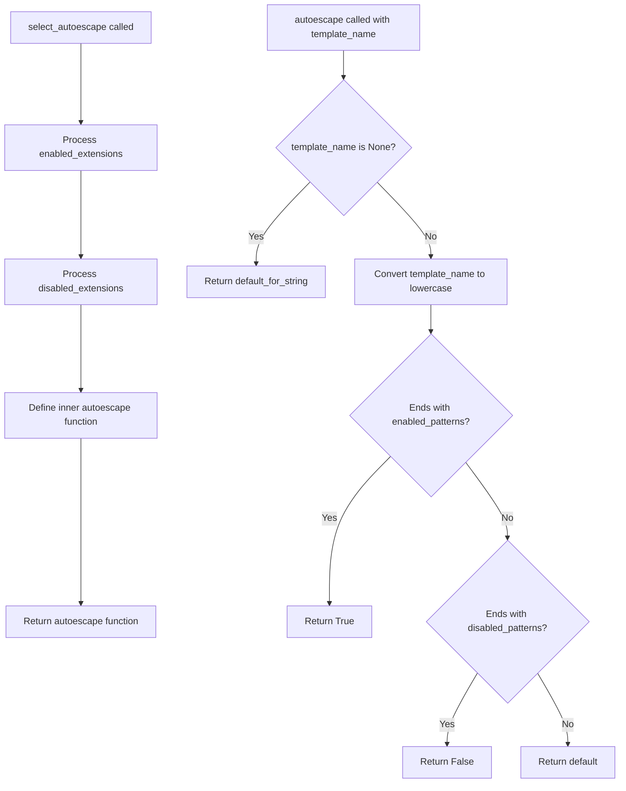

## Examples:
```python
# Basic usage with defaults
autoescape_func = select_autoescape()
# Enables autoescaping for .html, .htm, .xml files
result = autoescape_func("page.html")  # Returns True
result = autoescape_func("style.css")  # Returns False

# Custom extensions
autoescape_func = select_autoescape(
    enabled_extensions=("html", "htm", "xml", "json"),
    disabled_extensions=("txt",),
    default=True
)
result = autoescape_func("data.json")  # Returns True
result = autoescape_func("notes.txt")  # Returns False
result = autoescape_func(None)         # Returns True (default_for_string)
```

## `src.jinja2.utils.htmlsafe_json_dumps` · *function*

## Summary:
Creates HTML-safe JSON string representation of an object for use in Jinja2 templates.

## Description:
Converts a Python object to a JSON string and escapes HTML characters to prevent XSS vulnerabilities when embedding JSON data in HTML templates. This function is extracted from the core Jinja2 template processing logic to provide a reusable utility for safely serializing data that will be rendered in HTML contexts.

## Args:
    obj (Any): The Python object to serialize to JSON
    dumps (Optional[Callable[..., str]]): Custom JSON serialization function. Defaults to json.dumps if None
    **kwargs (Any): Additional keyword arguments passed to the dumps function

## Returns:
    markupsafe.Markup: An HTML-safe JSON string wrapped in Markup type that Jinja2 treats as safe for rendering

## Raises:
    Any exceptions raised by the underlying json.dumps function or custom dumps function

## Constraints:
    Preconditions:
    - The obj parameter must be JSON serializable
    - If a custom dumps function is provided, it must accept the same arguments as json.dumps
    
    Postconditions:
    - The returned value is always a markupsafe.Markup instance
    - All HTML special characters (<, >, &, ') are escaped using Unicode escape sequences to prevent XSS attacks

## Side Effects:
    None

## Control Flow:
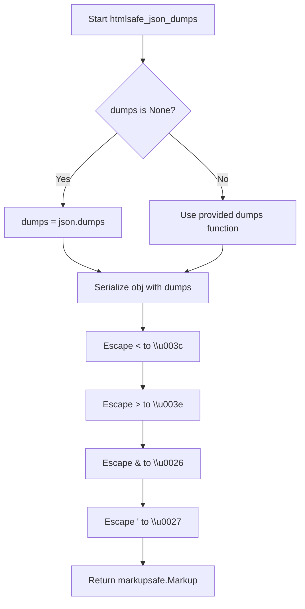

## Examples:
```python
# Basic usage
data = {"name": "John", "age": 30}
result = htmlsafe_json_dumps(data)
# Returns: markupsafe.Markup('{"name": "John", "age": 30}')

# With HTML characters in data
data = {"message": "<script>alert('xss')</script>"}
result = htmlsafe_json_dumps(data)
# Returns: markupsafe.Markup('{\\"message\\": \\"\\\\u003cscript\\\\u003ealert(\\\\u0027xss\\\\u0027)\\\\u003c/script\\\\u003e\\"}')

# With custom dumps function
import ujson
result = htmlsafe_json_dumps({"key": "value"}, dumps=ujson.dumps)
```

## `src.jinja2.utils.Cycler` · *class*

## Summary:
A cyclic iterator that cycles through a fixed set of items, maintaining internal state to track the current position.

## Description:
The Cycler class provides a mechanism to iterate through a collection of items in a circular fashion. It maintains an internal position counter that advances each time the next() method is called, wrapping around to the beginning when reaching the end. This class is useful for scenarios requiring repeated cycling through a finite set of values, such as alternating styles, rotating data, or implementing round-robin behaviors.

## State:
- items: tuple of t.Any, containing the fixed set of items to cycle through. Must not be empty.
- pos: int, representing the current index in the items tuple. Points to the item that will be returned by current property and next() method.

## Lifecycle:
- Creation: Instantiate with one or more items using Cycler(*items). At least one item is required.
- Usage: Call next() or __next__() to advance through items in a cycle. Use reset() to restart from the beginning.
- Destruction: No explicit cleanup required; standard Python garbage collection handles object destruction.

## Method Map:
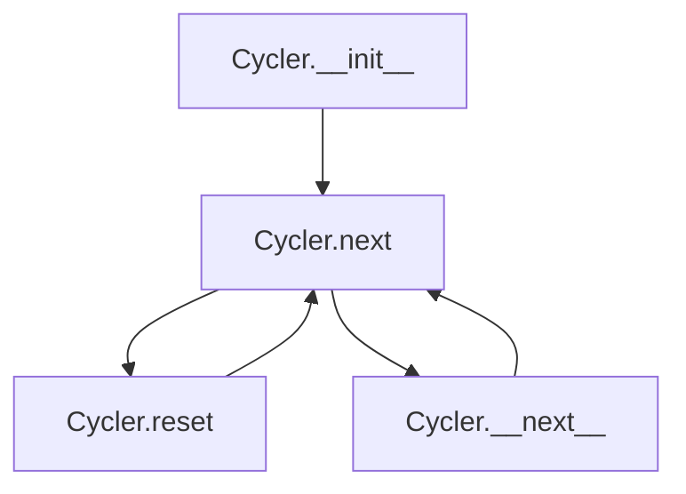

## Raises:
- RuntimeError: Raised during initialization if no items are provided.

## Example:
```python
# Create a cycler with color names
color_cycler = Cycler('red', 'green', 'blue')

# Get items in cycle
print(color_cycler.next())  # 'red'
print(color_cycler.next())  # 'green'
print(color_cycler.next())  # 'blue'
print(color_cycler.next())  # 'red' (wraps around)

# Reset to beginning
color_cycler.reset()
print(color_cycler.next())  # 'red'

# Using as iterator
for i, color in enumerate(color_cycler):
    if i >= 5: break
    print(color)
```

### `src.jinja2.utils.Cycler.__init__` · *method*

## Summary:
Initializes a Cycler instance with a fixed set of items to cycle through.

## Description:
The Cycler.__init__ method sets up the internal state of a Cycler object by storing the provided items and initializing the position counter. This method ensures that at least one item is provided, raising a RuntimeError if the items tuple is empty. The initialized Cycler can then be used to iterate through its items in a cyclic manner.

## Args:
    *items (t.Any): Variable length argument list of items to store in the cycler. At least one item must be provided.

## Returns:
    None: This method does not return a value.

## Raises:
    RuntimeError: Raised when no items are provided to the constructor, ensuring that the Cycler always has at least one item to cycle through.

## State Changes:
    Attributes READ: None
    Attributes WRITTEN: 
    - self.items: Stores the provided items as a tuple
    - self.pos: Initializes the position counter to 0

## Constraints:
    Preconditions:
    - At least one item must be provided as a positional argument
    - Items can be of any type (t.Any)
    
    Postconditions:
    - self.items contains all provided items as a tuple
    - self.pos is initialized to 0
    - The Cycler object is ready for iteration

## Side Effects:
    None: This method performs no I/O operations or external service calls. It only initializes internal object attributes.

### `src.jinja2.utils.Cycler.reset` · *method*

## Summary:
Resets the internal position counter of the cycler back to the beginning.

## Description:
The reset method is used to reset the position of the cycler to the first item in its sequence. This allows the cycler to start iterating from the beginning again, effectively resetting its state to the initial condition.

## Args:
    None

## Returns:
    None

## Raises:
    None

## State Changes:
    Attributes READ: None
    Attributes WRITTEN: self.pos

## Constraints:
    Preconditions: The Cycler instance must have been initialized with items.
    Postconditions: After calling reset, self.pos will be set to 0, making the next call to next() return the first item in the sequence.

## Side Effects:
    None

### `src.jinja2.utils.Cycler.current` · *method*

## Summary:
Returns the current item in the cycler sequence without advancing the position.

## Description:
The `current` property provides access to the item at the current position in the cycler's sequence. It is designed to allow inspection of the current item without modifying the internal position counter, making it useful for scenarios where you need to peek at the current value without consuming it.

This method is implemented as a property rather than a regular method to provide clean, attribute-like access to the current item. It's particularly useful in template rendering contexts where you want to access the current value in a sequence without advancing to the next item.

## Args:
    None

## Returns:
    t.Any: The item at the current position in the cycler's items tuple.

## Raises:
    None

## State Changes:
    Attributes READ: self.items, self.pos
    Attributes WRITTEN: None

## Constraints:
    Preconditions: The Cycler instance must have been initialized with at least one item, and self.pos must be a valid index within the range [0, len(self.items)).
    Postconditions: The cycler's position remains unchanged after calling this property.

## Side Effects:
    None

### `src.jinja2.utils.Cycler.next` · *method*

## Summary:
Returns the current item from the cycler and advances to the next item in the sequence.

## Description:
The `next` method retrieves the currently selected item from the cycler's item sequence and then advances the internal position pointer to the next item, wrapping around to the beginning when the end is reached. This method is typically used in Jinja2 templates to cycle through a set of values repeatedly.

## Args:
    None

## Returns:
    t.Any: The current item in the cycler's sequence before advancing the position.

## Raises:
    None

## State Changes:
    Attributes READ: self.current, self.pos, self.items
    Attributes WRITTEN: self.pos

## Constraints:
    Preconditions: The Cycler instance must have been initialized with at least one item.
    Postconditions: The internal position pointer is advanced to the next item in the sequence, wrapping around to index 0 when reaching the end.

## Side Effects:
    None

## `src.jinja2.utils.Joiner` · *class*

## Summary:
A stateful separator generator that produces join separators for iterative joining operations.

## Description:
The Joiner class is designed to generate appropriate separators for joining elements in a sequence. It maintains internal state to ensure that the first element doesn't have a leading separator, while subsequent elements are properly separated. This pattern is commonly used in template engines and string formatting utilities where elements need to be joined with a delimiter.

## State:
- sep: str - The separator string to be used for subsequent joins. Default is ", ".
- used: bool - Boolean flag indicating whether the joiner has been invoked at least once. Initially set to False.

## Lifecycle:
- Creation: Instantiate with optional separator string (defaults to ", ")
- Usage: Call the instance repeatedly to get appropriate separators. First call returns empty string, subsequent calls return the separator
- Destruction: No special cleanup required; standard Python object destruction applies

## Method Map:
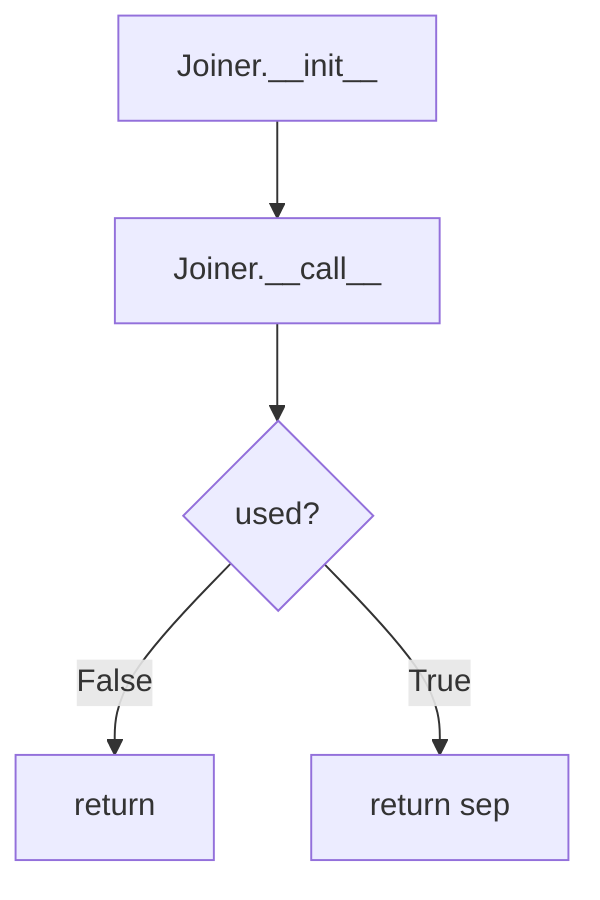

## Raises:
- No exceptions are raised by the constructor or callable interface

## Example:
```python
# Create a joiner with default separator
joiner = Joiner()
print(joiner())  # Output: ""
print(joiner())  # Output: ", "
print(joiner())  # Output: ", "

# Create a joiner with custom separator
joiner = Joiner(" | ")
print(joiner())  # Output: ""
print(joiner())  # Output: " | "
print(joiner())  # Output: " | "
```

### `src.jinja2.utils.Joiner.__init__` · *method*

## Summary:
Initializes a Joiner instance with a specified separator and reset state tracking.

## Description:
The Joiner.__init__ method sets up the initial configuration for a Joiner object by storing the provided separator string and initializing the internal state tracking flag. This method is automatically called during object instantiation and prepares the Joiner for its primary function of generating appropriate separators for joining sequences.

## Args:
    sep (str): The separator string to be used for subsequent join operations. Defaults to ", ".

## Returns:
    None: This method does not return any value.

## Raises:
    No exceptions are raised by this constructor.

## State Changes:
    Attributes READ: No self attributes are read during initialization.
    Attributes WRITTEN: 
    - self.sep: Set to the provided separator value
    - self.used: Set to False to indicate the joiner has not yet been invoked

## Constraints:
    Preconditions: None
    Postconditions: 
    - self.sep is set to the provided separator string
    - self.used is initialized to False

## Side Effects:
    None: This method performs no I/O operations or external service calls.

### `src.jinja2.utils.Joiner.__call__` · *method*

## Summary:
Returns the separator string for joining elements, ensuring the first call returns an empty string.

## Description:
The `__call__` method of the `Joiner` class manages the logic for producing separators when joining iterable elements. It ensures that the first invocation returns an empty string (to avoid leading separators), while subsequent calls return the configured separator.

## Args:
    None

## Returns:
    str: An empty string on the first call, or the configured separator on subsequent calls.

## Raises:
    None

## State Changes:
    Attributes READ: self.used, self.sep
    Attributes WRITTEN: self.used

## Constraints:
    Preconditions: The instance must be properly initialized with a `sep` string and `used` boolean flag.
    Postconditions: After the first call, `self.used` is set to `True`.

## Side Effects:
    None

## `src.jinja2.utils.Namespace` · *class*

## Summary:
A namespace container that provides attribute-style access to dictionary-like key-value pairs.

## Description:
The Namespace class serves as a flexible container that allows accessing stored values via dot notation (attributes) while internally maintaining them as key-value pairs in a dictionary. It is commonly used in Jinja2 templating to manage contextual data and configuration settings. The class enables dynamic assignment and retrieval of values, making it suitable for passing variables into templates or managing runtime state.

## State:
- `__attrs`: A private dictionary storing all key-value pairs. Type: `dict`. Valid values: Any Python objects. Invariant: Always contains the current set of key-value mappings.

## Lifecycle:
- Creation: Instantiate with optional initial key-value pairs passed as arguments to `__init__`. Supports both positional and keyword arguments.
- Usage: Access values using dot notation (`obj.key`) or bracket notation (`obj['key']`). Values can be modified using either access method.
- Destruction: No explicit cleanup required; standard Python garbage collection handles memory management.

## Method Map:
```mermaid
graph TD
    A[Namespace.__init__] --> B[Namespace.__getattribute__]
    A --> C[Namespace.__setitem__]
    B --> D[Namespace.__repr__]
    C --> D
```

## Raises:
- `AttributeError`: Raised when attempting to access a non-existent attribute via dot notation.

## Example:
```python
# Create a namespace with initial values
ns = Namespace(name="test", value=42)

# Access values via dot notation
print(ns.name)  # Output: test
print(ns.value)  # Output: 42

# Modify values
ns.value = 100
ns['new_key'] = 'new_value'

# Print representation
print(repr(ns))  # Output: <Namespace {'name': 'test', 'value': 100, 'new_key': 'new_value'}>
```

### `src.jinja2.utils.Namespace.__init__` · *method*

## Summary:
Initializes a Namespace instance with optional key-value pairs for internal dictionary storage.

## Description:
The `__init__` method initializes the internal `__attrs` dictionary of a Namespace object. It accepts any combination of positional and keyword arguments to populate the initial key-value pairs that will be stored and accessed through both attribute-style (`obj.key`) and item-style (`obj['key']`) access patterns. This method is automatically invoked during object creation and establishes the foundation for the namespace's data storage mechanism.

The method is part of the Namespace class's initialization process and ensures that all provided key-value pairs are properly stored in the internal `__attrs` dictionary, which is subsequently accessed by `__getattribute__` and `__setitem__` methods.

## Args:
    *args (tuple): Variable length argument list containing either a single dictionary-like object or a sequence of key-value pairs.
    **kwargs (dict): Arbitrary keyword arguments representing key-value pairs to store.

## Returns:
    None: This method does not return any value.

## Raises:
    None: This method does not explicitly raise exceptions.

## State Changes:
    Attributes READ: None
    Attributes WRITTEN: `self.__attrs` is initialized with the provided key-value pairs, making it available for subsequent attribute and item access operations.

## Constraints:
    Preconditions: The method expects `self` to be properly initialized as a Namespace instance.
    Postconditions: The `self.__attrs` dictionary will contain all provided key-value pairs, with kwargs taking precedence over positional arguments when keys overlap.

## Side Effects:
    None: This method performs no I/O operations or external service calls.

### `src.jinja2.utils.Namespace.__getattribute__` · *method*

## Summary:
Retrieves attribute values from the namespace's internal dictionary storage.

## Description:
This method provides controlled access to the internal `__attrs` dictionary of the Namespace object, allowing attribute-style access to stored key-value pairs while preserving special attributes like `__class__` and `__attrs`. It serves as the core mechanism for accessing namespace data through dot notation.

The method is specifically designed to handle attribute access in a custom namespace implementation, ensuring that special attributes are accessed via the standard object mechanism while user-defined attributes are retrieved from the internal dictionary.

## Args:
    name (str): The name of the attribute to retrieve from the namespace.

## Returns:
    Any: The value associated with the given attribute name in the internal storage dictionary.

## Raises:
    AttributeError: When the requested attribute name is not found in the internal storage dictionary.

## State Changes:
    Attributes READ: self.__attrs
    Attributes WRITTEN: None

## Constraints:
    Preconditions: The Namespace instance must be properly initialized with an `__attrs` dictionary.
    Postconditions: The method either returns the requested attribute value or raises AttributeError.

## Side Effects:
    None

### `src.jinja2.utils.Namespace.__setitem__` · *method*

## Summary:
Sets a value in the namespace's internal attribute dictionary by key, enabling dictionary-like assignment behavior.

## Description:
This method implements the `__setitem__` protocol for the Namespace class, providing dictionary-style assignment functionality. The Namespace class serves as a container for key-value pairs that can be accessed both as attributes and as dictionary items. This method allows setting values using bracket notation (e.g., `namespace['key'] = value`).

## Args:
    name (str): The key to set in the internal attribute dictionary.
    value (t.Any): The value to associate with the given key.

## Returns:
    None: This method does not return any value.

## Raises:
    None: This method does not explicitly raise any exceptions.

## State Changes:
    Attributes READ: None
    Attributes WRITTEN: self.__attrs

## Constraints:
    Preconditions: The `name` argument must be a string.
    Postconditions: The key-value pair will be stored in `self.__attrs`.

## Side Effects:
    None: This method does not have any side effects beyond modifying the internal state of the object.

### `src.jinja2.utils.Namespace.__repr__` · *method*

## Summary:
Returns a string representation of the Namespace object showing its internal attributes.

## Description:
This method provides a human-readable string representation of a Namespace instance, displaying the internal `__attrs` dictionary. It is called automatically when the built-in `repr()` function is applied to a Namespace object, and is also invoked during debugging or logging operations to display the object's state.

## Args:
    self (Namespace): The Namespace instance being represented.

## Returns:
    str: A formatted string representation in the form "<Namespace {attrs_dict!r}>" where attrs_dict is the internal dictionary of attributes.

## Raises:
    None: This method does not raise any exceptions.

## State Changes:
    Attributes READ: 
        - self.__attrs: The internal dictionary storing namespace attributes.
    Attributes WRITTEN: None

## Constraints:
    Preconditions:
        - The `self` parameter must be a valid Namespace instance.
        - The `self.__attrs` attribute must be a dictionary-like object.
    Postconditions:
        - The returned string will always follow the format "<Namespace {dictionary_repr}>"
        - The returned string will accurately represent the internal state of the namespace.

## Side Effects:
    None: This method performs no I/O operations or external service calls. It only accesses internal object attributes.

