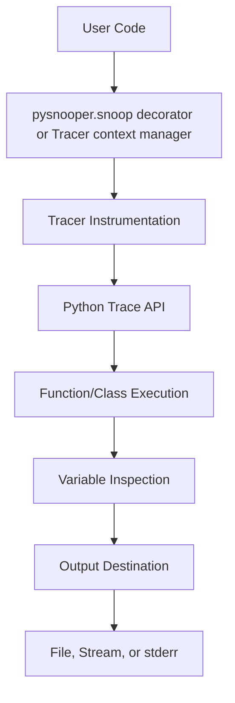

# `PySnooper`

## Tree:
    - PySnooper/
      - misc/
        - generate_authors.py
      - pysnooper/
        - pycompat.py
        - tracer.py
        - utils.py
        - variables.py
      - setup.py

## Purpose:
    - PySnooper is a Python library that provides comprehensive debugging instrumentation for Python functions and classes. It captures detailed execution traces including variable states, execution timing, and source code context, making it easier to understand program behavior during development and troubleshooting.

    - The library addresses the common challenge of debugging complex Python programs where traditional print statements or basic debuggers fall short. It enables developers to gain deep insights into how their code executes without modifying the source code extensively.

    - Target users include Python developers working on complex applications, debugging intricate logic flows, or trying to understand performance bottlenecks. It is particularly useful for developers who want to trace execution without setting breakpoints or using interactive debuggers.

    - In the broader ecosystem, PySnooper serves as a standalone debugging tool that integrates seamlessly with existing Python projects. It can be used as a decorator or context manager, offering flexibility in how and where tracing is applied. It complements other debugging tools rather than replacing them.

## Architecture:

Key abstractions:
- **Tracing Mechanism**: Uses Python's built-in tracing API (`sys.settrace`) to monitor function calls, returns, and exceptions.
- **Variable Inspection System**: Implements specialized handlers for different variable types (attributes, indices, keys, etc.) to provide meaningful representations.
- **Output Abstraction**: Provides flexible output destinations via `get_write_function` factory pattern.
- **Cross-Version Compatibility**: Maintains consistent behavior across Python versions using `pycompat`.

## Entry Points:
    - **CLI Commands**: None. PySnooper is a library, not a command-line tool.
    - **Importable APIs**:
        - `pysnooper.snoop`: Decorator for tracing function execution.
        - `pysnooper.Tracer`: Context manager for tracing code blocks.
        - `pysnooper.get_write_function`: Factory for creating write functions for different output destinations.
    - **Target Audience**:
        - Developers using decorators or context managers to debug Python code.
        - Teams needing to trace execution in production environments or complex workflows.

## Core Features:
    - **Function Tracing**: Capture detailed execution information for functions using `@pysnooper.snoop` decorator or `Tracer` context manager.
    - **Variable Watching**: Monitor specific variables during execution using `watch` parameter.
    - **Thread Information**: Include thread identification in trace output.
    - **Custom Representations**: Define custom representations for objects using `custom_repr` parameter.
    - **Colored Output**: Display trace information with ANSI color codes for better readability.
    - **Timing Information**: Show execution duration for traced functions.
    - **Generator Support**: Handle generator functions properly during tracing.
    - **Async Function Support**: Planned support for async functions (currently raises NotImplementedError).

## Dependencies:
    - **Internal Dependencies**:
        - `pysnooper.pycompat`: Cross-version compatibility utilities.
        - `pysnooper.tracer`: Core tracing infrastructure.
        - `pysnooper.utils`: Utility functions for representation and path handling.
        - `pysnooper.variables`: Variable inspection system.
    - **External Dependencies**:
        - `collections.abc`: Abstract base class definitions.
        - `inspect`: Introspection of Python frames and code.
        - `os`: File system operations.
        - `sys`: System-level operations and tracing.
        - `time`: Timing measurements.
        - `types`: Type checking and handling.
        - `typing`: Type annotations.

## Extension Points:
    - **Plugins**: Extend variable inspection by subclassing `BaseVariable` and implementing custom inspection strategies.
    - **Hooks**: Customize output behavior by providing custom write functions to `get_write_function`.
    - **Subclassing**: Extend `Tracer` to create custom tracing behaviors.
    - **Configuration-Driven Behavior**: Use parameters like `watch`, `custom_repr`, `prefix`, etc., to configure tracing behavior dynamically.

---

## Modules

- [`misc`](misc.md)
- [`pysnooper`](pysnooper.md)

