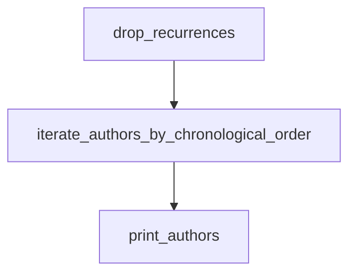

# `misc`

## Tree:
misc/
└── generate_authors.py

## Role:
Provides utilities for extracting and displaying unique author names from Git history in chronological order.

## Description:
The `misc` module serves as a collection of miscellaneous utilities that support various aspects of the project. This particular submodule focuses on retrieving author information from Git repositories. It offers functions to extract unique author names from Git commit history, ensuring they appear in chronological order. These utilities are primarily used for generating contributor lists, maintaining authorship records, and supporting documentation generation workflows.

The module is organized around Git-related operations and deduplication logic, separating concerns between data retrieval, processing, and presentation. This modular approach enhances testability, reusability, and maintainability of Git-based authorship features.

## Components:
- `drop_recurrences(iterable)` → Generator: Removes duplicates from an iterable while preserving order.
- `iterate_authors_by_chronological_order(branch)` → Generator: Retrieves unique author names from Git history in chronological order.
- `print_authors(branch)` → None: Prints unique author names from Git history to standard output.

## Public API:
- `drop_recurrences(iterable: Iterable) -> Generator`: Removes duplicate elements from an iterable while preserving the order of first occurrences.
- `iterate_authors_by_chronological_order(branch: str) -> Generator`: Returns an iterator of unique author names from Git history in chronological order.
- `print_authors(branch: str) -> None`: Prints unique author names from Git history in chronological order to standard output.

## Dependencies:
- Internal: None
- External: `subprocess` (for executing Git commands)

## Constraints:
- All functions require a valid Git repository and accessible Git installation.
- The `branch` argument must refer to an existing Git branch.
- Elements passed to `drop_recurrences` must be hashable.

---

## Files

- [`generate_authors.py`](misc/generate_authors.md)

