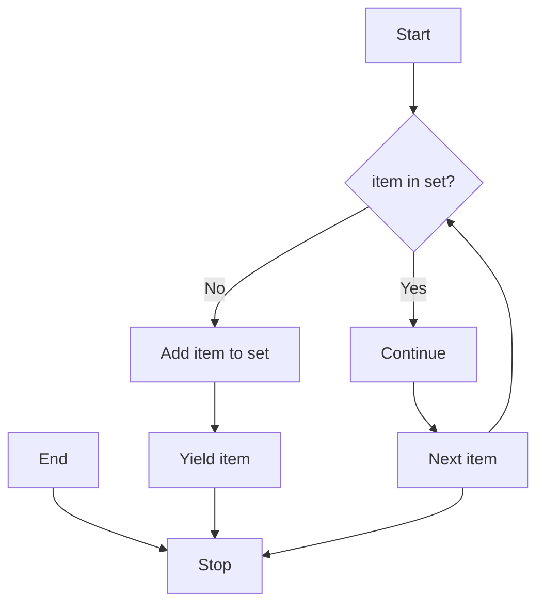
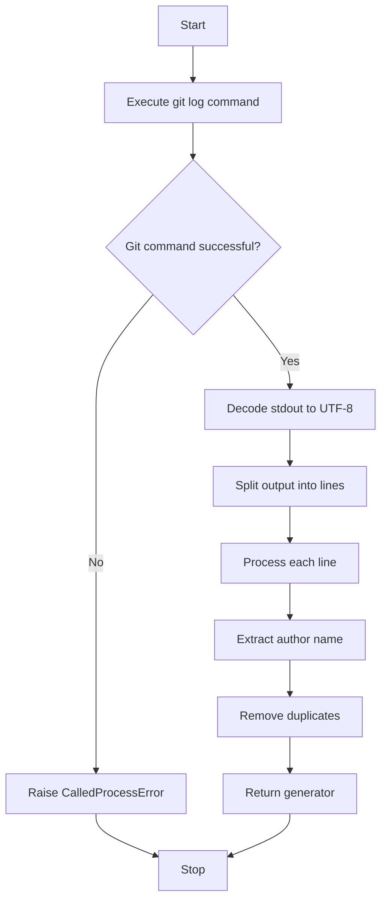

# `generate_authors.py`

## `misc.generate_authors.drop_recurrences` · *function*

## Summary:
Removes duplicate elements from an iterable while preserving the order of first occurrences.

## Description:
This function takes an iterable and yields unique elements in the order they first appear. It is designed to eliminate duplicates without requiring the entire dataset to be loaded into memory at once, making it suitable for large datasets or generators.

The function is extracted into its own utility to provide a reusable, efficient mechanism for deduplication that maintains element ordering. This separation allows other parts of the codebase to leverage this logic consistently without reimplementing the same algorithm.

## Args:
    iterable (Iterable): An iterable object containing elements that may have duplicates.

## Returns:
    Generator: A generator yielding unique elements in the order of their first appearance.

## Raises:
    None explicitly raised.

## Constraints:
    Preconditions:
        - The input iterable must be iterable (support __iter__).
        - Elements in the iterable must be hashable (since they are added to a set).
    
    Postconditions:
        - The returned generator will yield elements in the same order as their first occurrence in the input.
        - Each yielded element appears exactly once in the output.

## Side Effects:
    None.

## Control Flow:


## Examples:
```python
# Basic usage
data = [1, 2, 2, 3, 1, 4]
unique = list(drop_recurrences(data))
# Result: [1, 2, 3, 4]

# With strings
names = ['Alice', 'Bob', 'Alice', 'Charlie', 'Bob']
unique_names = list(drop_recurrences(names))
# Result: ['Alice', 'Bob', 'Charlie']

# With generator
gen = (x for x in [1, 1, 2, 2, 3])
unique_gen = list(drop_recurrences(gen))
# Result: [1, 2, 3]
```

## `misc.generate_authors.iterate_authors_by_chronological_order` · *function*

## Summary:
Returns an iterator of unique author names from Git history in chronological order.

## Description:
This function retrieves Git commit history for a specified branch and extracts unique author names in chronological order. It leverages Git's command-line interface to fetch commit logs with timestamp, author name, and email information, then processes this data to return only distinct author names while maintaining their chronological appearance order.

The function is extracted into its own utility to encapsulate Git-specific logic and author name deduplication, providing a clean abstraction for accessing author information from version control history. This separation enables reuse across different parts of the codebase that need chronological author data without duplicating Git command execution and parsing logic.

## Args:
    branch (str): The Git branch name to retrieve commit history from.

## Returns:
    Generator: A generator yielding unique author names in chronological order of their first appearance in the Git history.

## Raises:
    subprocess.CalledProcessError: When the Git command fails to execute properly (e.g., invalid branch name, Git not installed).

## Constraints:
    Preconditions:
        - The branch parameter must be a valid Git branch name.
        - Git must be installed and accessible in the system PATH.
        - The repository must be a valid Git repository.
    
    Postconditions:
        - The returned generator will yield author names in chronological order.
        - Each author name appears exactly once in the output.

## Side Effects:
    - Executes a subprocess call to the Git command-line tool.
    - May cause I/O operations during Git log retrieval.

## Control Flow:


## Examples:
```python
# Basic usage
authors = iterate_authors_by_chronological_order("main")
for author in authors:
    print(author)

# Collect all authors into a list
author_list = list(iterate_authors_by_chronological_order("develop"))
```

## `misc.generate_authors.print_authors` · *function*

## Summary:
Prints unique author names from Git history in chronological order to standard output.

## Description:
This function retrieves unique author names from Git commit history for a specified branch and prints them to standard output, one per line. It leverages the `iterate_authors_by_chronological_order` helper function to obtain the author data and writes each author name followed by a newline character to stdout using binary buffer writing for proper encoding handling.

The function is extracted into its own utility to encapsulate the printing logic separately from the Git data retrieval and processing. This separation allows for cleaner testing, easier mocking of I/O operations, and better modularity by decoupling data extraction from presentation concerns.

## Args:
    branch (str): The Git branch name to retrieve commit history from.

## Returns:
    None: This function does not return any value.

## Raises:
    subprocess.CalledProcessError: When the underlying `iterate_authors_by_chronological_order` function fails to execute Git commands (e.g., invalid branch name, Git not installed).

## Constraints:
    Preconditions:
        - The branch parameter must be a valid Git branch name.
        - Git must be installed and accessible in the system PATH.
        - The repository must be a valid Git repository.
    
    Postconditions:
        - Author names are printed to stdout in chronological order.
        - Each author name appears exactly once in the output.

## Side Effects:
    - Writes to standard output (stdout) using binary buffer writing.
    - Executes a subprocess call to the Git command-line tool via the `iterate_authors_by_chronological_order` helper.

## Control Flow:
```mermaid
flowchart TD
    A[Start] --> B[Call iterate_authors_by_chronological_order(branch)]
    B --> C{Generator available?}
    C -- No --> D[Raise CalledProcessError]
    C -- Yes --> E[Iterate over authors]
    E --> F[Write author to stdout.buffer]
    F --> G[Write newline to stdout.buffer]
    G --> H[Next author]
    H --> I{More authors?}
    I -- Yes --> F
    I -- No --> J[End]
```

## Examples:
```python
# Print authors from the main branch
print_authors("main")

# Print authors from a feature branch
print_authors("feature/new-feature")
```

