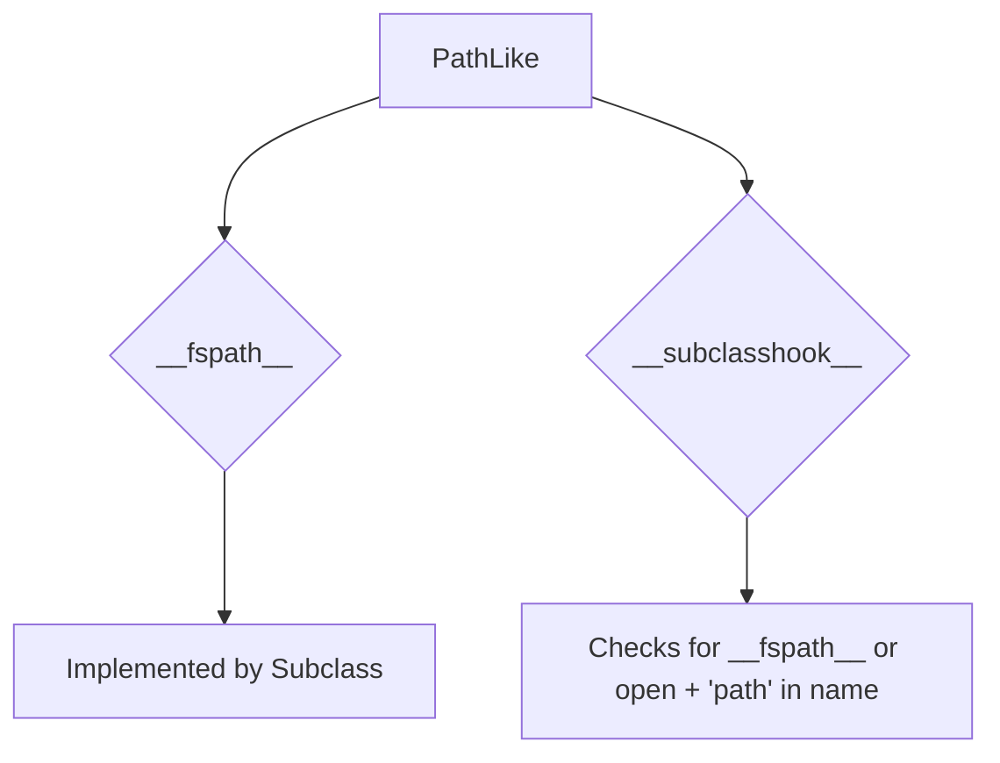

# `pycompat.py`

## `pysnooper.pycompat.ABC` · *class*

*No documentation generated.*

## `pysnooper.pycompat.PathLike` · *class*

## Summary:
Abstract base class defining the interface for path-like objects that support the `__fspath__` protocol.

## Description:
The `PathLike` class serves as an abstract base class (ABC) that defines the contract for objects that can be converted to filesystem paths. It establishes the `__fspath__` method as a required abstract method and provides a `__subclasshook__` mechanism to automatically recognize compatible classes without explicit inheritance.

This abstraction enables code to work with various path-like objects (such as `pathlib.Path`, `os.PathLike`, or custom implementations) uniformly, promoting flexibility and adherence to the filesystem path protocol defined in PEP 519.

## State:
- `__fspath__` method: Abstract method that must be implemented by subclasses to return a string or bytes representation of the path.
- `__subclasshook__` method: Class method that determines whether a class is considered a subclass of `PathLike` based on the presence of `__fspath__` or a combination of `open` method and 'path' in class name. The `cls` parameter refers to the `PathLike` class itself, as automatically passed by Python's ABC mechanism.

## Lifecycle:
- Creation: Instances cannot be created directly due to the ABC nature. Subclasses must implement `__fspath__`.
- Usage: Objects implementing `__fspath__` can be used wherever a path-like object is expected, particularly in functions accepting `os.PathLike` or similar protocols.
- Destruction: No special cleanup required; follows standard Python object lifecycle.

## Method Map:


## Raises:
- `NotImplementedError`: Raised by the abstract `__fspath__` method when not overridden in a subclass.

## Example:
```python
from pysnooper.pycompat import PathLike

class MyPath(PathLike):
    def __init__(self, path):
        self.path = path
    
    def __fspath__(self):
        return self.path

# Usage
my_path = MyPath("/tmp/example.txt")
print(my_path.__fspath__())  # Output: /tmp/example.txt
```

### `pysnooper.pycompat.PathLike.__subclasshook__` · *method*

## Summary:
Determines if a class is considered a PathLike subclass based on the presence of specific methods or naming conventions.

## Description:
This method implements the abstract base class protocol for determining subclass relationships. It is called automatically by Python's isinstance() and issubclass() functions when checking if a class conforms to the PathLike interface. The method evaluates whether a candidate class satisfies the PathLike contract by checking for either the __fspath__ method or a combination of an 'open' method and a class name containing 'path'. This allows for duck-typing compatibility with pathlib.Path-like objects.

## Args:
    cls (type): The PathLike class itself (passed automatically by Python's ABC mechanism)
    subclass (type): The candidate class being tested for PathLike compatibility

## Returns:
    bool: True if the subclass is considered a PathLike implementation, False otherwise

## Raises:
    None explicitly raised

## State Changes:
    Attributes READ: None
    Attributes WRITTEN: None

## Constraints:
    Preconditions: 
    - cls must be the PathLike class (or its subclass)
    - subclass must be a class object being tested for compatibility
    
    Postconditions:
    - Returns a boolean value indicating PathLike compatibility
    - Does not modify any object state

## Side Effects:
    None

## `pysnooper.pycompat.timedelta_format` · *function*

*No documentation generated.*

