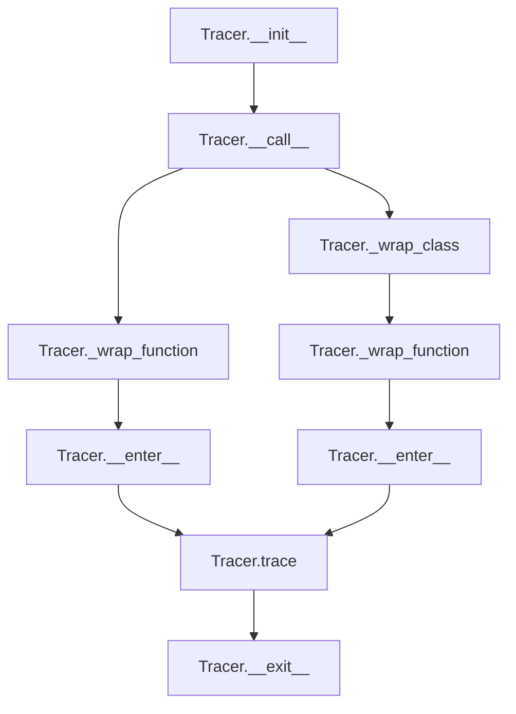

# `tracer.py`

## `pysnooper.tracer.get_local_reprs` · *function*

*No documentation generated.*

## `pysnooper.tracer.UnavailableSource` · *class*

## Summary:
Represents an unavailable source container that provides a constant error message when accessed.

## Description:
The UnavailableSource class serves as a placeholder object that simulates source code availability when actual source code cannot be retrieved. It implements the sequence protocol to provide a consistent interface for accessing source code lines, always returning a fixed error message indicating source unavailability.

This class is used internally by the pysnooper tracer when source code cannot be obtained for debugging purposes, ensuring that the tracing mechanism doesn't break when source information is not available.

## State:
- No instance attributes maintained
- The class implements __getitem__ to provide indexed access to source code lines
- The return value is always the string 'SOURCE IS UNAVAILABLE'

## Lifecycle:
- Creation: Instantiated without arguments as a singleton-like object
- Usage: Accessed via indexing operation (obj[index]) to retrieve source code content
- Destruction: No special cleanup required as it's a simple placeholder class

## Method Map:
```mermaid
graph TD
    A[UnavailableSource] --> B[__getitem__(i)]
    B --> C{Return "SOURCE IS UNAVAILABLE"}
```

## Raises:
- No exceptions are raised by this class
- The __getitem__ method always returns a string value

## Example:
```python
# Create instance
source = UnavailableSource()

# Access via indexing (simulating source line retrieval)
line_content = source[0]  # Returns "SOURCE IS UNAVAILABLE"
line_content = source[5]  # Returns "SOURCE IS UNAVAILABLE"
```

### `pysnooper.tracer.UnavailableSource.__getitem__` · *method*

## Summary:
Returns a constant string indicating that source code is unavailable for inspection.

## Description:
This method is part of the UnavailableSource class, which serves as a placeholder when source code cannot be retrieved for debugging purposes. It provides a consistent response indicating source unavailability regardless of the index requested.

## Args:
    i (int): Index parameter (unused in implementation)

## Returns:
    str: The literal string 'SOURCE IS UNAVAILABLE'

## Raises:
    None

## State Changes:
    Attributes READ: None
    Attributes WRITTEN: None

## Constraints:
    Preconditions: None
    Postconditions: Always returns the same constant string value

## Side Effects:
    None

## `pysnooper.tracer.get_path_and_source_from_frame` · *function*

*No documentation generated.*

## `pysnooper.tracer.get_write_function` · *function*

## Summary:
Returns an appropriate write function based on the output destination specification, enabling flexible logging to various destinations including files, streams, or stderr.

## Description:
The `get_write_function` function serves as a factory that creates and returns a write function tailored to the specified output destination. It handles multiple output types including file paths, writable streams, callable objects, and None (which maps to stderr). This abstraction allows the tracing system to consistently handle different output destinations without requiring callers to manage the destination-specific logic.

The function is extracted into its own utility to encapsulate the complexity of determining the correct write behavior based on input parameters, enforcing a clear responsibility boundary between destination specification and actual writing logic.

## Args:
    output: The destination for writing content. Can be:
        - None: Write to stderr
        - str or path-like object: Treat as file path
        - callable: Use directly as write function
        - WritableStream: Use its write method
    overwrite (bool): When True, allows overwriting existing files. Only valid when output is a file path.

## Returns:
    callable: A write function that accepts a string argument and writes it to the specified destination.

## Raises:
    Exception: Raised when overwrite=True is specified but output is not a file path (str or path-like object).

## Constraints:
    Preconditions:
        - If overwrite=True, output must be a file path (str or path-like object)
        - output parameter must be one of the supported types
    Postconditions:
        - Always returns a callable write function
        - The returned function accepts a single string argument

## Side Effects:
    - When output is a file path, may perform file I/O operations
    - When output is None, writes to stderr stream
    - When output is a WritableStream, performs stream write operations

## Control Flow:
```mermaid
flowchart TD
    A[get_write_function] --> B{output is None?}
    B -- Yes --> C[write to stderr]
    B -- No --> D{is_path = isinstance(output, (str, PathLike))?}
    D -- No --> E{callable(output)?}
    E -- Yes --> F[return output as write function]
    E -- No --> G{isinstance(output, WritableStream)?}
    G -- Yes --> H[write to WritableStream]
    D -- Yes --> I{overwrite=True?}
    I -- Yes --> J[validate overwrite flag]
    I -- No --> K[create FileWriter]
    J --> L[return FileWriter.write]
    K --> L
    F --> M[return write function]
    H --> M
    M --> N[Return write function]
```

## Examples:
```python
# Write to stderr
write_func = get_write_function(None, False)
write_func("Trace message\\n")

# Write to file with overwrite
write_func = get_write_function("/tmp/trace.log", True)
write_func("Trace message\\n")

# Write to custom stream
import sys
write_func = get_write_function(sys.stdout, False)
write_func("Trace message\\n")

# Write using callable
def custom_writer(s):
    print(f"Writing: {s}")
write_func = get_write_function(custom_writer, False)
write_func("Trace message\\n")
```

## `pysnooper.tracer.FileWriter` · *class*

## Summary:
Writes text content to a file with overwrite or append behavior.

## Description:
The FileWriter class provides a simple interface for writing text to files. It supports both overwriting existing files and appending to them based on initialization parameters. This class is typically used internally by the pysnooper library to capture and log execution traces.

## State:
- path (str): The file path where content will be written. Converted to text type using pycompat.text_type.
- overwrite (bool): When True, existing file content is overwritten. When False, content is appended to existing file. This flag is reset to False after each write operation.

## Lifecycle:
- Creation: Instantiate with a file path and overwrite flag (both required).
- Usage: Call write() method with string content to write to the file. The overwrite flag controls whether content is appended or overwritten.
- Destruction: No explicit cleanup required; uses context manager internally for file operations.

## Method Map:
```mermaid
graph TD
    A[FileWriter.__init__] --> B[FileWriter.write]
    B --> C[open(path, 'w'/'a', encoding='utf-8')]
    C --> D[output_file.write(s)]
    D --> E[overwrite = False]
```

## Raises:
- None explicitly raised by __init__
- May raise standard file I/O exceptions (IOError, OSError) during write operations from the underlying open() call

## Example:
```python
# Create writer that overwrites existing file
writer = FileWriter('/tmp/trace.log', overwrite=True)
writer.write('First line\\n')

# Create writer that appends to existing file  
writer = FileWriter('/tmp/trace.log', overwrite=False)
writer.write('Second line\\n')
```

### `pysnooper.tracer.FileWriter.__init__` · *method*

## Summary:
Initializes a FileWriter instance with a target path and overwrite flag.

## Description:
The __init__ method configures a FileWriter object by storing the file path and overwrite preference. This method is called during object instantiation to set up the file handling parameters for subsequent write operations. The FileWriter class is designed to manage writing data to files with options for overwriting or appending.

## Args:
    path (str): The file path where data will be written. Converted to text type using pycompat.text_type() for cross-version compatibility.
    overwrite (bool): Flag indicating whether existing files should be overwritten. True to overwrite, False to append.

## Returns:
    None: This method does not return a value.

## Raises:
    None: This method does not explicitly raise exceptions.

## State Changes:
    Attributes READ: None
    Attributes WRITTEN: self.path, self.overwrite

## Constraints:
    Preconditions: The path argument must be convertible to text type via pycompat.text_type().
    Postconditions: The FileWriter instance will have self.path set to the text-converted path and self.overwrite set to the provided boolean value.

## Side Effects:
    None: This method performs no I/O operations or external service calls. It only stores configuration parameters.

### `pysnooper.tracer.FileWriter.write` · *method*

## Summary:
Writes a string to the file specified by the FileWriter instance, either overwriting or appending based on the overwrite flag.

## Description:
This method handles the actual writing of content to a file. It is part of the FileWriter class used during tracing to output captured execution information. The method uses the file path stored in the instance and determines whether to overwrite or append based on the `overwrite` attribute. When appending, subsequent writes will add content to the existing file. This separation allows for clean file management during tracing sessions.

## Args:
    s (str): The string content to be written to the file.

## Returns:
    None

## Raises:
    IOError: If the file cannot be opened or written to due to permission issues or invalid paths.

## State Changes:
    Attributes READ: self.path, self.overwrite
    Attributes WRITTEN: self.overwrite

## Constraints:
    Preconditions: The file path must be valid and writable. The `overwrite` attribute must be a boolean value.
    Postconditions: The file will contain the provided string content, and the `overwrite` flag will be set to False.

## Side Effects:
    I/O operation: Writes to a file on the filesystem.

## `pysnooper.tracer.Tracer` · *class*

## Summary:
The Tracer class is a debugging utility that instruments Python functions and classes to provide detailed execution tracing, including variable state changes, execution timing, and source code context.

## Description:
The Tracer class enables comprehensive debugging by instrumenting Python functions and classes to capture and log detailed execution information. It leverages Python's tracing mechanism to monitor function calls, returns, and exceptions, providing insights into variable states, execution timing, and source code context. The tracer can be used as a decorator or context manager to trace specific code sections or entire functions.

The class supports advanced features like watching specific variables, custom representations, thread information, and colored output. It handles both regular functions and generators, with special support for async functions (though currently raising NotImplementedError). The tracer maintains internal state to track execution depth, variable representations, and timing information across nested function calls.

## State:
- _write (callable): Function used to write trace output to the configured destination
- watch (list): List of BaseVariable objects to watch during tracing
- frame_to_local_reprs (dict): Maps frame objects to their local variable representations
- start_times (dict): Maps frame objects to their start timestamps
- depth (int): Maximum depth for tracing nested calls (minimum 1)
- prefix (str): String prefix added to all trace output
- thread_info (bool): Whether to include thread identification in output
- thread_info_padding (int): Width for aligning thread information columns
- target_codes (set): Set of code objects to trace
- target_frames (set): Set of frame objects to trace
- thread_local (threading.local): Thread-local storage for trace state
- custom_repr (tuple): Custom representation functions for special handling
- last_source_path (str): Last source path for change detection
- max_variable_length (int): Maximum length for variable representations
- normalize (bool): Whether to normalize output (remove timestamps)
- relative_time (bool): Whether to show relative timing instead of absolute
- color (bool): Whether to use colored terminal output
- _FOREGROUND_* (str): ANSI color codes for terminal output formatting
- _STYLE_* (str): ANSI style codes for terminal output formatting

## Lifecycle:
- Creation: Instantiate with configuration parameters to define tracing behavior
- Usage: Apply as decorator to functions/classes or use as context manager
- Destruction: Automatic cleanup occurs when exiting context manager or when Python garbage collects the instance

## Method Map:


## Raises:
- NotImplementedError: When attempting to trace async functions or async generators
- NotImplementedError: When normalize=True is used with thread_info=True
- Exception: From underlying I/O operations when writing to configured output

## Example:
```python
import pysnooper

# As decorator
@pysnooper.snoop('/tmp/trace.log')
def my_function(x, y):
    z = x + y
    return z

# As context manager
with pysnooper.Tracer(output='/tmp/trace.log'):
    result = my_function(1, 2)

# With watched variables
@pysnooper.snoop(watch=('x', 'y'))
def another_function(x, y):
    z = x * y
    return z
```

### `pysnooper.tracer.Tracer.__init__` · *method*

## Summary:
Initializes a Tracer instance with configuration options for tracing function execution and variable monitoring.

## Description:
The `__init__` method sets up the tracer's internal state and configuration based on the provided parameters. It establishes the output destination, processes watch variables, initializes tracking data structures, and configures formatting options. This method is called during object instantiation and prepares the tracer for use in decorating functions or contexts.

## Args:
    output (str, file-like object, or None): Destination for trace output. Can be a file path, writable stream, or None for stderr.
    watch (tuple): Tuple of variable names or expressions to monitor during function execution.
    watch_explode (tuple): Tuple of variable names or expressions to deeply monitor (expand nested structures).
    depth (int): Call stack depth to trace. Must be >= 1.
    prefix (str): Prefix string added to each trace line.
    overwrite (bool): Whether to overwrite existing output files.
    thread_info (bool): Whether to include thread information in traces.
    custom_repr (tuple): Custom representation functions for specific types.
    max_variable_length (int): Maximum length of variable representations.
    normalize (bool): Whether to normalize variable representations.
    relative_time (bool): Whether to show relative timestamps.
    color (bool): Whether to use colored output.

## Returns:
    None: This method initializes the object's state and returns nothing.

## Raises:
    AssertionError: When depth is less than 1.

## State Changes:
    Attributes READ: None
    Attributes WRITTEN: 
        - self._write: Write function for output
        - self.watch: Processed watch variables
        - self.frame_to_local_reprs: Dictionary for local variable representations
        - self.start_times: Dictionary for timing information
        - self.depth: Call stack depth
        - self.prefix: Trace line prefix
        - self.thread_info: Thread info inclusion flag
        - self.thread_info_padding: Thread info padding value
        - self.target_codes: Set of target code objects
        - self.target_frames: Set of target frames
        - self.thread_local: Thread-local storage
        - self.custom_repr: Custom representation functions
        - self.last_source_path: Last processed source path
        - self.max_variable_length: Maximum variable representation length
        - self.normalize: Normalization flag
        - self.relative_time: Relative time flag
        - self.color: Color output flag
        - self._FOREGROUND_* and self._STYLE_*: Color formatting constants (conditionally set)

## Constraints:
    Preconditions:
        - depth must be >= 1
        - output parameter must be one of the supported types
        - custom_repr must be properly formatted if containing tuples
    Postconditions:
        - All internal state is initialized with provided or default values
        - Color formatting constants are set appropriately based on platform support

## Side Effects:
    - May perform file I/O operations if output is a file path
    - Sets up color formatting constants based on system platform
    - Creates thread-local storage for thread-safe operation

### `pysnooper.tracer.Tracer.__call__` · *method*

*No documentation generated.*

### `pysnooper.tracer.Tracer._wrap_class` · *method*

*No documentation generated.*

### `pysnooper.tracer.Tracer._wrap_function` · *method*

*No documentation generated.*

### `pysnooper.tracer.Tracer.write` · *method*

## Summary:
Writes a string to the configured output destination with prefix formatting and newline termination.

## Description:
The `write` method formats the input string by prepending the tracer's prefix and appending a newline character, then delegates the actual writing operation to the internal `_write` function. This method serves as a formatting wrapper that ensures consistent output structure while abstracting away the specifics of where the content is written.

This method is called during the tracing process to output various log messages including variable changes, execution events, and timing information. It's designed as a separate method to encapsulate the formatting logic and maintain clean separation between presentation formatting and actual I/O operations.

## Args:
    s (str): The string content to be written to the output destination.

## Returns:
    None: This method does not return a value.

## Raises:
    Exception: May raise exceptions from the underlying `_write` function when writing to the configured output destination.

## State Changes:
    Attributes READ: self.prefix, self._write
    Attributes WRITTEN: None

## Constraints:
    Preconditions:
        - The `self._write` attribute must be properly initialized to a callable function
        - The `self.prefix` attribute should be a string (though empty string is acceptable)
    Postconditions:
        - The formatted string (prefix + s + newline) is written to the configured output destination
        - The method does not modify any tracer state beyond delegating to `_write`

## Side Effects:
    - Performs I/O operations to the configured output destination (file, stream, or stderr)
    - May cause file system operations when writing to file paths
    - May produce console output when writing to stdout/stderr

### `pysnooper.tracer.Tracer.__enter__` · *method*

*No documentation generated.*

### `pysnooper.tracer.Tracer.__exit__` · *method*

*No documentation generated.*

### `pysnooper.tracer.Tracer._is_internal_frame` · *method*

## Summary:
Determines whether a given frame represents an internal pysnooper frame by comparing file paths.

## Description:
This method is used to identify frames that belong to pysnooper's internal implementation rather than user code being traced. It compares the filename of the provided frame with the filename of the Tracer.__enter__ method's code, which serves as a marker for internal frames.

The method is called from two key locations in the Tracer class:
1. In `__enter__` method: When setting up tracing, it checks if the calling frame is internal to avoid tracing pysnooper's own operations
2. In `trace` method: During the tracing process, it helps filter out internal frames when depth > 1

This logic is encapsulated in its own method because it's a reusable predicate that needs to be applied in multiple contexts within the tracer's lifecycle, making the code cleaner and more maintainable.

## Args:
    frame (FrameType): A Python frame object to check

## Returns:
    bool: True if the frame's file matches the Tracer.__enter__ method's file, indicating it's an internal frame; False otherwise

## Raises:
    None explicitly raised

## State Changes:
    Attributes READ: None
    Attributes WRITTEN: None

## Constraints:
    Preconditions: The frame argument must be a valid Python frame object with a f_code attribute containing co_filename
    Postconditions: The returned boolean value accurately indicates whether the frame is internal to pysnooper

## Side Effects:
    None

### `pysnooper.tracer.Tracer.set_thread_info_padding` · *method*

## Summary:
Sets the padding width for thread information strings and returns a left-justified version of the input string.

## Description:
This method is responsible for managing the padding width used when displaying thread information in the tracer output. It ensures that thread information columns remain aligned by tracking the maximum length of thread info strings encountered and using that as the padding width for subsequent formatting.

The method is called during the tracing process when thread information is being formatted for display. It's separated from inline logic to encapsulate the padding management responsibility and make the thread formatting code cleaner and more maintainable.

## Args:
    thread_info (str): The thread information string to be padded and returned

## Returns:
    str: The input thread_info string left-justified to the current padding width

## Raises:
    None explicitly raised

## State Changes:
    Attributes READ: self.thread_info_padding
    Attributes WRITTEN: self.thread_info_padding

## Constraints:
    Preconditions: The method assumes thread_info is a string
    Postconditions: self.thread_info_padding is updated to be at least the length of thread_info, and the returned string is left-justified to this padding width

## Side Effects:
    None

### `pysnooper.tracer.Tracer.trace` · *method*

## Summary:
Processes Python interpreter events (calls, returns, exceptions) to provide detailed debugging output including variable states, execution timing, and source code context.

## Description:
The trace method serves as the core event handler for Python's tracing mechanism, capturing and logging detailed information about function execution. It is invoked by Python's interpreter whenever specific events occur during program execution, such as function calls, returns, or exceptions. This method provides comprehensive debugging capabilities by tracking variable changes, displaying source code context, measuring execution time, and handling multi-threading scenarios.

The method determines whether to process an event based on the target frames/codes and depth configuration, then formats and writes detailed information about the current execution state. It handles various event types including 'call', 'return', and 'exception', providing different output formats and processing logic for each.

Known callers include:
- Python's built-in tracing mechanism when sys.settrace() is called with this method
- The Tracer.__enter__ method when setting up tracing for a context manager
- The Tracer.__exit__ method when tearing down tracing

This logic is implemented as its own method rather than being inlined because it needs to be registered with Python's tracing system and handles complex state management for multi-frame tracing, variable tracking, and output formatting.

## Args:
    self (Tracer): The tracer instance managing the tracing session
    frame (FrameType): The current Python frame being traced, containing execution context information
    event (str): The type of event that triggered this call ('call', 'return', 'exception')
    arg (Any): Additional argument associated with the event (varies by event type):
        - For 'call': None (not used)
        - For 'return': The return value of the function
        - For 'exception': Tuple of (exception_type, exception_value, traceback)

## Returns:
    callable: Returns self.trace to continue tracing, or None to stop tracing when:
        - Frame is not in target codes/frames and depth configuration doesn't allow it
        - Frame is an internal pysnooper frame
        - Frame traversal reaches maximum depth without finding target

## Raises:
    NotImplementedError: When thread_info is enabled with normalize=True

## State Changes:
    Attributes READ:
        - self.target_codes: Set of code objects to trace
        - self.target_frames: Set of frame objects to trace
        - self.depth: Maximum depth for tracing
        - self.normalize: Flag for normalizing output
        - self.relative_time: Flag for relative timing
        - self.thread_info: Flag for thread information inclusion
        - self.watch: Watched variables configuration
        - self.custom_repr: Custom representation functions
        - self.max_variable_length: Maximum variable length for display
        - self.start_times: Mapping of frames to start times
        - self.frame_to_local_reprs: Mapping of frames to local variable representations
        - self.last_source_path: Last source path for change detection
        - self.thread_info_padding: Padding for thread information alignment
        - self._FOREGROUND_* and _STYLE_* color codes
    Attributes WRITTEN:
        - self.frame_to_local_reprs: Updated with new variable representations
        - self.start_times: Updated with start times for frames
        - self.last_source_path: Updated with current source path
        - self.thread_info_padding: Updated with maximum thread info length

## Constraints:
    Preconditions:
        - The frame parameter must be a valid Python frame object with proper attributes (f_code, f_lineno, etc.)
        - The event parameter must be one of 'call', 'return', or 'exception'
        - The tracer instance must be properly initialized
        - When thread_info is enabled, normalize must be False
        - For 'call' events, frame.f_code.co_filename must be accessible
        - For 'return' events, arg contains the return value
        - For 'exception' events, arg contains exception information
    Postconditions:
        - For 'call' events: thread_global.depth is incremented
        - For 'return' events: thread_global.depth is decremented
        - Variable representations are updated in frame_to_local_reprs
        - Timing information is recorded in start_times
        - Output is written to the configured output destination
        - Frame-specific state is cleaned up appropriately on return/exception

## Side Effects:
    - Writes formatted debugging information to the configured output stream
    - Modifies global thread-local depth counter (thread_global.depth)
    - Updates internal state tracking dictionaries (start_times, frame_to_local_reprs)
    - May raise NotImplementedError for unsupported configurations
    - May modify the thread_info_padding attribute for alignment purposes

