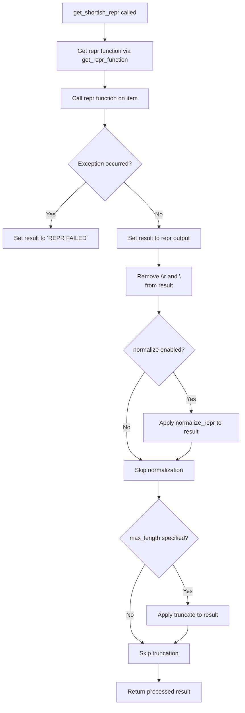

# `utils.py`

## `pysnooper.utils._check_methods` · *function*

## Summary:
Checks if a class implements all specified methods, returning NotImplemented if any are missing or abstract.

## Description:
This utility function validates whether a given class implements all required methods by traversing its method resolution order (MRO) and checking for method existence in each class's dictionary. It's primarily used for abstract base class validation and protocol checking in the pysnooper library. The function returns True if all methods are properly implemented, or NotImplemented if any method is missing or marked as abstract (has a None value).

## Args:
    C (type): The class to check for method implementations
    *methods (str): Variable length argument list of method names to validate

## Returns:
    bool or NotImplemented: Returns True if all methods are implemented, NotImplemented if any method is missing or abstract (None value)

## Raises:
    None explicitly raised

## Constraints:
    Preconditions:
        - C must be a valid class/type object
        - All method names in methods must be strings
    Postconditions:
        - Function returns either True or NotImplemented
        - No side effects occur during execution

## Side Effects:
    None

## Control Flow:
```mermaid
flowchart TD
    A[Start _check_methods(C, *methods)] --> B[Get MRO of class C]
    B --> C[For each method in methods]
    C --> D[For each class B in MRO]
    D --> E{Is method in B.__dict__?}
    E -- Yes --> F{Is B.__dict__[method] None?}
    F -- Yes --> G[Return NotImplemented]
    F -- No --> H[Break inner loop]
    E -- No --> I[Return NotImplemented]
    H --> J[Continue to next method]
    I --> J
    J --> K{All methods processed?}
    K -- Yes --> L[Return True]
    K -- No --> C
```

## Examples:
    # Check if a class implements required methods
    class MyProtocol:
        def method1(self): pass
        def method2(self): pass
    
    result = _check_methods(MyProtocol, 'method1', 'method2')  # Returns True
    
    # Check for missing method
    class IncompleteClass:
        def method1(self): pass
    
    result = _check_methods(IncompleteClass, 'method1', 'method2')  # Returns NotImplemented
    
    # Check for abstract method (None value)
    class AbstractClass:
        method1 = None  # Abstract method
        
    result = _check_methods(AbstractClass, 'method1')  # Returns NotImplemented

## `pysnooper.utils.WritableStream` · *class*

## Summary:
Abstract base class defining the interface for writable streams in the pysnooper library.

## Description:
The WritableStream class serves as an abstract base class that defines the contract for writable stream objects. It establishes a protocol that any concrete implementation must follow, ensuring consistent behavior across different stream types used by pysnooper. This abstraction allows the library to work with various output destinations (files, stdout, custom buffers) while maintaining a uniform interface for writing data.

## State:
- write(s): Abstract method that must be implemented by subclasses to handle string writes
- No instance attributes maintained by this base class

## Lifecycle:
- Creation: Instances cannot be created directly due to being an abstract base class
- Usage: Subclasses must implement the write method to provide concrete functionality
- Destruction: No special cleanup required as this is an abstract base class

## Method Map:
```mermaid
flowchart TD
    A[WritableStream] --> B[write(s)]
    B --> C[Subclass Implementation]
    C --> D[Concrete Stream]
```

## Raises:
- TypeError: When attempting to instantiate the abstract base class directly
- NotImplementedError: When subclasses don't implement the write method properly

## Example:
```python
# Define a concrete implementation
class FileStream(WritableStream):
    def __init__(self, filename):
        self.file = open(filename, 'w')
    
    def write(self, s):
        self.file.write(s)
    
    def __del__(self):
        self.file.close()

# Usage
stream = FileStream('output.log')
stream.write("Hello, world!")
```

### `pysnooper.utils.WritableStream.__subclasshook__` · *method*

## Summary:
Determines if a class is considered a subclass of WritableStream based on method implementation.

## Description:
This special method is invoked by Python's isinstance() and issubclass() functions when checking if a class conforms to the WritableStream abstract base class protocol. It specifically validates that the candidate class implements the required 'write' method. This approach allows for duck typing compatibility with WritableStream without requiring explicit inheritance.

## Args:
    cls (type): The class being checked (typically WritableStream itself)
    C (type): The candidate class to test for WritableStream compatibility

## Returns:
    bool or NotImplemented: Returns True if class C implements the 'write' method, NotImplemented otherwise

## Raises:
    None explicitly raised

## State Changes:
    Attributes READ: None
    Attributes WRITTEN: None

## Constraints:
    Preconditions:
        - cls must be the WritableStream class itself
        - C must be a valid class/type object
    Postconditions:
        - Returns either True or NotImplemented
        - No modifications to object state occur

## Side Effects:
    None

## `pysnooper.utils.shitcode` · *function*

## Summary:
Converts non-ASCII characters in a string to question marks while preserving ASCII characters.

## Description:
This utility function sanitizes input strings by replacing any character with an ordinal value outside the ASCII range (0-255) with a question mark. It's designed to handle strings that may contain Unicode or other non-ASCII characters that could cause issues in contexts requiring pure ASCII output.

## Args:
    s (str): Input string that may contain non-ASCII characters

## Returns:
    str: A sanitized string where all non-ASCII characters are replaced with '?' characters

## Raises:
    None

## Constraints:
    - Preconditions: Input must be a string type
    - Postconditions: Output string contains only ASCII characters (ordinal values 0-255)

## Side Effects:
    None

## Control Flow:
```mermaid
flowchart TD
    A[Input string s] --> B{Character ordinal 0 < ord(c) < 256?}
    B -- Yes --> C[Keep character c]
    B -- No --> D[Replace with '?']
    C --> E[Join all characters]
    D --> E
    E --> F[Return sanitized string]
```

## Examples:
    >>> shitcode("Hello, World!")
    'Hello, World!'
    >>> shitcode("Café")
    'Caf?'
    >>> shitcode("你好")
    '??'

## `pysnooper.utils.get_repr_function` · *function*

## Summary:
Returns an appropriate representation function for an item based on custom conditions, falling back to the built-in repr function.

## Description:
This function evaluates a list of custom representation conditions against an item and returns the first matching action function. If no conditions match, it defaults to using the standard repr function. This allows for customized string representations of objects while maintaining backward compatibility with default behavior.

The function is designed to support flexible representation logic where different types or conditions can have specialized formatting, making it useful for debugging tools like pysnooper that need to display objects in readable formats.

## Args:
    item (Any): The object to be represented
    custom_repr (list[tuple]): A list of (condition, action) pairs where:
        - condition: Either a callable that takes an item and returns bool, or a type object
        - action: A callable that takes an item and returns its string representation

## Returns:
    callable: A function that takes an item and returns its string representation. Either a custom action function or the built-in repr function.

## Raises:
    None explicitly raised

## Constraints:
    - Preconditions: custom_repr must be iterable containing tuples of (condition, action)
    - Postconditions: The returned function will accept the item as an argument and return a string representation

## Side Effects:
    - None

## Control Flow:
```mermaid
flowchart TD
    A[get_repr_function called] --> B{Iterate through custom_repr}
    B --> C{condition is type?}
    C -- Yes --> D[Convert condition to isinstance lambda]
    D --> E[Apply condition to item]
    E --> F{condition(item) matches?}
    F -- Yes --> G[Return action function]
    F -- No --> H[Continue to next condition]
    C -- No --> I[Apply condition to item]
    I --> J{condition(item) matches?}
    J -- Yes --> K[Return action function]
    J -- No --> L[Continue to next condition]
    H --> M{More conditions?}
    L --> M
    M -- Yes --> B
    M -- No --> N[Return repr function]
```

## Examples:
    # Basic usage with type-based conditions
    custom_repr = [(int, lambda x: f"Integer: {x}"), (str, lambda x: f"String: {x}")]
    repr_func = get_repr_function(42, custom_repr)
    result = repr_func(42)  # Returns "Integer: 42"
    
    # Fallback to repr when no conditions match
    custom_repr = [(int, lambda x: f"Integer: {x}")]
    repr_func = get_repr_function("hello", custom_repr)
    result = repr_func("hello")  # Returns "'hello'" (default repr)
    
    # Using callable conditions
    custom_repr = [(lambda x: hasattr(x, 'name'), lambda x: f"Object with name: {x.name}")]
    class Person:
        def __init__(self, name):
            self.name = name
    person = Person("Alice")
    repr_func = get_repr_function(person, custom_repr)
    result = repr_func(person)  # Returns "Object with name: Alice"

## `pysnooper.utils.normalize_repr` · *function*

*No documentation generated.*

## `pysnooper.utils.get_shortish_repr` · *function*

## Summary:
Generates a shortened string representation of an object with optional normalization and truncation.

## Description:
Creates a formatted string representation of an item by applying a custom representation function, cleaning up newlines, normalizing the result, and optionally truncating it to a maximum length. This utility function is primarily used in debugging tools to provide clean, readable representations of objects while managing display length constraints.

The function delegates representation generation to `get_repr_function` which handles custom representation logic, then applies post-processing steps to ensure consistent formatting. This extraction allows for centralized control over representation formatting while keeping the core logic modular.

## Args:
    item (Any): The object to represent as a string
    custom_repr (tuple[tuple]): Custom representation conditions and actions for special handling (default: ())
    max_length (int or None): Maximum allowed length of the result string (default: None)
    normalize (bool): Whether to apply normalization to remove certain characters (default: False)

## Returns:
    str: The formatted string representation of the item, potentially truncated or normalized

## Raises:
    None explicitly raised

## Constraints:
    Preconditions:
        - The item must be compatible with the repr() function or custom representation functions
        - If max_length is specified, it must be a positive integer or None
        - custom_repr must be iterable containing valid (condition, action) tuples
    Postconditions:
        - The returned string will not contain carriage returns or newlines
        - If normalize=True, certain characters will be removed from the representation
        - If max_length is specified, the result will not exceed that length

## Side Effects:
    None

## Control Flow:


## Examples:
    >>> get_shortish_repr(42)
    '42'
    
    >>> get_shortish_repr("hello world", max_length=8)
    'hello...'
    
    >>> get_shortish_repr([1, 2, 3], normalize=True)
    '[1, 2, 3]'
    
    >>> get_shortish_repr(object(), custom_repr=[(object, lambda x: "CUSTOM")])
    'CUSTOM'

## `pysnooper.utils.truncate` · *function*

## Summary:
Truncates a string to a maximum length while preserving the beginning and end of the string with an ellipsis separator.

## Description:
This function reduces the length of a string to a specified maximum length by removing characters from the middle, replacing them with an ellipsis ('...'). It is designed to handle cases where long strings need to be displayed or logged in contexts with limited space. The function ensures that both the start and end portions of the original string are preserved, making it useful for displaying truncated versions of long identifiers, paths, or messages.

## Args:
    string (str): The input string to be truncated.
    max_length (int or None): The maximum allowed length of the returned string. If None, no truncation occurs and the original string is returned.

## Returns:
    str: The truncated string with ellipsis if the original string exceeded max_length. Otherwise, returns the original string unchanged.

## Raises:
    None

## Constraints:
    Preconditions:
        - The input string must be a valid string object.
        - The max_length parameter must be either an integer greater than or equal to 3, or None.
    Postconditions:
        - The returned string will have a length less than or equal to max_length.
        - If max_length is None, the returned string will be identical to the input string.
        - If the original string is shorter than or equal to max_length, the returned string will be identical to the input string.

## Side Effects:
    None

## Control Flow:
```mermaid
flowchart TD
    A[Start truncate] --> B{max_length is None OR len(string) <= max_length?}
    B -- Yes --> C[Return string]
    B -- No --> D[Calculate left = (max_length - 3) // 2]
    D --> E[Calculate right = max_length - 3 - left]
    E --> F[Return string[:left] + '...' + string[-right:]]
```

## Examples:
    >>> truncate("This is a very long string", 10)
    'This ...ring'
    
    >>> truncate("Short", 10)
    'Short'
    
    >>> truncate("Very long string indeed", None)
    'Very long string indeed'

## `pysnooper.utils.ensure_tuple` · *function*

## Summary:
Converts an input value into a tuple, preserving iterable objects while wrapping non-iterable values in a single-element tuple.

## Description:
The `ensure_tuple` function standardizes input values into tuple format. It treats iterable objects (excluding strings) as sequences to be converted to tuples, while wrapping all other values in a single-element tuple. This utility ensures consistent tuple-based processing throughout the pysnooper library.

## Args:
    x: Any Python object to be converted to a tuple

## Returns:
    tuple: Either a tuple created from an iterable input (excluding strings) or a single-element tuple containing the input value

## Raises:
    None explicitly raised

## Constraints:
    Preconditions:
        - Input can be any Python object
        - The function relies on `collections.abc.Iterable` and `string_types` for type checking
    
    Postconditions:
        - Return value is always a tuple
        - Non-string iterables are converted to tuples containing their elements
        - Non-iterable values are wrapped in a single-element tuple

## Side Effects:
    None

## Control Flow:
```mermaid
flowchart TD
    A[Input x] --> B{isinstance(x, Iterable)?}
    B -- Yes --> C{isinstance(x, string_types)?}
    C -- Yes --> D[return (x,)]
    C -- No --> E[tuple(x)]
    B -- No --> D
```

## Examples:
    >>> ensure_tuple([1, 2, 3])
    (1, 2, 3)
    
    >>> ensure_tuple("hello")
    ('hello',)
    
    >>> ensure_tuple(42)
    (42,)
    
    >>> ensure_tuple((1, 2))
    (1, 2)
    
    >>> ensure_tuple(range(3))
    (0, 1, 2)
    
    >>> ensure_tuple(None)
    (None,)
```

