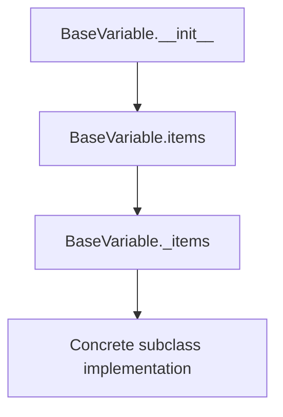
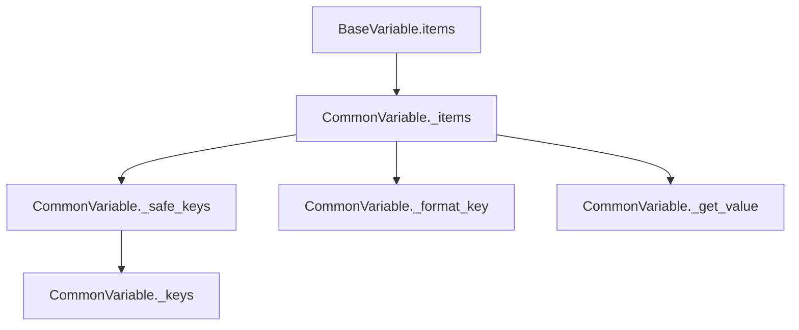
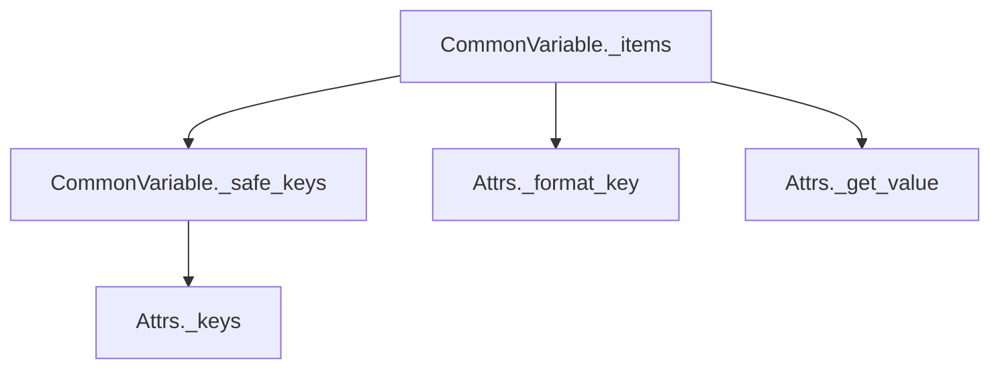
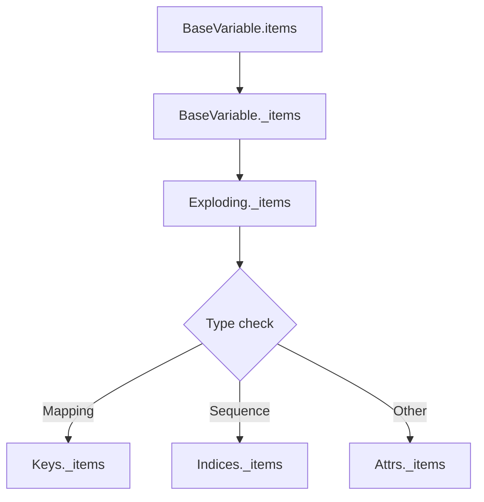

# `variables.py`

## `pysnooper.variables.needs_parentheses` · *function*

## Summary:
Determines whether parentheses are required around a variable expression when accessing its attribute to maintain correct parsing semantics.

## Description:
This function compares the compiled bytecode of two expressions: one with and one without parentheses around a variable expression when accessing an attribute. It's used in debugging tools to properly format variable representations when they contain complex expressions that might require parentheses for correct interpretation.

## Args:
    source (str): A string representation of a variable expression to test for parenthetical necessity.

## Returns:
    bool: True if the expression needs parentheses when accessing an attribute, False otherwise.

## Raises:
    None explicitly raised.

## Constraints:
    - Preconditions: The source parameter must be a valid string that can be compiled as a Python expression.
    - Postconditions: The function always returns a boolean value.

## Side Effects:
    - None.

## Control Flow:
```mermaid
flowchart TD
    A[Start needs_parentheses] --> B[Define code helper function]
    B --> C[Compile "{}.x" expression]
    C --> D[Compile "({}).x" expression]
    D --> E[Compare bytecode results]
    E --> F{Bytecode differs?}
    F -->|Yes| G[Return True]
    F -->|No| H[Return False]
```

## Examples:
    - needs_parentheses("a") returns False (simple variable doesn't need parentheses)
    - needs_parentheses("a + b") returns True (binary operation needs parentheses)
    - needs_parentheses("(a + b)") returns False (already parenthesized)

## `pysnooper.variables.BaseVariable` · *class*

## Summary:
BaseVariable is an abstract base class that defines the interface for variable inspection in the pysnooper debugging tool, providing mechanisms to evaluate and enumerate variable contents.

## Description:
BaseVariable serves as the foundation for implementing variable inspection capabilities in pysnooper. It provides a standardized interface for evaluating Python expressions and enumerating their contents, with concrete implementations handling specific variable types. The class manages compilation of variable expressions, handles exclusion patterns, and ensures proper formatting for debugging output. It is designed to be subclassed by concrete variable handlers that implement the specific enumeration logic.

## State:
- source (str): The original Python expression string to be evaluated and inspected
- exclude (tuple): A tuple of excluded attribute names or patterns that should not be included in enumeration
- code (compiled code object): The compiled version of the source expression for efficient evaluation
- unambiguous_source (str): The source expression wrapped in parentheses when needed to prevent parsing ambiguities

## Lifecycle:
- Creation: Instantiate with a source expression string and optional exclude patterns
- Usage: Call items() method with a frame object to evaluate and enumerate variable contents
- Destruction: No explicit cleanup required; relies on Python's garbage collection

## Method Map:


## Raises:
- None explicitly raised in __init__
- _items method raises NotImplementedError when called directly on BaseVariable

## Example:
```python
# Creating a BaseVariable instance
var = BaseVariable("my_dict['key']", exclude=('private_attr',))

# Evaluating and enumerating contents
frame = inspect.currentframe()
items = var.items(frame)

# This would raise NotImplementedError since _items is abstract
# var._items(some_value)
```

### `pysnooper.variables.BaseVariable.__init__` · *method*

## Summary:
Initializes a BaseVariable instance by setting up its source code representation, exclusion rules, and compilation state for later evaluation.

## Description:
The `__init__` method configures a BaseVariable object with the provided source expression, processes exclusion rules, compiles the source into executable bytecode, and determines if parentheses are needed for unambiguous representation. This method serves as the constructor that establishes the fundamental properties required for variable inspection and evaluation within the pysnooper framework.

## Args:
    source (str): A string representation of the variable expression to be tracked and evaluated
    exclude (tuple): Optional tuple of variable names to exclude from tracking, defaults to empty tuple

## Returns:
    None: This method initializes the object's state but does not return a value

## Raises:
    None explicitly raised

## State Changes:
    Attributes READ: None
    Attributes WRITTEN: 
        - self.source: stores the original source string
        - self.exclude: stores processed exclusion rules as a tuple
        - self.code: stores compiled bytecode for the source expression
        - self.unambiguous_source: stores the source with optional parentheses for proper formatting

## Constraints:
    Preconditions:
        - source must be a valid string that can be compiled in eval mode
        - exclude parameter should be convertible to a tuple via utils.ensure_tuple
        
    Postconditions:
        - self.source contains the original source string unchanged
        - self.exclude contains a tuple of excluded variable names
        - self.code contains valid compiled bytecode for the source expression
        - self.unambiguous_source contains either the original source or the source wrapped in parentheses

## Side Effects:
    - Compiles Python source code into bytecode using the built-in compile() function
    - May perform string formatting operations to add parentheses when needed

### `pysnooper.variables.BaseVariable.items` · *method*

## Summary:
Evaluates the variable's source code in the given frame context and returns key-value pairs representing its content.

## Description:
This method serves as the primary interface for extracting variable information by evaluating the stored source code expression within the provided frame's execution context. It first attempts to evaluate the variable using Python's `eval()` function with the frame's globals and locals, catching any exceptions and returning an empty tuple if evaluation fails. When successful, it delegates to the abstract `_items` method to generate the appropriate key-value representation of the evaluated value.

This design allows subclasses to implement specific item extraction logic while providing a consistent evaluation mechanism. The method is particularly useful in debugging contexts where variables may not be accessible or valid, as it handles evaluation errors gracefully.

## Args:
    frame: Frame object containing the execution context (f_globals and f_locals attributes)
    normalize (bool): Flag indicating whether to apply normalization to the returned items (default: False)

## Returns:
    tuple: Key-value pairs representing the variable's content, or empty tuple if evaluation fails

## Raises:
    None explicitly raised - evaluation exceptions are caught and handled internally

## State Changes:
    Attributes READ: self.code, self.source
    Attributes WRITTEN: None

## Constraints:
    Preconditions: 
        - frame must be a valid frame object with f_globals and f_locals attributes
        - self.code must be valid compiled bytecode (set during initialization)
        
    Postconditions:
        - Always returns a tuple (empty or populated)
        - Evaluation result is passed to _items method for further processing

## Side Effects:
    I/O: Uses eval() to execute code in the frame context
    External service calls: None
    Mutations to objects outside self: None

### `pysnooper.variables.BaseVariable._items` · *method*

*No documentation generated.*

### `pysnooper.variables.BaseVariable._fingerprint` · *method*

## Summary:
Returns a tuple uniquely identifying this variable instance based on its type, source code, and exclusion settings.

## Description:
This method generates a fingerprint tuple that uniquely identifies a BaseVariable instance. It is used primarily for equality comparison and hashing operations. The fingerprint incorporates the variable's type, source code string, and exclusion configuration to ensure that two variables with identical characteristics produce the same fingerprint.

## Args:
    None

## Returns:
    tuple: A 3-element tuple containing (type(self), self.source, self.exclude) where:
        - type(self): The class type of the variable instance
        - self.source: The source code string used to evaluate this variable
        - self.exclude: The exclusion configuration tuple for this variable

## Raises:
    None

## State Changes:
    Attributes READ: self.source, self.exclude
    Attributes WRITTEN: None

## Constraints:
    Preconditions: The method assumes self.source and self.exclude are properly initialized in __init__
    Postconditions: The returned tuple is immutable and suitable for use as a dictionary key or set element

## Side Effects:
    None

### `pysnooper.variables.BaseVariable.__hash__` · *method*

## Summary:
Computes a hash value for the variable based on its fingerprint, enabling use in hash-based collections like sets and dictionaries.

## Description:
This method implements the standard `__hash__` protocol for BaseVariable instances, allowing them to be used as dictionary keys or set elements. The hash is computed from the variable's fingerprint, which uniquely identifies the variable's type, source code, and exclusion configuration. This ensures that semantically equivalent variables produce identical hash values, supporting proper hashing behavior in collections.

The method is called during hash table operations when objects need to be indexed or compared for membership. It's part of the object's identity contract and enables efficient storage and lookup in hash-based data structures. This implementation works in conjunction with `__eq__` to ensure that equal objects have equal hashes, maintaining the fundamental requirement for hash-based collections.

## Args:
    None explicitly taken (uses implicit self parameter)

## Returns:
    int: A hash value derived from the variable's fingerprint tuple, suitable for use in hash tables.

## Raises:
    TypeError: If the fingerprint contains unhashable elements (though this would indicate a programming error in the implementation).

## State Changes:
    Attributes READ:
    - self._fingerprint

## Constraints:
    Preconditions:
    - self must be a BaseVariable instance
    - self._fingerprint must be hashable (contain only hashable types)
    
    Postconditions:
    - The returned hash value remains consistent for the lifetime of the object
    - Objects with equal fingerprints produce equal hash values
    - Hash values are stable across multiple invocations during the object's lifetime

## Side Effects:
    None.

### `pysnooper.variables.BaseVariable.__eq__` · *method*

## Summary:
Compares two BaseVariable instances for equality based on their type, source code, and exclusion configuration.

## Description:
This method implements the equality comparison operator (`==`) for BaseVariable objects. It determines if two variables are equivalent by checking if they are both BaseVariable instances and have identical fingerprint values, which consist of their type, source code, and exclusion configuration. This ensures that variables with the same definition and settings are considered equal regardless of their runtime values.

## Args:
    other (object): Another object to compare with this BaseVariable instance.

## Returns:
    bool: True if other is a BaseVariable instance with matching fingerprint; False otherwise.

## Raises:
    None explicitly raised.

## State Changes:
    Attributes READ: 
    - self._fingerprint
    - other._fingerprint (accessed via property)

## Constraints:
    Preconditions:
    - self must be a BaseVariable instance
    - other can be any object type
    
    Postconditions:
    - Returns boolean value indicating structural equality of the two variable representations
    - Two BaseVariable instances are equal if and only if they have the same type, source code, and exclude configuration

## Side Effects:
    None.

## `pysnooper.variables.CommonVariable` · *class*

## Summary:
CommonVariable is an abstract base class that implements shared functionality for variable inspection in pysnooper, providing common patterns for enumerating variable contents.

## Description:
CommonVariable is an abstract base class that extends BaseVariable to provide shared implementation patterns for variable enumeration in the pysnooper debugging framework. It implements the core logic for constructing variable representations that include both the main value and its accessible attributes/elements, while delegating specific key enumeration and value retrieval to concrete subclasses.

This class provides robust error handling for key access operations and utilities for safely iterating over variable contents. It inherits the interface defined by BaseVariable and adds common functionality that reduces code duplication across concrete variable implementations.

## State:
- source (str): The original Python expression string to be evaluated and inspected
- exclude (tuple): A tuple of excluded attribute names or patterns that should not be included in enumeration  
- code (compiled code object): The compiled version of the source expression for efficient evaluation
- unambiguous_source (str): The source expression wrapped in parentheses when needed to prevent parsing ambiguities
- _format_key (method): Abstract method that must be implemented by subclasses to format key paths for display
- _get_value (method): Abstract method that must be implemented by subclasses to retrieve values for specific keys

## Lifecycle:
- Creation: Instantiate with a source expression string and optional exclude patterns, inheriting from BaseVariable
- Usage: Call items() method with a frame object to evaluate and enumerate variable contents through the inherited interface
- Destruction: No explicit cleanup required; relies on Python's garbage collection

## Method Map:


## Raises:
- None explicitly raised in __init__
- _format_key method raises NotImplementedError when called directly on CommonVariable
- _get_value method raises NotImplementedError when called directly on CommonVariable

## Example:
```python
# This class is meant to be subclassed rather than instantiated directly
# Example subclass implementation:
class DictVariable(CommonVariable):
    def _keys(self, main_value):
        return main_value.keys()
    
    def _format_key(self, key):
        return f"['{key}']"
    
    def _get_value(self, main_value, key):
        return main_value[key]

# Usage with pysnooper:
# @pysnooper.snoop()
# def example_function():
#     my_dict = {'a': 1, 'b': 2}
#     return my_dict
```

### `pysnooper.variables.CommonVariable._items` · *method*

## Summary:
Constructs a structured representation of a variable including its main value and accessible attributes/elements for debugging purposes.

## Description:
This method generates a comprehensive key-value representation of a variable that can be used for debugging output. It creates a list where the first element represents the main variable value, followed by key-value pairs for each accessible attribute or element. The method is designed to work with the pysnooper debugging tool to provide detailed variable inspection information.

The method handles various edge cases gracefully by catching exceptions when accessing keys or values, ensuring that debugging sessions don't fail due to inaccessible attributes. It leverages the class hierarchy to determine what keys are accessible and how to format them appropriately.

## Args:
    main_value (Any): The primary object being inspected for debugging
    normalize (bool): Whether to normalize string representations of values (default: False)

## Returns:
    list[tuple[str, str]]: A list of key-value pairs where:
        - First pair: (self.source, string representation of main_value)
        - Subsequent pairs: (formatted key path, string representation of value)
        Each key path is prefixed with self.unambiguous_source and formatted using self._format_key()

## Raises:
    None explicitly raised

## State Changes:
    Attributes READ: 
    - self.source: Base identifier for the main value
    - self.unambiguous_source: Prefix for attribute/element paths
    - self.exclude: Set of keys to exclude from inspection
    Attributes WRITTEN: None

## Constraints:
    Preconditions:
    - main_value must be inspectable for keys/attributes
    - self.source, self.unambiguous_source must be properly initialized
    - self.exclude must support membership testing
    Postconditions:
    - Always returns at least one key-value pair (the main value)
    - Excluded keys are filtered out from results
    - All returned values are properly formatted string representations

## Side Effects:
    None

## Known Callers:
    This method is called internally by the pysnooper debugging framework during variable inspection. It's typically invoked when generating debug output for variables in the captured scope, particularly when using the @pysnooper.snoop decorator on functions.

### `pysnooper.variables.CommonVariable._safe_keys` · *method*

*No documentation generated.*

### `pysnooper.variables.CommonVariable._keys` · *method*

## Summary:
Returns an empty tuple of keys for a variable's contents, serving as a fallback implementation for variables that do not support key-based enumeration.

## Description:
The `_keys` method is part of the `CommonVariable` class hierarchy and provides a default implementation for enumerating keys of a variable's contents. It is called by `_safe_keys` to iterate over available keys, with the expectation that subclasses will override this method to provide meaningful key enumeration for specific variable types. This particular implementation returns an empty tuple, indicating that the variable has no enumerable keys.

This method exists as a separate implementation to allow for polymorphic behavior across different variable types while maintaining a consistent interface. It is specifically designed to be overridden by subclasses that handle container-like objects such as dictionaries, lists, or custom objects with attributes.

## Args:
    main_value: The value of the variable being inspected, typically a container or object whose keys need enumeration

## Returns:
    tuple: An empty tuple, indicating no keys are available for enumeration

## Raises:
    None explicitly raised

## State Changes:
    Attributes READ: None
    Attributes WRITTEN: None

## Constraints:
    Preconditions: The method accepts any value as input, though it's primarily intended to be called with container-like objects
    Postconditions: Always returns an empty tuple regardless of input value

## Side Effects:
    None

### `pysnooper.variables.CommonVariable._format_key` · *method*

*No documentation generated.*

### `pysnooper.variables.CommonVariable._get_value` · *method*

*No documentation generated.*

## `pysnooper.variables.Attrs` · *class*

## Summary:
Attrs is a variable inspection class that handles objects with attributes by enumerating their __dict__ and __slots__ contents for debugging purposes.

## Description:
The Attrs class is a concrete implementation of CommonVariable designed to inspect objects that have attributes accessible through __dict__ and __slots__. It enables pysnooper to display detailed information about object attributes during debugging sessions. This class is part of the variable inspection system that helps developers understand the state of objects at various points in their code execution.

The class is typically instantiated indirectly through pysnooper's variable detection mechanism when it encounters objects that have attributes but don't match other specialized variable types like dictionaries or sequences.

## State:
- Inherits all state from CommonVariable parent class including:
  - source (str): Original Python expression being inspected
  - exclude (tuple): Attribute names/patterns to exclude from enumeration
  - code (compiled code object): Compiled version of the source expression
  - unambiguous_source (str): Source expression wrapped in parentheses when needed
- Implements abstract methods from CommonVariable:
  - _format_key: Formats attribute keys with leading dots
  - _get_value: Retrieves attribute values using getattr
  - _keys: Enumerates attribute names from __dict__ and __slots__

## Lifecycle:
- Creation: Automatically instantiated by pysnooper's variable detection system when an object with attributes is encountered
- Usage: Called internally by CommonVariable._items() method during variable inspection
- Destruction: Managed by Python's garbage collection

## Method Map:


## Raises:
- AttributeError: Raised by _get_value when attempting to access non-existent attributes
- None explicitly raised by _keys, _format_key, or _get_value in Attrs class itself

## Example:
```python
# This would be used automatically by pysnooper when debugging
class Person:
    def __init__(self, name, age):
        self.name = name
        self.age = age

# When pysnooper encounters a Person instance, it creates an Attrs instance
# to inspect its attributes:
person = Person("Alice", 30)
# During debugging, pysnooper would enumerate person.__dict__ = {'name': 'Alice', 'age': 30}
# And format keys as '.name' and '.age'
```

### `pysnooper.variables.Attrs._keys` · *method*

*No documentation generated.*

### `pysnooper.variables.Attrs._format_key` · *method*

## Summary:
Formats a key by prepending a dot character to create a hierarchical attribute reference.

## Description:
This method is responsible for formatting attribute keys in a way that indicates they are nested attributes of an object. It is part of the Attrs class hierarchy and implements the abstract `_format_key` method defined in `CommonVariable`. The formatted key is used to construct full attribute paths like `.attribute_name` when displaying variable contents.

## Args:
    key (str): The attribute name to be formatted.

## Returns:
    str: A string with a leading dot followed by the original key (e.g., ".key").

## Raises:
    None explicitly raised.

## State Changes:
    Attributes READ: None
    Attributes WRITTEN: None

## Constraints:
    Preconditions: The `key` argument must be a string.
    Postconditions: The returned string will always begin with a dot followed by the original key.

## Side Effects:
    None.

### `pysnooper.variables.Attrs._get_value` · *method*

## Summary:
Retrieves the value of a specified attribute from an object using Python's built-in getattr function.

## Description:
This method serves as a concrete implementation of the abstract `_get_value` method defined in the `CommonVariable` base class. It is responsible for extracting the value of a given attribute (specified by `key`) from the provided object (`main_value`). This method is part of the variable inspection system used by pysnooper to examine object attributes during debugging sessions.

The method is called during the variable inspection process when iterating over object attributes, specifically within the `_items` method of `CommonVariable`. It provides a standardized way to access object attributes while maintaining consistency with the broader variable inspection framework.

## Args:
    main_value (Any): The object from which to retrieve the attribute value
    key (str): The name of the attribute to retrieve from main_value

## Returns:
    Any: The value of the specified attribute from main_value

## Raises:
    AttributeError: When the specified key does not exist as an attribute of main_value

## State Changes:
    Attributes READ: None
    Attributes WRITTEN: None

## Constraints:
    Preconditions: 
    - main_value must be an object that supports attribute access via getattr
    - key must be a string representing a valid attribute name of main_value
    
    Postconditions:
    - Returns the actual value stored in the attribute
    - Raises AttributeError if the attribute doesn't exist

## Side Effects:
    None

## `pysnooper.variables.Keys` · *class*

*No documentation generated.*

### `pysnooper.variables.Keys._keys` · *method*

*No documentation generated.*

### `pysnooper.variables.Keys._format_key` · *method*

## Summary:
Formats a dictionary key for display by wrapping it in square brackets with a shortened representation.

## Description:
This method takes a dictionary key and formats it for display purposes by wrapping it in square brackets and applying a shortened representation using the utility function `utils.get_shortish_repr`. It is used in the context of variable inspection to create readable representations of dictionary keys during debugging sessions.

The method exists as a separate utility to maintain consistency in how dictionary keys are displayed throughout the pysnooper library, ensuring uniform formatting regardless of key type or complexity. This formatting is particularly useful when displaying dictionary contents in debug output.

## Args:
    key (Any): The dictionary key to format, can be of any type that supports representation

## Returns:
    str: A formatted string representation of the key wrapped in square brackets, e.g., "[key_value]"

## Raises:
    None explicitly raised

## State Changes:
    Attributes READ: None
    Attributes WRITTEN: None

## Constraints:
    Preconditions:
        - The key argument must be compatible with the repr() function or custom representation functions used by get_shortish_repr
    Postconditions:
        - The returned string will always be enclosed in square brackets
        - The inner content will be a shortened representation of the key

## Side Effects:
    None

### `pysnooper.variables.Keys._get_value` · *method*

## Summary:
Retrieves the value associated with a given key from a main value container within the Keys variable inspection class.

## Description:
The `_get_value` method is a concrete implementation of the abstract `_get_value` method inherited from `CommonVariable`. It serves as a key-value accessor that retrieves the value corresponding to a specific key from a container-like object (such as a dictionary, list, or other mapping/sequence types). This method is part of the `Keys` class, which specializes in inspecting variable contents that support key-based access patterns.

This method is called internally by the `CommonVariable._items` method during the enumeration process of variable contents in pysnooper's debugging framework. It provides the fundamental mechanism for accessing individual elements when exploring the structure of complex variables.

## Args:
    main_value (Any): The container object (e.g., dict, list, etc.) from which to retrieve a value
    key (Any): The key used to index into the main_value container

## Returns:
    Any: The value associated with the specified key in the main_value container

## Raises:
    KeyError: When the specified key does not exist in the main_value container
    TypeError: When main_value does not support indexing operations (e.g., if main_value is not a mapping or sequence)

## State Changes:
    Attributes READ: None
    Attributes WRITTEN: None

## Constraints:
    Preconditions:
        - main_value must be a container type that supports indexing with the bracket operator (`[]`)
        - key must be a valid key type for the given main_value container
    Postconditions:
        - The returned value is the exact value stored at main_value[key]
        - No modifications are made to either main_value or key

## Side Effects:
    None

## `pysnooper.variables.Indices` · *class*

## Summary:
Indices is a specialized variable inspection class that handles indexed sequence access patterns, enabling slice-based enumeration of sequence elements.

## Description:
The Indices class extends Keys to provide functionality for inspecting indexed sequences with slice operations. It's designed to work within pysnooper's variable inspection framework, specifically handling cases where sequence elements are accessed via index slicing operations. This class maintains a slice object that defines which portion of a sequence should be inspected, making it particularly useful for debugging scenarios involving array-like data structures with complex indexing patterns.

The class is typically instantiated indirectly through pysnooper's internal variable detection mechanisms when encountering indexed expressions in debugged code. It's part of the CommonVariable inheritance hierarchy and integrates with the broader variable inspection infrastructure.

## State:
- _slice (slice): Stores the slice object that defines the range of indices to be considered. Defaults to slice(None) which represents the entire sequence.

## Lifecycle:
- Creation: Automatically instantiated by pysnooper's variable detection system when processing indexed expressions. Cannot be instantiated directly with constructor arguments.
- Usage: Called internally by the variable inspection framework during debugging sessions. The __getitem__ method creates new instances with updated slice constraints.
- Destruction: Managed by Python's garbage collection; no explicit cleanup required.

## Method Map:
```mermaid
graph TD
    A[Indices.__getitem__] --> B[Indices._keys]
    B --> C[range(len(main_value))[self._slice]]
```

## Raises:
- AssertionError: Raised in __getitem__ when attempting to assign a non-slice object as the slice constraint.

## Example:
```python
# This class is used internally by pysnooper
# Typical usage scenario:
# When debugging code like: my_list[1:5]
# pysnooper creates an Indices instance to handle the slice [1:5]
# The _keys method then computes range(5)[1:5] = range(1, 5)
```

### `pysnooper.variables.Indices._keys` · *method*

## Summary:
Returns a range of indices for a sequence-like main_value based on the stored slice object.

## Description:
The `_keys` method in the `Indices` class computes a range of valid indices for a sequence-like object (such as a list or tuple) by applying the instance's stored slice to the length of the main_value. This method is part of the variable inspection framework in pysnooper, specifically designed for indexing operations on sequences.

This method is called during the enumeration phase of variable inspection when processing indexed sequences. It allows for flexible slicing of sequence elements by leveraging the pre-computed slice object stored in `self._slice`. The method is part of the `CommonVariable` inheritance hierarchy and is used by the `items()` method to determine which indices should be enumerated for a given sequence.

Known callers include the `_items` method in `CommonVariable` which calls `_safe_keys` which in turn calls this method to compute valid index ranges for sequence enumeration.

## Args:
    main_value (Sequence): A sequence-like object (list, tuple, etc.) whose indices need to be computed

## Returns:
    range: A range object containing valid indices for the main_value based on the stored slice. The range represents the subset of indices that would be accessed when applying the slice to the sequence.

## Raises:
    None explicitly raised

## State Changes:
    Attributes READ: self._slice
    Attributes WRITTEN: None

## Constraints:
    Preconditions: 
    - main_value must be a sequence-like object supporting len() and indexing operations
    - main_value must support the slice operation defined in self._slice
    
    Postconditions:
    - The returned range will contain valid indices for accessing elements in main_value
    - The range will respect the bounds of main_value's length
    - The range will be compatible with the slice stored in self._slice

## Side Effects:
    None

### `pysnooper.variables.Indices.__getitem__` · *method*

## Summary:
Returns a new Indices instance with an updated slice constraint applied to the underlying data.

## Description:
This method enables slicing operations on Indices objects, creating a copy of the current instance with a modified slice attribute. It's designed to support range-based indexing operations while maintaining immutability of the original object.

## Args:
    item (slice): A slice object defining the range of indices to select from the underlying data structure.

## Returns:
    Indices: A new Indices instance with the same properties as self but with the _slice attribute updated to the provided slice.

## Raises:
    AssertionError: When the provided item argument is not an instance of slice.

## State Changes:
    Attributes READ: self._slice
    Attributes WRITTEN: result._slice

## Constraints:
    Preconditions: The item parameter must be a slice object.
    Postconditions: The returned Indices instance will have its _slice attribute set to the provided slice.

## Side Effects:
    None

## `pysnooper.variables.Exploding` · *class*

## Summary:
Exploding is a variable inspection class that dynamically selects the appropriate enumeration strategy based on the type of the main value being inspected.

## Description:
The Exploding class serves as a dispatcher that routes variable inspection to type-specific handlers. When pysnooper encounters a variable during debugging, it uses Exploding to determine whether the variable should be enumerated as a mapping (dictionary-like), sequence (list-like), or object with attributes. This dynamic dispatch allows pysnooper to provide appropriate inspection behavior for different data types without requiring explicit type checking in the main inspection logic.

The class is typically instantiated automatically by pysnooper's variable detection system when processing variables that don't fall into the specialized categories handled by other inspection classes. It overrides the `_items` method from BaseVariable to provide runtime type-based dispatching.

## State:
- Inherits all state from BaseVariable parent class including:
  - source (str): Original Python expression being inspected
  - exclude (tuple): Attribute names/patterns to exclude from enumeration
  - code (compiled code object): Compiled version of the source expression
  - unambiguous_source (str): Source expression wrapped in parentheses when needed

## Lifecycle:
- Creation: Automatically instantiated by pysnooper's variable detection system when a variable needs type-based inspection
- Usage: Called internally by BaseVariable.items() method during variable inspection, which invokes the overridden _items method
- Destruction: Managed by Python's garbage collection

## Method Map:


## Raises:
- None explicitly raised by _items method
- Exceptions may be raised by the delegated classes (Keys, Indices, Attrs) during their respective _items calls

## Example:
```python
# This would be used automatically by pysnooper during debugging
# When pysnooper encounters different variable types:

# For a dictionary:
my_dict = {'a': 1, 'b': 2}
# Exploding would delegate to Keys._items to enumerate keys

# For a list:
my_list = [1, 2, 3]
# Exploding would delegate to Indices._items to enumerate indices

# For an object with attributes:
class Person:
    def __init__(self, name):
        self.name = name

person = Person("Alice")
# Exploding would delegate to Attrs._items to enumerate attributes
```

