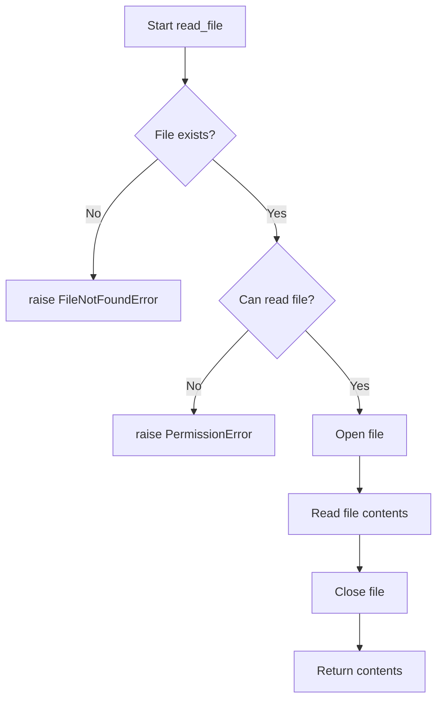

# `setup.py`

## `read_file` · *function*

## Summary:
Reads the complete contents of a file and returns it as a string.

## Description:
This function opens a file in read mode and reads its entire content into memory, returning it as a string. It is designed to be a simple utility for loading file contents, typically used for configuration files, license texts, or README content in package metadata.

## Args:
    filename (str): The path to the file to be read. Must be a valid file path that exists and is readable.

## Returns:
    str: The complete contents of the file as a string.

## Raises:
    FileNotFoundError: If the specified file does not exist.
    PermissionError: If the process does not have permission to read the specified file.

## Constraints:
    Preconditions:
        - The filename argument must be a valid string representing an existing file path.
        - The file must be readable by the executing process.
    Postconditions:
        - The file is opened and read completely.
        - The file handle is automatically closed after reading.

## Side Effects:
    - Reads from the filesystem.
    - May raise I/O related exceptions if the file cannot be accessed.

## Control Flow:

## Examples:
    >>> content = read_file('README.md')
    >>> print(content[:50])  # Print first 50 characters
    '# My Project\n\nThis project does...'

