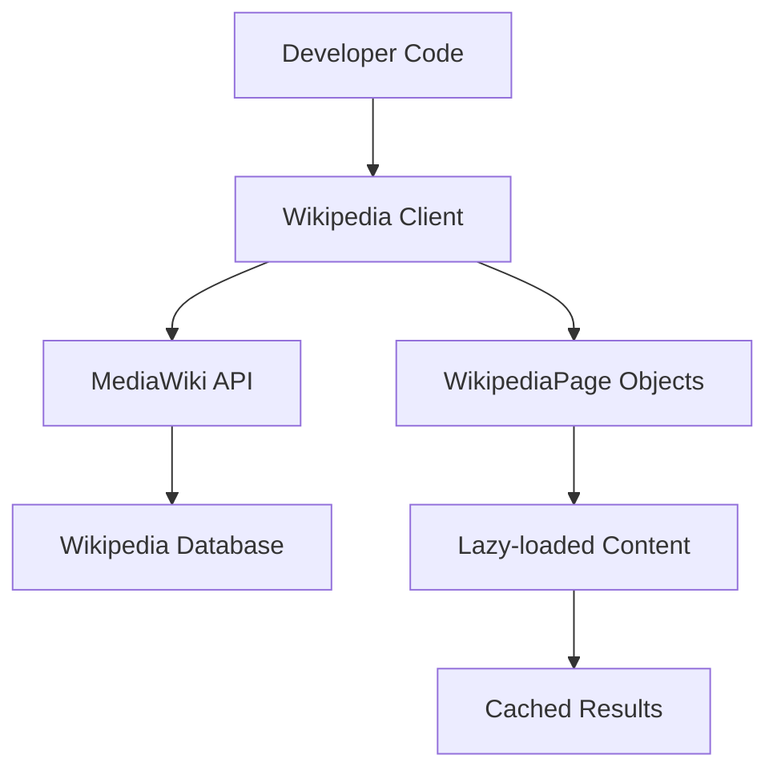

# `Wikipedia-API`

## Wikipedia-API Repository

### Tree:
```
Wikipedia-API/
├── wikipediaapi/          # Core library module
│   ├── __init__.py        # Module entry point
├── example.py             # Usage examples and utilities
└── setup.py               # Package configuration
```

### Purpose:
The Wikipedia-API repository provides a Pythonic interface for accessing Wikipedia content through the MediaWiki API. It enables developers to programmatically retrieve page summaries, sections, links, categories, and translations with minimal boilerplate code.

Target users include:
- Data scientists and analysts working with Wikipedia content
- Developers building applications that integrate Wikipedia data
- Researchers extracting structured information from encyclopedic sources
- Educational software creators incorporating Wikipedia articles

This library serves as a high-level abstraction over Wikipedia's MediaWiki API, handling HTTP communication, caching, and data parsing transparently.

### Architecture:


The system follows a client-object pattern where:
1. A `Wikipedia` client instance manages API connections and session state
2. `WikipediaPage` objects represent individual articles and provide lazy-loaded access to content
3. API calls are made only when content is actually accessed
4. Results are cached to avoid redundant network requests

### Entry Points:
- **Importable API**: `from wikipediaapi import Wikipedia`
  - Primary interface for creating Wikipedia clients and accessing pages
  - Target audience: All developers using the library

- **CLI Examples**: `python example.py`
  - Demonstrates various usage patterns including:
    * Page content retrieval
    * Section navigation
    * Category exploration
    * Language link inspection
    * Link analysis

### Core Features:
- **Page Retrieval**: Access any Wikipedia page by title with namespace support
- **Content Extraction**: Retrieve page summaries, full text, or specific sections
- **Metadata Access**: Get page information like revision IDs, timestamps, and edit counts
- **Link Navigation**: Explore internal links, backlinks, and language translations
- **Category Management**: Access page categories and browse category hierarchies
- **Lazy Loading**: Content is fetched only when accessed, improving performance
- **Multilingual Support**: Access Wikipedia in any supported language

### Dependencies:
- `requests`: HTTP communication with MediaWiki API
- `urllib.parse`: URL encoding/decoding operations
- `logging`: API request logging
- `enum`: Namespace and format enumerations
- `typing`: Type hints for better IDE support

### Configuration:
The library uses the standard MediaWiki API endpoint (`https://[language].wikipedia.org/w/api.php`) and requires:
- A valid `user_agent` string for all API requests
- Optional custom headers for advanced usage
- Language specification for international content access

### Extension Points:
- Custom `WikipediaPage` subclasses can override content loading behavior
- New extraction formats can be added by extending `ExtractFormat` enum
- Additional namespace types can be defined by extending `Namespace` enum
- Plugin architecture could be implemented for custom data processors

---

## Modules

- [`wikipediaapi`](wikipediaapi.md)

