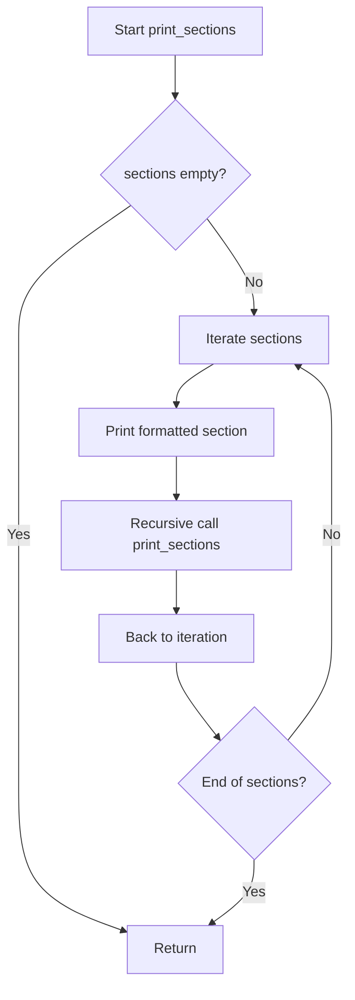
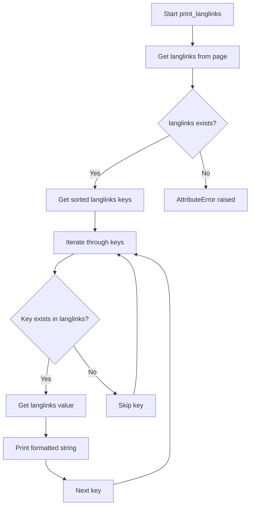

# `example.py`

## `print_sections` · *function*

## Summary:
Recursively prints hierarchical Wikipedia section data with indentation based on nesting level.

## Description:
This function traverses a nested structure of Wikipedia section objects and prints their titles and first 40 characters of text content with increasing indentation levels. It is designed specifically for visualizing the hierarchical structure of Wikipedia page sections obtained from the wikipediaapi library.

## Args:
    sections (list): A list of Wikipedia section objects with 'title' and 'text' attributes
    level (int): Current nesting level for indentation calculation, defaults to 0

## Returns:
    None: This function does not return any value

## Raises:
    AttributeError: If a section object lacks 'title' or 'text' attributes
    TypeError: If sections parameter is not iterable or contains non-section objects

## Constraints:
    Preconditions:
        - sections parameter must be iterable
        - Each section in sections must have 'title' and 'text' attributes
        - level parameter must be a non-negative integer
    Postconditions:
        - All sections and their subsections are printed to stdout with proper indentation
        - Function terminates when all sections are processed

## Side Effects:
    - Prints formatted output to standard output (stdout)
    - No external state mutations or I/O operations beyond console printing

## Control Flow:


## Examples:
    # Basic usage with Wikipedia section objects
    wiki = wikipediaapi.Wikipedia('en')
    page = wiki.page('Python_(programming_language)')
    print_sections(page.sections)
    
    # Output example:
    # *: Introduction - Python is a high-level programming language...
    # **: History - The language was created by Guido van Rossum...
    # ***: Design philosophy - Python's design philosophy emphasizes...
```

## `print_langlinks` · *function*

## Summary:
Prints language links for a Wikipedia page in a formatted manner.

## Description:
This function extracts and displays language links associated with a Wikipedia page, showing the language code, target language name, page title, and full URL for each link. It is designed to provide a clean, sorted display of multilingual references for a given Wikipedia article.

## Args:
    page (object): A Wikipedia page object that must have a langlinks attribute. The langlinks attribute should be a dictionary-like object where keys are language codes and values are language link objects with language, title, and fullurl attributes.

## Returns:
    None: This function does not return any value.

## Raises:
    AttributeError: If the provided page object does not have a langlinks attribute.

## Constraints:
    Preconditions:
        - The input page parameter must be a valid object with a langlinks attribute
        - The langlinks attribute must support .keys() method and dictionary-style access
        - Each value in langlinks must have language, title, and fullurl attributes
    Postconditions:
        - All language links from the page are printed to standard output in a consistent format

## Side Effects:
    - Prints formatted output to standard output (stdout)
    - No external state mutations or I/O operations beyond printing

## Control Flow:


## Examples:
```python
# Assuming a Wikipedia page object exists with langlinks
page = wiki_wiki.page("Python")
print_langlinks(page)
# Output (format):
# de: Deutsch - Python (Programmiersprache): https://de.wikipedia.org/wiki/Python_(Programmiersprache)
# es: español - Python: https://es.wikipedia.org/wiki/Python
# fr: français - Python: https://fr.wikipedia.org/wiki/Python
```

## `print_links` · *function*

## Summary:
Prints all links from a Wikipedia page in alphabetical order.

## Description:
This function extracts and displays all hyperlinks from a given Wikipedia page object, sorting them alphabetically by link title. It serves as a utility for inspecting the internal linking structure of Wikipedia articles.

## Args:
    page (wikipediaapi.WikipediaPage): A Wikipedia page object containing link information.

## Returns:
    None: This function does not return any value.

## Raises:
    AttributeError: If the provided page object does not have a 'links' attribute.

## Constraints:
    Preconditions:
        - The page parameter must be a valid wikipediaapi.WikipediaPage object
        - The page object must have a 'links' attribute that behaves like a dictionary
    Postconditions:
        - All links from the page are printed to standard output in alphabetical order

## Side Effects:
    - Prints formatted output to standard output (stdout)
    - No external state mutations or I/O operations beyond printing

## Control Flow:
```mermaid
flowchart TD
    A[Start print_links] --> B{page.links exists?}
    B -- Yes --> C[Sort links.keys()]
    C --> D[Iterate through sorted titles]
    D --> E[Print title: links[title]]
    E --> F[End]
    B -- No --> G[AttributeError raised]
    G --> F
```

## Examples:
```python
import wikipediaapi

wiki = wikipediaapi.Wikipedia('en')
page = wiki.page('Python (programming language)')
print_links(page)
# Output:
# Closures: <wikipediaapi.WikipediaPage object>
# Data type: <wikipediaapi.WikipediaPage object>
# ...
```

## `print_categories` · *function*

## Summary:
Prints all categories associated with a Wikipedia page in alphabetical order.

## Description:
This function extracts and displays the categories of a given Wikipedia page, sorting them alphabetically before printing. It serves as a utility for displaying hierarchical categorization information from Wikipedia articles.

## Args:
    page (wikipediaapi.WikipediaPage): A Wikipedia page object containing category information.

## Returns:
    None: This function does not return any value.

## Raises:
    AttributeError: If the provided page object does not have a 'categories' attribute.

## Constraints:
    Preconditions:
        - The input page must be a valid Wikipedia page object from the wikipediaapi library.
        - The page object must have a 'categories' attribute that is a dictionary-like object.
    Postconditions:
        - All categories of the page are printed to standard output in alphabetical order.

## Side Effects:
    - Prints formatted category information to standard output (stdout).
    - No external state mutations or I/O operations beyond printing.

## Control Flow:
```mermaid
flowchart TD
    A[Start print_categories] --> B{page.categories exists?}
    B -->|Yes| C[Sort categories keys]
    C --> D[Iterate through sorted keys]
    D --> E[Print title: categories[title]]
    E --> F[End]
    B -->|No| G[AttributeError raised]
```

## Examples:
```python
import wikipediaapi

wiki = wikipediaapi.Wikipedia('en')
page = wiki.page('Python (programming language)')
print_categories(page)
# Output:
# Category:Articles with example code: Articles with example code
# Category:Computer programming languages: Computer programming languages
# Category:Programming languages: Programming languages
```

## `print_categorymembers` · *function*

## Summary:
Recursively prints Wikipedia category members with hierarchical indentation based on their nesting level.

## Description:
This function traverses a Wikipedia category hierarchy and prints each member with appropriate indentation to visualize the tree structure. It's designed to display category contents in a readable, nested format while respecting depth limits to prevent infinite recursion.

The function is typically called from other functions that retrieve Wikipedia category data, such as when exploring category hierarchies or debugging category membership structures. It's extracted as a separate function to encapsulate the printing and traversal logic, making the calling code cleaner and promoting reuse of the visualization logic.

## Args:
    categorymembers (dict): A dictionary mapping category member titles to Wikipedia page objects
    level (int): Current nesting level for indentation (default: 0)
    max_level (int): Maximum allowed nesting depth (default: 2)

## Returns:
    None: This function only produces output via print statements

## Raises:
    None explicitly raised

## Constraints:
    Preconditions:
        - categorymembers must be a dictionary-like object with .values() method
        - Each item in categorymembers must have .title and .ns attributes
        - Wikipedia page objects must have .categorymembers attribute if they are categories
    
    Postconditions:
        - All category members up to max_level depth are printed with proper indentation
        - No recursive calls exceed the maximum nesting depth

## Side Effects:
    - Prints formatted output to standard output (stdout)
    - Makes recursive calls to itself

## Control Flow:
```mermaid
flowchart TD
    A[print_categorymembers called] --> B{categorymembers not empty?}
    B -- Yes --> C[Iterate through categorymembers.values()]
    C --> D[Print current member with "*" * (level+1) indentation]
    D --> E{Current member namespace == CATEGORY?}
    E -- Yes --> F{level < max_level?}
    F -- Yes --> G[Recursive call with level+1]
    F -- No --> H[Continue iteration]
    E -- No --> H
    G --> I[Return from recursion]
    I --> H
    H --> J{More members to process?}
    J -- Yes --> C
    J -- No --> K[End function]
    B -- No --> K
```

## Examples:
```python
# Basic usage with sample category data
category_data = {
    "Category:Animals": Page(title="Animals", ns=14, categorymembers={...}),
    "Category:Plants": Page(title="Plants", ns=14, categorymembers={...})
}
print_categorymembers(category_data)
# Output:
# * Animals (ns: 14)
# * Plants (ns: 14)

# Usage with deeper nesting
print_categorymembers(category_data, level=0, max_level=3)
# Output would show up to 3 levels deep with appropriate indentation
```

