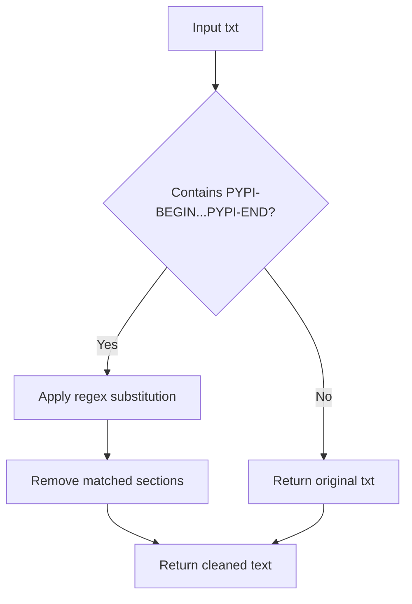

# `setup.py`

## `fix_doc` · *function*

## Summary:
Removes PYPI-BEGIN...PYPI-END marked sections from documentation text.

## Description:
This function strips out content delimited by ".. PYPI-BEGIN" and ".. PYPI-END" markers, typically used to exclude portions of documentation when packaging for PyPI distribution. It is designed to clean documentation content by removing sections that should not appear in package metadata.

## Args:
    txt (str): The documentation text containing PYPI-BEGIN...PYPI-END markers to be removed.

## Returns:
    str: The documentation text with all PYPI-BEGIN...PYPI-END sections removed.

## Raises:
    None explicitly raised, though regex operations may raise re.error under unusual circumstances.

## Constraints:
    - Preconditions: Input must be a string containing optional PYPI-BEGIN...PYPI-END markers.
    - Postconditions: Output string contains no content between PYPI-BEGIN and PYPI-END markers.

## Side Effects:
    None.

## Control Flow:


## Examples:
    >>> fix_doc("Hello .. PYPI-BEGIN world PYPI-END!")
    'Hello !'
    >>> fix_doc("No markers here")
    'No markers here'
    >>> fix_doc(".. PYPI-BEGIN start PYPI-END .. PYPI-BEGIN another PYPI-END")
    ' .. '
```

