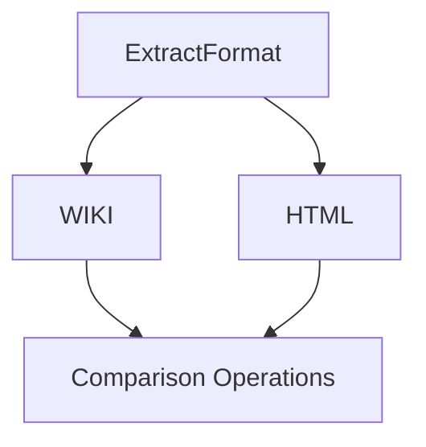
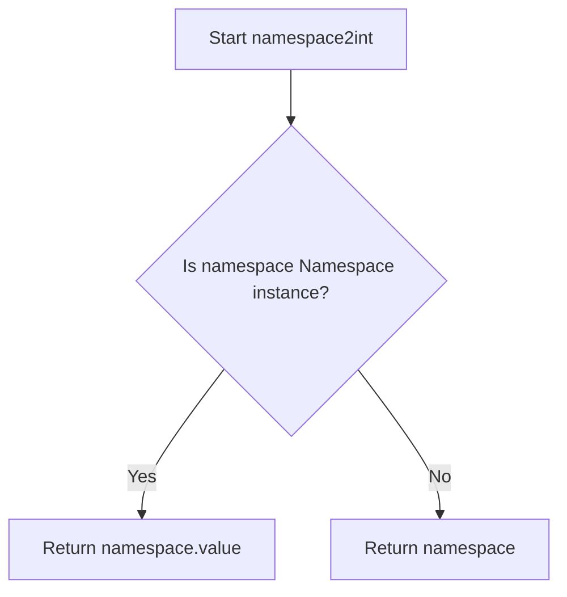
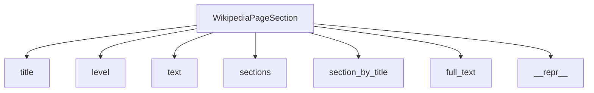
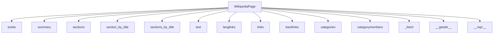

```mermaid
graph TD
    A[Namespace] --> B[MAIN=0]
    A --> C[TALK=1]
    A --> D[USER=2]
    A --> E[USER_TALK=3]
    A --> F[WIKIPEDIA=4]
    A --> G[WIKIPEDIA_TALK=5]
    A --> H[FILE=6]
    A --> I[FILE_TALK=7]
    A --> J[MEDIAWIKI=8]
    A --> K[MEDIAWIKI_TALK=9]
    A --> L[TEMPLATE=10]
    A --> M[TEMPLATE_TALK=11]
    A --> N[HELP=12]
    A --> O[HELP_TALK=13]
    A --> P[CATEGORY=14]
    A --> Q[CATEGORY_TALK=15]
    A --> R[PORTAL=100]
    A --> S[PORTAL_TALK=101]
    A --> T[PROJECT=102]
    A --> U[PROJECT_TALK=103]
    A --> V[REFERENCE=104]
    A --> W[REFERENCE_TALK=105]
    A --> X[BOOK=108]
    A --> Y[BOOK_TALK=109]
    A --> Z[DRAFT=118]
    A --> AA[DRAFT_TALK=119]
    A --> AB[EDUCATION_PROGRAM=446]
    A --> AC[EDUCATION_PROGRAM_TALK=447]
    A --> AD[TIMED_TEXT=710]
    A --> AE[TIMED_TEXT_TALK=711]
    A --> AF[MODULE=828]
    A --> AG[MODULE_TALK=829]
    A --> AH[GADGET=2300]
    A --> AI[GADGET_TALK=2301]
    A --> AJ[GADGET_DEFINITION=2302]
    A --> AK[GADGET_DEFINITION_TALK=2303]
```

```mermaid
graph TD
    A[Wikipedia] --> B[page]
    A --> C[article]
    A --> D[extracts]
    A --> E[info]
    A --> F[langlinks]
    A --> G[links]
    A --> H[backlinks]
    A --> I[categories]
    A --> J[categorymembers]
    A --> K[_query]
    A --> L[_build_extracts]
    A --> M[_create_section]
    A --> N[_build_info]
    A --> O[_build_langlinks]
    A --> P[_build_links]
    A --> Q[_build_backlinks]
    A --> R[_build_categories]
    A --> S[_build_categorymembers]
    A --> T[_common_attributes]
```

# `__init__.py`

## `wikipediaapi.__init__.ExtractFormat` · *class*

## Summary:
Represents a set of supported extraction formats for Wikipedia content processing.

## Description:
This class defines an enumeration of extraction formats that can be used when retrieving and processing Wikipedia content. It serves as a type-safe way to specify how content should be extracted and formatted, particularly for handling subsections and HTML tags in Wikipedia articles.

The class is designed to be used as a parameter in functions that process Wikipedia content, ensuring that only valid extraction formats are accepted. It provides a clear interface for specifying whether content should be extracted in wiki markup format (which supports subsection recognition) or HTML format (which allows retrieval of HTML tags).

## State:
- WIKI: An integer value of 1 representing the wiki markup format that supports subsection recognition
- HTML: An integer value of 2 representing the HTML format that allows retrieval of HTML tags

The class inherits from IntEnum, so all standard enum behaviors apply, including comparison operations and iteration capabilities.

## Lifecycle:
- Creation: Instances are created automatically when accessing the enum members (WIKI or HTML)
- Usage: The enum members are used as arguments to functions that require a specific extraction format
- Destruction: No explicit cleanup is required as this is a standard enum class

## Method Map:


## Raises:
No exceptions are raised during initialization as this is a simple enum class.

## Example:
```python
# Using the enum to specify extraction format
format_wiki = ExtractFormat.WIKI
format_html = ExtractFormat.HTML

# Comparing formats
if format_wiki == ExtractFormat.WIKI:
    print("Using wiki format")

# Iterating over all formats
for fmt in ExtractFormat:
    print(f"Format: {fmt.name} = {fmt.value}")
```

## `wikipediaapi.__init__.Namespace` · *class*

## Summary:
Represents Wikipedia namespace identifiers as integer-valued enumeration constants.

## Description:
The Namespace class provides a standardized way to reference Wikipedia namespaces using integer constants. It extends Python's IntEnum to ensure that namespace values are integers while providing semantic names for each namespace. This abstraction allows developers to work with Wikipedia namespaces in a type-safe and readable manner, avoiding magic numbers throughout the codebase.

This class is used internally by the wikipediaapi library to categorize and organize Wikipedia page content according to standard Wikipedia namespace conventions. It serves as a foundational element for page identification and filtering operations.

## State:
- All attributes are class-level constants inherited from IntEnum
- Each constant represents a specific Wikipedia namespace with an associated integer value
- The integer values correspond to standard Wikipedia namespace IDs as defined by MediaWiki
- No instance state is maintained; all operations are static

## Lifecycle:
- Creation: Instantiated automatically when imported; no explicit instantiation required
- Usage: Constants are accessed directly as Namespace.MAIN, Namespace.USER, etc.
- Destruction: Managed automatically by Python's garbage collection

## Method Map:


## Raises:
- No exceptions are raised during initialization as this is a pure enumeration class
- All constants are predefined and immutable

## Example:
```python
# Accessing namespace constants
main_namespace = Namespace.MAIN  # Value: 0
user_namespace = Namespace.USER   # Value: 2
talk_namespace = Namespace.TALK   # Value: 1

# Using in conditional logic
if page.namespace == Namespace.MAIN:
    print("This is a main article")

# Iterating over all namespaces
for ns in Namespace:
    print(f"{ns.name}: {ns.value}")
```

## `wikipediaapi.__init__.namespace2int` · *function*

## Summary:
Converts a Wikipedia namespace identifier into its corresponding integer value.

## Description:
This function serves as a type conversion utility that ensures a Wikipedia namespace identifier is represented as an integer. It handles two distinct input types: WikiNamespace objects (which are instances of the Namespace enum) and raw integer values. When the input is a Namespace enum instance, it extracts the underlying integer value via the `.value` attribute. For direct integer inputs, it returns them unchanged.

The function is designed to provide a consistent interface for namespace handling throughout the wikipediaapi library, abstracting away the distinction between enum instances and raw integers in contexts where only integer representations are required.

## Args:
    namespace (WikiNamespace): A Wikipedia namespace identifier, which can be either a Namespace enum instance or an integer representing a namespace ID.

## Returns:
    int: The integer representation of the namespace identifier. If the input is a Namespace enum instance, returns its `.value`. If the input is already an integer, returns it unchanged.

## Raises:
    None explicitly raised by this function. However, if the input is neither a Namespace instance nor an integer, the behavior depends on Python's isinstance check and subsequent handling.

## Constraints:
    Preconditions:
        - Input must be either a Namespace enum instance or an integer
        - If input is a Namespace instance, it must be a valid enum member
    
    Postconditions:
        - Output is always an integer
        - If input was a Namespace instance, output equals the namespace's value
        - If input was an integer, output equals the input

## Side Effects:
    None

## Control Flow:


## Examples:
```python
# Converting a Namespace enum instance
from wikipediaapi import Namespace
result = namespace2int(Namespace.MAIN)  # Returns 0

# Converting a raw integer
result = namespace2int(42)  # Returns 42

# Using in a practical context
page_namespace = Namespace.USER_TALK
integer_ns = namespace2int(page_namespace)  # Returns 3
```

## `wikipediaapi.__init__.Wikipedia` · *class*

## Summary:
Wikipedia is a wrapper class for interacting with the Wikipedia API, providing methods to fetch page information, content extracts, and related data.

## Description:
The Wikipedia class serves as the primary interface for accessing Wikipedia content through the MediaWiki API. It manages HTTP sessions, handles authentication via user agents, and provides methods for retrieving various aspects of Wikipedia pages including summaries, sections, links, categories, and translations. The class acts as a client that encapsulates API communication logic and provides a clean, Pythonic interface for Wikipedia data access.

This abstraction enables developers to work with Wikipedia content without dealing with low-level API details, while still offering flexibility through customizable parameters and support for different extraction formats.

## State:
- language: str - The language code for the Wikipedia instance (e.g., "en", "fr"), normalized to lowercase and stripped of whitespace
- extract_format: ExtractFormat - Specifies the format used for content extraction (either WIKI or HTML)
- _session: requests.Session - HTTP session object used for making API requests
- _request_kwargs: dict - Additional keyword arguments passed to HTTP requests (default includes timeout=10.0)

## Lifecycle:
- Creation: Instantiate with user_agent, language, extract_format, and optional headers/kwargs
- Usage: Call methods like page(), extracts(), links(), categories() to retrieve page data. These methods typically operate on WikipediaPage objects and modify their state.
- Destruction: Automatically closes HTTP session via __del__ when object is garbage collected

## Method Map:


## Raises:
- AssertionError: Raised during initialization if user_agent is invalid (less than 5 characters) or language is unspecified
- ConnectionError/Timeout: May be raised by underlying HTTP requests if API is unreachable or slow
- ValueError: May be raised by internal parsing if API returns malformed data

## Example:
```python
# Initialize Wikipedia client
wiki = Wikipedia('my-user-agent', language='en')

# Create a page object
page = wiki.page('Python_(programming_language)')

# Fetch page summary
summary = wiki.extracts(page, exsentences=2)

# Get page links
links = wiki.links(page)

# Get page categories
categories = wiki.categories(page)

# Get language links
langlinks = wiki.langlinks(page)
```

### `wikipediaapi.__init__.Wikipedia.__init__` · *method*

## Summary:
Initializes a Wikipedia client object with configuration for API requests.

## Description:
Constructs a Wikipedia client instance that handles communication with Wikipedia's API. This method sets up the HTTP session, validates required parameters like user agent and language, and configures request headers and timeout settings. It serves as the primary entry point for creating Wikipedia API clients.

## Args:
    user_agent (str): HTTP User-Agent string required by Wikipedia's policy for API requests
    language (str): Language code for the Wikipedia instance (default: "en")
    extract_format (ExtractFormat): Format used for content extraction (default: ExtractFormat.WIKI)
    headers (Optional[Dict[str, Any]]): Additional HTTP headers to include in requests
    kwargs: Additional arguments passed to the underlying requests library

## Returns:
    None: This method initializes instance attributes and does not return a value

## Raises:
    AssertionError: When user_agent is missing, invalid (less than 5 characters), or when language is unspecified

## State Changes:
    Attributes READ: None
    Attributes WRITTEN: 
        - self.language: Set to stripped and lowercased language parameter
        - self.extract_format: Set to provided extract_format parameter
        - self._session: Initialized requests.Session with configured headers
        - self._request_kwargs: Set to merged kwargs including default timeout

## Constraints:
    Preconditions:
        - user_agent must be a non-empty string with length > 5 characters
        - language must be a non-empty string
        - user_agent must comply with Wikipedia's User-Agent policy
    Postconditions:
        - self.language is properly formatted (stripped and lowercased)
        - self._session is initialized with appropriate headers
        - self._request_kwargs contains timeout setting

## Side Effects:
    - Creates a new requests.Session instance
    - Logs initialization information at INFO level
    - Sets default timeout value of 10.0 seconds in request kwargs

### `wikipediaapi.__init__.Wikipedia.__del__` · *method*

## Summary:
Closes the HTTP session associated with the Wikipedia client to release resources.

## Description:
This method serves as a destructor to clean up the underlying HTTP session when the Wikipedia object is being destroyed. It ensures that network connections are properly closed and system resources are released. The method is automatically invoked by Python's garbage collection mechanism when the object goes out of scope or is explicitly deleted.

## Args:
    None

## Returns:
    None

## Raises:
    None

## State Changes:
    Attributes READ: self._session
    Attributes WRITTEN: None

## Constraints:
    Preconditions: The object must have a _session attribute that is not None
    Postconditions: The session's close() method is called if the session exists

## Side Effects:
    I/O: Closes the underlying HTTP session, releasing network connections and associated resources

### `wikipediaapi.__init__.Wikipedia.page` · *method*

## Summary:
Creates and returns a WikipediaPage object for the specified title, optionally handling URL decoding and namespace assignment.

## Description:
The `page` method serves as the primary entry point for creating WikipediaPage instances. It constructs a WikipediaPage object by taking a page title, optional namespace, and unquote flag, then initializes the page with the appropriate Wikipedia client context. This method is designed to be the first step in any Wikipedia data extraction workflow.

The method is called during the initialization phase of Wikipedia data access, allowing developers to begin working with specific Wikipedia pages. It handles URL decoding when requested and properly associates the page with its parent Wikipedia client instance.

## Args:
- title (str): The page title as used in Wikipedia URLs, which may be URL-encoded
- ns (WikiNamespace, optional): The Wikipedia namespace identifier, defaults to Namespace.MAIN
- unquote (bool, optional): If True, applies URL decoding to the title, defaults to False

## Returns:
- WikipediaPage: An initialized WikipediaPage object representing the specified Wikipedia page

## Raises:
- No explicit exceptions are raised by this method itself
- Exceptions may propagate from WikipediaPage constructor or underlying API interactions

## State Changes:
- Attributes READ: self.language, self (the Wikipedia client instance)
- Attributes WRITTEN: None (method creates and returns a new object)

## Constraints:
- Preconditions: The Wikipedia client instance must be properly initialized with a valid language setting
- Postconditions: Returns a valid WikipediaPage object with the specified title, namespace, and language context

## Side Effects:
- May perform URL decoding via parse.unquote if unquote=True
- Creates a new WikipediaPage object instance
- Does not modify the Wikipedia client instance state

### `wikipediaapi.__init__.Wikipedia.article` · *method*

## Summary:
Constructs a Wikipedia page object with the specified title, namespace, and unquoting behavior.

## Description:
This method serves as an alias for the `page` method, providing a convenient way to create Wikipedia page objects. It delegates the actual construction to the `page` method after potentially unquoting the title. This method is typically called during the initialization phase when building a Wikipedia client instance and preparing to fetch page information.

## Args:
    title (str): Page title as used in Wikipedia URL
    ns (WikiNamespace): Namespace for the page, defaults to Namespace.MAIN
    unquote (bool): If True, unquotes the title before processing, defaults to False

## Returns:
    WikipediaPage: Object representing the requested Wikipedia page

## Raises:
    None explicitly documented, but may raise exceptions from underlying `page` method or `WikipediaPage` constructor

## State Changes:
    Attributes READ: self.language, self (the Wikipedia client instance)
    Attributes WRITTEN: None

## Constraints:
    Preconditions: 
    - The Wikipedia client instance (`self`) must be properly initialized
    - The title parameter must be a valid string
    - The ns parameter must be a valid WikiNamespace enum value
    
    Postconditions:
    - Returns a properly initialized WikipediaPage object
    - The returned object's title, namespace, and language properties are set according to parameters

## Side Effects:
    None directly observable, but may trigger network requests when accessing page properties due to lazy loading

### `wikipediaapi.__init__.Wikipedia.extracts` · *method*

## Summary:
Returns a summary of a Wikipedia page based on specified extraction parameters, using the configured extraction format from the Wikipedia client.

## Description:
This method retrieves a summary of a Wikipedia page by making an API call to the Wikimedia API. It constructs appropriate query parameters based on the configured extraction format and any additional parameters provided. The method handles different extraction formats (HTML vs wiki markup) and processes the API response to build a structured representation of the page content including sections and summary text.

The method is typically called during page content retrieval operations when a user wants to obtain a brief summary of a page with specific formatting requirements. It integrates with the Wikipedia client's internal query mechanism and attribute population systems.

Known callers:
- Direct API usage: Called directly by users of the wikipediaapi library when they want to extract page summaries with specific parameters
- Internal usage: Called indirectly by other methods like page.summary property getter when lazy-loading content

## Args:
    page (WikipediaPage): The Wikipedia page object for which to retrieve the summary
    **kwargs: Additional API parameters to be included in the query (e.g., exsentences, exintro, etc.)

## Returns:
    str: The extracted summary text of the page, or an empty string if the page doesn't exist

## Raises:
    None explicitly raised by this method, though underlying API calls may raise exceptions from the requests library such as ConnectionError, Timeout, etc.

## State Changes:
    Attributes READ: 
        - self.extract_format
        - page.title
    Attributes WRITTEN:
        - page._attributes (via _common_attributes)
        - page._summary (via _build_extracts)
        - page._section_mapping (via _build_extracts)

## Constraints:
    Preconditions:
        - The `page` argument must be a valid WikipediaPage instance
        - The Wikipedia client must have a valid extract_format configuration
    Postconditions:
        - The page object will have its summary and section data populated
        - The page's attributes will be updated with common page metadata from the API response

## Side Effects:
    - Makes an HTTP GET request to the Wikimedia API
    - Parses API response data to construct page content structure
    - Modifies the state of the provided WikipediaPage object
    - Logs the API request URL at INFO level using the global logger

### `wikipediaapi.__init__.Wikipedia.info` · *method*

## Summary:
Retrieves comprehensive metadata and information for a Wikipedia page from the Wikimedia API.

## Description:
Fetches detailed page information including protection status, talk page ID, watch status, URL, readability, and display title. This method serves as the primary interface for populating a WikipediaPage object with metadata from the Wikimedia API's Info module. It constructs the appropriate API parameters, makes a query to the Wikimedia API, and processes the response to enrich the page object with standardized attributes.

The method handles special cases such as non-existent pages (indicated by page ID -1) and ensures consistent attribute population through helper methods. This approach centralizes API interaction logic while maintaining clean separation between data fetching and attribute assignment.

Known callers:
- Called internally by Wikipedia.page() during page initialization to fetch basic metadata
- Invoked by Wikipedia.article() when retrieving article information with full metadata

This logic is separated into its own method to provide a clean abstraction layer for API interaction, enable reuse across different page creation paths, and maintain consistency in how page metadata is processed and stored.

## Args:
    page (WikipediaPage): The Wikipedia page object to populate with metadata information

## Returns:
    WikipediaPage: The same page object that was passed in, now enriched with metadata attributes

## Raises:
    None explicitly raised by this method; however, underlying API calls may raise exceptions from the requests library or Wikimedia API

## State Changes:
    Attributes READ: 
        - page.title
    Attributes WRITTEN:
        - page._attributes (populated with metadata from API response)
        - page._attributes["pageid"] (set to -1 for non-existent pages)

## Constraints:
    Preconditions:
        - The `page` argument must be a valid WikipediaPage instance
        - The page object must have a valid `title` attribute
    Postconditions:
        - The page object's `_attributes` dictionary will contain metadata from the Wikimedia API
        - If the page doesn't exist, pageid will be set to -1
        - The method returns the same page object for chaining operations

## Side Effects:
    - Makes an HTTP GET request to the Wikimedia API endpoint
    - Logs the constructed request URL at INFO level
    - Modifies the page object's internal `_attributes` dictionary in-place

### `wikipediaapi.__init__.Wikipedia.langlinks` · *method*

## Summary:
Retrieves language links for a Wikipedia page from the Wikimedia API and populates them in the page object.

## Description:
This method fetches language links for a given Wikipedia page by making an API call to Wikimedia's query+langlinks module. It combines default parameters with user-provided kwargs, executes the query through the internal `_query` method, processes the response to extract common page attributes, and builds language link mappings using the `_build_langlinks` helper method. The method is designed to be part of the Wikipedia class's API interaction layer and handles special cases like missing pages.

## Args:
    page (WikipediaPage): The Wikipedia page object for which to retrieve language links
    kwargs: Additional API parameters to customize the query (e.g., lllimit, llprop)

## Returns:
    Dict[str, WikipediaPage]: Dictionary mapping language codes to WikipediaPage objects representing the translated versions of the page. Returns an empty dictionary if the page doesn't exist (pageid=-1).

## Raises:
    None explicitly raised by this method; however, underlying API calls may raise exceptions from the requests library

## State Changes:
    Methods Called:
        - self._query: Executes the Wikimedia API query
        - self._common_attributes: Populates common page attributes
        - self._build_langlinks: Constructs language link mappings
    
    Attributes WRITTEN:
        - page._attributes: Updated with common page metadata (title, pageid, ns, redirects)
        - page._langlinks: Populated with language link pages

## Constraints:
    Preconditions:
        - The `page` argument must be a valid WikipediaPage instance with a valid `title` attribute
        - The Wikipedia class instance must have proper API configuration (session, request_kwargs)
    
    Postconditions:
        - If the page doesn't exist (pageid=-1), an empty dictionary is returned
        - Language links are stored in page._langlinks for future access
        - Common page attributes are populated in page._attributes

## Side Effects:
    - Makes an HTTP GET request to Wikimedia's API endpoint
    - Logs the constructed request URL at INFO level
    - Creates new WikipediaPage instances for each language link

### `wikipediaapi.__init__.Wikipedia.links` · *method*

## Summary:
Retrieves all linked pages from a specified Wikipedia page using the MediaWiki API.

## Description:
Fetches links to other Wikipedia pages associated with the given page by making API calls to the Wikimedia infrastructure. This method handles pagination automatically when there are more than 500 links, ensuring all linked pages are retrieved. It integrates with the broader Wikipedia API client to process and store link data in a structured format.

## Args:
    page (WikipediaPage): The Wikipedia page object for which to retrieve links
    **kwargs: Additional API parameters to customize the link query (e.g., plnamespace, plfilterredir)

## Returns:
    PagesDict: Dictionary mapping link titles to WikipediaPage objects representing the linked pages

## Raises:
    None explicitly raised; however, underlying API calls may raise exceptions from the requests library

## State Changes:
    Attributes READ: 
        - self._session
        - self._request_kwargs
        - page.language
        - page.title
        - page._attributes
    Attributes WRITTEN:
        - page._attributes (when pageid is set to -1)
        - page._links (populated with linked WikipediaPage objects)

## Constraints:
    Preconditions:
        - The `page` argument must be a valid WikipediaPage instance with a valid `language` attribute
        - The `page.title` must be a valid Wikipedia page title
    Postconditions:
        - All links from the specified page are retrieved and stored in `page._links`
        - The page's `_attributes` dictionary is updated with common page metadata

## Side Effects:
    - Makes HTTP GET requests to Wikimedia API endpoints
    - Logs API request URLs at INFO level
    - Instantiates new WikipediaPage objects for each linked page

### `wikipediaapi.__init__.Wikipedia.backlinks` · *method*

## Summary:
Retrieves backlinks from other Wikipedia pages that link to the specified page, handling pagination automatically.

## Description:
This method queries the Wikimedia API to fetch all backlinks (pages that link to the given page) and returns them as a dictionary mapping backlink titles to WikipediaPage objects. It automatically handles pagination by following continuation tokens in API responses when multiple pages of results are available.

The method combines default parameters with user-provided kwargs to construct the API query. It leverages internal helper methods to process the API response and populate common page attributes, ensuring consistency with other page data handling in the class.

## Args:
    page (WikipediaPage): The Wikipedia page for which to retrieve backlinks
    **kwargs: Additional API parameters to customize the query (e.g., blfilterredir, blnamespace, bllimit)

## Returns:
    Dict[str, WikipediaPage]: Dictionary mapping backlink titles to WikipediaPage objects representing pages that link to the specified page

## Raises:
    None explicitly raised by this method; however, underlying API calls may raise exceptions from the requests library

## State Changes:
    Attributes READ: 
        - None directly accessed
    Attributes WRITTEN:
        - page._backlinks (populated with backlink page objects)
        - page._attributes (updated with common attributes via _common_attributes call)

## Constraints:
    Preconditions:
        - The `page` argument must be a valid WikipediaPage instance with a `title` attribute
        - The page's language must be properly configured for API access
        - The Wikipedia API must be accessible and return valid JSON responses
        
    Postconditions:
        - All backlinks from the API response are stored in `page._backlinks`
        - Common page attributes are populated in `page._attributes`
        - The returned dictionary contains all discovered backlinks

## Side Effects:
    - Makes HTTP GET requests to Wikimedia API endpoints
    - Logs API request URLs at INFO level
    - Modifies the page object's internal state by populating backlinks and attributes

### `wikipediaapi.__init__.Wikipedia.categories` · *method*

## Summary:
Retrieves and processes category information for a given Wikipedia page from the Wikimedia API.

## Description:
This method fetches category data for a specified Wikipedia page by making an API call to the Wikimedia infrastructure. It handles the API response parsing, updates common page attributes, and constructs category page objects for the requested page. The method is designed to work with the Wikipedia API's categories module and supports additional query parameters through keyword arguments.

## Args:
    page (WikipediaPage): The Wikipedia page object for which to retrieve categories
    **kwargs: Additional API parameters to customize the category query (e.g., clshow, cllimit)

## Returns:
    PagesDict: A dictionary mapping category titles to their corresponding WikipediaPage objects, or an empty dictionary if the page doesn't exist or has no categories

## Raises:
    None explicitly raised by this method; however, underlying API calls may raise exceptions from the requests library

## State Changes:
    Attributes READ: 
        - page.title (to construct API query)
        - page._attributes (accessed via _common_attributes and _build_categories)
    Attributes WRITTEN:
        - page._attributes (updated with pageid when page doesn't exist)
        - page._categories (populated with category WikipediaPage objects via _build_categories)

## Constraints:
    Preconditions:
        - The `page` argument must be a valid WikipediaPage instance with a valid title attribute
        - The Wikipedia instance must be properly initialized with API connection settings
    Postconditions:
        - The page's _attributes dictionary will be updated with common page metadata
        - If categories exist, the page's _categories dictionary will be populated with category page objects
        - If the page doesn't exist (API returns -1), pageid will be set to -1 and empty dict returned

## Side Effects:
    - Makes an HTTP GET request to the Wikimedia API endpoint
    - Logs the constructed request URL at INFO level
    - Creates new WikipediaPage instances for each category found

### `wikipediaapi.__init__.Wikipedia.categorymembers` · *method*

## Summary:
Retrieves all pages belonging to a specified Wikipedia category, handling pagination automatically.

## Description:
This method fetches all pages contained within a given Wikipedia category by making API calls to the Wikimedia API. It handles pagination by automatically following continuation tokens when the API response exceeds the maximum limit of 500 results per request. The method integrates with the Wikipedia class's query infrastructure and populates the provided page object with category member data.

The method is designed as a separate component to encapsulate the complexity of category member retrieval and pagination handling, allowing other parts of the codebase to simply call this method to get all category members without worrying about API limits or continuation mechanics.

## Args:
    page (WikipediaPage): The WikipediaPage object representing the category whose members are to be retrieved
    **kwargs: Additional API parameters that can be passed to customize the query (e.g., cmtype, cmlimit, cmprop)

## Returns:
    PagesDict: A dictionary mapping member page titles to their corresponding WikipediaPage objects

## Raises:
    None explicitly raised by this method; however, underlying API calls may raise exceptions from the requests library

## State Changes:
    Attributes READ: 
        - self._query
        - self._common_attributes
        - self._build_categorymembers
    
    Attributes WRITTEN:
        - page._categorymembers (populated with category member data)
        - page._attributes (updated with common attributes via _common_attributes call)

## Constraints:
    Preconditions:
        - The `page` argument must be a valid WikipediaPage instance with a valid `title` attribute
        - The page must represent a valid Wikipedia category (not a regular article)
        - All kwargs must be valid Wikimedia API parameters for the categorymembers query
    Postconditions:
        - The page object's `_categorymembers` attribute will be populated with all category members
        - The page object's `_attributes` will contain common page metadata from the API response

## Side Effects:
    - Makes multiple HTTP GET requests to Wikimedia API endpoints
    - Creates multiple WikipediaPage instances for each category member
    - Logs API request URLs at INFO level

### `wikipediaapi.__init__.Wikipedia._query` · *method*

## Summary:
Queries the Wikimedia API to fetch content for a specified Wikipedia page using provided parameters.

## Description:
This method constructs a request to the Wikimedia API endpoint for a given language-specific Wikipedia site, logs the request URL, and executes the HTTP GET request with the provided parameters. It ensures the response is returned in JSON format. This method centralizes API communication logic to avoid duplication across different query methods and provides consistent error handling for API interactions.

## Args:
    page (WikipediaPage): The Wikipedia page object containing language information used to construct the API endpoint.
    params (Dict[str, Any]): Dictionary of query parameters to be sent with the API request.

## Returns:
    dict: JSON response from the Wikimedia API as a dictionary.

## Raises:
    None explicitly raised; however, underlying HTTP request may raise exceptions from the requests library such as ConnectionError, Timeout, etc.

## State Changes:
    Attributes READ: 
        - self._session
        - self._request_kwargs
        - page.language
    Attributes WRITTEN: None

## Constraints:
    Preconditions:
        - The `page` argument must be a valid WikipediaPage instance with a valid `language` attribute.
        - The `params` dictionary should contain valid API parameters for Wikimedia.
    Postconditions:
        - The returned dictionary contains the parsed JSON response from the Wikimedia API.
        - The params dictionary is modified to include 'format': 'json' and 'redirects': 1.

## Side Effects:
    - Makes an HTTP GET request to a remote Wikimedia API endpoint.
    - Logs the constructed request URL at INFO level using the global logger.

### `wikipediaapi.__init__.Wikipedia._build_extracts` · *method*

## Summary:
Parses raw Wikipedia extract text to construct a hierarchical section structure and extract the page summary.

## Description:
This method processes the raw extract text returned by the Wikipedia API to build a structured representation of page content. It uses regular expressions to identify section headers and constructs a hierarchical tree of WikipediaPageSection objects. The method also extracts introductory text that appears before the first section header as the page summary.

The algorithm maintains a section stack to track the current nesting level and properly assign child sections to their parent sections. It handles various section formats (wiki markup and HTML) through the extract_format attribute.

This method is called internally during page processing and is essential for building the content structure that enables access to page summaries and sections through the WikipediaPage interface.

## Args:
- self: Wikipedia instance - the Wikipedia API client instance
- extract: dict - raw extract data from Wikipedia API containing "extract" key with page text content
- page: WikipediaPage - the page object being constructed, which will be populated with summary and section data

## Returns:
- str: The extracted summary text of the page, which is also stored in page._summary

## Raises:
- None explicitly documented

## State Changes:
- Attributes READ: self.extract_format, page._section_mapping, page._summary
- Attributes WRITTEN: page._summary, page._section_mapping, section._text, section._section

## Constraints:
- Preconditions: The extract parameter must contain an "extract" key with valid text content; page must be a valid WikipediaPage instance
- Postconditions: The page object will have its _summary and _section_mapping attributes populated, and section hierarchy will be established through page._section

## Side Effects:
- Modifies the state of the provided WikipediaPage object by populating its summary and section data
- Reads from the Wikipedia API extract data
- Uses regular expression matching operations to parse section headers
- Calls internal methods _common_attributes and _create_section

### `wikipediaapi.__init__.Wikipedia._create_section` · *method*

## Summary:
Creates a Wikipedia page section object from a regex match result, handling both wiki and HTML extraction formats.

## Description:
This method is responsible for constructing WikipediaPageSection instances during the parsing of Wikipedia article content. It processes regex match results from section header patterns and creates appropriate section objects with correct titles and hierarchical levels based on the extraction format being used.

The method is called internally by the `_build_extracts` method during article parsing, specifically when processing section headers in the extracted content. It serves as a factory method for creating section objects with proper formatting and level calculations.

## Args:
    match: A regex match object containing section header information from the extracted content

## Returns:
    WikipediaPageSection: A newly created section object with appropriate title and level

## Raises:
    NotImplementedError: When the extract_format is not recognized or supported by WikipediaPageSection

## State Changes:
    Attributes READ: self.extract_format
    Attributes WRITTEN: None

## Constraints:
    Preconditions: 
    - The match object must contain the appropriate groups for the current extract_format
    - self.extract_format must be either ExtractFormat.WIKI or ExtractFormat.HTML
    - The match.groups() must contain the expected capture groups for the format
    
    Postconditions:
    - Returns a valid WikipediaPageSection instance that can be used for further processing
    - Section title is properly extracted and stripped
    - Section level is calculated correctly (adjusted by subtracting 1)

## Side Effects:
    None

### `wikipediaapi.__init__.Wikipedia._build_info` · *method*

## Summary:
Populates a WikipediaPage object with attributes from API response data, including common attributes handled by the parent class.

## Description:
This method processes API response data to populate a WikipediaPage object with its attributes. It first applies common attribute handling via `self._common_attributes` and then adds all remaining key-value pairs from the extract dictionary to the page's attributes. This method serves as a bridge between raw API data and the structured WikipediaPage object, typically called during the page construction phase of the Wikipedia API client workflow.

## Args:
    extract (dict): Dictionary containing API response data for a Wikipedia page
    page (WikipediaPage): The WikipediaPage object to populate with attributes

## Returns:
    WikipediaPage: The same page object that was passed in, now populated with attributes

## Raises:
    None explicitly raised

## State Changes:
    Attributes READ: None
    Attributes WRITTEN: page._attributes

## Constraints:
    Preconditions: 
    - extract must be a dictionary-like object
    - page must be a valid WikipediaPage instance
    Postconditions:
    - page._attributes will contain all keys from extract plus common attributes handled by _common_attributes

## Side Effects:
    None

### `wikipediaapi.__init__.Wikipedia._build_langlinks` · *method*

## Summary:
Builds language link mappings for a Wikipedia page from API response data.

## Description:
This method processes the language links extracted from a Wikipedia API response and constructs a dictionary mapping language codes to corresponding WikipediaPage objects. It initializes the page's language links attribute, copies common page attributes from the API response, and creates new WikipediaPage instances for each language link found in the response.

The method is called by the `langlinks()` method when processing the API response for language links. It's separated from the main API processing logic to handle the specific transformation of language link data into a structured format that can be easily accessed by users of the WikipediaPage class.

## Args:
    extract (dict): Raw API response data containing language link information under the "langlinks" key
    page (WikipediaPage): The WikipediaPage object being populated with language link data

## Returns:
    PagesDict: Dictionary mapping language codes to WikipediaPage objects for each language link

## Raises:
    KeyError: If the API response contains malformed language link data (missing required keys like "lang", "*", or "url")

## State Changes:
    Attributes READ: 
    - extract.get("langlinks", [])
    - extract (for common attributes)
    - page._attributes (via _common_attributes)
    
    Attributes WRITTEN:
    - page._langlinks (populated with language link pages)
    - page._attributes (updated with common attributes via _common_attributes)

## Constraints:
    Preconditions:
    - The `extract` parameter must be a dictionary containing API response data
    - The `page` parameter must be a valid WikipediaPage instance
    - The API response should contain a "langlinks" key with a list of language link dictionaries
    
    Postconditions:
    - The page._langlinks attribute will be populated with a dictionary of language links
    - Common page attributes (title, pageid, ns, redirects) will be set on the page object
    - Each language link will result in a new WikipediaPage instance with appropriate language, title, and URL

## Side Effects:
    - Calls _common_attributes() to populate common page metadata
    - Creates new WikipediaPage instances for each language link
    - Modifies the page._langlinks attribute in-place

### `wikipediaapi.__init__.Wikipedia._build_links` · *method*

## Summary:
Populates the links attribute of a WikipediaPage object with linked pages from API response data.

## Description:
This method processes the "links" portion of a Wikipedia API response extract and constructs WikipediaPage objects for each linked page. It initializes the page's `_links` dictionary and populates it with references to related pages, maintaining proper namespace and language information.

The method is called during the processing of API responses for page link data, specifically in the `links` method of the Wikipedia class. It serves as a dedicated utility for constructing the internal representation of linked pages, separating the concerns of API response parsing from page object construction.

## Args:
- self: Wikipedia instance - reference to the Wikipedia API client
- extract: dict - API response data containing link information under the "links" key
- page: WikipediaPage - the page object whose links are being built

## Returns:
- PagesDict - dictionary mapping link titles to WikipediaPage objects

## Raises:
- None explicitly raised

## State Changes:
- Attributes READ: self._common_attributes, extract.get("links", [])
- Attributes WRITTEN: page._links

## Constraints:
- Preconditions: 
  - The extract parameter must be a dictionary that may contain a "links" key
  - The page parameter must be a valid WikipediaPage instance
  - The page's language attribute must be properly set
- Postconditions:
  - The page._links dictionary will be populated with WikipediaPage objects
  - The page._links dictionary will be returned

## Side Effects:
- Calls self._common_attributes() to populate common page attributes
- Instantiates new WikipediaPage objects for each link
- Modifies the page._links attribute in-place

### `wikipediaapi.__init__.Wikipedia._build_backlinks` · *method*

## Summary:
Populates the backlinks attribute of a WikipediaPage object with data from an API response extract.

## Description:
This method processes the "backlinks" section from a Wikipedia API response extract and constructs WikipediaPage objects for each backlink. It initializes the page's backlinks dictionary and populates it with references to pages that link to the current page. The method also ensures common page attributes are set via a shared helper method.

This logic is separated into its own method to maintain clean code organization and enable reuse of the common attribute setting functionality. It follows the pattern of other similar methods in the class that process different sections of API responses.

## Args:
    extract (dict): API response extract containing backlink data under the "backlinks" key
    page (WikipediaPage): The WikipediaPage object whose backlinks are being populated

## Returns:
    PagesDict: Dictionary mapping backlink titles to WikipediaPage objects

## Raises:
    None explicitly raised

## State Changes:
    Attributes READ: None
    Attributes WRITTEN: page._backlinks

## Constraints:
    Preconditions:
    - The extract parameter must be a dictionary that may contain a "backlinks" key
    - The page parameter must be a valid WikipediaPage instance
    - Each backlink in extract["backlinks"] must have "title" and "ns" keys
    
    Postconditions:
    - The page._backlinks attribute is initialized as an empty dictionary
    - The page._backlinks dictionary contains entries for each backlink in the extract
    - Each backlink entry maps to a WikipediaPage object representing a page that links to the current page

## Side Effects:
    None

### `wikipediaapi.__init__.Wikipedia._build_categories` · *method*

## Summary:
Processes category data from an API response to populate a WikipediaPage's category relationships.

## Description:
This method extracts category information from a Wikipedia API response extract and builds corresponding WikipediaPage objects for each category. It is invoked during the processing of API responses to construct the category relationships for a Wikipedia page.

The method first initializes the page's categories dictionary, then calls the shared `_common_attributes` helper to populate standard page attributes. It then iterates through the categories in the API extract to create individual WikipediaPage objects for each category, storing them in the page's `_categories` attribute as a dictionary mapping category titles to their respective WikipediaPage objects.

## Args:
- self: Wikipedia instance - reference to the Wikipedia API client
- extract: dict - API response extract containing category data under the "categories" key
- page: WikipediaPage - the page object whose categories are being built

## Returns:
- PagesDict - dictionary mapping category titles to their corresponding WikipediaPage objects

## Raises:
- None explicitly raised by this method

## State Changes:
- Attributes READ: self (for accessing _common_attributes), extract (for accessing categories), page (for accessing language)
- Attributes WRITTEN: page._categories (populated with category WikipediaPage objects)

## Constraints:
- Preconditions: The extract parameter must be a dictionary that may contain a "categories" key with a list of category dictionaries
- Postconditions: The page._categories attribute will contain category information for the page

## Side Effects:
- Calls self._common_attributes() to process common page attributes
- Creates new WikipediaPage instances for each category
- Modifies the page._categories attribute in-place

### `wikipediaapi.__init__.Wikipedia._build_categorymembers` · *method*

## Summary:
Populates the category members dictionary for a Wikipedia page by processing API response data.

## Description:
This method processes the API response from a categorymembers query and constructs WikipediaPage objects for each member in the category. It populates the `_categorymembers` attribute of the provided page with a dictionary mapping member titles to their corresponding WikipediaPage instances. The method also ensures common attributes are set using the `_common_attributes` helper method.

This logic is separated into its own method to maintain clean code organization and reusability, as it follows the same pattern as other similar build methods like `_build_links`, `_build_categories`, and `_build_langlinks`. It encapsulates the specific logic for handling category member data structures and page creation.

## Args:
    extract (dict): Raw API response data containing category members information
    page (WikipediaPage): The WikipediaPage object whose _categorymembers attribute will be populated

## Returns:
    PagesDict: Dictionary mapping member titles to WikipediaPage objects for the category members

## Raises:
    KeyError: If required keys ('title', 'ns', 'pageid') are missing from member data in extract

## State Changes:
    Attributes READ: 
        - self._common_attributes
    Attributes WRITTEN:
        - page._categorymembers: Populated with member data
        - page._attributes: Updated with common attributes via _common_attributes call

## Constraints:
    Preconditions:
        - extract parameter must contain a 'categorymembers' key with list data
        - page parameter must be a valid WikipediaPage instance
        - Each member in extract['categorymembers'] must have 'title', 'ns', and 'pageid' keys
    Postconditions:
        - page._categorymembers is populated with all category members
        - Common attributes are set on the page using _common_attributes

## Side Effects:
    - Creates multiple WikipediaPage instances for each category member
    - Modifies the page's _categorymembers attribute in-place
    - Calls _common_attributes method which may modify page._attributes

### `wikipediaapi.__init__.Wikipedia._common_attributes` · *method*

## Summary:
Populates common page attributes from extracted data into the page's attribute dictionary.

## Description:
This method extracts standard Wikipedia page metadata from the provided extract dictionary and stores it in the page's internal `_attributes` dictionary. It serves as a utility for normalizing page data across different API responses and is typically called during page initialization or data parsing phases.

## Args:
    extract (dict): Dictionary containing raw page data from Wikipedia API
    page (WikipediaPage): Page object whose `_attributes` dictionary will be updated

## Returns:
    None: This method modifies the page object in-place and returns nothing

## Raises:
    None: This method does not explicitly raise exceptions

## State Changes:
    Attributes READ: 
    - page._attributes (accessed to check existence of keys and update values)
    
    Attributes WRITTEN:
    - page._attributes (updated with title, pageid, ns, redirects keys if present in extract)

## Constraints:
    Preconditions:
    - The `extract` parameter must be a dictionary-like object
    - The `page` parameter must be a WikipediaPage instance with a `_attributes` attribute
    
    Postconditions:
    - If keys exist in `extract`, they will be copied to `page._attributes`
    - The method preserves existing values in `page._attributes` for keys not present in `extract`

## Side Effects:
    None: This method performs only in-memory operations and has no external side effects

## `wikipediaapi.__init__.WikipediaPageSection` · *class*

## Summary:
Represents a section within a Wikipedia page, containing title, text content, indentation level, and nested subsections.

## Description:
The WikipediaPageSection class models hierarchical sections of Wikipedia articles. It is used internally by the WikipediaPage class to organize article content into a tree-like structure of nested sections. Instances are created during article parsing and represent individual sections with their titles, content, and hierarchical relationships.

## State:
- wiki: Wikipedia instance - reference to the Wikipedia API client that created this section
- _title: str - the title/header text of this section
- _level: int - indentation level (0-based) indicating nesting depth within the article hierarchy
- _text: str - the main textual content of this section
- _section: List[WikipediaPageSection] - child sections/subsections contained within this section

## Lifecycle:
- Creation: Constructed by WikipediaPage during article parsing via _create_section method, or manually with WikipediaPageSection(wiki, title, level, text)
- Usage: Sections are accessed through the sections property of WikipediaPage objects or section_by_title method
- Destruction: Managed automatically by Python garbage collection when no references remain

## Method Map:


## Raises:
- NotImplementedError: When full_text is called with an unknown ExtractFormat type

## Example:
```python
# Create a section manually
wiki = Wikipedia('test-user-agent')
section = WikipediaPageSection(wiki, "Introduction", 0, "This is the intro text.")

# Access properties
print(section.title)  # "Introduction"
print(section.level)  # 0
print(section.text)   # "This is the intro text."

# Add subsections
subsection = WikipediaPageSection(wiki, "History", 1, "Historical background...")
section.sections.append(subsection)

# Generate formatted text
formatted = section.full_text()  # Returns formatted section with subsections
```

### `wikipediaapi.__init__.WikipediaPageSection.__init__` · *method*

## Summary:
Initializes a WikipediaPageSection object with a title, level, text content, and associated Wikipedia client.

## Description:
Constructs a WikipediaPageSection instance that represents a section within a Wikipedia page structure. This method sets up the basic attributes of a section including its hierarchical level, title, content text, and establishes a reference to the parent Wikipedia client for making API requests. The section object is typically created internally by the Wikipedia client when parsing page content.

## Args:
    wiki (Wikipedia): The Wikipedia client instance that owns this section.
    title (str): The title of the section.
    level (int): The hierarchical level of the section (default: 0).
    text (str): The textual content of the section (default: empty string).

## Returns:
    None: This method initializes the object's attributes and does not return a value.

## Raises:
    No explicit exceptions are raised by this method.

## State Changes:
    Attributes READ: None
    Attributes WRITTEN: 
    - self.wiki: Assigned the wiki parameter
    - self._title: Assigned the title parameter
    - self._level: Assigned the level parameter
    - self._text: Assigned the text parameter
    - self._section: Initialized as an empty list

## Constraints:
    Preconditions:
    - The wiki parameter must be a valid Wikipedia client instance
    - The title parameter must be a string
    - The level parameter must be an integer
    - The text parameter must be a string
    
    Postconditions:
    - The self.wiki attribute will reference the provided Wikipedia client
    - The self._title attribute will store the provided title
    - The self._level attribute will store the provided level
    - The self._text attribute will store the provided text
    - The self._section attribute will be initialized as an empty list

## Side Effects:
    None: This method performs only local attribute assignments and has no external side effects.

### `wikipediaapi.__init__.WikipediaPageSection.title` · *method*

## Summary:
Returns the title of the current Wikipedia page section.

## Description:
This method provides access to the title attribute of a Wikipedia page section object. It serves as a simple getter method that exposes the internal `_title` field to external consumers.

The method is called during the processing and rendering of Wikipedia page sections, typically when formatting output or building navigation structures. It's implemented as a property-like method to maintain consistency with the object-oriented design pattern used throughout the Wikipedia API client.

## Args:
    None

## Returns:
    str: The title of the current section as stored in the internal `_title` attribute.

## Raises:
    None

## State Changes:
    Attributes READ: self._title
    Attributes WRITTEN: None

## Constraints:
    Preconditions: The `self._title` attribute must be initialized before calling this method.
    Postconditions: The returned string is identical to the value stored in `self._title`.

## Side Effects:
    None

### `wikipediaapi.__init__.WikipediaPageSection.level` · *method*

## Summary:
Returns the indentation level of the current section as an integer.

## Description:
This method provides access to the internal `_level` attribute that represents the hierarchical indentation level of a Wikipedia page section. It is a simple getter method that exposes the section's nesting depth for use in navigation and formatting logic.

## Args:
    None

## Returns:
    int: The indentation level of the current section, typically representing the heading level (1-6) in Wikipedia's hierarchy.

## Raises:
    None

## State Changes:
    Attributes READ: self._level
    Attributes WRITTEN: None

## Constraints:
    Preconditions: The object must be properly initialized with a valid `_level` attribute.
    Postconditions: The returned value is guaranteed to be a non-negative integer representing the section's indentation level.

## Side Effects:
    None

### `wikipediaapi.__init__.WikipediaPageSection.text` · *method*

## Summary:
Returns the textual content of the current Wikipedia page section.

## Description:
This method provides access to the raw text content stored within a Wikipedia page section object. It serves as a simple getter for the internal `_text` attribute that contains the section's content.

The method is typically called during the processing pipeline when extracting or rendering section content for display or further analysis. It's implemented as a property-like method to provide controlled access to the section's text data.

## Args:
    None

## Returns:
    str: The text content of the current section. Returns an empty string if no text has been set.

## Raises:
    None

## State Changes:
    Attributes READ: self._text
    Attributes WRITTEN: None

## Constraints:
    Preconditions: The WikipediaPageSection object must have been properly initialized and the `_text` attribute must be accessible.
    Postconditions: The returned string is immutable and represents the exact text content stored in the object.

## Side Effects:
    None

### `wikipediaapi.__init__.WikipediaPageSection.sections` · *method*

## Summary:
Returns the list of subsections contained within the current section.

## Description:
This property provides access to the subsections of the current Wikipedia page section. It is used during the parsing and representation of hierarchical section structures in Wikipedia articles. The method is called when traversing the section tree to access child sections.

## Args:
    None

## Returns:
    List[WikipediaPageSection]: A list of subsection objects belonging to the current section. Returns an empty list if there are no subsections.

## Raises:
    None

## State Changes:
    Attributes READ: self._section
    Attributes WRITTEN: None

## Constraints:
    Preconditions: The WikipediaPageSection object must be properly initialized with a _section attribute (which may be empty).
    Postconditions: The returned list reference is the same as the internal _section list, so modifications to the returned list will affect the internal state.

## Side Effects:
    None

### `wikipediaapi.__init__.WikipediaPageSection.section_by_title` · *method*

## Summary:
Retrieves the last subsection with the specified title from the current section's subsections.

## Description:
This method searches through all subsections of the current Wikipedia page section to find those matching the provided title. It returns the most recently added subsection with that title, or None if no matching subsection exists. This method is particularly useful when dealing with sections that may contain multiple subsections with identical titles, ensuring access to the latest occurrence.

The method is designed as a dedicated utility to encapsulate the logic for finding subsections by title, making the code more readable and maintainable compared to inline filtering operations.

## Args:
    title (str): The title string to match against subsection titles.

## Returns:
    Optional[WikipediaPageSection]: The last subsection with the matching title, or None if no such subsection exists.

## Raises:
    None explicitly raised.

## State Changes:
    Attributes READ: self._section (expects a list of WikipediaPageSection objects with title attributes)
    Attributes WRITTEN: None

## Constraints:
    Preconditions: The current object must have a `_section` attribute that is a list of subsection objects, each having a `title` attribute of type str.
    Postconditions: If a subsection is returned, its title attribute matches exactly the input title parameter.

## Side Effects:
    None.

### `wikipediaapi.__init__.WikipediaPageSection.full_text` · *method*

## Summary:
Returns the formatted text content of the current section and all its subsections recursively.

## Description:
This method generates a formatted representation of the section's content including its title and text, followed by all nested subsections. It handles different output formats (wiki markup and HTML) based on the wiki extract format setting.

## Args:
    level (int): The indentation level used for HTML heading tags. Defaults to 1.

## Returns:
    str: Formatted text containing the section title, content, and all subsections.

## Raises:
    NotImplementedError: When the wiki extract format is neither WIKI nor HTML.

## State Changes:
    Attributes READ: self.wiki.extract_format, self.title, self._text, self.sections
    Attributes WRITTEN: None

## Constraints:
    Preconditions: 
    - self.wiki.extract_format must be either ExtractFormat.WIKI or ExtractFormat.HTML
    - self.sections must be iterable
    Postconditions:
    - Returns a string with proper formatting based on extract format
    - All subsections are recursively included with incremented level

## Side Effects:
    None

### `wikipediaapi.__init__.WikipediaPageSection.__repr__` · *method*

## Summary:
Returns a string representation of the Wikipedia page section for debugging and logging purposes.

## Description:
This method provides a human-readable representation of a Wikipedia page section, including its title, level, text content, and nested subsections. It is primarily used for debugging and logging to visualize the hierarchical structure of Wikipedia sections.

## Args:
    None

## Returns:
    str: A formatted string containing the section's title, level, text content, and recursively formatted subsections in a hierarchical format.

## Raises:
    None

## State Changes:
    Attributes READ: 
    - self._title: The section's title
    - self._level: The section's nesting level
    - self._text: The section's text content
    - self._section: The list of subsections

## Constraints:
    Preconditions:
    - All attributes (self._title, self._level, self._text, self._section) must be initialized and accessible
    - self._section should be iterable (list-like structure)
    - Each subsection in self._section must also implement __repr__ method
    
    Postconditions:
    - The returned string follows a consistent format showing section hierarchy
    - The method does not modify any instance attributes

## Side Effects:
    None

## `wikipediaapi.__init__.WikipediaPage` · *class*

## Summary:
Represents a Wikipedia page and provides access to its metadata, content sections, and related pages.

## Description:
The WikipediaPage class serves as the primary interface for accessing and manipulating Wikipedia page data. It encapsulates the state and behavior of a specific Wikipedia page, including its title, namespace, language, and various properties such as summary, sections, links, and categories. The class implements lazy loading for most data attributes, fetching information from the Wikipedia API only when explicitly requested.

This abstraction enables developers to work with Wikipedia content in a structured way, providing convenient access to page metadata, content sections, and related pages without needing to manage API calls directly. The class handles the complexity of interacting with the MediaWiki API and presents a clean, intuitive interface for retrieving page information.

## State:
- wiki: Wikipedia instance - reference to the Wikipedia API client that created this page
- _summary: str - cached summary text of the page (empty string initially)
- _section: List[WikipediaPageSection] - cached list of page sections (empty list initially)
- _section_mapping: Dict[str, List[WikipediaPageSection]] - mapping from section titles to lists of sections (empty dict initially)
- _langlinks: PagesDict - cached language links to pages in other languages (empty dict initially)
- _links: PagesDict - cached pages linked from this page (empty dict initially)
- _backlinks: PagesDict - cached pages linking to this page (empty dict initially)
- _categories: PagesDict - cached categories associated with this page (empty dict initially)
- _categorymembers: PagesDict - cached pages belonging to this category (empty dict initially)
- _called: Dict[str, bool] - tracking which API calls have been made for this page (all False initially)
- _attributes: Dict[str, Any] - storage for basic page attributes like title, namespace, language, etc. (populated during initialization)

## Lifecycle:
- Creation: Instantiate using Wikipedia.page() or Wikipedia.article() methods, or directly with WikipediaPage(wiki, title, ns, language, url)
- Usage: Access properties and methods to retrieve page information. Properties automatically trigger API calls when first accessed.
- Destruction: Managed automatically by Python garbage collection when no references remain

## Method Map:


## Raises:
- AssertionError: Raised by Wikipedia.__init__ if user_agent is invalid or language is unspecified
- KeyError: May be raised by internal dictionary lookups if unexpected data structures are returned from API
- AttributeError: May occur if accessing non-existent attributes not handled by __getattr__

## Example:
```python
# Create a Wikipedia client and page
wiki = Wikipedia('my-user-agent')
page = wiki.page('Python_(programming_language)')

# Access basic properties
print(page.title)        # "Python (programming language)"
print(page.language)     # "en"
print(page.namespace)    # 0 (MAIN namespace)

# Access content (lazy loading)
summary = page.summary   # Triggers API call to fetch summary
sections = page.sections # Triggers API call to fetch sections

# Access related pages
links = page.links       # Triggers API call to fetch links
categories = page.categories # Triggers API call to fetch categories

# Check if page exists
if page.exists():
    print("Page exists!")
```

### `wikipediaapi.__init__.WikipediaPage.__init__` · *method*

## Summary:
Initializes a WikipediaPage object with core metadata and empty data structures for lazy loading of page content.

## Description:
The `__init__` method serves as the constructor for WikipediaPage objects, setting up the initial state required for representing a Wikipedia page. It initializes essential attributes like the associated Wikipedia client, empty containers for various page data types (sections, links, categories), and tracking mechanisms for API calls. This method establishes the foundation for lazy loading behavior, where page content is fetched only when explicitly requested.

## Args:
    wiki (Wikipedia): The Wikipedia client instance this page belongs to.
    title (str): The title of the Wikipedia page.
    ns (WikiNamespace, optional): The namespace identifier for the page. Defaults to Namespace.MAIN.
    language (str, optional): The language code for the Wikipedia instance. Defaults to "en".
    url (str, optional): The full URL to the page, if available. Defaults to None.

## Returns:
    None: This method initializes the object's state and does not return a value.

## Raises:
    None explicitly raised by this method.

## State Changes:
    Attributes READ: None
    Attributes WRITTEN: 
        - self.wiki: Assigned the wiki parameter
        - self._summary: Initialized to empty string
        - self._section: Initialized to empty list
        - self._section_mapping: Initialized to empty dict
        - self._langlinks: Initialized to empty dict
        - self._links: Initialized to empty dict
        - self._backlinks: Initialized to empty dict
        - self._categories: Initialized to empty dict
        - self._categorymembers: Initialized to empty dict
        - self._called: Initialized to dict tracking API call status
        - self._attributes: Initialized to dict containing title, namespace, and language

## Constraints:
    Preconditions:
        - The wiki parameter must be a valid Wikipedia client instance
        - The title parameter must be a non-empty string
        - The ns parameter must be a valid WikiNamespace or integer
        - The language parameter must be a valid language code string
    
    Postconditions:
        - All internal data structures are initialized to their default empty states
        - The _called dictionary is initialized with all API call flags set to False
        - The _attributes dictionary contains the title, namespace, and language

## Side Effects:
    None

### `wikipediaapi.__init__.WikipediaPage.__getattr__` · *method*

## Summary:
Dynamically retrieves page attributes by fetching data from the Wikipedia API on-demand when accessed for the first time.

## Description:
This method implements lazy loading for Wikipedia page attributes. When a user accesses an attribute that is defined in `ATTRIBUTES_MAPPING`, this method checks if the attribute has already been fetched and cached. If not, it determines which API call is needed to retrieve the data and executes it. This approach minimizes unnecessary API calls by only fetching data when it's actually requested.

The method is part of the `WikipediaPage` class and handles dynamic attribute access for various page metadata like title, page ID, language, and other properties that are not immediately loaded upon page creation. It serves as a fallback mechanism for attributes not defined as explicit properties, allowing access to additional page metadata through a unified interface.

## Args:
    name (str): The name of the attribute being accessed

## Returns:
    Any: The value of the requested attribute, either from cache or fetched from the API

## Raises:
    AttributeError: When the requested attribute is not in `ATTRIBUTES_MAPPING` and doesn't exist as a regular class attribute

## State Changes:
    Attributes READ: 
    - self.ATTRIBUTES_MAPPING
    - self._attributes
    - self._called
    
    Attributes WRITTEN:
    - self._attributes (when new data is fetched and stored)
    - self._called (when an API call is marked as completed)

## Constraints:
    Preconditions:
    - The `WikipediaPage` instance must be properly initialized
    - The requested attribute name must exist in `ATTRIBUTES_MAPPING` or be a standard class attribute
    - The `wiki` attribute must be a valid `Wikipedia` instance with appropriate methods
    
    Postconditions:
    - If the attribute exists in `_attributes`, it will be returned directly
    - If the attribute needs to be fetched, the appropriate API call will be made and the result stored in `_attributes`
    - The corresponding entry in `_called` will be set to `True` after successful fetch

## Side Effects:
    - Makes HTTP requests to the Wikipedia API via the `wiki` instance
    - Modifies internal state by updating `_attributes` and `_called` dictionaries
    - May trigger additional API calls through the `_fetch` method

### `wikipediaapi.__init__.WikipediaPage.language` · *method*

## Summary:
Returns the language identifier of the current Wikipedia page.

## Description:
This method provides access to the language attribute stored in the page's internal attributes dictionary. It serves as a getter method to retrieve the language information that was previously set during page initialization or fetching operations.

The method is typically called during page metadata inspection or when building localized content representations. It's implemented as a property-like method to maintain clean encapsulation of the internal `_attributes` dictionary while providing controlled access to the language field.

## Args:
    None (property method, implicitly takes self parameter)

## Returns:
    str: The language identifier as a string, typically following ISO 639-1 or similar standards (e.g., "en", "fr", "de").

## Raises:
    KeyError: If the "language" key is not present in the self._attributes dictionary.
    TypeError: If the value associated with "language" key cannot be converted to a string.

## State Changes:
    Attributes READ: self._attributes
    Attributes WRITTEN: None

## Constraints:
    Preconditions: 
    - The WikipediaPage instance must have been initialized with a valid _attributes dictionary
    - The "_attributes" dictionary must contain a "language" key
    - The value associated with the "language" key must be convertible to a string
    
    Postconditions:
    - The returned value is always a string representation of the language identifier
    - The method does not modify any internal state of the WikipediaPage object

## Side Effects:
    None

### `wikipediaapi.__init__.WikipediaPage.title` · *method*

## Summary:
Returns the title of the current Wikipedia page as a string.

## Description:
This method provides access to the title attribute of a Wikipedia page object. It retrieves the title from the internal `_attributes` dictionary and converts it to a string format. This is a simple getter method that abstracts access to the page's title information.

The method is designed to be a clean interface for accessing the page title while ensuring consistent string formatting. It's typically called during page processing workflows when the title needs to be retrieved for display, storage, or further processing.

## Args:
    None

## Returns:
    str: The title of the current Wikipedia page. Always returns a string representation of the title.

## Raises:
    KeyError: If the "title" key is not present in the self._attributes dictionary.
    TypeError: If self._attributes["title"] cannot be converted to a string.

## State Changes:
    Attributes READ: self._attributes
    Attributes WRITTEN: None

## Constraints:
    Preconditions: 
    - The WikipediaPage object must have been initialized with a valid _attributes dictionary
    - The _attributes dictionary must contain a "title" key
    - The value associated with the "title" key must be convertible to a string
    
    Postconditions:
    - The returned value is always a string
    - The original _attributes dictionary remains unchanged

## Side Effects:
    None

### `wikipediaapi.__init__.WikipediaPage.namespace` · *method*

## Summary:
Returns the namespace identifier of the current Wikipedia page as an integer.

## Description:
This method provides access to the namespace attribute of a Wikipedia page object. It extracts the namespace value from the internal attributes dictionary and converts it to an integer. This is a simple accessor method that encapsulates the retrieval of namespace information from the page's metadata.

The namespace represents Wikipedia's categorization system where different types of pages (articles, user pages, talk pages, etc.) are assigned different numeric identifiers. This method serves as a clean interface to access this fundamental page property.

## Args:
    None

## Returns:
    int: The namespace identifier of the current page. This corresponds to Wikipedia's namespace system where different types of pages (articles, user pages, talk pages, etc.) are assigned different numeric identifiers.

## Raises:
    KeyError: If the "ns" key is not present in the self._attributes dictionary.
    TypeError: If the value associated with "ns" key cannot be converted to an integer.

## State Changes:
    Attributes READ: self._attributes
    Attributes WRITTEN: None

## Constraints:
    Preconditions: 
    - The WikipediaPage object must have been initialized with valid page data
    - The self._attributes dictionary must contain the "ns" key
    - The value associated with "ns" key must be convertible to an integer
    
    Postconditions:
    - The returned value is always an integer representing a valid Wikipedia namespace
    - The method does not modify any state of the WikipediaPage object

## Side Effects:
    None

### `wikipediaapi.__init__.WikipediaPage.exists` · *method*

## Summary:
Determines whether the Wikipedia page represented by this object exists in the Wikipedia database.

## Description:
This method provides a simple check to verify if the current Wikipedia page has been successfully retrieved from the API and contains valid data. It's commonly used in pipelines where page existence needs to be confirmed before proceeding with further operations like content extraction or metadata access.

## Args:
    None

## Returns:
    bool: True if the page exists (indicated by a valid pageid), False otherwise.

## Raises:
    None

## State Changes:
    Attributes READ: self.pageid
    Attributes WRITTEN: None

## Constraints:
    Preconditions: The WikipediaPage object must have been initialized with a valid title or pageid, and the page data must have been fetched from the Wikipedia API.
    Postconditions: The return value accurately reflects whether the pageid field contains a valid identifier (not -1).

## Side Effects:
    None

### `wikipediaapi.__init__.WikipediaPage.summary` · *method*

## Summary:
Returns the summary text of the current Wikipedia page, fetching it from the API if not already loaded.

## Description:
This property provides access to the summary text of a Wikipedia page. It implements lazy loading behavior, ensuring that the Wikipedia API is only queried when the summary is first accessed. This optimization prevents unnecessary network requests when only other page properties are needed.

The method checks if the "extracts" API data has been previously fetched. If not, it triggers a fetch operation to retrieve the summary text, which is stored in the `_summary` attribute. This approach aligns with the broader design pattern used throughout the WikipediaPage class for efficiently managing API data.

## Args:
    None

## Returns:
    str: The summary text of the current page. Returns an empty string if no summary is available or if the API fetch fails.

## Raises:
    None explicitly raised

## State Changes:
    Attributes READ: self._called, self._summary
    Attributes WRITTEN: None

## Constraints:
    Preconditions: The WikipediaPage instance must be properly initialized with a valid wiki connection.
    Postconditions: If the summary was not previously fetched, the API is called to populate the `_summary` attribute before returning it.

## Side Effects:
    I/O: Makes HTTP requests to the Wikipedia API via the requests library when summary data needs to be fetched.
    External service calls: Invokes the Wikipedia API's "extracts" method through the associated Wikipedia instance.

### `wikipediaapi.__init__.WikipediaPage.sections` · *method*

## Summary:
Returns all sections of the current Wikipedia page, fetching page content if necessary.

## Description:
This property provides access to the hierarchical section structure of a Wikipedia page. It ensures that page extract data is fetched from the Wikipedia API before returning the sections, making it a lazy-loading mechanism for page content.

The method is called during various operations that require accessing page sections, such as text generation or section-by-title lookups. It serves as a central accessor for the parsed section hierarchy stored in the `_section` attribute.

## Args:
    None

## Returns:
    List[WikipediaPageSection]: A list of WikipediaPageSection objects representing the hierarchical structure of the page's content.

## Raises:
    None explicitly raised

## State Changes:
    Attributes READ: self._called, self._section
    Attributes WRITTEN: None

## Constraints:
    Preconditions: The WikipediaPage instance must have a valid wiki attribute and be properly initialized.
    Postconditions: The page's extract data is fetched if not already retrieved, and the `_section` attribute contains the parsed sections.

## Side Effects:
    I/O: Makes HTTP requests to the Wikipedia API via the requests library when data needs to be fetched.
    External service calls: Invokes the Wikipedia API's extracts method through the `_fetch` method.

### `wikipediaapi.__init__.WikipediaPage.section_by_title` · *method*

## Summary:
Returns the last section with the specified title from the current Wikipedia page, ensuring section data is loaded lazily.

## Description:
This method provides access to sections within a Wikipedia page by title. It implements a lazy loading pattern by fetching page extracts (which contain section information) if they haven't been loaded yet. The method leverages the `_section_mapping` attribute, which is populated during the extraction process, to efficiently retrieve sections by their titles. This approach avoids unnecessary API calls and enables efficient access to page sections.

The method is particularly useful when dealing with pages that may contain multiple sections with identical titles, as it returns the last (most recently appearing) section with the specified title.

## Args:
    title (str): The title of the section to search for.

## Returns:
    Optional[WikipediaPageSection]: The last section matching the title, or None if no such section exists.

## Raises:
    None explicitly raised.

## State Changes:
    Attributes READ: self._called, self._section_mapping
    Attributes WRITTEN: None

## Constraints:
    Preconditions: The WikipediaPage instance must have a valid `_called` dictionary and `_section_mapping` attribute populated with section data. The `_fetch` method must be able to successfully load extract data.
    Postconditions: The method returns either a WikipediaPageSection object or None, without modifying the instance's state.

## Side Effects:
    I/O: May trigger an HTTP request to the Wikipedia API if extracts have not yet been fetched.
    External service calls: Calls the `_fetch` method internally, which makes API requests to Wikipedia.
    Mutations to objects outside self: None

### `wikipediaapi.__init__.WikipediaPage.sections_by_title` · *method*

## Summary:
Returns all sections of the current page that match the specified title.

## Description:
This method retrieves all sections from the current Wikipedia page that have the given title. It implements lazy loading by fetching page extracts if they haven't been loaded yet. The method leverages the `_section_mapping` dictionary which maps section titles to lists of section objects, enabling efficient lookup of sections by title.

The method is designed to handle cases where multiple sections might share the same title (common in Wikipedia articles with repeated section headings like "See also" or "References"). It returns all matching sections rather than just the first one, unlike `section_by_title` which returns only the last matching section.

## Args:
    title (str): The title of the sections to retrieve

## Returns:
    List[WikipediaPageSection]: A list of WikipediaPageSection objects matching the given title. Returns an empty list if no sections with the specified title exist.

## Raises:
    None explicitly raised

## State Changes:
    Attributes READ: self._called, self._section_mapping
    Attributes WRITTEN: None

## Constraints:
    Preconditions: The WikipediaPage instance must have been initialized properly with a valid wiki connection and the extracts data must be fetchable.
    Postconditions: If extracts data has not been previously fetched, it will be fetched before searching for sections. The returned list contains all sections matching the title.

## Side Effects:
    I/O: May trigger HTTP requests to the Wikipedia API if extracts data needs to be fetched.
    External service calls: Calls the Wikipedia API's extracts endpoint if not already fetched.
    Mutations to objects outside self: None

### `wikipediaapi.__init__.WikipediaPage.text` · *method*

## Summary:
Returns the complete text content of the current Wikipedia page by combining the summary with all section contents.

## Description:
This property method aggregates the page's summary text with all hierarchical sections to produce the full textual content of the Wikipedia page. It serves as a convenient accessor for retrieving complete page content without manual concatenation.

The method is designed as a dedicated property rather than being inlined because:
1. It provides a clean abstraction over the complex combination of summary and section data
2. It ensures consistent formatting with proper spacing between summary and sections
3. It encapsulates the logic for handling empty summaries and section iteration
4. It allows for future enhancements to the text composition logic without changing external interfaces

## Returns:
    str: The complete text content of the current page, including summary and all sections. Returns an empty string if both summary and sections are empty.

## State Changes:
    Attributes READ: 
        - self.summary (via property getter)
        - self.sections (via property getter)

## Constraints:
    Preconditions:
        - The WikipediaPage instance must be properly initialized
        - The page data must be fetched (summary and sections will be fetched if not already loaded)
    
    Postconditions:
        - Returns a string with proper formatting (summary followed by sections with double newline separator)
        - Empty sections are handled gracefully
        - The returned string is stripped of leading/trailing whitespace

## Side Effects:
    - Triggers lazy loading of page extracts data if not already fetched (via summary and sections property getters)
    - Makes network calls to fetch page data if required (through _fetch method invocation)

### `wikipediaapi.__init__.WikipediaPage.langlinks` · *method*

## Summary:
Returns all language links to pages in other languages for the current Wikipedia page.

## Description:
This property provides access to language links that point to equivalent pages in other languages. It implements lazy loading behavior, fetching the language link data from the Wikipedia API only when first accessed. The method serves as a wrapper around the Wikipedia API's langlinks module, providing a clean interface for accessing multilingual page references.

The property follows the same lazy-loading pattern as other metadata properties (`links`, `backlinks`, `categories`) and uses the internal `_fetch` mechanism to retrieve data from the Wikipedia API when needed.

When accessed for the first time, this property checks if the langlinks data has already been fetched. If not, it calls the internal `_fetch("langlinks")` method to retrieve the data from the Wikipedia API and caches it in `self._langlinks`. Subsequent accesses return the cached data directly.

## Returns:
    PagesDict: A dictionary-like object mapping language codes to WikipediaPage objects representing equivalent pages in other languages. The exact structure depends on the Wikipedia API's langlinks response format.

## State Changes:
    Attributes READ: self._called, self._langlinks
    Attributes WRITTEN: self._called["langlinks"]

## Constraints:
    Preconditions: The WikipediaPage instance must be properly initialized with a valid wiki connection and the langlinks data must not have been fetched yet (or must be fetched via the _fetch mechanism).
    Postconditions: The language links data is either already cached in self._langlinks or is fetched from the Wikipedia API and stored in self._langlinks, with the corresponding flag in self._called set to True.

## Side Effects:
    I/O: Makes HTTP requests to the Wikipedia API via the requests library.
    External service calls: Invokes the langlinks API endpoint on the connected Wikipedia instance.
    Mutations to objects outside self: Updates the _called dictionary to track that langlinks data has been fetched.

### `wikipediaapi.__init__.WikipediaPage.links` · *method*

## Summary:
Returns all pages linked from the current Wikipedia page by fetching link data from the Wikipedia API.

## Description:
This method provides access to all pages that are linked from the current Wikipedia page. It implements lazy loading behavior, only making an API call when the link data has not yet been fetched. The method serves as a property wrapper around the Wikipedia API's "links" module, which retrieves all pages that the current page links to.

The method is part of the WikipediaPage class and follows the same pattern as other similar properties like `langlinks`, `backlinks`, and `categories`. It uses the `_fetch` helper method to make the actual API call when needed, ensuring efficient resource usage by only fetching data when requested.

Known callers include internal property access patterns within WikipediaPage when accessing the `links` property. This logic is separated into its own method to maintain consistency with other similar data-fetching properties and to enable lazy loading behavior.

## Args:
    None

## Returns:
    PagesDict: A dictionary mapping page titles to WikipediaPage objects representing the linked pages. Returns cached results if data was previously fetched.

## Raises:
    None explicitly raised

## State Changes:
    Attributes READ: self._called, self._links
    Attributes WRITTEN: None

## Constraints:
    Preconditions: The WikipediaPage instance must be properly initialized with a valid Wikipedia instance and page data.
    Postconditions: If the links data has not been previously fetched, it will be fetched and stored in self._links before returning.

## Side Effects:
    I/O: Makes HTTP requests to the Wikipedia API via the requests library.
    External service calls: Invokes the Wikipedia API's "links" module.

### `wikipediaapi.__init__.WikipediaPage.backlinks` · *method*

## Summary:
Returns all pages linking to the current Wikipedia page by fetching backlink data from the Wikipedia API.

## Description:
This method provides access to the Wikipedia API's backlinks functionality, which retrieves all pages that link to the current page. It implements lazy loading behavior, only making an API call when the backlink data has not yet been fetched. The method serves as a property wrapper around the Wikipedia API's backlinks module.

The method is called during the lazy loading phase of Wikipedia page data access, specifically when a user attempts to access the `backlinks` property of a WikipediaPage instance. It ensures that API calls are made only when necessary, improving efficiency by avoiding redundant network requests.

## Args:
    None

## Returns:
    PagesDict: A dictionary-like object containing WikipediaPage objects that link to the current page. The dictionary keys are page titles and values are WikipediaPage instances.

## Raises:
    None explicitly raised

## State Changes:
    Attributes READ: self._called["backlinks"]
    Attributes WRITTEN: self._called["backlinks"]

## Constraints:
    Preconditions: The WikipediaPage instance must be properly initialized with a valid wiki attribute and the backlinks data must not have been previously fetched (as indicated by the _called["backlinks"] flag).
    Postconditions: The backlinks data is fetched from the Wikipedia API and stored in self._backlinks, and the _called["backlinks"] flag is set to True.

## Side Effects:
    I/O: Makes HTTP requests to the Wikipedia API via the requests library.
    External service calls: Invokes the Wikipedia API's backlinks module.
    Mutations to objects outside self: Updates the _called dictionary to track that backlinks have been fetched.

### `wikipediaapi.__init__.WikipediaPage.categories` · *method*

## Summary:
Returns the categories associated with the current Wikipedia page, fetching them from the API if necessary.

## Description:
This method provides access to the categories that the current Wikipedia page belongs to. It implements lazy loading behavior, only fetching category data from the Wikipedia API when the categories have not yet been retrieved. This approach minimizes unnecessary API calls and improves performance.

The method serves as a property wrapper around the internal `_categories` dictionary, ensuring that category data is only fetched once per page instance. When categories are first accessed and haven't been previously fetched, it internally calls `_fetch("categories")` to retrieve the data from the Wikipedia API.

## Args:
    None

## Returns:
    PagesDict: A dictionary-like object containing the categories associated with the current page. The keys are category titles and the values are WikipediaPage objects representing those categories.

## Raises:
    None explicitly raised

## State Changes:
    Attributes READ: self._called, self._categories
    Attributes WRITTEN: None

## Constraints:
    Preconditions: The WikipediaPage instance must be properly initialized with a valid wiki connection and the page title must be set.
    Postconditions: If categories haven't been fetched yet, the Wikipedia API is queried for category data, and the result is stored in self._categories. The method always returns the current category data.

## Side Effects:
    I/O: Makes HTTP requests to the Wikipedia API via the requests library when categories are first accessed.
    External service calls: Invokes the Wikipedia API's categories endpoint.

### `wikipediaapi.__init__.WikipediaPage.categorymembers` · *method*

## Summary:
Returns all pages belonging to the current category by fetching category members from the Wikipedia API.

## Description:
This method provides lazy loading of category member data for a Wikipedia category page. It serves as a property wrapper around the Wikipedia API's categorymembers endpoint, ensuring that API calls are only made when the category members are actually accessed. The method checks if the category members have already been fetched and, if not, triggers the fetch operation before returning the cached results.

## Args:
    None

## Returns:
    PagesDict: A dictionary mapping page titles to WikipediaPage objects representing the members of the current category.

## Raises:
    None explicitly raised

## State Changes:
    Attributes READ: self._called, self._categorymembers
    Attributes WRITTEN: self._called["categorymembers"] (when fetch is triggered)

## Constraints:
    Preconditions: The WikipediaPage instance must be initialized with a valid Wikipedia instance and the current page must represent a category (have a title that corresponds to a category).
    Postconditions: If the category members haven't been fetched yet, the Wikipedia API is queried and the result is stored in self._categorymembers. The _called["categorymembers"] flag is set to True.

## Side Effects:
    I/O: Makes HTTP requests to the Wikipedia API via the requests library.
    External service calls: Invokes the categorymembers API endpoint on the Wikipedia instance.
    Mutations to objects outside self: Updates the _called dictionary to track that categorymembers has been fetched.

### `wikipediaapi.__init__.WikipediaPage._fetch` · *method*

## Summary:
Invokes a Wikipedia API method to fetch data for the current page and marks it as called.

## Description:
This method acts as a proxy for Wikipedia API calls, enabling lazy loading of page data. When a property requiring specific data (like extracts, info, or langlinks) is accessed and that data hasn't been fetched yet, this method is called to execute the appropriate API request. It ensures that API calls are made only when necessary, improving efficiency.

The method dynamically invokes the specified API method on the associated Wikipedia instance using getattr(), which allows for flexible API call routing based on the requested data type.

## Args:
    call (str): The name of the API method to invoke on the Wikipedia instance (e.g., 'info', 'extracts', 'langlinks').

## Returns:
    WikipediaPage: The current WikipediaPage instance, allowing for method chaining.

## Raises:
    AttributeError: If the specified API method does not exist on the Wikipedia instance.

## State Changes:
    Attributes READ: self.wiki, self._called
    Attributes WRITTEN: self._called[call]

## Constraints:
    Preconditions: The WikipediaPage instance must have a valid wiki attribute that is a Wikipedia instance, and the call parameter must correspond to a valid API method name that exists on the Wikipedia class.
    Postconditions: The specified API method is invoked on the Wikipedia instance with the current page as an argument, and the _called dictionary entry for the method is set to True.

## Side Effects:
    I/O: Makes HTTP requests to the Wikipedia API via the requests library.
    External service calls: Invokes methods on the Wikipedia API endpoint.
    Mutations to objects outside self: Updates the _called dictionary to track which API methods have been invoked.

### `wikipediaapi.__init__.WikipediaPage.__repr__` · *method*

## Summary:
Returns a string representation of the Wikipedia page that includes title, page ID, and namespace information.

## Description:
This method provides a human-readable string representation of a WikipediaPage object. It is typically called when the object needs to be displayed or logged, such as during debugging or when printing the page object directly. The method checks whether any API calls have been made to determine if the page ID is available, and displays appropriate placeholders when data is not yet loaded.

## Args:
    None

## Returns:
    str: A formatted string containing the page title, page ID (or placeholder "??"), and namespace. The format varies based on whether API data has been fetched:
    - When API data is available: "{title} (id: {pageid}, ns: {ns})"
    - When API data is not available: "{title} (id: ??, ns: {ns})"

## Raises:
    None

## State Changes:
    - Attributes READ: self.title, self.pageid, self.ns, self._called

## Constraints:
    - Preconditions: The WikipediaPage instance must be properly initialized with required attributes (title, pageid, ns, _called).
    - Postconditions: The returned string accurately reflects the current state of the page object's metadata.

## Side Effects:
    None

