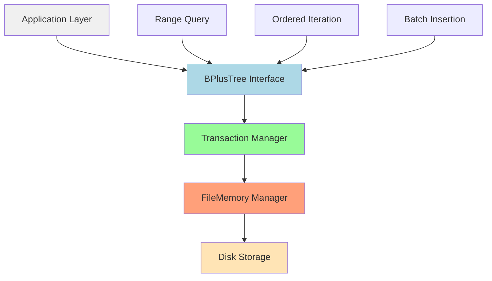

# `bplustree`

## Repository-Level Documentation: bplustree

### Tree Structure
```
bplustree/
├── tree.py          # Core B+ tree implementation
└── utils.py         # Utility functions for chunking and pairing
```

### Purpose
The bplustree repository provides a persistent, disk-backed B+ tree data structure for efficient key-value storage with ordered iteration and range query capabilities. It addresses the need for high-performance, ordered storage solutions that support frequent range scans and maintain data integrity through transactional operations.

Target users include database systems, indexing engines, and applications requiring persistent, ordered key-value storage with efficient range operations. The system is particularly valuable in scenarios where traditional hash tables or simple file-based storage cannot meet performance requirements for ordered access patterns.

In the broader ecosystem, bplustree serves as a foundational storage engine that can be integrated into larger systems requiring robust, persistent data structures. It operates as a standalone library focused on storage efficiency and range query performance rather than as a full database system.

### Architecture


Key architectural patterns:
- **Persistent Storage Pattern**: Uses file-based memory management for disk-backed storage
- **Transaction Management**: Ensures atomicity and consistency of operations
- **Page-Based Memory Management**: Organizes data into fixed-size pages for efficient I/O
- **Lazy Loading**: Nodes are loaded only when needed for operations

### Entry Points
- **Module Import**: `from bplustree import BPlusTree`
  - Provides main B+ tree functionality for key-value storage
  - Requires filename argument for persistent storage
  - Supports configuration via constructor parameters

- **Context Manager Usage**:
  ```python
  with BPlusTree('data.db') as tree:
      tree.insert(1, b'value')
  ```

### Core Features
1. **Persistent Key-Value Storage**: Store key-value pairs with automatic disk persistence
2. **Ordered Iteration**: Iterate through keys in sorted order
3. **Range Queries**: Efficiently retrieve subsets of keys using slicing syntax
4. **Batch Insertion**: Optimize bulk data loading with sorted input
5. **Overflow Handling**: Support for large values through chained overflow pages
6. **Transactional Integrity**: Ensure data consistency through transactional operations

### Dependencies
- **Internal**: None
- **External**: 
  - `typing` (for type hints)
  - `os` (for file operations)
  - `contextlib` (for context manager support)
  - `collections.abc` (for abstract base classes)

### Configuration
The system supports runtime configuration through constructor parameters:
- `page_size`: Size of storage pages (default: 4096 bytes)
- `order`: Maximum number of children per node (default: 100)
- `key_size`: Fixed size for keys in bytes (default: 8)
- `value_size`: Fixed size for values in bytes (default: 32)
- `cache_size`: Number of pages to cache in memory (default: 64)
- `serializer`: Custom serialization function for keys/values

### Extension Points
The system supports extension through:
- **Custom Serializers**: Implement custom key/value serialization for complex data types
- **Memory Managers**: Replace FileMemory with alternative implementations for different storage backends
- **Node Types**: Extend node handling through inheritance of base node classes
- **Configuration Parameters**: Tune performance characteristics through constructor parameters

---

## Modules

- [`bplustree`](bplustree.md)

