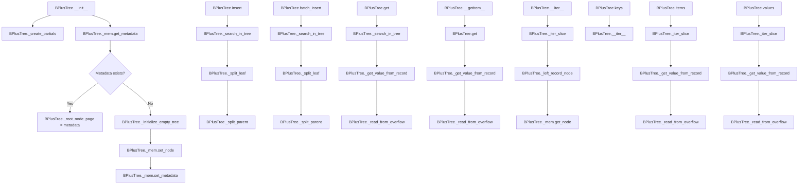

# `tree.py`

## `bplustree.tree.BPlusTree` · *class*

## Summary:
A B+ tree implementation that provides persistent key-value storage with efficient range queries and ordered iteration.

## Description:
The BPlusTree class implements a persistent B+ tree data structure designed for efficient storage and retrieval of key-value pairs. It supports ordered iteration, range queries, and automatic balancing through node splitting operations. The tree maintains its structure on disk using a file-based memory manager and handles large values through overflow page chains.

This class serves as the primary interface for interacting with the B+ tree, providing methods for insertion, retrieval, deletion, and iteration while managing the underlying tree structure and persistence automatically.

## State:
- `_filename` (str): Path to the file backing the tree's storage
- `_tree_conf` (TreeConf): Configuration object containing page size, order, key/value sizes, and serializer
- `_mem` (FileMemory): Memory manager responsible for page-level storage and transactions
- `_root_node_page` (int): Page number of the current root node
- `_is_open` (bool): Flag indicating whether the tree is currently open for operations
- `LonelyRootNode`, `RootNode`, `InternalNode`, `LeafNode`, `Record`, `Reference` (partial functions): Factory methods for creating node and entry types with pre-configured tree settings

## Lifecycle:
- Creation: Instantiate with filename and optional configuration parameters. Automatically initializes or loads existing tree structure from file
- Usage: Call methods like insert(), get(), __getitem__(), __setitem__() for data operations. Supports context manager protocol (__enter__, __exit__)
- Destruction: Close() method or context manager exit to release resources and flush pending writes

## Method Map:


## Raises:
- ValueError during __init__: When metadata cannot be loaded from file (tree is new)
- ValueError during insert: When attempting to insert a non-bytes value or when replacing a key without replace=True
- ValueError during batch_insert: When keys are not properly sorted or exceed existing keys
- ValueError during _iter_slice: When iterating with custom step or backwards slice
- KeyError during __getitem__: When key is not found and no default is provided

## Example:
```python
# Create a new B+ tree
tree = BPlusTree('my_tree.db', page_size=4096, order=100)

# Insert data
tree.insert(1, b'value1')
tree.insert(2, b'value2')

# Retrieve data
value = tree.get(1)  # Returns b'value1'
value = tree[2]      # Returns b'value2'

# Iterate over keys
for key in tree:
    print(key)

# Range query
subset = tree[1:3]   # Returns dictionary of keys 1 and 2

# Batch insert
tree.batch_insert([(3, b'value3'), (4, b'value4')])

# Cleanup
tree.close()
```

### `bplustree.tree.BPlusTree.__init__` · *method*

## Summary:
Initializes a B+ tree instance by configuring parameters, setting up file-based memory management, and establishing the root node structure.

## Description:
This method constructs a B+ tree instance by initializing configuration parameters, setting up file-based memory management, and either loading existing tree metadata or creating a new empty tree structure. It serves as the primary constructor for BPlusTree objects, orchestrating the setup of the underlying data structure.

The initialization process follows these steps:
1. Stores the filename and configuration parameters in instance variables
2. Creates partial functions for node and entry types using the configuration
3. Sets up file-based memory management with the specified cache size
4. Attempts to load existing tree metadata from the file
5. If no metadata exists (ValueError raised), initializes a new empty tree structure
6. If metadata exists, loads the root node page and configuration
7. Marks the tree as open for use

## Args:
    filename (str): Path to the file where the B+ tree data will be stored.
    page_size (int): Size of each page in bytes. Defaults to 4096.
    order (int): Maximum number of children for internal nodes. Defaults to 100.
    key_size (int): Size of keys in bytes. Defaults to 8.
    value_size (int): Size of values in bytes. Defaults to 32.
    cache_size (int): Number of pages to cache in memory. Defaults to 64.
    serializer (Optional[Serializer]): Serializer for keys and values. Defaults to IntSerializer().

## Returns:
    None

## Raises:
    None explicitly raised

## State Changes:
    Attributes READ: None
    Attributes WRITTEN: 
    - self._filename: Stores the file path
    - self._tree_conf: Stores tree configuration parameters
    - self._mem: Stores memory manager instance
    - self._root_node_page: Stores root node page number (loaded or newly allocated)
    - self._is_open: Sets tree state to open

## Constraints:
    Preconditions:
    - filename must be a valid string path
    - page_size, order, key_size, value_size must be positive integers
    - cache_size must be a non-negative integer
    - serializer must be a valid Serializer instance or None

    Postconditions:
    - self._filename contains the provided filename
    - self._tree_conf contains the configured tree parameters
    - self._mem contains a properly initialized FileMemory instance
    - self._root_node_page contains the root node page number (loaded or newly allocated)
    - self._is_open is set to True

## Side Effects:
    - File I/O operations for memory management
    - Potential creation of new files if the tree doesn't exist
    - Memory allocation for caching pages
    - Possible write transaction to initialize a new tree structure when no metadata exists

### `bplustree.tree.BPlusTree.close` · *method*

## Summary:
Closes the B+ tree's underlying memory connection and updates its open state flag.

## Description:
This method ensures that the B+ tree's associated memory resource is properly closed and marks the tree as closed. It is typically called during the tree's cleanup phase when it is no longer needed, either explicitly or through the context manager protocol (`__exit__`). The method uses a write transaction to ensure thread-safe closure operations and prevents redundant closing attempts.

## Args:
    None

## Returns:
    None

## Raises:
    None explicitly raised

## State Changes:
    Attributes READ: self._mem, self._is_open
    Attributes WRITTEN: self._is_open

## Constraints:
    Preconditions: The method can be called regardless of the current open state, but it only performs actual closing operations when the tree is open.
    Postconditions: After execution, the tree's `_is_open` attribute is set to False, and the underlying memory resource is closed.

## Side Effects:
    I/O operation: Closes the underlying memory resource via `self._mem.close()`
    Transaction management: Uses `self._mem.write_transaction` context manager for thread safety

### `bplustree.tree.BPlusTree.__enter__` · *method*

## Summary:
Context manager entry point that returns the tree instance for use in 'with' statements.

## Description:
This method implements the context manager protocol's `__enter__` magic method, allowing BPlusTree instances to be used in Python's `with` statement. When entered, it simply returns `self`, making the tree instance available within the context block. This method is typically paired with `__exit__` which handles cleanup by closing the tree.

## Args:
    None

## Returns:
    BPlusTree: The BPlusTree instance itself, enabling 'as tree:' syntax in with statements.

## Raises:
    None

## State Changes:
    Attributes READ: None
    Attributes WRITTEN: None

## Constraints:
    Preconditions: The tree instance must be properly initialized and not already closed.
    Postconditions: The returned instance is ready for use within the context manager block.

## Side Effects:
    None

### `bplustree.tree.BPlusTree.__exit__` · *method*

## Summary:
Closes the B+ tree database connection and releases associated resources when exiting a context manager.

## Description:
This method implements Python's context manager protocol's `__exit__` magic method. It is automatically called when exiting a `with` statement block that uses the BPlusTree instance. The method ensures proper cleanup of the underlying file memory and marks the tree as closed. This enables safe resource management and automatic cleanup when using the tree in context managers.

## Args:
    exc_type (type): Exception type if an exception occurred in the with block, else None
    exc_val (Exception): Exception value if an exception occurred in the with block, else None  
    exc_tb (traceback): Exception traceback if an exception occurred in the with block, else None

## Returns:
    None: This method does not return any value

## Raises:
    None: This method does not explicitly raise exceptions, though underlying operations may raise exceptions

## State Changes:
    Attributes READ: self._is_open, self._mem
    Attributes WRITTEN: self._is_open (set to False)

## Constraints:
    Preconditions: The BPlusTree instance must be initialized and accessible
    Postconditions: The tree's memory connection is closed and _is_open flag is set to False

## Side Effects:
    I/O operations: Flushes and closes file handles via the memory manager's close operation
    Resource cleanup: Releases file handles, memory buffers, and other system resources
    Transaction handling: Commits any pending write transactions before closing

### `bplustree.tree.BPlusTree.checkpoint` · *method*

## Summary:
Performs a checkpoint operation on the B+ tree's memory storage within a write transaction.

## Description:
This method executes a checkpoint operation by invoking the underlying memory storage's checkpoint mechanism while ensuring the operation occurs within a write transaction context. The checkpoint flushes pending writes to persistent storage and updates the write-ahead log to mark a consistent state.

The method specifically calls `self._mem.perform_checkpoint(reopen_wal=True)` which indicates it's performing a checkpoint operation with WAL (Write-Ahead Log) reopening enabled, likely for log rotation or management purposes.

## Args:
    None

## Returns:
    None

## Raises:
    Exception: Propagates any exceptions raised by `self._mem.perform_checkpoint()` or `self._mem.write_transaction`

## State Changes:
    Attributes READ: self._mem
    Attributes WRITTEN: None

## Constraints:
    Preconditions:
    - The B+ tree must be properly initialized
    - The underlying memory storage (`self._mem`) must support checkpoint operations
    - The write transaction mechanism must be functional
    
    Postconditions:
    - The checkpoint operation is completed successfully within a transaction context
    - The underlying memory storage state reflects the checkpointed state

## Side Effects:
    - Invokes the underlying memory storage's checkpoint mechanism
    - May involve I/O operations to persist data to disk
    - May involve write-ahead log management operations

### `bplustree.tree.BPlusTree.insert` · *method*

## Summary:
Inserts a key-value pair into the B+ tree, handling both regular and overflow pages for large values.

## Description:
This method manages the insertion of key-value pairs into the B+ tree structure. It handles two main cases: when the key already exists (with optional replacement) and when inserting a new key. For large values that exceed the configured value size limit, it creates overflow pages to store the data. The method also manages tree balancing through leaf splitting when nodes become full.

## Args:
    key (int): The key to insert into the tree.
    value (bytes): The value associated with the key, must be a bytes object.
    replace (bool): If True, replaces existing entries with the same key. If False, raises an error when a key already exists.

## Returns:
    None: This method does not return a value.

## Raises:
    ValueError: When attempting to insert a key that already exists and replace=False, or when the value is not a bytes object.

## State Changes:
    Attributes READ: 
        - self._tree_conf
        - self._root_node
        - self._mem
    
    Attributes WRITTEN:
        - self._mem (through set_node calls)

## Constraints:
    Preconditions:
        - The value parameter must be a bytes object.
        - The tree must be open (self._is_open is True).
        - The tree must be in a valid state for writing operations.
    
    Postconditions:
        - The key-value pair is either inserted or replaced in the tree.
        - If the value is too large, overflow pages are created and linked.
        - The tree maintains its structural properties after insertion.

## Side Effects:
    - Modifies the underlying storage through write transactions.
    - May create new pages in the file-based memory system.
    - May split leaf nodes to maintain tree balance.

### `bplustree.tree.BPlusTree.batch_insert` · *method*

## Summary:
Inserts multiple key-value pairs into the B+ tree in a single operation, maintaining sorted order and handling overflow pages for large values.

## Description:
This method performs batch insertion of key-value pairs into the B+ tree. It is designed to be more efficient than individual insertions by minimizing transaction overhead and ensuring keys are inserted in sorted order. The method handles both small values that fit within the node's capacity and large values that require overflow pages.

## Args:
    iterable (Iterable): An iterable of (key, value) pairs to be inserted into the tree. Keys must be sorted in ascending order and greater than any existing keys in the tree.

## Returns:
    None: This method does not return any value.

## Raises:
    ValueError: If keys in the iterable are not sorted in ascending order or if any key is less than or equal to the largest key currently in the tree.

## State Changes:
    Attributes READ: 
        - self._mem (for write_transaction context)
        - self._root_node (passed to _search_in_tree)
        - self._tree_conf (for value_size check)
    Attributes WRITTEN:
        - self._mem (via set_node calls)
        - self._root_node_page (via set_metadata call)

## Constraints:
    Preconditions:
        - The tree must be open (self._is_open must be True)
        - Keys in the iterable must be sorted in ascending order
        - All keys in the iterable must be greater than the largest key currently in the tree
        - The iterable must contain valid (key, value) pairs
    Postconditions:
        - All key-value pairs from the iterable are inserted into the tree
        - The tree maintains its B+ tree properties
        - Overflow pages are created for large values as needed

## Side Effects:
    - Modifies the tree structure by inserting new nodes and potentially splitting existing nodes
    - Creates overflow pages in the underlying storage for large values
    - Updates the memory manager with modified nodes
    - May create a new root node if the original root splits
    - Uses write transaction for atomicity of all operations

### `bplustree.tree.BPlusTree.get` · *method*

## Summary:
Retrieves the value associated with a given key from the B+ tree, returning a default value if the key is not found.

## Description:
This method provides read access to values stored in the B+ tree structure. It performs a search operation to locate the appropriate leaf node containing the specified key, then extracts the associated value from the record. The method handles cases where the key does not exist by returning a provided default value or None. This is a core interface method for retrieving data from the tree structure.

## Args:
    key (any): The key to search for within the B+ tree
    default (bytes, optional): The value to return if the key is not found. Defaults to None

## Returns:
    bytes: The value associated with the key if found, otherwise the default value

## Raises:
    ValueError: Raised when the key is not found in the tree structure (caught internally and handled by returning default)

## State Changes:
    Attributes READ: 
        - self._mem: Used for read transaction management and node retrieval
        - self._root_node: Accessed to initiate the search process
    Attributes WRITTEN: None

## Constraints:
    Preconditions:
        - The key must be comparable with existing keys in the tree
        - The tree must be properly initialized and opened
        - The key must be of a type compatible with the tree's configured key size and serialization
    Postconditions:
        - The method returns either the value bytes associated with the key or the default value
        - The tree structure remains unchanged
        - The read transaction is properly managed

## Side Effects:
    - Memory access via self._mem.read_transaction to manage concurrent access
    - Calls to self._search_in_tree to traverse the tree structure
    - Calls to node.get_entry (method varies by node type) to retrieve records from nodes
    - Calls to self._get_value_from_record to extract values from records

### `bplustree.tree.BPlusTree.__contains__` · *method*

## Summary:
Checks whether a given key exists in the B+ tree structure.

## Description:
This method determines if a specified key is present in the B+ tree by leveraging the existing `get` method. It uses a sentinel object to distinguish between a key that doesn't exist versus a key that exists but has a None value. This approach allows for efficient existence checking without requiring separate logic for handling missing keys.

The method operates within a read transaction to ensure consistency during the check operation. It's designed as a dedicated method rather than being inlined because it provides a clean interface for the `in` operator and encapsulates the logic for distinguishing between missing keys and keys with None values.

Known callers:
- The `in` operator when used with a BPlusTree instance (e.g., `key in tree`)
- Internal tree operations that require existence checking

## Args:
    item (Any): The key to search for in the tree. The type depends on the tree's configured serializer and key size.

## Returns:
    bool: True if the key exists in the tree, False otherwise.

## Raises:
    None explicitly raised by this method.

## State Changes:
    Attributes READ: 
    - self._mem
    - self._root_node
    Attributes WRITTEN: None

## Constraints:
    Preconditions:
    - The tree must be open (self._is_open is True)
    - The key type must be compatible with the tree's configured serializer
    - The method must be called within a valid read transaction context
    
    Postconditions:
    - The tree remains unchanged
    - No modifications are made to any internal state

## Side Effects:
    - Accesses the underlying storage medium through self._mem
    - May trigger disk I/O operations when retrieving nodes from storage
    - Uses a read transaction to ensure consistency

### `bplustree.tree.BPlusTree.__setitem__` · *method*

## Summary:
Sets a key-value pair in the B+ tree, replacing any existing value for the key.

## Description:
This method provides dictionary-style assignment functionality for the B+ tree, allowing users to store key-value pairs where the value is stored as bytes. It internally calls the `insert` method with the `replace=True` parameter to ensure that if a key already exists, its value is updated rather than raising an error. This enables efficient update operations on existing keys.

## Args:
    key (int): The key to set in the tree.
    value (bytes): The value to associate with the key, stored as bytes.

## Returns:
    None: This method does not return a value.

## Raises:
    ValueError: If the value is not a bytes object, or if the key already exists and replace=False (though this case is prevented by the replace=True flag).

## State Changes:
    Attributes READ: _root_node, _tree_conf
    Attributes WRITTEN: _root_node_page, _mem

## Constraints:
    Preconditions: The tree must be open and accessible via _mem.
    Postconditions: The key-value pair is either inserted or updated in the tree structure.

## Side Effects:
    Mutates the tree's internal structure by potentially modifying nodes and creating new pages if overflow handling is required.

### `bplustree.tree.BPlusTree.__getitem__` · *method*

## Summary:
Retrieves a value associated with a given key from the B+ tree, or returns a dictionary of values within a key range when given a slice.

## Description:
This method implements the `__getitem__` protocol for the BPlusTree class, enabling dictionary-style access to stored values. When a single key is provided, it retrieves the corresponding value or raises a KeyError if not found. When a slice is provided, it returns a dictionary mapping keys to values within the specified range. This method leverages the tree's internal search mechanism and record retrieval capabilities.

## Args:
    item (Union[bytes, slice]): A key to retrieve a single value, or a slice to retrieve a range of values.

## Returns:
    bytes: The value associated with the given key.
    dict: A dictionary mapping keys to values when a slice is provided.

## Raises:
    KeyError: When attempting to retrieve a value for a key that does not exist in the tree.
    ValueError: When a slice with a custom step is provided, or when iterating backwards through a slice.

## State Changes:
    Attributes READ: 
        - self._mem (for read transaction)
        - self._root_node (for tree traversal)
        - self._left_record_node (for slice iteration)
    Attributes WRITTEN: None

## Constraints:
    Preconditions:
        - The tree must be open (self._is_open must be True).
        - The key or slice arguments must be valid for the tree's configuration.
    Postconditions:
        - For single key lookup: Returns the value bytes or raises KeyError.
        - For slice lookup: Returns a dictionary of all key-value pairs in the range.

## Side Effects:
    - Performs read transactions on the underlying memory storage.
    - May read from disk pages via the memory manager.
    - Accesses internal tree nodes and records.
    - Traverses the tree structure to find matching entries.

### `bplustree.tree.BPlusTree.__len__` · *method*

## Summary:
Calculates and returns the total number of records stored in the B+ tree by traversing all leaf nodes from the leftmost record node.

## Description:
This method implements the special __len__ protocol to support Python's built-in len() function on BPlusTree instances. It efficiently counts all records by traversing the linked list of leaf nodes starting from self._left_record_node, accumulating entry counts from each node until reaching the end of the linked list.

The traversal uses the next_page pointer chain to move from one leaf node to the next, avoiding full tree traversal. This design leverages the B+ tree's structural property where leaf nodes form a sequential linked list, making record counting an O(n) operation where n is the number of leaf nodes rather than all nodes in the tree.

## Args:
    None

## Returns:
    int: The total number of records stored in the B+ tree.

## Raises:
    None

## State Changes:
    Attributes READ: 
    - self._mem: FileMemory instance used for accessing nodes
    - self._left_record_node: Reference to the leftmost leaf node containing records
    
    Attributes WRITTEN: 
    - None

## Constraints:
    Preconditions:
    - The B+ tree must be properly initialized with valid _left_record_node and _mem attributes
    - All nodes in the linked list of leaf nodes must be accessible through _mem.get_node()
    
    Postconditions:
    - The method returns an integer representing the total count of records
    - The tree structure remains unchanged

## Side Effects:
    - Acquires a read transaction from self._mem to ensure consistent reading
    - Makes multiple calls to self._mem.get_node() to retrieve subsequent leaf nodes
    - Reads node entries and next_page pointers from memory

### `bplustree.tree.BPlusTree.__length_hint__` · *method*

## Summary:
Provides an estimated count of records in the B+ tree for iterator length hinting purposes.

## Description:
This method implements the `__length_hint__` protocol to provide an estimated record count for the B+ tree. It's intended to be called by Python's iterator protocol when estimating the length of iterations over the tree. The estimation is based on memory layout statistics and node configuration parameters.

When the tree has a lonely root node (a special case where the root is also a leaf node), it returns `node.max_children // 2` as a conservative estimate. Otherwise, it calculates the estimate by assuming 70% of memory pages contain leaf nodes and averaging the maximum and minimum children counts to estimate records per leaf node.

## Args:
    None

## Returns:
    int: An estimated count of records in the tree, used for iterator length hinting.

## Raises:
    None explicitly raised

## State Changes:
    Attributes READ: 
    - self._mem (accessed via read_transaction context)
    - self._root_node
    - self._mem.last_page
    - self._root_node.max_children
    - self._root_node.min_children

## Constraints:
    Preconditions:
    - The tree must have a valid memory manager (`self._mem`) with a `last_page` attribute
    - The root node must be accessible and properly initialized
    - The root node must have `max_children` and `min_children` attributes
    
    Postconditions:
    - The returned value is always a positive integer representing an estimated record count
    - The method does not modify any tree state

## Side Effects:
    - Acquires a read transaction from `self._mem.read_transaction`
    - Reads from memory pages through `self._mem.last_page`

### `bplustree.tree.BPlusTree.__iter__` · *method*

## Summary:
Returns an iterator over all keys in the B+ tree, optionally within a specified slice range.

## Description:
This method provides a way to iterate through all keys stored in the B+ tree in ascending order. It supports slicing to limit the iteration to a specific range of keys. The method leverages the internal `_iter_slice` method to handle the actual iteration logic and maintains a read transaction for data consistency. This approach allows for efficient traversal of the tree structure while ensuring data integrity.

## Args:
    slice_ (Optional[slice]): A slice object defining the range of keys to iterate over. If None, all keys are returned. Defaults to None.

## Returns:
    Iterator[str]: An iterator yielding keys from the B+ tree in ascending order.

## Raises:
    ValueError: If the slice has a custom step or attempts to iterate backwards.

## State Changes:
    Attributes READ: 
        - self._mem
        - self._iter_slice

## Constraints:
    Preconditions:
        - The B+ tree must be open (self._is_open must be True).
        - The slice_ parameter must be a valid slice object or None.
    Postconditions:
        - The method returns an iterator that yields keys in ascending order.
        - The read transaction ensures data consistency during iteration.

## Side Effects:
    - Acquires a read transaction from self._mem.
    - Reads nodes from persistent storage via self._mem.get_node().
    - May raise StopIteration when reaching the end of the iteration range.

### `bplustree.tree.BPlusTree.items` · *method*

## Summary:
Returns an iterator over key-value pairs in the B+ tree, optionally filtered by a key range slice.

## Description:
This method provides iteration over all key-value pairs in the B+ tree, or a subset defined by a slice range. It is designed to support range queries efficiently by leveraging internal tree traversal mechanisms. The method ensures thread-safe read operations through a memory transaction context and handles both in-page and overflow page storage for values.

## Args:
    slice_ (Optional[slice], optional): A Python slice object specifying the key range to iterate over. When None, iterates over all key-value pairs. Defaults to None.

## Returns:
    Iterator[tuple]: An iterator yielding tuples of (key, value) pairs from the tree, ordered by key. Each value is retrieved from either in-page storage or overflow pages as needed.

## Raises:
    ValueError: When a slice with a custom step is provided (slice_.step is not None) or when start key is greater than or equal to stop key.

## State Changes:
    Attributes READ: self._mem
    Attributes WRITTEN: None

## Constraints:
    Preconditions: The B+ tree must be open and properly initialized. The slice_ parameter must be a valid slice object or None.
    Postconditions: The method returns an iterator that yields key-value pairs in ascending key order, respecting the slice range if provided.

## Side Effects:
    I/O operations: Reads from disk via self._mem.get_node() and self._mem.get_page() methods during tree traversal and value retrieval.
    Transaction management: Acquires a read transaction from self._mem to ensure data consistency.

### `bplustree.tree.BPlusTree.values` · *method*

## Summary:
Returns an iterator over the values stored in the B+ tree, optionally filtered by a key range.

## Description:
This method provides access to all values stored in the B+ tree, enabling iteration over values in key-sorted order. It supports range queries using Python slice notation, allowing users to iterate over a subset of values. The method leverages the internal `_iter_slice` method to traverse the tree structure and retrieve records, then uses `_get_value_from_record` to extract the actual byte values from each record. The method operates within a read transaction to ensure consistency.

## Args:
    slice_ (Optional[slice], optional): A Python slice object specifying the key range to iterate over. Defaults to None, which means iterate over all values.

## Returns:
    Iterator[bytes]: An iterator yielding the values (as bytes) stored in the tree, ordered by their keys.

## Raises:
    ValueError: When a custom step is provided in the slice (slice_.step is not None) or when start key is greater than or equal to stop key.

## State Changes:
    Attributes READ: self._mem, self._iter_slice, self._get_value_from_record
    Attributes WRITTEN: None

## Constraints:
    Preconditions: The B+ tree must be open and properly initialized. The slice must not have a step value.
    Postconditions: The method returns an iterator that yields values in ascending key order within the specified range, stopping before the stop key (exclusive).

## Side Effects:
    I/O operations: Reads from disk via self._mem.read_transaction and related methods to traverse the tree structure and retrieve node data.

### `bplustree.tree.BPlusTree.__bool__` · *method*

## Summary:
Returns whether the B+ tree contains any records.

## Description:
This method provides a boolean indication of whether the tree has any data entries. It leverages the tree's iteration protocol to efficiently check for the presence of records without fully enumerating them. The method uses a read transaction to ensure consistency during the check.

## Args:
    None

## Returns:
    bool: True if the tree contains at least one record, False otherwise.

## Raises:
    None explicitly raised

## State Changes:
    Attributes READ: self._mem, self
    Attributes WRITTEN: None

## Constraints:
    Preconditions: The tree must be open (self._is_open = True)
    Postconditions: Returns a boolean value indicating record existence

## Side Effects:
    Performs a read transaction on the underlying memory storage
    Iterates through the tree's records once to determine existence

### `bplustree.tree.BPlusTree.__repr__` · *method*

## Summary:
Returns a string representation of the BPlusTree instance showing its filename and configuration.

## Description:
This method provides a human-readable representation of the BPlusTree object, primarily used for debugging and logging purposes. It formats the tree's filename and configuration into a string that clearly identifies the tree instance.

The method is implemented as a standard `__repr__` magic method, which means it's automatically called when the built-in `repr()` function is applied to a BPlusTree instance or when the object is displayed in interactive environments like Python REPL.

## Args:
    None

## Returns:
    str: A formatted string in the pattern '<BPlusTree: {filename} {tree_conf}>', where:
        - filename is the path to the underlying storage file
        - tree_conf is the TreeConf object containing the tree's configuration parameters

## Raises:
    None

## State Changes:
    Attributes READ: 
        - self._filename: String representing the file path
        - self._tree_conf: TreeConf object containing configuration settings
    Attributes WRITTEN: None

## Constraints:
    Preconditions:
        - The BPlusTree instance must be properly initialized
        - Both self._filename and self._tree_conf must be set to valid values
    Postconditions:
        - The returned string follows a consistent format
        - The string contains meaningful identifying information about the tree

## Side Effects:
    None

### `bplustree.tree.BPlusTree._initialize_empty_tree` · *method*

## Summary:
Initializes an empty B+ tree structure by allocating a root node page and setting up initial metadata.

## Description:
This method creates the foundational structure for a new B+ tree by:
1. Allocating the next available page for the root node
2. Creating a lonely root node in that page within a write transaction
3. Storing the tree configuration metadata associated with the root page

This method is typically called during the construction of a new B+ tree instance to establish the initial storage layout.

## Args:
    None

## Returns:
    None

## Raises:
    None explicitly raised

## State Changes:
    Attributes READ: self._mem, self._tree_conf
    Attributes WRITTEN: self._root_node_page

## Constraints:
    Preconditions: 
    - The BPlusTree instance must have valid _mem (memory manager) and _tree_conf (configuration) attributes
    - The memory manager must support next_available_page property and write_transaction context
    - The memory manager must support set_node and set_metadata methods
    
    Postconditions:
    - self._root_node_page is assigned the next available page number
    - A lonely root node is created in memory at that page
    - Tree metadata is stored for that page

## Side Effects:
    - Memory allocation through self._mem.next_available_page
    - Write transaction to memory manager (I/O operations)
    - Creation of a new node in memory
    - Metadata storage in memory

### `bplustree.tree.BPlusTree._create_partials` · *method*

## Summary:
Initializes partial function objects for node and entry types, pre-configured with tree configuration.

## Description:
This method creates and assigns partial functions for various node and entry types, pre-bound with the tree's configuration. These partial functions serve as factory methods for creating instances of these types with the appropriate configuration already applied. It's called during BPlusTree initialization to set up reusable constructors for different node and entry types.

## Args:
    None

## Returns:
    None

## Raises:
    None

## State Changes:
    Attributes READ: self._tree_conf
    Attributes WRITTEN: self.LonelyRootNode, self.RootNode, self.InternalNode, self.LeafNode, self.Record, self.Reference

## Constraints:
    Preconditions: The method assumes self._tree_conf is properly initialized before being called.
    Postconditions: All six partial functions (LonelyRootNode, RootNode, InternalNode, LeafNode, Record, Reference) are assigned as instance attributes.

## Side Effects:
    None

### `bplustree.tree.BPlusTree._root_node` · *method*

## Summary:
Returns the root node of the B+ tree, ensuring it is either a LonelyRootNode or RootNode instance.

## Description:
This method retrieves the root node from memory using the stored page reference and validates that it is of the correct type. It serves as a safe accessor for the tree's root node, ensuring type consistency throughout the tree operations. This method is typically called during tree traversal, insertion, and deletion operations to access the starting point of the tree structure.

## Args:
    None

## Returns:
    Union['LonelyRootNode', 'RootNode']: The root node of the B+ tree, which is either a LonelyRootNode or RootNode instance.

## Raises:
    AssertionError: If the retrieved node is not an instance of either LonelyRootNode or RootNode.

## State Changes:
    Attributes READ: self._mem, self._root_node_page
    Attributes WRITTEN: None

## Constraints:
    Preconditions: The tree must have been initialized with a valid memory manager and root node page reference.
    Postconditions: The returned node is guaranteed to be either a LonelyRootNode or RootNode instance.

## Side Effects:
    None

### `bplustree.tree.BPlusTree._left_record_node` · *method*

## Summary:
Traverses the leftmost path of the B+ tree structure to find the leftmost leaf or lonely root node.

## Description:
This method navigates down the leftmost branch of the B+ tree by following the smallest entry's before references in internal nodes. It begins at the root node and continues traversing until it reaches either a LeafNode or a LonelyRootNode, which represent the leftmost terminal nodes in the tree structure. This traversal pattern is commonly used to find the first record in a B+ tree.

## Args:
    None

## Returns:
    Union['LonelyRootNode', 'LeafNode']: The leftmost node in the tree structure, which will be either a LeafNode or a LonelyRootNode.

## Raises:
    None explicitly raised

## State Changes:
    Attributes READ: self._root_node, self._mem, node.smallest_entry.before
    Attributes WRITTEN: None

## Constraints:
    Preconditions: 
    - The tree must have a valid root node (self._root_node must exist)
    - The tree structure must be consistent (each node's smallest_entry.before must reference a valid node)
    - The traversal must eventually reach a LeafNode or LonelyRootNode (tree structure must be valid)
    Postconditions:
    - The returned node is guaranteed to be either a LeafNode or a LonelyRootNode
    - The traversal maintains the integrity of the tree structure

## Side Effects:
    - Calls self._mem.get_node() which likely involves memory/file I/O operations
    - May trigger loading of nodes from persistent storage if they are not already in memory

### `bplustree.tree.BPlusTree._iter_slice` · *method*

## Summary:
Returns an iterator over records within a specified key range in the B+ tree, supporting range queries using slice notation.

## Description:
This method implements range iteration over the B+ tree's records. It is primarily used internally by the `__getitem__` method when a slice is provided, enabling efficient range queries without loading all records into memory. The method traverses the tree starting from either the leftmost leaf node (when no start key is specified) or the appropriate leaf node containing the start key, then yields records in ascending key order until reaching the stop key or end of the tree.

## Args:
    slice_ (slice): A Python slice object defining the key range to iterate over. The slice can specify start, stop, and step values, though step is not supported and will raise a ValueError.

## Returns:
    Iterator[Record]: An iterator yielding Record objects within the specified key range, ordered by key.

## Raises:
    ValueError: When a custom step is provided in the slice (slice_.step is not None) or when start key is greater than or equal to stop key.

## State Changes:
    Attributes READ: self._left_record_node, self._root_node, self._mem
    Attributes WRITTEN: None

## Constraints:
    Preconditions: The B+ tree must be open and properly initialized. The slice must not have a step value.
    Postconditions: The method returns an iterator that yields records in ascending key order within the specified range, stopping before the stop key (exclusive).

## Side Effects:
    I/O operations: Reads from disk via self._mem.get_node() and self._mem.get_page() methods to traverse the tree structure and retrieve node data.

### `bplustree.tree.BPlusTree._search_in_tree` · *method*

## Summary:
Recursively traverses the B+ tree structure to locate the leaf node containing the specified key or the appropriate insertion position.

## Description:
This private method implements the core search algorithm for B+ tree navigation. It recursively follows child pointers from internal nodes to locate the correct leaf node for a given key. The method handles three distinct cases for key positioning: keys smaller than the smallest key in a node, keys greater than or equal to the largest key, and keys falling between existing keys. This method serves as the fundamental building block for tree traversal operations and maintains parent-child relationships throughout the search process.

## Args:
    key (any): The key value to search for within the B+ tree structure
    node (Node): The current node being examined during traversal

## Returns:
    Node: A LeafNode or LonelyRootNode that either contains the key or represents the correct insertion position

## Raises:
    AssertionError: When no valid page reference can be determined during traversal (indicating tree structure corruption)

## State Changes:
    Attributes READ: 
        - self._mem: Used to retrieve child nodes from memory/storage
        - node.smallest_key, node.biggest_key, node.entries, node.smallest_entry, node.biggest_entry
    Attributes WRITTEN:
        - child_node.parent: Set to the current node to maintain tree structure integrity

## Constraints:
    Preconditions:
        - The key must be comparable with node key values using standard comparison operators
        - The node parameter must be a valid Node instance from the tree structure
        - The tree structure must remain internally consistent
    Postconditions:
        - Always returns either a LeafNode or LonelyRootNode instance
        - The returned node's parent pointer is correctly set to the previous node in the traversal path

## Side Effects:
    - Memory access via self._mem.get_node() to fetch child nodes from persistent storage
    - Mutation of child_node.parent attribute to preserve tree structural relationships

### `bplustree.tree.BPlusTree._split_leaf` · *method*

## Summary:
Splits a leaf node into two nodes when it exceeds capacity, maintaining B+ tree properties and updating parent references.

## Description:
This method implements the leaf node splitting mechanism in a B+ tree. When a leaf node becomes full, it splits into two nodes to maintain the tree's structural integrity. The method handles three distinct cases: when the node is a lonely root (converted to regular leaf), when the parent can accommodate the new reference, or when the parent itself needs to be split. This ensures the B+ tree maintains its balance and ordering properties.

## Args:
    old_node (Node): The leaf node to be split. Must be either a LeafNode or LonelyRootNode instance that has exceeded its capacity.

## Returns:
    None

## Raises:
    None explicitly raised

## State Changes:
    Attributes READ: self._mem, self._tree_conf, old_node.parent, old_node.next_page, old_node.page, old_node.entries
    Attributes WRITTEN: self._root_node_page, old_node.next_page, old_node.page, old_node.entries, new_node.entries, new_node.page, new_node.next_page

## Constraints:
    Preconditions: The old_node must be either a LeafNode or a LonelyRootNode. The old_node must be full (exceeding capacity) to trigger this split operation.
    Postconditions: The original node and new node are properly initialized with their respective entries. The parent node is updated with a reference to the new node, and the tree's memory is updated to persist these changes. The next_page link is correctly maintained between the two nodes.

## Side Effects:
    I/O operations: Writes to memory via self._mem.set_node() for both the old and new nodes, and potentially self._mem.set_metadata() if a new root is created through _create_new_root().

### `bplustree.tree.BPlusTree._split_parent` · *method*

## Summary:
Splits a parent node when its child node has exceeded capacity, redistributing entries and updating references to maintain the B+ tree structure.

## Description:
This method handles the splitting of internal nodes in a B+ tree when a child node becomes full. It creates a new sibling node containing half of the entries from the original node, updates the parent node with a reference to the new node, and manages the tree's root node if necessary. The method recursively calls itself when the parent node also needs to be split. This logic is separated from other node operations to encapsulate the complex rebalancing behavior required during tree maintenance.

## Args:
    old_node (Node): The internal node that has exceeded its capacity and needs to be split.

## Returns:
    None

## Raises:
    None explicitly raised

## State Changes:
    Attributes READ: self._mem, self.InternalNode, old_node.parent, old_node.page, old_node.entries
    Attributes WRITTEN: self._mem, old_node.page, old_node.entries, new_node.page, new_node.entries, ref.before, ref.after

## Constraints:
    Preconditions: The old_node must be a Node instance that has exceeded its capacity. The parent node must exist and be accessible. The old_node must have a parent (not the root node).
    Postconditions: The old_node and new_node are properly updated with their respective entries, and the parent node contains a reference to the new node. If the old_node was the root, it is converted to an internal node and a new root is created.

## Side Effects:
    I/O operations: Writes to memory via self._mem.set_node() for both the old and new nodes, and potentially for the parent node. May recursively call itself for further splits.

### `bplustree.tree.BPlusTree._create_new_root` · *method*

## Summary:
Creates a new root node for the B+ tree and initializes it with the provided reference.

## Description:
This method is invoked when a new root node needs to be established, typically when the tree is empty or during tree restructuring operations. It creates a new RootNode instance using the next available memory page, inserts the provided reference into this new root, updates the tree's root page reference, and persists the new root node's metadata and data to memory.

## Args:
    reference (Reference): The reference to be inserted into the newly created root node.

## Returns:
    None

## Raises:
    None explicitly raised

## State Changes:
    Attributes READ: self._mem, self._tree_conf
    Attributes WRITTEN: self._root_node_page

## Constraints:
    Preconditions: The method assumes that the tree is either empty or undergoing restructuring, and that self._mem.next_available_page provides a valid page identifier.
    Postconditions: The tree's root node is updated to point to the new root node's page, and the new root node is persisted in memory with proper metadata.

## Side Effects:
    I/O operations: Writes to memory via self._mem.set_metadata() and self._mem.set_node()

### `bplustree.tree.BPlusTree._create_overflow` · *method*

## Summary:
Creates a linked chain of overflow pages to store a large byte value that exceeds single page capacity.

## Description:
This method handles the storage of large byte values by splitting them into chunks that fit within page boundaries and linking these chunks together through page references. It is called when a value cannot fit within a single page of the B+ tree's storage system.

The method creates a chain of pages where each page contains a portion of the data and a reference to the next page in the chain. The last page in the chain has a zero reference indicating termination. This approach allows storing arbitrarily large values while maintaining the fixed-size page structure of the B+ tree.

The utility function `utils.iter_slice` is used to split the input value into appropriately sized chunks, with the `is_last` flag indicating which chunk is the final one in the sequence.

## Args:
    value (bytes): The large byte string to be stored across multiple pages

## Returns:
    int: The page number of the first page in the overflow chain

## Raises:
    None explicitly raised

## State Changes:
    Attributes READ: self._tree_conf.page_size, self._mem.next_available_page
    Attributes WRITTEN: self._mem.set_page (modifies page data in memory)

## Constraints:
    Preconditions: The value must be larger than what fits in a single page
    Postconditions: All pages in the overflow chain are properly initialized with data and references

## Side Effects:
    I/O operations through self._mem.set_page calls that write data to memory pages

### `bplustree.tree.BPlusTree._read_from_overflow` · *method*

## Summary:
Reconstructs a complete byte sequence from a chain of overflow pages in the B+ tree's storage.

## Description:
This method traverses a linked chain of overflow pages to reconstruct a complete byte sequence that was split across multiple pages due to size limitations. Each overflow page contains:
1. A reference to the next overflow page (PAGE_REFERENCE_BYTES)
2. The length of the payload data (USED_PAGE_LENGTH_BYTES) 
3. The actual payload data of the specified length

The method follows the chain until reaching a page with a zero reference, indicating the end of the overflow chain. This logic is separated into its own method to cleanly handle the overflow page traversal and reconstruction, keeping the main record retrieval logic simpler.

## Args:
    first_overflow_page (int): The page number of the first overflow page in the chain

## Returns:
    bytes: The complete reconstructed byte sequence containing all data from the overflow page chain

## Raises:
    Exception: Propagated exceptions from self._mem.get_page() such as I/O errors, KeyError for invalid page numbers, or ValueError for malformed page data

## State Changes:
    Attributes READ: self._mem
    Attributes WRITTEN: None

## Constraints:
    Preconditions:
        - first_overflow_page must be a valid page number in the storage
        - All pages in the chain must be properly formatted with correct page headers
        - All pages in the chain must be accessible through self._mem.get_page()
    
    Postconditions:
        - Returns a complete byte sequence with all overflow data concatenated
        - The returned bytes represent the full payload originally stored across multiple pages

## Side Effects:
    - Performs I/O operations via self._mem.get_page() to read from persistent storage
    - May cause disk or memory access depending on the FileMemory implementation

### `bplustree.tree.BPlusTree._get_value_from_record` · *method*

## Summary:
Retrieves the value associated with a record, handling cases where the value is stored in overflow pages.

## Description:
This method extracts the value from a given record. If the record contains an in-page value (i.e., record.value is not None), it returns that value directly. Otherwise, it retrieves the value from an overflow page using the record's overflow page reference by calling self._read_from_overflow. This abstraction allows the caller to treat all values uniformly regardless of their physical storage location (in-page vs. overflow).

## Args:
    record (Record): The record from which to retrieve the value. The record must have either a direct value or an overflow page reference.

## Returns:
    bytes: The value stored in the record, either directly from the record or retrieved from an overflow page.

## Raises:
    None explicitly raised.

## State Changes:
    Attributes READ: record.value, record.overflow_page
    Attributes WRITTEN: None

## Constraints:
    Preconditions: The record parameter must be a valid Record instance with either a value or overflow_page attribute.
    Postconditions: The returned value is always of type bytes.

## Side Effects:
    I/O operations: When record.value is None, this method invokes self._read_from_overflow, which likely performs disk or memory I/O to retrieve the value from an overflow page.

