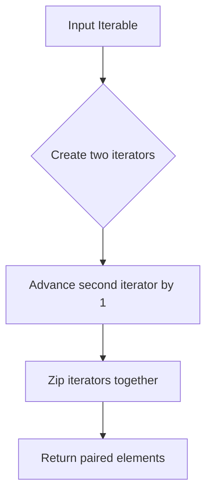

# `utils.py`

## `bplustree.utils.pairwise` · *function*

## Summary:
Returns consecutive pairs of elements from an iterable as tuples.

## Description:
Creates pairs of adjacent elements from the input iterable, where each pair consists of consecutive items. This utility function is commonly used for comparing neighboring elements, implementing sliding window operations, or processing sequential data in pairs.

## Args:
    iterable (Iterable): An iterable object containing elements to be paired consecutively.

## Returns:
    zip: An iterator of tuples, where each tuple contains two consecutive elements from the input iterable. The returned iterator will have length n-1 where n is the length of the input iterable. If the input iterable has fewer than 2 elements, an empty iterator is returned.

## Raises:
    None

## Constraints:
    Preconditions:
        - The input must be an iterable object.
        - The iterable should not be empty for meaningful results (though function works with empty iterables).
    
    Postconditions:
        - The returned iterator produces tuples of length 2.
        - The number of tuples produced equals the number of elements in the input minus one.
        - When the input has less than 2 elements, no tuples are produced.

## Side Effects:
    None

## Control Flow:


## Examples:
    >>> list(pairwise([1, 2, 3, 4]))
    [(1, 2), (2, 3), (3, 4)]
    
    >>> list(pairwise('abc'))
    [('a', 'b'), ('b', 'c')]
    
    >>> list(pairwise([]))
    []
    
    >>> list(pairwise([1]))
    []
```

## `bplustree.utils.iter_slice` · *function*

## Summary:
Slices a byte sequence into fixed-size chunks with end-of-sequence detection.

## Description:
This function divides a bytes object into chunks of specified size and yields each chunk along with a boolean flag indicating if it's the last chunk. It's particularly useful for processing large binary data streams in fixed-size segments.

## Args:
    iterable (bytes): The byte sequence to be sliced into chunks.
    n (int): The size of each chunk in bytes. Must be positive.

## Returns:
    Generator[tuple[bytes, bool]]: A generator yielding tuples of (chunk_bytes, is_last_chunk). Each tuple contains:
        - chunk_bytes: A slice of the original bytes object (may be shorter than n for the final chunk)
        - is_last_chunk: Boolean indicating if this is the final chunk (True when start >= final_offset)

## Raises:
    TypeError: If iterable is not bytes or n is not int.
    ValueError: If n <= 0.

## Constraints:
    Preconditions:
        - iterable must be of type bytes
        - n must be a positive integer
    Postconditions:
        - All yielded chunks except possibly the last will have exactly n bytes
        - The last chunk may have fewer than n bytes
        - The generator will yield at least one tuple if iterable is non-empty

## Side Effects:
    None

## Control Flow:
```mermaid
flowchart TD
    A[Start] --> B{start >= final_offset?}
    B -- Yes --> C[Break loop]
    B -- No --> D[Slice iterable[start:stop]]
    D --> E[Update start = stop]
    E --> F[Update stop = start + n]
    F --> G[Yield (rv, start >= final_offset)]
    G --> B
```

## Examples:
    >>> list(iter_slice(b'hello world', 3))
    [(b'hel', False), (b'lo ', False), (b'wor', False), (b'ld', True)]
    
    >>> list(iter_slice(b'abc', 5))
    [(b'abc', True)]
    
    >>> list(iter_slice(b'', 2))
    []
```

