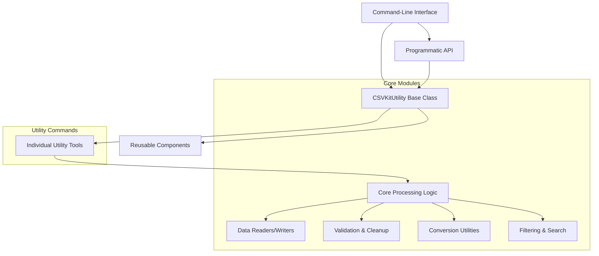

# `csvkit`

## Repository Overview

### Tree Structure
```
csvkit/
├── convert/          # Data format conversion utilities
│   ├── __init__.py
│   ├── fixed.py      # Fixed-width to CSV conversion
│   └── geojs.py      # GeoJSON to CSV conversion
├── utilities/        # Command-line CSV processing tools
│   ├── csvclean.py   # Clean malformed CSV data
│   ├── csvcut.py     # Select columns from CSV
│   ├── csvformat.py  # Convert CSV format
│   ├── csvgrep.py    # Filter CSV rows by pattern
│   ├── csvjoin.py    # Join CSV files
│   ├── csvjson.py    # Convert CSV to JSON
│   ├── csvlook.py    # Pretty-print CSV data
│   ├── csvpy.py      # Execute Python code on CSV data
│   ├── csvsort.py    # Sort CSV data
│   ├── csvsql.py     # Convert CSV to SQL
│   ├── csvstack.py   # Stack CSV files vertically
│   ├── csvstat.py    # Compute statistics on CSV data
│   ├── in2csv.py     # Convert various formats to CSV
│   └── sql2csv.py    # Convert SQL query results to CSV
├── cleanup.py        # CSV data validation and repair
├── cli.py            # Command-line interface infrastructure
├── exceptions.py     # Custom exception types
└── grep.py           # Pattern-based CSV filtering
```

### Purpose
csvkit is a comprehensive toolkit for CSV data manipulation and processing. It addresses the need for efficient, reliable tools to handle CSV files in both command-line and programmatic contexts. The repository provides solutions for common CSV challenges including data cleaning, format conversion, filtering, joining, and statistical analysis.

Target users include data analysts, scientists, developers, and system administrators who work with CSV data regularly. The toolkit is particularly valuable for batch processing large datasets, data integration tasks, and building automated data pipelines.

In the broader ecosystem, csvkit serves as a standalone command-line utility suite and a Python library that can be integrated into larger data processing applications. It complements other data science tools by providing focused, high-quality CSV handling capabilities.

### Architecture


Key architectural patterns include:
- **Pipeline Pattern**: Data flows through a series of processing stages
- **Base Class Inheritance**: Common functionality centralized in CSVKitUtility
- **Decorator Pattern**: Filtering and validation wrapped around readers
- **Factory Pattern**: Dynamic creation of readers and writers based on input

### Entry Points
**CLI Commands:**
- `csvclean`: Cleans malformed CSV data (target audience: data quality engineers)
- `csvcut`: Selects specific columns (target audience: data analysts)
- `csvgrep`: Filters rows by pattern matching (target audience: data scientists)
- `csvjoin`: Joins multiple CSV files (target audience: database administrators)
- `csvjson`: Converts CSV to JSON format (target audience: web developers)
- `csvstat`: Computes statistics on CSV data (target audience: statisticians)

**Importable APIs:**
- `csvkit.convert.fixed2csv()`: Programmatic fixed-width to CSV conversion
- `csvkit.convert.geojson2csv()`: Programmatic GeoJSON to CSV conversion
- `csvkit.grep.FilteringCSVReader`: Pattern-based CSV filtering
- `csvkit.cleanup.RowChecker`: CSV data validation and repair

### Core Features
1. **Data Cleaning**: `csvclean` and `RowChecker` validate and repair malformed CSV data
2. **Format Conversion**: `in2csv` and specialized converters (`fixed2csv`, `geojson2csv`) transform various formats to CSV
3. **Data Filtering**: `csvgrep` and `FilteringCSVReader` enable pattern-based row selection
4. **Data Manipulation**: `csvcut`, `csvsort`, `csvstack` provide core data transformation capabilities
5. **Data Analysis**: `csvstat` computes descriptive statistics on CSV datasets
6. **Data Export**: `csvjson`, `csvsql` convert CSV to alternative data formats

### Dependencies
- Standard library modules: `csv`, `json`, `argparse`, `gzip`, `bz2`, `lzma`
- Internal dependencies: `agate.csv` for CSV writing operations, `csvkit.arguments` for argument parsing
- No external dependencies beyond Python standard library

### Configuration
Configuration primarily happens through command-line arguments and environment variables. The system supports:
- File compression detection (gzip, bz2, lzma)
- CSV dialect specification (delimiter, quote character, etc.)
- Output formatting options
- Error handling strategies

### Extension Points
The system supports extension through:
- Subclassing `CSVKitUtility` to create new command-line tools
- Implementing custom pattern functions for `FilteringCSVReader`
- Adding new conversion routines to the `convert/` module
- Creating plugins that register new argument parsers or processing steps

---

## Modules

- [`csvkit`](csvkit.md)
- [`csvkit/convert`](csvkit/convert.md)
- [`csvkit/utilities`](csvkit/utilities.md)

