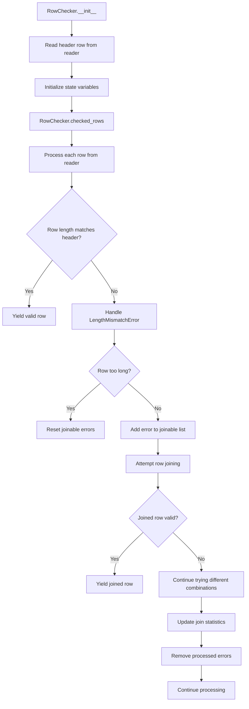

# `cleanup.py`

## `csvkit.cleanup.join_rows` · *function*

## Summary:
Joins multiple rows into a single row by concatenating fields from subsequent rows to the last field of the previous row.

## Description:
This function takes an iterable of rows and combines them into a single row by appending fields from subsequent rows to the last field of the previous row. It's designed to handle multi-line CSV records that have been split across multiple rows due to line breaks within quoted fields.

## Args:
    rows (iterable): An iterable of row lists to be joined together.
    joiner (str): String used to join fields from different rows. Defaults to a single space (' ').

## Returns:
    list: A single joined row containing all fields from the input rows.

## Raises:
    None explicitly raised.

## Constraints:
    - Preconditions: The input rows must be iterable and contain at least one row.
    - Postconditions: The returned row will contain all fields from the input rows, with fields from subsequent rows appended to the last field of the previous row.

## Side Effects:
    None.

## Control Flow:
```mermaid
flowchart TD
    A[Start join_rows] --> B[Convert rows to list]
    B --> C[Initialize fixed_row with first row]
    C --> D[For each remaining row in rows]
    D --> E{Is row empty?}
    E -->|Yes| F[Set row to ['']]
    E -->|No| G[Continue processing]
    F --> G
    G --> H[Append joiner + first field of row to last field of fixed_row]
    H --> I[Extend fixed_row with remaining fields of row]
    I --> J[Continue to next row or return]
    J --> D
    D --> K[Return fixed_row]
```

## Examples:
    >>> join_rows([['a', 'b'], ['c', 'd']])
    ['a', 'b c', 'd']
    
    >>> join_rows([['a', 'b'], [], ['c', 'd']])
    ['a', 'b ', 'c', 'd']
    
    >>> join_rows([['a', 'b'], ['c', 'd']], joiner='|')
    ['a', 'b|c', 'd']
    
    >>> join_rows([['single']])
    ['single']

## `csvkit.cleanup.RowChecker` · *class*

## Summary:
A class that validates CSV rows for column count consistency and attempts to join rows with mismatched column counts to form complete records.

## Description:
The RowChecker class processes CSV data from a reader object, validating that each row contains the expected number of columns based on the header row. When column count mismatches are detected, it attempts to join adjacent rows to reconstruct complete records. This class is particularly useful for handling CSV files where records may span multiple lines due to embedded line breaks in quoted fields.

## State:
- reader: A CSV reader object providing sequential access to CSV data
- column_names: A list containing the header row values, or an empty list if no header exists
- errors: A list of CSVTestException objects collected during row validation
- rows_joined: An integer counting total rows that were successfully joined to form complete records
- joins: An integer counting successful join operations performed

## Lifecycle:
- Creation: Instantiate with a CSV reader object; automatically reads the header row if present
- Usage: Call checked_rows() method to iterate over validated and potentially joined rows
- Destruction: No explicit cleanup required; relies on Python's garbage collection

## Method Map:


## Raises:
- StopIteration: Raised internally when the reader is exhausted during header reading, resulting in an empty column_names list

## Example:
```python
import csv
from csvkit.cleanup import RowChecker

# Create a CSV reader
csv_data = [['name', 'age'], ['Alice', '25'], ['Bob', '30', 'extra']]
reader = csv.reader(csv_data)

# Initialize RowChecker
checker = RowChecker(reader)

# Process rows with validation and potential joining
for row in checker.checked_rows():
    print(row)

# Access collected errors and join statistics
print(f"Errors: {len(checker.errors)}")
print(f"Rows joined: {checker.rows_joined}")
```

### `csvkit.cleanup.RowChecker.__init__` · *method*

## Summary:
Initializes a RowChecker instance by reading column names from a CSV reader and setting up tracking attributes for row processing.

## Description:
The RowChecker.__init__ method serves as the constructor for the RowChecker class, responsible for initializing the object's state by extracting column names from the provided CSV reader and establishing tracking variables for subsequent row validation and processing operations. This method ensures proper initialization regardless of whether the CSV contains header rows, handling the case where the reader is empty by setting column_names to an empty list.

## Args:
    reader: A CSV reader object that provides sequential access to CSV data rows

## Returns:
    None

## Raises:
    None

## State Changes:
    Attributes READ: None
    Attributes WRITTEN: 
    - self.reader: Assigned the input reader parameter
    - self.column_names: Set to the first row from reader or empty list if reader is empty
    - self.errors: Initialized as an empty list
    - self.rows_joined: Initialized to 0
    - self.joins: Initialized to 0

## Constraints:
    Preconditions:
    - The reader parameter must be a valid iterator that yields rows of CSV data
    - The reader should support the next() protocol
    
    Postconditions:
    - self.reader is assigned the input reader parameter
    - self.column_names contains either the first row from the reader or an empty list
    - All tracking attributes (errors, rows_joined, joins) are initialized to their default values

## Side Effects:
    None

### `csvkit.cleanup.RowChecker.checked_rows` · *method*

## Summary:
Generates validated CSV rows while attempting to fix length-mismatched rows by joining them with subsequent rows.

## Description:
Processes CSV rows from a reader, validating each row's length against the expected column count. When a row has a mismatched length, it attempts to join it with subsequent rows to create a properly formatted row. This method handles multi-line CSV records that have been split across multiple rows due to line breaks within quoted fields. The method maintains a buffer of joinable row errors and tries to progressively join them until a valid row is formed.

## Args:
    None

## Returns:
    Generator yielding list[str]: Validated CSV rows with proper field counts, potentially including joined rows.

## Raises:
    LengthMismatchError: When a row has a different number of fields than expected.
    CSVTestException: When other CSV validation errors occur.

## State Changes:
    Attributes READ: self.column_names, self.reader, self.errors
    Attributes WRITTEN: self.rows_joined, self.joins, self.errors

## Constraints:
    Preconditions: The RowChecker instance must have been initialized with a valid CSV reader and column names.
    Postconditions: All yielded rows will have the correct number of fields matching self.column_names.

## Side Effects:
    Mutates self.errors by appending new error instances.
    Mutates self.rows_joined and self.joins when successfully joining rows.
    Reads from the underlying CSV reader.

