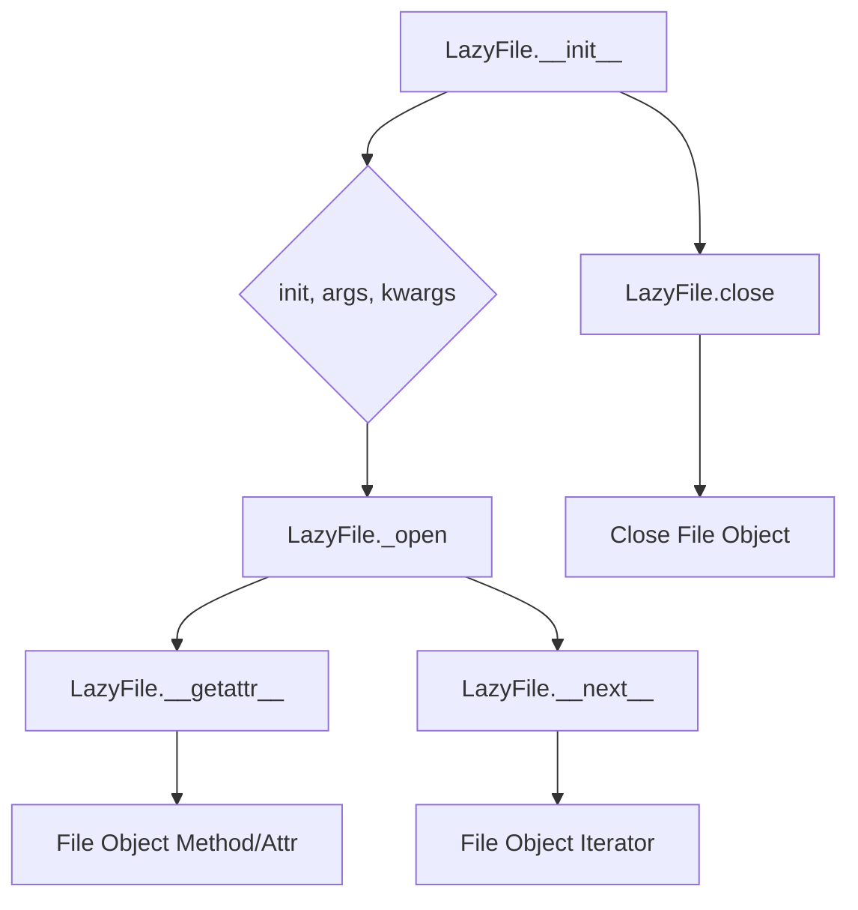
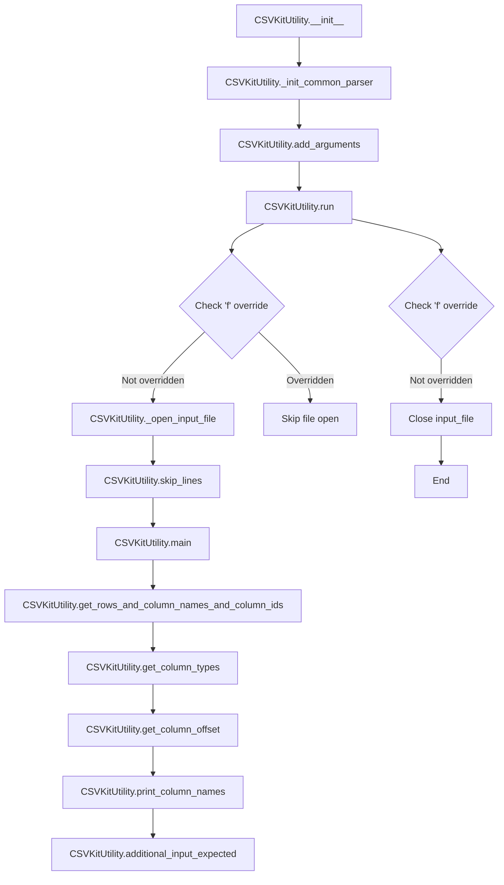

# `cli.py`

## `csvkit.cli.LazyFile` · *class*

## Summary:
A lazy file wrapper that delays file opening until the first access to the file object's attributes or methods.

## Description:
The LazyFile class serves as a proxy for file-like objects, deferring the actual file opening operation until the first time a method or attribute is accessed. This pattern is useful for avoiding unnecessary file I/O operations when a file might not be used, or when the file handle needs to be opened with specific parameters that are only known at access time. It is commonly used in command-line tools where file arguments might be stdin, a regular file, or compressed files, and the actual file opening should happen only when needed.

## State:
- init: callable, the constructor function used to create the underlying file object (e.g., open, gzip.open, bz2.open)
- f: file-like object or None, the actual file object once opened, initially None
- _is_lazy_opened: bool, indicates whether the file has been opened yet, starts as False
- _lazy_args: tuple, positional arguments passed to init when opening the file
- _lazy_kwargs: dict, keyword arguments passed to init when opening the file

## Lifecycle:
- Creation: Instantiate with a callable init and optional arguments (e.g., LazyFile(open, 'file.txt', 'r'))
- Usage: Access methods or attributes via __getattr__, which triggers the lazy opening. Iteration uses __next__ which also opens the file if not already opened.
- Destruction: Call close() to explicitly close the file and reset the internal state, or rely on garbage collection which will not properly close the file.

## Method Map:


## Raises:
- Any exceptions raised by the init callable during file opening are propagated through to the caller.

## Example:
```python
# Create a lazy file for a gzipped CSV file
lazy_file = LazyFile(gzip.open, 'data.csv.gz', 'rt')

# File is not opened yet
# Accessing a method triggers opening
content = lazy_file.read()  # Opens the file and reads content

# Or iterate over lines
for line in lazy_file:
    print(line.strip())
```

### `csvkit.cli.LazyFile.__init__` · *method*

## Summary:
Initializes a LazyFile instance with initialization parameters and lazy loading configuration.

## Description:
The `__init__` method sets up the internal state of a LazyFile object, preparing it for deferred file opening. It stores the initialization arguments and initializes flags indicating that the file has not yet been opened. This method is part of the LazyFile class which provides lazy loading capabilities for file operations.

## Args:
    init (Any): The initial value used to configure the file handling, typically a file path or file-like object.
    *args (tuple): Additional positional arguments passed to the underlying file opening mechanism.
    **kwargs (dict): Additional keyword arguments passed to the underlying file opening mechanism.

## Returns:
    None: This method does not return a value.

## Raises:
    None: This method does not explicitly raise exceptions.

## State Changes:
    Attributes READ: None
    Attributes WRITTEN: 
    - self.init: Stores the initialization parameter
    - self.f: Initializes to None, indicating no file handle is currently open
    - self._is_lazy_opened: Initializes to False, indicating the file has not been lazily opened yet
    - self._lazy_args: Stores additional positional arguments for lazy opening
    - self._lazy_kwargs: Stores additional keyword arguments for lazy opening

## Constraints:
    Preconditions: None
    Postconditions: 
    - self.init is set to the provided init parameter
    - self.f is initialized to None
    - self._is_lazy_opened is initialized to False
    - self._lazy_args contains all additional positional arguments
    - self._lazy_kwargs contains all additional keyword arguments

## Side Effects:
    None: This method performs no I/O operations or external service calls.

### `csvkit.cli.LazyFile.__getattr__` · *method*

## Summary:
Delegates attribute access to an underlying file object after ensuring it is lazily opened.

## Description:
This method implements Python's `__getattr__` protocol to enable lazy loading of a file resource. When an attribute is accessed on a `LazyFile` instance that isn't defined locally, this method is invoked. It ensures the underlying file object is opened via `_open()` and then delegates the attribute access to that file object.

This approach allows the `LazyFile` wrapper to behave transparently as a file-like object while deferring actual file opening until the first attribute access. This pattern is particularly useful for handling compressed files or other resources that should only be opened when needed.

## Args:
    name (str): The name of the attribute being accessed.

## Returns:
    Any: The value of the requested attribute from the underlying file object.

## Raises:
    AttributeError: If the underlying file object does not have the requested attribute.

## State Changes:
    Attributes READ: self._is_lazy_opened, self.f, self.init, self._lazy_args, self._lazy_kwargs
    Attributes WRITTEN: self.f, self._is_lazy_opened

## Constraints:
    Preconditions: The `LazyFile` instance must have been initialized with valid arguments for the file constructor.
    Postconditions: The underlying file object is opened and available for attribute access.

## Side Effects:
    I/O: Opens the file resource if it hasn't been opened yet.
    External service calls: None.
    Mutations to objects outside self: None.

### `csvkit.cli.LazyFile.__iter__` · *method*

## Summary:
Returns the LazyFile instance itself, enabling it to function as an iterator that lazily opens and reads files.

## Description:
This method implements the iterator protocol by returning the LazyFile instance, allowing it to be used in for-loops and other iteration contexts. When iterated, the LazyFile will lazily open the underlying file handle only when the first item is requested. This approach defers resource allocation until necessary, improving performance for large files or when iteration may not occur.

The LazyFile class implements both `__iter__` and `__next__` methods to create a proper iterator. When `__iter__` is called, it simply returns `self`, making the instance iterable. The actual iteration happens in `__next__`, which calls `_open()` to ensure the file is opened before reading the next line.

## Args:
    None

## Returns:
    LazyFile: The LazyFile instance itself, making it iterable.

## Raises:
    Exception: Any exceptions that may occur during file iteration (e.g., IOError, UnicodeDecodeError) when the underlying file is accessed.

## State Changes:
    Attributes READ: self._is_lazy_opened, self.init, self._lazy_args, self._lazy_kwargs
    Attributes WRITTEN: None

## Constraints:
    Preconditions: The LazyFile instance must be properly initialized with an init function and arguments.
    Postconditions: The instance remains in a state where it can be iterated over, with lazy opening behavior preserved.

## Side Effects:
    I/O operations: The underlying file is opened and read when iteration begins, potentially causing disk I/O or network latency.
    External service calls: None
    Mutations to objects outside self: None

### `csvkit.cli.LazyFile.close` · *method*

## Summary:
Closes a lazily opened file handle and resets the internal state to indicate the file is no longer open.

## Description:
This method is part of the LazyFile class and ensures that when a LazyFile instance has a file handle that was lazily opened, it properly closes the underlying file and resets internal tracking flags. It is typically called during resource cleanup operations or when transitioning away from file operations. The method only performs the close operation if the file was previously opened lazily, preventing errors when attempting to close an already-closed file.

## Args:
    None

## Returns:
    None

## Raises:
    AttributeError: If the underlying file handle does not have a close() method or if self.f is None when attempting to close.

## State Changes:
    Attributes READ: self._is_lazy_opened, self.f
    Attributes WRITTEN: self.f, self._is_lazy_opened

## Constraints:
    Preconditions: The method assumes that if self._is_lazy_opened is True, then self.f is a valid file-like object with a close() method.
    Postconditions: After execution, self.f will be None and self._is_lazy_opened will be False, indicating the file is closed and not lazily opened.

## Side Effects:
    I/O: Performs a close operation on the underlying file handle, which may flush buffered data and release system resources.

### `csvkit.cli.LazyFile.__next__` · *method*

## Summary:
Returns the next line from a lazily opened file handle, with null bytes removed.

## Description:
This method implements the iterator protocol for the LazyFile class, enabling it to be used in for-loops and other iteration contexts. It ensures the underlying file handle is opened before retrieving the next line, then strips null characters ('\0') from the returned line. This method is automatically called during iteration and should not be invoked directly.

## Args:
    None

## Returns:
    str: The next line from the file handle with null bytes replaced by empty strings. When the end of file is reached, StopIteration is raised.

## Raises:
    StopIteration: Raised when the end of the file is reached, indicating no more lines are available.
    Exception: Any exceptions that may be raised by the underlying file handle's __next__ method or file operations.

## State Changes:
    Attributes READ: self.f, self._is_lazy_opened
    Attributes WRITTEN: self.f, self._is_lazy_opened (via self._open())

## Constraints:
    Preconditions: The LazyFile instance must have a valid init callable and appropriate arguments set during initialization.
    Postconditions: The underlying file handle is guaranteed to be opened and accessible.

## Side Effects:
    I/O: Opens the underlying file handle if not already opened.
    Mutation: Modifies internal state variables _is_lazy_opened and f when opening the file.

### `csvkit.cli.LazyFile._open` · *method*

## Summary:
Initializes and opens a lazy file handle by calling the initialization function with stored arguments and keyword arguments.

## Description:
This method implements lazy opening of a file-like object. It is called automatically when accessing attributes or methods of the LazyFile instance, ensuring that the underlying file is only opened when actually needed. This approach helps optimize resource usage and handles cases where the file might not be accessed at all.

## Args:
    None

## Returns:
    None

## Raises:
    Exception: Any exception that may be raised by the initialization function (`self.init`) when called with `*self._lazy_args` and `**self._lazy_kwargs`.

## State Changes:
    Attributes READ: self._is_lazy_opened, self.init, self._lazy_args, self._lazy_kwargs
    Attributes WRITTEN: self.f, self._is_lazy_opened

## Constraints:
    Preconditions: The LazyFile instance must have been initialized with a valid initialization function (`self.init`) and appropriate arguments (`self._lazy_args`, `self._lazy_kwargs`).
    Postconditions: After execution, if the file was not previously opened, `self.f` will reference the opened file object and `self._is_lazy_opened` will be set to True.

## Side Effects:
    I/O operations: Opens a file or other resource via the initialization function.
    Mutations: Modifies the internal state of the LazyFile instance by setting `self.f` and `self._is_lazy_opened`.

## `csvkit.cli.CSVKitUtility` · *class*

## Summary:
CSVKitUtility is a base class for CSV processing command-line utilities that provides common argument parsing, file handling, and data processing infrastructure.

## Description:
CSVKitUtility serves as the foundation for all CSV command-line tools in the csvkit suite. It encapsulates common functionality such as argument parsing with argparse, input file handling (including support for compressed files), CSV reader/writer configuration, and exception handling. Subclasses must implement the abstract `add_arguments` and `main` methods to define their specific functionality. The class follows a standard execution pattern where `run()` orchestrates the workflow, handling file opening/closing and calling `main()` for the actual processing logic.

## State:
- description (str): Class-level attribute for setting the parser's description
- epilog (str): Class-level attribute for setting the parser's epilog  
- override_flags (str): Class-level attribute specifying which command-line flags to disable
- argparser (argparse.ArgumentParser): Parser instance configured with common CSV arguments
- args (argparse.Namespace): Parsed command-line arguments
- output_file (file-like object): Output stream for writing results (defaults to sys.stdout)
- reader_kwargs (dict): Configuration parameters for CSV readers
- writer_kwargs (dict): Configuration parameters for CSV writers
- input_file (file-like object): Input stream for reading CSV data (set during run())

## Lifecycle:
- Creation: Instantiate with optional args list and output_file parameter
- Usage: Call run() method which orchestrates the complete execution flow:
  1. Initialize argument parser and parse arguments
  2. Open input file if needed (unless 'f' flag is overridden)
  3. Execute main() method with proper warning handling
  4. Close input file if needed (unless 'f' flag is overridden)
- Destruction: Automatic cleanup of file handles occurs in the run() method's finally block

## Method Map:


## Raises:
- NotImplementedError: Raised by add_arguments() and main() if not overridden by subclasses
- ValueError: Raised by skip_lines() when skip_lines argument is not an integer
- RequiredHeaderError: Raised by print_column_names() when --no-header-row is used with -n/--names

## Example:
```python
# Basic instantiation and execution
utility = CSVKitUtility(['--delimiter', ',', 'data.csv'])
utility.run()

# Custom output file
with open('output.csv', 'w') as f:
    utility = CSVKitUtility(output_file=f)
    utility.run()
```

### `csvkit.cli.CSVKitUtility.__init__` · *method*

## Summary:
Initializes a CSVKit utility instance by setting up argument parsing, configuring reader/writer parameters, and installing exception handling.

## Description:
This method serves as the constructor for CSVKit utility classes, orchestrating the initialization of command-line argument parsing, configuration of CSV reader and writer parameters, and setup of error handling mechanisms. It is called during object instantiation to prepare the utility for processing CSV data according to user-provided arguments. The method follows a pattern where common arguments are initialized first, then subclass-specific arguments are added, and finally various configuration steps are performed.

## Args:
    args (list[str], optional): Command-line arguments to parse. Defaults to None, which uses sys.argv.
    output_file (file-like object, optional): File object to write output to. Defaults to None, which uses sys.stdout.

## Returns:
    None: This method initializes instance attributes but does not return a value.

## Raises:
    NotImplementedError: When called on the base CSVKitUtility class (add_arguments is abstract).
    argparse.ArgumentTypeError: When argument parsing fails due to invalid arguments.
    Exception: Various exceptions may be raised during file operations or signal handling.

## State Changes:
    Attributes READ: 
        - self.override_flags (used in _init_common_parser)
        - self.description (used in _init_common_parser)
        - self.epilog (used in _init_common_parser)
        - self.args (set during parsing)
        - self.args.tabs (used in _extract_csv_reader_kwargs)
        - self.args.delimiter (used in _extract_csv_reader_kwargs)
        - self.args.quotechar (used in _extract_csv_reader_kwargs)
        - self.args.quoting (used in _extract_csv_reader_kwargs)
        - self.args.doublequote (used in _extract_csv_reader_kwargs)
        - self.args.escapechar (used in _extract_csv_reader_kwargs)
        - self.args.field_size_limit (used in _extract_csv_reader_kwargs)
        - self.args.skipinitialspace (used in _extract_csv_reader_kwargs)
        - self.args.no_header_row (used in _extract_csv_reader_kwargs)
        - self.args.line_numbers (used in _extract_csv_writer_kwargs)
        - self.args.out_tabs (used in _extract_csv_writer_kwargs)
        - self.args.out_delimiter (used in _extract_csv_writer_kwargs)
        - self.args.out_quotechar (used in _extract_csv_writer_kwargs)
        - self.args.out_quoting (used in _extract_csv_writer_kwargs)
        - self.args.out_doublequote (used in _extract_csv_writer_kwargs)
        - self.args.out_escapechar (used in _extract_csv_writer_kwargs)
        - self.args.out_lineterminator (used in _extract_csv_writer_kwargs)
        - self.args.encoding (used in _open_input_file)
        - self.args.no_inference (used in get_column_types)
        - self.args.date_format (used in get_column_types)
        - self.args.datetime_format (used in get_column_types)
        - self.args.locale (used in get_column_types)
        - self.args.blanks (used in get_column_types)
        - self.args.null_values (used in get_column_types)
        - self.args.zero_based (used in get_column_offset)
        - self.args.skip_lines (used in skip_lines)
        - self.args.columns (used in get_rows_and_column_names_and_column_ids)
        - self.args.not_columns (used in get_rows_and_column_names_and_column_ids)
        - self.args.input_path (used in _open_input_file)
        - self.args.verbose (used in _install_exception_handler)

    Attributes WRITTEN:
        - self.argparser (initialized by _init_common_parser)
        - self.args (set by parsing arguments)
        - self.output_file (set based on input parameter)
        - self.reader_kwargs (set by _extract_csv_reader_kwargs)
        - self.writer_kwargs (set by _extract_csv_writer_kwargs)

## Constraints:
    Preconditions:
        - The class must inherit from CSVKitUtility
        - The class must implement add_arguments() method (subclass responsibility)
        - The class must implement main() method (subclass responsibility)
        - The class must define description, epilog, and override_flags class attributes
        - The class must have a _open_input_file method available

    Postconditions:
        - self.argparser is initialized with common arguments
        - self.args contains parsed command-line arguments
        - self.output_file is set to either stdout or the provided output_file
        - self.reader_kwargs and self.writer_kwargs are configured based on parsed arguments
        - Exception handler is installed
        - SIGPIPE signal handling is configured

## Side Effects:
    - Initializes argparse ArgumentParser instance
    - Sets up sys.excepthook for custom error handling
    - Configures signal handling for SIGPIPE
    - May modify global sys.stdin encoding if stdin is used

### `csvkit.cli.CSVKitUtility.add_arguments` · *method*

## Summary:
Adds command-line arguments specific to a CSVKit utility subclass to the argument parser.

## Description:
This method serves as an abstract interface that must be implemented by each subclass of CSVKitUtility to define the specific command-line arguments required for that utility. It is called during the initialization phase of CSVKitUtility instances, specifically within the __init__ method after common arguments are set up but before argument parsing occurs. The method raises NotImplementedError in the base class, enforcing that subclasses must provide their own implementation to register utility-specific arguments with the argument parser.

## Args:
    self: The CSVKitUtility instance being initialized.

## Returns:
    None: This method does not return a value but is expected to modify the argument parser by adding new arguments.

## Raises:
    NotImplementedError: Always raised in the base CSVKitUtility class, indicating that subclasses must implement this method.

## State Changes:
    Attributes READ: 
        - self.argparser (accessed to add arguments to it)

    Attributes WRITTEN:
        - self.argparser (modified by adding new arguments)

## Constraints:
    Preconditions:
        - Must be called on a subclass of CSVKitUtility that implements this method
        - The argument parser must be initialized (typically by _init_common_parser) before this method is called

    Postconditions:
        - The argument parser contains both common arguments and subclass-specific arguments
        - The argument parser is ready for parsing user-provided command-line arguments

## Side Effects:
    - Modifies the instance's argparser attribute by adding new arguments
    - No external I/O or service calls involved

### `csvkit.cli.CSVKitUtility.run` · *method*

## Summary:
Executes the CSVKit utility by managing input file lifecycle and invoking the core processing logic.

## Description:
This method orchestrates the execution of CSVKit command-line utilities. It handles the opening and closing of input files, manages warning suppression for specific agate behaviors, and delegates the core processing to the abstract `main()` method. The method ensures proper resource management by using a try/finally block to guarantee that input files are closed even if processing fails.

The `run()` method is the primary entry point for executing CSVKit utilities, coordinating the setup and teardown phases while providing a controlled execution environment for the specific utility logic. It is called by the command-line interface after argument parsing and before the utility's specific functionality is executed.

## Args:
    self: The instance of the CSVKitUtility subclass being executed.

## Returns:
    None: This method does not return a value.

## Raises:
    Any exceptions raised by the underlying `main()` method implementation or file operations.

## State Changes:
    Attributes READ: 
        - self.override_flags: Determines whether file handling should be skipped
        - self.args.input_path: Path to the input file
        - self.args.no_header_row: Flag indicating if input has no header row
        
    Attributes WRITTEN: 
        - self.input_file: Assigned when input file is opened

## Constraints:
    Preconditions:
        - The CSVKitUtility instance must be properly initialized with arguments and file handles
        - If 'f' is not in override_flags, self.args.input_path must be valid or None
        - The `main()` method must be implemented by subclasses
        - The `_open_input_file()` method must be available and functional
        
    Postconditions:
        - Input file is properly opened and closed
        - Warning filters are applied appropriately
        - The `main()` method is called exactly once
        - File resources are released regardless of success or failure
        - If 'f' is in override_flags, no file operations are performed

## Side Effects:
    - Opens and closes input file handles via `_open_input_file()` and `close()`
    - Suppresses specific warnings from the agate library using `warnings.catch_warnings()`
    - Calls the abstract `main()` method which may perform additional I/O or processing
    - May reconfigure sys.stdin encoding when handling stdin input

### `csvkit.cli.CSVKitUtility.main` · *method*

## Summary:
The main method serves as the abstract entry point for CSVKit utility implementations, defining the core processing logic that each subclass must implement.

## Description:
This abstract method represents the primary execution interface for all CSVKit command-line utilities. It is designed to be implemented by subclasses to define specific CSV processing behaviors. The method is invoked internally by the `run()` method after the CSVKitUtility instance has been properly initialized with command-line arguments, input/output streams, and CSV parsing parameters. This design enables a clean separation between the common infrastructure (argument parsing, file handling, error management) and the specific functionality of each utility.

The method is called within a controlled execution context managed by `run()`, which handles file opening/closing, warning suppression, and exception handling. Subclasses must implement this method to perform their specific CSV processing tasks.

## Args:
    self: The instance of the CSVKitUtility subclass implementing this method.

## Returns:
    This method is abstract and should not return anything directly. Its implementation in subclasses defines the actual return behavior.

## Raises:
    NotImplementedError: Always raised by the base implementation, indicating that subclasses must provide their own implementation.

## State Changes:
    Attributes READ: 
        - self.args: Command-line arguments parsed by the argument parser
        - self.input_file: Input file handle managed by the utility (accessed via run())
    
    Attributes WRITTEN: 
        - None (this is an abstract method)

## Constraints:
    Preconditions:
        - Must be called on a subclass instance that implements this method
        - The CSVKitUtility instance must have completed initialization and argument parsing
        - The input file must be properly opened by the calling `run()` method when applicable
        
    Postconditions:
        - The method should execute the specific functionality of the implementing utility
        - Any required input files should be properly opened and closed by the caller (`run()` method)
        - The method should not manage file handles directly, as this is handled by the parent class

## Side Effects:
    - None (the method itself doesn't perform I/O operations)
    - The calling `run()` method handles file opening/closing and I/O operations
    - Subclasses may perform their own side effects through their implementation

### `csvkit.cli.CSVKitUtility._init_common_parser` · *method*

## Summary:
Initializes a common argument parser for CSVKit command-line utilities with standard input/output and formatting options.

## Description:
This method constructs and configures a standard `argparse.ArgumentParser` instance that defines common command-line arguments used across various CSVKit utilities. It dynamically adds arguments based on override flags to allow customization of the parser for specific tools while maintaining consistency. The parser is stored in `self.argparser` for later use in argument parsing.

This method is typically called during the initialization phase of CSVKit utility classes to establish a standardized command-line interface. It provides a consistent user experience across different CSV processing commands while allowing individual tools to customize available options.

## Args:
    None

## Returns:
    None

## Raises:
    None

## State Changes:
    Attributes READ: self.description, self.epilog, self.override_flags
    Attributes WRITTEN: self.argparser

## Constraints:
    Preconditions: 
    - `self.description` must be set to provide the parser's description
    - `self.epilog` must be set to provide the parser's epilog text  
    - `self.override_flags` must be a collection of flag names (as strings) to exclude from the parser
    Postconditions: A configured `argparse.ArgumentParser` instance is assigned to `self.argparser`.

## Side Effects:
    None

### `csvkit.cli.CSVKitUtility._open_input_file` · *method*

## Summary:
Opens and returns a file handle for CSV input, handling stdin, compressed files, and regular files with appropriate encoding.

## Description:
This method provides a unified interface for opening CSV input files, supporting standard input ('-'), regular files, and compressed files (.gz, .bz2, .xz). It leverages the LazyFile wrapper to defer actual file opening until first access, improving performance and resource management. The method ensures proper encoding handling for text files and manages the stdin reconfiguration when needed.

## Args:
    path (str): Path to the input file, or '-' to indicate stdin
    opened (bool): Flag indicating if the file is already opened (default: False)

## Returns:
    file-like object: A file handle that can be used for reading CSV data, either sys.stdin or a LazyFile wrapper around an opened file

## Raises:
    Any exceptions raised by file opening operations (gzip.open, bz2.open, lzma.open, or open)

## State Changes:
    Attributes READ: self.args.encoding
    Attributes WRITTEN: None

## Constraints:
    Preconditions: 
    - self.args.encoding must be a valid encoding string
    - path must be a string or None
    - If opened=True, the caller must ensure stdin is properly configured
    
    Postconditions:
    - When path is '-' or None, returns sys.stdin with encoding configured
    - When path is a file path, returns a LazyFile wrapping the appropriate file opening function
    - The returned file handle is ready for reading text data

## Side Effects:
    - May reconfigure sys.stdin encoding when path is '-' and opened=False
    - Creates LazyFile wrapper which defers actual file opening
    - May open compressed files using gzip.open, bz2.open, or lzma.open

### `csvkit.cli.CSVKitUtility._extract_csv_reader_kwargs` · *method*

## Summary:
Extracts CSV reader configuration parameters from command-line arguments for use in CSV processing operations.

## Description:
This method processes the command-line arguments stored in `self.args` to construct a dictionary of keyword arguments suitable for configuring a CSV reader. It handles delimiter selection (tabs vs custom delimiter), quoting options, and header row settings based on user-provided flags. The method centralizes argument parsing logic for CSV reader instantiation, making the code more maintainable and reusable.

## Args:
    self: The CSVKitUtility instance containing command-line arguments in `self.args`.

## Returns:
    dict: A dictionary of keyword arguments for configuring CSV readers, including:
        - 'delimiter' (str): The character used to separate fields ('\t' for tabs, or custom delimiter)
        - 'quotechar' (str): The character used for quoting fields
        - 'quoting' (int): The quoting style to use
        - 'doublequote' (bool): Whether to interpret double quotes as escape characters
        - 'escapechar' (str): The character used to escape special characters
        - 'field_size_limit' (int): Maximum field size allowed
        - 'skipinitialspace' (bool): Whether to skip whitespace after delimiter
        - 'header' (bool): Whether the first row contains headers (negation of no_header_row flag)

## Raises:
    AttributeError: If any of the expected attributes are missing from self.args.

## State Changes:
    Attributes READ: 
        - self.args.tabs
        - self.args.delimiter
        - self.args.quotechar
        - self.args.quoting
        - self.args.doublequote
        - self.args.escapechar
        - self.args.field_size_limit
        - self.args.skipinitialspace
        - self.args.no_header_row

    Attributes WRITTEN: None

## Constraints:
    Preconditions:
        - self.args must be an object with the expected attributes (tabs, delimiter, quotechar, etc.)
        - All referenced attributes should be accessible via getattr()

    Postconditions:
        - Returns a dictionary with at most 7 keys (depending on argument values)
        - Keys are strings matching valid CSV reader parameter names
        - Values are properly extracted from self.args
        - The 'header' key is set to the negation of no_header_row flag value

## Side Effects:
    None

### `csvkit.cli.CSVKitUtility._extract_csv_writer_kwargs` · *method*

## Summary:
Extracts CSV writer keyword arguments from command-line arguments for line number insertion in CSV output.

## Description:
This method processes the command-line arguments stored in `self.args` to determine if line numbers should be included in the CSV output. It is part of the CSVKit utility framework's argument processing pipeline, specifically called during object initialization to populate `self.writer_kwargs`. This method extracts writer-specific configuration from the parsed arguments, currently supporting only the `--linenumbers` flag.

## Args:
    None

## Returns:
    dict: A dictionary containing CSV writer keyword arguments. When the `--linenumbers` command-line option is specified, returns `{'line_numbers': True}`; otherwise returns an empty dictionary.

## Raises:
    None explicitly raised

## State Changes:
    Attributes READ: self.args
    Attributes WRITTEN: None

## Constraints:
    Preconditions: 
    - self.args must be initialized (typically happens during CSVKitUtility.__init__)
    - The argparse argument parser must have been configured with the --linenumbers flag
    
    Postconditions:
    - Returns a dictionary suitable for passing to CSV writer constructors
    - The returned dictionary may be empty if no writer-specific flags are set

## Side Effects:
    None

### `csvkit.cli.CSVKitUtility._install_exception_handler` · *method*

## Summary:
Installs a custom exception handler that provides enhanced error reporting for CSV processing operations.

## Description:
Configures a global exception handler that intercepts unhandled exceptions during CSV processing. When verbose mode is enabled via the `-v` flag, it delegates to the default exception handler; otherwise, it provides user-friendly error messages, particularly for encoding issues. This method enhances the user experience by providing actionable feedback when CSV processing fails.

## Args:
    None

## Returns:
    None

## Raises:
    None

## State Changes:
    Attributes READ: self.args.encoding, self.args.verbose
    Attributes WRITTEN: sys.excepthook

## Constraints:
    Preconditions: The instance must have an args attribute containing encoding and verbose properties
    Postconditions: The global sys.excepthook is replaced with a custom handler function

## Side Effects:
    I/O: Writes formatted error messages to stderr
    Global state modification: Replaces sys.excepthook with custom handler function

### `csvkit.cli.CSVKitUtility.get_column_types` · *method*

*No documentation generated.*

### `csvkit.cli.CSVKitUtility.get_column_offset` · *method*

## Summary:
Returns the column offset value (0 or 1) based on the zero-based flag setting.

## Description:
This method determines whether column indexing should be zero-based or one-based by checking the `zero_based` attribute of the parsed arguments. It is used throughout the CSV processing pipeline to ensure consistent column reference handling.

## Args:
    None

## Returns:
    int: 0 if zero-based column numbering is enabled, 1 otherwise.

## Raises:
    None

## State Changes:
    Attributes READ: self.args.zero_based
    Attributes WRITTEN: None

## Constraints:
    Preconditions: The instance must have been initialized with parsed arguments containing the 'zero_based' attribute.
    Postconditions: The returned value is either 0 or 1, representing the appropriate column offset.

## Side Effects:
    None

### `csvkit.cli.CSVKitUtility.skip_lines` · *method*

## Summary:
Skips a specified number of initial lines from the input file and returns the file handle.

## Description:
This method advances the input file pointer by skipping the number of lines specified in the `skip_lines` argument. It's designed to handle comment lines, copyright notices, or other non-data content that appears before the actual CSV header row. The method is typically called during CSV data preparation to ensure that only relevant data is processed.

This logic is encapsulated in its own method because it needs to be reused in multiple contexts (like `get_rows_and_column_names_and_column_ids` and `print_column_names`) and provides a clean abstraction for file pointer manipulation. It allows CSVKit utilities to handle files with preamble content without requiring each utility to implement this logic independently.

## Args:
    self: The instance of CSVKitUtility that owns this method.

## Returns:
    file-like object: The same input file handle, positioned after the skipped lines.

## Raises:
    ValueError: When the `skip_lines` argument is not an integer.

## State Changes:
    Attributes READ: self.args.skip_lines, self.input_file
    Attributes WRITTEN: self.args.skip_lines (decremented during execution)

## Constraints:
    Preconditions:
        - self.args.skip_lines must be an integer value
        - self.input_file must be a valid file-like object with a readline() method
        - The file pointer must be seekable or readable from the current position

    Postconditions:
        - The file pointer is advanced by exactly `skip_lines` lines
        - self.args.skip_lines is decremented to 0
        - The returned file handle is positioned at the start of the first data line

## Side Effects:
    - Performs line-by-line reading from self.input_file
    - Modifies the internal state of self.args.skip_lines
    - May cause file I/O operations depending on the underlying file implementation

### `csvkit.cli.CSVKitUtility.get_rows_and_column_names_and_column_ids` · *method*

## Summary:
Prepares CSV data for processing by reading rows, determining column names, and parsing column identifiers.

## Description:
This method serves as a central data preparation utility that standardizes how CSV data is accessed across different CSVKit utilities. It reads the header row (or creates default headers if no-header-row flag is set), skips initial lines as specified, and parses column selection parameters into zero-based column indices. The method handles various CSV configuration options including header presence, line skipping, and column selection.

## Args:
    **kwargs: Additional keyword arguments passed to the underlying CSV reader (e.g., line_numbers).

## Returns:
    tuple: A tuple containing:
        - rows (iterator): An iterator over CSV rows starting from the header row
        - column_names (list[str]): List of column names from the header row or generated default headers
        - column_ids (list[int]): Zero-based indices of selected columns based on command-line arguments

## Raises:
    ValueError: When skip_lines argument is not an integer
    ColumnIdentifierError: When column identifiers are invalid (from parse_column_identifiers)
    StopIteration: When CSV file is empty (handled internally)

## State Changes:
    Attributes READ:
        - self.args.no_header_row
        - self.args.columns
        - self.args.not_columns
        - self.args.zero_based
        - self.args.skip_lines
    Attributes WRITTEN:
        - self.args.skip_lines (decremented during skip_lines call)

## Constraints:
    Preconditions:
        - self.args must be initialized with valid arguments
        - self.input_file must be opened and accessible
        - self.skip_lines() must be callable and return a valid file-like object
        - parse_column_identifiers must be importable and functional
        - make_default_headers must be importable and functional

    Postconditions:
        - Returns a valid tuple of (rows, column_names, column_ids)
        - If input is empty, returns empty iterators/lists
        - column_ids contains valid zero-based indices within column_names bounds
        - column_names list is properly populated based on header/no-header settings
        - column_offset is correctly calculated based on zero-based flag

## Side Effects:
    - Reads from self.input_file
    - Modifies self.args.skip_lines during execution
    - May cause file I/O operations through skip_lines() and agate.csv.reader()
    - Calls external functions: parse_column_identifiers, make_default_headers

### `csvkit.cli.CSVKitUtility.print_column_names` · *method*

## Summary:
Prints column names from a CSV file with numbered indices to the output file.

## Description:
This method reads the first row of a CSV file (assumed to contain column headers) and prints each column name with a sequential number. It enforces that the --no-header-row option cannot be used with this functionality, and handles both 1-based and 0-based numbering schemes.

## Args:
    None

## Returns:
    None

## Raises:
    RequiredHeaderError: When the --no-header-row command-line argument is used in combination with the -n or --names options.

## State Changes:
    Attributes READ: self.args, self.output_file, self.reader_kwargs
    Attributes WRITTEN: None

## Constraints:
    Preconditions:
        - The CSV file must have a header row (unless --no-header-row is False)
        - The self.args object must have 'no_header_row' and 'zero_based' attributes
        - The self.output_file must be writable
        - The self.reader_kwargs must be properly initialized

    Postconditions:
        - Column names are written to self.output_file in the format "XXX: column_name"
        - The numbering starts at either 0 or 1 based on the --zero flag
        - The method does not modify any internal state beyond writing to output

## Side Effects:
    I/O: Writes formatted column information to self.output_file
    External service calls: None
    Mutations to objects outside self: None

### `csvkit.cli.CSVKitUtility.additional_input_expected` · *method*

## Summary:
Determines whether additional input is expected from stdin based on terminal connection status and input path availability.

## Description:
This method evaluates whether the application should expect additional input from standard input by checking if stdin is connected to a terminal (TTY) and no input file path was provided. This logic is crucial for determining proper input handling behavior in command-line utilities that support both piped input and file input.

## Args:
    self: The instance of CSVKitUtility class

## Returns:
    bool: True if stdin is connected to a terminal AND no input path was specified, False otherwise

## Raises:
    None explicitly raised

## State Changes:
    Attributes READ: 
        - self.args.input_path
    Attributes WRITTEN: None

## Constraints:
    Preconditions:
        - self.args must be initialized and contain an input_path attribute
        - sys.stdin must be available and accessible
    
    Postconditions:
        - The method returns a boolean value indicating input expectation
        - No changes are made to the object's state

## Side Effects:
    None

## `csvkit.cli.isatty` · *function*

## Summary:
Determines whether a file-like object is connected to a terminal device (TTY).

## Description:
Checks if the provided file-like object is associated with a terminal interface. This function safely handles the case where a file might be closed, catching ValueError exceptions that would normally occur when calling isatty() on closed files. It is commonly used in command-line tools to determine appropriate output formatting based on whether output is being directed to a terminal or to a file.

## Args:
    f (file-like object): A file-like object that supports the isatty() method.

## Returns:
    bool: True if the file is connected to a TTY device, False otherwise. Returns False if the file is closed or if isatty() raises a ValueError.

## Raises:
    None explicitly raised, but may propagate ValueError from underlying isatty() call if not handled by the try-except block.

## Constraints:
    Preconditions:
        - The argument `f` must be a file-like object that implements the `isatty()` method.
        - The file object should be opened and accessible.
    
    Postconditions:
        - The function will always return a boolean value.
        - No modifications are made to the file object or its state.

## Side Effects:
    None

## Control Flow:
```mermaid
flowchart TD
    A[Start isatty(f)] --> B[Try f.isatty()]
    B --> C{isatty() succeeds?}
    C -- Yes --> D[Return True]
    C -- No --> E[Catch ValueError]
    E --> F[Return False]
```

## Examples:
    >>> import sys
    >>> isatty(sys.stdout)
    True
    >>> f = open('test.txt', 'w')
    >>> isatty(f)
    False
    >>> f.close()
    >>> isatty(f)
    False
```

## `csvkit.cli.default_str_decimal` · *function*

## Summary:
Converts datetime and Decimal objects to JSON-serializable formats, raising TypeError for unsupported types.

## Description:
This function serves as a custom serializer for JSON encoding, specifically handling datetime and Decimal objects that are not natively JSON serializable. It is designed to be used as the `default` parameter in `json.dumps()` calls to ensure proper serialization of these special data types.

## Args:
    obj (Any): The object to serialize. Expected to be either a datetime.date, datetime.datetime, or decimal.Decimal instance.

## Returns:
    str: For datetime objects, returns ISO format string representation. For Decimal objects, returns string representation. 

## Raises:
    TypeError: When the input object is not a datetime.date, datetime.datetime, or decimal.Decimal instance.

## Constraints:
    Precondition: The input object must be one of the supported types (datetime.date, datetime.datetime, or decimal.Decimal).
    Postcondition: If successful, returns a JSON-serializable string representation of the input object.

## Side Effects:
    None

## Control Flow:
```mermaid
flowchart TD
    A[default_str_decimal] --> B{isinstance(obj, datetime.date<br/>or datetime.datetime)}
    B -- Yes --> C[obj.isoformat()]
    B -- No --> D{isinstance(obj, decimal.Decimal)}
    D -- Yes --> E[str(obj)]
    D -- No --> F[raise TypeError]
```

## Examples:
```python
import json
import datetime
import decimal

# Valid usage
dt = datetime.datetime(2023, 1, 1, 12, 0, 0)
result = default_str_decimal(dt)
# Returns: '2023-01-01T12:00:00'

dec = decimal.Decimal('123.45')
result = default_str_decimal(dec)
# Returns: '123.45'

# Invalid usage
try:
    default_str_decimal([1, 2, 3])
except TypeError as e:
    print(e)
    # Prints: '[1, 2, 3] is not JSON serializable'
```

## `csvkit.cli.default_float_decimal` · *function*

## Summary:
Converts decimal.Decimal objects to float, or delegates to default_str_decimal for other types.

## Description:
This function acts as a type conversion utility that specifically handles decimal.Decimal objects by converting them to Python floats. For all other object types, it delegates the serialization logic to default_str_decimal, which handles datetime and Decimal objects in a unified manner. This function is part of the CSV processing pipeline's data serialization strategy.

## Args:
    obj (Any): The object to convert. Can be any type, but specifically handles decimal.Decimal instances.

## Returns:
    float or Any: If the input is a decimal.Decimal, returns a float representation. Otherwise, returns the result from default_str_decimal(obj).

## Raises:
    TypeError: When default_str_decimal raises TypeError for unsupported object types.

## Constraints:
    Precondition: The input object can be of any type, but must be compatible with default_str_decimal's expectations.
    Postcondition: If input is a decimal.Decimal, output is guaranteed to be a float; otherwise, output follows default_str_decimal's behavior.

## Side Effects:
    None

## Control Flow:
```mermaid
flowchart TD
    A[default_float_decimal] --> B{isinstance(obj, decimal.Decimal)}
    B -- Yes --> C[return float(obj)]
    B -- No --> D[return default_str_decimal(obj)]
```

## Examples:
```python
import decimal

# Convert Decimal to float
dec = decimal.Decimal('123.45')
result = default_float_decimal(dec)
# Returns: 123.45 (float)

# Delegate to default_str_decimal for other types
import datetime
dt = datetime.datetime(2023, 1, 1)
result = default_float_decimal(dt)
# Returns: '2023-01-01T00:00:00' (string from default_str_decimal)
```

## `csvkit.cli.make_default_headers` · *function*

*No documentation generated.*

## `csvkit.cli.match_column_identifier` · *function*

## Summary:
Maps a column identifier (either a string name or integer index) to a zero-based array index for column access.

## Description:
This function serves as a utility for resolving user-provided column identifiers into zero-based indices that can be used to access columns in a dataset. It accepts either a column name (string) or a 1-based column number and normalizes it to a zero-based index. The function handles validation of column existence and proper indexing bounds.

## Args:
    column_names (list[str]): A list of column names available for selection.
    c (str or int): The column identifier, either a column name (string) or a 1-based column number (integer).
    column_offset (int): An offset applied to convert 1-based column numbers to zero-based indices. Defaults to 1.

## Returns:
    int: Zero-based index of the column in the column_names list.

## Raises:
    ColumnIdentifierError: Raised when the column identifier is invalid due to:
        - Not being an integer or column name
        - Being a negative integer (columns are 1-based)
        - Exceeding the maximum column count

## Constraints:
    Preconditions:
        - column_names must be a non-empty list of strings
        - c must be either a string that exists in column_names or an integer
        - column_offset must be a positive integer

    Postconditions:
        - Returns a valid zero-based index within [0, len(column_names))
        - All validation errors result in ColumnIdentifierError exceptions

## Side Effects:
    None

## Control Flow:
```mermaid
flowchart TD
    A[Input c] --> B{Is c a string?}
    B -- Yes --> C{Is c numeric?}
    C -- No --> D{Is c in column_names?}
    D -- Yes --> E[Return column_names.index(c)]
    D -- No --> F[Convert c to int]
    F --> G{Exception on conversion?}
    G -- Yes --> H[Raise ColumnIdentifierError]
    G -- No --> I{c < 0?}
    I -- Yes --> J[Raise ColumnIdentifierError]
    I -- No --> K{c >= len(column_names)?}
    K -- Yes --> L[Raise ColumnIdentifierError]
    K -- No --> M[Return c]
    C -- Yes --> N[Convert c to int]
    N --> O{Exception on conversion?}
    O -- Yes --> P[Raise ColumnIdentifierError]
    O -- No --> Q{c < 0?}
    Q -- Yes --> R[Raise ColumnIdentifierError]
    Q -- No --> S{c >= len(column_names)?}
    S -- Yes --> T[Raise ColumnIdentifierError]
    S -- No --> U[Return c]
```

## Examples:
    >>> match_column_identifier(['name', 'age', 'city'], 'age')
    1
    
    >>> match_column_identifier(['name', 'age', 'city'], 2)
    1
    
    >>> match_column_identifier(['name', 'age', 'city'], 4)
    ColumnIdentifierError: Column 4 is invalid. The last column is 'city' at index 2.

## `csvkit.cli.parse_column_identifiers` · *function*

## Summary:
Parses column identifiers from user input into zero-based integer indices, supporting both explicit column names and ranges.

## Description:
Resolves user-provided column identifiers (names or numbers) into zero-based indices for accessing columns in a dataset. Handles both inclusion and exclusion of columns through comma-separated lists and range syntax. This function centralizes column identifier parsing logic to avoid duplication across CLI tools while providing consistent error handling and range support.

## Args:
    ids (str, optional): Comma-separated column identifiers (names or numbers) to include. If None or empty, all columns are included.
    column_names (list[str]): List of available column names for identifier resolution.
    column_offset (int): Offset applied to convert 1-based column numbers to zero-based indices. Defaults to 1.
    excluded_columns (str, optional): Comma-separated column identifiers (names or numbers) to exclude from results.

## Returns:
    list[int]: Zero-based indices of selected columns, excluding any specified exclusions.

## Raises:
    ColumnIdentifierError: When column identifiers are invalid due to:
        - Non-existent column names
        - Invalid range syntax (non-numeric values)
        - Out-of-bounds column numbers
        - Malformed range specifications

## Constraints:
    Preconditions:
        - column_names must be a non-empty list of strings
        - column_offset must be a positive integer
        - ids and excluded_columns must be strings or None

    Postconditions:
        - Returns a list of unique zero-based indices
        - All returned indices are within [0, len(column_names))
        - Excluded columns are properly filtered out from results

## Side Effects:
    None

## Control Flow:
```mermaid
flowchart TD
    A[Start parse_column_identifiers] --> B{column_names empty?}
    B -- Yes --> C[Return empty list]
    B -- No --> D{ids and excluded_columns both None/empty?}
    D -- Yes --> E[Return range(len(column_names))]
    D -- No --> F{ids provided?}
    F -- Yes --> G[Process ids]
    F -- No --> H[Process all columns]
    G --> I{Each id valid?}
    I -- Yes --> J[Add to columns list]
    I -- No --> K{Contains range separator?}
    K -- Yes --> L[Parse range]
    K -- No --> M[Raise ColumnIdentifierError]
    L --> N[Validate range bounds]
    N --> O[Add range indices to columns]
    H --> P[Return range(len(column_names))]
    Q[Process excluded_columns] --> R{excluded_columns provided?}
    R -- Yes --> S[Process exclusions]
    R -- No --> T[Skip exclusion processing]
    S --> U{Each exclusion valid?}
    U -- Yes --> V[Add to excludes list]
    U -- No --> W{Contains range separator?}
    W -- Yes --> X[Parse range]
    W -- No --> Y[Raise ColumnIdentifierError]
    X --> Z[Validate range bounds]
    Z --> AA[Add range indices to excludes]
    AB[Filter excludes from columns] --> AC[Return filtered columns]
```

## Examples:
    >>> parse_column_identifiers('1,3', ['name', 'age', 'city'])
    [0, 2]
    
    >>> parse_column_identifiers('name,city', ['name', 'age', 'city'])
    [0, 2]
    
    >>> parse_column_identifiers('1:3', ['name', 'age', 'city'])
    [0, 1, 2]
    
    >>> parse_column_identifiers('1,3', ['name', 'age', 'city'], excluded_columns='2')
    [0, 2]
    
    >>> parse_column_identifiers(None, ['name', 'age', 'city'], excluded_columns='2')
    [0, 2]
```

