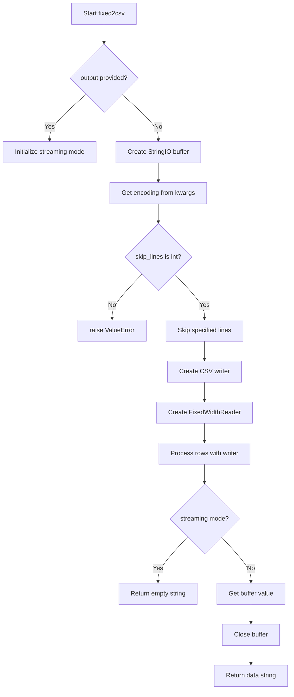
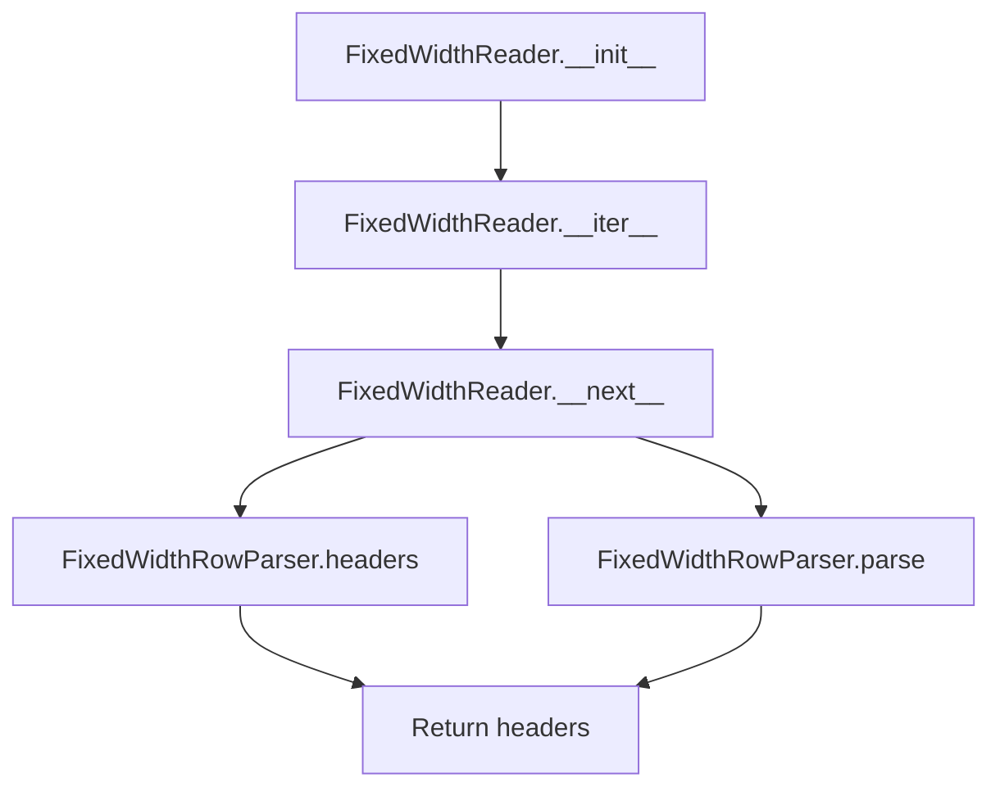

# `fixed.py`

## `csvkit.convert.fixed.fixed2csv` · *function*

## Summary:
Converts fixed-width formatted text data into CSV format using a provided schema.

## Description:
Transforms fixed-width formatted input data into comma-separated values format. This function serves as the primary interface for converting fixed-width files to CSV, handling both streaming and buffered output modes. It processes input files by skipping specified header lines, applying a schema-based parser, and writing results to either a provided output stream or a temporary buffer.

## Args:
    f (file-like object): Input file handle containing fixed-width formatted data
    schema (object): Schema definition specifying field positions and names for parsing
    output (file-like object, optional): Output stream for CSV data. If None, returns string data
    skip_lines (int): Number of initial lines to skip before processing data rows
    **kwargs: Additional keyword arguments, primarily for encoding specification

## Returns:
    str or None: CSV-formatted string data when output is None; empty string when output is provided

## Raises:
    ValueError: When skip_lines argument is not an integer type

## Constraints:
    Preconditions:
        - Input file handle must be readable
        - Schema must define valid field positions and names
        - skip_lines must be a non-negative integer
    Postconditions:
        - Input file position is advanced past skipped lines
        - Output contains properly formatted CSV data

## Side Effects:
    - Reads from input file handle
    - Writes to output stream or temporary buffer
    - May modify file handle position

## Control Flow:


## Examples:
```python
# Basic usage with automatic output buffering
with open('input.txt', 'r') as f:
    csv_data = fixed2csv(f, schema_definition)

# Streaming usage with explicit output
with open('input.txt', 'r') as f:
    with open('output.csv', 'w') as out:
        fixed2csv(f, schema_definition, output=out)
```

## `csvkit.convert.fixed.FixedWidthReader` · *class*

## Summary:
A class that reads and parses fixed-width formatted data files, yielding rows as lists of values while handling header rows appropriately.

## Description:
The FixedWidthReader class provides an iterator interface for processing fixed-width formatted text files. It is designed to work with a schema that defines the structure of each row, including field names, positions, and lengths. The reader handles the special case of header rows by returning them once during iteration, then proceeds to parse subsequent data rows according to the defined schema. This abstraction allows developers to iterate over fixed-width data seamlessly without manually managing the parsing logic or header handling.

## State:
- file: A file-like object containing the fixed-width formatted data
- parser: An instance of FixedWidthRowParser that handles the actual parsing logic based on the schema
- header: A boolean flag indicating whether the header row has been processed yet (starts as True)

## Lifecycle:
- Creation: Instantiate with a file handle, schema, and optional encoding parameter
- Usage: Iterate over the reader using a for-loop or next() calls
- Destruction: No explicit cleanup required; relies on Python's garbage collection

## Method Map:


## Raises:
- ValueError: Raised by FixedWidthRowParser when there are issues reading the schema definition

## Example:
```python
# Create a FixedWidthReader with a file and schema
with open('data.txt', 'r') as f:
    reader = FixedWidthReader(f, schema_file, encoding='utf-8')
    
    # Iterate through rows
    for row in reader:
        print(row)
```

### `csvkit.convert.fixed.FixedWidthReader.__init__` · *method*

## Summary:
Initializes a FixedWidthReader instance to process fixed-width formatted data files.

## Description:
This method sets up the reader by preparing the input file handle, creating a parser for fixed-width fields based on the provided schema, and initializing the header tracking flag. It handles optional character encoding conversion for the input file stream.

## Args:
    f (file-like object): The input file handle containing fixed-width formatted data.
    schema (file-like object): A schema file that defines the structure of fixed-width fields.
    encoding (str, optional): The character encoding of the input file. If provided, the file will be decoded accordingly.

## Returns:
    None: This method initializes instance attributes and does not return a value.

## Raises:
    ValueError: Raised when there is an error reading the schema file, particularly if a field definition is invalid.

## State Changes:
    Attributes READ: None
    Attributes WRITTEN: self.file, self.parser, self.header

## Constraints:
    Preconditions: 
    - The schema parameter must be a readable file-like object that contains valid field definitions.
    - The f parameter must be a readable file-like object containing fixed-width formatted data.
    - If encoding is provided, it must be a valid character encoding recognized by Python's codecs module.

    Postconditions:
    - self.file is assigned the input file handle (potentially wrapped with decoding if encoding was specified).
    - self.parser is initialized with the provided schema.
    - self.header is set to True, indicating that the first row should be treated as headers.

## Side Effects:
    - May perform character encoding decoding on the input file stream if an encoding is specified.
    - No external service calls or I/O operations beyond what's implied by the file handles.

### `csvkit.convert.fixed.FixedWidthReader.__iter__` · *method*

## Summary:
Returns the iterator object itself, enabling the FixedWidthReader to function as an iterator over fixed-width formatted data.

## Description:
This method implements the iterator protocol by returning `self`, allowing the `FixedWidthReader` instance to be used in for-loops and other iteration contexts. It enables the reader to process fixed-width formatted data line-by-line, yielding parsed rows one at a time. The actual iteration logic is implemented in the `__next__` method, which handles header processing and row parsing.

## Args:
    None

## Returns:
    FixedWidthReader: The iterator object itself (self), conforming to Python's iterator protocol.

## Raises:
    None

## State Changes:
    Attributes READ: self.parser, self.header, self.file
    Attributes WRITTEN: None

## Constraints:
    Preconditions: The `FixedWidthReader` must be properly initialized with a file handle, schema, and optional encoding.
    Postconditions: The reader is ready to be iterated over, with internal state set to begin from the first data row (after header if applicable).

## Side Effects:
    None

### `csvkit.convert.fixed.FixedWidthReader.__next__` · *method*

## Summary:
Returns the next row from a fixed-width formatted file, handling header processing and row parsing.

## Description:
This method implements the iterator protocol for the FixedWidthReader class, providing sequential access to rows in a fixed-width formatted file. It handles the special case of the header row by returning the parsed headers once, then switches to normal row parsing for subsequent calls. This separation of header handling from row parsing logic makes the reader's iteration behavior predictable and reusable.

## Args:
    None

## Returns:
    list: When called for the first time, returns the column headers as a list. On subsequent calls, returns a parsed row as a list of values according to the fixed-width schema.

## Raises:
    StopIteration: When the underlying file iterator is exhausted.

## State Changes:
    Attributes READ: self.header, self.parser, self.file
    Attributes WRITTEN: self.header (set to False after first call)

## Constraints:
    Preconditions: The FixedWidthReader instance must be properly initialized with a file handle and schema.
    Postconditions: The header flag is set to False after the first call to __next__.

## Side Effects:
    I/O: Reads from the underlying file handle via next(self.file).
    External service calls: None
    Mutations to objects outside self: None

## `csvkit.convert.fixed.FixedWidthRowParser` · *class*

*No documentation generated.*

### `csvkit.convert.fixed.FixedWidthRowParser.__init__` · *method*

## Summary:
Initializes a FixedWidthRowParser by reading and decoding a schema to populate a list of FixedWidthField objects that define how to parse fixed-width rows.

## Description:
This method serves as the primary initialization routine for the FixedWidthRowParser class. It reads a schema definition from the provided input source and converts it into FixedWidthField objects that will be used to parse subsequent fixed-width data rows. The schema defines column names, start positions, and lengths for each field in the fixed-width format. This method is essential for setting up the parser's field configuration before any parsing operations can occur.

## Args:
    schema (file-like object or iterable): A data source containing the schema definition in CSV format, with header row defining 'column', 'start', and 'length' columns.

## Returns:
    None: This method initializes the object's state and does not return a value.

## Raises:
    ValueError: Raised when there's an error reading the schema at any line, with a message indicating the problematic line number and error details.

## State Changes:
    Attributes READ: None
    Attributes WRITTEN: self.fields (populated with FixedWidthField objects)

## Constraints:
    Preconditions: The schema parameter must be a valid CSV-like data source with proper header row containing 'column', 'start', and 'length' columns.
    Postconditions: The self.fields attribute will contain a list of FixedWidthField objects representing the parsed schema.

## Side Effects:
    None: This method performs no I/O operations or external service calls beyond reading from the schema parameter.

### `csvkit.convert.fixed.FixedWidthRowParser.parse` · *method*

*No documentation generated.*

### `csvkit.convert.fixed.FixedWidthRowParser.parse_dict` · *method*

## Summary:
Converts a fixed-width line into a dictionary mapping column names to their extracted values.

## Description:
The parse_dict method transforms a single line of fixed-width formatted data into a dictionary structure, where keys are column names and values are the corresponding extracted field values. This method leverages the existing parse method to extract field values and combines them with the parser's defined headers to create a structured dictionary representation. It is typically called during CSV conversion processes when fixed-width data needs to be converted to a more accessible dictionary format, often as part of a data processing pipeline where raw fixed-width lines are converted to structured records.

## Args:
    line (str): A single line of fixed-width formatted text data to be parsed

## Returns:
    dict[str, str]: A dictionary mapping column names (from self.headers) to their corresponding field values extracted from the input line

## Raises:
    None: This method does not explicitly raise exceptions, though underlying methods may raise exceptions if the input line format is incompatible with the parser schema

## State Changes:
    Attributes READ: 
    - self.headers: Used to obtain column names for dictionary keys
    - self.parse: Called to extract field values from the input line
    Attributes WRITTEN: None

## Constraints:
    Preconditions:
    - The input line must be compatible with the fixed-width schema defined in self.fields
    - The self.headers property must return a list of column names matching the number of fields in the schema
    - The self.parse method must successfully extract field values from the input line
    - The length of the input line must be sufficient to accommodate all field positions defined in the schema

    Postconditions:
    - Returns a dictionary with keys matching self.headers and values extracted from the input line
    - The returned dictionary maintains the same order as the schema fields
    - The method produces a one-to-one mapping between headers and parsed values

## Side Effects:
    None: This method performs no I/O operations or external service calls, and does not mutate any external state beyond returning a dictionary.

### `csvkit.convert.fixed.FixedWidthRowParser.headers` · *method*

## Summary:
Returns a list of field names from the fixed-width schema fields.

## Description:
This method extracts and returns the names of all fields defined in the fixed-width schema. It is used to provide column headers for data processing operations. The method is implemented as a property to allow access without parentheses, making it behave like an attribute while maintaining the computational nature of retrieving field names from the schema.

## Args:
    None

## Returns:
    list[str]: A list of field names as strings, one for each field in the schema.

## Raises:
    None

## State Changes:
    Attributes READ: self.fields
    Attributes WRITTEN: None

## Constraints:
    Preconditions: The `self.fields` attribute must be initialized and contain a list of field objects with a `name` attribute.
    Postconditions: The returned list contains exactly one string for each field in `self.fields`.

## Side Effects:
    None

## `csvkit.convert.fixed.SchemaDecoder` · *class*

## Summary:
A decoder class that processes fixed-width schema rows to create FixedWidthField objects.

## Description:
The SchemaDecoder class is responsible for interpreting schema definitions from tabular data and converting them into FixedWidthField objects. It expects a header row that defines column positions and processes individual data rows to extract field information. This class serves as a bridge between raw schema data and structured field definitions for fixed-width file processing.

## State:
- start: int, stores the index position of the 'start' column in the header
- length: int, stores the index position of the 'length' column in the header  
- column: int, stores the index position of the 'column' column in the header
- one_based: bool or None, tracks whether the schema uses 1-based indexing (determined during first row processing)

## Lifecycle:
- Creation: Instantiate with a header row (list-like object) containing 'column', 'start', and 'length' columns
- Usage: Call the instance with individual data rows to process them into FixedWidthField objects
- Destruction: No explicit cleanup required

## Method Map:
```mermaid
graph TD
    A[SchemaDecoder.__init__] --> B[Validate header contains required columns]
    B --> C[Store column indices in instance attributes]
    D[SchemaDecoder.__call__] --> E{one_based is None?}
    E -- Yes --> F[Check if first row start=1 to determine indexing scheme]
    E -- No --> G[Use existing one_based flag]
    F --> H[Set one_based flag]
    G --> H
    H --> I[Calculate adjusted_start based on indexing scheme]
    I --> J[Return FixedWidthField(column, adjusted_start, length)]
```

## Raises:
- ValueError: Raised when any of the required columns ('column', 'start', 'length') are missing from the header

## Example:
```python
# Create decoder with header
header = ['column', 'start', 'length']
decoder = SchemaDecoder(header)

# Process a row (assuming 0-based indexing)
row = ['field1', '0', '10']
field = decoder(row)  # Returns FixedWidthField('field1', 0, 10)

# Process a row (assuming 1-based indexing)
row = ['field2', '1', '15'] 
field = decoder(row)  # Returns FixedWidthField('field2', 0, 15) - adjusted for 0-based
```

