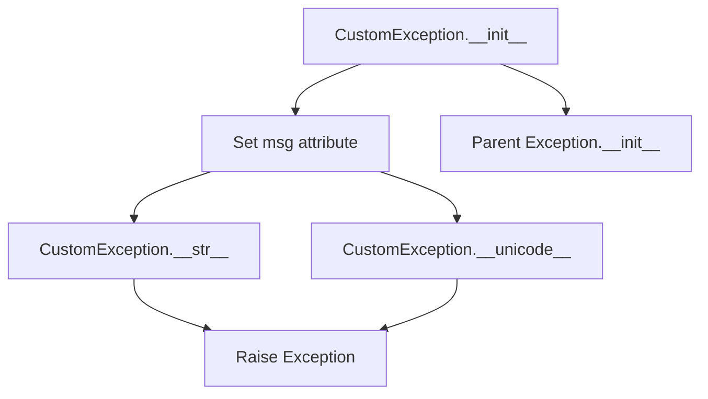
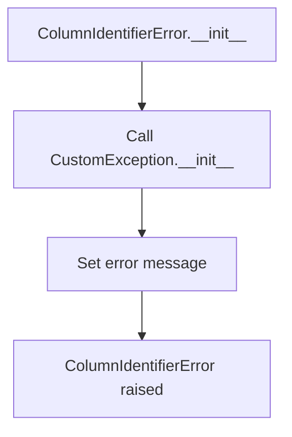
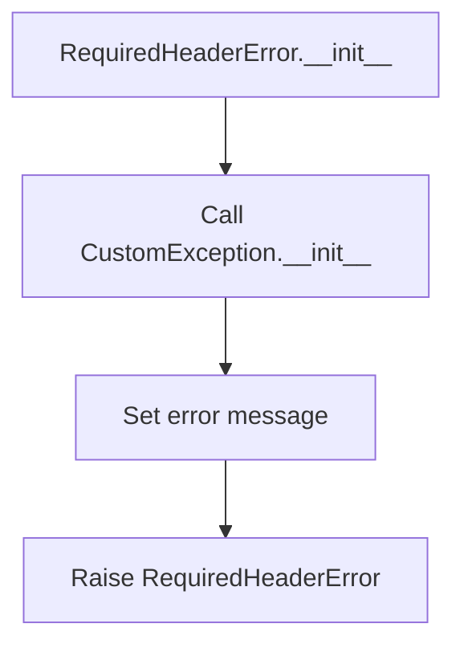

# `exceptions.py`

## `csvkit.exceptions.CustomException` · *class*

## Summary:
A custom exception class that extends Python's built-in Exception class to provide a simple mechanism for raising and handling application-specific errors with customizable error messages.

## Description:
This class serves as a base exception type for the csvkit library, allowing developers to raise exceptions with custom error messages while maintaining compatibility with Python's standard exception handling mechanisms. It is designed to be instantiated by various components within the csvkit ecosystem when specific error conditions are encountered during CSV processing operations.

## State:
- msg (str): The error message associated with this exception instance. This field holds the descriptive text that explains why the exception was raised. It has no specific constraints beyond being a string value.

## Lifecycle:
- Creation: Instances are created by passing a string message to the constructor. There are no special factory methods or alternative construction patterns.
- Usage: Once created, the exception can be raised using Python's 'raise' statement. The standard exception handling mechanisms (try/except blocks) can be used to catch and process these exceptions.
- Destruction: No explicit cleanup is required as Python handles garbage collection automatically. The class implements both __str__ and __unicode__ methods to ensure proper string representation regardless of Python version.

## Method Map:


## Raises:
- This class does not raise any exceptions during its initialization or method execution. It inherits standard exception behavior from Python's base Exception class.

## Example:
```python
# Creating and raising a custom exception
try:
    raise CustomException("Invalid CSV format detected")
except CustomException as e:
    print(f"Caught exception: {e}")
    # Output: Caught exception: Invalid CSV format detected
```

### `csvkit.exceptions.CustomException.__init__` · *method*

## Summary:
Initializes a CustomException instance with a message string.

## Description:
This method sets up a CustomException object by storing the provided error message. It is part of a custom exception class that extends Python's built-in Exception class, allowing for specialized error handling with custom messages.

## Args:
    msg (str): The error message to associate with this exception instance.

## Returns:
    None: This method does not return a value.

## Raises:
    None: This method does not raise any exceptions.

## State Changes:
    Attributes READ: None
    Attributes WRITTEN: self.msg

## Constraints:
    Preconditions: The msg argument must be a string.
    Postconditions: The exception instance will have its msg attribute set to the provided message.

## Side Effects:
    None: This method performs no I/O operations or external service calls.

### `csvkit.exceptions.CustomException.__unicode__` · *method*

## Summary:
Returns the string representation of the custom exception by returning its message attribute.

## Description:
This method provides the unicode string representation of a CustomException instance. It is part of the standard Python exception interface and ensures that when the exception is converted to a string (such as during printing or logging), it displays the stored error message.

## Args:
    None

## Returns:
    str: The message string stored in the exception's msg attribute.

## Raises:
    None

## State Changes:
    Attributes READ: self.msg
    Attributes WRITTEN: None

## Constraints:
    Preconditions: The exception instance must have a msg attribute set during initialization.
    Postconditions: The returned value is identical to the msg attribute value.

## Side Effects:
    None

### `csvkit.exceptions.CustomException.__str__` · *method*

## Summary:
Returns the string representation of the custom exception by returning its message attribute.

## Description:
This method provides a string representation of the CustomException instance, allowing it to be printed or converted to a string. It is part of the standard Python exception interface and ensures that when the exception is raised and caught, its string form displays the stored message.

## Args:
    None

## Returns:
    str: The message stored in the exception's msg attribute.

## Raises:
    None

## State Changes:
    Attributes READ: self.msg
    Attributes WRITTEN: None

## Constraints:
    Preconditions: The exception instance must have a msg attribute that is a string.
    Postconditions: The returned value is identical to the value stored in self.msg.

## Side Effects:
    None

## `csvkit.exceptions.ColumnIdentifierError` · *class*

## Summary:
A custom exception class representing errors related to column identifier resolution in CSV processing operations.

## Description:
This exception is raised when there are issues with identifying or resolving column names or indices within CSV data structures. It extends the CustomException base class to provide specialized error handling for column-related problems in the csvkit library. The exception serves as a distinct abstraction to differentiate column identifier errors from other types of CSV processing errors.

## State:
- Inherits all attributes from CustomException parent class including the msg attribute (str) that stores the error message
- No additional instance attributes are defined in this class

## Lifecycle:
- Creation: Instantiated by passing a descriptive error message to the constructor, inheriting all creation behavior from CustomException
- Usage: Raised using Python's 'raise' statement when column identifier resolution fails during CSV processing operations
- Destruction: Handled automatically by Python's garbage collector after the exception is caught and processed

## Method Map:


## Raises:
- Inherits standard exception raising behavior from CustomException parent class
- No additional exceptions are explicitly raised by this class's constructor

## Example:
```python
# Raising ColumnIdentifierError when column name is not found
try:
    raise ColumnIdentifierError("Column 'email' not found in CSV header")
except ColumnIdentifierError as e:
    print(f"Column error occurred: {e}")
    # Output: Column error occurred: Column 'email' not found in CSV header
```

## `csvkit.exceptions.CSVTestException` · *class*

## Summary:
A custom exception class for CSV testing operations that provides detailed context about validation failures in CSV data.

## Description:
CSVTestException is a specialized exception type designed for CSV validation and testing scenarios within the csvkit library. It extends CustomException to provide contextual information about CSV parsing errors, specifically tracking the line number and row data where validation failures occur. This exception is typically raised by CSV validation components when they encounter malformed or invalid data during testing operations.

## State:
- line_number (int): The line number in the CSV file where the validation failure occurred. Must be a positive integer representing the actual line position in the file.
- row (list): The row data that caused the validation failure. Contains the raw CSV fields as parsed from the input file.
- msg (inherited from CustomException): The descriptive error message explaining the nature of the validation failure.

## Lifecycle:
- Creation: Instantiated by passing line_number (int), row (list), and msg (str) arguments to the constructor
- Usage: Raised using Python's 'raise' statement within CSV validation logic to signal test failures
- Destruction: Automatically handled by Python's exception mechanism; no explicit cleanup required

## Method Map:
```mermaid
graph TD
    A[CSVTestException.__init__] --> B[Call super().__init__(msg)]
    A --> C[Set line_number attribute]
    A --> D[Set row attribute]
    B --> E[CustomException.__str__]
    C --> E
    D --> E
    E --> F[Raise Exception]
```

## Raises:
- This class does not explicitly raise exceptions during initialization, inheriting standard exception behavior from CustomException parent class

## Example:
```python
# Creating and raising a CSV test exception
try:
    raise CSVTestException(42, ['field1', 'field2', 'field3'], "Missing required field")
except CSVTestException as e:
    print(f"Line {e.line_number}: {e}")
    # Output: Line 42: Missing required field
    print(f"Row data: {e.row}")
    # Output: Row data: ['field1', 'field2', 'field3']
```

### `csvkit.exceptions.CSVTestException.__init__` · *method*

## Summary:
Initializes a CSV test exception with line number, row data, and error message.

## Description:
This method initializes a CSV test exception instance by storing contextual information about where and why a CSV parsing error occurred. It is called during CSV validation or processing when malformed data is detected. The method serves as a specialized constructor that extends the base CustomException class to provide detailed error context including the line number, problematic row data, and descriptive error message.

## Args:
    line_number (int): The line number in the CSV file where the error occurred.
    row (list): The row data that caused the CSV parsing error.
    msg (str): The error message describing the specific issue encountered.

## Returns:
    None: This method initializes the exception object and does not return a value.

## Raises:
    None: This method does not raise any exceptions itself.

## State Changes:
    Attributes READ: 
    - msg parameter (passed to super().__init__())
    Attributes WRITTEN: 
    - self.line_number: Stores the line number where the CSV error occurred
    - self.row: Stores the problematic row data causing the CSV error

## Constraints:
    Preconditions: 
    - line_number should be a positive integer representing a valid line in the CSV file
    - row should be a list containing the parsed CSV row data
    - msg should be a string describing the specific error condition
    Postconditions: 
    - The exception instance will have self.line_number set to the provided line_number
    - The exception instance will have self.row set to the provided row data
    - The exception instance will inherit the msg parameter as its error message through super().__init__(msg)

## Side Effects:
    None: This method performs no I/O operations or external service calls. It only initializes object attributes.

## `csvkit.exceptions.LengthMismatchError` · *class*

## Summary:
A custom exception raised when a CSV row contains a different number of columns than expected during CSV validation testing.

## Description:
LengthMismatchError is a specialized exception that signals a column count mismatch in CSV data validation. It is raised when processing CSV rows where the actual number of columns differs from the expected column count, typically during CSV testing operations. This exception inherits from CSVTestException and provides detailed context about the validation failure including the line number, actual row data, and the expected vs. actual column counts.

## State:
- line_number (int): The line number in the CSV file where the column mismatch occurred. Must be a positive integer representing the actual line position in the file.
- row (list): The row data that caused the validation failure. Contains the raw CSV fields as parsed from the input file.
- msg (str): The descriptive error message explaining the column mismatch. Automatically generated as "Expected %i columns, found %i columns".

## Lifecycle:
- Creation: Instantiate with line_number (int), row (list), and expected_length (int) arguments
- Usage: Raised using Python's 'raise' statement within CSV validation logic to signal column count mismatches
- Destruction: Automatically handled by Python's exception mechanism; no explicit cleanup required

## Method Map:
```mermaid
graph TD
    A[LengthMismatchError.__init__] --> B[Generate error message]
    A --> C[Call super().__init__(line_number, row, msg)]
    C --> D[CSVTestException.__init__]
    D --> E[Set line_number attribute]
    D --> F[Set row attribute]
    D --> G[Set msg attribute]
    H[LengthMismatchError.length] --> I[Return len(self.row)]
```

## Raises:
- This class does not explicitly raise exceptions during initialization, inheriting standard exception behavior from CSVTestException parent class

## Example:
```python
# Creating and raising a length mismatch error
try:
    raise LengthMismatchError(15, ['col1', 'col2'], 3)
except LengthMismatchError as e:
    print(f"Line {e.line_number}: {e}")
    # Output: Line 15: Expected 3 columns, found 2 columns
    print(f"Row data: {e.row}")
    # Output: Row data: ['col1', 'col2']
    print(f"Actual length: {e.length}")
    # Output: Actual length: 2
```

### `csvkit.exceptions.LengthMismatchError.length` · *method*

## Summary:
Returns the length of the row associated with this length mismatch error.

## Description:
This property provides access to the number of columns in the row that caused a length mismatch error. It is used to retrieve the actual column count of the problematic row during CSV validation.

## Args:
    None

## Returns:
    int: The number of columns in the row that triggered the error.

## Raises:
    None

## State Changes:
    Attributes READ: self.row
    Attributes WRITTEN: None

## Constraints:
    Preconditions: The instance must have a row attribute that supports the len() function.
    Postconditions: The returned value is guaranteed to be a non-negative integer representing the column count.

## Side Effects:
    None

## `csvkit.exceptions.InvalidValueForTypeException` · *class*

## Summary:
Represents an exception that occurs when a value cannot be converted to a specified data type during CSV processing.

## Description:
This exception is raised when csvkit encounters a value that cannot be properly converted to the expected data type at a specific index position. It serves as a specialized error type that provides detailed information about the conversion failure, including the problematic value, target type, and position in the data stream. The exception extends CustomException to maintain consistency with the library's error handling approach.

## State:
- index (int): The zero-based position in the CSV data where the conversion failed. Valid range is any non-negative integer representing a valid column index.
- value (str): The string representation of the value that could not be converted. This is the raw input that caused the type conversion issue.
- normal_type (str): The target data type that the value was attempting to be converted to. This describes the expected type such as 'int', 'float', 'bool', etc.

## Lifecycle:
- Creation: Instantiated by passing three arguments: index (int), value (str), and normal_type (str) to the constructor.
- Usage: Raised using Python's 'raise' statement when type conversion fails during CSV processing operations.
- Destruction: Automatically handled by Python's exception mechanism; no explicit cleanup required.

## Method Map:
```mermaid
graph TD
    A[InvalidValueForTypeException.__init__] --> B[Set index attribute]
    A --> C[Set value attribute]
    A --> D[Set normal_type attribute]
    A --> E[Construct error message]
    A --> F[Call super().__init__(msg)]
```

## Raises:
- This exception does not raise any additional exceptions during initialization. It inherits standard exception behavior from CustomException.

## Example:
```python
# Simulating the creation of this exception
try:
    # This would typically happen internally during CSV processing
    raise InvalidValueForTypeException(2, "not_a_number", "int")
except InvalidValueForTypeException as e:
    print(f"Error at index {e.index}: {e.value} cannot be converted to {e.normal_type}")
    # Output: Error at index 2: not_a_number cannot be converted to int
```

### `csvkit.exceptions.InvalidValueForTypeException.__init__` · *method*

## Summary:
Initializes an exception instance with details about a failed type conversion in CSV data processing.

## Description:
Sets up the exception object with the specific index, value, and target type that caused the conversion failure. This method constructs a descriptive error message and initializes the parent exception class with this message.

## Args:
    index (int): Zero-based position in the CSV data where the conversion failed.
    value (str): String representation of the value that could not be converted.
    normal_type (str): Target data type that the value was attempting to be converted to.

## Returns:
    None: This method does not return a value.

## Raises:
    None: This method does not raise any exceptions itself.

## State Changes:
    Attributes READ: None
    Attributes WRITTEN: self.index, self.value, self.normal_type

## Constraints:
    Preconditions: All arguments must be provided and of the correct types (index: int, value: str, normal_type: str).
    Postconditions: The exception instance will have its index, value, and normal_type attributes set to the provided values, and the error message will contain these details.

## Side Effects:
    None: This method performs no I/O operations or external service calls.

## `csvkit.exceptions.RequiredHeaderError` · *class*

## Summary:
A custom exception class representing an error that occurs when a required header is missing from a CSV file.

## Description:
This exception is raised when a CSV processing operation requires a specific header column to be present, but that header is not found in the input data. It extends the CustomException base class to provide application-specific error handling for CSV header validation scenarios. This class serves as a distinct abstraction to clearly indicate when header requirements are not met, enabling more precise error handling in CSV processing workflows.

## State:
- Inherits all attributes from CustomException parent class
- No additional instance attributes defined
- The error message is stored in the inherited 'msg' attribute from CustomException

## Lifecycle:
- Creation: Instantiated by passing a descriptive error message to the constructor, which inherits from CustomException
- Usage: Raised using Python's 'raise' statement when header validation fails during CSV processing operations
- Destruction: Handled automatically by Python's garbage collector after the exception is caught and processed

## Method Map:


## Raises:
- Inherits standard exception behavior from Python's base Exception class through CustomException parent class
- No additional exceptions are explicitly raised by this class's constructor

## Example:
```python
# Raising RequiredHeaderError when a required header is missing
try:
    raise RequiredHeaderError("Column 'email' is required but not found in CSV headers")
except RequiredHeaderError as e:
    print(f"Header validation failed: {e}")
    # Output: Header validation failed: Column 'email' is required but not found in CSV headers
```

