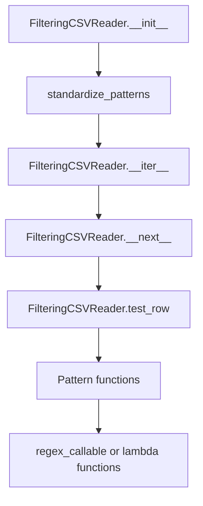

# `grep.py`

## `csvkit.grep.FilteringCSVReader` · *class*

## Summary:
A CSV reader wrapper that filters rows based on pattern matching criteria applied to specified columns.

## Description:
The FilteringCSVReader class provides a mechanism to filter CSV data by applying pattern matching tests to selected columns. It wraps an existing CSV reader and acts as an iterator, yielding only those rows that meet the specified filtering criteria. The class supports flexible pattern matching including exact string matching, regular expressions, and configurable matching logic (AND/OR conditions).

This abstraction allows for efficient, memory-conscious filtering of large CSV datasets without loading the entire dataset into memory. It is particularly useful for command-line tools and data processing pipelines where users need to extract specific subsets of CSV data based on content criteria.

## State:
- reader: An iterator that yields CSV rows (typically a csv.reader instance)
- header: Boolean flag indicating whether the CSV has a header row
- column_names: List of column names from the header row, or None if no header
- returned_header: Boolean flag tracking whether the header row has been yielded
- any_match: Boolean flag controlling whether any pattern matching suffices (OR logic) vs all patterns must match (AND logic)
- inverse: Boolean flag controlling whether to invert the matching results (negation)
- patterns: Dictionary mapping column indices to callable pattern functions for testing row values

## Lifecycle:
- Creation: Instantiate with a CSV reader, pattern specifications, and optional configuration flags
- Usage: Iterate over the instance to retrieve filtered rows one by one
- Destruction: Automatically handled by Python's garbage collection when the iterator goes out of scope

## Method Map:


## Raises:
- ColumnIdentifierError: Raised by standardize_patterns when column name/index conflicts occur

## Example:
```python
import csv
from csvkit.grep import FilteringCSVReader

# Create a basic CSV reader
csv_data = [['name', 'email'], ['Alice', 'alice@gmail.com'], ['Bob', 'bob@yahoo.com']]
reader = csv.reader(csv_data)

# Filter rows where email contains 'gmail'
filtered_reader = FilteringCSVReader(reader, {'email': 'gmail'}, header=True)

# Iterate through filtered results
for row in filtered_reader:
    print(row)
# Output: ['name', 'email'], ['Alice', 'alice@gmail.com']
```

### `csvkit.grep.FilteringCSVReader.__init__` · *method*

## Summary:
Initializes a FilteringCSVReader instance that filters CSV rows based on specified patterns.

## Description:
Configures the filtering reader by storing the input CSV reader, processing header information, and standardizing the provided patterns for efficient matching. This method sets up the core filtering logic by preparing column name mappings and pattern functions that will be used during row processing.

## Args:
    reader: An iterable CSV reader object that yields rows
    patterns (dict): Dictionary mapping column identifiers to pattern specifications
    header (bool): Whether the CSV contains a header row; defaults to True
    any_match (bool): Whether any pattern matching should result in inclusion; defaults to False
    inverse (bool): Whether to invert the matching logic; defaults to False

## Returns:
    None

## Raises:
    ColumnIdentifierError: When column name/index conflicts occur during pattern standardization

## State Changes:
    Attributes READ: self.header
    Attributes WRITTEN: self.reader, self.header, self.column_names, self.any_match, self.inverse, self.patterns

## Constraints:
    Preconditions:
        - Reader must be an iterable that yields CSV rows
        - Patterns must be compatible with standardize_patterns function
        - Header parameter must be boolean

    Postconditions:
        - self.reader is assigned the input reader
        - self.header is assigned the header parameter value
        - self.column_names is populated from reader if header is True
        - self.any_match and self.inverse are assigned from respective parameters
        - self.patterns is assigned the standardized pattern mapping

## Side Effects:
    None

### `csvkit.grep.FilteringCSVReader.__iter__` · *method*

## Summary:
Returns the iterator instance itself, enabling the FilteringCSVReader to function as an iterator.

## Description:
The `__iter__` method implements Python's iterator protocol by returning `self`, making the `FilteringCSVReader` object iterable. This method is called when the object is used in a for-loop or other iteration contexts. It serves as the entry point for the iteration process, delegating the actual iteration logic to the `__next__` method.

This method is intentionally minimal and follows Python's standard iterator protocol. The real filtering and row processing occurs in the `__next__` method, which handles header processing and pattern matching logic.

## Args:
    None

## Returns:
    FilteringCSVReader: The instance itself, making it an iterator.

## Raises:
    None

## State Changes:
    Attributes READ: None
    Attributes WRITTEN: None

## Constraints:
    Preconditions:
        - The `FilteringCSVReader` instance must be properly initialized with a CSV reader and patterns
        - The `__next__` method must be implemented to handle actual iteration logic

    Postconditions:
        - The object becomes iterable and can be consumed in iteration contexts
        - Subsequent calls to `__next__` will process rows according to the configured patterns

## Side Effects:
    None

### `csvkit.grep.FilteringCSVReader.__next__` · *method*

## Summary:
Returns the next matching row from a CSV reader, optionally yielding the header row first.

## Description:
The `__next__` method implements the iterator protocol for `FilteringCSVReader`, providing a mechanism to retrieve rows that match specified filtering criteria. It handles the special case of returning the header row once before proceeding to filter and yield data rows. The method continues reading rows from the underlying CSV reader until it finds one that satisfies the configured filtering patterns.

This method is designed as a separate component to encapsulate the iteration logic and ensure proper handling of the header row, making the filtering process transparent to consumers of the iterator.

## Args:
    None

## Returns:
    list[str]: A list representing a CSV row (either the header row or a filtered data row)

## Raises:
    StopIteration: When the underlying CSV reader is exhausted and no more matching rows are available

## State Changes:
    Attributes READ: self.column_names, self.returned_header, self.reader
    Attributes WRITTEN: self.returned_header

## Constraints:
    Preconditions:
        - The underlying `self.reader` must be a valid iterator that yields lists of strings
        - `self.column_names` must be either None or a list of strings if header processing is enabled
        - `self.patterns` must be properly initialized via `standardize_patterns` before iteration begins

    Postconditions:
        - If a header row exists and hasn't been returned yet, it will be returned exactly once
        - Once a header row is returned, subsequent calls will skip the header processing logic
        - The returned row will always match the configured filtering criteria

## Side Effects:
    I/O: Reads from the underlying CSV reader (self.reader)
    Mutation: Updates the self.returned_header flag to track whether the header has been yielded

### `csvkit.grep.FilteringCSVReader.test_row` · *method*

## Summary:
Tests whether a CSV row matches configured filtering patterns based on match mode and inverse settings.

## Description:
Evaluates a CSV row against predefined patterns to determine inclusion in filtered output. Called during CSV processing when rows need to be tested against filter criteria. Implements both 'any match' (match any pattern) and 'all match' (match all patterns) logic modes, with support for inverse matching (excluding matching rows).

When `self.any_match` is True, the method returns True if ANY pattern matches (subject to inverse flag). When `self.any_match` is False, the method returns True only if ALL patterns match (subject to inverse flag). The `self.inverse` flag inverts the final decision.

## Args:
    row (list): A list representing a CSV row, where each element corresponds to a column value.

## Returns:
    bool: True if the row matches the filtering criteria according to configuration, False otherwise.

## Raises:
    None explicitly raised, though IndexError may occur internally when accessing row indices.

## State Changes:
    Attributes READ: self.patterns, self.any_match, self.inverse
    Attributes WRITTEN: None

## Constraints:
    Preconditions: 
    - self.patterns must be a dictionary mapping column indices to callable pattern functions
    - row must be iterable and indexable
    - self.any_match and self.inverse must be boolean values
    
    Postconditions:
    - Method returns a boolean indicating match status
    - Instance state remains unchanged

## Side Effects:
    None

## `csvkit.grep.standardize_patterns` · *function*

## Summary:
Converts pattern dictionaries to a standardized format mapping column indices to callable pattern functions.

## Description:
The `standardize_patterns` function processes a dictionary of patterns and converts them into a normalized format where keys are either column names or numeric indices. It handles the conversion of pattern values to callable functions and manages the mapping between column identifiers and their corresponding patterns, ensuring no conflicts occur between column names and indices.

This function is extracted to centralize pattern standardization logic, separating concerns between pattern conversion and column identifier resolution. It provides a consistent interface for downstream CSV processing operations that require standardized pattern mappings.

## Args:
    column_names (list[str]): List of column names from the CSV header, or None if no header is available
    patterns (dict): Dictionary mapping column identifiers (names or indices) to pattern specifications

## Returns:
    dict: A dictionary mapping numeric indices to callable pattern functions, with proper handling of column name/index conflicts

## Raises:
    ColumnIdentifierError: When a column name maps to an index that already has a pattern defined

## Constraints:
    Preconditions:
        - Patterns dictionary should contain valid pattern specifications
        - Column names list should contain valid string identifiers if provided
        - Pattern values should be convertible to callable functions via pattern_as_function

    Postconditions:
        - All pattern values are converted to callable functions
        - Keys in the returned dictionary are either integers (column indices) or strings (column names)
        - No duplicate pattern assignments to the same column identifier

## Side Effects:
    None

## Control Flow:
```mermaid
flowchart TD
    A[Start standardize_patterns] --> B{patterns.items() filtered for truthy values?}
    B -- Yes --> C[Convert patterns to callable functions]
    C --> D{column_names is empty?}
    D -- Yes --> E[Return converted patterns]
    D -- No --> F[Initialize p2 dictionary]
    F --> G[Iterate over pattern keys]
    G --> H{Key in column_names?}
    H -- Yes --> I[Get column index]
    I --> J{Index in patterns?}
    J -- Yes --> K[Raise ColumnIdentifierError]
    J -- No --> L[Map index to pattern function]
    H -- No --> M[Map key to pattern function]
    L --> N[Continue iteration]
    M --> N
    K --> O[End]
    N --> P{More keys?}
    P -- Yes --> G
    P -- No --> Q[Return p2]
    O --> Q
```

## Examples:
```python
# Basic usage with column names
column_names = ['name', 'email', 'phone']
patterns = {'name': 'John', 'email': r'.*@gmail\.com'}
result = standardize_patterns(column_names, patterns)
# Returns {0: <callable>, 1: <callable>} where 0 corresponds to 'name' and 1 to 'email'

# Usage with mixed column identifiers
patterns = {'name': 'John', 1: r'.*@gmail\.com'}
result = standardize_patterns(['name', 'email'], patterns)
# Returns {0: <callable>, 1: <callable>} with proper index mapping

# Error case - conflicting column name and index
column_names = ['name', 'email']
patterns = {'name': 'John', 0: 'Jane'}  # Column 'name' has index 0
try:
    result = standardize_patterns(column_names, patterns)
except ColumnIdentifierError as e:
    print(e)  # "Column name has index 0 which already has a pattern."

# Fallback case - when patterns is a list-like object
patterns = ['John', r'.*@gmail\.com']
result = standardize_patterns(['name', 'email'], patterns)
# Returns {0: <callable>, 1: <callable>} with integer indices
```

## `csvkit.grep.pattern_as_function` · *function*

## Summary:
Converts a pattern object into a callable function for string matching operations.

## Description:
The `pattern_as_function` utility function serves as a polymorphic converter that transforms various pattern representations into callable functions suitable for string matching. It handles three distinct input types: already callable objects, compiled regular expression patterns, and literal string patterns.

This function enables flexible pattern matching by normalizing different input formats into a uniform callable interface. It is primarily used in CSV processing workflows where patterns need to be applied consistently across different data filtering scenarios.

## Args:
    obj: The pattern object to convert. Can be:
        - A callable object (function, method, or callable class instance)
        - A compiled regular expression pattern with a 'match' method
        - Any other object that can be checked for membership in strings

## Returns:
    A callable function that accepts a single string argument and returns a boolean indicating whether the pattern matches the string:
        - If `obj` is callable, returns `obj` unchanged
        - If `obj` has a 'match' attribute (compiled regex), returns `regex_callable(obj)`
        - Otherwise, returns a lambda function that checks if `obj` is contained in the input string

## Raises:
    None explicitly raised by this function

## Constraints:
    Preconditions:
        - Input `obj` must be a valid object that can be processed by the conversion logic
        - When `obj` is a compiled regex pattern, it must have a 'match' method
        - When `obj` is not callable and lacks 'match', it must support the 'in' operator with strings

    Postconditions:
        - The returned callable will accept exactly one string argument
        - The returned callable will return a boolean value
        - The returned callable preserves the semantics of the original pattern representation

## Side Effects:
    None

## Control Flow:
```mermaid
flowchart TD
    A[Start pattern_as_function] --> B{Is obj callable?}
    B -- Yes --> C[Return obj]
    B -- No --> D{Has obj.match?}
    D -- Yes --> E[Return regex_callable(obj)]
    D -- No --> F[Return lambda x: obj in x]
```

## Examples:
```python
# Using a callable
def custom_match(text):
    return len(text) > 5
func = pattern_as_function(custom_match)  # Returns custom_match unchanged

# Using a compiled regex
import re
pattern = re.compile(r'\d+')
func = pattern_as_function(pattern)  # Returns regex_callable(pattern)

# Using a literal string
func = pattern_as_function('hello')  # Returns lambda x: 'hello' in x
```

## `csvkit.grep.regex_callable` · *class*

## Summary:
A callable class that wraps a compiled regular expression pattern for matching against string arguments.

## Description:
The `regex_callable` class serves as a wrapper around a compiled regular expression pattern, providing a convenient interface for performing regex searches on string inputs. It is designed to be used in contexts where a callable object is needed to apply a regex pattern to text data, such as filtering CSV rows based on pattern matching.

This class represents a simple adapter pattern that transforms a compiled regex object into a callable interface. Its primary motivation is to enable seamless integration with functions or methods that expect a callable accepting a single argument, while maintaining the flexibility of using compiled regular expressions for performance reasons.

## State:
- `pattern`: A compiled regular expression object (from `re.compile()`) that defines the search pattern to be applied.
  - Type: `re.Pattern`
  - Valid range: Must be a compiled regex pattern object
  - Invariant: Once set in `__init__`, this attribute remains constant throughout the object's lifetime

## Lifecycle:
- Creation: Instantiate with a compiled regular expression pattern as the sole argument to `__init__`
- Usage: Call the instance with a string argument to perform the regex search
- Destruction: No special cleanup required; relies on Python's garbage collection

## Method Map:
```mermaid
graph TD
    A[regex_callable.__init__] --> B[regex_callable.__call__]
    B --> C[Pattern.search(arg)]
```

## Raises:
- `TypeError`: May be raised by `__call__` if the argument is not a string, as the underlying regex engine requires string input for search operations

## Example:
```python
import re
from csvkit.grep import regex_callable

# Create a compiled regex pattern
pattern = re.compile(r'\d+')

# Create the callable wrapper
matcher = regex_callable(pattern)

# Use it to test strings
result1 = matcher("abc123def")  # Returns a Match object
result2 = matcher("abcdef")     # Returns None
```

### `csvkit.grep.regex_callable.__init__` · *method*

## Summary:
Initializes a regex callable object with a pattern for matching CSV data.

## Description:
This method sets up the regex callable object by storing the provided pattern as an instance attribute. It serves as the constructor for the regex callable class used in CSV filtering operations.

## Args:
    pattern (str): The regular expression pattern to be stored for later use in matching CSV data.

## Returns:
    None: This method does not return any value.

## Raises:
    None: This method does not raise any exceptions.

## State Changes:
    Attributes READ: None
    Attributes WRITTEN: self.pattern

## Constraints:
    Preconditions: The pattern argument must be a string representing a valid regular expression.
    Postconditions: The instance will have a self.pattern attribute containing the provided pattern.

## Side Effects:
    None: This method performs no I/O operations or external service calls.

### `csvkit.grep.regex_callable.__call__` · *method*

## Summary:
Executes a regular expression search on the provided argument string using the precompiled pattern.

## Description:
This method serves as the callable interface for a regex pattern object, enabling it to be used in contexts requiring a function-like interface. It performs a search operation on the input argument using the compiled regular expression pattern stored in the instance. This design allows the regex_callable instance to be used wherever a function is expected, such as in filtering operations or callback scenarios.

## Args:
    arg (str): The input string to search within.

## Returns:
    MatchObject or None: A match object if the pattern is found, or None if no match is found.

## Raises:
    AttributeError: If self.pattern is not properly initialized or does not have a search method.

## State Changes:
    Attributes READ: self.pattern
    Attributes WRITTEN: None

## Constraints:
    Preconditions: The instance must have a valid compiled regex pattern stored in self.pattern.
    Postconditions: The method returns the result of the regex search operation without modifying the instance state.

## Side Effects:
    None

