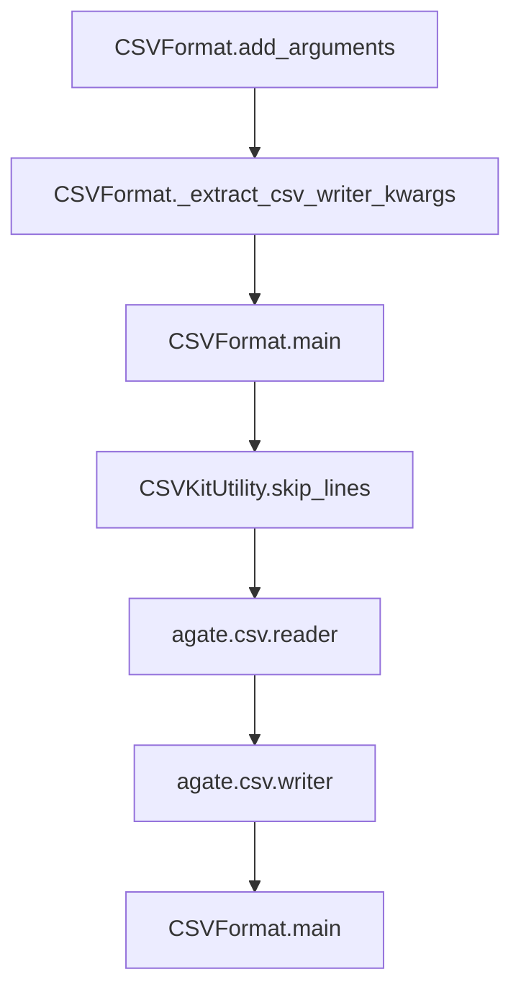

# `csvformat.py`

## `csvkit.utilities.csvformat.CSVFormat` · *class*

## Summary:
CSVFormat is a command-line utility that converts CSV files to custom output formats with configurable delimiters, quoting, and line termination settings.

## Description:
CSVFormat enables flexible conversion of CSV data to various output formats by allowing users to specify custom delimiters, quoting styles, and other CSV formatting options. It extends CSVKitUtility to provide a complete command-line interface for CSV transformation tasks. The utility is typically invoked through the csvkit command-line suite and supports both file input and piped data input.

The utility processes CSV data by reading from input (file or stdin) and writing to output (file or stdout) with customizable CSV writer parameters. It supports features like skipping header rows, custom delimiters (including tab-delimited output), quoting styles, and line terminators.

## State:
- description (str): Class-level attribute describing the utility's purpose
- override_flags (list): Class-level attribute specifying command-line flags to disable
- argparser (argparse.ArgumentParser): Inherited from CSVKitUtility for argument parsing
- args (argparse.Namespace): Parsed command-line arguments inherited from CSVKitUtility
- output_file (file-like object): Output stream inherited from CSVKitUtility
- reader_kwargs (dict): Configuration parameters for CSV readers inherited from CSVKitUtility
- writer_kwargs (dict): Configuration parameters for CSV writers inherited from CSVKitUtility
- input_file (file-like object): Input stream inherited from CSVKitUtility

## Lifecycle:
- Creation: Instantiate with optional arguments list and/or output_file parameter
- Usage: Call run() method which handles argument parsing, file management, and executes main() 
- Destruction: Automatic cleanup of file handles occurs in CSVKitUtility.run()

## Method Map:


## Raises:
- None explicitly raised by __init__ (inherits from CSVKitUtility)
- ValueError: From CSVKitUtility.skip_lines() if skip_lines argument is invalid
- IOError: From file operations in CSVKitUtility.run() if files cannot be opened/read
- NotImplementedError: From CSVKitUtility.add_arguments() and CSVKitUtility.main() if not properly overridden

## Example:
```python
# Convert CSV with tab delimiter
python -m csvkit.utilities.csvformat -T input.csv > output.tsv

# Convert CSV with custom quoting and delimiter
python -m csvkit.utilities.csvformat -D";" -U1 input.csv > output.csv

# Skip header row in output
python -m csvkit.utilities.csvformat -E input.csv > output.csv

# Skip header row and use tab delimiter
python -m csvkit.utilities.csvformat -E -T input.csv > output.tsv
```

### `csvkit.utilities.csvformat.CSVFormat.add_arguments` · *method*

## Summary:
Configures command-line arguments for CSV formatting utility, adding options for output delimiter, quoting, escaping, and header control.

## Description:
This method extends the base CSVKitUtility argument parser with formatting-specific options for controlling the output CSV file's structure. It is called during the initialization phase of the CSVFormat utility to register all available formatting parameters with the argument parser. The method enables users to customize output CSV characteristics like delimiter, quote characters, quoting styles, and line terminators without requiring inline code modifications.

The CSVFormat class inherits from CSVKitUtility and overrides the add_arguments method to provide CSV-specific formatting controls. This approach allows the utility to leverage CSVKitUtility's common argument parsing infrastructure while adding specialized options for output formatting.

## Args:
    self: The CSVFormat instance whose argparser attribute is being modified

## Returns:
    None: This method modifies the instance's argparser in-place and returns nothing

## Raises:
    None: This method does not raise exceptions directly, though argument parsing errors may occur later

## State Changes:
    Attributes READ: self.argparser (used to add arguments)
    Attributes WRITTEN: self.argparser (modified in-place with new arguments)

## Constraints:
    Preconditions: The instance must have an initialized argparser attribute (typically set by CSVKitUtility.__init__)
    Postconditions: The argparser will contain all formatting-related command-line arguments defined in this method

## Side Effects:
    None: This method performs no I/O operations or external service calls. It only modifies the internal argument parser configuration.

### `csvkit.utilities.csvformat.CSVFormat._extract_csv_writer_kwargs` · *method*

*No documentation generated.*

### `csvkit.utilities.csvformat.CSVFormat.main` · *method*

## Summary:
Processes and reformats CSV data according to specified command-line arguments, handling input from files or stdin with optional header row management and line skipping.

## Description:
The main method orchestrates the core CSV formatting functionality by reading input data through agate's CSV reader, applying any configured header row handling (skipping or generating default headers), and writing the processed data to the output file using agate's CSV writer. This method is part of the CSVFormat utility class and implements the specific behavior for the csvformat command-line tool.

This logic is implemented as its own method because it represents the complete processing workflow for the csvformat utility, encapsulating the interaction between input/output streams, CSV reader/writer configuration, and the specific header row handling logic that distinguishes this utility from others in the csvkit suite.

## Args:
    self: The instance of CSVFormat class inheriting from CSVKitUtility

## Returns:
    None: This method performs I/O operations but does not return a value

## Raises:
    None explicitly raised by this method

## State Changes:
    Attributes READ: 
        - self.args.no_header_row
        - self.args.skip_header
        - self.reader_kwargs
        - self.writer_kwargs
        - self.output_file
        - self.additional_input_expected()
        - self.skip_lines()
    Attributes WRITTEN: None

## Constraints:
    Preconditions:
        - self.args must be properly initialized with no_header_row and skip_header attributes
        - self.reader_kwargs and self.writer_kwargs must contain valid keyword arguments for agate.csv.reader and agate.csv.writer
        - self.output_file must be a valid writable file-like object
        - Input data must be available through self.skip_lines() method
        - self.additional_input_expected() must be callable and return a boolean

    Postconditions:
        - All input CSV data is processed and written to the output file
        - Header row handling logic is applied according to command-line arguments
        - No modifications are made to the object's internal state

## Side Effects:
    - Writes formatted CSV data to self.output_file
    - Reads CSV data from input stream via self.skip_lines()
    - May write informational message to stderr when waiting for stdin input via sys.stderr.write()
    - Performs file I/O operations through agate's CSV reader and writer
    - May perform additional file reading when self.args.no_header_row is True

## `csvkit.utilities.csvformat.launch_new_instance` · *function*

## Summary:
Launches a new instance of the CSVFormat utility to process CSV data with specified formatting options.

## Description:
This function serves as the entry point for launching the CSVFormat command-line utility. It creates an instance of the CSVFormat class and invokes its run() method to execute the CSV formatting workflow. The function is designed to be called by the command-line interface to initiate processing of CSV data according to the specified arguments.

The function extracts the instantiation and execution logic into a separate function to maintain clean separation between the utility's construction and execution phases. This approach allows for easier testing and potential reuse in different contexts while keeping the command-line interface simple and focused. It follows the same pattern used by other csvkit utilities such as csvcut, csvclean, csvsort, etc.

## Args:
    None: This function takes no parameters.

## Returns:
    None: This function does not return any value.

## Raises:
    Any exceptions that may be raised by CSVFormat.__init__() or CSVFormat.run() methods, including:
    - ValueError: From CSVKitUtility.skip_lines() if skip_lines argument is invalid
    - IOError: From file operations in CSVKitUtility.run() if files cannot be opened/read
    - NotImplementedError: From CSVKitUtility.add_arguments() and CSVKitUtility.main() if not properly overridden

## Constraints:
    Preconditions:
        - The csvkit.utilities.csvformat module must be properly imported
        - The CSVFormat class must be correctly defined and inherit from CSVKitUtility
        - Command-line arguments must be available in sys.argv or equivalent
        
    Postconditions:
        - A CSVFormat instance is created and its run() method is invoked
        - All command-line arguments are processed through the CSVKitUtility framework
        - Input/output file handles are managed by the CSVKitUtility.run() method

## Side Effects:
    - Reads command-line arguments from sys.argv
    - May open and close input/output files during execution
    - Writes formatted CSV data to stdout or specified output file
    - May modify global state through CSVKitUtility's argument parsing and file handling

## Control Flow:
```mermaid
flowchart TD
    A[launch_new_instance] --> B[Create CSVFormat instance]
    B --> C[Call utility.run()]
    C --> D{CSVKitUtility.run executes}
    D --> E[Argument parsing occurs]
    E --> F[Input file handling occurs]
    F --> G[Main processing logic executes]
    G --> H[Output written with formatting options]
    H --> I[File handles closed]
    I --> J[Function completes]
```

## Examples:
```python
# Typical usage from command line
# python -m csvkit.utilities.csvformat -T input.csv > output.tsv

# Or programmatically (though less common)
from csvkit.utilities.csvformat import launch_new_instance
launch_new_instance()
```

