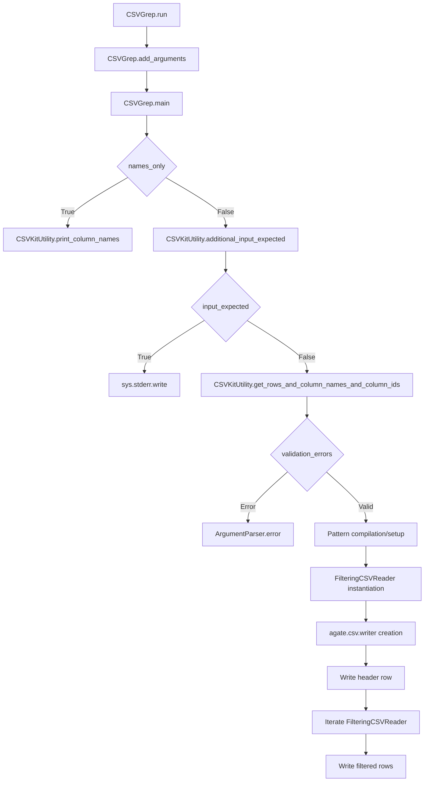

# `csvgrep.py`

## `csvkit.utilities.csvgrep.CSVGrep` · *class*

## Summary:
CSVGrep is a command-line utility that filters CSV rows based on pattern matching criteria applied to specified columns, functioning like the Unix "grep" command but for tabular data.

## Description:
CSVGrep enables users to search CSV files by applying pattern matching to selected columns. It supports multiple matching strategies including exact string matching, regular expressions, and file-based matching. The utility can filter rows based on whether all specified columns match (default) or if any column matches, and can invert the matching logic to select non-matching rows. It integrates with the csvkit framework and inherits common CLI functionality from CSVKitUtility.

## State:
- description (str): Class-level attribute describing the utility's purpose
- override_flags (list[str]): Class-level attribute specifying disabled command-line flags
- argparser: Argument parser instance configured with CSV-specific arguments
- args: Parsed command-line arguments namespace
- output_file: Output stream for writing results (defaults to sys.stdout)
- reader_kwargs: Configuration parameters for CSV readers
- writer_kwargs: Configuration parameters for CSV writers
- input_file: Input stream for reading CSV data (set during run())

## Lifecycle:
- Creation: Instantiated via CSVKitUtility constructor with optional arguments
- Usage: Called via run() method which orchestrates:
  1. Argument parsing via add_arguments()
  2. Input validation and setup
  3. Data processing in main() method
  4. Row filtering using FilteringCSVReader
  5. Output writing to output_file
- Destruction: Automatic cleanup of file handles occurs in parent class run() method

## Method Map:


## Raises:
- SystemExit: Raised by argparser.error() when validation fails (missing columns, missing pattern)
- ValueError: Raised by skip_lines() when skip_lines argument is not an integer
- RequiredHeaderError: Raised by print_column_names() when --no-header-row is used with -n/--names

## Example:
```python
# Search for rows where column 1 contains "example"
python csvgrep.py -c 1 -m "example" data.csv

# Search for rows where column "name" matches regex pattern
python csvgrep.py -c name -r "^[A-Z].*\\d+$" data.csv

# Search for rows where any column matches a file of patterns
python csvgrep.py -c 1,2 -f patterns.txt data.csv

# Display column names only
python csvgrep.py -n data.csv
```

### `csvkit.utilities.csvgrep.CSVGrep.add_arguments` · *method*

## Summary:
Configures command-line argument parsers for CSV grep utility with options for column selection, pattern matching, and filtering behavior.

## Description:
This method extends the base CSVKitUtility argument parser to include specialized options for searching CSV data. It defines command-line flags that control how the grep functionality operates, including column specification, matching patterns, and filtering logic. The method is called during the initialization phase of the CSVGrep utility to set up all available command-line options.

The arguments allow users to:
- Display column names and indices from input CSV
- Select specific columns for searching by index, name, or range
- Specify search patterns using literal strings or regular expressions
- Match against content from a file
- Invert matching behavior to select non-matching rows
- Control whether any column or all columns must match

## Args:
    self: The CSVGrep instance whose argparser is being configured

## Returns:
    None: This method modifies the instance's argparser in-place

## Raises:
    None explicitly raised

## State Changes:
    Attributes READ: self.argparser
    Attributes WRITTEN: self.argparser (modified via add_argument calls)

## Constraints:
    Preconditions: 
    - self.argparser must be initialized and accessible
    - This method should only be called during object initialization/setup phase
    
    Postconditions:
    - The argparser contains all defined command-line arguments for CSV grep functionality
    - All argument definitions are properly registered with the parser

## Side Effects:
    None: This method only configures the argument parser and does not perform I/O operations or modify external state

### `csvkit.utilities.csvgrep.CSVGrep.main` · *method*

## Summary:
Processes CSV data by filtering rows based on pattern matching criteria applied to specified columns.

## Description:
The main method implements the core functionality of csvgrep, which filters CSV rows based on pattern matching criteria. It handles various modes including column name listing, input validation, pattern compilation, and row filtering. The method orchestrates the complete workflow from argument parsing to output generation, leveraging helper methods from the parent CSVKitUtility class and the FilteringCSVReader for efficient row filtering.

## Args:
    self: The instance of CSVKitUtility subclass (CSVGrep) containing parsed arguments and configuration

## Returns:
    None

## Raises:
    SystemExit: Raised by argparser.error() when required arguments are missing or invalid

## State Changes:
    Attributes READ:
        - self.args.names_only
        - self.args.columns
        - self.args.regex
        - self.args.pattern
        - self.args.matchfile
        - self.args.inverse
        - self.args.any_match
        - self.reader_kwargs
        - self.writer_kwargs
    Attributes WRITTEN:
        - self.args.matchfile (closed after reading lines)

## Constraints:
    Preconditions:
        - self.args must contain valid parsed arguments from command-line
        - At least one column must be specified via -c option
        - Exactly one pattern specification must be provided (-r, -m, or -f)
        - Input file or piped data must be available (unless names_only is True)
        - CSV file must be readable and properly formatted

    Postconditions:
        - If names_only is True, column names are printed and method exits early
        - If no input is provided, appropriate warning message is written to stderr
        - Valid filtering criteria are established for all specified columns
        - Filtered CSV data is written to output_file with proper header row

## Side Effects:
    I/O: Writes column names to output_file when names_only=True, writes filtered CSV rows to output_file
    External service calls: Uses agate.csv.writer for CSV output formatting
    Mutations to objects outside self:
        - sys.stderr is written to when additional input is expected
        - self.args.matchfile is closed after reading lines

## `csvkit.utilities.csvgrep.launch_new_instance` · *function*

## Summary:
Creates and runs a new instance of the CSVGrep utility for filtering CSV data based on pattern matching criteria.

## Description:
This function serves as the entry point for launching the CSVGrep command-line utility. It instantiates a CSVGrep object and executes its run method, which orchestrates the complete workflow of parsing command-line arguments, validating input, applying pattern matching filters to CSV rows, and writing the filtered results to output. The function encapsulates the instantiation and execution logic, providing a clean interface for starting the utility.

## Args:
    None

## Returns:
    None

## Raises:
    SystemExit: Raised by CSVGrep.run() when argument validation fails or when the utility encounters invalid input configurations.
    ValueError: Raised by underlying CSV processing components when data conversion issues occur.
    RequiredHeaderError: Raised by CSVGrep.print_column_names() when attempting to display column names without a header row.

## Constraints:
    Preconditions:
    - The function assumes that the command-line environment is properly set up with sys.argv containing the utility arguments.
    - The working directory should allow access to input files specified in arguments.
    
    Postconditions:
    - A CSVGrep instance is created and executed.
    - Command-line arguments are parsed and processed.
    - Either filtered CSV output is written to stdout/stderr or an error is reported.

## Side Effects:
    - Reads from stdin or specified input files (via sys.argv)
    - Writes to stdout or specified output files
    - May write error messages to stderr
    - Opens and closes file handles as needed by CSVKitUtility

## Control Flow:
```mermaid
flowchart TD
    A[launch_new_instance] --> B[CSVGrep() instantiation]
    B --> C[utility.run()]
    C --> D[CSVKitUtility.run() execution]
    D --> E[Argument parsing]
    E --> F[Input file handling]
    F --> G[Main processing via CSVGrep.main()]
    G --> H[Pattern matching and filtering]
    H --> I[Output writing]
    I --> J[End]
```

## Examples:
```python
# Typical usage from command line (this function is called internally)
python csvgrep.py -c 1 -m "pattern" data.csv

# Programmatic usage (not common but illustrative)
from csvkit.utilities.csvgrep import launch_new_instance
launch_new_instance()
```

