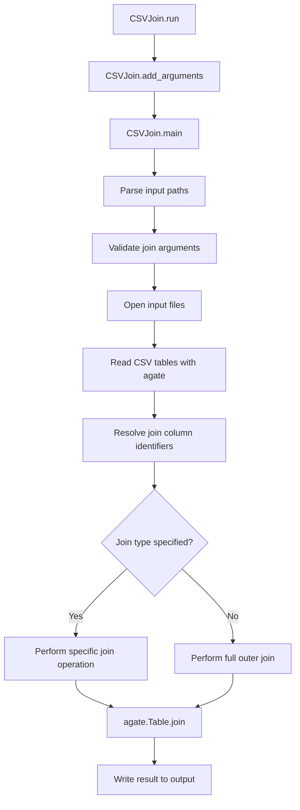

# `csvjoin.py`

## `csvkit.utilities.csvjoin.CSVJoin` · *class*

## Summary:
CSVJoin is a command-line utility that performs SQL-like joins on multiple CSV files, merging them based on specified column(s) or sequential alignment.

## Description:
CSVJoin enables users to combine multiple CSV files using various join operations (inner, left, right, or full outer joins) similar to SQL database joins. It reads all input files into memory, processes them according to the specified join strategy, and outputs the merged result to stdout or a specified output file. The utility supports flexible column specification for joining and offers different join types to handle various data integration scenarios.

## State:
- input_files (list[file-like objects]): Collection of opened input file handles managed by the parent class
- args (argparse.Namespace): Parsed command-line arguments containing join configuration
- output_file (file-like object): Output stream for writing the joined result
- reader_kwargs (dict): Configuration parameters for CSV reader initialization
- writer_kwargs (dict): Configuration parameters for CSV writer initialization

## Lifecycle:
- Creation: Instantiated via command-line interface with optional arguments
- Usage: Called through CSVKitUtility.run() which orchestrates:
  1. Argument parsing via add_arguments()
  2. Input file opening via _open_input_file()
  3. Main processing logic in main() method
  4. Output writing via to_csv()
- Destruction: Automatic cleanup of file handles occurs in parent class run() method

## Method Map:


## Raises:
- SystemExit: Raised by argparser.error() when validation fails for:
  - Missing input files when stdin is a TTY
  - Mismatch between join column count and input file count
  - Missing join columns for outer join operations
  - Conflicting join type flags (--left and --right specified together)

## Example:
```python
# Join two files on a common column
csvjoin -c id file1.csv file2.csv > joined_output.csv

# Perform a left outer join on multiple files
csvjoin --left -c "1,2,3" file1.csv file2.csv file3.csv > left_joined.csv

# Perform a full outer join without specifying columns
csvjoin --outer file1.csv file2.csv > full_joined.csv
```

### `csvkit.utilities.csvjoin.CSVJoin.add_arguments` · *method*

## Summary:
Configures command-line arguments for joining CSV files with support for various join types and column matching options.

## Description:
This method initializes the argument parser with all available command-line options for the CSV join utility. It defines positional arguments for input files and several optional flags that control join behavior, column matching, and CSV parsing parameters. The method is called during the setup phase of the CSVJoin utility to establish the command-line interface before processing begins.

## Args:
    self: The CSVJoin instance whose argparser attribute is configured with command-line arguments.

## Returns:
    None: This method modifies the instance's argparser in-place and does not return a value.

## Raises:
    None explicitly raised: This method only configures arguments and doesn't raise exceptions itself.

## State Changes:
    Attributes READ: None
    Attributes WRITTEN: self.argparser (modified via add_argument calls)

## Constraints:
    Preconditions: The CSVJoin instance must have an argparser attribute properly initialized.
    Postconditions: The argparser contains all defined arguments for CSV join operations including file inputs, join types, column specifications, and CSV parsing options.

## Side Effects:
    None: This method only configures argument parsing and doesn't perform I/O or external service calls.

### `csvkit.utilities.csvjoin.CSVJoin.main` · *method*

## Summary:
Performs a SQL-like join operation on multiple CSV files, combining them based on specified column(s) or sequentially merging rows.

## Description:
This method implements the core join functionality of the CSVJoin utility. It processes command-line arguments, opens and validates input files, loads CSV data into agate Table objects, and executes the requested join operation (inner, left, right, or outer) on the tables. The method handles various join strategies including sequential joins for multiple files and validates all join parameters before execution.

## Args:
    self: The CSVJoin instance containing configuration and state.

## Returns:
    None: This method performs I/O operations and does not return a value.

## Raises:
    SystemExit: Raised via argparser.error() when validation fails for:
        - No input provided when stdin is a TTY and input is from stdin
        - Mismatch between join column names and number of files
        - Missing join column names for outer joins
        - Simultaneous specification of left and right join flags

## State Changes:
    Attributes READ: 
        - self.args.input_paths
        - self.args.columns
        - self.args.left_join
        - self.args.right_join
        - self.args.outer_join
        - self.args.sniff_limit
        - self.args.skip_lines
        - self.args.no_inference
        - self.args.date_format
        - self.args.datetime_format
        - self.args.locale
        - self.args.null_values
        - self.args.blanks
        - self.reader_kwargs
        - self.writer_kwargs
        - self.output_file
    Attributes WRITTEN:
        - self.input_files

## Constraints:
    Preconditions:
        - Input paths must be valid file paths or stdin ('-')
        - Join column specifications must be valid when required
        - Only one of left_join, right_join, or outer_join flags can be set
        - For outer joins, join column names must be specified
        - All input files must be readable and valid CSV format

    Postconditions:
        - All input files are properly opened and closed
        - CSV data is loaded into agate Table objects
        - Join operation is performed according to specified parameters
        - Resulting joined table is written to output file

## Side Effects:
    - Reads multiple input files and closes them after processing
    - Writes merged CSV data to the output file
    - May raise SystemExit for invalid command-line arguments
    - Uses agate.Table.from_csv() to parse CSV data
    - Uses agate.Table.join() to perform join operations
    - Uses match_column_identifier() to resolve column names to indices
    - Calls self._open_input_file() to open each input file
    - Calls self._parse_join_column_names() to process join column specifications
    - Calls self.get_column_types() to determine column data types

### `csvkit.utilities.csvjoin.CSVJoin._parse_join_column_names` · *method*

## Summary:
Parses a comma-separated string of column names into a list of stripped strings.

## Description:
This method takes a string containing column names separated by commas and returns a list of those names with leading and trailing whitespace removed. It is used to process user-provided join column specifications in the CSVJoin utility.

## Args:
    join_string (str): A comma-separated string of column names to be parsed.

## Returns:
    list[str]: A list of column names with whitespace stripped from each name.

## Raises:
    None explicitly raised.

## State Changes:
    Attributes READ: None
    Attributes WRITTEN: None

## Constraints:
    Preconditions: The join_string argument must be a string.
    Postconditions: The returned list contains the same number of elements as there are comma-separated values in the input string, with all whitespace stripped.

## Side Effects:
    None

## `csvkit.utilities.csvjoin.launch_new_instance` · *function*

## Summary:
Launches a new instance of the CSVJoin utility to process and join multiple CSV files based on specified join criteria.

## Description:
This function serves as the entry point for executing the CSVJoin command-line utility. It creates an instance of the CSVJoin class and invokes its run method to orchestrate the complete join operation, including argument parsing, file handling, and result generation. The function is designed to be called by the command-line interface to initiate the join process.

## Args:
    None

## Returns:
    None

## Raises:
    SystemExit: When argument validation fails or when the join operation encounters critical errors during execution.

## Constraints:
    Preconditions:
    - The function assumes that the CSVJoin class and its parent CSVKitUtility class are properly imported and available
    - Command-line arguments must be properly set up for argument parsing to work correctly
    
    Postconditions:
    - The join operation completes successfully or terminates with an appropriate error code
    - All input and output file handles are properly managed by the CSVKitUtility framework

## Side Effects:
    - Creates a new CSVJoin instance which internally manages argument parsing and file operations
    - Invokes the run() method which may read from stdin or specified input files
    - Writes the joined CSV result to stdout or a specified output file
    - May raise SystemExit if argument validation fails

## Control Flow:
```mermaid
flowchart TD
    A[launch_new_instance] --> B[Create CSVJoin instance]
    B --> C[Call CSVJoin.run()]
    C --> D{Argument parsing}
    D -->|Success| E[File handling]
    E --> F[Main join logic]
    F --> G[Output generation]
    G --> H[End]
    D -->|Failure| I[Raise SystemExit]
    I --> H
```

## Examples:
```python
# Typical usage through command-line interface
# csvjoin -c id file1.csv file2.csv

# Programmatic invocation (equivalent to CLI)
from csvkit.utilities.csvjoin import launch_new_instance
launch_new_instance()
```

