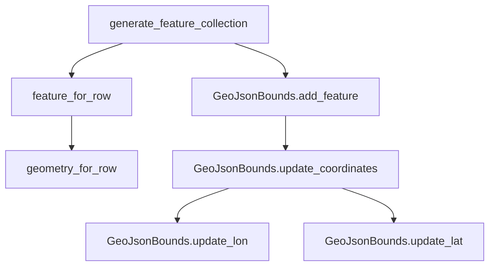
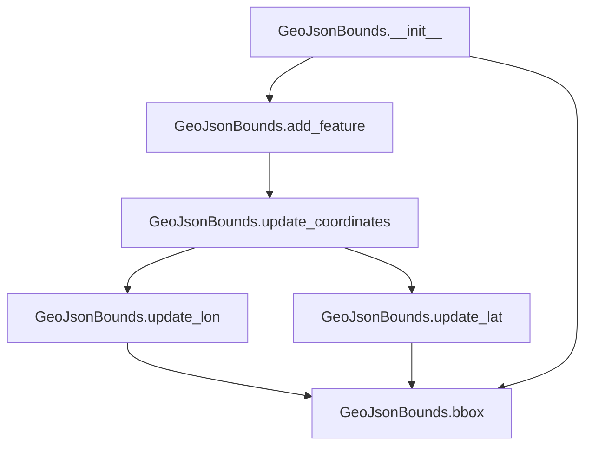

# `csvjson.py`

## `csvkit.utilities.csvjson.CSVJSON` · *class*

## Summary:
CSVJSON is a command-line utility that converts CSV files into JSON or GeoJSON format with various formatting and geospatial options.

## Description:
CSVJSON provides functionality to transform CSV data into JSON or GeoJSON representations. It supports standard JSON output with options for indentation, keying by a specific column, and streaming formats. When geospatial coordinates are provided via --lat and --lon arguments, it generates GeoJSON output including Point geometries. The utility can process both regular CSV files and streaming input, with configurable CSV dialect detection and type inference settings.

## State:
- args (argparse.Namespace): Parsed command-line arguments containing conversion options
- json_kwargs (dict): Configuration dictionary for JSON serialization (currently only contains 'indent')
- output_file (file-like object): Output stream for writing results (inherited from CSVKitUtility)
- input_file (file-like object): Input stream for reading CSV data (inherited from CSVKitUtility)
- reader_kwargs (dict): Configuration parameters for CSV readers (inherited from CSVKitUtility)

## Lifecycle:
- Creation: Instantiated via CSVKitUtility constructor with optional arguments and output file
- Usage: Run through CSVKitUtility.run() which orchestrates argument parsing, input handling, and main() execution
- Destruction: Automatic cleanup of file handles occurs in parent class run() method

## Method Map:
```mermaid
graph TD
    A[CSVJSON.main] --> B{can_stream()}
    B -->|True| C[streaming_output_ndgeojson or streaming_output_ndjson]
    B -->|False| D{is_geo()}
    D -->|True| E[output_geojson]
    D -->|False| F[output_json]
    C --> G[GeoJsonGenerator.feature_for_row or OrderedDict construction]
    E --> H[GeoJsonGenerator.generate_feature_collection]
    F --> I[Table.to_json]
    G --> J[dump_json]
    H --> J
    I --> J
    J[CSVJSON.dump_json] --> K[json.dump]
```

## Raises:
- SystemExit: Raised by argparser.error() when validation fails for required arguments (--lat/--lon combinations, --crs, --type, --geometry)
- ValueError: Raised by match_column_identifier when column identifiers are invalid
- IOError: Raised by file operations when input/output files cannot be accessed

## Example:
```python
# Convert CSV to standard JSON with indentation
csvjson -i 2 data.csv > output.json

# Convert CSV to GeoJSON with lat/lon columns
csvjson --lat Latitude --lon Longitude data.csv > geojson_output.json

# Stream CSV to NDJSON format
csvjson --stream data.csv > ndjson_output.json

# Convert CSV to keyed JSON object
csvjson -k id data.csv > keyed_output.json
```

### `csvkit.utilities.csvjson.CSVJSON.add_arguments` · *method*

## Summary:
Configures command-line arguments for the CSV to JSON conversion utility, setting up all available options for JSON formatting, GeoJSON generation, and CSV parsing behavior.

## Description:
This method initializes the argument parser with all available command-line options for converting CSV files to JSON format. It is invoked during the initialization phase of the CSVJSON utility to establish the complete command-line interface. The method defines arguments for controlling JSON output formatting (indentation, streaming), GeoJSON generation (latitude/longitude columns, CRS), and CSV parsing behavior (sniffing limits, type inference). This separation of concerns allows for clean command-line interface management and makes the utility extensible.

## Args:
    None directly - operates on self.argparser instance

## Returns:
    None

## Raises:
    None explicitly raised

## State Changes:
    Attributes READ: self.argparser
    Attributes WRITTEN: None

## Constraints:
    Preconditions: 
    - self.argparser must be initialized and accessible
    - This method should only be called once during utility setup
    
    Postconditions:
    - Command-line argument parser contains all defined options
    - Argument parser is properly configured for CSVJSON utility usage

## Side Effects:
    - Modifies the self.argparser instance by adding multiple argument definitions
    - No external I/O operations or service calls

### `csvkit.utilities.csvjson.CSVJSON.main` · *method*

## Summary:
Main execution method for the CSVJSON utility that orchestrates CSV-to-JSON conversion with support for streaming, geospatial formats, and various output configurations.

## Description:
This method serves as the primary entry point for the CSVJSON utility, implementing the complete workflow for converting CSV data to JSON or GeoJSON formats. It validates command-line arguments for geographic coordinate requirements, configures JSON output formatting, and delegates to appropriate output methods based on streaming capability and geospatial configuration. The method handles both buffered and streaming output modes, supporting newline-delimited JSON formats and traditional JSON arrays.

## Args:
    self: The CSVJSON utility instance containing parsed command-line arguments and configuration

## Returns:
    None: This method performs I/O operations and does not return a value

## Raises:
    SystemExit: Raised by self.argparser.error() when validation constraints are violated

## State Changes:
    Attributes READ: 
        - self.args.lat, self.args.lon, self.args.crs, self.args.type, self.args.geometry, self.args.key, self.args.streamOutput, self.args.indent
    Attributes WRITTEN: 
        - self.json_kwargs: Dictionary containing JSON formatting options (indentation)

## Constraints:
    Preconditions:
        - self.args must be properly initialized with command-line arguments
        - self.args.lat and self.args.lon must be accessible (can be None/empty)
        - self.args.key, self.args.streamOutput, self.args.indent must be accessible
        - self.can_stream(), self.additional_input_expected(), self.is_geo() must be callable
        - self.streaming_output_ndgeojson(), self.streaming_output_ndjson(), self.output_geojson(), self.output_json() must be callable

    Postconditions:
        - Command-line argument validation is completed
        - self.json_kwargs is initialized with indentation settings
        - Either streaming or buffered output methods are called based on configuration
        - Appropriate error messages are displayed for invalid argument combinations

## Side Effects:
    - Writes to stderr when waiting for standard input (sys.stderr.write)
    - Calls various output methods that write to self.output_file
    - May read from stdin when additional input is expected
    - May raise SystemExit for invalid argument combinations

### `csvkit.utilities.csvjson.CSVJSON.dump_json` · *method*

## Summary:
Writes JSON-formatted data to the output file with configurable formatting options.

## Description:
Serializes Python data structures into JSON format and writes them to the configured output file. This method provides a standardized way to output JSON data while supporting custom JSON serialization parameters and optional newline termination.

## Args:
    data (Any): The Python data structure to serialize into JSON format
    newline (bool): When True, appends a newline character after the JSON data. Defaults to False

## Returns:
    None: This method does not return any value

## Raises:
    TypeError: If data contains non-serializable objects that cannot be converted by default_str_decimal
    IOError: If writing to self.output_file fails

## State Changes:
    Attributes READ: self.output_file, self.json_kwargs
    Attributes WRITTEN: None

## Constraints:
    Preconditions: 
    - self.output_file must be a file-like object opened for writing
    - self.json_kwargs must be a dictionary of keyword arguments for json.dump()
    - data must be serializable by the json module or convertible by default_str_decimal
    
    Postconditions:
    - The data is written to self.output_file in JSON format
    - If newline=True, a newline character is appended to the output

## Side Effects:
    - Writes to the file represented by self.output_file
    - May cause I/O errors if the output file is not writable

### `csvkit.utilities.csvjson.CSVJSON.can_stream` · *method*

## Summary:
Determines whether the CSV to JSON conversion can be streamed directly to output without buffering.

## Description:
This method evaluates multiple configuration flags to decide if the conversion process can stream results directly to stdout instead of building a complete JSON structure in memory first. It's used to optimize memory usage for large CSV files by enabling streaming output when all conditions are met. This method is part of the CSVJSON utility class that inherits from CSVKitUtility.

## Args:
    None

## Returns:
    bool: True if all streaming conditions are satisfied, False otherwise.

## Raises:
    None

## State Changes:
    Attributes READ: self.args.streamOutput, self.args.no_inference, self.args.sniff_limit, self.args.skip_lines

## Constraints:
    Preconditions: The method assumes self.args is properly initialized with command-line arguments from CSVKitUtility.
    Postconditions: Returns a boolean value indicating streaming capability based on argument combinations.

## Side Effects:
    None

### `csvkit.utilities.csvjson.CSVJSON.is_geo` · *method*

## Summary:
Determines whether the current CSV processing configuration specifies geographic coordinate columns for latitude and longitude.

## Description:
This method evaluates whether both the latitude and longitude column identifiers have been provided in the command-line arguments. It serves as a predicate to check if the CSV data should be treated as geospatial data requiring special JSON formatting. The method is typically used in the main processing loop to conditionally apply geographic data transformations.

The method is called during the main processing phase of CSVJSON utility to determine if coordinate columns should be extracted and formatted as GeoJSON properties. This logic is separated into its own method to improve readability and maintainability of the main processing logic.

## Args:
    self: The CSVJSON utility instance containing parsed command-line arguments.

## Returns:
    bool: True if both self.args.lat and self.args.lon are truthy (non-None, non-empty values), False otherwise.

## Raises:
    None: This method does not raise any exceptions.

## State Changes:
    Attributes READ: 
        - self.args.lat: Command-line argument for latitude column identifier
        - self.args.lon: Command-line argument for longitude column identifier

    Attributes WRITTEN: 
        - None: This method does not modify any instance attributes.

## Constraints:
    Preconditions:
        - The CSVJSON instance must have been initialized with command-line arguments
        - Both self.args.lat and self.args.lon must be accessible attributes (they may be None or empty strings)

    Postconditions:
        - Returns a boolean value indicating the presence of both coordinate column specifications
        - The method performs no side effects or state modifications

## Side Effects:
    - None: This method performs no I/O, external service calls, or mutations to objects outside self.

### `csvkit.utilities.csvjson.CSVJSON.read_csv_to_table` · *method*

*No documentation generated.*

### `csvkit.utilities.csvjson.CSVJSON.output_json` · *method*

*No documentation generated.*

### `csvkit.utilities.csvjson.CSVJSON.output_geojson` · *method*

## Summary:
Converts CSV geographic data to GeoJSON format, either as individual features or a complete FeatureCollection.

## Description:
Processes CSV data containing geographic information and outputs it in GeoJSON format. This method serves as the core conversion logic for the csvjson utility when GeoJSON output is requested. It reads the CSV data into a table structure, creates a GeoJSON generator, and outputs the result either as streaming features or a complete FeatureCollection based on the streamOutput flag. This method is called during the main processing pipeline when geographic data is detected via --lat and --lon arguments.

## Args:
    None: This is a method of the CSVJSON class and operates on self.

## Returns:
    None: This method does not return any value.

## Raises:
    None explicitly raised by this method, though underlying operations may raise exceptions from:
    - CSV reading failures when calling read_csv_to_table()
    - JSON serialization errors when calling dump_json()
    - GeoJSON generation errors from GeoJsonGenerator methods

## State Changes:
    Attributes READ: self.args, self.input_file, self.output_file
    Attributes WRITTEN: None

## Constraints:
    Preconditions:
    - self.args must contain valid configuration for GeoJSON output including streamOutput flag
    - self.input_file must be a readable file-like object containing CSV data
    - self.output_file must be a writable file-like object for JSON output
    - Geographic columns (--lat, --lon) must be properly specified in command-line arguments
    
    Postconditions:
    - GeoJSON output is written to self.output_file
    - If streamOutput is True, each row is processed and output individually as a GeoJSON Feature
    - If streamOutput is False, all rows are processed into a single GeoJSON FeatureCollection

## Side Effects:
    - Reads from the file represented by self.input_file
    - Writes JSON-formatted GeoJSON data to the file represented by self.output_file
    - May cause I/O errors if input file is unreadable or output file is unwritable

### `csvkit.utilities.csvjson.CSVJSON.streaming_output_ndjson` · *method*

## Summary:
Converts CSV rows into newline-delimited JSON objects, streaming output one row at a time.

## Description:
Processes CSV input line-by-line to create JSON objects where each row becomes a separate JSON object in the output stream. This method is specifically designed for streaming output mode (--stream) and handles missing columns gracefully by setting them to null values. It's called during the execution of CSVJSON utility when streaming output is enabled and the data is not GeoJSON.

This method is part of the CSVJSON utility's streaming output functionality and is invoked when the --stream flag is used with regular JSON output (not GeoJSON). It reads the CSV file using agate.csv.reader with configured reader_kwargs, processes each row to map column names to values, and outputs each row as a separate JSON object terminated by a newline character.

## Args:
    None: This method takes no explicit arguments beyond self

## Returns:
    None: This method does not return any value

## Raises:
    IndexError: When a row has fewer columns than the header row, causing an IndexError when accessing row[i]
    IOError: If reading from self.input_file or writing to self.output_file fails
    TypeError: If data contains non-serializable objects that cannot be converted by default_str_decimal

## State Changes:
    Attributes READ: self.input_file, self.reader_kwargs, self.output_file, self.json_kwargs
    Attributes WRITTEN: None

## Constraints:
    Preconditions:
    - self.input_file must be a readable file-like object containing CSV data
    - self.reader_kwargs must be a dictionary of keyword arguments for agate.csv.reader
    - CSV input must have at least one header row followed by data rows
    - self.output_file must be a writable file-like object
    
    Postconditions:
    - Each CSV row is converted to a JSON object and written to self.output_file
    - Output consists of newline-delimited JSON objects (one per CSV row)
    - Missing columns in rows are filled with null values
    - Each JSON object is terminated with a newline character

## Side Effects:
    - Reads from the file represented by self.input_file
    - Writes newline-delimited JSON objects to the file represented by self.output_file
    - May cause I/O errors if either file handle is not properly opened
    - Uses the dump_json method to perform actual JSON serialization

### `csvkit.utilities.csvjson.CSVJSON.streaming_output_ndgeojson` · *method*

*No documentation generated.*

## `csvkit.utilities.csvjson.GeoJsonGenerator` · *class*

## Summary:
A class for converting tabular geographic data into GeoJSON FeatureCollection format with support for bounding box calculation and coordinate reference systems.

## Description:
The GeoJsonGenerator class provides functionality to transform CSV data containing geographic information into GeoJSON format. It handles various input configurations including separate latitude/longitude columns, pre-formatted geometry columns, and optional metadata such as bounding boxes and coordinate reference systems. The class is designed to work with csvkit's command-line utilities and provides methods for generating complete GeoJSON FeatureCollections from tabular data.

## State:
- args: Object containing command-line arguments for configuration (lat, lon, type, geometry, key, no_bbox, crs, zero_based)
- column_names: List of column names from the input table
- lat_column: Zero-based index of the latitude column, or None if not specified
- lon_column: Zero-based index of the longitude column, or None if not specified
- type_column: Zero-based index of the feature type column, or None if not specified
- geometry_column: Zero-based index of the geometry column, or None if not specified
- id_column: Zero-based index of the ID column, or None if not specified

## Lifecycle:
- Creation: Instantiate with args and column_names parameters
- Usage: Call generate_feature_collection(table) to process a table into GeoJSON
- Destruction: No explicit cleanup required

## Method Map:


## Raises:
- None explicitly raised by __init__ method

## Example:
```python
# Create generator with command-line arguments
generator = GeoJsonGenerator(args, ['name', 'lat', 'lon', 'city'])
# Process table data
geojson = generator.generate_feature_collection(table)
```

## Nested Class: GeoJsonBounds
The GeoJsonBounds class maintains minimum and maximum longitude and latitude values to compute bounding boxes for GeoJSON FeatureCollections.

### State:
- min_lon: Minimum longitude value encountered, or None
- min_lat: Minimum latitude value encountered, or None
- max_lon: Maximum longitude value encountered, or None
- max_lat: Maximum latitude value encountered, or None

### Methods:
- __init__: Initializes all boundary values to None
- bbox: Returns the bounding box as [min_lon, min_lat, max_lon, max_lat]
- add_feature: Updates boundaries based on a feature's geometry coordinates
- update_lat: Updates minimum and maximum latitude values
- update_lon: Updates minimum and maximum longitude values
- update_coordinates: Recursively updates boundaries for coordinate arrays

### `csvkit.utilities.csvjson.GeoJsonGenerator.__init__` · *method*

## Summary:
Initializes a GeoJsonGenerator instance by mapping command-line column identifiers to zero-based indices for geographic data processing.

## Description:
Configures the GeoJsonGenerator with command-line arguments and column names to establish which columns contain latitude, longitude, geometry, type, and ID information for GeoJSON generation. This method processes user-provided column identifiers (names or numbers) into zero-based indices using the match_column_identifier utility function. The initialization sets up all necessary column mappings required for subsequent GeoJSON feature generation.

## Args:
    args (object): Command-line arguments containing lat, lon, type, geometry, and key options
    column_names (list[str]): List of column names from the input CSV file

## Returns:
    None: This method initializes instance attributes and does not return a value

## Raises:
    ColumnIdentifierError: When column identifiers for lat, lon, type, geometry, or key are invalid (thrown by match_column_identifier)

## State Changes:
    Attributes READ: self.args, self.args.lat, self.args.lon, self.args.type, self.args.geometry, self.args.key, self.args.zero_based
    Attributes WRITTEN: self.args, self.column_names, self.lat_column, self.lon_column, self.type_column, self.geometry_column, self.id_column

## Constraints:
    Preconditions:
        - args must contain lat and lon attributes for mandatory geographic coordinates
        - column_names must be a non-empty list of strings
        - args.zero_based must be a boolean indicating column indexing convention
        - args.lat and args.lon must be valid column identifiers (name or number)
        
    Postconditions:
        - self.lat_column and self.lon_column are set to zero-based indices (integers)
        - self.type_column, self.geometry_column, and self.id_column are either zero-based indices (integers) or None
        - All column identifiers are validated and converted to appropriate indices via match_column_identifier

## Side Effects:
    None: This method performs no I/O operations or external service calls

### `csvkit.utilities.csvjson.GeoJsonGenerator.generate_feature_collection` · *method*

## Summary:
Creates a GeoJSON FeatureCollection from tabular geographic data, optionally including bounding box and coordinate reference system metadata.

## Description:
Transforms a table of geographic data into a GeoJSON FeatureCollection structure by processing each row into individual GeoJSON features. This method serves as the main entry point for generating GeoJSON output and delegates feature creation to `feature_for_row()` while managing bounding box and CRS metadata through the nested `GeoJsonBounds` class.

## Args:
    table (agate.Table): The input table containing geographic data rows to convert into GeoJSON features.

## Returns:
    OrderedDict: A GeoJSON FeatureCollection object with the following structure:
        - 'type': String 'FeatureCollection'
        - 'features': List of individual GeoJSON features created from table rows
        - 'bbox': Optional list [min_lon, min_lat, max_lon, max_lat] if --no-bbox is not specified
        - 'crs': Optional coordinate reference system definition if --crs argument is provided

## Raises:
    None explicitly raised by this method, though underlying operations may raise exceptions from:
    - JSON parsing errors when processing geometry columns
    - Value conversion errors when parsing latitude/longitude values
    - Invalid coordinate formats during bounding box calculations

## State Changes:
    Attributes READ: 
        - self.args.no_bbox: Controls inclusion of bounding box calculation
        - self.args.crs: Controls inclusion of coordinate reference system metadata
    Attributes WRITTEN: None

## Constraints:
    Preconditions:
        - Input table must contain valid geographic data rows
        - Column identifiers (lat, lon, geometry, key, type) must be properly configured in the generator instance
        - Table rows must be iterable and contain sufficient columns for geographic data processing
    
    Postconditions:
        - Returns a properly formatted GeoJSON FeatureCollection OrderedDict
        - Bounding box is computed only if --no-bbox flag is not set
        - CRS information is included only if --crs argument is provided

## Side Effects:
    None directly observable from this method. However, the method indirectly causes:
    - Calls to self.feature_for_row() for each table row
    - Calls to self.GeoJsonBounds.add_feature() for each feature when bounding box calculation is enabled
    - Potential JSON parsing operations when processing geometry columns

### `csvkit.utilities.csvjson.GeoJsonGenerator.feature_for_row` · *method*

## Summary:
Creates a GeoJSON Feature object from a CSV row by processing properties, ID, and geometry data.

## Description:
This method transforms a single row of CSV data into a GeoJSON Feature object. It processes each cell in the row, excluding special geographic metadata columns, and builds a properties dictionary. It also assigns an ID if specified and constructs the geometry field by calling the geometry_for_row method. This method is part of the GeoJsonGenerator class and is called during the conversion of CSV data to GeoJSON format.

## Args:
    row (list): A list representing a single row of CSV data with values in column order

## Returns:
    OrderedDict: A GeoJSON Feature object containing type, properties, and geometry fields. The geometry field is always present and populated by calling self.geometry_for_row(row).

## Raises:
    None explicitly raised

## State Changes:
    Attributes READ: self.column_names, self.type_column, self.lat_column, self.lon_column, self.geometry_column, self.id_column
    Attributes WRITTEN: None

## Constraints:
    Preconditions: 
    - The row parameter must be a list with length matching the number of columns
    - The GeoJsonGenerator instance must have properly initialized column identifiers
    Postconditions:
    - The returned OrderedDict follows the GeoJSON Feature specification
    - Geometry field is always present in the result
    - Properties dictionary is never None

## Side Effects:
    Calls self.geometry_for_row(row) which may involve JSON parsing or coordinate conversion

### `csvkit.utilities.csvjson.GeoJsonGenerator.geometry_for_row` · *method*

## Summary:
Constructs a GeoJSON Point geometry object from latitude and longitude columns or parses a geometry column as JSON.

## Description:
This method generates a GeoJSON Point geometry representation for a given CSV row. It first checks if a dedicated geometry column is specified, and if so, parses it as JSON. Otherwise, it attempts to construct a Point geometry from separate latitude and longitude columns. The method handles invalid numeric values gracefully by setting coordinates to None.

## Args:
    row (list): A list representing a single row of CSV data, where elements correspond to columns.

## Returns:
    OrderedDict or None: A GeoJSON Point geometry object as an OrderedDict with 'type' and 'coordinates' keys, or None if coordinates cannot be determined.

## Raises:
    None explicitly raised, though ValueError may occur internally during float conversion.

## State Changes:
    Attributes READ: self.geometry_column, self.lat_column, self.lon_column
    Attributes WRITTEN: None

## Constraints:
    Preconditions: 
    - The row must be a list-like object with valid indices for the specified columns.
    - If geometry_column is set, the corresponding cell must contain valid JSON.
    - If lat_column and lon_column are set, their respective cells must contain numeric values.
    
    Postconditions:
    - If geometry_column is specified and valid, the returned object is parsed from JSON.
    - If lat/lon columns are specified, the returned object contains valid coordinate values.
    - If no valid coordinates can be extracted, None is returned.

## Side Effects:
    None

## `csvkit.utilities.csvjson.GeoJsonBounds` · *class*

## Summary:
A utility class for tracking and updating geographic bounding box coordinates from GeoJSON features.

## Description:
The GeoJsonBounds class maintains minimum and maximum longitude and latitude values to define a bounding box around geographic features. It is designed to process GeoJSON features incrementally, updating the bounding box as new features are added. This class serves as a stateful container for geographic bounds calculation and is typically used when converting CSV data to GeoJSON format.

## State:
- min_lon: float or None, represents the minimum longitude value; initially None
- min_lat: float or None, represents the minimum latitude value; initially None  
- max_lon: float or None, represents the maximum longitude value; initially None
- max_lat: float or None, represents the maximum latitude value; initially None

All attributes are initialized to None and are updated through the coordinate update methods. The class maintains the invariant that min values are always less than or equal to their corresponding max values once set.

## Lifecycle:
- Creation: Instantiate with `GeoJsonBounds()` constructor, which initializes all coordinate values to None
- Usage: Call `add_feature(feature)` with GeoJSON feature objects to incrementally update bounds, or directly call `update_coordinates(coordinates)` with coordinate arrays
- Destruction: No explicit cleanup required; standard Python garbage collection handles object lifetime

## Method Map:


## Raises:
- No exceptions are explicitly raised by the constructor or any methods in this class

## Example:
```python
bounds = GeoJsonBounds()
feature1 = {
    "type": "Feature",
    "geometry": {
        "type": "Point",
        "coordinates": [-74.006, 40.7128]
    }
}
feature2 = {
    "type": "Feature", 
    "geometry": {
        "type": "Point",
        "coordinates": [-118.2437, 34.0522]
    }
}
bounds.add_feature(feature1)
bounds.add_feature(feature2)
bbox = bounds.bbox()  # Returns [-118.2437, 34.0522, -74.006, 40.7128]
```

### `csvkit.utilities.csvjson.GeoJsonBounds.__init__` · *method*

## Summary:
Initializes a GeoJsonBounds object with all geographic coordinate boundaries set to None.

## Description:
This constructor method initializes the bounding box coordinate attributes to None, establishing the initial state for tracking geographic boundaries. The object is designed to be used incrementally as geographic features are processed, with coordinate values being updated through dedicated methods rather than being set directly in the constructor.

## Args:
    None

## Returns:
    None

## Raises:
    None

## State Changes:
    Attributes READ: None
    Attributes WRITTEN: 
    - self.min_lon: Set to None
    - self.min_lat: Set to None  
    - self.max_lon: Set to None
    - self.max_lat: Set to None

## Constraints:
    Preconditions: None
    Postconditions: All coordinate boundary attributes are initialized to None

## Side Effects:
    None

### `csvkit.utilities.csvjson.GeoJsonBounds.bbox` · *method*

## Summary:
Returns the bounding box coordinates as a list in the order [min_lon, min_lat, max_lon, max_lat].

## Description:
This method provides access to the computed geographic bounds of features processed by the GeoJsonBounds instance. It is typically called after processing multiple GeoJSON features to retrieve the overall spatial extent.

## Args:
    None

## Returns:
    list[float]: A list containing four floating-point numbers representing the bounding box coordinates in the order [min_longitude, min_latitude, max_longitude, max_latitude]. Returns [None, None, None, None] if no features have been processed.

## Raises:
    None

## State Changes:
    Attributes READ: self.min_lon, self.min_lat, self.max_lon, self.max_lat
    Attributes WRITTEN: None

## Constraints:
    Preconditions: The GeoJsonBounds instance must have been initialized and may have had features processed through the add_feature method.
    Postconditions: The returned list contains the current minimum and maximum longitude and latitude values stored in the instance.

## Side Effects:
    None

### `csvkit.utilities.csvjson.GeoJsonBounds.add_feature` · *method*

## Summary:
Updates the bounding box coordinates by incorporating the geometry coordinates from a GeoJSON feature.

## Description:
This method processes a GeoJSON feature to extract and update the minimum and maximum longitude and latitude values that define the bounding box. It is designed to be called during the parsing of GeoJSON data to progressively build the overall spatial extent of the dataset. The method specifically checks for the presence of geometry and coordinates within the feature before attempting to process them. This method is part of a larger GeoJSON bounds calculation utility that tracks spatial extents across multiple features.

## Args:
    feature (dict): A GeoJSON feature object that may contain a 'geometry' key with a 'coordinates' sub-key.

## Returns:
    None: This method does not return any value.

## Raises:
    None: This method does not explicitly raise exceptions.

## State Changes:
    Attributes READ: self.min_lon, self.min_lat, self.max_lon, self.max_lat
    Attributes WRITTEN: self.min_lon, self.min_lat, self.max_lon, self.max_lat

## Constraints:
    Preconditions: The feature argument must be a dictionary-like object that supports the 'in' operator for key checking. The feature should contain a 'geometry' key with a 'coordinates' sub-key for meaningful updates.
    Postconditions: After execution, the bounding box attributes (min_lon, min_lat, max_lon, max_lat) may be updated if the feature contains valid geometry coordinates. If no valid coordinates are found, the attributes remain unchanged.

## Side Effects:
    Mutates the instance's bounding box coordinate attributes (min_lon, min_lat, max_lon, max_lat) by calling update_lon() and update_lat() methods.

### `csvkit.utilities.csvjson.GeoJsonBounds.update_lat` · *method*

## Summary:
Updates the minimum and maximum latitude bounds based on a new latitude value.

## Description:
This method maintains the bounding box coordinates by updating the minimum and maximum latitude values when a new latitude is encountered. It is part of the GeoJsonBounds class that tracks geographic boundaries of features in a GeoJSON dataset. The method is called during the processing of GeoJSON features to continuously update the spatial extent.

Known callers:
- GeoJsonBounds.update_coordinates: Called when processing coordinate arrays in GeoJSON features to update bounds incrementally.

This method exists as a separate utility to encapsulate the logic for updating latitude bounds, promoting code reuse and clarity in the coordinate update process.

## Args:
    lat (float): The new latitude value to consider for updating bounds.

## Returns:
    None

## Raises:
    None

## State Changes:
    Attributes READ: self.min_lat, self.max_lat
    Attributes WRITTEN: self.min_lat, self.max_lat

## Constraints:
    Preconditions: The method assumes that lat is a numeric value (float or int).
    Postconditions: After execution, self.min_lat and self.max_lat are updated to reflect the new latitude value if it extends the current bounds.

## Side Effects:
    None

### `csvkit.utilities.csvjson.GeoJsonBounds.update_lon` · *method*

## Summary:
Updates the minimum and maximum longitude values for a geographic bounding box based on a new longitude coordinate, maintaining the bounding box boundaries.

## Description:
This method updates the geographic bounding box coordinates by comparing the input longitude against existing minimum and maximum longitude values. It is called during the processing of GeoJSON features to continuously track the longitudinal extent of geographic data. The method ensures that self.min_lon and self.max_lon always represent the smallest and largest longitude values encountered so far.

## Args:
    lon (float): The longitude coordinate to evaluate against existing bounds

## Returns:
    None

## Raises:
    None

## State Changes:
    Attributes READ: self.min_lon, self.max_lon
    Attributes WRITTEN: self.min_lon, self.max_lon

## Constraints:
    Preconditions: The method assumes that self.min_lon and self.max_lon are either None or numeric values
    Postconditions: After execution, self.min_lon contains the smaller of the previous minimum longitude and the input longitude, while self.max_lon contains the larger of the previous maximum longitude and the input longitude

## Side Effects:
    None

### `csvkit.utilities.csvjson.GeoJsonBounds.update_coordinates` · *method*

*No documentation generated.*

## `csvkit.utilities.csvjson.launch_new_instance` · *function*

## Summary:
Launches a new instance of the CSVJSON utility to convert CSV data into JSON or GeoJSON format.

## Description:
This function serves as the entry point for launching the CSVJSON command-line utility. It creates an instance of the CSVJSON class and invokes its run() method to execute the CSV-to-JSON conversion workflow. The function is designed to be called by the command-line interface to initiate processing of CSV data according to the specified arguments.

The function extracts the instantiation and execution logic into a separate function to maintain clean separation between the utility's construction and execution phases. This approach allows for easier testing and potential reuse in different contexts while keeping the command-line interface simple and focused. It follows the same pattern used by other csvkit utilities such as csvcut, csvclean, csvsort, etc.

## Args:
    None: This function takes no parameters.

## Returns:
    None: This function does not return any value.

## Raises:
    Any exceptions that may be raised by CSVJSON.__init__() or CSVJSON.run() methods, including:
    - SystemExit: Raised by argparser.error() when validation fails for required arguments (--lat/--lon combinations, --crs, --type, --geometry)
    - ValueError: Raised by match_column_identifier when column identifiers are invalid
    - IOError: Raised by file operations when input/output files cannot be accessed

## Constraints:
    Preconditions:
        - The csvkit.utilities.csvjson module must be properly imported
        - Command-line arguments must be available in sys.argv or equivalent
        
    Postconditions:
        - A CSVJSON instance is created and its run() method is invoked
        - All command-line arguments are processed through the CSVKitUtility framework
        - Input/output file handles are managed by the CSVKitUtility.run() method

## Side Effects:
    - Reads command-line arguments from sys.argv
    - May open and close input/output files during execution
    - Writes JSON or GeoJSON data to stdout or specified output file
    - May modify global state through CSVKitUtility's argument parsing and file handling

## Control Flow:
```mermaid
flowchart TD
    A[launch_new_instance] --> B[Create CSVJSON instance]
    B --> C[Call utility.run()]
    C --> D{CSVKitUtility.run executes}
    D --> E[Argument parsing occurs]
    E --> F[Input file handling occurs]
    F --> G[Main processing logic executes]
    G --> H[JSON/GeoJSON output generated]
    H --> I[Output written to stdout/file]
    I --> J[File handles closed]
    J --> K[Function completes]
```

## Examples:
```python
# Typical usage from command line
# csvjson -i 2 data.csv > output.json

# Convert CSV to GeoJSON with lat/lon columns
# csvjson --lat Latitude --lon Longitude data.csv > geojson_output.json

# Programmatic usage (though less common)
from csvkit.utilities.csvjson import launch_new_instance
launch_new_instance()
```

