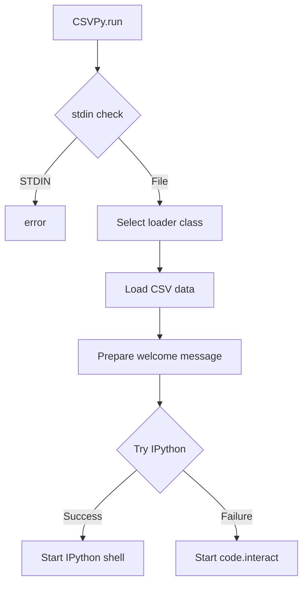

# `csvpy.py`

## `csvkit.utilities.csvpy.CSVPy` · *class*

## Summary:
CSVPy is a command-line utility that loads a CSV file into a Python object and drops the user into an interactive Python shell for exploration and analysis.

## Description:
CSVPy serves as an interactive debugging and exploration tool for CSV data. It allows users to load CSV files into various Python objects (standard reader, DictReader, or agate Table) and then enter an interactive Python session where they can manipulate and inspect the loaded data. This utility is particularly useful for data analysis, testing CSV parsing configurations, and exploring data structures interactively. The class inherits from CSVKitUtility, leveraging its argument parsing and file handling capabilities while extending them with interactive shell functionality.

## State:
- input_file (file-like object): Set by parent CSVKitUtility during run() method execution
- args (argparse.Namespace): Parsed command-line arguments containing as_dict and as_agate flags
- reader_kwargs (dict): Configuration parameters inherited from parent for CSV reader setup
- output_file (file-like object): Inherited from parent for output handling

## Lifecycle:
- Creation: Instantiate with optional command-line arguments (via parent constructor)
- Usage: Call run() method which:
  1. Validates input file isn't stdin
  2. Determines appropriate CSV loading class based on flags (--dict or --agate)
  3. Loads CSV data into selected object type
  4. Starts interactive Python shell with loaded data available as variable
- Destruction: Automatic cleanup handled by parent class run() method

## Method Map:


## Raises:
- SystemExit: Raised by argparser.error() when input is piped via STDIN
- ImportError: Raised when IPython is not available and falls back to code.interact

## Example:
```python
# Load CSV as standard reader and enter interactive shell
$ csvpy data.csv

# Load CSV as DictReader and enter interactive shell  
$ csvpy --dict data.csv

# Load CSV as agate Table and enter interactive shell
$ csvpy --agate data.csv

# Within the interactive shell, you can now explore the data:
# >>> reader.fieldnames  # For standard reader or DictReader
# >>> table.column_names  # For agate Table
# >>> list(reader)[:5]  # Show first 5 rows
```

### `csvkit.utilities.csvpy.CSVPy.add_arguments` · *method*

## Summary:
Configures command-line arguments for the CSV Python shell utility, enabling users to specify CSV loading formats.

## Description:
This method sets up the argument parser with two optional flags that control how the CSV file is loaded into memory: as a standard DictReader or as an agate Table. It is part of the CSVPy utility class that provides an interactive Python shell environment for working with CSV data. The method is called during the initialization phase of the command-line utility to define available options.

## Args:
    None

## Returns:
    None

## Raises:
    None

## State Changes:
    Attributes READ: self.argparser
    Attributes WRITTEN: None

## Constraints:
    Preconditions: The method assumes self.argparser is properly initialized as an ArgumentParser instance.
    Postconditions: The argument parser will have two new boolean arguments added to its configuration.

## Side Effects:
    None

### `csvkit.utilities.csvpy.CSVPy.main` · *method*

## Summary:
Initializes an interactive Python session with a CSV file loaded into an agate data structure for exploration.

## Description:
This method provides an interactive shell environment where users can explore CSV data using the agate library. It loads the specified CSV file into either a DictReader, Table, or regular reader object depending on command-line arguments (--dict or --agate flags), then launches an interactive Python session with the data available as a variable. The method serves as the entry point for the csvpy utility, enabling users to inspect and manipulate CSV data programmatically.

## Args:
    self: The CSVPy utility instance containing input_file, args, and reader_kwargs attributes.

## Returns:
    None: This method does not return a value but exits the program after the interactive session ends.

## Raises:
    SystemExit: When input is provided via STDIN, which is not supported by csvpy.

## State Changes:
    Attributes READ: self.input_file, self.args, self.reader_kwargs, self.argparser
    Attributes WRITTEN: None

## Constraints:
    Preconditions: 
    - self.input_file must not be sys.stdin
    - The CSV file must be readable
    - Command-line arguments must be properly parsed
    Postconditions: 
    - An interactive Python session is launched with the CSV data loaded
    - The session exits cleanly after user interaction ends

## Side Effects:
    - Opens an interactive terminal session
    - May import IPython or Python's code module
    - Reads from the input file stream
    - Prints welcome message to terminal

## `csvkit.utilities.csvpy.launch_new_instance` · *function*

## Summary:
Launches a new interactive Python shell instance with a loaded CSV dataset for exploration and analysis.

## Description:
This function serves as the entry point for the csvpy command-line utility, creating a new CSVPy instance and executing its run method to initiate an interactive Python session with CSV data loaded into memory. It is typically invoked by the command-line interface when users want to explore CSV data interactively. The function delegates all complex logic to the CSVPy class, which handles CSV loading, shell initialization, and user interaction.

## Args:
    None

## Returns:
    None

## Raises:
    SystemExit: When CSVPy.run() detects invalid input (e.g., stdin usage) or when the utility completes execution

## Constraints:
    Preconditions:
    - The CSVPy class must be properly defined and imported
    - CSV data must be accessible via standard input or file arguments
    - Either IPython or the standard library `code` module must be available
    
    Postconditions:
    - An interactive Python shell session is initiated
    - CSV data is loaded into the shell's namespace as a variable
    - Shell session terminates when user exits

## Side Effects:
    - Opens and reads a CSV file from disk or stdin
    - Initializes an interactive Python shell (either IPython or code.interact)
    - May display welcome messages to stdout
    - Modifies global state through shell session execution

## Control Flow:
```mermaid
flowchart TD
    A[launch_new_instance] --> B[Create CSVPy instance]
    B --> C[Call CSVPy.run()]
    C --> D{CSVPy.run execution}
    D -->|Success| E[Interactive shell starts]
    D -->|Exception| F[Exception propagated]
```

## Examples:
```python
# This function is typically called via command line:
# $ csvpy data.csv

# Within the interactive shell, users can explore data:
# >>> reader.fieldnames  # For standard reader or DictReader
# >>> table.column_names  # For agate Table
# >>> list(reader)[:5]  # Show first 5 rows
```

