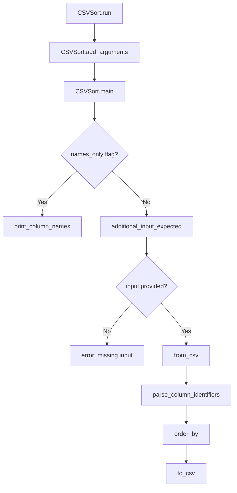

# `csvsort.py`

## `csvkit.utilities.csvsort.CSVSort` · *class*

## Summary:
CSVSort is a command-line utility that sorts CSV data by specified columns, mimicking the functionality of the Unix sort command but for tabular data.

## Description:
CSVSort provides a command-line interface for sorting CSV files based on one or more columns. It extends CSVKitUtility to handle argument parsing, file I/O, and CSV processing. The utility supports sorting by column names, indices, or ranges, with options for ascending/descending order and various CSV parsing configurations.

## State:
- argparser (argparse.ArgumentParser): Configured with standard CSVKit arguments plus sort-specific options
- args (argparse.Namespace): Parsed command-line arguments containing sort configuration
- input_file (file-like object): Input stream for reading CSV data
- output_file (file-like object): Output stream for writing sorted CSV data
- reader_kwargs (dict): Configuration for CSV reader (delimiter, quotechar, etc.)
- writer_kwargs (dict): Configuration for CSV writer (delimiter, quotechar, etc.)

## Lifecycle:
- Creation: Instantiate with optional command-line arguments or output file
- Usage: Call run() method which parses arguments and executes main() logic
- Main execution flow:
  1. If --names flag is set, prints column names and exits via print_column_names()
  2. Validates input presence via additional_input_expected()
  3. Reads CSV data into agate.Table with specified parsing options
  4. Parses column identifiers for sorting criteria using parse_column_identifiers()
  5. Sorts table by specified columns in requested order using order_by()
  6. Writes sorted data to output using to_csv()
- Destruction: File handles automatically closed by parent CSVKitUtility.run()

## Method Map:


## Raises:
- SystemExit: Raised by argparser.error() when input validation fails
- RequiredHeaderError: Raised by print_column_names() when --no-header-row is used with -n/--names
- Various exceptions from agate.Table operations (IOError, TypeError, etc.) propagated from underlying CSV processing

## Example:
```bash
# Sort by age column (ascending)
python -m csvkit.utilities.csvsort -c age data.csv > sorted.csv

# Sort by name column (descending)
python -m csvkit.utilities.csvsort -c name -r data.csv > sorted.csv

# Sort by multiple columns (first by department, then by salary)
python -m csvkit.utilities.csvsort -c department,salary data.csv > sorted.csv

# Display column names only
python -m csvkit.utilities.csvsort -n data.csv
```

### `csvkit.utilities.csvsort.CSVSort.add_arguments` · *method*

## Summary:
Configures command-line arguments for CSV sorting utility, defining available sorting options and behaviors.

## Description:
This method configures the argument parser with command-line options that control CSV sorting behavior. It is called during the initialization phase of the CSVSort utility to set up all available command-line arguments. The method defines flags for displaying column names, specifying sort columns, reversing sort order, controlling CSV dialect sniffing limits, and disabling type inference. This separation of argument configuration into its own method improves modularity and readability of the utility setup process.

## Args:
    None directly - operates on self.argparser instance

## Returns:
    None

## Raises:
    None explicitly raised

## State Changes:
    Attributes READ: self.argparser
    Attributes WRITTEN: None

## Constraints:
    Preconditions: 
    - self.argparser must be initialized and accessible
    - This method should only be called during utility initialization/setup phase
    
    Postconditions:
    - Command-line argument parser contains all defined options
    - Argument parser is properly configured with help text and default values

## Side Effects:
    - Modifies the self.argparser instance by adding new arguments
    - No external I/O operations or service calls

### `csvkit.utilities.csvsort.CSVSort.main` · *method*

## Summary:
Sorts CSV data by specified columns and writes the result to output, or displays column names if requested.

## Description:
Main execution method for the CSVSort utility that processes CSV input, sorts rows by specified columns, and outputs the sorted data. Handles special cases like displaying column names (--names-only) and validates input requirements. Uses agate library for CSV parsing and sorting operations.

## Args:
    self: Instance of CSVSort class inheriting from CSVKitUtility

## Returns:
    None

## Raises:
    SystemExit: When additional input is expected but not provided (via argparser.error)

## State Changes:
    Attributes READ: 
        - self.args.names_only
        - self.args.sniff_limit
        - self.args.skip_lines
        - self.args.columns
        - self.args.reverse
        - self.input_file
        - self.output_file
    Attributes WRITTEN: 
        - None (modifies state through method calls)

## Constraints:
    Preconditions:
        - self.args must contain all required attributes (names_only, sniff_limit, skip_lines, columns, reverse)
        - self.input_file must be readable and contain valid CSV data
        - self.output_file must be writable
        - If additional_input_expected() returns True, input must be available via stdin or input file

    Postconditions:
        - If names_only is True, column names are printed to output_file and method returns early
        - If additional_input_expected() returns True, an error is raised
        - CSV data is sorted according to specified columns and written to output_file

## Side Effects:
    I/O: Reads from self.input_file, writes to self.output_file
    External service calls: 
        - agate.Table.from_csv() for CSV parsing with support for various CSV dialects and column type inference
        - parse_column_identifiers() for validating and converting column identifiers to indices
        - table.order_by() for sorting rows by specified columns in ascending or descending order
        - table.to_csv() for writing sorted data to output with configurable CSV formatting options
    Mutations to objects outside self: None

## `csvkit.utilities.csvsort.launch_new_instance` · *function*

## Summary:
Launches a new instance of the CSV sorting utility by creating a CSVSort instance and executing its run method.

## Description:
This function serves as the entry point for launching the CSV sorting utility. It creates a new instance of the CSVSort class and invokes its run method to process command-line arguments and execute the sorting logic. The function is designed to be called by the command-line interface to initiate the sorting workflow.

## Args:
    None

## Returns:
    None

## Raises:
    SystemExit: Raised by CSVSort.run() when command-line argument validation fails
    Various exceptions: Propagated from CSVSort.run() and underlying CSV processing operations

## Constraints:
    Preconditions:
        - Required dependencies (agate, csvkit.cli) must be available
        - Command-line arguments must be properly formatted for CSVSort
        - Input file must be accessible if sorting is requested

    Postconditions:
        - A CSVSort instance is created and executed
        - Command-line arguments are parsed and processed
        - Sorting operation completes successfully or raises appropriate exceptions
        - File handles are automatically managed by the parent CSVKitUtility.run()

## Side Effects:
    - Reads input CSV file(s) from stdin or specified file paths
    - Writes sorted CSV output to stdout or specified output file
    - May display column names or error messages to stderr
    - Processes command-line arguments through argparse
    - Automatically manages file handle lifecycle through CSVKitUtility inheritance

## Control Flow:
```mermaid
flowchart TD
    A[launch_new_instance] --> B[Create CSVSort instance]
    B --> C[Call CSVSort.run()]
    C --> D{Argument parsing}
    D --> E{Input validation}
    E --> F{Sorting required?}
    F -->|Yes| G[Process CSV data]
    F -->|No| H[Display names or exit]
    G --> I[Sort by specified columns]
    I --> J[Write sorted output]
    J --> K[Exit normally]
```

## Examples:
```bash
# Launch CSV sorting utility with default settings
python -m csvkit.utilities.csvsort data.csv

# Launch with specific column sorting
python -m csvkit.utilities.csvsort -c age data.csv

# Launch with reverse sorting
python -m csvkit.utilities.csvsort -c name -r data.csv
```

