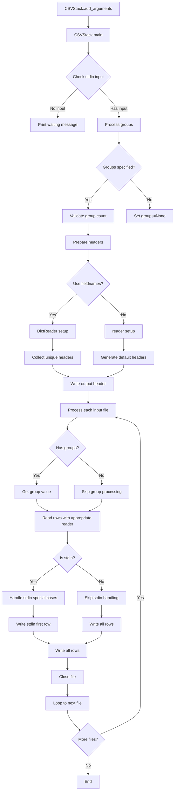

# `csvstack.py`

## `csvkit.utilities.csvstack._skip_lines` · *function*

## Summary:
Skips a specified number of lines from a file handle by reading and discarding them.

## Description:
This function reads and discards a predetermined number of lines from a file handle, typically used to skip header rows or other preliminary content in CSV files. It is called during the processing of CSV files to ensure that the correct data is read starting from the intended line.

## Args:
    f (file-like object): A file handle from which lines will be skipped.
    args (object): An object containing configuration arguments, specifically the `skip_lines` attribute.

## Returns:
    int: The number of lines that were skipped, which equals the value of `args.skip_lines`.

## Raises:
    ValueError: Raised when the `skip_lines` attribute of `args` is not an integer.

## Constraints:
    - Preconditions: The `args.skip_lines` must be an integer value greater than or equal to zero.
    - Postconditions: The file handle `f` will be advanced by the number of lines specified in `args.skip_lines`.

## Side Effects:
    - Reads from the file handle `f`, advancing its position in the file.
    - No external state mutations or I/O operations beyond the file handle.

## Control Flow:
```mermaid
flowchart TD
    A[Start _skip_lines] --> B{isinstance(args.skip_lines, int)?}
    B -- Yes --> C[Initialize skip_lines = args.skip_lines]
    C --> D[While skip_lines > 0]
    D --> E[f.readline()]
    E --> F[skip_lines -= 1]
    F --> D
    D -- Exit Loop --> G[Return skip_lines]
    B -- No --> H[raise ValueError]
    H --> I[End]
    G --> I
```

## Examples:
    # Example usage in a CSV processing context
    import io
    file_handle = io.StringIO("header1\\nheader2\\nrow1,col1\\nrow2,col2")
    class Args:
        skip_lines = 2
    result = _skip_lines(file_handle, Args())
    # file_handle is now positioned at "row1,col1\\nrow2,col2"
    # result == 2

## `csvkit.utilities.csvstack.CSVStack` · *class*

## Summary:
CSVStack is a command-line utility that stacks rows from multiple CSV files into a single output, optionally adding grouping columns to distinguish source files.

## Description:
CSVStack provides functionality to vertically concatenate multiple CSV files while preserving their structure. It can optionally add a grouping column to identify which source file each row originated from. This utility is particularly useful for combining datasets that share the same schema but come from different sources or time periods.

The class inherits from CSVKitUtility and implements the standard csvkit command-line interface pattern. It processes input files sequentially, reads their content, and writes merged output to stdout or a specified output file.

## State:
- description (str): Class-level attribute describing the utility's purpose
- override_flags (list): List of command-line flags that are disabled for this utility
- argparser (argparse.ArgumentParser): Argument parser instance configured with utility-specific arguments
- args (argparse.Namespace): Parsed command-line arguments containing:
  - input_paths (list): List of input file paths (default: ['-'] for stdin)
  - groups (str): Comma-separated grouping values (optional)
  - group_name (str): Name for the grouping column (default: 'group')
  - group_by_filenames (bool): Whether to use filenames as grouping values
- output_file (file-like object): Output stream for writing results
- reader_kwargs (dict): Configuration parameters for CSV readers
- writer_kwargs (dict): Configuration parameters for CSV writers
- input_file (file-like object): Input stream for reading CSV data

## Lifecycle:
- Creation: Instantiate with optional arguments list and output_file parameter
- Usage: Call run() method which orchestrates the complete execution flow:
  1. Parse command-line arguments using add_arguments()
  2. Open input files as needed
  3. Execute main() method for processing logic
  4. Close input files as needed
- Destruction: Automatic cleanup of file handles occurs in the parent class's run() method

## Method Map:


## Raises:
- SystemExit: Raised by argparser.error() when the number of grouping values doesn't match the number of input files
- ValueError: May be raised by underlying CSV reader/writer operations if invalid parameters are provided

## Example:
```python
# Stack two CSV files with grouping
# python csvstack.py file1.csv file2.csv -g "source1,source2" -n "dataset"

# Stack CSV files using filenames as group values
# python csvstack.py file1.csv file2.csv --filenames

# Stack CSV from stdin
# echo "a,b\nc,d" | python csvstack.py -

# Stack without headers
# python csvstack.py file1.csv file2.csv --no-header-row
```

### `csvkit.utilities.csvstack.CSVStack.add_arguments` · *method*

## Summary:
Configures command-line arguments for the CSVStack utility, enabling users to specify input files and grouping behavior for CSV stacking operations.

## Description:
This method initializes the argument parser with command-line options that control how CSV files are stacked together. It defines the input file specification, grouping behavior, and filename-based grouping options. The method is part of the CSVStack class's CLI setup process and prepares the command-line interface for user interaction.

## Args:
    self: The CSVStack instance whose argparser attribute is being configured.

## Returns:
    None: This method modifies the instance's argparser in-place and returns nothing.

## Raises:
    None: This method does not raise exceptions directly.

## State Changes:
    Attributes READ: self.argparser
    Attributes WRITTEN: self.argparser (modified via add_argument calls)

## Constraints:
    Preconditions: The instance must have an argparser attribute initialized.
    Postconditions: The argparser will contain the defined command-line arguments for CSV stacking operations.

## Side Effects:
    None: This method only configures the argument parser and doesn't perform I/O or modify external state.

### `csvkit.utilities.csvstack.CSVStack.main` · *method*

## Summary:
Main execution method for the csvstack utility that stacks multiple CSV files into a single output, optionally adding group identifiers.

## Description:
Processes multiple CSV input files and combines them into a single output file. Supports various options including header row handling, grouping of rows by file source, and skipping initial lines. The method orchestrates the entire CSV stacking workflow, from input file handling to output generation. It determines the unified header structure across all input files and writes rows sequentially, optionally prepending group identifiers to distinguish source files.

## Args:
    self (CSVStack): The instance of the CSVStack utility class containing parsed arguments and configuration.

## Returns:
    None: This method performs I/O operations and does not return a value.

## Raises:
    SystemExit: Raised via argparser.error() when the number of grouping values doesn't match input files.

## State Changes:
    Attributes READ:
        - self.args.input_paths: List of input file paths
        - self.args.groups: Comma-separated group values or None
        - self.args.group_by_filenames: Boolean indicating if filenames should be used for grouping
        - self.args.group_name: Name for the group column or None
        - self.args.no_header_row: Boolean indicating if input files lack headers
        - self.args.skip_lines: Number of lines to skip at start of each file
        - self.output_file: Output file handle for writing results
        - self.reader_kwargs: Keyword arguments for CSV reader creation
        - self.writer_kwargs: Keyword arguments for CSV writer creation
        - self.argparser: Argument parser instance for error reporting
    
    Attributes WRITTEN:
        - None: This method does not modify instance attributes directly

## Constraints:
    Preconditions:
        - self.args.input_paths must be a list of valid file paths or '-' for stdin
        - If self.args.groups is provided, it must contain comma-separated values matching the number of input files
        - When using stdin ('-'), the file handle must be properly managed
        - All input files must be readable
    
    Postconditions:
        - The output file contains all rows from input files in sequence
        - If grouping is enabled, a group column is added to the output
        - Header rows are written to output according to configuration
        - File handles are properly opened and closed

## Side Effects:
    - Writes to self.output_file (stdout or specified output file)
    - Reads from input files specified in self.args.input_paths
    - May write to stderr when waiting for stdin input
    - Opens and closes input files using self._open_input_file()
    - Calls _skip_lines() to skip initial lines in input files
    - Uses agate.csv.DictReader and agate.csv.writer for CSV processing

## `csvkit.utilities.csvstack.launch_new_instance` · *function*

## Summary:
Launches a new instance of the CSVStack utility to process and stack CSV files from the command line.

## Description:
This function creates an instance of the CSVStack class and executes its run method, effectively launching the command-line utility for stacking CSV files. It serves as the primary entry point for the csvstack utility when invoked from the command line interface, orchestrating the complete execution flow from argument parsing to file processing and output generation.

The function follows the standard pattern used throughout the csvkit library where a utility class is instantiated and its run method is called to handle the full processing lifecycle. This approach allows for clean separation of concerns between the utility's configuration, execution, and processing logic.

## Args:
    None: This function takes no parameters.

## Returns:
    None: This function does not return any value.

## Raises:
    SystemExit: Raised by the underlying CSVStack.run() method when encountering invalid command-line arguments, file access errors, or processing failures that require program termination.
    Any exceptions potentially raised by CSVStack initialization or execution, including but not limited to:
    - ValueError: From CSV reader/writer operations with invalid parameters
    - IOError: From file read/write operations
    - argparse.ArgumentError: From argument parsing failures

## Constraints:
    Preconditions:
        - The csvkit.utilities.csvstack module must be properly imported
        - The CSVStack class must be correctly implemented and accessible
        - Command-line arguments must be available in sys.argv when run() is called
        - Standard input/output streams must be available for processing
        
    Postconditions:
        - A CSVStack instance is created and executed
        - All command-line arguments are parsed and validated
        - Input files are opened, processed, and closed appropriately
        - Output is written to stdout or the specified output file
        - The utility's processing logic is completed successfully or terminates with appropriate error handling

## Side Effects:
    - Reads command-line arguments from sys.argv (via CSVStack constructor)
    - May read input files from disk or stdin (via CSVStack.run())
    - Writes output to stdout or a specified output file (via CSVStack.run())
    - May modify global state through argument parsing and file operations
    - Uses standard input/output streams for data processing

## Control Flow:
```mermaid
flowchart TD
    A[launch_new_instance()] --> B[Create CSVStack instance]
    B --> C[Call CSVStack.run()]
    C --> D{CSVStack.run execution}
    D -->|Success| E[Output written to stdout/file]
    D -->|Exception| F[Exception propagated to CLI handler]
```

## Examples:
```python
# Typical usage from command line:
# python -m csvkit.utilities.csvstack file1.csv file2.csv

# This function would be called internally by the CLI framework
# to launch the CSVStack utility with the provided arguments

# Example with grouping:
# python -m csvkit.utilities.csvstack file1.csv file2.csv -g "source1,source2" -n "dataset"
```

