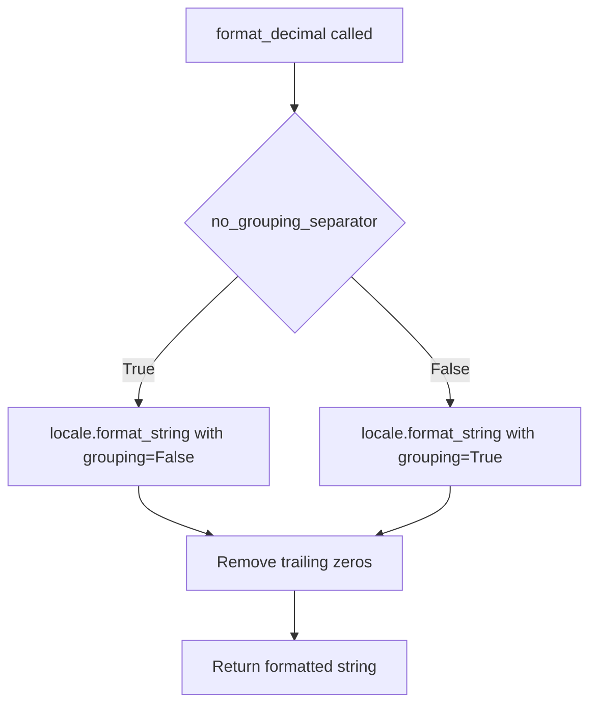

# `csvstat.py`

## `csvkit.utilities.csvstat.CSVStat` · *class*

*No documentation generated.*

### `csvkit.utilities.csvstat.CSVStat.add_arguments` · *method*

## Summary:
Configures command-line arguments for the CSVStat utility, defining available options for statistical analysis and output formatting.

## Description:
This method initializes the argument parser with various command-line options that control how CSV statistical analysis is performed and presented. It is part of the CSVStat class which extends CSVKitUtility to provide descriptive statistics for CSV files. The method sets up flags and parameters that allow users to customize the output format (CSV, JSON, plain text), select specific columns for analysis, choose which statistics to compute, and configure formatting options like decimal precision and grouping separators. This method is called during the initialization phase of the CSVStat utility to register all available command-line arguments with the argument parser.

## Args:
    self: The CSVStat instance whose argparser attribute is being configured

## Returns:
    None: This method modifies the instance's argparser in-place and returns nothing

## Raises:
    None explicitly raised: This method only configures arguments and doesn't raise exceptions itself

## State Changes:
    Attributes READ: None
    Attributes WRITTEN: self.argparser (modified via add_argument calls)

## Constraints:
    Preconditions: The method assumes self.argparser exists and is a proper ArgumentParser instance
    Postconditions: The argparser instance will have all defined arguments registered

## Side Effects:
    None: This method only registers arguments with the argument parser and doesn't perform I/O or mutate external state

### `csvkit.utilities.csvstat.CSVStat.main` · *method*

*No documentation generated.*

### `csvkit.utilities.csvstat.CSVStat.is_finite_decimal` · *method*

## Summary:
Determines whether a value is a finite decimal number.

## Description:
Checks if a given value is an instance of the Decimal class and whether it represents a finite number (as opposed to infinity or NaN). This method is used primarily in statistical calculations to filter out non-finite decimal values before applying formatting or further processing.

## Args:
    value (Any): The value to check for being a finite decimal.

## Returns:
    bool: True if the value is a Decimal instance and is finite; False otherwise.

## Raises:
    None explicitly raised.

## State Changes:
    Attributes READ: None
    Attributes WRITTEN: None

## Constraints:
    Preconditions:
        - The value parameter can be of any type
    Postconditions:
        - Returns a boolean value indicating the finiteness of the decimal value
        - Does not modify any object state

## Side Effects:
    None

### `csvkit.utilities.csvstat.CSVStat._calculate_stat` · *method*

*No documentation generated.*

### `csvkit.utilities.csvstat.CSVStat.print_one` · *method*

*No documentation generated.*

### `csvkit.utilities.csvstat.CSVStat.calculate_stats` · *method*

*No documentation generated.*

### `csvkit.utilities.csvstat.CSVStat.print_stats` · *method*

## Summary:
Formats and writes statistical information for specified columns to the output file, displaying various descriptive statistics in a structured text format.

## Description:
This method generates human-readable statistical summaries for each column in a CSV dataset. It processes pre-calculated statistics and formats them with appropriate labels, handling special cases like frequency distributions, null value counts, and character lengths. The output follows a consistent textual format with column numbering, names, and categorized statistics. This method is part of the CSVStat utility class and is called from the main execution flow when generating plain text statistical output.

## Args:
    table (agate.Table): The table containing the CSV data being analyzed.
    column_ids (list[int]): List of column indices to process and display statistics for.
    stats (dict): Dictionary mapping column indices to their calculated statistics dictionaries.

## Returns:
    None: This method performs I/O operations and does not return a value.

## Raises:
    None explicitly raised.

## State Changes:
    Attributes READ:
        - self.output_file: Used for writing formatted output
        - self.args.decimal_format: Controls decimal formatting
        - self.args.no_grouping_separator: Controls grouping separator usage
        - self.is_finite_decimal: Method used to validate decimal values
        - self.format_decimal: Method used to format decimal numbers
    Attributes WRITTEN:
        - None: This method only writes to output, does not modify instance state

## Constraints:
    Preconditions:
        - The table parameter must be a valid agate.Table instance
        - column_ids must contain valid column indices for the table
        - stats dictionary must contain entries for each column_id with complete statistic data
        - All column statistics must be properly calculated and available
        - OPERATIONS constant must be defined and contain valid operation definitions
    Postconditions:
        - Statistics for all specified columns are written to self.output_file
        - Output format is consistent with the expected textual representation
        - Row count is appended at the end of the output
        - Special formatting rules are applied for frequency distributions, null counts, and character lengths

## Side Effects:
    - Writes formatted text to self.output_file
    - Uses locale formatting for decimal numbers via format_decimal function
    - May temporarily change locale settings during decimal formatting
    - Calls self.is_finite_decimal() to validate decimal values before formatting

### `csvkit.utilities.csvstat.CSVStat.print_csv` · *method*

*No documentation generated.*

### `csvkit.utilities.csvstat.CSVStat.print_json` · *method*

## Summary:
Serializes statistical data from CSV columns into JSON format with configurable indentation.

## Description:
Writes processed statistical data for specified CSV columns to the output file in JSON format. This method is called during the final output phase of CSV statistical analysis when the user specifies the --json flag. It transforms the pre-computed statistics into a list of dictionaries that are then serialized to JSON with proper decimal handling and configurable indentation.

## Args:
    table (agate.Table): The agate table containing the CSV data being analyzed
    column_ids (list): List of column identifiers to include in the statistics output
    stats (dict): Dictionary containing computed statistical information for each column

## Returns:
    None: This method performs I/O operations and does not return a value

## Raises:
    TypeError: When attempting to serialize non-serializable objects (handled by default_float_decimal)
    IOError: When writing to the output file fails

## State Changes:
    Attributes READ: self.output_file, self.args.indent
    Attributes WRITTEN: None

## Constraints:
    Precondition: The table parameter must be a valid agate.Table instance
    Precondition: column_ids must be a list of valid column identifiers for the table
    Precondition: stats must be a dictionary mapping column identifiers to statistical data
    Postcondition: The output file contains properly formatted JSON data

## Side Effects:
    I/O: Writes JSON-formatted data to self.output_file
    External service calls: None
    Mutations to objects outside self: None

### `csvkit.utilities.csvstat.CSVStat._rows` · *method*

*No documentation generated.*

## `csvkit.utilities.csvstat.format_decimal` · *function*

## Summary:
Formats a decimal number according to locale settings with customizable precision and optional grouping separators.

## Description:
This utility function formats decimal numbers for display, applying locale-specific formatting rules including thousand separators and decimal point conventions. It provides control over the number of decimal places and whether grouping separators should be included. The function leverages Python's locale module to ensure proper regional formatting.

## Args:
    d (float or Decimal): The decimal number to format.
    f (str, optional): Format string specifying decimal precision. Defaults to '%.3f'.
    no_grouping_separator (bool, optional): If True, disables thousand separators. Defaults to False.

## Returns:
    str: Formatted decimal string with trailing zeros removed and optional grouping separators applied.

## Raises:
    None explicitly raised.

## Constraints:
    Preconditions:
        - Input `d` must be a numeric type (float or Decimal)
        - Format string `f` must be a valid Python format string
    Postconditions:
        - Output string will not contain trailing zeros after the decimal point
        - Grouping separators will be applied based on the `no_grouping_separator` flag
        - Function respects current locale settings for formatting conventions

## Side Effects:
    - Uses locale module for formatting, which may affect global locale settings
    - May modify the global locale state if not properly managed

## Control Flow:


## Examples:
    >>> format_decimal(1234.5678)
    '1,234.568'
    >>> format_decimal(1234.5678, no_grouping_separator=True)
    '1234.568'
    >>> format_decimal(1234.5678, f='%.2f')
    '1,234.57'
```

## `csvkit.utilities.csvstat.get_type` · *function*

## Summary:
Returns the data type class name of a specified column in a table.

## Description:
Extracts and returns the class name of the data type associated with a given column in an agate table. This function serves as a utility for introspecting column data types within CSV processing workflows, particularly in the context of statistical analysis and data type determination.

## Args:
    table (agate.Table): The agate table containing the column.
    column_id (int or str): The identifier for the column, either as an integer index or string name.
    **kwargs: Additional keyword arguments (currently unused but maintained for API compatibility).

## Returns:
    str: The class name of the data type for the specified column.

## Raises:
    IndexError: When column_id is out of bounds for the table columns.
    KeyError: When column_id is a string that does not match any column name in the table.

## Constraints:
    Preconditions:
        - The table parameter must be a valid agate.Table instance.
        - The column_id must reference a valid column in the table.
    Postconditions:
        - The returned string is the fully qualified class name of the column's data type.

## Side Effects:
    None.

## Control Flow:
```mermaid
flowchart TD
    A[get_type called] --> B{column_id valid?}
    B -- No --> C[Raises IndexError/KeyError]
    B -- Yes --> D[Access table.columns[column_id]]
    D --> E[Get data_type]
    E --> F[Get __class__.__name__]
    F --> G[Return class name string]
```

## Examples:
    >>> import agate
    >>> table = agate.Table([[1, 'a'], [2, 'b']], ['num', 'text'])
    >>> get_type(table, 0)
    'Integer'
    >>> get_type(table, 'text')
    'Text'
    >>> get_type(table, 1)
    'Text'

## `csvkit.utilities.csvstat.get_unique` · *function*

## Summary:
Calculates the number of unique values in a specified column of a table.

## Description:
This function extracts the distinct values from a given column in a table and returns the count of those unique values. It serves as a utility for statistical analysis of CSV data by providing a quick count of distinct entries in any column. The function leverages agate's built-in `values_distinct()` method to efficiently compute unique values.

## Args:
    table: An agate Table object containing the data to analyze
    column_id: Either an integer index or string name identifying the column to analyze
    **kwargs: Additional keyword arguments (unused in current implementation)

## Returns:
    int: The count of unique values in the specified column

## Raises:
    KeyError: If column_id does not correspond to a valid column in the table
    IndexError: If column_id is out of bounds for the table columns

## Constraints:
    Preconditions:
        - The table parameter must be a valid agate Table object
        - The column_id must reference a valid column in the table
    Postconditions:
        - Returns an integer representing the count of distinct values
        - Does not modify the original table or column data

## Side Effects:
    None

## Control Flow:
```mermaid
flowchart TD
    A[get_unique called] --> B{column_id valid?}
    B -->|Yes| C[table.columns[column_id] accessed]
    C --> D[values_distinct() called]
    D --> E[len() applied]
    E --> F[Return count]
    B -->|No| G[agate exception raised]
```

## Examples:
    # Basic usage
    unique_count = get_unique(my_table, 0)  # Count unique values in first column
    
    # Using column name
    unique_count = get_unique(my_table, 'name')  # Count unique values in 'name' column

## `csvkit.utilities.csvstat.get_freq` · *function*

## Summary:
Returns the most frequent values in a specified column of a table along with their counts.

## Description:
This function extracts the most common values from a given column in a table and returns them in descending order of frequency. It is used to quickly identify the dominant values in categorical data.

The function is called by the csvstat utility when analyzing column statistics, particularly when displaying frequency distributions for columns. It's designed to provide quick insights into data distribution patterns.

## Args:
    table: An agate Table object containing the data to analyze
    column_id: The identifier for the column to analyze (can be integer index or column name)
    freq_count: Number of top frequent values to return (default: 5)
    **kwargs: Additional keyword arguments (currently unused)

## Returns:
    A list of dictionaries, each containing:
        - 'value': The most frequent value in the column
        - 'count': The number of occurrences of that value

## Raises:
    None explicitly raised

## Constraints:
    Preconditions:
        - The table parameter must be a valid agate Table object
        - The column_id must reference a valid column in the table
        - The column_id must be accessible via table.columns[column_id]

    Postconditions:
        - Returns a list of dictionaries with 'value' and 'count' keys
        - The list is sorted in descending order by count
        - The length of the returned list is at most freq_count

## Side Effects:
    None

## Control Flow:
```mermaid
flowchart TD
    A[get_freq called] --> B[table.columns[column_id].values()]
    B --> C[Counter(values).most_common(freq_count)]
    C --> D[Return list of dicts]
```

## Examples:
```python
# Basic usage
import agate
table = agate.Table([['name', 'city'], ['Alice', 'NYC'], ['Bob', 'LA'], ['Charlie', 'NYC']])
result = get_freq(table, 1)  # Get top 5 frequent values from column 1 ('city')
# Returns [{'value': 'NYC', 'count': 2}, {'value': 'LA', 'count': 1}]

# With custom frequency count
result = get_freq(table, 1, freq_count=1)
# Returns [{'value': 'NYC', 'count': 2}]
```

## `csvkit.utilities.csvstat.launch_new_instance` · *function*

## Summary:
Launches a new instance of the CSVStat utility to compute and display descriptive statistics for CSV columns.

## Description:
This function serves as the entry point for launching the CSVStat command-line utility. It creates an instance of the CSVStat class and invokes its run method to execute the CSV statistical analysis workflow. The function is designed to be called by the command-line interface to initiate processing of CSV data according to the specified arguments.

The function extracts the instantiation and execution logic into a separate function to maintain clean separation between the utility's construction and execution phases. This approach allows for easier testing and potential reuse in different contexts while keeping the command-line interface simple and focused. It follows the same pattern used by other csvkit utilities such as csvcut, csvclean, csvsort, etc.

## Args:
    None: This function takes no parameters.

## Returns:
    None: This function does not return any value.

## Raises:
    Any exceptions that may be raised by CSVStat.__init__() or CSVStat.run() methods, including:
    - SystemExit: Raised by argparser.error() when validation fails for command-line arguments
    - ValueError: From CSVKitUtility.skip_lines() if skip_lines argument is invalid
    - IOError: From file operations in CSVKitUtility.run() if files cannot be opened/read
    - NotImplementedError: From CSVKitUtility.add_arguments() and CSVKitUtility.main() if not properly overridden

## Constraints:
    Preconditions:
        - The csvkit.utilities.csvstat module must be properly imported
        - The CSVStat class must be correctly defined and inherit from CSVKitUtility
        - Command-line arguments must be available in sys.argv or equivalent
        
    Postconditions:
        - A CSVStat instance is created and its run() method is invoked
        - All command-line arguments are processed through the CSVKitUtility framework
        - Input/output file handles are managed by the CSVKitUtility.run() method

## Side Effects:
    - Reads command-line arguments from sys.argv
    - May open and close input/output files during execution
    - Writes statistical analysis results to stdout or specified output file
    - May modify global state through CSVKitUtility's argument parsing and file handling

## Control Flow:
```mermaid
flowchart TD
    A[launch_new_instance] --> B[Create CSVStat instance]
    B --> C[Call utility.run()]
    C --> D{CSVKitUtility.run executes}
    D --> E[Argument parsing occurs]
    E --> F[Input file handling occurs]
    F --> G[Main processing logic executes]
    G --> H[Statistics computed and displayed]
    H --> I[Output written to stdout/file]
    I --> J[File handles closed]
    J --> K[Function completes]
```

## Examples:
```bash
# Typical usage from command line
csvstat data.csv

# Display statistics for specific columns
csvstat -c 1,3 data.csv

# Output as CSV format
csvstat --csv data.csv

# Output as JSON format
csvstat --json data.csv

# Show only column names and indices
csvstat -n data.csv
```

