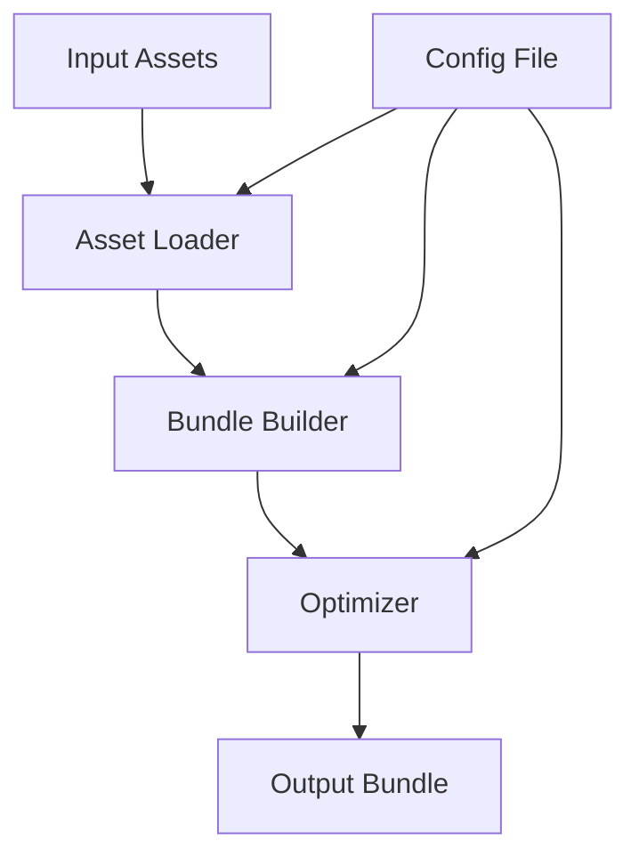

# `exodus-bundler`

## Repository Overview

### Tree Structure
```
exodus-bundler/
└── src/
    └── exodus_bundler/
        ├── __init__.py
        ├── bundle.py
        ├── config.py
        ├── loader.py
        └── optimizer.py
```

### Purpose
The exodus-bundler repository provides a robust framework for assembling application resources into optimized distributable bundles. It addresses the challenge of efficiently packaging modern web applications by automating asset collection, dependency resolution, and optimization processes.

This system serves developers building web applications who need reliable, repeatable bundling workflows for deployment. It acts as a foundational tool in the development pipeline, enabling efficient delivery of optimized assets to production environments.

### Architecture
The system follows a modular architecture pattern where each component handles a specific aspect of the bundling process:

1. **Configuration Management**: Handles loading and validating bundling parameters
2. **Asset Loading**: Resolves and processes application resources and dependencies
3. **Bundle Construction**: Assembles loaded assets into coherent bundle structures
4. **Optimization**: Applies compression, minification, and other performance enhancements

### Entry Points
- **CLI Interface**: Command-line tool for initiating bundle builds
- **API Functions**: Importable functions for programmatic bundle creation
- **Configuration Files**: JSON/YAML-based settings for customizing build behavior

### Core Features
- Asset dependency resolution and loading
- Multi-format asset support (JS, CSS, HTML, images)
- Configurable optimization strategies
- Deterministic and reproducible builds
- Extensible plugin architecture for custom processing

### Dependencies
- Standard Python libraries (`os`, `json`, `logging`)
- No external dependencies beyond Python standard library
- Designed for Python 3.7+

### Extension Points
- Custom asset loaders via plugin interface
- Optimization strategies through strategy pattern
- Configuration schema extensions

### Data Flow Diagram


---

## Modules

- [`src`](src.md)

