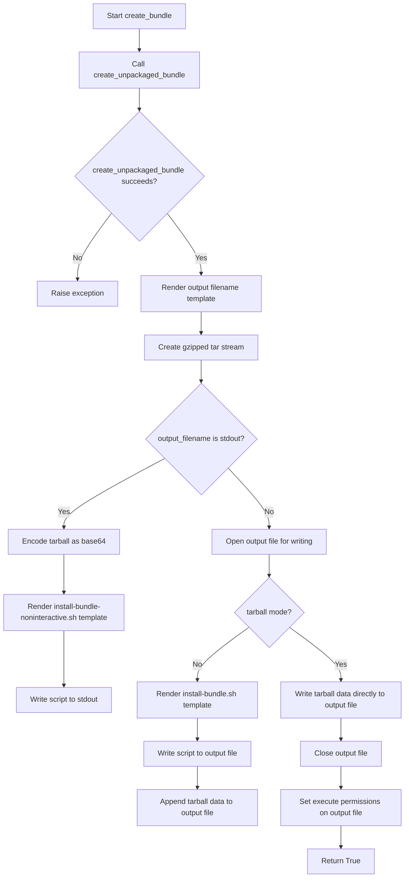
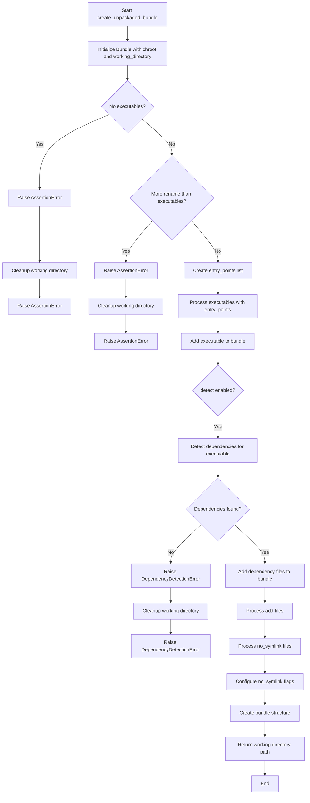
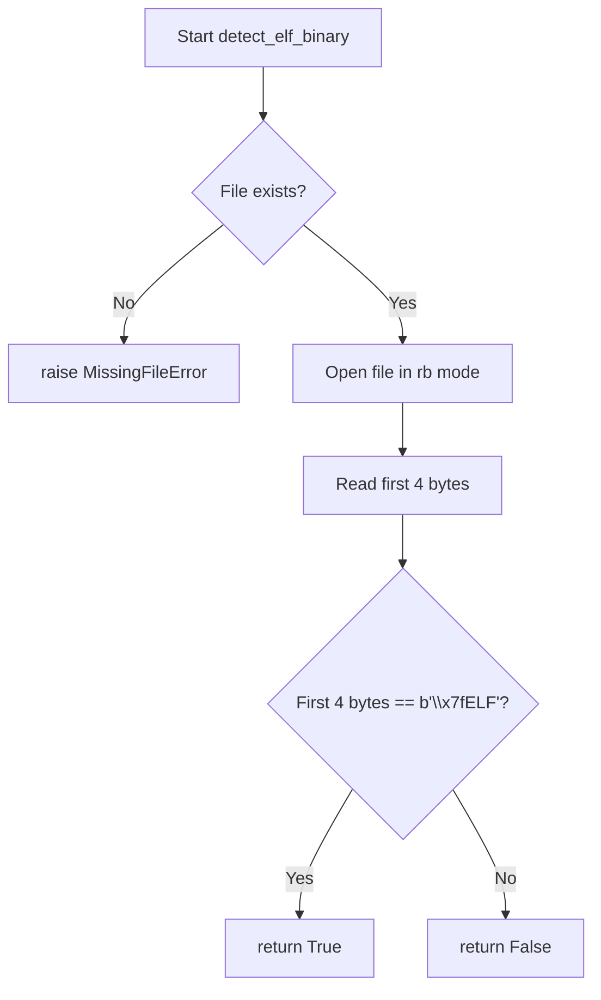
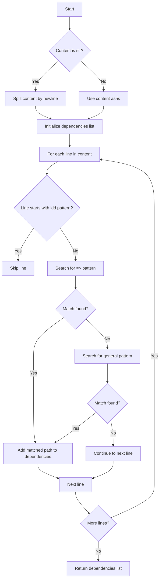
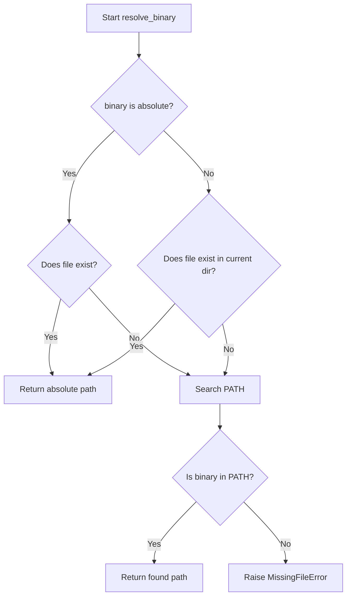
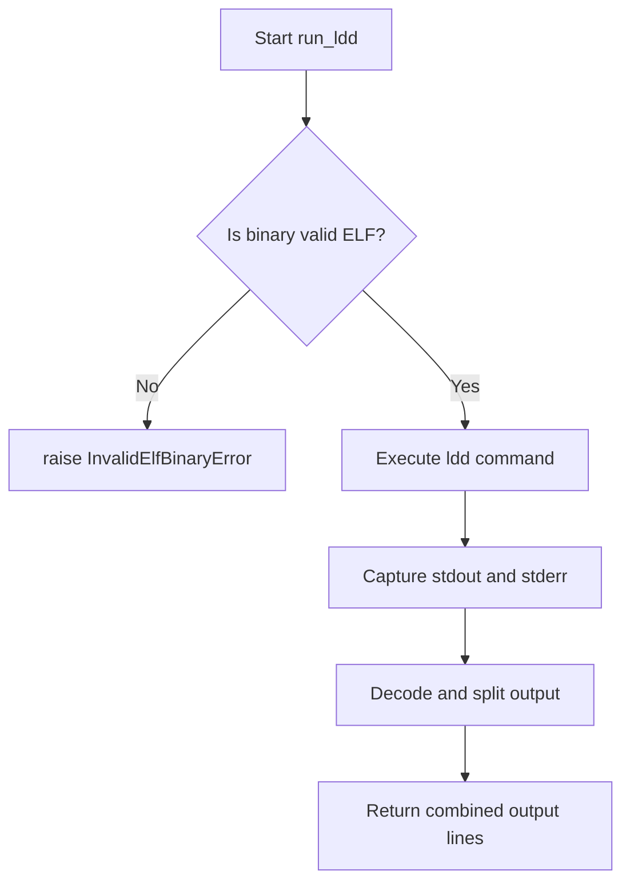
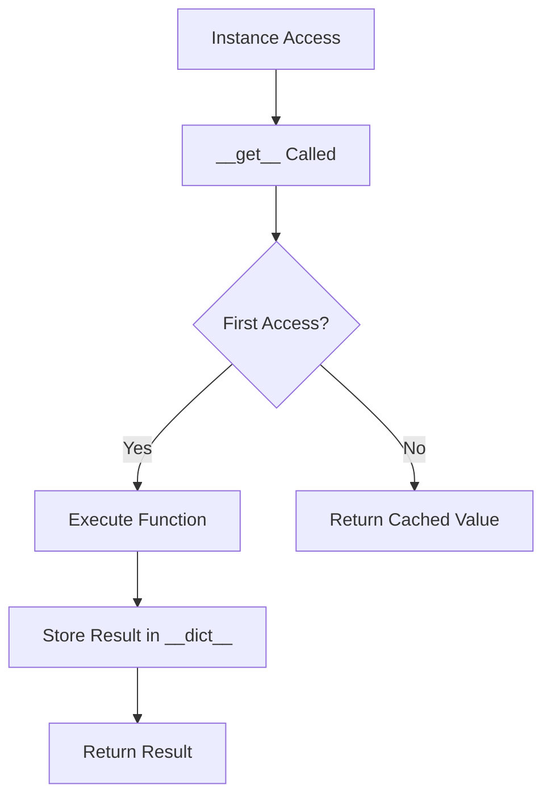
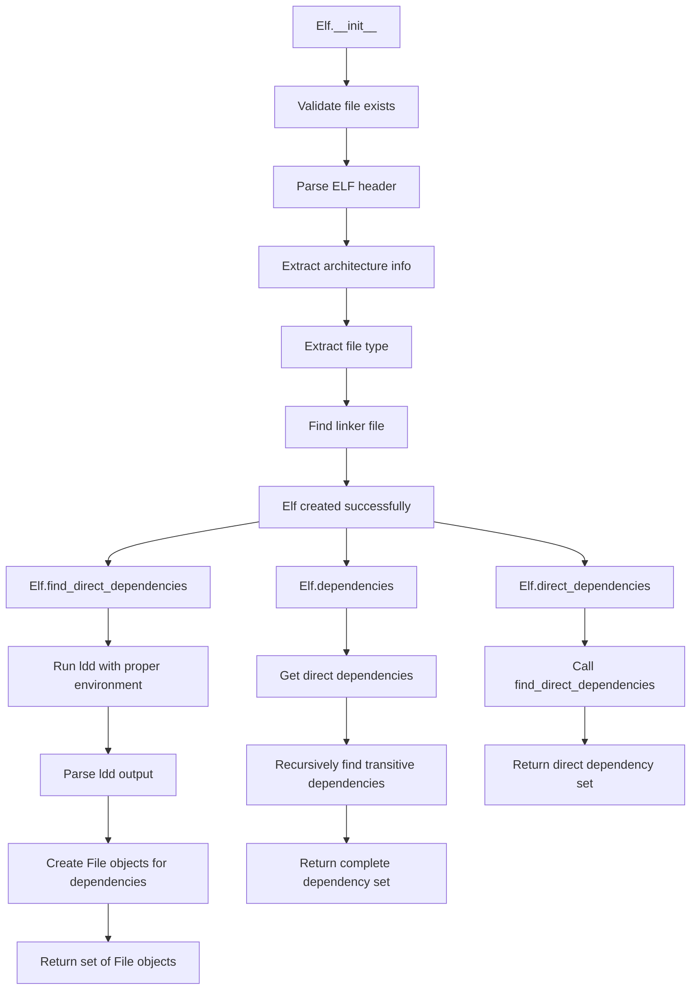
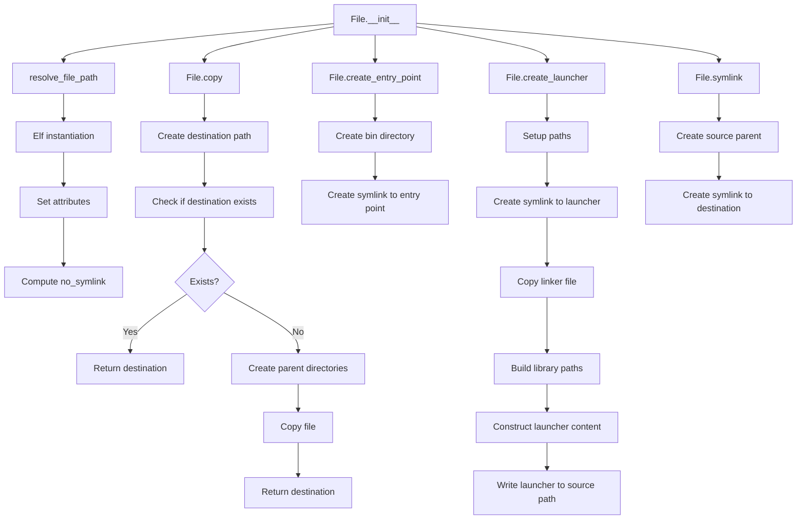
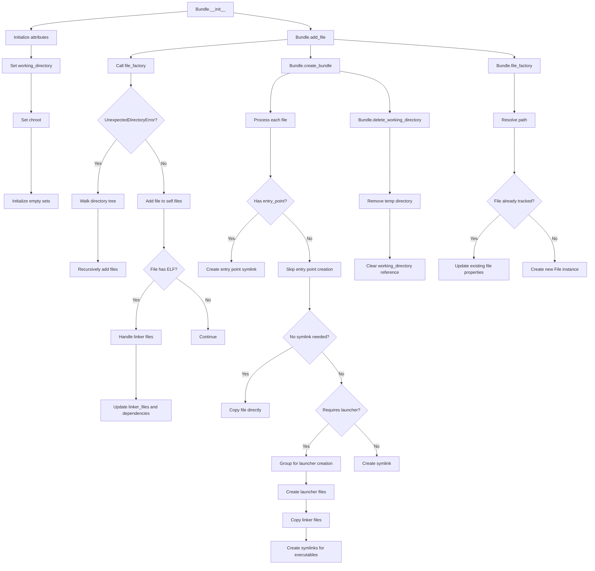

# `bundling.py`

## `src.exodus_bundler.bundling.bytes_to_int` · *function*

## Summary:
Converts a sequence of bytes into an integer using specified byte order.

## Description:
This function takes a sequence of bytes and interprets them as a multi-byte integer according to the specified byte ordering. It is commonly used when working with binary data formats where byte sequences need to be converted to numeric values.

## Args:
    bytes (bytes): A sequence of bytes to convert to an integer.
    byteorder (str): Byte order for interpretation. Must be either 'big' or 'little'. Defaults to 'big'.

## Returns:
    int: The integer value represented by the byte sequence.

## Raises:
    KeyError: When byteorder is not 'big' or 'little'.
    struct.error: When struct.unpack fails due to invalid byte sequence length or format.

## Constraints:
    Preconditions:
        - The bytes parameter must be a valid bytes object.
        - The byteorder parameter must be either 'big' or 'little'.
    Postconditions:
        - Returns an integer representing the byte sequence in the specified byte order.

## Side Effects:
    None.

## Control Flow:
```mermaid
flowchart TD
    A[bytes_to_int called] --> B{byteorder}
    B -->|big| C[chars = struct.unpack('>B...B', bytes)]
    B -->|little| D[chars = struct.unpack('<B...B', bytes)]
    C --> E[chars = chars[::-1]]
    D --> E
    E --> F[return sum(int(char) * 256 ** i for (i, char) in enumerate(chars))]
```

## Examples:
    >>> bytes_to_int(b'\x01\x02\x03', 'big')
    66051
    >>> bytes_to_int(b'\x01\x02\x03', 'little')
    197121

## `src.exodus_bundler.bundling.create_bundle` · *function*

## Summary:
Creates a distributable bundle containing executables and their dependencies, either as a shell script installer or compressed tarball.

## Description:
The `create_bundle` function orchestrates the creation of a portable application bundle by first generating an unpackaged structure, then packaging it into either a self-extracting shell script or a compressed tarball. It handles template rendering for installation scripts, manages file I/O operations, and ensures proper permissions for generated files. This function serves as the main entry point for the bundling process, coordinating the workflow between unpackaged bundle creation and final packaging.

## Args:
    executables (list[str]): List of absolute or relative paths to executable files to include in the bundle
    output (str): Template string for output filename, supports {executables} and {extension} placeholders
    tarball (bool): If True, creates a .tgz tarball instead of a self-extracting shell script. Defaults to False
    rename (list[str]): List of names to use for entry point symlinks. Defaults to []
    chroot (str, optional): Root directory for chrooted environment. Defaults to None
    add (list[str]): Additional files to include in the bundle. Defaults to []
    no_symlink (list[str]): Files that should be copied instead of symlinked. Defaults to []
    shell_launchers (bool): Whether to create shell-based launchers instead of binary launchers. Defaults to False
    detect (bool): Whether to automatically detect and include dependencies for executables. Defaults to False

## Returns:
    bool: True if bundle creation succeeds, raises exception otherwise

## Raises:
    Exception: Any exception that occurs during bundle creation is caught and re-raised after cleanup

## Constraints:
    Preconditions:
        - At least one executable must be specified in the executables list
        - The number of rename entries cannot exceed the number of executables
        - All file paths must be resolvable and accessible
        - Output filename must be writable
    Postconditions:
        - A bundle file is created at the specified output location
        - Temporary working directory is cleaned up
        - Generated bundle file has appropriate execute permissions (when not tarball)

## Side Effects:
    - Creates temporary working directory for bundle construction
    - Writes output file to disk or stdout
    - May create symbolic links and launcher scripts in the bundle directory
    - Sets execute permissions on generated bundle file
    - Deletes temporary working directory upon completion

## Control Flow:


## Examples:
    >>> create_bundle(
    ...     executables=['/usr/bin/python3'],
    ...     output='myapp.bundle',
    ...     detect=True
    ... )
    True
    
    >>> create_bundle(
    ...     executables=['/usr/bin/python3'],
    ...     output='myapp.tgz',
    ...     tarball=True
    ... )
    True

## `src.exodus_bundler.bundling.create_unpackaged_bundle` · *function*

## Summary:
Creates an unpackaged bundle by collecting specified executables and their dependencies, then constructing a directory structure with appropriate symlinks and launchers.

## Description:
The `create_unpackaged_bundle` function serves as the primary interface for generating a standalone application bundle. It initializes a Bundle instance, adds specified executables and their dependencies (when requested), processes additional files, configures symlink behavior, and finally constructs the bundle directory structure. The function handles error recovery by cleaning up temporary resources if any step fails.

This logic is extracted into its own function to provide a clean, centralized entry point for the bundling process while encapsulating the complex workflow of file collection, dependency resolution, and bundle creation. It separates concerns between the Bundle class's internal operations and the high-level orchestration required for creating bundles.

## Args:
    executables (list[str]): List of absolute or relative paths to executable files to include in the bundle
    rename (list[str], optional): List of names to use for entry point symlinks. Defaults to [].
    chroot (str, optional): Root directory for chrooted environment. Defaults to None.
    add (list[str], optional): Additional files to include in the bundle. Defaults to [].
    no_symlink (list[str], optional): Files that should be copied instead of symlinked. Defaults to [].
    shell_launchers (bool): Whether to create shell-based launchers instead of binary launchers. Defaults to False.
    detect (bool): Whether to automatically detect and include dependencies for executables. Defaults to False.

## Returns:
    str: Path to the working directory containing the created bundle structure

## Raises:
    AssertionError: When no executables are specified or when more rename entries are provided than executables
    DependencyDetectionError: When automatic dependency detection fails for an executable
    Exception: Any other exception that occurs during bundle creation is caught and re-raised after cleanup

## Constraints:
    Preconditions:
        - At least one executable must be specified in the executables list
        - The number of rename entries cannot exceed the number of executables
        - All file paths must be resolvable and accessible
    Postconditions:
        - A working directory with the bundle structure is created
        - All specified files are included in the bundle
        - Temporary resources are cleaned up even if an error occurs

## Side Effects:
    - Creates temporary working directory for bundle construction
    - Reads files from the filesystem to add them to the bundle
    - May create symbolic links and launcher scripts in the bundle directory
    - Deletes temporary working directory upon successful completion or failure

## Control Flow:


## Examples:
    >>> bundle_dir = create_unpackaged_bundle(
    ...     executables=['/usr/bin/python3'],
    ...     rename=['my_python'],
    ...     detect=True,
    ...     shell_launchers=False
    ... )
    >>> print(f"Bundle created at: {bundle_dir}")
    Bundle created at: /tmp/tmpdir12345
```

## `src.exodus_bundler.bundling.detect_elf_binary` · *function*

## Summary:
Determines whether a given file is an ELF binary by checking its magic number.

## Description:
This function examines the first four bytes of a file to identify if it conforms to the ELF (Executable and Linkable Format) binary standard. It is used to filter out non-ELF files during the bundling process, ensuring that only valid ELF binaries are processed further.

## Args:
    filename (str): The absolute or relative path to the file to be checked.

## Returns:
    bool: True if the file is an ELF binary (starts with the magic number '\x7fELF'), False otherwise.

## Raises:
    MissingFileError: When the specified file does not exist on the filesystem.

## Constraints:
    Preconditions:
        - The filename argument must be a valid string representing a file path.
        - The file at the specified path must be readable.
    Postconditions:
        - The function will not modify the file or its contents.
        - The function will return a boolean value indicating ELF status.

## Side Effects:
    - Reads the first 4 bytes of the specified file from disk.
    - May raise MissingFileError if the file doesn't exist.

## Control Flow:


## Examples:
    >>> detect_elf_binary('/bin/ls')
    True
    >>> detect_elf_binary('/etc/passwd')
    False
    >>> detect_elf_binary('/nonexistent/file')
    MissingFileError: The "/nonexistent/file" file was not found.

## `src.exodus_bundler.bundling.parse_dependencies_from_ldd_output` · *function*

## Summary:
Parses ldd output to extract shared library dependencies from ELF binaries.

## Description:
Extracts absolute paths to shared libraries from ldd command output, filtering out ldd itself and handling various output formats. This function is used to process dependency information obtained from running ldd on binary files to identify their runtime library requirements.

## Args:
    content (str or list[str]): Raw output from ldd command, either as a string (with newlines) or list of lines

## Returns:
    list[str]: List of absolute paths to shared library dependencies found in the ldd output

## Raises:
    None explicitly raised

## Constraints:
    - Input must be either a string or list of strings representing ldd output lines
    - Function assumes ldd output follows standard format with library paths in parentheses

## Side Effects:
    None

## Control Flow:


## Examples:
    Example 1: Parsing ldd output with standard format
    ```python
    output = "/lib64/libc.so.6 => /lib64/libc.so.6 (0x7f8b4c000000)"
    result = parse_dependencies_from_ldd_output(output)
    # Returns ['/lib64/libc.so.6']
    ```

    Example 2: Parsing ldd output with multiple lines including ldd entry
    ```python
    output = [
        "/lib64/libc.so.6 => /lib64/libc.so.6 (0x7f8b4c000000)",
        "/lib64/libm.so.6 => /lib64/libm.so.6 (0x7f8b4c000000)",
        "ldd (0x7f8b4c000000)"
    ]
    result = parse_dependencies_from_ldd_output(output)
    # Returns ['/lib64/libc.so.6', '/lib64/libm.so.6']
    ```

    Example 3: Parsing ldd output with different format
    ```python
    output = "/lib64/libc.so.6 (0x7f8b4c000000)"
    result = parse_dependencies_from_ldd_output(output)
    # Returns ['/lib64/libc.so.6']
    ```

## `src.exodus_bundler.bundling.resolve_binary` · *function*

## Summary:
Resolves a binary name to its absolute file path by checking the filesystem and PATH environment variable.

## Description:
This function takes a binary name (either relative or absolute) and resolves it to an absolute file path. It first attempts to resolve the path directly, and if that fails, searches through directories listed in the PATH environment variable. This extraction provides a centralized location for binary path resolution logic, ensuring consistent behavior across the bundler when locating executables.

## Args:
    binary (str): The name or path of the binary to resolve. Can be relative, absolute, or just a basename.

## Returns:
    str: The absolute path to the binary file.

## Raises:
    MissingFileError: When the binary cannot be found in the filesystem or any directory listed in PATH.

## Constraints:
    Preconditions:
        - The binary argument must be a string.
        - The system must have a valid PATH environment variable.
    Postconditions:
        - The returned path is normalized and absolute.
        - The file at the returned path must exist.

## Side Effects:
    None

## Control Flow:


## Examples:
    >>> resolve_binary("ls")
    "/bin/ls"
    >>> resolve_binary("/usr/bin/python3")
    "/usr/bin/python3"
    >>> resolve_binary("nonexistent")
    Traceback (most recent call last):
      ...
    MissingFileError: The "nonexistent" binary could not be found in $PATH.
```

## `src.exodus_bundler.bundling.resolve_file_path` · *function*

## Summary:
Resolves a file path to its absolute normalized form, with optional environment PATH searching for binaries.

## Description:
This function takes a file path and ensures it resolves to an absolute, normalized path. If the `search_environment_path` flag is enabled, it first attempts to resolve the path as a binary name using the system's PATH environment variable. The function validates that the resolved path points to an existing file, raising appropriate errors for missing files or directories. This extraction centralizes path resolution logic, providing consistent behavior for file handling throughout the bundler.

## Args:
    path (str): The file path to resolve. Can be relative, absolute, or a binary name if `search_environment_path` is True.
    search_environment_path (bool): If True, treats the path as a binary name and searches PATH environment variable. Defaults to False.

## Returns:
    str: The absolute, normalized path to the file.

## Raises:
    MissingFileError: When the file does not exist at the resolved path.
    UnexpectedDirectoryError: When the resolved path points to a directory instead of a file.

## Constraints:
    Preconditions:
        - The `path` argument must be a string.
        - The system must have a valid filesystem for path operations.
    Postconditions:
        - The returned path is normalized and absolute.
        - The file at the returned path must exist and be a regular file.

## Side Effects:
    None

## Control Flow:
```mermaid
flowchart TD
    A[Start resolve_file_path] --> B{search_environment_path?}
    B -- Yes --> C[resolve_binary(path)]
    B -- No --> D[path]
    C --> E{File exists?}
    D --> E
    E -- No --> F[Raise MissingFileError]
    E -- Yes --> G{Is directory?}
    G -- Yes --> H[Raise UnexpectedDirectoryError]
    G -- No --> I[Return normpath(abspath(path))]
```

## Examples:
    >>> resolve_file_path("./test.txt")
    "/current/working/dir/test.txt"
    >>> resolve_file_path("/usr/bin/python3", search_environment_path=True)
    "/usr/bin/python3"
    >>> resolve_file_path("missing_file.txt")
    Traceback (most recent call last):
      ...
    MissingFileError: The "missing_file.txt" file was not found.
```

## `src.exodus_bundler.bundling.run_ldd` · *function*

## Summary:
Executes the ldd command on a binary to retrieve its shared library dependencies.

## Description:
This function runs the system's ldd command on a specified binary to enumerate its shared library dependencies. It first validates that the binary is a valid ELF file before executing ldd, ensuring compatibility with the system's dynamic linker. The function is designed to capture both stdout and stderr from ldd, returning all output lines as a list for downstream processing.

## Args:
    ldd (str): Path to the ldd executable to be invoked.
    binary (str): Path to the binary file whose dependencies are to be resolved.

## Returns:
    list[str]: A list of strings containing all lines from both stdout and stderr of the ldd command execution.

## Raises:
    InvalidElfBinaryError: When the specified binary is not a valid ELF file.

## Constraints:
    Preconditions:
        - The ldd argument must be a valid path to an executable ldd command.
        - The binary argument must be a valid path to a file.
        - The binary must be a valid ELF file as determined by detect_elf_binary.
    Postconditions:
        - The function does not modify the binary or any system files.
        - The ldd command is executed synchronously and its output is captured.

## Side Effects:
    - Invokes an external system command (ldd) which may cause I/O operations.
    - May trigger system security mechanisms if ldd is restricted or sandboxed.

## Control Flow:


## Examples:
    >>> run_ldd('/usr/bin/ldd', '/bin/ls')
    ['linux-vdso.so.1 (0x00007fff...', 'libc.so.6 => /lib/x86_64-linux-gnu/libc.so.6 ...', ...]
    >>> run_ldd('/usr/bin/ldd', '/etc/passwd')
    InvalidElfBinaryError: The "/etc/passwd" file is not a binary ELF file.

## `src.exodus_bundler.bundling.stored_property` · *class*

## Summary:
A descriptor class that caches the result of a method call as an instance attribute.

## Description:
The `stored_property` class implements a descriptor that transforms a method into a cached property. When accessed on an instance, it executes the wrapped function once and stores the result in the instance's `__dict__` under the method's name. Subsequent accesses return the cached value instead of re-executing the function.

This pattern is commonly used for expensive computations or operations that should only be performed once per instance lifetime. It provides lazy evaluation while ensuring the computed value persists for the object's duration.

## State:
- `function`: callable object (method) that will be executed when the property is accessed
  - Type: callable
  - Valid range: any callable that accepts `self` as its sole argument
  - Invariant: must be set during initialization and remain immutable

## Lifecycle:
- Creation: Instantiate with a callable function that takes `self` as its argument
- Usage: Access the descriptor as an attribute on an instance; the first access triggers computation and caching
- Destruction: No explicit cleanup required; relies on Python's garbage collection

## Method Map:


## Raises:
- None explicitly raised by `__init__`
- The wrapped function may raise exceptions during execution, which propagate normally

## Example:
```python
class MyClass:
    @stored_property
    def expensive_computation(self):
        # Simulate expensive operation
        return sum(range(1000))

# Usage
obj = MyClass()
result1 = obj.expensive_computation  # Executes function, caches result
result2 = obj.expensive_computation  # Returns cached value
assert result1 is result2  # Both refer to same cached value
```

### `src.exodus_bundler.bundling.stored_property.__init__` · *method*

## Summary:
Initializes a stored property wrapper that delegates to a function and preserves its docstring.

## Description:
This method serves as the constructor for a stored property descriptor that wraps a function. It stores the function reference and copies the function's docstring to the property's `__doc__` attribute. This allows the property to behave like a function while maintaining documentation metadata.

The `stored_property` descriptor is designed to transform methods into cached properties that execute once per instance and cache their results. This enables lazy evaluation of expensive operations while providing persistent access to computed values.

## Args:
    function (callable): The function to be wrapped by this stored property descriptor. Must accept `self` as its sole argument.

## Returns:
    None: This method does not return a value.

## Raises:
    None: This method does not explicitly raise exceptions.

## State Changes:
    Attributes READ: None
    Attributes WRITTEN: 
        - self.__doc__: Set to the docstring of the provided function
        - self.function: Set to the provided function reference

## Constraints:
    Preconditions:
        - The `function` argument must be callable
        - The `function` argument should have a `__doc__` attribute (most functions do)
        - The `function` should accept `self` as its sole argument to work properly with the descriptor protocol
    Postconditions:
        - The instance will have its `__doc__` attribute set to the function's docstring
        - The instance will store the function reference in `self.function`

## Side Effects:
    None: This method performs no I/O operations or external service calls.

### `src.exodus_bundler.bundling.stored_property.__get__` · *method*

## Summary:
Computes and caches the result of a function call on an instance, storing it in the instance's dictionary for future access.

## Description:
This method implements the descriptor protocol's `__get__` magic method for the `stored_property` class. When accessed as a property on an instance, it executes the associated function once and caches the result in the instance's `__dict__` under the function's name. Subsequent accesses return the cached value without re-executing the function. When accessed on the class itself (not an instance), it returns the descriptor object.

## Args:
    self: The `stored_property` descriptor instance.
    instance: The instance on which the property is being accessed, or None if accessed on the class.
    type: The class to which the descriptor belongs.

## Returns:
    The result of calling `self.function(instance)` if `instance` is not None, otherwise returns the descriptor itself.

## Raises:
    None explicitly raised.

## State Changes:
    Attributes READ: self.function, instance.__dict__
    Attributes WRITTEN: instance.__dict__[self.function.__name__]

## Constraints:
    Preconditions: 
    - `self.function` must be callable
    - `instance` must be an object with a `__dict__` attribute if not None
    - `self.function.__name__` must be a valid key for `instance.__dict__`
    
    Postconditions:
    - If `instance` is not None, `instance.__dict__[self.function.__name__]` will contain the computed result
    - The function is executed at most once per instance

## Side Effects:
    None

## `src.exodus_bundler.bundling.Elf` · *class*

## Summary:
Represents an ELF binary file and provides methods for analyzing its structure and dependencies.

## Description:
The Elf class encapsulates the functionality for parsing ELF (Executable and Linkable Format) binary files, extracting metadata such as architecture, file type, and linker information. It also provides mechanisms for discovering both direct and transitive dependencies of the binary through system calls to ldd and recursive analysis.

This class serves as a core component in the bundling process, enabling the bundler to understand what files are required to run a binary in isolation. It is typically instantiated by the File class when processing binary files.

## State:
- path (str): Absolute path to the ELF binary file
  - Type: str
  - Valid range: Must be a valid filesystem path pointing to an existing file
  - Invariant: Set during initialization and remains constant
- chroot (str, optional): Root directory for chrooted environment
  - Type: str or None
  - Valid range: Path to directory or None
  - Invariant: Set during initialization and remains constant
- file_factory (class, optional): Factory class for creating dependent File objects
  - Type: class or None
  - Valid range: Any callable that accepts path, chroot, and library arguments
  - Invariant: Set during initialization and remains constant
- bits (int): Architecture bit-width (32 or 64)
  - Type: int
  - Valid range: 32 or 64
  - Invariant: Determined during initialization from ELF header
- type (str): ELF file type (relocatable, executable, shared, core)
  - Type: str
  - Valid range: One of 'relocatable', 'executable', 'shared', 'core'
  - Invariant: Determined during initialization from ELF header
- linker_file (File or None): File object representing the dynamic linker used by this binary
  - Type: File or None
  - Valid range: None or File instance
  - Invariant: Determined during initialization from ELF program headers

## Lifecycle:
- Creation: Instantiate with path, optional chroot, and optional file_factory
- Usage: Access properties like dependencies and direct_dependencies to analyze binary requirements
- Destruction: Managed by Python's garbage collector

## Method Map:


## Raises:
- MissingFileError: When the specified path does not exist
- InvalidElfBinaryError: When the file is not a valid ELF binary
- UnsupportedArchitectureError: When the binary is not 32 or 64-bit little-endian

## Example:
```python
# Create an Elf instance for a binary
elf = Elf('/usr/bin/python3')

# Find direct dependencies
direct_deps = elf.direct_dependencies

# Find all transitive dependencies
all_deps = elf.dependencies

# Access metadata
print(f"Architecture: {elf.bits} bits")
print(f"File type: {elf.type}")
```

### `src.exodus_bundler.bundling.Elf.__init__` · *method*

## Summary:
Initializes an ELF binary object by parsing its header information and identifying the dynamic linker.

## Description:
The `__init__` method performs comprehensive validation and parsing of an ELF binary file. It verifies the file exists and is a valid ELF binary, determines the architecture (32/64-bit) and byte order, identifies the binary type (relocatable, executable, shared, or core), and extracts the dynamic linker path from the program headers. This method sets up the essential metadata needed for further bundling operations.

The method is designed as a dedicated constructor to encapsulate the complex ELF parsing logic, separating it from other File class responsibilities and ensuring proper initialization of ELF-specific attributes before the object is used in bundling workflows.

## Args:
    path (str): Absolute or relative path to the ELF binary file to be analyzed.
    chroot (str, optional): Root directory for chrooted environment. Defaults to None.
    file_factory (class, optional): Factory class for creating dependent File objects. Defaults to None.

## Returns:
    None: This method initializes instance attributes and does not return a value.

## Raises:
    MissingFileError: When the specified file path does not exist.
    InvalidElfBinaryError: When the file is not a valid ELF binary (does not start with '\x7fELF').
    UnsupportedArchitectureError: When the binary is neither 32-bit nor 64-bit, or when it's big-endian.

## State Changes:
    Attributes READ: None
    Attributes WRITTEN: 
        - self.path: Stores the absolute path to the ELF binary
        - self.chroot: Stores the chroot environment path
        - self.file_factory: Stores the factory class for dependent files
        - self.bits: Stores the architecture bit-width (32 or 64)
        - self.type: Stores the ELF binary type (relocatable, executable, shared, or core)
        - self.linker_file: Stores the File object for the dynamic linker

## Constraints:
    Preconditions:
        - The path argument must point to an existing file
        - The file must be a valid ELF binary starting with '\x7fELF'
        - The binary must be either 32-bit or 64-bit little-endian
    Postconditions:
        - All ELF metadata attributes (bits, type, linker_file) are properly initialized
        - The object is ready for subsequent bundling operations

## Side Effects:
    None: This method performs no I/O operations beyond reading the ELF file header.

### `src.exodus_bundler.bundling.Elf.__eq__` · *method*

## Summary:
Compares two Elf objects for equality based on their file paths.

## Description:
This method implements the equality operator (`==`) for Elf objects. It checks if another object is an instance of the Elf class and compares their file paths. This method is part of the standard Python object protocol and enables comparing Elf instances using the `==` operator. The implementation follows the pattern of using `isinstance()` check followed by attribute comparison, ensuring that equality is based solely on the file path.

## Args:
    other (object): Another object to compare with this Elf instance.

## Returns:
    bool: True if the other object is an Elf instance and has the same path as this Elf instance; False otherwise.

## Raises:
    None

## State Changes:
    Attributes READ: self.path
    Attributes WRITTEN: None

## Constraints:
    Preconditions: The other object can be any Python object, but equality is only considered meaningful when it's another Elf instance.
    Postconditions: The comparison result is deterministic and based solely on the file path attribute.

## Side Effects:
    None

### `src.exodus_bundler.bundling.Elf.__hash__` · *method*

## Summary:
Computes and returns a hash value based on the ELF file's path for use in hash-based data structures.

## Description:
This method implements the special `__hash__` magic method to enable Elf objects to be used as dictionary keys or elements in sets. It computes a hash of the file path stored in `self.path`. This approach ensures that two Elf objects representing the same file path will have identical hash values, enabling proper deduplication and lookup behavior in hash-based collections.

## Args:
    None

## Returns:
    int: An integer hash value derived from `self.path`.

## Raises:
    None

## State Changes:
    Attributes READ: self.path
    Attributes WRITTEN: None

## Constraints:
    Preconditions: The `self.path` attribute must be initialized and contain a valid string path to an ELF file.
    Postconditions: The returned hash value is deterministic for the same file path and suitable for use in hash tables.

## Side Effects:
    None

### `src.exodus_bundler.bundling.Elf.__repr__` · *method*

## Summary:
Returns a string representation of the Elf object that displays its file path.

## Description:
This method provides a human-readable string representation of an Elf object for debugging and logging purposes. It is automatically called when the object is printed or converted to a string. The method is part of the standard Python object protocol and helps developers quickly identify Elf instances by their associated file paths.

## Args:
    None

## Returns:
    str: A formatted string in the pattern '<Elf(path="file_path")>' where file_path is the absolute path to the ELF binary.

## Raises:
    None

## State Changes:
    Attributes READ: self.path
    Attributes WRITTEN: None

## Constraints:
    Preconditions: The Elf object must have been properly initialized with a valid path attribute.
    Postconditions: The returned string follows a consistent format for all Elf instances.

## Side Effects:
    None

### `src.exodus_bundler.bundling.Elf.find_direct_dependencies` · *method*

## Summary:
Retrieves the set of direct shared library dependencies for an ELF binary by executing ldd with appropriate environment settings.

## Description:
This method uses the ldd command to analyze an ELF binary's runtime dependencies. It configures the execution environment with LD_TRACE_LOADED_OBJECTS=1 to enable detailed dependency tracing, and handles chroot environments by adjusting library paths. The method parses ldd's output to extract shared library paths and creates File objects for each dependency using the instance's file_factory.

## Args:
    linker_file (File, optional): Override for the default linker file to use for ldd execution. Defaults to None, which uses self.linker_file.

## Returns:
    set[File]: A set of File objects representing the direct shared library dependencies of the ELF binary, including the binary's own linker.

## Raises:
    None explicitly raised

## State Changes:
    Attributes READ: self.path, self.chroot, self.linker_file, self.file_factory
    Attributes WRITTEN: None

## Constraints:
    - Precondition: The ELF binary must exist at self.path
    - Precondition: Either self.linker_file must be set or linker_file parameter must be provided
    - Postcondition: Returns a set of File objects with library=True flag set
    - Postcondition: The returned set always includes the binary's linker file

## Side Effects:
    - Executes external ldd command process
    - May modify environment variables for subprocess execution
    - Reads binary file content via self.path
    - Calls self.file_factory to create dependency File objects

### `src.exodus_bundler.bundling.Elf.dependencies` · *method*

## Summary:
Computes the full transitive dependency closure of an ELF binary by recursively finding dependencies of dependencies.

## Description:
This method calculates all dependencies reachable from the binary's direct dependencies, including nested dependencies. It operates as a breadth-first traversal algorithm that continues until no new dependencies are discovered. The method is designed to be a stored property, ensuring computed results are cached for performance.

This method is specifically implemented as a separate function because:
1. It performs a complex recursive dependency resolution that would clutter the direct_dependencies property
2. It needs to maintain state during the iterative computation process
3. It encapsulates the logic for traversing the dependency graph efficiently
4. It separates concerns between computing direct dependencies and computing the full dependency closure

## Args:
    None

## Returns:
    set[File]: A set of File objects representing all transitive dependencies of the ELF binary, including the binary itself.

## Raises:
    None explicitly raised

## State Changes:
    Attributes READ: self.direct_dependencies, self.linker_file
    Attributes WRITTEN: None

## Constraints:
    Preconditions: 
    - self.direct_dependencies must be a set of File objects with elf attributes
    - self.linker_file must be a File object or None
    - Each dependency in self.direct_dependencies must have an elf attribute that supports find_direct_dependencies method
    
    Postconditions:
    - Returns a set containing all unique dependencies reachable from direct dependencies
    - The returned set includes the binary's direct dependencies and their transitive dependencies

## Side Effects:
    - Invokes external ldd command via subprocess
    - May perform filesystem operations through file_factory when creating File objects
    - Reads from the filesystem via ldd command execution

### `src.exodus_bundler.bundling.Elf.direct_dependencies` · *method*

## Summary:
Returns the set of direct dynamic library dependencies for this ELF binary.

## Description:
This method provides access to the direct dependencies of an ELF binary by invoking the `ldd` command through the `find_direct_dependencies` helper method. It is part of the ELF binary analysis pipeline and is typically called during the bundling process to identify libraries that the binary directly links against.

## Args:
    None

## Returns:
    set[File]: A set of File objects representing the direct dynamic library dependencies of this ELF binary, including the linker itself.

## Raises:
    None explicitly raised

## State Changes:
    Attributes READ: self.linker_file, self.path, self.chroot, self.file_factory
    Attributes WRITTEN: None

## Constraints:
    Preconditions: The ELF binary must have been successfully initialized and must be a valid ELF file.
    Postconditions: The returned set contains File objects for each direct dependency, properly configured with the chroot context if applicable.

## Side Effects:
    Invokes the external `ldd` command via subprocess, which may result in I/O operations and potential system calls to load and inspect shared libraries.

## `src.exodus_bundler.bundling.File` · *class*

## Summary:
Represents a file to be bundled, encapsulating its path, ELF metadata, and bundling behavior.

## Description:
The File class serves as a central abstraction for managing files during the bundling process. It handles path resolution, ELF binary analysis, and determines appropriate bundling strategies such as copying, symlinking, or creating launchers. The class is designed to work with the exodus bundler's architecture to isolate and package applications with their dependencies.

This class is typically instantiated by the bundler when processing binaries or libraries to be included in a bundle. It provides methods for copying files to the bundle, creating symbolic links, and generating launcher scripts for executables.

## State:
- path (str): Absolute path to the file being managed
  - Type: str
  - Valid range: Must be a valid filesystem path pointing to an existing file
  - Invariant: Set during initialization and remains constant
- entry_point (str or None): Name to use for creating entry point symlinks
  - Type: str or None
  - Valid range: String name or None
  - Invariant: Set during initialization and remains constant
- elf (Elf or None): ELF binary metadata or None if file is not a valid ELF binary
  - Type: Elf or None
  - Valid range: None or Elf instance
  - Invariant: Set during initialization and remains constant
- chroot (str or None): Root directory for chrooted environment
  - Type: str or None
  - Valid range: Path to directory or None
  - Invariant: Set during initialization and remains constant
- file_factory (class): Factory class for creating dependent File objects
  - Type: class
  - Valid range: Any callable that accepts path, chroot, and library arguments
  - Invariant: Set during initialization and remains constant
- library (bool): Flag indicating if this file is a library
  - Type: bool
  - Valid range: True or False
  - Invariant: Set during initialization and remains constant
- no_symlink (bool): Flag indicating if symbolic links should be avoided
  - Type: bool
  - Valid range: True or False
  - Invariant: Computed during initialization based on entry_point and requires_launcher

## Lifecycle:
- Creation: Instantiate with path, optional entry_point, chroot, library flag, and file_factory
  - Required arguments: path
  - Optional arguments: entry_point=None, chroot=None, library=False, file_factory=None
- Usage: Call methods like copy(), symlink(), or create_launcher() to process the file for bundling
- Destruction: Managed by Python's garbage collector

## Method Map:


## Raises:
- InvalidElfBinaryError: Raised during initialization when the file is not a valid ELF binary
- MissingFileError: Raised during path resolution when the file does not exist
- UnexpectedDirectoryError: Raised during path resolution when the path points to a directory
- AssertionError: Raised in create_launcher when a linker file already exists with different contents
- OSError: Raised in create_entry_point when symbolic link creation fails

## Example:
```python
# Create a File instance for a binary
file_obj = File('/usr/bin/python3', entry_point='my_python')

# Copy the file to a working directory
destination = file_obj.copy('/tmp/bundle')

# Create a launcher for the file
launcher_path = file_obj.create_launcher(
    working_directory='/tmp/bundle',
    bundle_root='/tmp/bundle',
    linker_basename='ld.so',
    symlink_basename='python3_link'
)

# Create an entry point symlink
file_obj.create_entry_point(
    working_directory='/tmp/bundle',
    bundle_root='/tmp/bundle'
)
```

### `src.exodus_bundler.bundling.File.__init__` · *method*

## Summary:
Initializes a File object by resolving its path, determining entry point behavior, analyzing ELF metadata, and setting up bundling configuration.

## Description:
The `__init__` method serves as the constructor for the File class, responsible for setting up all essential attributes required for file bundling operations. It begins by resolving the input path to an absolute normalized path, potentially searching the system PATH for binary names. The method then determines the appropriate entry point name, analyzes the file as an ELF binary when applicable, and configures internal state for bundling decisions including symlink behavior and factory classes.

This method is called during the creation of File instances by the bundler to prepare objects for subsequent bundling operations such as copying, symlinking, or launcher creation. The separation of concerns here allows the File class to encapsulate all file-specific bundling logic while maintaining clean interfaces for the higher-level bundling process.

## Args:
    path (str): Absolute or relative path to the file to be bundled. May be a binary name if entry_point is True. Invariant: Set during initialization and remains constant.
    entry_point (str or bool or None): Entry point name for creating symlinks, True to auto-detect from filename, or None to disable. Defaults to None.
    chroot (str or None): Root directory for chrooted environment. Defaults to None.
    library (bool): Flag indicating if this file is a library. Defaults to False.
    file_factory (class or None): Factory class for creating dependent File objects. Defaults to None.

## Returns:
    None: This method initializes instance attributes and does not return a value.

## Raises:
    InvalidElfBinaryError: Raised when the file is not a valid ELF binary during ELF analysis.
    MissingFileError: Raised during path resolution when the file does not exist.
    UnexpectedDirectoryError: Raised during path resolution when the path points to a directory.

## State Changes:
    Attributes READ: None
    Attributes WRITTEN: 
        - self.path: Set to the resolved absolute path of the file (invariant)
        - self.entry_point: Set based on entry_point parameter or auto-detected from filename
        - self.elf: Set to an Elf instance if the file is a valid ELF binary, or None otherwise
        - self.chroot: Set to the provided chroot value
        - self.file_factory: Set to the provided file_factory or defaults to File class
        - self.library: Set to the provided library value
        - self.no_symlink: Computed based on entry_point and requires_launcher property

## Constraints:
    Preconditions:
        - The path argument must be a valid string
        - If entry_point is True, the path must resolve to an existing file
        - The file_factory, if provided, must be a callable class
    Postconditions:
        - All instance attributes are properly initialized
        - The File object is ready for bundling operations

## Side Effects:
    - Resolves file paths using filesystem operations
    - May raise exceptions during path resolution or ELF analysis
    - Instantiates Elf objects for binary analysis
    - Sets up internal state for bundling decisions

### `src.exodus_bundler.bundling.File.__eq__` · *method*

## Summary:
Compares two File objects for equality based on their path and entry_point attributes.

## Description:
This method implements the equality comparison operator (`==`) for File objects. It determines whether two File instances represent the same file by comparing their path and entry_point attributes. This method is part of the standard Python object protocol and enables File objects to be used in contexts requiring equality checks, such as set operations or dictionary keys.

The comparison logic ensures that:
1. The other object is an instance of the File class
2. The path attributes of both files are identical
3. The entry_point attributes of both files are identical

This method is essential for maintaining consistency when File objects are used in collections or when determining if two references point to the same logical file.

## Args:
    other (object): Another object to compare with this File instance.

## Returns:
    bool: True if other is a File instance and both path and entry_point attributes are equal; False otherwise.

## Raises:
    None explicitly raised.

## State Changes:
    Attributes READ: self.path, self.entry_point
    Attributes WRITTEN: None

## Constraints:
    Preconditions: The other object must be comparable (support isinstance check).
    Postconditions: Returns a boolean value indicating equality status.

## Side Effects:
    None.

### `src.exodus_bundler.bundling.File.__hash__` · *method*

## Summary:
Computes a hash value for the File object based on its path and entry_point attributes.

## Description:
This method implements the Python `__hash__` protocol for File objects, enabling them to be used as dictionary keys or members of sets. The hash is computed from a tuple containing the file's path and entry_point attributes, ensuring that two File objects with identical path and entry_point values will have the same hash.

This method is designed to work in conjunction with the `__eq__` method, which compares File objects based on the same attributes. For proper hash behavior, objects that compare equal must have the same hash value, which this implementation guarantees.

The hash computation uses Python's built-in `hash()` function on a tuple of immutable values (path string and entry_point), making it suitable for use in hash-based data structures like sets and dictionaries.

## Args:
    None

## Returns:
    int: An integer hash value derived from the combination of self.path and self.entry_point.

## Raises:
    None

## State Changes:
    Attributes READ: self.path, self.entry_point
    Attributes WRITTEN: None

## Constraints:
    Preconditions: The File object must have valid path and entry_point attributes that are hashable.
    Postconditions: The returned hash value remains consistent for the lifetime of the object (assuming immutable attributes).

## Side Effects:
    None

### `src.exodus_bundler.bundling.File.__repr__` · *method*

## Summary:
Returns a string representation of the File object that displays its file path.

## Description:
This method provides a standardized string representation for File objects, primarily used for debugging and logging purposes. It is automatically invoked when the built-in repr() function is called on a File instance, or when the object is displayed in interactive environments.

## Args:
    None

## Returns:
    str: A formatted string containing the class name and the file path, following the pattern '<File(path="...")>'.

## Raises:
    None

## State Changes:
    Attributes READ: self.path
    Attributes WRITTEN: None

## Constraints:
    Preconditions: The File object must have been initialized with a valid path attribute.
    Postconditions: The returned string is always formatted consistently as '<File(path="...")>'.

## Side Effects:
    None

### `src.exodus_bundler.bundling.File.copy` · *method*

## Summary:
Copies a file from its source location to a specified destination directory within a working directory.

## Description:
This method copies a file represented by the File instance from its source path to a target location within a working directory. It ensures the destination directory structure exists and performs the actual file copy operation. The method is designed to avoid overwriting existing files by checking for their existence before copying.

## Args:
    working_directory (str): The absolute path to the working directory where the file should be copied to.

## Returns:
    str: The absolute path to the copied file in the working directory.

## Raises:
    None explicitly raised.

## State Changes:
    Attributes READ: self.path, self.destination
    Attributes WRITTEN: None

## Constraints:
    Preconditions:
        - The working_directory must be a valid absolute path.
        - The file referenced by self.path must exist and be readable.
        - The destination path (relative to working_directory) must be valid.
    Postconditions:
        - The file is copied to the specified location within the working directory.
        - The parent directories of the destination are created if they don't exist.
        - If the destination file already exists, the method returns early without overwriting.

## Side Effects:
    - Creates parent directories in the working directory if they don't exist.
    - Performs a file copy operation using shutil.copy().
    - May modify the filesystem by creating new directories and files.

### `src.exodus_bundler.bundling.File.create_entry_point` · *method*

## Summary:
Creates a symbolic link in the working directory that points to the bundled source file, enabling execution of the bundled application.

## Description:
This method establishes a symbolic link at the entry point location within the working directory's bin folder, directing it to the source file located in the bundle root. It ensures the bin directory exists before creating the symlink. This method is typically invoked during the bundling process to set up executable entry points for bundled applications.

## Args:
    working_directory (str): The absolute path to the temporary working directory where the bundle will be constructed.
    bundle_root (str): The absolute path to the root directory of the bundled files.

## Returns:
    None: This method does not return any value.

## Raises:
    OSError: If the symbolic link creation fails due to permission issues, invalid paths, or if the bin directory cannot be created.

## State Changes:
    Attributes READ: self.source, self.entry_point
    Attributes WRITTEN: None

## Constraints:
    Preconditions:
        - The working_directory must be a valid writable path.
        - The bundle_root must be a valid path containing the file specified by self.source.
        - The self.source file must exist at bundle_root.
    Postconditions:
        - A symbolic link will exist at working_directory/bin/self.entry_point.
        - The symbolic link will correctly point to the relative path of self.source from the bin directory.

## Side Effects:
    - Creates a directory (bin) in the working_directory if it doesn't exist.
    - Creates a symbolic link in the filesystem.

### `src.exodus_bundler.bundling.File.create_launcher` · *method*

## Summary:
Creates a launcher script or binary that wraps an ELF executable with proper library paths and symlinks for bundling.

## Description:
This method generates a launcher file that enables execution of a bundled ELF binary with appropriate runtime library paths. It creates necessary symlinks, copies required linker files, and constructs either a binary or shell-based launcher depending on available tooling. The launcher ensures the bundled application can find its dependencies when executed from the bundle.

The method is called during the bundling process when preparing executable files for distribution. It's designed as a separate method to encapsulate the complex logic of launcher creation, including symlink management, library path resolution, and fallback handling between binary and shell launchers.

## Args:
    working_directory (str): The root directory where the bundle will be created
    bundle_root (str): The base path for the bundle structure
    linker_basename (str): Name of the linker file to be created/copied
    symlink_basename (str): Name of the symlink to be created pointing to the destination
    shell_launcher (bool): Flag indicating whether to force shell-based launcher creation

## Returns:
    str: Absolute path to the created launcher file

## Raises:
    AssertionError: When a linker file already exists but has different contents than expected

## State Changes:
    Attributes READ: self.destination, self.source, self.path, self.elf, self.chroot
    Attributes WRITTEN: None

## Constraints:
    Preconditions: 
    - The ELF binary must be properly detected and analyzed
    - Working directory and bundle root paths must be valid
    - The ELF object must have a valid linker_file attribute
    - The ELF object must have a dependencies list
    
    Postconditions:
    - A launcher file is created at the expected location
    - Required symlinks are established
    - Required linker files are copied or validated
    - Library paths are properly constructed and included in launcher

## Side Effects:
    - Creates directories in the filesystem
    - Creates symbolic links
    - Copies files (linker binaries)
    - Writes launcher content to disk (both binary and text formats)
    - Modifies file permissions via copymode

### `src.exodus_bundler.bundling.File.symlink` · *method*

## Summary:
Creates a symbolic link from a bundle root location to a working directory location, ensuring proper directory structure and link validation.

## Description:
This method establishes a symbolic link between files in the bundle root and the working directory. It ensures the parent directory of the link destination exists, calculates the relative path needed for the symlink, and either validates an existing symlink or creates a new one. This method is typically called during the bundling process when setting up file references in the working directory.

The method uses the File class's destination and source properties to determine where the symlink should be created and where it should point to. It's designed to be idempotent - calling it multiple times with the same parameters will not cause errors, as it validates existing symlinks before creating new ones.

## Args:
    working_directory (str): The absolute path to the working directory where the symlink should point to
    bundle_root (str): The absolute path to the bundle root directory where the symlink will be created

## Returns:
    str: The normalized absolute path to the created symbolic link

## Raises:
    AssertionError: When an existing source path is not a symbolic link, or when the existing symlink doesn't point to the expected relative destination path

## State Changes:
    Attributes READ: self.destination, self.source
    Attributes WRITTEN: None

## Constraints:
    Preconditions: 
    - working_directory must be a valid absolute path
    - bundle_root must be a valid absolute path
    - self.destination must be a valid relative path
    - self.source must be a valid relative path
    
    Postconditions:
    - The parent directory of the source path will exist
    - A symbolic link will be created or validated at the source path
    - The returned path will be normalized and absolute

## Side Effects:
    - Creates directories in the bundle root if they don't exist
    - Creates or modifies symbolic links in the filesystem
    - May modify the filesystem state by creating parent directories

### `src.exodus_bundler.bundling.File.destination` · *method*

## Summary:
Returns the destination path where the file should be stored within the bundled output directory.

## Description:
This method constructs and returns the full filesystem path where the current file instance should be placed within the bundle's data directory. It is used during the bundling process to determine where files should be written to disk.

The method is called during the file processing phase of the bundling workflow, specifically when determining storage locations for bundled assets.

## Args:
    None

## Returns:
    str: A filesystem path constructed as './data/{hash}' where {hash} is the file's unique identifier.

## Raises:
    None

## State Changes:
    Attributes READ: self.hash
    Attributes WRITTEN: None

## Constraints:
    Preconditions: The `self.hash` attribute must be properly initialized and contain a valid string value.
    Postconditions: The returned path is always relative to the current working directory and follows the pattern './data/{hash}'.

## Side Effects:
    None

### `src.exodus_bundler.bundling.File.executable` · *method*

## Summary:
Determines whether the file at the stored path has executable permissions.

## Description:
This method checks if the file represented by the current instance has execute permissions set. It uses the standard POSIX `os.access()` function with the `os.X_OK` flag to test for executability. This method is typically called during the bundling process to identify which files should be treated as executables.

## Args:
    None

## Returns:
    bool: True if the file at self.path has execute permissions, False otherwise.

## Raises:
    None

## State Changes:
    Attributes READ: self.path
    Attributes WRITTEN: None

## Constraints:
    Preconditions: The file path stored in self.path must be a valid string path to an existing file or directory.
    Postconditions: The method returns a boolean value indicating the executability status without modifying any object state.

## Side Effects:
    I/O: Performs a filesystem access check via os.access(), which may involve system calls to check file permissions.

### `src.exodus_bundler.bundling.File.elf` · *method*

## Summary:
Determines whether the file represented by this instance is an ELF binary.

## Description:
This method serves as a wrapper around the `detect_elf_binary` utility function to check if the file at `self.path` conforms to the ELF (Executable and Linkable Format) binary standard. It is used during the bundling process to filter out non-ELF files, ensuring that only valid ELF binaries are processed further.

## Args:
    None

## Returns:
    bool: True if the file is an ELF binary (starts with the magic number '\x7fELF'), False otherwise.

## Raises:
    MissingFileError: When the file at `self.path` does not exist on the filesystem.

## State Changes:
    Attributes READ: self.path
    Attributes WRITTEN: None

## Constraints:
    Preconditions:
        - The `self.path` attribute must contain a valid file path.
        - The file at `self.path` must be readable.
    Postconditions:
        - The method will not modify the file or its contents.
        - The method will return a boolean value indicating ELF status.

## Side Effects:
    - Reads the first 4 bytes of the file at `self.path` from disk.
    - May raise `MissingFileError` if the file doesn't exist.

### `src.exodus_bundler.bundling.File.hash` · *method*

## Summary:
Computes and returns the SHA-256 hash of the file's contents.

## Description:
This method reads the entire file specified by `self.path` in binary mode and calculates its SHA-256 hash. It is designed to provide a unique identifier for the file's content, which can be used for integrity checking or caching purposes.

## Args:
    None

## Returns:
    str: A hexadecimal string representation of the SHA-256 hash of the file's contents.

## Raises:
    FileNotFoundError: If the file specified by `self.path` does not exist.
    PermissionError: If the file cannot be accessed due to insufficient permissions.

## State Changes:
    Attributes READ: self.path
    Attributes WRITTEN: None

## Constraints:
    Preconditions: The file specified by `self.path` must exist and be readable.
    Postconditions: The method returns a fixed-length hexadecimal string representing the file's hash.

## Side Effects:
    I/O: Reads the entire file content from disk.

### `src.exodus_bundler.bundling.File.requires_launcher` · *method*

## Summary:
Determines whether a file requires a launcher script to execute properly in a bundled environment.

## Description:
This method evaluates various conditions to decide if a file needs a launcher wrapper. Launchers are required for executables that need special handling during execution, such as those with dynamic linking or specific runtime environments. The decision logic considers file type, location, and executable status to ensure proper bundling behavior.

The method follows a specific precedence order:
1. If the file is a library, or if it's not an ELF binary, or lacks a linker file, or isn't executable, it doesn't require a launcher
2. If the ELF file is of type 'executable', it requires a launcher
3. If an entry point is defined, it requires a launcher
4. If the file is in a binary directory but not a library directory, it requires a launcher
5. If the file is in a library directory but not a binary directory, it does not require a launcher
6. Otherwise, it checks if the file path ends with '.so' extension

## Args:
    self: The File instance being evaluated

## Returns:
    bool: True if the file requires a launcher, False otherwise

## Raises:
    None explicitly raised

## State Changes:
    Attributes READ: 
        - self.library (bool): Indicates if the file is a library
        - self.elf (Elf or None): ELF binary metadata or None if invalid
        - self.executable (bool): Whether the file has execute permissions
        - self.entry_point (str or None): Entry point identifier if set
        - self.path (str): File system path

## Constraints:
    Preconditions:
        - self.library must be a boolean value
        - self.elf must be either an Elf instance or None
        - self.executable must be a boolean value
        - self.entry_point must be a string or None
        - self.path must be a string representing a file path
    Postconditions:
        - Returns a boolean value indicating launcher requirement

## Side Effects:
    - Reads file system paths to check directory membership
    - Uses regular expression matching on file paths
    - Does not modify any object state or external resources

### `src.exodus_bundler.bundling.File.source` · *method*

## Summary:
Returns the relative path of the file from the root directory.

## Description:
This method computes and returns the relative path of the file represented by the File instance, with respect to the root directory ('/').

## Args:
    None

## Returns:
    str: A string representing the relative path of the file from the root directory.

## Raises:
    None

## State Changes:
    Attributes READ: self.path
    Attributes WRITTEN: None

## Constraints:
    Preconditions: The File instance must have a valid path attribute.
    Postconditions: The returned string is a valid relative path from the root directory.

## Side Effects:
    None

## `src.exodus_bundler.bundling.Bundle` · *class*

## Summary:
Bundle represents a collection of files to be packaged together for distribution, managing file inclusion, dependency resolution, and bundle creation processes.

## Description:
The Bundle class serves as the central coordinator for the bundling process in the exodus bundler. It manages a set of files to be included in a bundle, handles dependency detection for ELF binaries, and orchestrates the creation of the final bundle structure. The class maintains a working directory for temporary file operations and tracks both regular files and linker files needed for proper execution.

The Bundle class is typically instantiated by the bundler's main interface and used to collect files through the add_file method. The create_bundle method is then called to generate the final packaged output.

## State:
- working_directory (str or None): Path to the temporary working directory for bundle construction
  - Type: str or None
  - Valid range: Absolute path to a directory or None
  - Invariant: Set during initialization, can be None or a valid directory path
- chroot (str or None): Root directory for chrooted environment
  - Type: str or None
  - Valid range: Path to directory or None
  - Invariant: Set during initialization, can be None or a valid directory path
- files (set): Collection of File objects representing files to be included in the bundle
  - Type: set
  - Valid range: Empty set or set containing File instances
  - Invariant: Maintains consistency with linker_files; updated through add_file method
- linker_files (set): Collection of File objects representing linker files needed for ELF binaries
  - Type: set
  - Valid range: Empty set or set containing File instances
  - Invariant: Maintained in sync with files; updated through add_file method

## Lifecycle:
- Creation: Instantiate with optional working_directory and chroot parameters
  - Required arguments: None
  - Optional arguments: working_directory=None, chroot=None
  - When working_directory=True, automatically creates a temporary directory with appropriate permissions
- Usage: Add files using add_file(), then call create_bundle() to generate the bundle
- Destruction: Call delete_working_directory() to clean up temporary resources, or rely on Python's garbage collection

## Method Map:


## Raises:
- UnexpectedDirectoryError: Raised by add_file when a directory path is provided without an entry_point
- AssertionError: Raised in file_factory when conflicting properties are detected
- OSError: Raised during directory creation or file operations in various methods

## Example:
```python
# Create a bundle with automatic temporary directory
bundle = Bundle(working_directory=True, chroot="/chroot/path")

# Add files to the bundle
binary_file = bundle.add_file("/usr/bin/python3", entry_point="my_python")
library_file = bundle.add_file("/lib/libc.so.6")

# Create the bundle structure
bundle.create_bundle(shell_launchers=False)

# Clean up temporary resources
bundle.delete_working_directory()
```

### `src.exodus_bundler.bundling.Bundle.__init__` · *method*

## Summary:
Initializes a Bundle object with configurable working directory and chroot settings, and sets up internal tracking for files and linker dependencies.

## Description:
This constructor method initializes the Bundle instance with optional working directory and chroot configurations. When working_directory is set to True, it automatically creates a temporary directory with appropriate permissions. The method also initializes internal data structures for tracking files and linker-related files.

## Args:
    working_directory (str or bool, optional): Path to the working directory or True to create a temporary one. Defaults to None.
    chroot (str, optional): Path to the chroot environment. Defaults to None.

## Returns:
    None: This method does not return a value.

## Raises:
    None explicitly raised.

## State Changes:
    Attributes READ: None
    Attributes WRITTEN: 
        - self.working_directory: Set to the provided value or a newly created temporary directory
        - self.chroot: Set to the provided value
        - self.files: Initialized as an empty set
        - self.linker_files: Initialized as an empty set

## Constraints:
    Preconditions:
        - If working_directory is a string, it must be a valid path
        - If chroot is provided, it must be a valid path
    Postconditions:
        - self.files is initialized as an empty set
        - self.linker_files is initialized as an empty set
        - self.working_directory is either the provided value or a temporary directory path
        - self.chroot is either the provided value or None

## Side Effects:
    - When working_directory=True, creates a temporary directory using tempfile.mkdtemp
    - Modifies file permissions of the temporary directory using os.chmod
    - Calls os.umask twice for permission handling

### `src.exodus_bundler.bundling.Bundle.add_file` · *method*

## Summary:
Adds a file to the bundle, handling both individual files and directory recursion with proper ELF dependency management.

## Description:
The `add_file` method is responsible for incorporating files into the bundle's collection. It processes individual files by creating File objects through the file factory, and handles directories by recursively adding all contained files. For ELF binaries, it manages linker files and dependencies to ensure proper bundling. This method centralizes file addition logic and maintains the integrity of the bundle's file and linker collections.

The method is designed as a separate component because it encapsulates complex logic for:
1. Handling directory recursion with proper error checking
2. Managing ELF-specific dependencies and linker files
3. Maintaining consistency between the main files set and linker files set
4. Ensuring proper state transitions during bundle construction

## Args:
    path (str): Absolute or relative path to the file or directory to be added
    entry_point (str, optional): Name to use for creating entry point symlinks. Defaults to None

## Returns:
    File: The File object that was created or retrieved for the specified path

## State Changes:
    Attributes READ: self.file_factory, self.chroot, self.files, self.linker_files
    Attributes WRITTEN: self.files, self.linker_files

## Constraints:
    Preconditions:
        - The path must be resolvable to an existing file or directory
        - If entry_point is provided, path must not be a directory
        - The file_factory method must be properly initialized
    Postconditions:
        - The file is added to self.files set
        - If the file is an ELF binary, its dependencies are properly tracked
        - If the file has a linker file, it's added to self.linker_files set

## Side Effects:
    None

### `src.exodus_bundler.bundling.Bundle.create_bundle` · *method*

## Summary:
Creates a bundle by processing all tracked files, handling entry points, symlinks, and launchers according to file characteristics.

## Description:
The `create_bundle` method orchestrates the construction of a complete application bundle by iterating through all registered files in the bundle. It applies different handling strategies based on file properties such as whether they require launchers, are entry points, or should bypass symlinks. The method manages the creation of entry point symlinks, copies files to the bundle directory, creates symbolic links for regular files, and generates launcher scripts for executables requiring special handling.

This method is typically called during the final phase of the bundling pipeline, after all files have been added to the bundle via `add_file` calls and dependencies have been resolved. It ensures that the bundle contains all necessary files with appropriate linking and execution mechanisms.

## Args:
    shell_launchers (bool): When True, creates shell-based launchers instead of binary launchers. Defaults to False.

## Returns:
    None: This method performs side effects and does not return a value.

## Raises:
    MissingFileError: If files referenced in the bundle are missing
    InvalidElfBinaryError: If ELF binaries are malformed
    UnexpectedDirectoryError: If directories are incorrectly processed
    OSError: If file system operations fail during copying or linking

## State Changes:
    Attributes READ:
        - self.files: Iterated over to process each file
        - self.bundle_root: Used to construct file paths in the bundle
        - self.working_directory: Used in file operations
    Attributes WRITTEN:
        - None directly modified by this method

## Constraints:
    Preconditions:
        - All files in self.files must be properly initialized with valid paths
        - self.bundle_root must be a valid directory path
        - self.working_directory must be a valid directory path
    Postconditions:
        - All files in self.files are either copied, symlinked, or have launchers created
        - Entry point symlinks are created for files marked as entry points
        - Launcher files and their associated symlinks are created for files requiring launchers
        - The bundle directory structure reflects the processed files

## Side Effects:
    - Creates directories in the bundle root as needed
    - Copies files from source locations to the bundle directory
    - Creates symbolic links within the bundle directory
    - Writes launcher script files to the bundle directory
    - May modify the file system structure in the working directory

### `src.exodus_bundler.bundling.Bundle.delete_working_directory` · *method*

## Summary:
Deletes the working directory tree and clears the internal reference to it.

## Description:
This method removes the entire working directory tree using shutil.rmtree and sets the working_directory attribute to None. It is typically called at the end of the bundling process to clean up temporary files and resources created during bundle construction. The method ensures proper cleanup of temporary directories that were created during the bundle lifecycle.

## Args:
    None: This method takes no arguments beyond the implicit self parameter.

## Returns:
    None: This method does not return a value.

## Raises:
    FileNotFoundError: Raised by shutil.rmtree if the working_directory does not exist.
    PermissionError: Raised by shutil.rmtree if the process lacks permissions to remove the directory tree.
    OSError: Raised by shutil.rmtree for other OS-related errors during directory removal.

## State Changes:
    Attributes READ: 
        - self.working_directory: Read to determine which directory to delete
    Attributes WRITTEN: 
        - self.working_directory: Set to None after deletion

## Constraints:
    Preconditions:
        - The Bundle instance must have a valid working_directory attribute that points to an existing directory
        - The working_directory must be a string path (not None)
    Postconditions:
        - The directory tree pointed to by self.working_directory is completely removed from the filesystem
        - self.working_directory is set to None

## Side Effects:
    - Performs recursive directory deletion using shutil.rmtree
    - Modifies the filesystem by removing directory contents
    - Clears the working_directory reference in the Bundle instance

### `src.exodus_bundler.bundling.Bundle.file_factory` · *method*

## Summary:
Creates or retrieves a File object for a given path, ensuring consistent file properties across multiple calls.

## Description:
The `file_factory` method serves as a singleton factory for File objects within a Bundle, preventing duplicate entries with conflicting properties. It first checks if a File with the specified path already exists in the bundle's files collection. If found, it validates and merges properties such as entry_point, chroot, and library flags with existing values. If no matching File exists, it creates a new one with the provided parameters.

This method is separated from inline logic to ensure consistent file management and prevent conflicts in file properties. It's called by `add_file` during the bundle construction process to properly handle file inclusion.

## Args:
    path (str): Absolute or relative path to the file to be managed
    entry_point (str, optional): Name to use for creating entry point symlinks. Defaults to None
    chroot (str, optional): Root directory for chrooted environment. Defaults to None
    library (bool): Flag indicating if this file is a library. Defaults to False
    file_factory (class, optional): Factory class for creating dependent File objects. Defaults to None

## Returns:
    File: Either the existing File object with matching path or a newly created File object

## Raises:
    AssertionError: When entry_point or chroot properties conflict with existing file properties

## State Changes:
    Attributes READ: self.files
    Attributes WRITTEN: file.entry_point, file.chroot, file.library (when existing file is updated)

## Constraints:
    Preconditions:
        - The path must be resolvable to an existing file
        - If entry_point is provided, it must be compatible with existing entry_point for the same path
        - chroot must match existing chroot for the same path
        - A file cannot simultaneously be both an entry point and a library
    Postconditions:
        - If an existing file matches the path, its properties are merged appropriately
        - If no existing file matches, a new File is created and added to self.files

## Side Effects:
    None

### `src.exodus_bundler.bundling.Bundle.bundle_root` · *method*

## Summary:
Returns the absolute path to the bundle directory within the working directory.

## Description:
This method constructs and returns the full filesystem path where the bundle's files will be stored. It is a property-based method that provides consistent access to the bundle root directory path. The path is constructed by joining the working directory, 'bundles' subdirectory, and the bundle's unique hash identifier.

This logic is encapsulated in its own method to ensure consistent path construction throughout the application and to make the bundle root path easily accessible as a computed property.

## Args:
    None

## Returns:
    str: The absolute path to the bundle directory, normalized to remove redundant separators and resolve '.' and '..' components.

## Raises:
    None

## State Changes:
    Attributes READ: self.working_directory, self.hash
    Attributes WRITTEN: None

## Constraints:
    Preconditions: 
    - self.working_directory must be a valid string path
    - self.hash must be a valid string representing a SHA256 hash
    Postconditions:
    - The returned path is always absolute and normalized

## Side Effects:
    None

### `src.exodus_bundler.bundling.Bundle.hash` · *method*

## Summary:
Computes a SHA-256 hash of the concatenated file hashes from all files in the bundle.

## Description:
This method generates a deterministic hash value representing the complete contents of all files within the bundle. It is used to uniquely identify bundle configurations for caching, comparison, and integrity checking purposes. The hash is computed by sorting the individual file hashes and combining them with newline separators before applying SHA-256.

## Args:
    None

## Returns:
    str: A hexadecimal SHA-256 hash string representing the combined file hashes.

## Raises:
    None

## State Changes:
    Attributes READ: self.files
    Attributes WRITTEN: None

## Constraints:
    Preconditions: The Bundle instance must have a files attribute containing file objects with hash properties.
    Postconditions: The returned hash is deterministic for identical file contents and configurations.

## Side Effects:
    None

