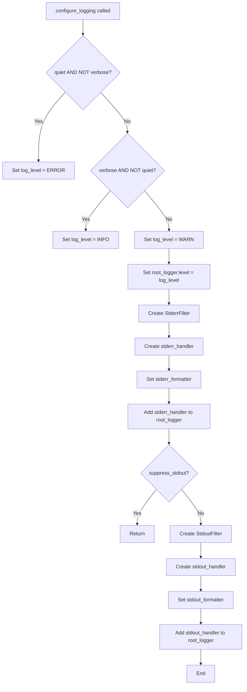
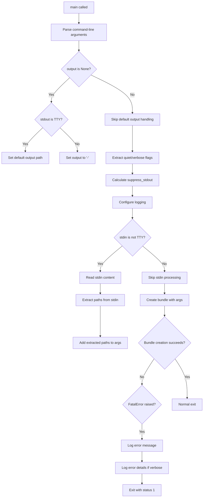

# `cli.py`

## `src.exodus_bundler.cli.parse_args` · *function*

## Summary:
Parses command-line arguments for the Exodus bundler tool and returns them as a dictionary.

## Description:
This function serves as the primary argument parser for the Exodus bundler CLI interface. It defines all available command-line options and positional arguments, then processes the provided arguments into a structured dictionary for downstream processing. The function is designed to be called by the main CLI entrypoint with either sys.argv or a custom argument list.

The logic is extracted into its own function to separate argument parsing concerns from the core bundling business logic, enabling better testability and maintainability of the CLI interface.

## Args:
    args (list[str], optional): Command-line arguments to parse. If None, uses sys.argv. Defaults to None.
    namespace (argparse.Namespace, optional): An existing namespace to populate. If None, creates a new one. Defaults to None.

## Returns:
    dict[str, object]: A dictionary mapping argument names to their parsed values. Keys include:
        - 'executables': list[str] - One or more ELF executable paths (required)
        - 'chroot': str or None - Path to chroot directory for linking
        - 'add': list[str] - Additional dependency files to include
        - 'detect': bool - Whether to auto-detect dependencies
        - 'no_symlink': list[str] - Files that should not be symlinked
        - 'output': str or None - Output file path
        - 'quiet': bool - Suppress warning messages
        - 'rename': list[str] or None - New names for executables
        - 'shell_launchers': bool - Force shell launchers over static linking
        - 'tarball': bool - Create tarball instead of installation script
        - 'verbose': bool - Output additional informational messages

## Raises:
    SystemExit: When invalid arguments are provided or help is requested.

## Constraints:
    Preconditions:
        - The function must be called with valid argument types
        - If 'rename' is provided, it must match the number of executables
        - If 'chroot' is provided, it must be a valid directory path
        - If 'output' is provided, it must be a valid file path or stdout/stderr
    
    Postconditions:
        - All arguments are validated according to their defined types and constraints
        - The returned dictionary contains all parsed arguments with appropriate defaults
        - Invalid arguments result in SystemExit being raised

## Side Effects:
    - Prints help text to stdout when --help is used
    - Prints error messages to stderr when invalid arguments are provided
    - May exit the program with status code 2 for argument parsing errors

## Control Flow:
```mermaid
flowchart TD
    A[Start parse_args] --> B{args provided?}
    B -->|Yes| C[Use provided args]
    B -->|No| D[Use sys.argv]
    C --> E[Parsing begins]
    D --> E
    E --> F[Parse executables (required)]
    F --> G[Parse chroot option]
    G --> H[Parse add option]
    H --> I[Parse detect flag]
    I --> J[Parse no_symlink option]
    J --> K[Parse output option]
    K --> L[Parse quiet flag]
    L --> M[Parse rename option]
    M --> N[Parse shell_launchers flag]
    N --> O[Parse tarball flag]
    O --> P[Parse verbose flag]
    P --> Q[Return parsed args as dict]
```

## Examples:
```python
# Basic usage with default arguments
parsed_args = parse_args(['myapp'])

# Usage with multiple options
parsed_args = parse_args([
    'myapp', 
    '-c', '/path/to/chroot',
    '-a', '/lib/custom.so',
    '-o', 'bundle.tgz',
    '--tarball'
])

# Usage with renaming
parsed_args = parse_args([
    'myapp', 
    '-r', 'renamed_app'
])
```

## `src.exodus_bundler.cli.configure_logging` · *function*

## Summary:
Configures the application's logging system with appropriate levels and handlers based on command-line flags.

## Description:
This function sets up logging for the Exodus bundler CLI application by configuring the root logger with appropriate log levels and handlers. It handles different verbosity levels (quiet, verbose) and manages output routing to stdout and stderr based on log level and suppression settings. The function is designed to be called early in the CLI lifecycle to establish proper logging behavior before other components begin logging messages.

## Args:
    quiet (bool): When True, sets logging level to ERROR to suppress INFO and WARNING messages.
    verbose (bool): When True, sets logging level to INFO to enable more detailed logging.
    suppress_stdout (bool): When True, prevents stdout logging handlers from being added. Defaults to False.

## Returns:
    None: This function does not return any value.

## Raises:
    None: This function does not explicitly raise any exceptions.

## Constraints:
    Preconditions:
        - The `root_logger` must be properly initialized before calling this function.
        - The `quiet` and `verbose` parameters should not both be True simultaneously (though the function handles this gracefully).
    Postconditions:
        - The global `root_logger` is configured with appropriate log level.
        - Either one or two logging handlers are added to the root logger (stderr handler is always added, stdout handler is optional).

## Side Effects:
    - Modifies the global `root_logger` configuration by setting its level and adding handlers.
    - Adds StreamHandlers to `sys.stderr` and potentially `sys.stdout`.
    - Uses `sys.stderr` and `sys.stdout` for logging output.

## Control Flow:


## Examples:
    # Configure for normal operation with INFO logging
    configure_logging(quiet=False, verbose=True)
    
    # Configure for quiet operation, only showing errors
    configure_logging(quiet=True, verbose=False)
    
    # Configure for verbose output but suppress stdout logging
    configure_logging(quiet=False, verbose=True, suppress_stdout=True)
```

## `src.exodus_bundler.cli.StderrFilter` · *class*

## Summary:
A logging filter that allows only WARNING and ERROR level log records to pass through.

## Description:
The StderrFilter class is a specialized logging filter designed to control which log messages are processed by a logger. It specifically permits only WARNING and ERROR level messages to continue through the logging pipeline, effectively filtering out INFO, DEBUG, and other lower severity messages. This filter is typically used to direct warning and error messages to stderr while allowing other log levels to be handled differently.

## State:
- The class inherits from logging.Filter and does not introduce any new instance attributes
- The filter method operates purely on the log record's levelno attribute
- No class invariants apply as there are no persistent state variables

## Lifecycle:
- Creation: Instantiated as a standard logging.Filter subclass; no special constructor arguments required
- Usage: Applied to a logging handler via addFilter() method or through logging configuration
- Destruction: Managed automatically by Python's garbage collection; no explicit cleanup required

## Method Map:
```mermaid
graph TD
    A[StderrFilter.filter(record)] --> B{record.levelno in (WARN, ERROR)?}
    B -- Yes --> C[return True]
    B -- No --> D[return False]
```

## Raises:
- No exceptions are raised by the constructor (__init__)
- The filter method itself does not raise any exceptions

## Example:
```python
import logging
from exodus_bundler.cli import StderrFilter

# Create a logger
logger = logging.getLogger('example')
logger.setLevel(logging.DEBUG)

# Create a handler that outputs to stderr
stderr_handler = logging.StreamHandler(sys.stderr)
stderr_handler.setLevel(logging.DEBUG)

# Add the StderrFilter to the handler
stderr_handler.addFilter(StderrFilter())

# Add handler to logger
logger.addHandler(stderr_handler)

# These will be filtered out (INFO, DEBUG)
logger.info("This message will be ignored")
logger.debug("This debug message will be ignored")

# These will pass through (WARNING, ERROR)
logger.warning("This warning will appear")
logger.error("This error will appear")
```

### `src.exodus_bundler.cli.StderrFilter.filter` · *method*

## Summary:
Filters log records to allow only WARNING and ERROR level messages to pass through to standard error output.

## Description:
This method implements a custom logging filter that determines whether a given log record should be processed by the associated logging handler. It specifically permits only WARNING and ERROR level log messages to continue through the filtering chain, effectively suppressing INFO and DEBUG level messages from appearing in standard error output.

The filter is designed to be used with Python's logging module's Filter mechanism, where it acts as a gatekeeper for log records destined for stderr. This allows the application to control which severity levels of log messages are displayed to users via stderr while maintaining more verbose logging internally.

## Args:
    record (logging.LogRecord): A single log record containing metadata about the logged event including level number, message, timestamp, etc.

## Returns:
    bool: True if the record's level number matches either logging.WARN (30) or logging.ERROR (40), False otherwise.

## Raises:
    None explicitly raised by this method.

## State Changes:
    Attributes READ: None - this method only reads the record parameter
    Attributes WRITTEN: None - this method does not modify any instance attributes

## Constraints:
    Preconditions: The record parameter must be a valid logging.LogRecord instance with a levelno attribute
    Postconditions: The returned boolean value accurately reflects whether the record level matches the allowed set

## Side Effects:
    None - this method performs no I/O operations or external service calls

## `src.exodus_bundler.cli.StdoutFilter` · *class*

## Summary:
A logging filter that permits only DEBUG and INFO level log records to pass through.

## Description:
The StdoutFilter class is a specialized logging filter designed to control which log messages are displayed on standard output. It extends Python's built-in logging.Filter base class and implements a filter method that selectively allows only DEBUG and INFO level messages to continue through the logging pipeline. This is particularly useful for creating cleaner console output by suppressing WARNING, ERROR, and CRITICAL level messages that might clutter the terminal during normal operation.

## State:
- The class inherits from logging.Filter and does not introduce any new instance attributes
- The filter method operates on a log record object and returns a boolean value
- No constructor parameters or initialization state required

## Lifecycle:
- Creation: Instantiated as a standard class without special constructor arguments
- Usage: Automatically invoked by the Python logging system when a log record is processed
- Destruction: Managed automatically by Python's garbage collection

## Method Map:
```mermaid
graph TD
    A[Log Record] --> B[StdoutFilter.filter()]
    B --> C{levelno in (DEBUG, INFO)?}
    C -->|Yes| D[Return True]
    C -->|No| E[Return False]
```

## Raises:
- No exceptions are raised by the constructor
- The filter method itself does not raise exceptions but may fail if the record parameter is not a valid logging.LogRecord instance

## Example:
```python
import logging
from exodus_bundler.cli import StdoutFilter

# Create logger
logger = logging.getLogger('example')
logger.setLevel(logging.DEBUG)

# Add stdout filter to handler
handler = logging.StreamHandler()
handler.addFilter(StdoutFilter())
logger.addHandler(handler)

# These will appear in output
logger.debug("Debug message")
logger.info("Info message")

# These will be filtered out
logger.warning("Warning message")
logger.error("Error message")
```

### `src.exodus_bundler.cli.StdoutFilter.filter` · *method*

## Summary:
Filters log records to allow only DEBUG and INFO level messages to pass through to standard output.

## Description:
This method implements a logging filter that determines whether a given log record should be processed by the associated logging handler. It specifically permits DEBUG and INFO level log messages while blocking all other levels such as WARNING, ERROR, and CRITICAL.

The filter is designed to be used with Python's logging module to control which log messages are displayed on standard output, helping to reduce noise in the console output during normal operation while still allowing debug information to be shown when needed.

## Args:
    record (logging.LogRecord): A log record object containing information about the log event including level number, message, timestamp, etc.

## Returns:
    bool: True if the record's level number is either logging.DEBUG (10) or logging.INFO (20), False otherwise.

## Raises:
    None explicitly raised by this method.

## State Changes:
    Attributes READ: None - this method only reads from the input parameter
    Attributes WRITTEN: None - this method does not modify any instance attributes

## Constraints:
    Preconditions: The record parameter must be a valid logging.LogRecord instance
    Postconditions: The return value is always a boolean indicating whether the record should be processed

## Side Effects:
    None - this method performs no I/O operations or external service calls

## `src.exodus_bundler.cli.main` · *function*

## Summary:
Main entry point for the Exodus bundler CLI tool that processes command-line arguments, configures logging, handles stdin input, and orchestrates bundle creation.

## Description:
The `main` function serves as the central coordination point for the Exodus bundler command-line interface. It parses command-line arguments, sets up appropriate logging configuration, processes input from stdin when available, and delegates the actual bundle creation to the core bundling logic. This function encapsulates the complete CLI workflow from argument parsing through to bundle generation, handling error conditions and user-facing output appropriately.

The function is extracted into its own component to separate the CLI orchestration logic from the core bundling business logic, making the system more modular and testable. It handles the integration of various subsystems including argument parsing, logging setup, stdin processing, and error handling.

## Args:
    args (list[str], optional): Command-line arguments to parse. If None, uses sys.argv. Defaults to None.
    namespace (argparse.Namespace, optional): An existing namespace to populate. If None, creates a new one. Defaults to None.

## Returns:
    None: This function does not return a value directly, but may cause program termination via sys.exit().

## Raises:
    SystemExit: Raised when invalid arguments are provided or help is requested (handled by parse_args).
    FatalError: Raised when bundle creation fails with critical errors (handled internally).

## Constraints:
    Preconditions:
        - The function must be called with valid argument types
        - All required dependencies must be importable
        - The system must have appropriate file system permissions for bundle creation
    Postconditions:
        - Logging is properly configured before bundle creation begins
        - Input from stdin is processed if available and not connected to a TTY
        - Bundle creation proceeds with appropriate arguments
        - Program exits with status code 1 if fatal errors occur

## Side Effects:
    - Reads command-line arguments from sys.argv or provided args list
    - Configures global logging system via configure_logging
    - Reads from stdin when not connected to a TTY
    - Writes to stdout/stderr for logging and output
    - May create files on disk during bundle creation
    - May terminate the program via sys.exit()

## Control Flow:


## Examples:
    # Basic usage with default arguments
    main(['myapp'])
    
    # Usage with multiple options
    main([
        'myapp', 
        '-c', '/path/to/chroot',
        '-a', '/lib/custom.so',
        '-o', 'bundle.tgz',
        '--tarball'
    ])
    
    # Usage with stdin input
    import sys
    from unittest.mock import patch
    with patch('sys.stdin.read', return_value='/lib/libfoo.so\n/usr/bin/bar'):
        main(['myapp', '--detect'])
```

