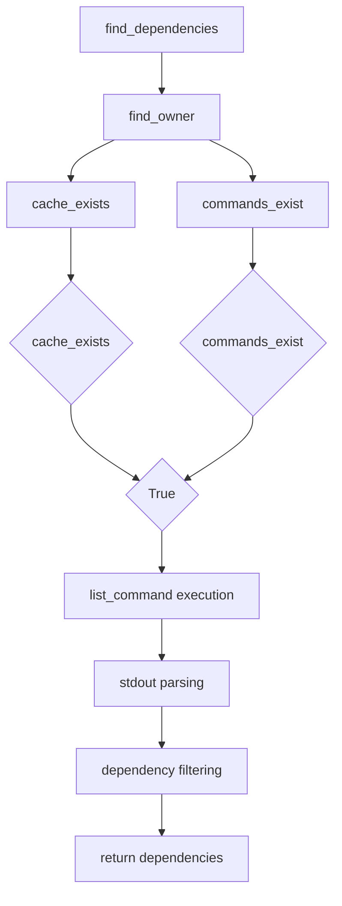

# `dependency_detection.py`

## `src.exodus_bundler.dependency_detection.PackageManager` · *class*

## Summary:
A base class for package managers that provides methods to discover dependencies and owners of files using system commands.

## Description:
The PackageManager class serves as an abstract base class for implementing package management systems that can identify file dependencies and ownership using command-line tools. It defines the interface for package managers to integrate with the dependency detection system. This class is designed to be subclassed with specific implementations for different package managers like apt, yum, etc.

## State:
- cache_directory: str, path to the package manager's cache directory; must be set by subclasses
- list_command: list[str], command and arguments to list package dependencies; must be set by subclasses  
- list_regex: str, regular expression pattern to extract dependency paths from list command output; defaults to '(.*)'
- owner_command: list[str], command and arguments to find package owner of a file; must be set by subclasses
- owner_regex: str, regular expression pattern to extract package name from owner command output; defaults to '(.*)'

## Lifecycle:
- Creation: Instantiate subclasses that properly initialize all class variables (cache_directory, list_command, owner_command)
- Usage: Call find_dependencies() with a file path to discover dependencies, or find_owner() to find which package owns a file
- Destruction: No explicit cleanup required; uses standard Python garbage collection

## Method Map:


## Raises:
- None explicitly raised by __init__
- May return None from find_dependencies() or find_owner() when prerequisites aren't met

## Example:
```python
# Typical usage would involve subclassing:
class AptPackageManager(PackageManager):
    cache_directory = '/var/cache/apt'
    list_command = ['dpkg-query', '-L']
    owner_command = ['dpkg', '-S']

# Then use it:
pm = AptPackageManager()
dependencies = pm.find_dependencies('/usr/bin/python3')
```

### `src.exodus_bundler.dependency_detection.PackageManager.find_dependencies` · *method*

## Summary:
Finds and returns the list of file dependencies for a given path by identifying the owner and parsing its dependency listing.

## Description:
This method identifies the owner of a given file path, executes a command to list its dependencies, and parses the output to extract valid file paths. It is designed to work with package managers that support dependency listing via command-line tools. The method is part of the dependency detection pipeline and is typically called during the bundling process to collect transitive dependencies.

## Args:
    path (str): The absolute or relative path to the file whose dependencies are to be discovered.

## Returns:
    list[str] or None: A list of absolute paths to the dependencies of the given file, or None if no owner could be determined.

## Raises:
    None explicitly raised, though underlying subprocess operations may raise OSError or subprocess.SubprocessError.

## State Changes:
    Attributes READ: self.find_owner, self.list_command, self.list_regex, self.cache_exists, self.commands_exist
    Attributes WRITTEN: None

## Constraints:
    Preconditions:
        - The PackageManager instance must have valid list_command and owner_command configured.
        - The cache_directory must exist and be a directory.
        - The path argument must be a valid string representing a file path.
        - The commands referenced by list_command and owner_command must be available in the system PATH.
    Postconditions:
        - If owner is found, the returned list contains only existing regular files (not directories).
        - If owner is not found, None is returned.

## Side Effects:
    - Executes external subprocess commands defined by list_command and owner_command.
    - Reads environment variables (LC_ALL=C) during subprocess execution.
    - May perform filesystem operations to check existence of dependency paths.

### `src.exodus_bundler.dependency_detection.PackageManager.find_owner` · *method*

## Summary:
Determines the owner package of a file by executing a system command and parsing its output.

## Description:
This method identifies which package owns a given file path by running an external command and extracting the package name using a regular expression. It is used during dependency analysis to map file paths to their originating packages. The method first validates that required configuration is available before proceeding with the command execution.

## Args:
    path (str): The absolute path to the file whose owner needs to be determined.

## Returns:
    str or None: The name of the package that owns the file, or None if either cache configuration or command configuration is invalid, or if no matching pattern is found in the command output.

## Raises:
    None explicitly raised.

## State Changes:
    Attributes READ: self.cache_exists, self.commands_exist, self.owner_command, self.owner_regex
    Attributes WRITTEN: None

## Constraints:
    Preconditions: The PackageManager instance must have valid cache configuration (cache_exists=True) and command configuration (commands_exist=True).
    Postconditions: If successful, returns the matched package name from the command output; otherwise returns None.

## Side Effects:
    I/O: Executes an external subprocess command and reads its output.
    External service calls: Invokes system-level commands via subprocess.

### `src.exodus_bundler.dependency_detection.PackageManager.cache_exists` · *method*

## Summary:
Checks whether the package manager's cache directory exists and is a valid directory.

## Description:
This method determines if the cache directory configured for the package manager is both present in the filesystem and is a directory. It is used primarily as a property to validate the existence of the cache before performing operations that depend on it.

## Args:
    None

## Returns:
    bool: True if the cache directory exists and is a directory; False otherwise.

## Raises:
    None

## State Changes:
    Attributes READ: self.cache_directory
    Attributes WRITTEN: None

## Constraints:
    Preconditions: The PackageManager instance must have a cache_directory attribute set to a valid path string.
    Postconditions: The method returns a boolean indicating the existence and type of the cache directory.

## Side Effects:
    None

### `src.exodus_bundler.dependency_detection.PackageManager.commands_exist` · *method*

## Summary:
Checks whether the required system commands for package listing and ownership resolution are available in the system PATH.

## Description:
This method verifies that both the package list command and owner resolution command are executable and accessible in the system's PATH. It is designed to be called during initialization or validation phases to ensure the PackageManager can function properly. The method uses the find_executable utility to check command availability - returning True only if both commands are found and executable.

## Args:
    None

## Returns:
    bool: True if both commands are found and executable (find_executable returns a path string), False otherwise (find_executable returns None for either command).

## Raises:
    None

## State Changes:
    Attributes READ: self.list_command, self.owner_command
    Attributes WRITTEN: None

## Constraints:
    Preconditions: 
    - self.list_command must be a sequence with at least one element (command name)
    - self.owner_command must be a sequence with at least one element (command name)
    - Both sequences should contain command names as their first elements
    Postconditions: 
    - Returns a boolean indicating command availability status

## Side Effects:
    None

## `src.exodus_bundler.dependency_detection.Apt` · *class*

## Summary:
A package manager implementation for Debian-based systems using the Advanced Package Tool (APT) and dpkg utilities.

## Description:
The Apt class implements the PackageManager abstract base class specifically for Debian-based Linux distributions. It provides methods to discover file dependencies and identify which package owns a given file using dpkg-query and dpkg command-line tools. This class is designed to work with the APT package management system and integrates with the broader dependency detection framework.

## State:
- cache_directory: str, path to the APT cache directory ('/var/cache/apt')
- list_command: list[str], command to list package dependencies ['dpkg-query', '-L']
- list_regex: str, regular expression pattern to extract dependency paths from list command output '(.+)'
- owner_command: list[str], command to find package owner of a file ['dpkg', '-S']
- owner_regex: str, regular expression pattern to extract package name from owner command output '(.+): '

## Lifecycle:
- Creation: Instantiate directly as it inherits from PackageManager with all required class variables defined
- Usage: Call find_dependencies() to discover dependencies of a file, or find_owner() to find which package owns a file
- Destruction: No special cleanup required; uses standard Python garbage collection

## Method Map:


## Raises:
- None explicitly raised by __init__
- May raise subprocess-related exceptions during command execution if commands are not available or fail

## Example:
```python
# Create an instance of the APT package manager
apt_manager = Apt()

# Find dependencies of a file
dependencies = apt_manager.find_dependencies('/usr/bin/python3')

# Find which package owns a file
owner = apt_manager.find_owner('/lib/x86_64-linux-gnu/libc.so.6')
```

## `src.exodus_bundler.dependency_detection.Pacman` · *class*

## Summary:
A package manager implementation for Arch Linux's Pacman package manager that discovers file dependencies and package ownership using system commands.

## Description:
The Pacman class extends PackageManager to provide specific functionality for Arch Linux systems. It implements the interface for discovering which packages own files and which files are dependencies of installed packages. This class is designed to work with the Pacman package manager's command-line tools to perform dependency analysis.

## State:
- cache_directory: str, path to the Pacman cache directory ('/var/cache/pacman')
- list_command: list[str], command to list package file dependencies (['pacman', '-Ql'])
- list_regex: str, regex pattern to extract file paths from list command output (r'.*\s+(\/.+)')  
- owner_command: list[str], command to find package ownership of files (['pacman', '-Qo'])
- owner_regex: str, regex pattern to extract package names from owner command output (r' is owned by (.*)\s+.*')

## Lifecycle:
- Creation: Instantiate directly as it inherits all required functionality from PackageManager
- Usage: Call find_dependencies() to discover dependencies of a file, or find_owner() to find which package owns a file
- Destruction: No special cleanup required; uses standard Python garbage collection

## Method Map:


## Raises:
- None explicitly raised by __init__
- May raise exceptions from parent PackageManager methods when commands fail or prerequisites aren't met

## Example:
```python
# Create a Pacman instance
pm = Pacman()

# Find dependencies of a file
dependencies = pm.find_dependencies('/usr/bin/python3')

# Find which package owns a file
owner = pm.find_owner('/etc/passwd')
```

## `src.exodus_bundler.dependency_detection.Yum` · *class*

## Summary:
A package manager implementation for YUM (Yellowdog Updater Modified) that extends PackageManager to detect file dependencies and owners using RPM commands.

## Description:
The Yum class implements the PackageManager abstract base class specifically for YUM-based Linux distributions. It provides methods to discover dependencies of files and identify which package owns a given file by leveraging RPM's command-line tools. This class is designed to work with systems that use YUM as their package manager and RPM as their package format.

## State:
- cache_directory: str, path to YUM's cache directory ('/var/cache/yum')
- list_command: list[str], command to list package file contents ('['rpm', '-ql']')
- list_regex: str, regular expression pattern to extract dependency paths from rpm -ql output (r'(.+)')
- owner_command: list[str], command to find package owner of a file ('['rpm', '-qf']')
- owner_regex: str, regular expression pattern to extract package name from rpm -qf output (r'(.+)')

## Lifecycle:
- Creation: Instantiate directly as Yum() - no special constructor requirements
- Usage: Call find_dependencies() to discover dependencies of a file, or find_owner() to find which package owns a file
- Destruction: No explicit cleanup required; uses standard Python garbage collection

## Method Map:


## Raises:
- None explicitly raised by __init__
- May return None from find_dependencies() or find_owner() when prerequisites aren't met

## Example:
```python
# Create YUM package manager instance
yum_manager = Yum()

# Find dependencies of a file
dependencies = yum_manager.find_dependencies('/usr/bin/python3')

# Find which package owns a file
owner_package = yum_manager.find_owner('/lib/libc.so.6')
```

## `src.exodus_bundler.dependency_detection.detect_dependencies` · *function*

## Summary:
Detects project dependencies by iterating through available package managers until a valid dependency list is found.

## Description:
This function serves as the primary entry point for dependency detection in the Exodus bundler system. It sequentially tests each registered package manager to identify dependencies for a given project path. The function leverages the principle that different projects may use different package management systems (npm, pip, etc.), so it tries each one until one successfully identifies dependencies. This approach allows the bundler to be agnostic to the specific package management system used by a project.

The function is extracted into its own component to encapsulate the dependency resolution logic and provide a clean interface for the rest of the bundler system. This separation ensures that dependency detection concerns are isolated from other bundling operations, making the system more modular and maintainable.

## Args:
    path (str): The absolute or relative path to the project directory for which dependencies need to be detected.

## Returns:
    list[str] or None: A list of detected dependencies if any package manager successfully identifies them, or None if no dependencies are found across all package managers.

## Raises:
    None explicitly raised by this function.

## Constraints:
    Preconditions:
    - The path argument must be a valid string representing a directory path.
    - The package_managers variable must be defined and contain a list of objects with a find_dependencies method.
    
    Postconditions:
    - If dependencies are found, the returned list contains valid dependency identifiers.
    - If no dependencies are found, None is returned.

## Side Effects:
    - May execute system commands or file system operations through the underlying package managers.
    - No direct I/O to standard streams or external services beyond what package managers perform.

## Control Flow:
```mermaid
flowchart TD
    A[Start detect_dependencies] --> B{Iterate package_managers}
    B --> C[Call package_manager.find_dependencies(path)]
    C --> D{Dependencies found?}
    D -- Yes --> E[Return dependencies]
    D -- No --> F[Continue loop]
    F --> B
    B --> G[Return None]
```

## Examples:
    # Example 1: Successful dependency detection
    dependencies = detect_dependencies('/path/to/node/project')
    if dependencies:
        print(f"Found {len(dependencies)} dependencies")
    else:
        print("No dependencies detected")

    # Example 2: No dependencies found
    result = detect_dependencies('/path/to/empty/project')
    assert result is None
```

