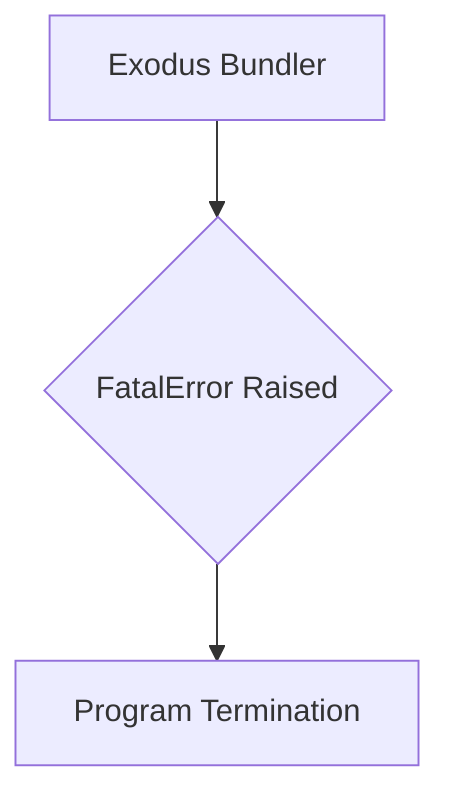
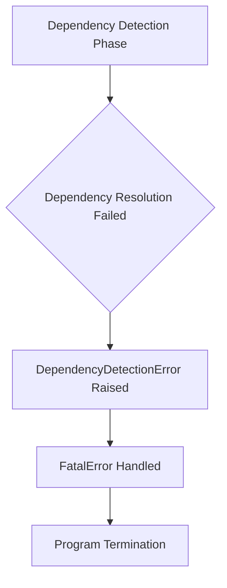
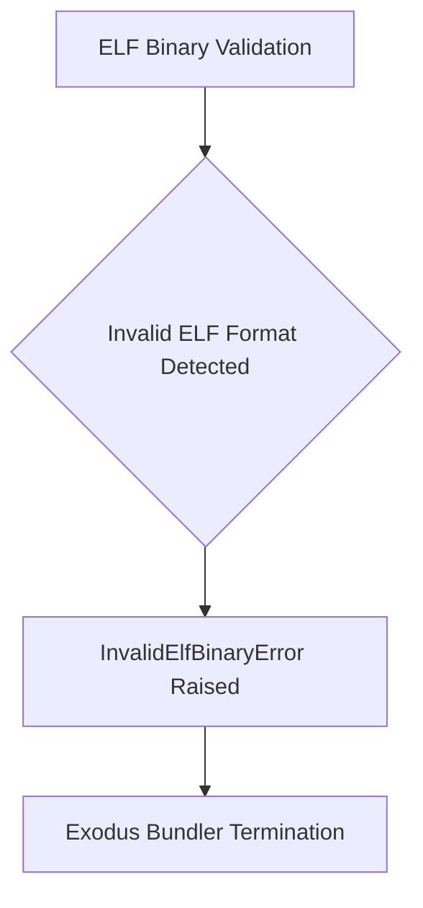
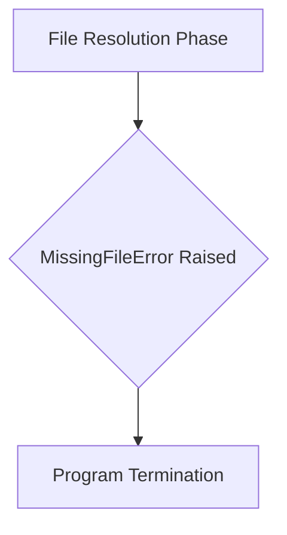
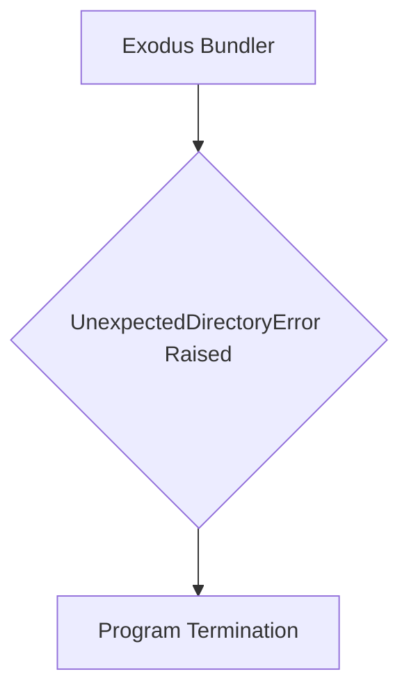
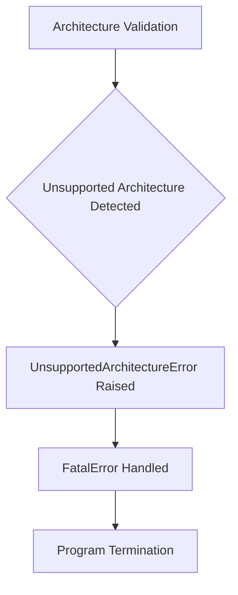

# `errors.py`

## `src.exodus_bundler.errors.FatalError` · *class*

## Summary:
Represents a critical error that terminates the Exodus bundler execution.

## Description:
FatalError is a custom exception class that extends Python's built-in Exception class. It serves as a distinct abstraction for errors that should halt the bundling process immediately, preventing further execution. This class is used throughout the Exodus bundler to signal unrecoverable issues such as configuration problems, missing dependencies, or critical runtime failures that cannot be gracefully handled.

## State:
The class has no instance attributes beyond those inherited from Exception. It maintains no internal state and serves purely as an error signaling mechanism.

## Lifecycle:
Creation: Instantiated directly with optional error message string argument.
Usage: Raised using 'raise' keyword to terminate program execution when fatal conditions occur.
Destruction: Automatically cleaned up by Python's exception handling mechanism.

## Method Map:


## Raises:
None - this class itself does not raise exceptions, but instances may be raised during program execution.

## Example:
```python
try:
    # Some operation that might fail fatally
    if not validate_config():
        raise FatalError("Invalid configuration detected")
except FatalError as e:
    print(f"Fatal error occurred: {e}")
    sys.exit(1)
```

## `src.exodus_bundler.errors.DependencyDetectionError` · *class*

## Summary:
Represents a critical error that occurs during dependency detection in the Exodus bundler, terminating execution when dependencies cannot be resolved.

## Description:
DependencyDetectionError is a custom exception that extends FatalError and is specifically raised when the bundler encounters issues during the dependency detection phase. This error indicates that the bundling process cannot proceed because essential dependencies are missing, incompatible, or cannot be resolved. The exception serves as a clear signal to halt execution immediately, as dependency resolution is fundamental to successful bundling.

## State:
This class inherits all state from FatalError and maintains no additional instance attributes. It relies entirely on the standard Exception behavior for storing error messages and tracebacks.

## Lifecycle:
Creation: Instantiated directly with an optional error message string argument, typically passed to the parent FatalError constructor.
Usage: Raised using the 'raise' keyword when dependency detection fails, causing immediate termination of the bundling process.
Destruction: Automatically cleaned up by Python's exception handling mechanism when the exception propagates up the call stack.

## Method Map:


## Raises:
None - this class itself does not raise exceptions, but instances may be raised during dependency detection operations.

## Example:
```python
try:
    # Attempt to resolve dependencies
    resolved_deps = resolve_dependencies(package_list)
    if not resolved_deps:
        raise DependencyDetectionError("Failed to resolve all dependencies")
except DependencyDetectionError as e:
    print(f"Critical dependency issue: {e}")
    sys.exit(1)
```

## `src.exodus_bundler.errors.InvalidElfBinaryError` · *class*

## Summary:
Represents a critical error indicating that an ELF binary is invalid or corrupted, requiring the Exodus bundler to terminate execution.

## Description:
InvalidElfBinaryError is a custom exception that extends FatalError and is specifically designed to signal when the bundler encounters an ELF binary that cannot be processed due to structural corruption, invalid format, or other fundamental issues. This exception is raised during ELF binary validation and processing phases to prevent further execution when encountering irreparable binary inconsistencies. The error serves as a distinct abstraction to differentiate ELF-specific fatal failures from other types of critical errors in the bundling process.

## State:
This class inherits all state characteristics from FatalError and maintains no additional instance attributes. It relies entirely on the standard Exception class behavior for storing error messages and tracebacks.

## Lifecycle:
Creation: Instantiated directly with an optional error message string argument, typically during ELF binary validation operations.
Usage: Raised using the 'raise' keyword when an ELF binary fails validation checks, causing immediate termination of the bundling process.
Destruction: Automatically cleaned up by Python's exception handling mechanism when the exception propagates up the call stack.

## Method Map:


## Raises:
None - this class itself does not raise exceptions, but instances may be raised during program execution when ELF binary validation fails.

## Example:
```python
try:
    elf_binary = load_elf_binary("/path/to/binary")
    validate_elf_header(elf_binary)
except InvalidElfBinaryError as e:
    print(f"Cannot process ELF binary: {e}")
    sys.exit(1)
```

## `src.exodus_bundler.errors.MissingFileError` · *class*

## Summary:
Represents a critical error indicating that a required file is missing during the Exodus bundling process.

## Description:
MissingFileError is a custom exception that extends FatalError and is specifically raised when the bundler encounters a file dependency that cannot be located. This error halts execution immediately since the bundling process cannot proceed without essential files. The exception is typically raised during file resolution phases when checking for required assets, configuration files, or dependencies that are expected to exist in the project structure.

## State:
This class inherits all state from FatalError and maintains no additional instance attributes. It serves solely as an error signaling mechanism with no internal state to manage.

## Lifecycle:
Creation: Instantiated directly with optional error message string argument, inheriting all behaviors from FatalError.
Usage: Raised using 'raise' keyword when file lookup operations fail to locate required files.
Destruction: Automatically cleaned up by Python's exception handling mechanism.

## Method Map:


## Raises:
None - this class itself does not raise exceptions, but instances may be raised during program execution when file resolution fails.

## Example:
```python
try:
    # Attempt to resolve a required file
    resolved_path = resolve_file_path("config.json")
    if not os.path.exists(resolved_path):
        raise MissingFileError(f"Required file not found: {resolved_path}")
except MissingFileError as e:
    print(f"Fatal error occurred: {e}")
    sys.exit(1)
```

## `src.exodus_bundler.errors.UnexpectedDirectoryError` · *class*

## Summary:
Represents a critical error that occurs when an unexpected directory is encountered during the Exodus bundling process.

## Description:
UnexpectedDirectoryError is a custom exception that extends FatalError and is specifically raised when the bundler encounters a directory structure that violates expected conventions. This error signals a fundamental issue with the project's organization that prevents proper bundling. The exception is used to halt execution immediately, ensuring that invalid directory structures don't lead to corrupted builds or undefined behavior.

## State:
This class inherits all state from FatalError and maintains no additional instance attributes. It serves purely as an error signaling mechanism with no internal state to manage.

## Lifecycle:
Creation: Instantiated directly with optional error message string argument, inheriting all behaviors from FatalError.
Usage: Raised using 'raise' keyword when directory validation fails during bundling operations.
Destruction: Automatically cleaned up by Python's exception handling mechanism.

## Method Map:


## Raises:
None - this class itself does not raise exceptions, but instances may be raised during program execution when directory validation fails.

## Example:
```python
try:
    # Directory validation during bundling
    if not is_expected_directory_structure(project_path):
        raise UnexpectedDirectoryError("Unexpected directory structure detected")
except UnexpectedDirectoryError as e:
    print(f"Fatal error occurred: {e}")
    sys.exit(1)
```

## `src.exodus_bundler.errors.UnsupportedArchitectureError` · *class*

## Summary:
Represents a fatal error that occurs when the Exodus bundler encounters an unsupported architecture during the build process.

## Description:
UnsupportedArchitectureError is a custom exception that extends FatalError and is raised when the bundler detects that the current system architecture is not supported by the bundling process. This error halts execution immediately, preventing the creation of invalid bundles for unsupported platforms. The exception is typically raised during architecture validation phases when the system determines that the target platform or CPU architecture is incompatible with the bundling requirements.

## State:
This class inherits all state from FatalError and contains no additional instance attributes. It maintains no internal state beyond what is provided by the base Exception class.

## Lifecycle:
Creation: Instantiated directly with an optional error message describing the unsupported architecture. The error can be raised with or without a descriptive message.
Usage: Raised using the 'raise' keyword when architecture validation fails during the bundling process.
Destruction: Automatically cleaned up by Python's exception handling mechanism when the exception propagates up the call stack.

## Method Map:


## Raises:
None - this class itself does not raise exceptions, but instances may be raised during program execution when architecture validation fails.

## Example:
```python
# During architecture validation
if not is_supported_architecture(current_arch):
    raise UnsupportedArchitectureError(
        f"Architecture '{current_arch}' is not supported by this bundler"
    )
```

