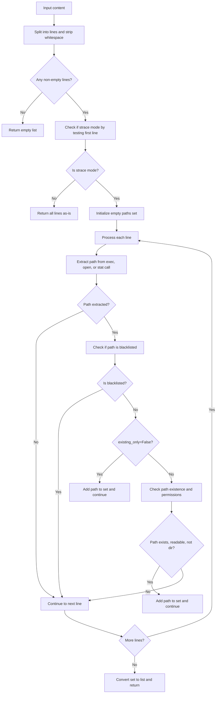

# `input_parsing.py`

## `src.exodus_bundler.input_parsing.extract_exec_path` · *function*

## Summary:
Extracts executable path from log lines containing execution method calls.

## Description:
Parses log lines that contain execution method calls (like 'execve("path", ...)' or 'execv("path", ...)') and extracts the first argument, which represents the executable path. This function processes lines that have already had process ID prefixes stripped by `strip_pid_prefix()`.

The logic is extracted into its own function to encapsulate the specific parsing behavior for execution method calls, separating this concern from general log line processing and making the code more modular and testable.

## Args:
    line (str): Input log line that may contain an execution method call with quoted path argument

## Returns:
    str or None: The extracted executable path if a matching execution method is found, otherwise None

## Raises:
    None

## Constraints:
    - Preconditions: Input must be a string
    - Postconditions: Returns either a string path or None, never raises exceptions

## Side Effects:
    None

## Control Flow:
```mermaid
flowchart TD
    A[Input line] --> B[Call strip_pid_prefix(line)]
    B --> C[Iterate through exec_methods]
    C --> D{Line starts with method + '("'}
    D -- Yes --> E[Remove prefix from line]
    E --> F[Split by '", ']
    F --> G{Parts length > 1}
    G -- Yes --> H[Return first part (executable path)]
    G -- No --> I[Continue to next method]
    D -- No --> I
    I --> J{All methods tried}
    J -- Yes --> K[Return None]
    J -- No --> C
    H --> L[Output]
    K --> L
```

## Examples:
    >>> extract_exec_path('execve("/bin/bash", ...)')
    '/bin/bash'
    
    >>> extract_exec_path('execv("/usr/bin/python", ...)')
    '/usr/bin/python'
    
    >>> extract_exec_path('[pid 1234] execve("/tmp/script.sh", ...)')
    '/tmp/script.sh'
    
    >>> extract_exec_path('Some unrelated log line')
    None
```

## `src.exodus_bundler.input_parsing.extract_open_path` · *function*

## Summary:
Extracts file paths from system call log entries that represent file opening operations.

## Description:
Parses log lines containing system call information to extract the file path when the operation is an 'open' or 'openat' call with specific flags. This function is designed to process structured log data where each line represents a system call with a specific format, extracting only those calls that open files for reading (O_RDONLY) and exclude directory operations or failed attempts.

The logic is extracted into its own function to encapsulate the complex parsing and filtering logic for file path extraction, separating it from higher-level processing logic and enabling reuse across different parts of the input parsing pipeline.

## Args:
    line (str): A log line potentially containing system call information in the format "openat(AT_FDCWD, \"path\", flags)" or "open(\"path\", flags)"

## Returns:
    str or None: The extracted file path if the line matches the expected format and contains a valid file opening operation, otherwise None

## Raises:
    None

## Constraints:
    - Preconditions: Input must be a string containing system call log data
    - Postconditions: Returns either a valid file path string or None, never other types

## Side Effects:
    None

## Control Flow:
```mermaid
flowchart TD
    A[Input line] --> B[Remove PID prefix]
    B --> C{Line starts with 'openat(AT_FDCWD, \"' or 'open(\"'}
    C -- No --> D[Return None]
    C -- Yes --> E[Split by '\", ']
    E --> F{Split result length == 2}
    F -- No --> D
    F -- Yes --> G{Contains 'ENOENT'}
    G -- Yes --> D
    G -- No --> H{Contains 'O_RDONLY'}
    H -- No --> D
    H -- Yes --> I{Contains 'O_DIRECTORY'}
    I -- Yes --> D
    I -- No --> J[Return first part (file path)]
    D --> K[Return None]
    J --> K
```

## Examples:
    >>> extract_open_path('openat(AT_FDCWD, "/etc/passwd", O_RDONLY|O_CLOEXEC)')
    '/etc/passwd'
    
    >>> extract_open_path('open("/tmp/test.txt", O_RDONLY)')
    '/tmp/test.txt'
    
    >>> extract_open_path('openat(AT_FDCWD, "/nonexistent", ENOENT)')
    None
    
    >>> extract_open_path('open("/var/log", O_RDONLY|O_DIRECTORY)')
    None
```

## `src.exodus_bundler.input_parsing.extract_stat_path` · *function*

## Summary:
Extracts the file path from a stat() system call log entry.

## Description:
Parses log lines containing stat() system calls to extract the file path argument. This function specifically handles log entries that begin with 'stat("' and extracts the first argument (the file path) while filtering out entries that indicate file not found errors (ENOENT).

The logic is extracted into its own function to encapsulate the specific parsing behavior for stat() calls, separating this concern from general log line processing and enabling reuse in different contexts.

## Args:
    line (str): A log line potentially containing a stat() system call in the format 'stat("file_path", ...)'.

## Returns:
    str or None: The extracted file path if the line matches the stat() pattern and does not indicate ENOENT error, otherwise None.

## Raises:
    None

## Constraints:
    - Preconditions: Input must be a string
    - Postconditions: Returns either a valid file path string or None

## Side Effects:
    None

## Control Flow:
```mermaid
flowchart TD
    A[Input line] --> B{Has prefix stat("}
    B -- No --> C[Return None]
    B -- Yes --> D[Remove prefix and split by ", "]
    D --> E{Exactly 2 parts AND no ENOENT}
    E -- No --> F[Return None]
    E -- Yes --> G[Return first part (file path)]
    F --> H[Output]
    G --> H
```

## Examples:
    >>> extract_stat_path('stat("test.txt", 0x7f8b8c000000)')
    'test.txt'
    
    >>> extract_stat_path('stat("nonexistent.txt", ENOENT)')
    None
    
    >>> extract_stat_path('[pid 1234] stat("config.json", 0x7f8b8c000000)')
    'config.json'
    
    >>> extract_stat_path('other log entry')
    None
```

## `src.exodus_bundler.input_parsing.extract_paths` · *function*

## Summary:
Extracts and filters file paths from log content, supporting both strace-style and raw path formats with optional existence checking and blacklisting.

## Description:
Processes log content containing system call traces or raw file paths, extracting file paths from various system call patterns (exec, open, stat) and applying filtering based on existence requirements and blacklisted directories. This function serves as the core path extraction logic for the Exodus bundler's input parsing pipeline.

The function is extracted into its own component to encapsulate the complex logic of:
1. Detecting strace-mode vs raw path mode
2. Parsing multiple system call types (exec, open, stat)
3. Applying existence checks and blacklisting filters
4. Handling different return modes (existing-only vs all paths)

This separation allows for clean testing of path extraction logic and enables reuse across different input processing pipelines.

## Args:
    content (str): Raw log content containing system call traces or newline-separated paths
    existing_only (bool): When True, only returns paths that exist on disk with read permissions and are not directories; when False, returns all extracted paths regardless of existence

## Returns:
    list[str]: A list of unique file paths extracted from the content, filtered according to the existing_only flag and blacklisted directories

## Raises:
    None

## Constraints:
    - Preconditions: Content must be a string
    - Postconditions: Returns a list of strings representing file paths, or empty list if no valid paths found

## Side Effects:
    - Performs filesystem operations (os.path.exists, os.access) when existing_only=True
    - May access the filesystem to validate path existence and permissions

## Control Flow:


## Examples:
    >>> extract_paths('execve("/bin/bash", ...)', existing_only=True)
    ['/bin/bash']
    
    >>> extract_paths('open("/etc/passwd", O_RDONLY)', existing_only=False)
    ['/etc/passwd']
    
    >>> extract_paths('execve("/nonexistent", ...)', existing_only=True)
    []
    
    >>> extract_paths('/tmp/file1\\n/tmp/file2', existing_only=True)
    ['/tmp/file1', '/tmp/file2']
```

## `src.exodus_bundler.input_parsing.strip_pid_prefix` · *function*

## Summary:
Removes process ID prefix from log lines that start with "[pid XXX] " format.

## Description:
This function strips leading process ID prefixes from log lines, commonly found in debugging output where each line is prefixed with "[pid <number>] ". The function identifies and removes these prefixes while preserving the rest of the line content. It is designed to clean log data for further processing or analysis.

The logic is extracted into its own function to separate the concern of log line preprocessing from the main parsing logic, making the code more modular and testable.

## Args:
    line (str): Input string that may contain a process ID prefix in the format "[pid <number>] "

## Returns:
    str: The input line with process ID prefix removed if present, otherwise returns the original line unchanged

## Raises:
    None

## Constraints:
    - Preconditions: Input must be a string
    - Postconditions: Output is always a string with the prefix stripped if it existed

## Side Effects:
    None

## Control Flow:
```mermaid
flowchart TD
    A[Input line] --> B{Matches pattern \\[pid\\s+\\d+\\]\\s*}
    B -- Yes --> C[Return line from position after match]
    B -- No --> D[Return original line]
    C --> E[Output]
    D --> E
```

## Examples:
    >>> strip_pid_prefix("[pid 1234] Application started")
    'Application started'
    
    >>> strip_pid_prefix("No prefix here")
    'No prefix here'
    
    >>> strip_pid_prefix("[pid 5678]   Extra spaces")
    'Extra spaces'
    
    >>> strip_pid_prefix("[pid 9999]   ")
    '  '
```

