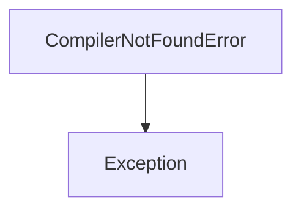
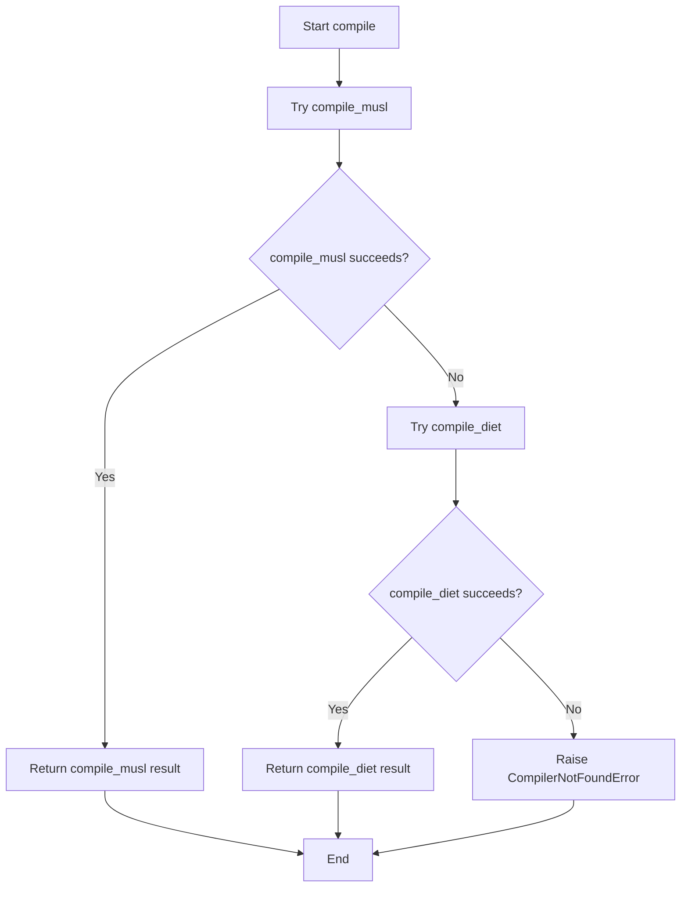
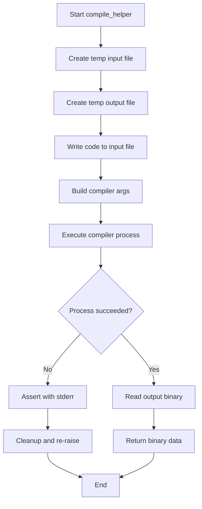
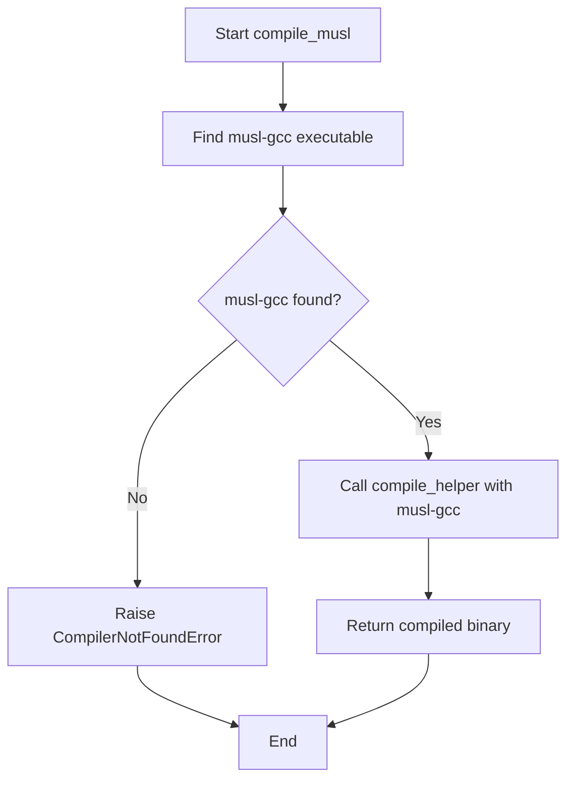
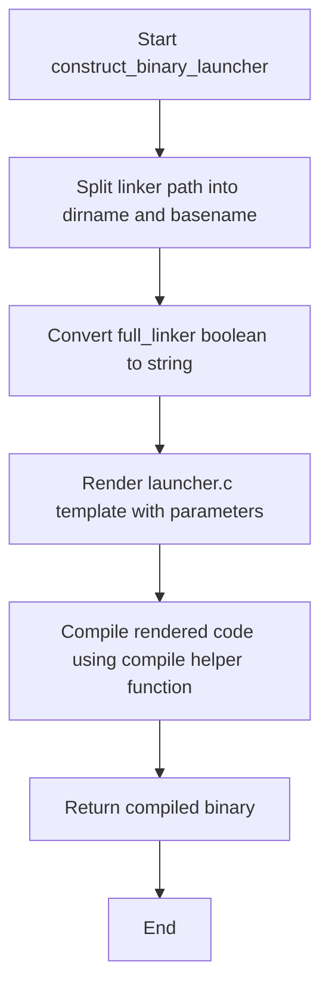

# `launchers.py`

## `src.exodus_bundler.launchers.CompilerNotFoundError` · *class*

## Summary:
Represents an exception raised when a required compiler cannot be located in the system environment.

## Description:
This exception is specifically designed to indicate that a compiler needed for building or processing code is not available in the system's PATH. It extends the standard Exception class and serves as a clear signal to calling code that a compilation step has failed due to missing tooling rather than other runtime issues.

## State:
The class has no instance attributes or state. It inherits all behavior from the base Exception class.

## Lifecycle:
Creation: Instances are created implicitly when the system fails to locate a required compiler, typically during build processes or code generation workflows. No special instantiation requirements exist beyond the standard Exception constructor.

Usage: The exception is raised by code that attempts to locate compilers using utility functions like find_executable, and is caught by higher-level error handling code to provide meaningful feedback to users about missing build tools.

Destruction: As with all Python exceptions, cleanup occurs automatically when the exception propagates out of scope.

## Method Map:


## Raises:
This class itself does not raise any exceptions. It is raised by other code components when compiler detection fails.

## Example:
```python
try:
    # Some code that looks for a compiler
    if not find_executable('gcc'):
        raise CompilerNotFoundError("GCC compiler not found in PATH")
except CompilerNotFoundError as e:
    print(f"Build error: {e}")
```

## `src.exodus_bundler.launchers.find_executable` · *function*

## Summary:
Finds an executable binary by searching standard paths and custom directory structures containing 64-character hexadecimal identifiers.

## Description:
This function extends the standard `distutils.spawn.find_executable` functionality by implementing a custom search mechanism for executables located within directories with 64-character hexadecimal names. It first attempts to locate the binary using the standard system PATH, and if that fails or is skipped, searches within a hierarchical directory structure where intermediate directories have 64-character hexadecimal names.

The function is designed to support a specific packaging or deployment scenario where binaries are organized under directories with cryptographic hash-like names, likely for security or identification purposes.

## Args:
    binary_name (str): Name of the executable to search for
    skip_original_for_testing (bool): When True, bypasses the standard PATH search and directly uses the custom search logic. Defaults to False.

## Returns:
    str or None: Path to the executable if found, None otherwise

## Raises:
    None explicitly raised

## Constraints:
    Preconditions:
        - The `binary_name` parameter must be a non-empty string
        - The `parent_directory` variable must be defined in the scope where this function is called
        - The `find_executable` function from distutils.spawn must be available in the namespace
    Postconditions:
        - Returns either a valid absolute path to an executable or None
        - Does not modify global state except potentially setting PATH environment variable

## Side Effects:
    - May modify the `PATH` environment variable if it's not set
    - Performs filesystem operations to check for executable existence
    - No external service calls or network I/O

## Control Flow:
```mermaid
flowchart TD
    A[Start find_executable] --> B{PATH set?}
    B -- No --> C[Set PATH='/bin/:/usr/bin/']
    C --> D[Call distutils.spawn.find_executable]
    B -- Yes --> D
    D --> E{Executable found?}
    E -- Yes --> F{skip_original_for_testing?}
    F -- Yes --> G[Return executable]
    F -- No --> G
    E -- No --> H[Initialize directory = parent_directory]
    H --> I[Loop: Split directory into dir/basename]
    I --> J{basename empty?}
    J -- Yes --> K[Break loop]
    J -- No --> L{basename matches [A-Fa-f0-9]{64}?}
    L -- No --> M[Continue loop]
    L -- Yes --> N[Iterate PATH directories]
    N --> O{Is abs path?}
    O -- Yes --> P[Get rel path from '/']
    O -- No --> P
    P --> Q[Construct candidate path]
    Q --> R{File exists?}
    R -- Yes --> S[Return candidate]
    R -- No --> T[Continue to next PATH dir]
    T --> U[Continue loop]
    U --> I
```

## Examples:
    # Basic usage
    executable_path = find_executable('myapp')
    
    # Skip standard PATH search for testing
    test_executable = find_executable('testapp', skip_original_for_testing=True)

## `src.exodus_bundler.launchers.compile` · *function*

## Summary:
Attempts to compile C code using multiple compiler strategies, falling back from musl-gcc to diet compiler if the primary compiler is unavailable.

## Description:
This function implements a robust compilation strategy that tries to compile C code using the musl-gcc compiler first, and falls back to the diet compiler if musl-gcc is not found. If neither compiler is available, it raises a CompilerNotFoundError with a descriptive message. This approach ensures maximum compatibility across different environments by providing alternative compilation paths.

The function is part of the Exodus bundler's launcher system and serves as the main entry point for C code compilation, abstracting away the complexity of compiler discovery and fallback mechanisms.

## Args:
    code (str): The C source code to be compiled as a string.

## Returns:
    bytes: The raw binary content of the compiled executable file produced by whichever compiler succeeds.

## Raises:
    CompilerNotFoundError: When neither musl-gcc nor diet compiler can be found in the system PATH, indicating that suitable compilation tools are unavailable.

## Constraints:
    Preconditions:
        - The system must have at least one of the supported compilers (musl-gcc or diet) installed and accessible via PATH
        - The `code` parameter must contain valid C source code that can be compiled by either compiler
    Postconditions:
        - If successful, returns compiled binary bytes representing a valid executable
        - If unsuccessful, raises CompilerNotFoundError indicating missing compilation tools

## Side Effects:
    - May execute external subprocess commands for compilation
    - May create temporary files during the compilation process (handled internally by compile_musl and compile_diet)
    - No direct file system modifications beyond temporary file operations

## Control Flow:


## `src.exodus_bundler.launchers.compile_diet` · *function*

## Summary:
Compiles C code using the diet compiler and GCC, returning the compiled binary output.

## Description:
This function serves as a specialized compilation entry point that verifies the presence of both the diet compiler and GCC before proceeding with compilation. It acts as a wrapper around the general-purpose compile_helper function, specifically configuring it to use diet and gcc as the compilation tools. The function is part of the Exodus bundler's launcher system, enabling the compilation of C code into executable binaries using the diet compiler toolchain.

## Args:
    code (str): The C source code to be compiled as a string.

## Returns:
    bytes: The raw binary content of the compiled executable file produced by the diet compiler workflow.

## Raises:
    CompilerNotFoundError: When either the diet compiler or GCC is not found in the system PATH.

## Constraints:
    Preconditions:
        - The system must have both 'diet' and 'gcc' executables available in the PATH.
        - The `code` parameter must contain valid C source code that can be processed by the diet compiler.
    Postconditions:
        - If successful, returns the compiled binary output from the diet compilation process.
        - If unsuccessful, raises CompilerNotFoundError indicating missing compilation tools.

## Side Effects:
    - Executes an external subprocess command using the diet and gcc compilers.
    - May create temporary files during the compilation process (handled internally by compile_helper).
    - No direct file system modifications beyond temporary file operations.

## Control Flow:
```mermaid
flowchart TD
    A[Start compile_diet] --> B[Find diet executable]
    B --> C[Find gcc executable]
    C --> D{Both found?}
    D -->|No| E[Raise CompilerNotFoundError]
    D -->|Yes| F[Call compile_helper with [diet, gcc]]
    E --> G[End]
    F --> H[Return compile_helper result]
    H --> G
```

## `src.exodus_bundler.launchers.compile_helper` · *function*

## Summary:
Compiles C code into a binary executable using system compiler tools and returns the compiled binary output.

## Description:
This function serves as a helper for compiling C source code into a static binary executable. It creates temporary files for input and output, writes the provided C code to a temporary input file, invokes a system compiler with specified arguments plus static linking and optimization flags, captures the compilation result, and cleans up temporary files. The function is designed to isolate compilation logic and provide a clean interface for executing external compilation processes.

## Args:
    code (str): The C source code to be compiled as a string.
    initial_args (list[str]): A list of command-line arguments to pass to the compiler, excluding the automatically added flags.

## Returns:
    bytes: The raw binary content of the compiled executable file.

## Raises:
    AssertionError: When the compilation process fails, with an error message containing the compiler's stderr output.

## Constraints:
    Preconditions:
        - The system must have a working C compiler installed (e.g., gcc, clang).
        - The `initial_args` list must contain valid compiler command-line options.
        - The `code` parameter must be valid C source code that can be compiled.
    Postconditions:
        - Temporary input and output files are always removed, regardless of success or failure.
        - The returned bytes represent a valid executable binary.

## Side Effects:
    - Creates two temporary files on disk with names starting with 'exodus-bundle-'.
    - Writes the provided C code to a temporary input file.
    - Executes an external subprocess command using the system compiler.
    - Removes temporary files after processing.

## Control Flow:


## Examples:
    # Basic usage with GCC
    c_code = "#include <stdio.h>\\nint main() { printf(\"Hello World\\n\"); return 0; }"
    result = compile_helper(c_code, ['gcc'])
    # Returns compiled binary bytes of the program

## `src.exodus_bundler.launchers.compile_musl` · *function*

## Summary:
Compiles C code using the musl-gcc compiler and returns the resulting binary executable.

## Description:
This function attempts to locate the musl-gcc compiler on the system and compile the provided C code into a binary executable. It leverages the find_executable function to search for musl-gcc and raises CompilerNotFoundError if it cannot be found. The actual compilation is delegated to compile_helper which handles the low-level compilation process.

The function serves as a specialized compilation entry point that ensures the musl toolchain is available before proceeding with compilation, providing a clear interface for the musl-based compilation workflow.

## Args:
    code (str): The C source code to be compiled as a string.

## Returns:
    bytes: The raw binary content of the compiled executable file produced by musl-gcc.

## Raises:
    CompilerNotFoundError: When the musl-gcc compiler cannot be located in the system PATH.

## Constraints:
    Preconditions:
        - The system must have musl-gcc installed and accessible via PATH
        - The `code` parameter must contain valid C source code that can be compiled
    Postconditions:
        - If successful, returns compiled binary bytes representing a valid executable
        - If unsuccessful, raises CompilerNotFoundError before any compilation attempt

## Side Effects:
    - Calls find_executable to search for musl-gcc in system PATH
    - Invokes compile_helper which creates temporary files and executes subprocess
    - May modify PATH environment variable if not already set (through find_executable)

## Control Flow:


## Examples:
    # Compile a simple C program using musl-gcc
    c_code = "#include <stdio.h>\\nint main() { printf(\"Hello World\\n\"); return 0; }"
    try:
        binary = compile_musl(c_code)
        # Returns compiled binary bytes
    except CompilerNotFoundError as e:
        print(f"Compilation failed: {e}")

## `src.exodus_bundler.launchers.construct_bash_launcher` · *function*

## Summary:
Constructs a bash launcher script by rendering a template with specified linker and execution parameters.

## Description:
This function generates a bash script launcher that wraps a specified executable with appropriate linker paths and configuration. It extracts directory and basename information from the linker path and uses a templating system to create the final launcher script. The function is designed to be used in bundling workflows where executables need to be launched with proper library paths and linker configurations.

The logic is extracted into its own function to separate the concerns of parameter preparation and template rendering, making the code more modular and testable. It also provides a clean interface for constructing launcher scripts without exposing the underlying templating mechanism.

## Args:
    linker (str): Path to the linker executable, used to extract directory and basename components
    library_path (str): Library path to be included in the generated launcher script
    executable (str): Path to the executable that will be launched by the generated script
    full_linker (bool): Flag indicating whether to use full linker path. Defaults to True

## Returns:
    str: The rendered bash launcher script content as a string

## Raises:
    FileNotFoundError: If the launcher.sh template file cannot be found
    IOError: If there are issues reading the template file or writing the output

## Constraints:
    Preconditions:
        - linker must be a valid path string
        - library_path must be a valid string representing a library path
        - executable must be a valid path string to an executable
        - template_directory must be properly configured in the templating module
    
    Postconditions:
        - Returns a valid bash script string with proper variable substitutions
        - The returned script will contain the provided linker information and executable path

## Side Effects:
    - Reads template file from disk (launcher.sh)
    - May raise file system related exceptions if template file is missing or inaccessible

## Control Flow:
```mermaid
flowchart TD
    A[Start construct_bash_launcher] --> B[Split linker path into dirname and basename using os.path.split]
    B --> C[Convert full_linker boolean to string ('true' or 'false')]
    C --> D[Call render_template_file with template launcher.sh and context variables]
    D --> E[Return rendered template content]
```

## Examples:
    # Basic usage
    launcher_script = construct_bash_launcher(
        linker="/usr/bin/gcc",
        library_path="/opt/myapp/lib",
        executable="/opt/myapp/bin/myapp"
    )
    
    # With full_linker=False
    launcher_script = construct_bash_launcher(
        linker="/usr/bin/gcc",
        library_path="/opt/myapp/lib",
        executable="/opt/myapp/bin/myapp",
        full_linker=False
    )

## `src.exodus_bundler.launchers.construct_binary_launcher` · *function*

## Summary:
Constructs a binary launcher by rendering a C template with configuration parameters and compiling the resulting code.

## Description:
Creates a binary executable launcher by templating C source code with linker and execution parameters, then compiling the result. This function serves as the primary interface for generating launcher binaries that can execute programs with specific linking requirements.

The function extracts directory and basename from the linker path, converts the boolean flag to a string representation, renders a C template with all configuration parameters, and compiles the resulting code into a binary executable. This approach enables dynamic generation of launchers tailored to specific linking configurations.

Known callers within the codebase:
- The function appears to be called from the main bundling process where launcher binaries are constructed for bundled applications.

## Args:
    linker (str): Path to the linker executable, used to extract directory and basename for template rendering.
    library_path (str): Path to the library directory to be embedded in the launcher.
    executable (str): Path to the target executable to be launched by the generated binary.
    full_linker (bool): Flag indicating whether to use full linker features. Defaults to True.

## Returns:
    bytes: The compiled binary executable containing the launcher code, representing the raw bytes of the compiled launcher binary.

## Raises:
    CompilerNotFoundError: When neither musl-gcc nor diet compiler can be found in the system PATH, preventing compilation of the launcher.

## Constraints:
    Preconditions:
        - The system must have at least one of the supported compilers (musl-gcc or diet) installed and accessible via PATH
        - The linker path must be a valid filesystem path
        - The library_path and executable parameters must be valid paths
    Postconditions:
        - Returns compiled binary bytes representing a valid executable launcher
        - The returned binary will execute the specified executable with the specified library path

## Side Effects:
    - May execute external subprocess commands for compilation
    - May create temporary files during the compilation process
    - No direct file system modifications beyond temporary file operations

## Control Flow:


